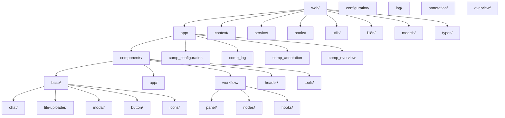
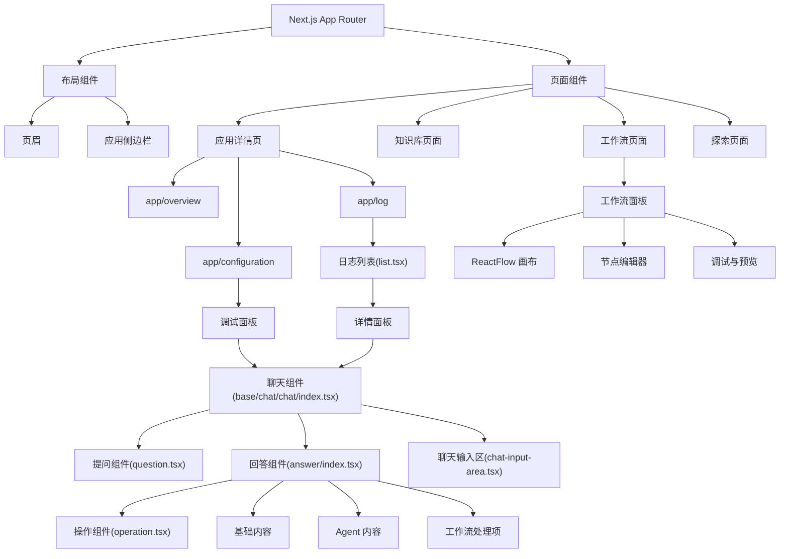
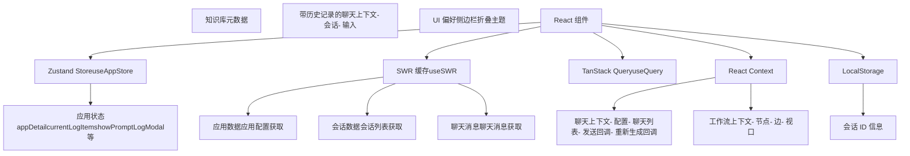
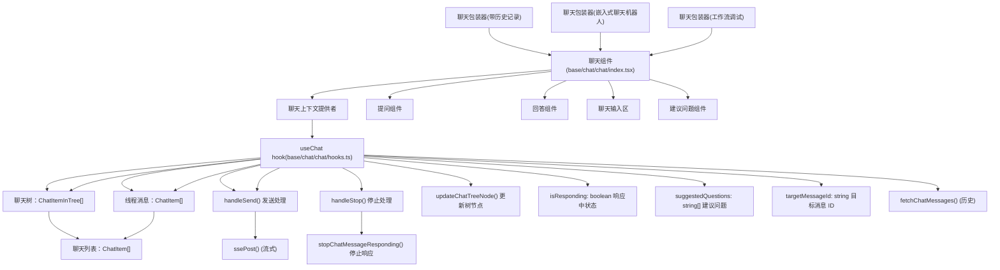
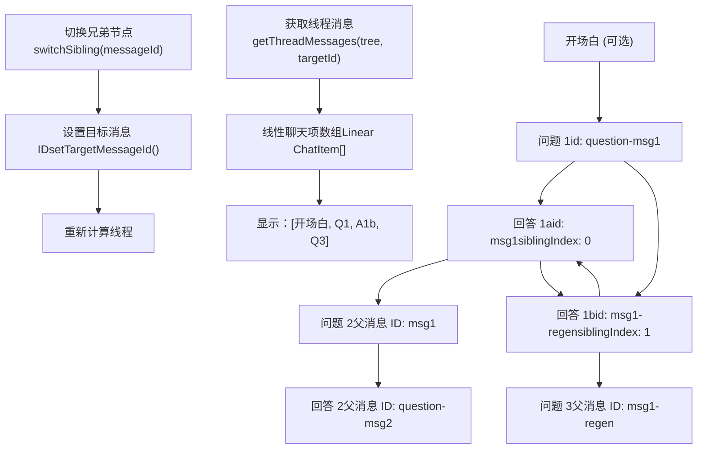
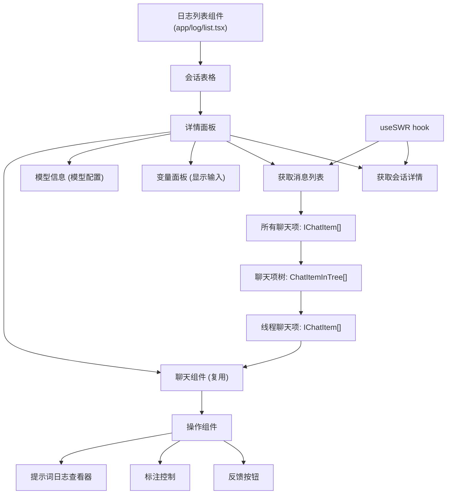
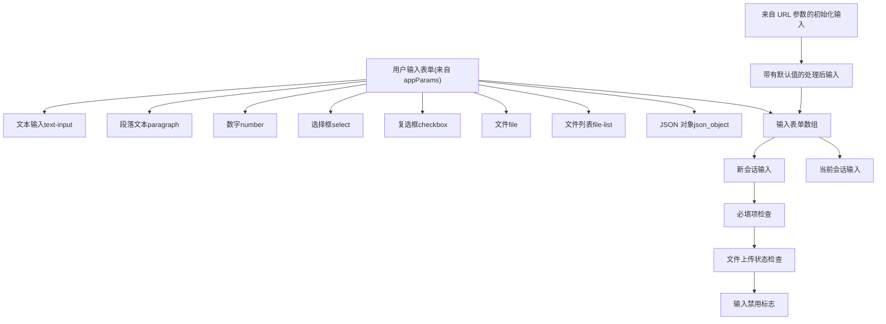
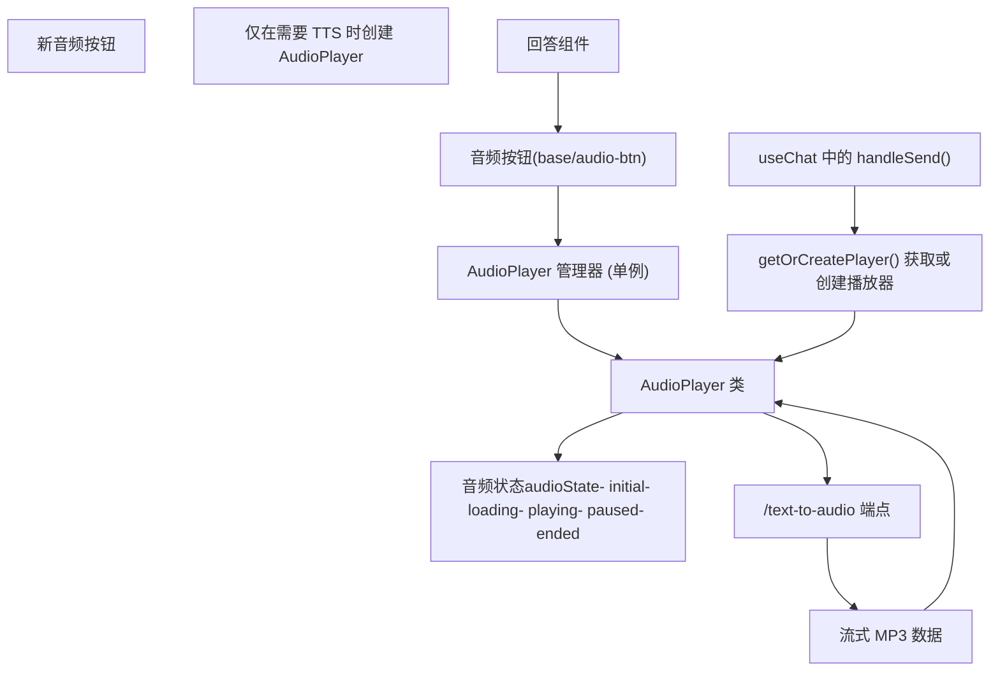

# Web 前端架构

相关源文件

-   [api/libs/helper.py](https://github.com/langgenius/dify/blob/92dbc94f/api/libs/helper.py)
-   [api/tests/unit\_tests/libs/test\_helper.py](https://github.com/langgenius/dify/blob/92dbc94f/api/tests/unit_tests/libs/test_helper.py)
-   [web/.env.example](https://github.com/langgenius/dify/blob/92dbc94f/web/.env.example)
-   [web/app/(commonLayout)/app/(appDetailLayout)/layout.tsx](https://github.com/langgenius/dify/blob/92dbc94f/web/app/(commonLayout)/app/(appDetailLayout)/layout.tsx)
-   [web/app/(commonLayout)/datasets/(datasetDetailLayout)/\[datasetId\]/settings/page.tsx](web/app/(commonLayout)/datasets/(datasetDetailLayout)/%5BdatasetId%5D/settings/page.tsx)
-   [web/app/activate/activateForm.tsx](https://github.com/langgenius/dify/blob/92dbc94f/web/app/activate/activateForm.tsx)
-   [web/app/components/base/form/hooks/use-get-form-values.ts](https://github.com/langgenius/dify/blob/92dbc94f/web/app/components/base/form/hooks/use-get-form-values.ts)
-   [web/app/components/base/form/utils/zod-submit-validator.ts](https://github.com/langgenius/dify/blob/92dbc94f/web/app/components/base/form/utils/zod-submit-validator.ts)
-   [web/app/components/base/logo/logo-embedded-chat-avatar.tsx](https://github.com/langgenius/dify/blob/92dbc94f/web/app/components/base/logo/logo-embedded-chat-avatar.tsx)
-   [web/app/components/plugins/marketplace/description/index.spec.tsx](https://github.com/langgenius/dify/blob/92dbc94f/web/app/components/plugins/marketplace/description/index.spec.tsx)
-   [web/app/components/plugins/marketplace/description/index.tsx](https://github.com/langgenius/dify/blob/92dbc94f/web/app/components/plugins/marketplace/description/index.tsx)
-   [web/app/components/provider/serwist.tsx](https://github.com/langgenius/dify/blob/92dbc94f/web/app/components/provider/serwist.tsx)
-   [web/app/forgot-password/ForgotPasswordForm.spec.tsx](https://github.com/langgenius/dify/blob/92dbc94f/web/app/forgot-password/ForgotPasswordForm.spec.tsx)
-   [web/app/forgot-password/ForgotPasswordForm.tsx](https://github.com/langgenius/dify/blob/92dbc94f/web/app/forgot-password/ForgotPasswordForm.tsx)
-   [web/app/install/installForm.tsx](https://github.com/langgenius/dify/blob/92dbc94f/web/app/install/installForm.tsx)
-   [web/app/layout.tsx](https://github.com/langgenius/dify/blob/92dbc94f/web/app/layout.tsx)
-   [web/app/serwist/\[path\]/route.ts](web/app/serwist/%5Bpath%5D/route.ts)
-   [web/app/sw.ts](https://github.com/langgenius/dify/blob/92dbc94f/web/app/sw.ts)
-   [web/config/index.ts](https://github.com/langgenius/dify/blob/92dbc94f/web/config/index.ts)
-   [web/docker/entrypoint.sh](https://github.com/langgenius/dify/blob/92dbc94f/web/docker/entrypoint.sh)
-   [web/eslint-rules/rules/no-as-any-in-t.js](https://github.com/langgenius/dify/blob/92dbc94f/web/eslint-rules/rules/no-as-any-in-t.js)
-   [web/eslint-rules/rules/no-legacy-namespace-prefix.js](https://github.com/langgenius/dify/blob/92dbc94f/web/eslint-rules/rules/no-legacy-namespace-prefix.js)
-   [web/eslint-rules/rules/require-ns-option.js](https://github.com/langgenius/dify/blob/92dbc94f/web/eslint-rules/rules/require-ns-option.js)
-   [web/eslint-suppressions.json](https://github.com/langgenius/dify/blob/92dbc94f/web/eslint-suppressions.json)
-   [web/eslint.config.mjs](https://github.com/langgenius/dify/blob/92dbc94f/web/eslint.config.mjs)
-   [web/i18n-config/lib.client.ts](https://github.com/langgenius/dify/blob/92dbc94f/web/i18n-config/lib.client.ts)
-   [web/i18n-config/lib.server.ts](https://github.com/langgenius/dify/blob/92dbc94f/web/i18n-config/lib.server.ts)
-   [web/i18n-config/server.ts](https://github.com/langgenius/dify/blob/92dbc94f/web/i18n-config/server.ts)
-   [web/knip.config.ts](https://github.com/langgenius/dify/blob/92dbc94f/web/knip.config.ts)
-   [web/next.config.js](https://github.com/langgenius/dify/blob/92dbc94f/web/next.config.js)
-   [web/pnpm-lock.yaml](https://github.com/langgenius/dify/blob/92dbc94f/web/pnpm-lock.yaml)
-   [web/scripts/gen-icons.mjs](https://github.com/langgenius/dify/blob/92dbc94f/web/scripts/gen-icons.mjs)
-   [web/types/feature.ts](https://github.com/langgenius/dify/blob/92dbc94f/web/types/feature.ts)
-   [web/utils/server-only-context.ts](https://github.com/langgenius/dify/blob/92dbc94f/web/utils/server-only-context.ts)

本文档提供了 Dify Web 前端的架构概览，涵盖了 Next.js 15 应用结构、组件层级、状态管理模式以及实时通信策略。前端使用 React 19 和 TypeScript 构建，实现了关注点分离的模块化架构。

有关后端 API 集成模式，请参阅 [服务 API 与外部集成](/langgenius/dify/8-service-apis)。有关工作流特定的 UI 组件，请参阅 [工作流系统与节点执行架构](/langgenius/dify/5-workflow-system-and-node-execution)。有关构建系统和工具链详情，请参阅 [前端构建系统与配置](/langgenius/dify/9.1-frontend-build-system-and-configuration)。

---

## 技术栈

前端基于以下核心技术构建：

| 技术 | 版本 | 用途 |
| --- | --- | --- |
| Next.js | 15.5.9 | 带有 App Router 的 React 框架 |
| React | 19.2.3 | UI 库 |
| TypeScript | 5.9.3 | 类型安全 |
| Zustand | 5.0.9 | 全局状态管理 |
| SWR | 2.3.7 | 服务端状态缓存 |
| TanStack Query | 5.90.12 | 替代服务端状态管理 |
| Tailwind CSS | 3.4.18 | 原子化 CSS |
| React Flow | 11.11.4 | 工作流图可视化 |
| i18next | 23.16.8 | 国际化 |

**来源：** [web/pnpm-lock.yaml1-566](https://github.com/langgenius/dify/blob/92dbc94f/web/pnpm-lock.yaml#L1-L566)

---

## 应用结构

### 目录组织


**图表：前端目录结构**

应用遵循 Next.js 15 App Router 规范，采用模块化组件架构。关键目录说明：

-   `app/components/base/`: 可复用的 UI 原语/基础组件（按钮、弹窗、聊天组件）
-   `app/components/app/`: 应用特定功能（配置、日志、标注）
-   `app/components/workflow/`: 工作流编辑器和执行组件
-   `context/`: 全局状态的 React Context 提供者
-   `service/`: API 客户端函数
-   `hooks/`: 自定义 React hooks
-   `models/`: TypeScript 类型定义
-   `i18n/`: 翻译文件

**来源：** [web/app/components/base/chat/chat/index.tsx1-372](https://github.com/langgenius/dify/blob/92dbc94f/web/app/components/base/chat/chat/index.tsx#L1-L372) [web/app/components/app/log/list.tsx1-1020](https://github.com/langgenius/dify/blob/92dbc94f/web/app/components/app/log/list.tsx#L1-L1020) [web/app/components/workflow/panel/debug-and-preview/hooks.ts1-500](https://github.com/langgenius/dify/blob/92dbc94f/web/app/components/workflow/panel/debug-and-preview/hooks.ts#L1-L500)

---

## 组件架构

### 组件层级


**图表：组件层级与组合**

组件架构遵循层级组合模式，具有清晰的边界：

1.  **布局组件 (Layout Components)**: 持久化的 UI 元素，如 `Header` 和 `AppSidebar`
2.  **页面组件 (Page Components)**: 按功能区域组织的路由特定容器
3.  **功能组件 (Feature Components)**: 特定领域的组件（配置、日志、工作流）
4.  **基础组件 (Base Components)**: 构筑应用基石的可复用原语组件

**来源：** [web/app/components/base/chat/chat/index.tsx77-371](https://github.com/langgenius/dify/blob/92dbc94f/web/app/components/base/chat/chat/index.tsx#L77-L371) [web/app/components/app/log/list.tsx202-760](https://github.com/langgenius/dify/blob/92dbc94f/web/app/components/app/log/list.tsx#L202-L760) [web/app/components/app-sidebar/app-info.tsx61-464](https://github.com/langgenius/dify/blob/92dbc94f/web/app/components/app-sidebar/app-info.tsx#L61-L464)

---

## 状态管理架构

### 混合状态管理策略


**图表：状态管理层与数据流**

前端实现了多层次的状态管理策略：

**1. Zustand (全局应用状态)**

-   位置：[web/app/components/app/store.ts](https://github.com/langgenius/dify/blob/92dbc94f/web/app/components/app/store.ts)
-   管理 UI 状态，如弹窗可见性、当前日志项、应用详情
-   通过 `useAppStore` hook 访问，并配合浅比较（shallow comparison）

**2. SWR (服务端状态缓存)**

-   用于数据获取，具有自动重新验证功能
-   提供乐观更新（optimistic updates）和后台重新验证
-   示例：[web/app/components/base/chat/chat-with-history/hooks.tsx177-191](https://github.com/langgenius/dify/blob/92dbc94f/web/app/components/base/chat/chat-with-history/hooks.tsx#L177-L191)

**3. React Context (作用域状态)**

-   `ChatContext`: 管理聊天配置和回调函数 [web/app/components/base/chat/chat/context.ts](https://github.com/langgenius/dify/blob/92dbc94f/web/app/components/base/chat/chat/context.ts)
-   `WorkflowContext`: 工作流执行状态
-   `ChatWithHistoryContext`: 会话历史记录和输入

**4. LocalStorage (持久化)**

-   存储会话 ID：`CONVERSATION_ID_INFO` 常量
-   UI 偏好，如侧边栏折叠状态

**来源：** [web/app/components/base/chat/chat/index.tsx115-122](https://github.com/langgenius/dify/blob/92dbc94f/web/app/components/base/chat/chat/index.tsx#L115-L122) [web/app/components/base/chat/chat-with-history/hooks.tsx150-167](https://github.com/langgenius/dify/blob/92dbc94f/web/app/components/base/chat/chat-with-history/hooks.tsx#L150-L167) [web/app/components/app/log/list.tsx210-218](https://github.com/langgenius/dify/blob/92dbc94f/web/app/components/app/log/list.tsx#L210-L218)

---

## 聊天系统架构

### 聊天组件结构


**图表：聊天组件架构与数据流**

聊天系统围绕核心的 `Chat` 组件构建，该组件可在不同上下文中复用：

**组件包装器：**

-   `ChatWrapper` (chat-with-history): 具有会话管理的完整聊天应用
-   `ChatWrapper` (embedded-chatbot): 可嵌入的聊天挂件
-   `ChatWrapper` (workflow debug): 工作流测试界面

**核心组件：**

-   `Chat` [web/app/components/base/chat/chat/index.tsx77-371](https://github.com/langgenius/dify/blob/92dbc94f/web/app/components/base/chat/chat/index.tsx#L77-L371): 负责布局和编排的主容器
-   `Question` [web/app/components/base/chat/chat/question.tsx](https://github.com/langgenius/dify/blob/92dbc94f/web/app/components/base/chat/chat/question.tsx): 渲染用户消息
-   `Answer` [web/app/components/base/chat/chat/answer/index.tsx40-233](https://github.com/langgenius/dify/blob/92dbc94f/web/app/components/base/chat/chat/answer/index.tsx#L40-L233): 渲染助手回答及操作按钮
-   `ChatInputArea`: 具有文件上传和语音输入的输入字段

**状态管理：** `useChat` hook [web/app/components/base/chat/chat/hooks.ts48-657](https://github.com/langgenius/dify/blob/92dbc94f/web/app/components/base/chat/chat/hooks.ts#L48-L657) 管理：

-   `chatTree`: 用于消息线程和分支的树形结构
-   `threadMessages`: 当前会话线程的线性视图
-   `isResponding`: 用于 UI 反馈的响应状态
-   `suggestedQuestions`: 回答后的建议问题

**来源：** [web/app/components/base/chat/chat/index.tsx1-372](https://github.com/langgenius/dify/blob/92dbc94f/web/app/components/base/chat/chat/index.tsx#L1-L372) [web/app/components/base/chat/chat/hooks.ts1-657](https://github.com/langgenius/dify/blob/92dbc94f/web/app/components/base/chat/chat/hooks.ts#L1-L657) [web/app/components/base/chat/chat-with-history/chat-wrapper.tsx1-302](https://github.com/langgenius/dify/blob/92dbc94f/web/app/components/base/chat/chat-with-history/chat-wrapper.tsx#L1-L302)

---

## 实时通信

### 服务器发送事件 (SSE) 流程

> **[Mermaid 序列图]**
> *(图表结构无法解析)*

**图表：服务器发送事件通信流程**

前端使用服务器发送事件（SSE）来实现实时流式响应：

**1. 建立连接**

-   `ssePost()` 函数 [web/service/base.ts](https://github.com/langgenius/dify/blob/92dbc94f/web/service/base.ts) 建立 SSE 连接
-   发送带有 `response_mode: 'streaming'` 的 POST 请求
-   接收来自后端的事件流

**2. 事件处理** `handleSend` 中的关键事件回调 [web/app/components/base/chat/chat/hooks.ts212-476](https://github.com/langgenius/dify/blob/92dbc94f/web/app/components/base/chat/chat/hooks.ts#L212-L476)：

-   `onData`: 处理文本块，增量更新内容
-   `onThought`: 处理 Agent 推理步骤
-   `onFile`: 添加生成的文件（图像、文档）
-   `onCompleted`: 完成消息接收并获取元数据
-   `onWorkflowStarted/onWorkflowFinished`: 工作流执行事件
-   `onNodeStarted/onNodeFinished`: 单个节点执行事件
-   `onTextChunk/onTextReplace`: 工作流节点输出流

**3. 状态更新**

-   使用 `updateCurrentQAOnTree()` 以不可变方式更新聊天树
-   触发 React 重新渲染以进行增量显示
-   通过父子关系维护会话历史

**4. 错误处理**

-   `hasStopResponded` ref 防止重复的停止调用
-   使用 Abort controller 取消正在进行的请求
-   错误状态通过 `onCompleted(hasError=true)` 传播

**来源：** [web/app/components/base/chat/chat/hooks.ts212-476](https://github.com/langgenius/dify/blob/92dbc94f/web/app/components/base/chat/chat/hooks.ts#L212-L476) [web/app/components/base/chat/chat/index.tsx131-175](https://github.com/langgenius/dify/blob/92dbc94f/web/app/components/base/chat/chat/index.tsx#L131-L175)

---

## 消息线程与树形结构

### 聊天项树架构


**图表：消息树结构与线程提取**

聊天系统实现了树形结构，以支持消息重新生成和分支对话：

**树节点结构** (`ChatItemInTree`):

```
{
  id: string
  content: string
  isAnswer: boolean
  parentMessageId?: string
  children?: ChatItemInTree[]
  siblingIndex?: number
  prevSibling?: string  // 前一个兄弟节点的 ID
  nextSibling?: string  // 后一个兄弟节点的 ID
}
```
**关键函数：**

-   `buildChatItemTree()` [web/app/components/base/chat/utils.ts](https://github.com/langgenius/dify/blob/92dbc94f/web/app/components/base/chat/utils.ts): 将扁平消息列表转换为树
-   `getThreadMessages()` [web/app/components/base/chat/utils.ts](https://github.com/langgenius/dify/blob/92dbc94f/web/app/components/base/chat/utils.ts): 根据目标消息 ID 从树中提取线性线程
-   `switchSibling()` [web/app/components/base/chat/chat/index.tsx68](https://github.com/langgenius/dify/blob/92dbc94f/web/app/components/base/chat/chat/index.tsx#L68-L68): 在备选回答之间导航

**消息重新生成流程：**

1.  用户在回答上点击重新生成
2.  作为当前回答的兄弟节点添加新的占位回答
3.  SSE 流填充新回答内容
4.  兄弟节点导航允许在回答之间切换
5.  `ContentSwitch` 组件显示 "1 / 2" UI

**来源：** [web/app/components/base/chat/chat/hooks.ts73-105](https://github.com/langgenius/dify/blob/92dbc94f/web/app/components/base/chat/chat/hooks.ts#L73-L105) [web/app/components/base/chat/chat/answer/index.tsx103-112](https://github.com/langgenius/dify/blob/92dbc94f/web/app/components/base/chat/chat/answer/index.tsx#L103-L112)

---

## 日志查看器架构

### 管理员日志查看器组件


**图表：管理员日志查看器架构**

日志查看器 [web/app/components/app/log/list.tsx1-1020](https://github.com/langgenius/dify/blob/92dbc94f/web/app/components/app/log/list.tsx#L1-L1020) 为管理员提供了详细的会话检查功能：

**组件层级：**

1.  **LogList**: 管理会话列表和详情面板的容器
2.  **ConversationTable**: 显示带有状态指示器的会话
3.  **DetailPanel**: 在侧边抽屉中显示会话详情

**数据加载策略：**

-   初始加载：获取会话元数据
-   展开时：通过 `fetchChatMessages()` 获取前 10 条消息 [web/app/components/app/log/list.tsx228-285](https://github.com/langgenius/dify/blob/92dbc94f/web/app/components/app/log/list.tsx#L228-L285)
-   分页：滚动时通过 `loadMoreMessages()` 加载更多消息 [web/app/components/app/log/list.tsx388-519](https://github.com/langgenius/dify/blob/92dbc94f/web/app/components/app/log/list.tsx#L388-L519)
-   滚动处理：检测滚动到顶部并触发分页 [web/app/components/app/log/list.tsx521-585](https://github.com/langgenius/dify/blob/92dbc94f/web/app/components/app/log/list.tsx#L521-L585)

**消息树管理：**

-   `allChatItems`: 所有已加载消息的扁平数组
-   `buildChatItemTree()`: 从扁平列表构建树
-   `getThreadMessages()`: 提取当前查看的线程
-   支持消息重新生成和兄弟节点导航

**操作：**

-   具有独立评分系统的用户/管理员反馈
-   标注编辑与管理
-   用于调试的提示词日志查看
-   消息日志检查

**来源：** [web/app/components/app/log/list.tsx196-760](https://github.com/langgenius/dify/blob/92dbc94f/web/app/components/app/log/list.tsx#L196-L760) [web/app/components/base/chat/chat/answer/operation.tsx1-300](https://github.com/langgenius/dify/blob/92dbc94f/web/app/components/base/chat/chat/answer/operation.tsx#L1-L300)

---

## 国际化 (i18n)

### 翻译系统

前端使用 `i18next` 进行国际化，并支持动态加载：

**配置：**

-   主配置：[web/i18n-config/i18next-config.ts](https://github.com/langgenius/dify/blob/92dbc94f/web/i18n-config/i18next-config.ts)
-   支持语言：英语、简体中文、繁体中文、葡萄牙语、日语、韩语、乌克兰语、越南语、法语、斯洛伐克语、西班牙语、意大利语、泰语、印度尼西亚语、俄语、德语、波兰语、匈牙利语、罗马尼亚语、荷兰语、阿拉伯语、土耳其语、波斯语、希伯来语

**使用模式：**

```
// 在组件中
const { t } = useTranslation()
t('appLog.table.header.userRate')  // 返回翻译后的字符串

// 动态切换语言
changeLanguage('zh-Hans')
```
**翻译文件结构：**

-   基础翻译：`web/i18n/[locale]/`
-   通过 `i18next-resources-to-backend` 实现懒加载
-   基于命名空间（namespace）的组织（app, common, workflow 等）

**来源：** [web/app/components/app/log/list.tsx16](https://github.com/langgenius/dify/blob/92dbc94f/web/app/components/app/log/list.tsx#L16-L16) [web/app/components/base/chat/chat-with-history/hooks.tsx117-123](https://github.com/langgenius/dify/blob/92dbc94f/web/app/components/base/chat/chat-with-history/hooks.tsx#L117-L123)

---

## 表单与输入管理

### 输入变量与表单


**图表：输入表单处理与验证**

前端根据后端配置动态生成表单字段：

**表单字段类型：** 在 `user_input_form` 数组中定义 [web/app/components/base/chat/chat-with-history/hooks.tsx216-287](https://github.com/langgenius/dify/blob/92dbc94f/web/app/components/base/chat/chat-with-history/hooks.tsx#L216-L287)：

-   `text-input`: 带有最大长度验证的单行文本
-   `paragraph`: 多行文本区域
-   `number`: 数字输入
-   `select`: 带有预定义选项的下拉框
-   `checkbox`: 布尔值切换
-   `file`: 单个文件上传
-   `file-list`: 多个文件上传
-   `json_object`: JSON 编辑器

**URL 参数注入：**

-   `initInputs` 从 URL 查询参数填充
-   允许通过深度链接预填充表单
-   示例：`?inputs={"var1":"value1"}`

**验证逻辑** [web/app/components/base/chat/chat-with-history/chat-wrapper.tsx87-120](https://github.com/langgenius/dify/blob/92dbc94f/web/app/components/base/chat/chat-with-history/chat-wrapper.tsx#L87-L120)：

1.  检查所有必填字段是否非空
2.  验证文件已上传（而不仅仅是选中）
3.  设置 `inputDisabled` 标志以防止提交

**来源：** [web/app/components/base/chat/chat-with-history/hooks.tsx216-287](https://github.com/langgenius/dify/blob/92dbc94f/web/app/components/base/chat/chat-with-history/hooks.tsx#L216-L287) [web/app/components/base/chat/chat-with-history/chat-wrapper.tsx86-120](https://github.com/langgenius/dify/blob/92dbc94f/web/app/components/base/chat/chat-with-history/chat-wrapper.tsx#L86-L120)

---

## 文件上传系统

### 文件上传架构

文件上传系统支持本地和远程文件，具有多种传输方法：

**传输方法：**

-   `local_file`: 上传到 Dify 存储，接收 `uploadedId`
-   `remote_url`: 引用外部 URL
-   `tool_file`: 工具执行生成的文件

**文件实体结构：**

```
type FileEntity = {
  id?: string
  name: string
  size?: number
  type: string
  transferMethod: TransferMethod
  url?: string
  uploadedId?: string  // 上传完成后设置
  progress?: number
}
```
**上传流程：**

1.  用户通过 `FileUploader` 组件选择文件
2.  文件以 `transferMethod: 'local_file'` 添加到表单状态
3.  启动上传，跟踪进度
4.  完成后填充 `uploadedId`
5.  提交时将 `uploadedId` 发送到后端

**文件处理：**

-   `getProcessedFiles()` [web/app/components/base/file-uploader/utils.ts](https://github.com/langgenius/dify/blob/92dbc94f/web/app/components/base/file-uploader/utils.ts): 为 API 请求准备文件
-   `getProcessedFilesFromResponse()`: 将后端响应转换为 UI 格式
-   视觉文件（图像）针对多模态模型单独处理

**来源：** [web/app/components/base/chat/chat/hooks.ts276-295](https://github.com/langgenius/dify/blob/92dbc94f/web/app/components/base/chat/chat/hooks.ts#L276-L295) [web/app/components/base/chat/chat-with-history/chat-wrapper.tsx104-110](https://github.com/langgenius/dify/blob/92dbc94f/web/app/components/base/chat/chat-with-history/chat-wrapper.tsx#L104-L110)

---

## 音频与 TTS 集成

### 文本转语音 (TTS) 系统


**图表：文本转语音架构**

TTS 系统提供助手回答的音频播放功能：

**组件：**

-   `AudioBtn` [web/app/components/base/audio-btn/index.tsx21-90](https://github.com/langgenius/dify/blob/92dbc94f/web/app/components/base/audio-btn/index.tsx#L21-L90): 具有播放/暂停状态的 UI 按钮
-   `AudioPlayerManager`: 管理播放器实例的单例
-   `AudioPlayer`: 处理音频流和播放

**延迟初始化模式：** 在 `useChat` hook 中 [web/app/components/base/chat/chat/hooks.ts312-320](https://github.com/langgenius/dify/blob/92dbc94f/web/app/components/base/chat/chat/hooks.ts#L312-L320)：

```
let player: AudioPlayer | null = null
const getOrCreatePlayer = () => {
  if (!player)
    player = AudioPlayerManager.getInstance().getAudioPlayer(...)
  return player
}
```
**优点：**

-   避免不必要地打开音频通道
-   在未启用 TTS 时减少资源使用
-   仅在接收到第一个 TTS 事件时创建播放器

**音频状态机：**

1.  `initial`: 按钮就绪
2.  `loading`: 从后端获取音频
3.  `playing`: 音频播放中
4.  `paused`: 播放暂停
5.  `ended`: 播放结束

**来源：** [web/app/components/base/audio-btn/index.tsx1-90](https://github.com/langgenius/dify/blob/92dbc94f/web/app/components/base/audio-btn/index.tsx#L1-L90) [web/app/components/base/chat/chat/hooks.ts312-320](https://github.com/langgenius/dify/blob/92dbc94f/web/app/components/base/chat/chat/hooks.ts#L312-L320)

---

## 工作流 UI 组件

工作流编辑器提供可视化编程能力：

**关键组件：**

-   **画布 (Canvas)**: 基于 React Flow 的图形编辑器
-   **节点面板 (Node Panel)**: 可拖拽的节点调色板
-   **节点编辑器 (Node Editor)**: 所选节点的配置面板
-   **调试面板 (Debug Panel)**: 带有聊天界面的执行预览

**集成点：**

-   工作流上下文提供共享状态 [web/app/components/workflow/context.tsx](https://github.com/langgenius/dify/blob/92dbc94f/web/app/components/workflow/context.tsx)
-   工作流执行的 Hooks [web/app/components/workflow/hooks.ts](https://github.com/langgenius/dify/blob/92dbc94f/web/app/components/workflow/hooks.ts)
-   调试聊天复用了基础 `Chat` 组件 [web/app/components/workflow/panel/debug-and-preview/chat-wrapper.tsx1-180](https://github.com/langgenius/dify/blob/92dbc94f/web/app/components/workflow/panel/debug-and-preview/chat-wrapper.tsx#L1-L180)

有关详细的工作流架构，请参阅 [工作流与应用执行](/langgenius/dify/5-workflow-system-and-node-execution)。

**来源：** [web/app/components/workflow/panel/debug-and-preview/chat-wrapper.tsx1-180](https://github.com/langgenius/dify/blob/92dbc94f/web/app/components/workflow/panel/debug-and-preview/chat-wrapper.tsx#L1-L180) [web/app/components/workflow/panel/debug-and-preview/hooks.ts1-500](https://github.com/langgenius/dify/blob/92dbc94f/web/app/components/workflow/panel/debug-and-preview/hooks.ts#L1-L500)

---

## 测试基础设施

### Jest 配置

项目使用 Jest 配合 Happy DOM 进行单元测试：

**配置：** [web/jest.config.ts1-205](https://github.com/langgenius/dify/blob/92dbc94f/web/jest.config.ts#L1-L205)

-   测试环境：`@happy-dom/jest-environment`
-   覆盖率提供者：V8
-   模块名称映射：`@/*` → `<rootDir>/*`
-   设置文件：[web/jest.setup.ts1-64](https://github.com/langgenius/dify/blob/92dbc94f/web/jest.setup.ts#L1-L64)

**测试设置：**

-   模拟 Web Animations API 以确保 Headless UI 兼容性
-   抑制 Headless UI 内部的 `act()` 警告
-   每次测试后进行全局清理

**覆盖率报告：**

-   JSON 摘要
-   用于 CI 集成的 LCOV
-   终端文本输出

**来源：** [web/jest.config.ts1-205](https://github.com/langgenius/dify/blob/92dbc94f/web/jest.config.ts#L1-L205) [web/jest.setup.ts1-64](https://github.com/langgenius/dify/blob/92dbc94f/web/jest.setup.ts#L1-L64)

---

## ESLint 与代码质量

### Lint 配置

项目使用基于 `@antfu/eslint-config` 的全面 ESLint 设置：

**关键配置：** [web/eslint.config.mjs1-250](https://github.com/langgenius/dify/blob/92dbc94f/web/eslint.config.mjs#L1-L250)

-   **风格规则**: Stroustrup 大括号风格、单引号、2 空格缩进
-   **TypeScript**: 一致的类型定义，无空对象类型
-   **React**: React Hooks 规则，Next.js 核心 Web 指标
-   **Sonarjs**: 代码复杂度、可维护性检查
-   **Tailwind**: 类名排序与验证
-   **Oxlint**: 额外的性能 lint

**禁用的规则：**

-   `sonarjs/cognitive-complexity`: 过于严格
-   `sonarjs/max-lines`: 1000 行限制（仅警告）
-   `@next/next/no-html-link-for-pages`: 性能问题

**导入排序：**

```
sort-imports: ['error', {
  ignoreCase: false,
  ignoreDeclarationSort: true,
  ignoreMemberSort: false
}]
```
**来源：** [web/eslint.config.mjs1-250](https://github.com/langgenius/dify/blob/92dbc94f/web/eslint.config.mjs#L1-L250)

---

## 性能优化

### 优化策略

1.  **React Memoization:**

    -   针对昂贵组件使用 `memo()` [web/app/components/base/chat/chat/index.tsx371](https://github.com/langgenius/dify/blob/92dbc94f/web/app/components/base/chat/chat/index.tsx#L371-L371)
    -   针对派生状态使用 `useMemo()` [web/app/components/base/chat/chat/hooks.ts83-105](https://github.com/langgenius/dify/blob/92dbc94f/web/app/components/base/chat/chat/hooks.ts#L83-L105)
    -   使用 `useCallback()` 保持回调函数稳定
2.  **SWR 缓存:**

    -   自动后台重新验证
    -   Stale-while-revalidate 模式
    -   对静态数据禁用焦点重新验证
3.  **代码分割 (Code Splitting):**

    -   使用 `next/dynamic` 进行动态导入
    -   通过 App Router 实现基于路由的代码分割
    -   组件懒加载 [web/app/components/app-sidebar/app-info.tsx35-52](https://github.com/langgenius/dify/blob/92dbc94f/web/app/components/app-sidebar/app-info.tsx#L35-L52)
4.  **滚动优化:**

    -   针对长列表使用 `react-window` 进行虚拟滚动
    -   防抖处理的滚动处理程序 [web/app/components/base/chat/chat/index.tsx168-175](https://github.com/langgenius/dify/blob/92dbc94f/web/app/components/base/chat/chat/index.tsx#L168-L175)
    -   用户滚动期间防止自动滚动
5.  **状态更新:**

    -   使用 Immer 进行不可变更新 [web/app/components/base/chat/chat/hooks.ts9](https://github.com/langgenius/dify/blob/92dbc94f/web/app/components/base/chat/chat/hooks.ts#L9-L9)
    -   使用 Refs 存储不触发重新渲染的值
    -   Zustand 配合浅比较

**来源：** [web/app/components/base/chat/chat/index.tsx168-175](https://github.com/langgenius/dify/blob/92dbc94f/web/app/components/base/chat/chat/index.tsx#L168-L175) [web/app/components/app-sidebar/app-info.tsx35-52](https://github.com/langgenius/dify/blob/92dbc94f/web/app/components/app-sidebar/app-info.tsx#L35-L52) [web/app/components/base/chat/chat/hooks.ts107-112](https://github.com/langgenius/dify/blob/92dbc94f/web/app/components/base/chat/chat/hooks.ts#L107-L112)
