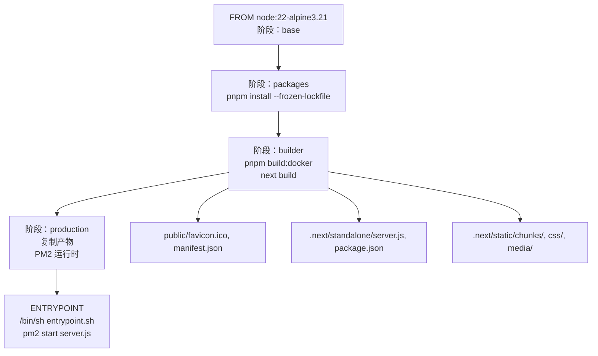
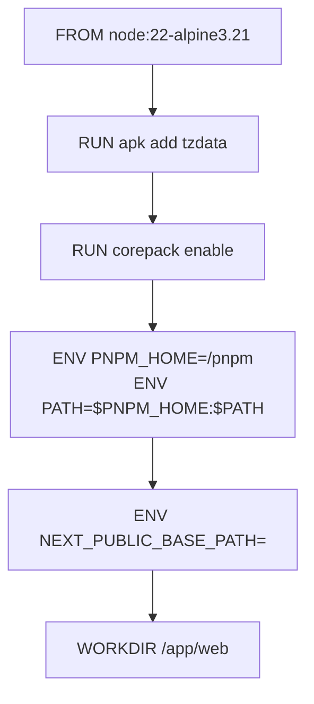
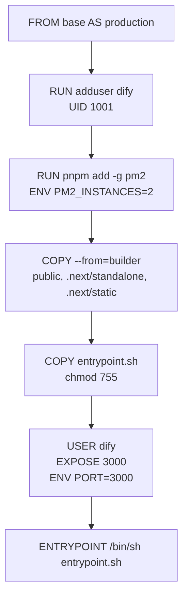
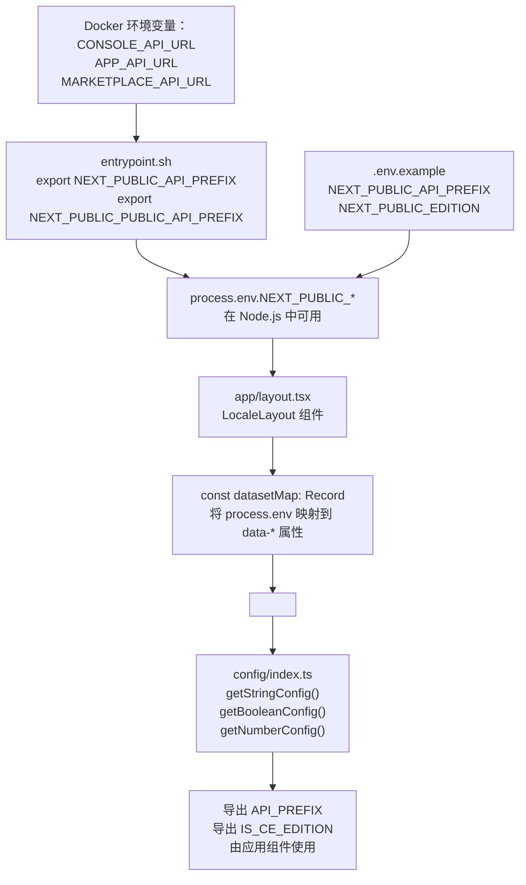
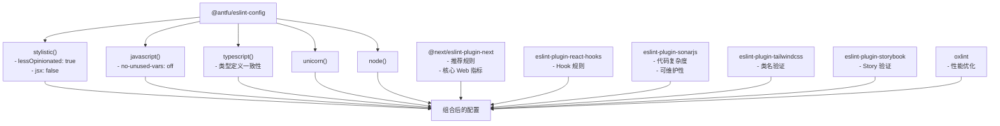
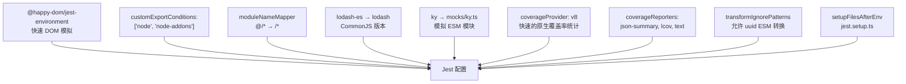
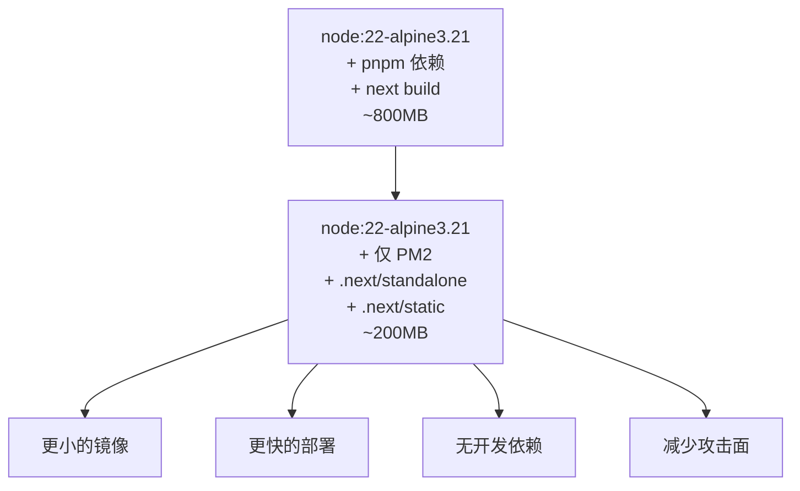

# 前端构建与配置

相关源文件

-   [.github/workflows/api-tests.yml](https://github.com/langgenius/dify/blob/92dbc94f/.github/workflows/api-tests.yml)
-   [.github/workflows/autofix.yml](https://github.com/langgenius/dify/blob/92dbc94f/.github/workflows/autofix.yml)
-   [.github/workflows/build-push.yml](https://github.com/langgenius/dify/blob/92dbc94f/.github/workflows/build-push.yml)
-   [.github/workflows/db-migration-test.yml](https://github.com/langgenius/dify/blob/92dbc94f/.github/workflows/db-migration-test.yml)
-   [.github/workflows/deploy-agent-dev.yml](https://github.com/langgenius/dify/blob/92dbc94f/.github/workflows/deploy-agent-dev.yml)
-   [.github/workflows/deploy-dev.yml](https://github.com/langgenius/dify/blob/92dbc94f/.github/workflows/deploy-dev.yml)
-   [.github/workflows/deploy-hitl.yml](https://github.com/langgenius/dify/blob/92dbc94f/.github/workflows/deploy-hitl.yml)
-   [.github/workflows/docker-build.yml](https://github.com/langgenius/dify/blob/92dbc94f/.github/workflows/docker-build.yml)
-   [.github/workflows/main-ci.yml](https://github.com/langgenius/dify/blob/92dbc94f/.github/workflows/main-ci.yml)
-   [.github/workflows/stale.yml](https://github.com/langgenius/dify/blob/92dbc94f/.github/workflows/stale.yml)
-   [.github/workflows/style.yml](https://github.com/langgenius/dify/blob/92dbc94f/.github/workflows/style.yml)
-   [.github/workflows/tool-test-sdks.yaml](https://github.com/langgenius/dify/blob/92dbc94f/.github/workflows/tool-test-sdks.yaml)
-   [.github/workflows/translate-i18n-claude.yml](https://github.com/langgenius/dify/blob/92dbc94f/.github/workflows/translate-i18n-claude.yml)
-   [.github/workflows/trigger-i18n-sync.yml](https://github.com/langgenius/dify/blob/92dbc94f/.github/workflows/trigger-i18n-sync.yml)
-   [.github/workflows/vdb-tests.yml](https://github.com/langgenius/dify/blob/92dbc94f/.github/workflows/vdb-tests.yml)
-   [.github/workflows/web-tests.yml](https://github.com/langgenius/dify/blob/92dbc94f/.github/workflows/web-tests.yml)
-   [api/Dockerfile](https://github.com/langgenius/dify/blob/92dbc94f/api/Dockerfile)
-   [api/migrations/README](https://github.com/langgenius/dify/blob/92dbc94f/api/migrations/README)
-   [web/.nvmrc](https://github.com/langgenius/dify/blob/92dbc94f/web/.nvmrc)
-   [web/Dockerfile](https://github.com/langgenius/dify/blob/92dbc94f/web/Dockerfile)
-   [web/README.md](https://github.com/langgenius/dify/blob/92dbc94f/web/README.md)
-   [web/app/(commonLayout)/app/(appDetailLayout)/layout.tsx](https://github.com/langgenius/dify/blob/92dbc94f/web/app/(commonLayout)/app/(appDetailLayout)/layout.tsx)
-   [web/app/(commonLayout)/datasets/(datasetDetailLayout)/[datasetId]/settings/page.tsx](web/app/(commonLayout)/datasets/(datasetDetailLayout)/%5BdatasetId%5D/settings/page.tsx)
-   [web/app/components/base/logo/logo-embedded-chat-avatar.tsx](https://github.com/langgenius/dify/blob/92dbc94f/web/app/components/base/logo/logo-embedded-chat-avatar.tsx)
-   [web/app/components/plugins/marketplace/description/index.spec.tsx](https://github.com/langgenius/dify/blob/92dbc94f/web/app/components/plugins/marketplace/description/index.spec.tsx)
-   [web/app/components/plugins/marketplace/description/index.tsx](https://github.com/langgenius/dify/blob/92dbc94f/web/app/components/plugins/marketplace/description/index.tsx)
-   [web/app/components/provider/serwist.tsx](https://github.com/langgenius/dify/blob/92dbc94f/web/app/components/provider/serwist.tsx)
-   [web/app/serwist/[path]/route.ts](web/app/serwist/%5Bpath%5D/route.ts)
-   [web/app/sw.ts](https://github.com/langgenius/dify/blob/92dbc94f/web/app/sw.ts)
-   [web/eslint-rules/rules/no-as-any-in-t.js](https://github.com/langgenius/dify/blob/92dbc94f/web/eslint-rules/rules/no-as-any-in-t.js)
-   [web/eslint-rules/rules/no-legacy-namespace-prefix.js](https://github.com/langgenius/dify/blob/92dbc94f/web/eslint-rules/rules/no-legacy-namespace-prefix.js)
-   [web/eslint-rules/rules/require-ns-option.js](https://github.com/langgenius/dify/blob/92dbc94f/web/eslint-rules/rules/require-ns-option.js)
-   [web/eslint-suppressions.json](https://github.com/langgenius/dify/blob/92dbc94f/web/eslint-suppressions.json)
-   [web/eslint.config.mjs](https://github.com/langgenius/dify/blob/92dbc94f/web/eslint.config.mjs)
-   [web/i18n-config/README.md](https://github.com/langgenius/dify/blob/92dbc94f/web/i18n-config/README.md)
-   [web/i18n-config/lib.client.ts](https://github.com/langgenius/dify/blob/92dbc94f/web/i18n-config/lib.client.ts)
-   [web/i18n-config/lib.server.ts](https://github.com/langgenius/dify/blob/92dbc94f/web/i18n-config/lib.server.ts)
-   [web/i18n-config/server.ts](https://github.com/langgenius/dify/blob/92dbc94f/web/i18n-config/server.ts)
-   [web/knip.config.ts](https://github.com/langgenius/dify/blob/92dbc94f/web/knip.config.ts)
-   [web/next.config.js](https://github.com/langgenius/dify/blob/92dbc94f/web/next.config.js)
-   [web/pnpm-lock.yaml](https://github.com/langgenius/dify/blob/92dbc94f/web/pnpm-lock.yaml)
-   [web/scripts/gen-icons.mjs](https://github.com/langgenius/dify/blob/92dbc94f/web/scripts/gen-icons.mjs)
-   [web/utils/server-only-context.ts](https://github.com/langgenius/dify/blob/92dbc94f/web/utils/server-only-context.ts)

## 目的与范围

本文档详细介绍了 Dify 基于 Next.js 的 Web 应用程序的前端构建流水线、配置管理系统和部署设置。涵盖了 Docker 多阶段构建过程、使用 pnpm 进行的包管理、双源配置架构（编译时环境变量和运行时 HTML 属性），以及生产环境部署机制。

有关 UI 组件架构和模式的信息，请参阅 [UI 组件与模式](/langgenius/dify/9.2-state-management-and-provider-architecture)。有关包含开发容器 (devcontainers) 在内的开发环境设置，请参阅 [开发环境设置](/langgenius/dify/9.4-chat-ui-components-and-audio-features)。有关使用 Pydantic 进行的后端配置，请参阅 [配置系统](/langgenius/dify/2.3-application-types-and-execution-modes)。

---

## 构建流水线概览

前端构建过程遵循多阶段 Docker 构建模式，分为四个不同的阶段：依赖安装、生产环境构建和运行时部署。应用程序使用 Next.js 15+ 的 standalone 输出模式，以优化生产环境包的大小。


**来源：** [web/Dockerfile1-86](https://github.com/langgenius/dify/blob/92dbc94f/web/Dockerfile#L1-L86)

---

## Docker 多阶段构建

### 第一阶段：Base 基础镜像

Base 阶段建立 Node.js 运行时环境并配置包管理器。

[web/Dockerfile2-15](https://github.com/langgenius/dify/blob/92dbc94f/web/Dockerfile#L2-L15)

关键配置：

-   **Node.js**: 基于 Alpine Linux 3.21 的版本 22。
-   **pnpm**: 通过 corepack 启用，版本在 `package.json` 中指定。
-   **时区**: 可通过 `TZ` 环境变量配置。
-   **基础路径**: 支持通过 `NEXT_PUBLIC_BASE_PATH` 部署在子路径下。


### 第二阶段：Packages 依赖安装

Packages 阶段使用 pnpm 及 frozen lockfile 安装 Node.js 依赖，以确保构建的可重现性。

[web/Dockerfile19-28](https://github.com/langgenius/dify/blob/92dbc94f/web/Dockerfile#L19-L28)

```bash
COPY package.json pnpm-lock.yaml /app/web/
RUN corepack install
RUN pnpm install --frozen-lockfile
```
`--frozen-lockfile` 标志确保安装 `pnpm-lock.yaml` 中指定的精确版本，防止在构建过程中发生意外的依赖更新。

### 第三阶段：Builder 编译构建

Builder 阶段针对 Docker 部署对 Next.js 应用进行优化编译。

[web/Dockerfile31-37](https://github.com/langgenius/dify/blob/92dbc94f/web/Dockerfile#L31-L37)

```bash
ENV NODE_OPTIONS="--max-old-space-size=4096"
RUN pnpm build:docker
```
此阶段：

-   将 Node.js 堆内存大小增加到 4GB，以防止构建过程中的内存不足错误。
-   执行 `build:docker` 脚本，该脚本以 standalone 输出模式运行 Next.js 构建。
-   在 `.next/standalone` 和 `.next/static` 中生成优化的生产环境包。

### 第四阶段：Production 生产镜像

Production 阶段创建一个最小化的运行时镜像，仅包含必要的产物。

[web/Dockerfile41-85](https://github.com/langgenius/dify/blob/92dbc94f/web/Dockerfile#L41-L85)

关键特性：

-   **非 root 用户**: 出于安全考虑创建用户 `dify` (UID 1001)。
-   **PM2 进程管理器**: 全局安装用于生产环境的进程管理。
-   **产物复制**: 仅复制 `public/`, `.next/standalone/`, 和 `.next/static/` 目录。
-   **入口脚本**: [web/docker/entrypoint.sh1-44](https://github.com/langgenius/dify/blob/92dbc94f/web/docker/entrypoint.sh#L1-L44) 配置运行时环境变量。


**来源：** [web/Dockerfile1-86](https://github.com/langgenius/dify/blob/92dbc94f/web/Dockerfile#L1-L86)

---

## 使用 pnpm 进行包管理

前端使用 **pnpm** 作为包管理器，并通过 corepack 进行版本管理。lockfile 使用版本 9.0 格式，配置了 `autoInstallPeers: true` 和 `excludeLinksFromLockfile: false` 设置。

### pnpm 配置

[web/Dockerfile12-14](https://github.com/langgenius/dify/blob/92dbc94f/web/Dockerfile#L12-L14)

```bash
RUN corepack enable
ENV PNPM_HOME="/pnpm"
ENV PATH="$PNPM_HOME:$PATH"
```
Corepack 读取 `package.json` 中的 `packageManager` 字段来确定精确的 pnpm 版本，从而确保开发和生产环境的一致性。

### 依赖覆盖 (Overrides) 与 Polyfill

项目使用依赖覆盖来确保版本的一致性和安全性。主要的覆盖类别包括：

[web/pnpm-lock.yaml7-55](https://github.com/langgenius/dify/blob/92dbc94f/web/pnpm-lock.yaml#L7-L55)

1.  **版本锁定**: 出于安全考虑强制执行特定版本（例如：`esbuild: ~0.25.0`, `vite: ~6.4.1`）。
2.  **Nolyfill 替换**: 使用轻量级替代方案替换沉重的 polyfill（例如：`array-includes: npm:@nolyfill/array-includes@^1`）。
3.  **React 兼容性**: 将 React 类型锁定在 `~19.2.7` 以兼容 React 19。

### 安装过程

依赖安装遵循以下序列：

1.  **复制 lock 文件**: 首先复制 `package.json` 和 `pnpm-lock.yaml`。
2.  **安装 corepack**: `corepack install` 设置指定的 pnpm 版本。
3.  **安装依赖**: `pnpm install --frozen-lockfile` 从 lock 文件安装精确版本。
4.  **构建应用**: `pnpm build:docker` 编译生产环境包。

`--frozen-lockfile` 标志通过防止在安装期间对 lock 文件进行任何修改，确保了构建的可重现性。这种方法利用了 Docker 分层缓存：如果 `package.json` 或 `pnpm-lock.yaml` 未发生变更，Docker 将重用已缓存的依赖安装层，从而显著加快构建速度。

### 关键依赖项

主要的框架和工具依赖包括：

| 包名 | 版本 | 用途 |
| --- | --- | --- |
| `next` | ~15.5.9 | Next.js 框架 |
| `react` | 19.2.3 | React 库 |
| `react-dom` | 19.2.3 | React DOM 渲染器 |
| `zustand` | ^5.0.9 | 状态管理 |
| `swr` | ^2.3.6 | 数据请求 |
| `@tanstack/react-query` | ^5.90.5 | 服务端状态管理 |
| `tailwindcss` | ^3.4.18 | CSS 框架 |

**来源：** [web/Dockerfile19-37](https://github.com/langgenius/dify/blob/92dbc94f/web/Dockerfile#L19-L37) [web/pnpm-lock.yaml1-56](https://github.com/langgenius/dify/blob/92dbc94f/web/pnpm-lock.yaml#L1-L56)

---

## 配置系统架构

前端采用了**双源配置系统**，结合了编译时环境变量和运行时 HTML 属性。这种设计允许在不重新构建 Docker 镜像的情况下更改配置。


### 编译时配置

带有 `NEXT_PUBLIC_` 前缀的环境变量在编译时被嵌入到 JavaScript 包中。

[web/.env.example1-73](https://github.com/langgenius/dify/blob/92dbc94f/web/.env.example#L1-L73)

示例变量：

-   `NEXT_PUBLIC_API_PREFIX`: 控制台 API 端点。
-   `NEXT_PUBLIC_PUBLIC_API_PREFIX`: 服务 API 端点。
-   `NEXT_PUBLIC_EDITION`: 部署版本 (SELF_HOSTED/CLOUD)。
-   `NEXT_PUBLIC_TEXT_GENERATION_TIMEOUT_MS`: LLM 响应超时时间。

这些变量在客户端代码中可通过 `process.env.NEXT_PUBLIC_*` 访问，但其值在**构建时即固定**。

### 通过 HTML 属性进行的运行时配置

为了支持运行时的配置变更，应用程序在 `<body>` 元素上使用了 HTML `data-*` 属性。

[web/app/layout.tsx38-87](https://github.com/langgenius/dify/blob/92dbc94f/web/app/layout.tsx#L38-L87)

```javascript
const datasetMap: Record<DatasetAttr, string | undefined> = {
  [DatasetAttr.DATA_API_PREFIX]: process.env.NEXT_PUBLIC_API_PREFIX,
  [DatasetAttr.DATA_PUBLIC_API_PREFIX]: process.env.NEXT_PUBLIC_PUBLIC_API_PREFIX,
  // ... 25+ 更多属性
}

return (
  <body {...datasetMap}>
    {children}
  </body>
)
```
`DatasetAttr` 枚举定义了属性键：

[web/types/feature.ts103-133](https://github.com/langgenius/dify/blob/92dbc94f/web/types/feature.ts#L103-L133)

```typescript
export enum DatasetAttr {
  DATA_API_PREFIX = 'data-api-prefix',
  DATA_PUBLIC_API_PREFIX = 'data-public-api-prefix',
  DATA_PUBLIC_EDITION = 'data-public-edition',
  // ... 等等
}
```
这种方法允许服务器在运行时将配置值注入 HTML，随后由客户端代码读取。

### 配置获取函数 (Getter Functions)

[web/config/index.ts1-466](https://github.com/langgenius/dify/blob/92dbc94f/web/config/index.ts#L1-L466) 模块提供了实现了双源查找策略的类型化 Getter 函数。

**字符串配置 Getter：**

[web/config/index.ts38-48](https://github.com/langgenius/dify/blob/92dbc94f/web/config/index.ts#L38-L48)

```typescript
const getStringConfig = (
  envVar: string | undefined,
  dataAttrKey: DatasetAttr,
  defaultValue: string,
) => {
  if (envVar) return envVar

  const attrValue = globalThis.document?.body?.getAttribute(dataAttrKey)
  if (attrValue) return attrValue
  return defaultValue
}
```
**布尔配置 Getter：**

[web/config/index.ts9-18](https://github.com/langgenius/dify/blob/92dbc94f/web/config/index.ts#L9-L18)

```typescript
const getBooleanConfig = (
  envVar: string | undefined,
  dataAttrKey: DatasetAttr,
  defaultValue: boolean = true,
) => {
  if (envVar !== undefined && envVar !== '') return envVar === 'true'
  const attrValue = globalThis.document?.body?.getAttribute(dataAttrKey)
  if (attrValue !== undefined && attrValue !== '') return attrValue === 'true'
  return defaultValue
}
```
**数值配置 Getter：**

[web/config/index.ts20-36](https://github.com/langgenius/dify/blob/92dbc94f/web/config/index.ts#L20-L36)

```typescript
const getNumberConfig = (
  envVar: string | undefined,
  dataAttrKey: DatasetAttr,
  defaultValue: number,
) => {
  if (envVar) {
    const parsed = Number.parseInt(envVar)
    if (!Number.isNaN(parsed) && parsed > 0) return parsed
  }

  const attrValue = globalThis.document?.body?.getAttribute(dataAttrKey)
  if (attrValue) {
    const parsed = Number.parseInt(attrValue)
    if (!Number.isNaN(parsed) && parsed > 0) return parsed
  }
  return defaultValue
}
```
查找顺序为：

1.  **环境变量** (`process.env.NEXT_PUBLIC_*`) - 首先检查。
2.  **HTML body 属性** (`data-*`) - 作为运行时配置的回退。
3.  **默认值** - 最终回退方案。

### 配置常量

该模块导出了在整个应用程序中使用的类型化配置常量：

| 常量 | 类型 | 默认值 | 来源 |
| --- | --- | --- | --- |
| `API_PREFIX` | string | `http://localhost:5001/console/api` | [web/config/index.ts50-54](https://github.com/langgenius/dify/blob/92dbc94f/web/config/index.ts#L50-L54) |
| `PUBLIC_API_PREFIX` | string | `http://localhost:5001/api` | [web/config/index.ts55-59](https://github.com/langgenius/dify/blob/92dbc94f/web/config/index.ts#L55-L59) |
| `MARKETPLACE_API_PREFIX` | string | `http://localhost:5002/api` | [web/config/index.ts60-64](https://github.com/langgenius/dify/blob/92dbc94f/web/config/index.ts#L60-L64) |
| `IS_CE_EDITION` | boolean | `true` | [web/config/index.ts77](https://github.com/langgenius/dify/blob/92dbc94f/web/config/index.ts#L77-L77) |
| `IS_CLOUD_EDITION` | boolean | `false` | [web/config/index.ts78](https://github.com/langgenius/dify/blob/92dbc94f/web/config/index.ts#L78-L78) |
| `MAX_TOOLS_NUM` | number | `10` | [web/config/index.ts342-346](https://github.com/langgenius/dify/blob/92dbc94f/web/config/index.ts#L342-L346) |
| `MAX_PARALLEL_LIMIT` | number | `10` | [web/config/index.ts347-351](https://github.com/langgenius/dify/blob/92dbc94f/web/config/index.ts#L347-L351) |
| `TEXT_GENERATION_TIMEOUT_MS` | number | `60000` | [web/config/index.ts352-356](https://github.com/langgenius/dify/blob/92dbc94f/web/config/index.ts#L352-L356) |
| `LOOP_NODE_MAX_COUNT` | number | `100` | [web/config/index.ts357-361](https://github.com/langgenius/dify/blob/92dbc94f/web/config/index.ts#L357-L361) |
| `MAX_ITERATIONS_NUM` | number | `99` | [web/config/index.ts362-366](https://github.com/langgenius/dify/blob/92dbc94f/web/config/index.ts#L362-L366) |
| `MAX_TREE_DEPTH` | number | `50` | [web/config/index.ts367-371](https://github.com/langgenius/dify/blob/92dbc94f/web/config/index.ts#L367-L371) |
| `ENABLE_WEBSITE_JINAREADER` | boolean | `true` | [web/config/index.ts378-382](https://github.com/langgenius/dify/blob/92dbc94f/web/config/index.ts#L378-L382) |
| `ENABLE_WEBSITE_FIRECRAWL` | boolean | `true` | [web/config/index.ts383-387](https://github.com/langgenius/dify/blob/92dbc94f/web/config/index.ts#L383-L387) |
| `ENABLE_WEBSITE_WATERCRAWL` | boolean | `false` | [web/config/index.ts388-392](https://github.com/langgenius/dify/blob/92dbc94f/web/config/index.ts#L388-L392) |
| `CSRF_COOKIE_NAME` | function | 返回 Cookie 名称 | [web/config/index.ts161-165](https://github.com/langgenius/dify/blob/92dbc94f/web/config/index.ts#L161-L165) |

**来源：** [web/config/index.ts9-466](https://github.com/langgenius/dify/blob/92dbc94f/web/config/index.ts#L9-L466) [web/app/layout.tsx32-117](https://github.com/langgenius/dify/blob/92dbc94f/web/app/layout.tsx#L32-L117) [web/types/feature.ts103-134](https://github.com/langgenius/dify/blob/92dbc94f/web/types/feature.ts#L103-L134)

---

## 环境变量参考

### API 端点

| 变量名 | 默认值 | 描述 |
| --- | --- | --- |
| `NEXT_PUBLIC_API_PREFIX` | `http://localhost:5001/console/api` | 控制台 API，用于内部操作 |
| `NEXT_PUBLIC_PUBLIC_API_PREFIX` | `http://localhost:5001/api` | 服务 API，用于外部应用 |
| `NEXT_PUBLIC_MARKETPLACE_API_PREFIX` | `https://marketplace.dify.ai/api/v1` | 插件市场 API |
| `NEXT_PUBLIC_MARKETPLACE_URL_PREFIX` | `https://marketplace.dify.ai` | 插件市场前端 URL |

### 功能开关

| 变量名 | 默认值 | 描述 |
| --- | --- | --- |
| `NEXT_PUBLIC_ALLOW_UNSAFE_DATA_SCHEME` | `false` | 允许内容中使用 data: URL |
| `NEXT_PUBLIC_ENABLE_WEBSITE_JINAREADER` | `true` | 启用 JinaReader 进行网页爬取 |
| `NEXT_PUBLIC_ENABLE_WEBSITE_FIRECRAWL` | `true` | 启用 Firecrawl 进行网页爬取 |
| `NEXT_PUBLIC_ENABLE_WEBSITE_WATERCRAWL` | `true` | 启用 WaterCrawl 进行网页爬取 |
| `NEXT_PUBLIC_ENABLE_SINGLE_DOLLAR_LATEX` | `false` | 支持单美元符号 LaTeX (`$...$`) |

### 资源限制

| 变量名 | 默认值 | 描述 |
| --- | --- | --- |
| `NEXT_PUBLIC_TEXT_GENERATION_TIMEOUT_MS` | `60000` | LLM 响应超时时间（毫秒） |
| `NEXT_PUBLIC_MAX_TOOLS_NUM` | `10` | Agent/工作流中的最大工具数 |
| `NEXT_PUBLIC_MAX_PARALLEL_LIMIT` | `10` | 工作流中的最大并行分支数 |
| `NEXT_PUBLIC_LOOP_NODE_MAX_COUNT` | `100` | 循环节点的最大迭代次数 |
| `NEXT_PUBLIC_MAX_ITERATIONS_NUM` | `99` | Agent 的最大迭代次数 |
| `NEXT_PUBLIC_MAX_TREE_DEPTH` | `50` | 工作流图的最大深度 |
| `NEXT_PUBLIC_TOP_K_MAX_VALUE` | `10` | RAG 检索的最大 top-k 值 |
| `NEXT_PUBLIC_INDEXING_MAX_SEGMENTATION_TOKENS_LENGTH` | `4000` | 文档分段的最大 Token 长度 |

### 安全与部署

| 变量名 | 默认值 | 描述 |
| --- | --- | --- |
| `NEXT_PUBLIC_EDITION` | `SELF_HOSTED` | 部署版本 (SELF_HOSTED/CLOUD) |
| `NEXT_PUBLIC_DEPLOY_ENV` | `DEVELOPMENT` | 部署环境 |
| `NEXT_PUBLIC_COOKIE_DOMAIN` | *(为空)* | 跨子域认证的 Cookie 域名 |
| `NEXT_PUBLIC_SENTRY_DSN` | *(为空)* | Sentry 错误追踪 DSN |
| `NEXT_PUBLIC_BASE_PATH` | *(为空)* | 子路径部署的基础路径 |
| `NEXT_TELEMETRY_DISABLED` | `1` | 禁用 Next.js 遥测 |

**来源：** [web/.env.example1-73](https://github.com/langgenius/dify/blob/92dbc94f/web/.env.example#L1-L73) [web/config/index.ts50-426](https://github.com/langgenius/dify/blob/92dbc94f/web/config/index.ts#L50-L426)

---

## 入口脚本与运行时配置

[web/docker/entrypoint.sh1-44](https://github.com/langgenius/dify/blob/92dbc94f/web/docker/entrypoint.sh#L1-L44) 脚本架起了 Docker 环境变量与 Next.js 运行时配置之间的桥梁。

### 配置流程

**入口脚本变量转换流程**

> **[Mermaid 序列图]**
> *(图表结构无法解析)*

### 变量转换

该脚本将容器环境变量转换为 Next.js 格式：

[web/docker/entrypoint.sh15-42](https://github.com/langgenius/dify/blob/92dbc94f/web/docker/entrypoint.sh#L15-L42)

```bash
export NEXT_PUBLIC_API_PREFIX=${CONSOLE_API_URL}/console/api
export NEXT_PUBLIC_PUBLIC_API_PREFIX=${APP_API_URL}/api
export NEXT_PUBLIC_MARKETPLACE_API_PREFIX=${MARKETPLACE_API_URL}/api/v1
export NEXT_PUBLIC_TEXT_GENERATION_TIMEOUT_MS=${TEXT_GENERATION_TIMEOUT_MS}
export NEXT_PUBLIC_MAX_TOOLS_NUM=${MAX_TOOLS_NUM}
# ... 等等
```
这允许运维人员使用不带 `NEXT_PUBLIC_` 前缀的标准 Docker 环境变量来配置容器，随后这些变量会被转换供 Next.js 使用。

### PM2 进程管理

脚本使用 PM2 启动 Next.js 服务器：

[web/docker/entrypoint.sh43](https://github.com/langgenius/dify/blob/92dbc94f/web/docker/entrypoint.sh#L43-L43)

```bash
pm2 start /app/web/server.js --name dify-web --cwd /app/web \
  -i ${PM2_INSTANCES} --no-daemon
```
配置说明：

-   **进程名称**: `dify-web`。
-   **工作目录**: `/app/web`。
-   **实例数**: 由 `PM2_INSTANCES` 控制（默认：2）。
-   **模式**: 非守护进程模式（前台运行），以适配 Docker。

**来源：** [web/docker/entrypoint.sh1-44](https://github.com/langgenius/dify/blob/92dbc94f/web/docker/entrypoint.sh#L1-L44) [web/Dockerfile52](https://github.com/langgenius/dify/blob/92dbc94f/web/Dockerfile#L52-L52)

---

## 配置使用模式

### 在代码中访问配置

客户端代码从 `config/index.ts` 导入常量：

```typescript
import { API_PREFIX, MAX_TOOLS_NUM } from '@/config'

// 在 API 调用中使用
fetch(`${API_PREFIX}/apps`)

// 用于验证
if (toolCount > MAX_TOOLS_NUM) {
  // 处理错误
}
```
### 版本特定逻辑

应用程序使用版本标志来处理功能条件的差异：

[web/config/index.ts71-78](https://github.com/langgenius/dify/blob/92dbc94f/web/config/index.ts#L71-L78)

```typescript
const EDITION = getStringConfig(
  process.env.NEXT_PUBLIC_EDITION,
  DatasetAttr.DATA_PUBLIC_EDITION,
  'SELF_HOSTED',
)

export const IS_CE_EDITION = EDITION === 'SELF_HOSTED'
export const IS_CLOUD_EDITION = EDITION === 'CLOUD'
```
组件可以根据这些标志进行条件渲染：

```typescript
import { IS_CLOUD_EDITION } from '@/config'

if (IS_CLOUD_EDITION) {
  // 展示云端版特有功能
}
```
### CSRF 令牌处理

CSRF Cookie 名称根据配置自动适配，以实现 `__Host-` Cookie 前缀安全模式：

[web/config/index.ts156-165](https://github.com/langgenius/dify/blob/92dbc94f/web/config/index.ts#L156-L165)

```typescript
const COOKIE_DOMAIN = getStringConfig(
  process.env.NEXT_PUBLIC_COOKIE_DOMAIN,
  DatasetAttr.DATA_PUBLIC_COOKIE_DOMAIN,
  '',
).trim()

export const CSRF_COOKIE_NAME = () => {
  if (COOKIE_DOMAIN) return 'csrf_token'
  const isSecure = API_PREFIX.startsWith('https://')
  return isSecure ? '__Host-csrf_token' : 'csrf_token'
}
```
`__Host-` 前缀通过以下方式提供额外安全保障：

-   要求 `Secure` 标志（仅限 HTTPS）。
-   禁止指定 Domain 属性（必须精确匹配域名）。
-   禁止指定 Path 属性（作用域限定为整个来源）。

这可以防止在多租户或子域名场景下的 Cookie 注入攻击。

**其他配置常量：**

[web/config/index.ts166-169](https://github.com/langgenius/dify/blob/92dbc94f/web/config/index.ts#L166-L169)

```typescript
export const CSRF_HEADER_NAME = 'X-CSRF-Token'
export const ACCESS_TOKEN_LOCAL_STORAGE_NAME = 'access_token'
export const PASSPORT_LOCAL_STORAGE_NAME = (appCode: string) => `passport-${appCode}`
export const PASSPORT_HEADER_NAME = 'X-App-Passport'
```
**来源：** [web/config/index.ts156-169](https://github.com/langgenius/dify/blob/92dbc94f/web/config/index.ts#L156-L169)

---

## 代码质量与 Lint 检查

前端使用 ESLint 配合全面的配置来强制执行代码质量。

### ESLint 配置架构

项目使用 `@antfu/eslint-config` 作为基础配置，并带有自定义规则覆盖和多个插件集成。

[web/eslint.config.mjs1-268](https://github.com/langgenius/dify/blob/92dbc94f/web/eslint.config.mjs#L1-L268)


### 关键规则类别

**代码风格规则**（强制执行但不过于激进）：

-   缩进：2 个空格。
-   引号：单引号。
-   大括号风格：Stroustrup。
-   逗号间距：前无空格，后有空格。

**代码质量规则** (SonarJS)：

-   `sonarjs/cognitive-complexity`: 关闭（对复杂组件过于严格）。
-   `sonarjs/max-lines`: 超过 1000 行时警告。
-   `sonarjs/no-dead-store`: 错误（检测未使用的赋值）。
-   `sonarjs/no-duplicated-branches`: 警告（减少重复）。

**性能优化**：

-   出于性能考虑禁用了部分 Tailwind 规则（`no-contradicting-classname`, `enforces-shorthand`）。
-   通过 `.oxlintrc.json` 集成 Oxlint 以实现更快的 Lint 检查。

### 忽略模式

[web/eslint.config.mjs80-90](https://github.com/langgenius/dify/blob/92dbc94f/web/eslint.config.mjs#L80-L90)

```javascript
{
  ignores: [
    'storybook-static/**',
    '**/node_modules/*',
    '**/dist/',
    '**/build/',
    '**/out/',
    '**/.next/',
    '**/public/*',
    '**/*.json',
    '**/*.js',
  ],
}
```
### 测试文件配置

为测试文件配置了特殊的全局变量，以抑制 `no-undef` 错误：

[web/eslint.config.mjs218-228](https://github.com/langgenius/dify/blob/92dbc94f/web/eslint.config.mjs#L218-L228)

```javascript
{
  files: GLOB_TESTS,
  languageOptions: {
    globals: {
      ...globals.browser,
      ...globals.es2021,
      ...globals.node,
      ...globals.jest,
    },
  },
}
```
**来源：** [web/eslint.config.mjs1-268](https://github.com/langgenius/dify/blob/92dbc94f/web/eslint.config.mjs#L1-L268)

---

## 测试基础设施

前端使用 Jest 作为测试框架，配合 React Testing Library 进行组件测试。

### Jest 配置

[web/jest.config.ts1-219](https://github.com/langgenius/dify/blob/92dbc94f/web/jest.config.ts#L1-L219)


### 测试环境设置

`jest.setup.ts` 文件配置了全局测试工具和 polyfill：

[web/jest.setup.ts1-64](https://github.com/langgenius/dify/blob/92dbc94f/web/jest.setup.ts#L1-L64)

**关键配置**：

1.  **动画 API 模拟**: 使用 `jsdom-testing-mocks` 模拟 Headless UI 所需的 Web Animations API。
2.  **控制台错误抑制**: 过滤掉 Headless UI 内部无法处理的 `act()` 警告。
3.  **属性可写性修复**: 确保 `focus` 和 `getAnimations` 属性是可写的，以兼容 happy-dom。
4.  **ResizeObserver polyfill**: 为观察元素大小的组件提供全局 `ResizeObserver` 实现。

### 模块路径别名

```javascript
moduleNameMapper: {
  '^@/(.*)$': '<rootDir>/$1',
  '^lodash-es$': 'lodash',
  '^lodash-es/(.*)$': 'lodash/$1',
  '^ky$': '<rootDir>/__mocks__/ky.ts',
}
```
这些映射：

-   将 `@/` 导入解析到项目根目录。
-   为了 Jest 兼容性，将 ESM 格式的 `lodash-es` 替换为 CommonJS 格式的 `lodash`。
-   为单元测试模拟 `ky` HTTP 客户端。

### 覆盖率配置

[web/jest.config.ts29-53](https://github.com/langgenius/dify/blob/92dbc94f/web/jest.config.ts#L29-L53)

```javascript
collectCoverage: true,
coverageProvider: 'v8',
coverageReporters: [
  'json-summary',
  'json',
  'text',
  'text-summary',
  'lcov',
  'clover',
],
```
V8 覆盖率提供程序比基于 Babel 的插桩方式提供更快的覆盖率收集速度。

### VS Code 集成

推荐的开发扩展：

[web/.vscode/extensions.json1-7](https://github.com/langgenius/dify/blob/92dbc94f/web/.vscode/extensions.json#L1-L7)

```json
{
  "recommendations": [
    "bradlc.vscode-tailwindcss",
    "firsttris.vscode-jest-runner",
    "kisstkondoros.vscode-codemetrics"
  ]
}
```
-   `vscode-tailwindcss`: Tailwind CSS 智能提示与验证。
-   `vscode-jest-runner`: 在编辑器中运行单个测试。
-   `vscode-codemetrics`: 展示代码复杂度指标。

**来源：** [web/jest.config.ts1-219](https://github.com/langgenius/dify/blob/92dbc94f/web/jest.config.ts#L1-L219) [web/jest.setup.ts1-64](https://github.com/langgenius/dify/blob/92dbc94f/web/jest.setup.ts#L1-L64) [web/.vscode/extensions.json1-7](https://github.com/langgenius/dify/blob/92dbc94f/web/.vscode/extensions.json#L1-L7)

---

## 构建脚本与命令

前端在 `package.json` 中定义了多个构建和开发脚本。

### 关键脚本

| 脚本名 | 命令 | 用途 |
| --- | --- | --- |
| `build:docker` | `next build` | 用于 Docker 的生产环境构建 |
| `dev` | `next dev` | 带有热重载的开发服务器 |
| `start` | `next start` | 生产环境服务器 (standalone 模式) |
| `lint` | `eslint .` | 全文件 ESLint 验证 |
| `test` | `jest` | 运行 Jest 测试套件 |
| `test:watch` | `jest --watch` | 以监视模式运行测试 |

### 构建过程

采用 standalone 输出模式的 `next build` 命令会生成：

1.  **`.next/standalone/`**: 包含极简依赖的自包含服务器包。
2.  **`.next/static/`**: 带有内容哈希的静态资源（JS, CSS, 图像）。
3.  **`public/`**: 在根路径下提供的静态文件。

standalone 输出模式在 `next.config.js` 中配置，通过排除不必要的依赖来减小生产镜像的大小。

**来源：** [web/Dockerfile31-37](https://github.com/langgenius/dify/blob/92dbc94f/web/Dockerfile#L31-L37) [web/jest.config.ts1-219](https://github.com/langgenius/dify/blob/92dbc94f/web/jest.config.ts#L1-L219)

---

## 生产环境部署配置

### Docker Compose 集成

Docker Compose 中的 web 服务从父级环境接收配置：

```yaml
services:
  web:
    environment:
      - CONSOLE_API_URL=http://api:5001
      - APP_API_URL=http://api:5001
      - MARKETPLACE_API_URL=https://marketplace.dify.ai
      - EDITION=${EDITION:-SELF_HOSTED}
      - DEPLOY_ENV=${DEPLOY_ENV:-PRODUCTION}
```
这些值通过 `entrypoint.sh` 转换为 `NEXT_PUBLIC_*` 变量。

### 端口映射

[web/Dockerfile84](https://github.com/langgenius/dify/blob/92dbc94f/web/Dockerfile#L84-L84)

```bash
EXPOSE 3000
```
Next.js 服务器监听 3000 端口，通常通过 nginx 进行映射以供外部访问。

### 健康检查

可以通过以下方式监控应用程序：

-   **HTTP 端点**: `GET http://localhost:3000/` 健康时返回 200。
-   **PM2 状态**: 在容器内运行 `pm2 list` 查看进程状态。

### 用户权限

[web/Dockerfile64-69](https://github.com/langgenius/dify/blob/92dbc94f/web/Dockerfile#L64-L69)

出于安全考虑，应用程序以非 root 用户 `dify` (UID 1001) 运行：

```bash
RUN addgroup -S -g ${dify_uid} dify && \
    adduser -S -u ${dify_uid} -G dify -s /bin/ash -h /home/dify dify && \
    chown -R dify:dify /app /.pm2

USER dify
```
这遵循了容器安全的最小特权原则。

**来源：** [web/Dockerfile41-86](https://github.com/langgenius/dify/blob/92dbc94f/web/Dockerfile#L41-L86) [web/docker/entrypoint.sh1-44](https://github.com/langgenius/dify/blob/92dbc94f/web/docker/entrypoint.sh#L1-L44)

---

## 构建优化策略

### 分层缓存

Dockerfile 结构优化了 Docker 分层缓存：

1.  **基础依赖** (Node.js, pnpm) 缓存时间最长。
2.  **包文件** (`package.json`, `pnpm-lock.yaml`) 变更频率较低。
3.  **应用代码** 变更最频繁。

这种排序最小化了仅应用代码变更时的重新构建时间。

### 多阶段构建的收益


生产环境镜像排除了：

-   开发依赖。
-   构建工具（TypeScript 编译器等）。
-   源代码（仅包含编译后的产物）。
-   Node 模块（standalone 模式仅包含极简依赖）。

### 构建参数 (Build Arguments)

[web/Dockerfile80-81](https://github.com/langgenius/dify/blob/92dbc94f/web/Dockerfile#L80-L81)

```bash
ARG COMMIT_SHA
ENV COMMIT_SHA=${COMMIT_SHA}
```
构建过程接受 `COMMIT_SHA` 参数用于版本追踪，该参数在应用程序中可见，便于调试和技术支持。

**来源：** [web/Dockerfile1-86](https://github.com/langgenius/dify/blob/92dbc94f/web/Dockerfile#L1-L86)

---

## 配置最佳实践

### 开发 vs 生产

**开发环境** ([web/.env.example1-73](https://github.com/langgenius/dify/blob/92dbc94f/web/.env.example#L1-L73))：

-   API 端点使用 `localhost:5001`。
-   默认启用所有功能开关。
-   冗长的日志和错误消息。

**生产环境** ([web/docker/entrypoint.sh15-42](https://github.com/langgenius/dify/blob/92dbc94f/web/docker/entrypoint.sh#L15-L42))：

-   使用容器服务名称 (`http://api:5001`)。
-   功能开关通过环境配置。
-   最小化日志，集成 Sentry。

### 安全考量

1.  **环境变量中不存储机密**: 对敏感数据使用 Docker secrets 或外部机密管理。
2.  **Cookie 安全**: 在 HTTPS 部署中使用 `__Host-` 前缀。
3.  **CSRF 防护**: 基于令牌的 CSRF 防护，配合安全的 Cookie 设置。
4.  **内容安全策略 (CSP)**: 可通过 `NEXT_PUBLIC_CSP_WHITELIST` 配置。

### 配置验证

Getter 函数提供了默认值，确保在配置缺失时应用程序仍能运行：

[web/config/index.ts9-48](https://github.com/langgenius/dify/blob/92dbc94f/web/config/index.ts#L9-L48)

每个函数都会验证并强制转换值：

-   **布尔值**: 检查 `'true'` 字符串。
-   **数值**: 解析并验证是否 `> 0`。
-   **字符串**: 如果为空则返回默认值。

这种防御性方法防止了因配置错误导致的运行时崩溃。

**来源：** [web/config/index.ts9-457](https://github.com/langgenius/dify/blob/92dbc94f/web/config/index.ts#L9-L457) [web/docker/entrypoint.sh1-44](https://github.com/langgenius/dify/blob/92dbc94f/web/docker/entrypoint.sh#L1-L44) [web/.env.example1-73](https://github.com/langgenius/dify/blob/92dbc94f/web/.env.example#L1-L73)
