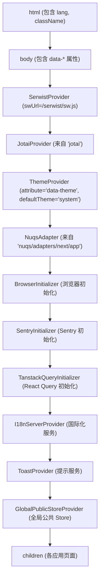
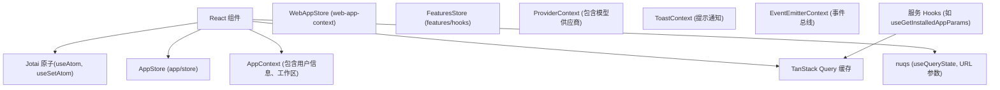
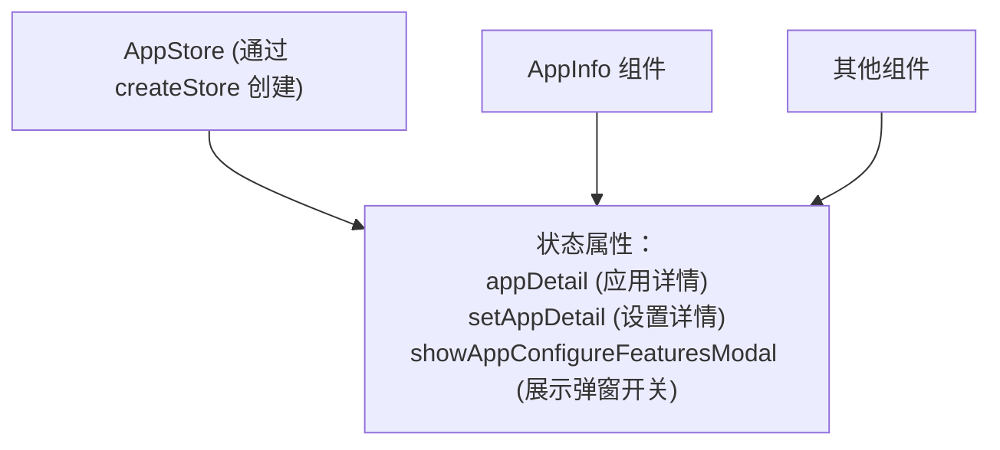
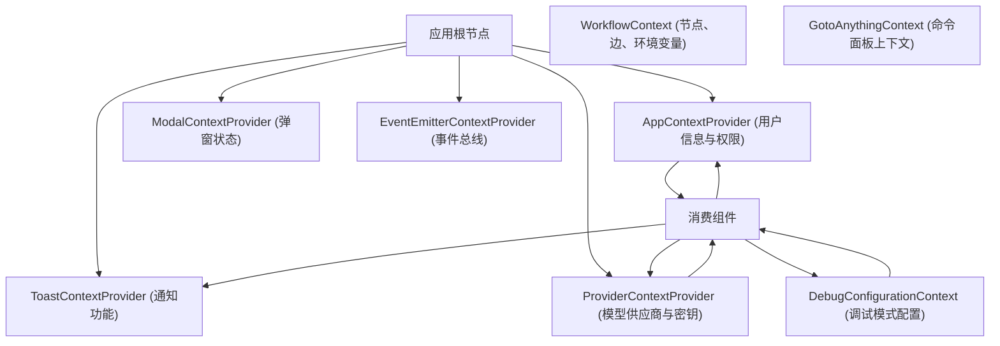
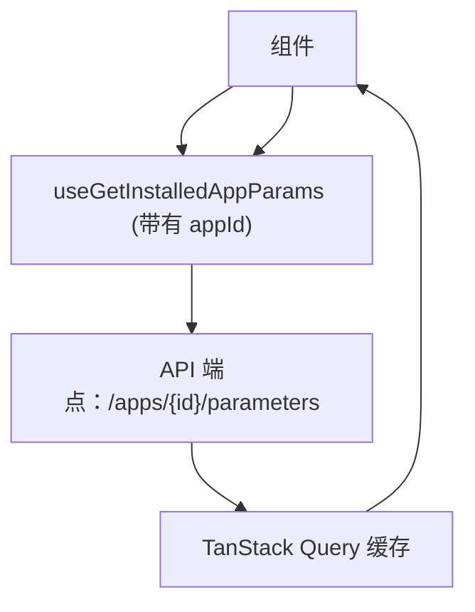
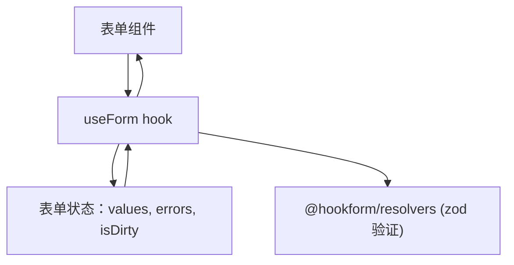
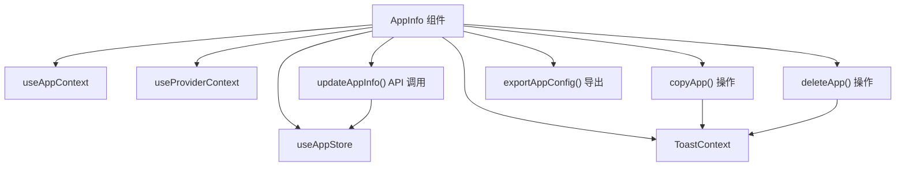
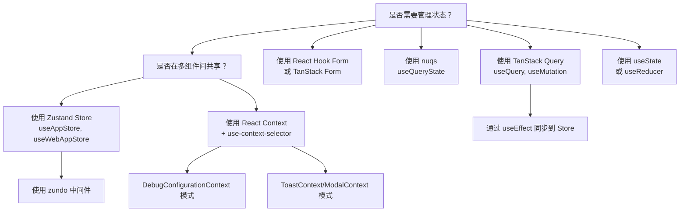

# 状态管理与 Provider 架构

相关源文件

-   [api/libs/helper.py](https://github.com/langgenius/dify/blob/92dbc94f/api/libs/helper.py)
-   [api/tests/unit\_tests/libs/test\_helper.py](https://github.com/langgenius/dify/blob/92dbc94f/api/tests/unit_tests/libs/test_helper.py)
-   [web/.env.example](https://github.com/langgenius/dify/blob/92dbc94f/web/.env.example)
-   [web/app/(commonLayout)/app/(appDetailLayout)/layout.tsx](https://github.com/langgenius/dify/blob/92dbc94f/web/app/(commonLayout)/app/(appDetailLayout)/layout.tsx)
-   [web/app/(commonLayout)/datasets/(datasetDetailLayout)/\[datasetId\]/settings/page.tsx](web/app/(commonLayout)/datasets/(datasetDetailLayout)/%5BdatasetId%5D/settings/page.tsx)
-   [web/app/activate/activateForm.tsx](https://github.com/langgenius/dify/blob/92dbc94f/web/app/activate/activateForm.tsx)
-   [web/app/components/base/form/hooks/use-get-form-values.ts](https://github.com/langgenius/dify/blob/92dbc94f/web/app/components/base/form/hooks/use-get-form-values.ts)
-   [web/app/components/base/form/utils/zod-submit-validator.ts](https://github.com/langgenius/dify/blob/92dbc94f/web/app/components/base/form/utils/zod-submit-validator.ts)
-   [web/app/components/base/logo/logo-embedded-chat-avatar.tsx](https://github.com/langgenius/dify/blob/92dbc94f/web/app/components/base/logo/logo-embedded-chat-avatar.tsx)
-   [web/app/components/plugins/marketplace/description/index.spec.tsx](https://github.com/langgenius/dify/blob/92dbc94f/web/app/components/plugins/marketplace/description/index.spec.tsx)
-   [web/app/components/plugins/marketplace/description/index.tsx](https://github.com/langgenius/dify/blob/92dbc94f/web/app/components/plugins/marketplace/description/index.tsx)
-   [web/app/components/provider/serwist.tsx](https://github.com/langgenius/dify/blob/92dbc94f/web/app/components/provider/serwist.tsx)
-   [web/app/forgot-password/ForgotPasswordForm.spec.tsx](https://github.com/langgenius/dify/blob/92dbc94f/web/app/forgot-password/ForgotPasswordForm.spec.tsx)
-   [web/app/forgot-password/ForgotPasswordForm.tsx](https://github.com/langgenius/dify/blob/92dbc94f/web/app/forgot-password/ForgotPasswordForm.tsx)
-   [web/app/install/installForm.tsx](https://github.com/langgenius/dify/blob/92dbc94f/web/app/install/installForm.tsx)
-   [web/app/layout.tsx](https://github.com/langgenius/dify/blob/92dbc94f/web/app/layout.tsx)
-   [web/app/serwist/\[path\]/route.ts](web/app/serwist/%5Bpath%5D/route.ts)
-   [web/app/sw.ts](https://github.com/langgenius/dify/blob/92dbc94f/web/app/sw.ts)
-   [web/config/index.ts](https://github.com/langgenius/dify/blob/92dbc94f/web/config/index.ts)
-   [web/docker/entrypoint.sh](https://github.com/langgenius/dify/blob/92dbc94f/web/docker/entrypoint.sh)
-   [web/eslint-rules/rules/no-as-any-in-t.js](https://github.com/langgenius/dify/blob/92dbc94f/web/eslint-rules/rules/no-as-any-in-t.js)
-   [web/eslint-rules/rules/no-legacy-namespace-prefix.js](https://github.com/langgenius/dify/blob/92dbc94f/web/eslint-rules/rules/no-legacy-namespace-prefix.js)
-   [web/eslint-rules/rules/require-ns-option.js](https://github.com/langgenius/dify/blob/92dbc94f/web/eslint-rules/rules/require-ns-option.js)
-   [web/eslint-suppressions.json](https://github.com/langgenius/dify/blob/92dbc94f/web/eslint-suppressions.json)
-   [web/eslint.config.mjs](https://github.com/langgenius/dify/blob/92dbc94f/web/eslint.config.mjs)
-   [web/i18n-config/lib.client.ts](https://github.com/langgenius/dify/blob/92dbc94f/web/i18n-config/lib.client.ts)
-   [web/i18n-config/lib.server.ts](https://github.com/langgenius/dify/blob/92dbc94f/web/i18n-config/lib.server.ts)
-   [web/i18n-config/server.ts](https://github.com/langgenius/dify/blob/92dbc94f/web/i18n-config/server.ts)
-   [web/knip.config.ts](https://github.com/langgenius/dify/blob/92dbc94f/web/knip.config.ts)
-   [web/next.config.js](https://github.com/langgenius/dify/blob/92dbc94f/web/next.config.js)
-   [web/pnpm-lock.yaml](https://github.com/langgenius/dify/blob/92dbc94f/web/pnpm-lock.yaml)
-   [web/scripts/gen-icons.mjs](https://github.com/langgenius/dify/blob/92dbc94f/web/scripts/gen-icons.mjs)
-   [web/types/feature.ts](https://github.com/langgenius/dify/blob/92dbc94f/web/types/feature.ts)
-   [web/utils/server-only-context.ts](https://github.com/langgenius/dify/blob/92dbc94f/web/utils/server-only-context.ts)

本文档描述了 Dify Web 前端中的 Provider 层级和状态管理架构。根布局 (Root Layout) 建立了一个嵌套的 Provider 树，用于初始化 Jotai、ThemeProvider、TanStack Query、i18n 以及全局 Store。配置信息通过 body 元素上的 dataset 属性从服务端流转到客户端。

有关工作流特定的状态管理，请参阅 [工作流定义与执行模型](/langgenius/dify/5.1-workflow-definition-and-execution-model)。有关调试配置状态，请参阅 [应用模式渲染](/langgenius/dify/2.3-application-types-and-execution-modes)。

---

## 概览

Dify 前端使用在 `web/app/layout.tsx` 中定义的**基于 Provider 的架构**。根布局将应用程序包裹在特定的 Provider 层级中，每个 Provider 负责应用程序状态和配置的一个不同方面：

1.  **Service Worker**: `SerwistProvider` 用于提供 PWA 能力。
2.  **原子化状态**: `JotaiProvider` 用于原子化状态管理。
3.  **主题管理**: 来自 next-themes 的 `ThemeProvider`。
4.  **URL 状态**: `NuqsAdapter` 用于 URL 参数同步。
5.  **浏览器初始化**: `BrowserInitializer` 用于客户端设置。
6.  **错误追踪**: `SentryInitializer` 用于错误监控。
7.  **服务端状态**: `TanstackQueryInitializer` 用于 API 数据缓存。
8.  **国际化**: `I18nServerProvider` 用于服务端国际化支持。
9.  **通知系统**: `ToastProvider` 用于全局消息提示。
10. **全局配置**: `GlobalPublicStoreProvider` 用于公共配置信息。

**关键依赖：**

-   `jotai@2.16.1` - 原子化状态管理。
-   `next-themes@0.4.6` - 主题管理。
-   `@tanstack/react-query@5.90.12` - 服务端状态管理。
-   `nuqs@2.8.6` - URL 状态管理。
-   `serwist@9.5.0` - 用于 PWA 的 Service Worker。
-   `zustand@5.0.9` - 全局状态 Store。
-   `use-context-selector@2.0.0` - 高性能 Context。
-   `zundo@2.3.0` - 为 Zustand Store 提供撤销/重做能力。

**来源：** [web/app/layout.tsx1-134](https://github.com/langgenius/dify/blob/92dbc94f/web/app/layout.tsx#L1-L134) [web/pnpm-lock.yaml201-203](https://github.com/langgenius/dify/blob/92dbc94f/web/pnpm-lock.yaml#L201-L203) [web/pnpm-lock.yaml246-248](https://github.com/langgenius/dify/blob/92dbc94f/web/pnpm-lock.yaml#L246-L248) [web/pnpm-lock.yaml135-137](https://github.com/langgenius/dify/blob/92dbc94f/web/pnpm-lock.yaml#L135-L137) [web/pnpm-lock.yaml541-543](https://github.com/langgenius/dify/blob/92dbc94f/web/pnpm-lock.yaml#L541-L543) [web/pnpm-lock.yaml357-359](https://github.com/langgenius/dify/blob/92dbc94f/web/pnpm-lock.yaml#L357-L359)

---

## layout.tsx 中的 Provider 层级

根布局文件建立了一个包裹整个应用的嵌套 Provider 树。每个 Provider 初始化特定的能力并使其对子组件可用。

### Provider 树结构


**来源：** [web/app/layout.tsx80-130](https://github.com/langgenius/dify/blob/92dbc94f/web/app/layout.tsx#L80-L130)

### Dataset 属性模式

配置值通过 `body` 元素上的 `data-*` 属性从服务端流转到客户端。服务端布局在 SSR 期间渲染这些属性，客户端代码在运行时读取它们。

**服务端渲染 (layout.tsx)：**

```javascript
const datasetMap: Record<DatasetAttr, string | undefined> = {
  [DatasetAttr.DATA_API_PREFIX]: process.env.NEXT_PUBLIC_API_PREFIX,
  [DatasetAttr.DATA_PUBLIC_API_PREFIX]: process.env.NEXT_PUBLIC_PUBLIC_API_PREFIX,
  [DatasetAttr.DATA_MARKETPLACE_API_PREFIX]: process.env.NEXT_PUBLIC_MARKETPLACE_API_PREFIX,
  [DatasetAttr.DATA_PUBLIC_EDITION]: process.env.NEXT_PUBLIC_EDITION,
  [DatasetAttr.DATA_PUBLIC_AMPLITUDE_API_KEY]: process.env.NEXT_PUBLIC_AMPLITUDE_API_KEY,
  // ... 20 多个配置值
}

return (
  <body
    className="color-scheme h-full select-auto"
    {...datasetMap}
  >
    {/* 各个 provider */}
  </body>
)
```
**客户端消费 (config/index.ts)：**

```javascript
const getStringConfig = (
  envVar: string | undefined,
  dataAttrKey: DatasetAttr,
  defaultValue: string,
) => {
  if (envVar)
    return envVar

  const attrValue = globalThis.document?.body?.getAttribute(dataAttrKey)
  if (attrValue)
    return attrValue
  return defaultValue
}

export const API_PREFIX = getStringConfig(
  process.env.NEXT_PUBLIC_API_PREFIX,
  DatasetAttr.DATA_API_PREFIX,
  'http://localhost:5001/console/api',
)
```
这种模式允许 Docker 部署在运行时通过环境变量注入配置，而无需重新构建 Next.js 应用程序。

**来源：** [web/app/layout.tsx46-78](https://github.com/langgenius/dify/blob/92dbc94f/web/app/layout.tsx#L46-L78) [web/app/layout.tsx95-98](https://github.com/langgenius/dify/blob/92dbc94f/web/app/layout.tsx#L95-L98) [web/config/index.ts42-60](https://github.com/langgenius/dify/blob/92dbc94f/web/config/index.ts#L42-L60) [web/types/feature.ts103-135](https://github.com/langgenius/dify/blob/92dbc94f/web/types/feature.ts#L103-L135)

### 配置枚举

`DatasetAttr` 枚举定义了所有可用的 dataset 属性：

| 属性 | 用途 | 示例值 |
| --- | --- | --- |
| `DATA_API_PREFIX` | 控制台 API URL | `http://localhost:5001/console/api` |
| `DATA_PUBLIC_API_PREFIX` | 服务 API URL | `http://localhost:5001/api` |
| `DATA_PUBLIC_EDITION` | 部署版本 | `SELF_HOSTED`, `CLOUD`, `ENTERPRISE` |
| `DATA_PUBLIC_AMPLITUDE_API_KEY` | 分析工具密钥 | Analytics API Key |
| `DATA_PUBLIC_TEXT_GENERATION_TIMEOUT_MS` | LLM 超时时间 | `60000` |
| `DATA_PUBLIC_MAX_TOOLS_NUM` | 工作流最大工具数 | `10` |
| `DATA_PUBLIC_TOP_K_MAX_VALUE` | RAG 最大 top-k 值 | `10` |
| `DATA_PUBLIC_LOOP_NODE_MAX_COUNT` | 循环最大迭代次数 | `100` |
| `DATA_PUBLIC_BATCH_CONCURRENCY` | 批量任务并发数 | `5` |

**来源：** [web/types/feature.ts103-135](https://github.com/langgenius/dify/blob/92dbc94f/web/types/feature.ts#L103-L135) [web/config/index.ts56-173](https://github.com/langgenius/dify/blob/92dbc94f/web/config/index.ts#L56-L173)

---

## 状态管理层级

除了 Provider 层级外，应用程序还针对不同的关注点使用了多种状态管理库：


**来源：** [web/app/components/app-sidebar/app-info.tsx21-27](https://github.com/langgenius/dify/blob/92dbc94f/web/app/components/app-sidebar/app-info.tsx#L21-L27) [web/app/components/explore/installed-app/index.spec.tsx6-28](https://github.com/langgenius/dify/blob/92dbc94f/web/app/components/explore/installed-app/index.spec.tsx#L6-L28)

---

## JotaiProvider - 原子化状态管理

`JotaiProvider` 是层级结构中的第一个 Provider，它在整个应用中启用了原子化状态管理。Jotai 使用“原子 (Atoms)”作为状态的基础单元。

**Provider 设置：**

```javascript
import { Provider as JotaiProvider } from 'jotai'

<JotaiProvider>
  {/* 其他 providers */}
</JotaiProvider>
```
**使用模式：**

```javascript
import { atom, useAtom } from 'jotai'

// 定义原子
const countAtom = atom(0)

// 在组件中使用
function Counter() {
  const [count, setCount] = useAtom(countAtom)
  return <button onClick={() => setCount(c => c + 1)}>{count}</button>
}
```
Jotai 的优势：

-   **极简模板代码** - 无需为每个原子创建专门的 Context Provider。
-   **细粒度响应** - 组件仅在它们关注的特定原子发生变化时才重新渲染。
-   **TypeScript 集成** - 对原子值拥有完整的类型推导。
-   **派生状态** - 原子可以基于其他原子派生而成。

**来源：** [web/app/layout.tsx2](https://github.com/langgenius/dify/blob/92dbc94f/web/app/layout.tsx#L2-L2) [web/app/layout.tsx101](https://github.com/langgenius/dify/blob/92dbc94f/web/app/layout.tsx#L101-L101) [web/pnpm-lock.yaml201-203](https://github.com/langgenius/dify/blob/92dbc94f/web/pnpm-lock.yaml#L201-L203)

---

## ThemeProvider - 主题管理

来自 `next-themes` 的 `ThemeProvider` 负责管理深色/浅色主题切换，并支持系统偏好检测。

**Provider 配置：**

```javascript
import { ThemeProvider } from 'next-themes'

<ThemeProvider
  attribute="data-theme"
  defaultTheme="system"
  enableSystem
  disableTransitionOnChange
  enableColorScheme={false}
>
  {/* 应用内容 */}
</ThemeProvider>
```
**配置属性说明：**

-   `attribute="data-theme"` - 通过 `<html>` 元素上的 `data-theme` 属性设置主题。
-   `defaultTheme="system"` - 默认使用系统偏好。
-   `enableSystem` - 启用系统主题检测。
-   `disableTransitionOnChange` - 在主题更改期间禁用 CSS 过渡（避免闪烁）。
-   `enableColorScheme={false}` - 禁用自动生成的 `color-scheme` meta 标签。

**在组件中使用：**

```javascript
import { useTheme } from 'next-themes'

function ThemeToggle() {
  const { theme, setTheme } = useTheme()
  return (
    <button onClick={() => setTheme(theme === 'dark' ? 'light' : 'dark')}>
      切换主题
    </button>
  )
}
```
**来源：** [web/app/layout.tsx3](https://github.com/langgenius/dify/blob/92dbc94f/web/app/layout.tsx#L3-L3) [web/app/layout.tsx102-108](https://github.com/langgenius/dify/blob/92dbc94f/web/app/layout.tsx#L102-L108) [web/pnpm-lock.yaml246-248](https://github.com/langgenius/dify/blob/92dbc94f/web/pnpm-lock.yaml#L246-L248)

---

## TanstackQueryInitializer - 服务端状态缓存

`TanstackQueryInitializer` 为服务端状态管理、API 缓存和乐观更新设置了 TanStack Query 客户端。

**Provider 设置：**

```javascript
import { TanstackQueryInitializer } from '@/context/query-client'

<TanstackQueryInitializer>
  {/* 应用内容 */}
</TanstackQueryInitializer>
```
这会初始化一个带有默认配置的 `QueryClient`，包括：

-   数据保鲜时间 (Stale time) 窗口。
-   缓存过期时间。
-   重刷 (Refetch) 行为。
-   错误重试逻辑。

**Query Hook 模式：**

```javascript
const { data, isFetching, error } = useQuery({
  queryKey: ['app', appId],
  queryFn: () => fetchApp(appId),
})
```
Query Client 会自动：

-   根据 Query Key 缓存结果。
-   对进行中的请求进行去重。
-   在窗口获得焦点时重新抓取。
-   处理加载中和错误状态。

**来源：** [web/app/layout.tsx7](https://github.com/langgenius/dify/blob/92dbc94f/web/app/layout.tsx#L7-L7) [web/app/layout.tsx112](https://github.com/langgenius/dify/blob/92dbc94f/web/app/layout.tsx#L112-L112) [web/pnpm-lock.yaml135-137](https://github.com/langgenius/dify/blob/92dbc94f/web/pnpm-lock.yaml#L135-L137)

---

## I18nServerProvider - 国际化

`I18nServerProvider` 初始化服务端国际化，并使翻译资源在整个应用中可用。

**Provider 设置：**

```javascript
import { I18nServerProvider } from './components/provider/i18n-server'

<I18nServerProvider>
  {/* 应用内容 */}
</I18nServerProvider>
```
**服务端翻译加载：**

国际化系统使用 React 的 `cache` 和 `use` 在服务端加载翻译：

```javascript
const [getLocaleCache, setLocaleCache] = serverOnlyContext<Locale | null>(null)

export const getLocaleOnServer = async (): Promise<Locale> => {
  const cached = getLocaleCache()
  if (cached)
    return cached

  // 从 cookie 或 Accept-Language 标头获取 locale
  const localeCookie = (await cookies()).get('locale')
  languages = localeCookie?.value ? [localeCookie.value] : []

  if (!languages.length) {
    const negotiatorHeaders = {};
    (await headers()).forEach((value, key) => (negotiatorHeaders[key] = value))
    languages = new Negotiator({ headers: negotiatorHeaders }).languages()
  }

  const matchedLocale = match(languages, locales, defaultLocale)
  setLocaleCache(matchedLocale)
  return matchedLocale
}
```
**翻译使用：**

```javascript
// 服务端组件
import { useTranslation } from '#i18n'

const { t } = useTranslation('common')
const text = t('welcome')

// 客户端组件
import { useTranslation } from 'react-i18next'

const { t } = useTranslation()
const text = t('welcome', { ns: 'common' })
```
**来源：** [web/app/layout.tsx14](https://github.com/langgenius/dify/blob/92dbc94f/web/app/layout.tsx#L14-L14) [web/app/layout.tsx113](https://github.com/langgenius/dify/blob/92dbc94f/web/app/layout.tsx#L113-L113) [web/i18n-config/server.ts53-81](https://github.com/langgenius/dify/blob/92dbc94f/web/i18n-config/server.ts#L53-L81) [web/i18n-config/lib.server.ts10-12](https://github.com/langgenius/dify/blob/92dbc94f/web/i18n-config/lib.server.ts#L10-L12) [web/i18n-config/lib.client.ts6-8](https://github.com/langgenius/dify/blob/92dbc94f/web/i18n-config/lib.client.ts#L6-L8)

---

## GlobalPublicStoreProvider - 全局配置

`GlobalPublicStoreProvider` 初始化在整个应用中可访问的全局配置状态。

**Provider 设置：**

```javascript
import GlobalPublicStoreProvider from '@/context/global-public-context'

<GlobalPublicStoreProvider>
  {/* 应用内容 */}
</GlobalPublicStoreProvider>
```
该 Provider 从 dataset 属性（如前所述）读取配置，并通过全局 Store 使其可用。

**来源：** [web/app/layout.tsx6](https://github.com/langgenius/dify/blob/92dbc94f/web/app/layout.tsx#L6-L6) [web/app/layout.tsx115-117](https://github.com/langgenius/dify/blob/92dbc94f/web/app/layout.tsx#L115-L117)

---

## 使用 Zustand 进行全局状态管理

### AppStore 模式

Zustand Store 提供了**全局、跨组件的状态**，并支持基于选择器 (selector) 的订阅，以实现细粒度的响应性。主要的 Store 是 `AppStore`：


**在 AppInfo 组件中的使用模式：**

```javascript
// 导入 store
import { useStore as useAppStore } from '@/app/components/app/store'

// 在组件内部使用选择器模式
const appDetail = useAppStore(state => state.appDetail)
const setAppDetail = useAppStore(state => state.setAppDetail)

// 使用
setAppDetail(newAppData)
```
选择器模式 `state => state.appDetail` 确保了组件仅在 `appDetail` 发生变化时才重新渲染，而不会受到 Store 中其他属性变化的影响。

**来源：** [web/app/components/app-sidebar/app-info.tsx21](https://github.com/langgenius/dify/blob/92dbc94f/web/app/components/app-sidebar/app-info.tsx#L21-L21) [web/app/components/app-sidebar/app-info.tsx67-68](https://github.com/langgenius/dify/blob/92dbc94f/web/app/components/app-sidebar/app-info.tsx#L67-L68) [web/app/components/app-sidebar/app-info.tsx105](https://github.com/langgenius/dify/blob/92dbc94f/web/app/components/app-sidebar/app-info.tsx#L105-L105) [web/app/components/workflow/update-dsl-modal.tsx23](https://github.com/langgenius/dify/blob/92dbc94f/web/app/components/workflow/update-dsl-modal.tsx#L23-L23) [web/app/components/workflow/update-dsl-modal.tsx63](https://github.com/langgenius/dify/blob/92dbc94f/web/app/components/workflow/update-dsl-modal.tsx#L63-L63)

### WebAppStore 上下文

针对已安装/分享的应用，使用独立的 `WebAppStore` 管理 Web 应用特有的状态：

```javascript
// 摘自测试 mock，展示了 store 结构
useWebAppStore(selector => {
  const state = {
    updateAppInfo: mockUpdateAppInfo,
    updateWebAppAccessMode: mockUpdateWebAppAccessMode,
    updateAppParams: mockUpdateAppParams,
    updateWebAppMeta: mockUpdateWebAppMeta,
    updateUserCanAccessApp: mockUpdateUserCanAccessApp,
  }
  return selector(state)
})
```
该 Store 处理：

-   应用元数据更新 (`updateAppInfo`)。
-   访问控制状态 (`updateWebAppAccessMode`, `updateUserCanAccessApp`)。
-   运行时参数 (`updateAppParams`)。
-   扩展元数据 (`updateWebAppMeta`)。

**来源：** [web/app/components/explore/installed-app/index.spec.tsx6](https://github.com/langgenius/dify/blob/92dbc94f/web/app/components/explore/installed-app/index.spec.tsx#L6-L6) [web/app/components/explore/installed-app/index.spec.tsx129-146](https://github.com/langgenius/dify/blob/92dbc94f/web/app/components/explore/installed-app/index.spec.tsx#L129-L146) [web/app/components/explore/installed-app/index.spec.tsx397-419](https://github.com/langgenius/dify/blob/92dbc94f/web/app/components/explore/installed-app/index.spec.tsx#L397-L419)

### Features Store (功能开关 Store)

`FeaturesStore` 使用类似的 Zustand 模式管理功能开关和配置：

```javascript
// 测试中的选择器模式
mockUseFeatures.mockImplementation((selector: FeatureSelector) => {
  if (typeof selector === 'function')
    return selector({ features: mockFeaturesState })
  return mockFeaturesState
})

// 状态结构
type FeatureState = {
  moreLikeThis: { enabled: boolean }
  opening: { enabled: boolean, opening_statement: string, suggested_questions: string[] }
  moderation: { enabled: boolean }
  speech2text: { enabled: boolean }
  text2speech: { enabled: boolean }
  file: { enabled: boolean }
  suggested: { enabled: boolean }
  citation: { enabled: boolean }
  annotationReply: { enabled: boolean }
}
```
**来源：** [web/app/components/app/configuration/debug/debug-with-single-model/index.spec.tsx311-341](https://github.com/langgenius/dify/blob/92dbc94f/web/app/components/app/configuration/debug/debug-with-single-model/index.spec.tsx#L311-L341) [web/app/components/app/configuration/debug/debug-with-single-model/index.spec.tsx343](https://github.com/langgenius/dify/blob/92dbc94f/web/app/components/app/configuration/debug/debug-with-single-model/index.spec.tsx#L343-L343)

---

## 配合 use-context-selector 使用 React Context

应用程序使用 `use-context-selector` 进行**优化的 Context 消费**。该库通过允许组件订阅特定的 Context 值来防止不必要的重新渲染。

### Context 架构


### use-context-selector 模式

**标准模式：**

```javascript
import { useContext } from 'use-context-selector'
import { ToastContext } from '@/app/components/base/toast'

// 消费整个 Context
const { notify } = useContext(ToastContext)

// 使用通知
notify({
  type: 'success',
  message: t('editDone', { ns: 'app' })
})
```
**自定义 Hook 模式：**

```javascript
// 封装 Context 的自定义 hook
export const useAppContext = () => {
  return useContext(AppContext)
}

// 在组件中使用
const { userProfile, isCurrentWorkspaceEditor } = useAppContext()
```
**来源：** [web/app/components/app-sidebar/app-info.tsx19](https://github.com/langgenius/dify/blob/92dbc94f/web/app/components/app-sidebar/app-info.tsx#L19-L19) [web/app/components/app-sidebar/app-info.tsx64](https://github.com/langgenius/dify/blob/92dbc94f/web/app/components/app-sidebar/app-info.tsx#L64-L64) [web/app/components/app-sidebar/app-info.tsx207](https://github.com/langgenius/dify/blob/92dbc94f/web/app/components/app-sidebar/app-info.tsx#L207-L207) [web/app/components/workflow/update-dsl-modal.tsx19](https://github.com/langgenius/dify/blob/92dbc94f/web/app/components/workflow/update-dsl-modal.tsx#L19-L19) [web/app/components/workflow/update-dsl-modal.tsx62](https://github.com/langgenius/dify/blob/92dbc94f/web/app/components/workflow/update-dsl-modal.tsx#L62-L62)

### 关键 Context Provider

| Context | 用途 | 关键值 |
| --- | --- | --- |
| `AppContext` | 用户概况与工作区权限 | `userProfile`, `isCurrentWorkspaceEditor`, `isCurrentWorkspaceOwner`, `isCurrentWorkspaceManager` |
| `ProviderContext` | 模型供应商配置 | `textGenerationModelList`, `hasSettedApiKey`, `modelProviders`, `updateModelList()` |
| `DebugConfigurationContext` | 调试/测试模式设置 | `appId`, `modelConfig`, `promptMode`, `dataSets`, `conversationId`, `inputs` |
| `ToastContext` | Toast 提示通知 | `notify()` |
| `ModalContext` | 全局弹窗状态 | `setShowPricingModal()` 及其他弹窗控制 |
| `EventEmitterContext` | 跨组件事件总线 | `eventEmitter` |
| `WebAppContext` (通过 store) | 已安装应用的状态 | `updateAppInfo()`, `updateWebAppAccessMode()`, `updateAppParams()` |
| `GotoAnythingContext` | 命令面板上下文 | `isWorkflowPage`, `isRagPipelinePage` |

**来源：** [web/app/components/app/configuration/debug/debug-with-single-model/index.spec.tsx165-263](https://github.com/langgenius/dify/blob/92dbc94f/web/app/components/app/configuration/debug/debug-with-single-model/index.spec.tsx#L165-L263) [web/app/components/app/configuration/debug/debug-with-single-model/index.spec.tsx288-309](https://github.com/langgenius/dify/blob/92dbc94f/web/app/components/app/configuration/debug/debug-with-single-model/index.spec.tsx#L288-L309) [web/app/components/billing/upgrade-btn/index.spec.tsx10-15](https://github.com/langgenius/dify/blob/92dbc94f/web/app/components/billing/upgrade-btn/index.spec.tsx#L10-L15) [web/app/components/goto-anything/context.spec.tsx1-60](https://github.com/langgenius/dify/blob/92dbc94f/web/app/components/goto-anything/context.spec.tsx#L1-L60)

### DebugConfigurationContext 示例

该 Context 展示了**复杂的、嵌套的状态结构**：

```javascript
// 摘自测试 mock，展示了完整结构
const mockDebugConfigContext = {
  // 应用标识
  appId: 'test-app-id',

  // 模型配置
  modelConfig: createMockModelConfig({
    agentConfig: {
      enabled: false,
      max_iteration: 5,
      tools: [{
        tool_name: 'test-tool',
        provider_id: 'test-provider',
        provider_type: CollectionType.builtIn,
        tool_label: '测试工具',
        enabled: true,
      }],
      strategy: AgentStrategy.react,
    },
  }),
  setModelConfig: vi.fn(),

  // 提示词配置
  promptMode: PromptMode.simple,
  setPromptMode: vi.fn(),
  currentAdvancedPrompt: [],
  setCurrentAdvancedPrompt: vi.fn(),

  // 知识库配置
  dataSets: [],
  setDataSets: vi.fn(),
  datasetConfigs: {
    retrieval_model: 'single',
    top_k: 4,
    score_threshold_enabled: false,
  },
  setDatasetConfigs: vi.fn(),

  // 功能配置
  moreLikeThisConfig: { enabled: false },
  setMoreLikeThisConfig: vi.fn(),
  speechToTextConfig: { enabled: false },
  setSpeechToTextConfig: vi.fn(),
  textToSpeechConfig: { enabled: false, voice: '', language: '' },
  setTextToSpeechConfig: vi.fn(),

  // 输入/输出状态
  inputs: { var1: '测试输入' },
  setInputs: vi.fn(),
  query: '',
  setQuery: vi.fn(),

  // 会话状态
  conversationId: null,
  setConversationId: vi.fn(),

  // 事件处理程序
  showHistoryModal: vi.fn(),
  showSelectDataSet: vi.fn(),
}
```
这展示了**聚焦作用域的模式**：Context 将特定功能（在此示例中为调试/测试模式）所需的相关状态和操作组合在一起。

**来源：** [web/app/components/app/configuration/debug/debug-with-single-model/index.spec.tsx165-263](https://github.com/langgenius/dify/blob/92dbc94f/web/app/components/app/configuration/debug/debug-with-single-model/index.spec.tsx#L165-L263)

---

## 使用 TanStack Query 进行服务端状态管理

TanStack Query (即 React Query) 管理**服务端数据的抓取、缓存和同步**。它为异步操作提供了内置加载、错误和重新抓取状态的 Hook。

### Query Hook 模式


**服务 Hook 示例：**

```javascript
// 测试中的 mock，展示了 hook 结构
useGetInstalledAppParams.mockReturnValue({
  isFetching: false,  // 加载状态
  data: mockAppParams,  // 缓存数据
  error: null  // 错误状态
})

// 在组件中使用
const {
  data: appParams,
  isFetching,
  error
} = useGetInstalledAppParams(appId)

// 处理各种状态
if (isFetching) return <Loading />
if (error) return <Error message={error.message} />
return <Content data={appParams} />
```
**来源：** [web/app/components/explore/installed-app/index.spec.tsx24-28](https://github.com/langgenius/dify/blob/92dbc94f/web/app/components/explore/installed-app/index.spec.tsx#L24-L28) [web/app/components/explore/installed-app/index.spec.tsx155-159](https://github.com/langgenius/dify/blob/92dbc94f/web/app/components/explore/installed-app/index.spec.tsx#L155-L159) [web/app/components/explore/installed-app/index.spec.tsx179-188](https://github.com/langgenius/dify/blob/92dbc94f/web/app/components/explore/installed-app/index.spec.tsx#L179-L188)

### 常用服务 Hooks

| Hook | 用途 | 返回内容 |
| --- | --- | --- |
| `useGetInstalledAppParams` | 获取应用的运行时参数 | `{ user_input_form, file_upload, system_parameters }` |
| `useGetInstalledAppMeta` | 获取应用元数据 | `{ tool_icons }` |
| `useGetInstalledAppAccessModeByAppId` | 获取访问控制模式 | `{ accessMode }` |
| `useGetUserCanAccessApp` | 检查用户访问权限 | `{ result: boolean }` |

### Query 状态副作用 (Effects)

组件使用 `useEffect` **将 Query 数据同步到 Context 或 Store**：

```javascript
// 当 query 数据返回时更新 store
useEffect(() => {
  if (appParams) {
    updateAppParams(appParams)
  }
}, [appParams, updateAppParams])

useEffect(() => {
  if (webAppAccessMode?.accessMode) {
    updateWebAppAccessMode(webAppAccessMode.accessMode)
  }
}, [webAppAccessMode, updateWebAppAccessMode])
```
该模式在**服务端状态 (TanStack Query)** 与**全局状态 (Zustand store)** 或**作用域状态 (Context)** 之间架起了桥梁。

**来源：** [web/app/components/explore/installed-app/index.spec.tsx435-457](https://github.com/langgenius/dify/blob/92dbc94f/web/app/components/explore/installed-app/index.spec.tsx#L435-L457)

---

## 表单状态管理

### React Hook Form 模式

`react-hook-form@7.68.0` 是主要的表单库，提供**非受控表单状态**及验证功能：


**依赖项：**

-   `react-hook-form@7.68.0` - 核心表单库。
-   `@hookform/resolvers@5.2.2` - 模式验证适配器。
-   `zod@3.25.76` - 模式验证库。

**核心特性：**

-   **非受控输入** - 最小化重新渲染。
-   **Schema 验证** - 与 Zod 集成。
-   **Field Arrays** - 动态表单字段。
-   **异步验证** - 支持服务端验证。

**来源：** [web/pnpm-lock.yaml270-272](https://github.com/langgenius/dify/blob/92dbc94f/web/pnpm-lock.yaml#L270-L272) [web/pnpm-lock.yaml81-83](https://github.com/langgenius/dify/blob/92dbc94f/web/pnpm-lock.yaml#L81-L83) [web/pnpm-lock.yaml351-353](https://github.com/langgenius/dify/blob/92dbc94f/web/pnpm-lock.yaml#L351-L353)

### TanStack Form 备选方案

`@tanstack/react-form@1.27.1` 提供了一个**框架无关**的设计：

```bash
# 摘自依赖项
'@tanstack/react-form': '1.27.1'
'@tanstack/react-form-devtools': '0.2.9'
```
该库被有选择地用于需要以下高级特性的复杂表单：

-   类型安全的字段路径。
-   细粒度的订阅模型。
-   自定义验证触发时机。

**来源：** [web/pnpm-lock.yaml126-128](https://github.com/langgenius/dify/blob/92dbc94f/web/pnpm-lock.yaml#L126-L128) [web/pnpm-lock.yaml412-414](https://github.com/langgenius/dify/blob/92dbc94f/web/pnpm-lock.yaml#L412-L414)

---

## 使用 nuqs 进行 URL 状态管理

`nuqs@2.8.6` 提供了**类型安全的 URL 查询参数管理**，使组件状态与 URL 保持同步：

```javascript
import { useQueryState } from 'nuqs'

// 基础用法
const [search, setSearch] = useQueryState('q')

// 类型安全的解析器
const [page, setPage] = useQueryState('page', {
  parse: (value) => parseInt(value) || 1
})

// 更新 URL 和状态
setSearch('new search')  // 更新 URL 为 ?q=new+search
```
**优势：**

-   状态可随 URL 分享。
-   支持浏览器前进/后退。
-   兼容服务端渲染。
-   类型安全的转换。

**来源：** [web/pnpm-lock.yaml246-248](https://github.com/langgenius/dify/blob/92dbc94f/web/pnpm-lock.yaml#L246-L248)

---

## 状态组合模式

### 多层数据流

真实的组件通常会组合多个状态管理层：


**AppInfo 组件示例：**

```javascript
// 多个状态来源
const appDetail = useAppStore(state => state.appDetail)  // Zustand
const setAppDetail = useAppStore(state => state.setAppDetail)  // Zustand
const { notify } = useContext(ToastContext)  // Context
const { onPlanInfoChanged } = useProviderContext()  // Context
const { isCurrentWorkspaceEditor } = useAppContext()  // Context

// 更新多个状态层的 API 调用
const onEdit = async (data) => {
  const app = await updateAppInfo({ appID: appDetail.id, ...data })
  setAppDetail(app)  // 更新 Zustand store
  notify({ type: 'success', message: t('editDone') })  // 更新 toast
}
```
**来源：** [web/app/components/app-sidebar/app-info.tsx62-110](https://github.com/langgenius/dify/blob/92dbc94f/web/app/components/app-sidebar/app-info.tsx#L62-L110) [web/app/components/app-sidebar/app-info.tsx207](https://github.com/langgenius/dify/blob/92dbc94f/web/app/components/app-sidebar/app-info.tsx#L207-L207)

### 事件总线模式 (Event Bus Pattern)

`EventEmitterContext` 提供了一个**发布-订阅事件总线**，用于解耦组件间的通信：

```javascript
// 从 context 获取 event emitter
const { eventEmitter } = useEventEmitterContextContext()

// 发出事件
eventEmitter?.emit({
  type: WORKFLOW_DATA_UPDATE,
  payload: {
    nodes: initialNodes(nodes, edges),
    edges: initialEdges(edges, nodes),
    features: newFeatures,
    environment_variables: environment_variables || [],
  },
})

// 在另一个组件中订阅事件
useEffect(() => {
  const handler = (event) => {
    if (event.type === WORKFLOW_DATA_UPDATE) {
      // 处理更新
    }
  }
  eventEmitter?.on('*', handler)
  return () => eventEmitter?.off('*', handler)
}, [eventEmitter])
```
该模式常用于：

-   工作流图更新。
-   跨组件通知。
-   插件生命周期事件。

**来源：** [web/app/components/workflow/update-dsl-modal.tsx29](https://github.com/langgenius/dify/blob/92dbc94f/web/app/components/workflow/update-dsl-modal.tsx#L29-L29) [web/app/components/workflow/update-dsl-modal.tsx67](https://github.com/langgenius/dify/blob/92dbc94f/web/app/components/workflow/update-dsl-modal.tsx#L67-L67) [web/app/components/workflow/update-dsl-modal.tsx126-138](https://github.com/langgenius/dify/blob/92dbc94f/web/app/components/workflow/update-dsl-modal.tsx#L126-L138)

### 加载与错误状态协调

当消费多个异步来源时，组件需要协调加载/错误状态：

```javascript
// 检查所有加载状态
const isLoading =
  isFetchingInstalledApps ||
  isFetchingAppParams ||
  isFetchingAppMeta ||
  isFetchingAccessMode

if (isLoading) return <LoadingSpinner />

// 检查所有错误状态
const error =
  appParamsError ||
  appMetaError ||
  accessModeError ||
  userAccessError

if (error) return <ErrorDisplay error={error} />

// 所有数据加载完成 - 渲染内容
return <Content ... />
```
**来源：** [web/app/components/explore/installed-app/index.spec.tsx179-224](https://github.com/langgenius/dify/blob/92dbc94f/web/app/components/explore/installed-app/index.spec.tsx#L179-L224) [web/app/components/explore/installed-app/index.spec.tsx237-295](https://github.com/langgenius/dify/blob/92dbc94f/web/app/components/explore/installed-app/index.spec.tsx#L237-L295)

---

## 状态管理决策树


**准则：**

1.  **服务端数据** → 始终使用 TanStack Query。
2.  **全局共享状态** → 使用带有选择器的 Zustand。
3.  **功能域状态** → 使用 React Context (配合 use-context-selector)。
4.  **表单输入** → 使用 React Hook Form 或 TanStack Form。
5.  **URL 参数** → 使用 nuqs 实现可分享的状态。
6.  **跨组件事件** → 使用 EventEmitter 模式。
7.  **本地组件状态** → 使用 useState/useReducer。

**来源：** 以上各小节汇总。

---

## 状态管理测试

### Mock Zustand Store

```javascript
// Mock store 模块
vi.mock('@/app/components/app/store', () => ({
  useStore: vi.fn((selector) => {
    if (typeof selector === 'function')
      return selector({
        setShowAppConfigureFeaturesModal: mockSetShowAppConfigureFeaturesModal
      })
    return mockSetShowAppConfigureFeaturesModal
  }),
}))
```
### Mock Context Provider

```javascript
// Mock 来自 use-context-selector 的 useContext
vi.mock('use-context-selector', () => ({
  useContext: vi.fn(),
  createContext: vi.fn(() => ({})),
}))

// 设置 mock 返回值
;(useContext as Mock).mockReturnValue({
  installedApps: [mockInstalledApp],
  isFetchingInstalledApps: false,
})
```
### Mock TanStack Query

```javascript
// Mock query hook
vi.mock('@/service/use-explore', () => ({
  useGetInstalledAppParams: vi.fn(),
}))

// 设置 mock 返回值
;(useGetInstalledAppParams as Mock).mockReturnValue({
  isFetching: false,
  data: mockAppParams,
  error: null,
})
```
**来源：** [web/app/components/app/configuration/config/assistant-type-picker/index.spec.tsx1-700](https://github.com/langgenius/dify/blob/92dbc94f/web/app/components/app/configuration/config/assistant-type-picker/index.spec.tsx#L1-L700) [web/app/components/explore/installed-app/index.spec.tsx14-28](https://github.com/langgenius/dify/blob/92dbc94f/web/app/components/explore/installed-app/index.spec.tsx#L14-L28) [web/app/components/app/configuration/debug/debug-with-single-model/index.spec.tsx129-156](https://github.com/langgenius/dify/blob/92dbc94f/web/app/components/app/configuration/debug/debug-with-single-model/index.spec.tsx#L129-L156)

---

## 性能优化模式

### Zustand 中的选择器模式

```javascript
// ❌ 差的做法 - 订阅了整个 store
const store = useAppStore()
const appDetail = store.appDetail

// ✅ 好的做法 - 仅订阅 appDetail
const appDetail = useAppStore(state => state.appDetail)
```
### use-context-selector 的收益

```javascript
// 标准 React Context - 在 Context 任何部分变更时都会触发渲染
const { userProfile, workspace, models } = useContext(AppContext)

// use-context-selector - 仅在选定的值变更时触发渲染
const userProfile = useContext(AppContext, ctx => ctx.userProfile)
```
该库对选择器结果执行**浅比较 (shallow comparison)**，以防止不必要的重新渲染。

### Query 保鲜时间 (Stale Time) 配置

```javascript
// 配置 staleTime 以防止频繁抓取
const { data } = useQuery({
  queryKey: ['app', appId],
  queryFn: fetchApp,
  staleTime: 5 * 60 * 1000,  // 5 分钟
  cacheTime: 10 * 60 * 1000,  // 10 分钟
})
```
**来源：** [web/app/components/app-sidebar/app-info.tsx67-68](https://github.com/langgenius/dify/blob/92dbc94f/web/app/components/app-sidebar/app-info.tsx#L67-L68) [web/pnpm-lock.yaml345-347](https://github.com/langgenius/dify/blob/92dbc94f/web/pnpm-lock.yaml#L345-L347)

---

## 总结

Dify 前端使用了一个**有目的的分层状态架构**：

| 层级 | 库 | 使用场景 |
| --- | --- | --- |
| 全局状态 | Zustand | 全局共享状态（如 appDetail, features 开关） |
| 域状态 | React Context + use-context-selector | 功能特定的状态树（如调试配置、供应商配置） |
| 服务端状态 | TanStack Query | API 数据抓取与缓存 |
| 表单状态 | React Hook Form / TanStack Form | 表单输入验证与提交 |
| URL 状态 | nuqs | 通过 URL 参数实现可分享的状态 |
| 事件流 | EventEmitter | 解耦的发布-订阅通信 |

该架构实现了：

-   **关注点分离** - 不同的工具处理各自擅长的领域。
-   **性能优化** - 通过选择器模式防止无效重绘。
-   **类型安全** - 在所有层级都深度集成了 TypeScript。
-   **开发体验** - 每一层都有专门的开发者工具（React Query Devtools, TanStack Form Devtools）。

**来源：** 以上各小节汇总。
