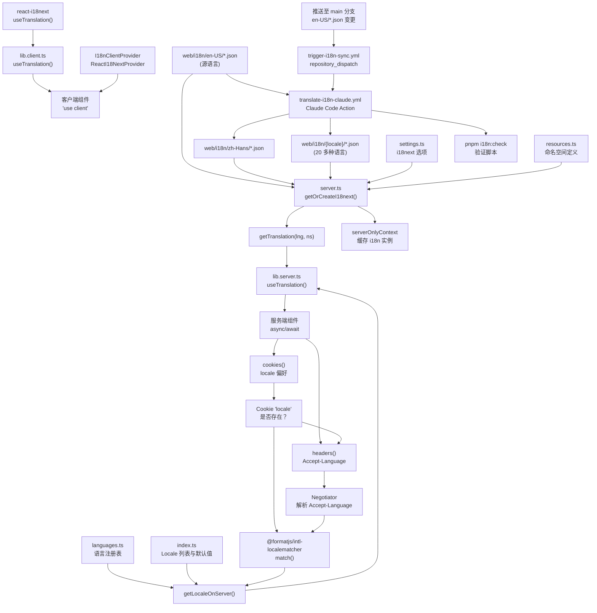
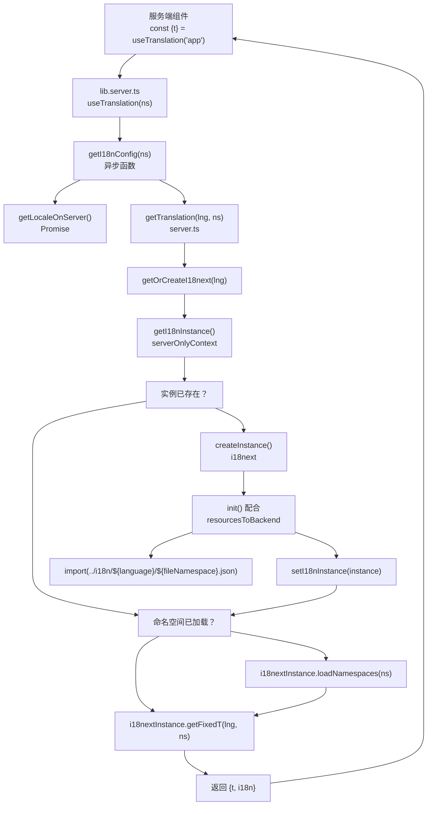
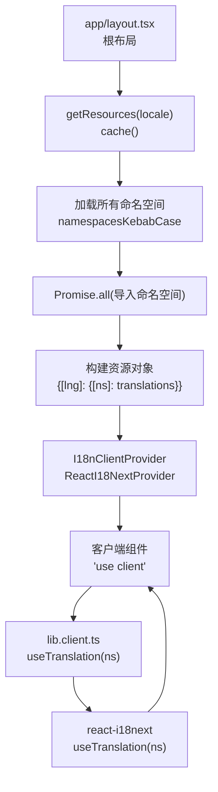
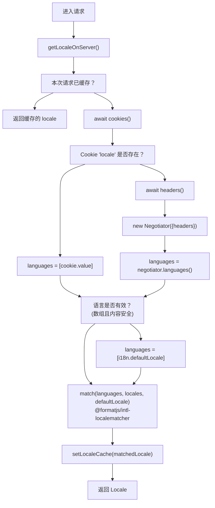
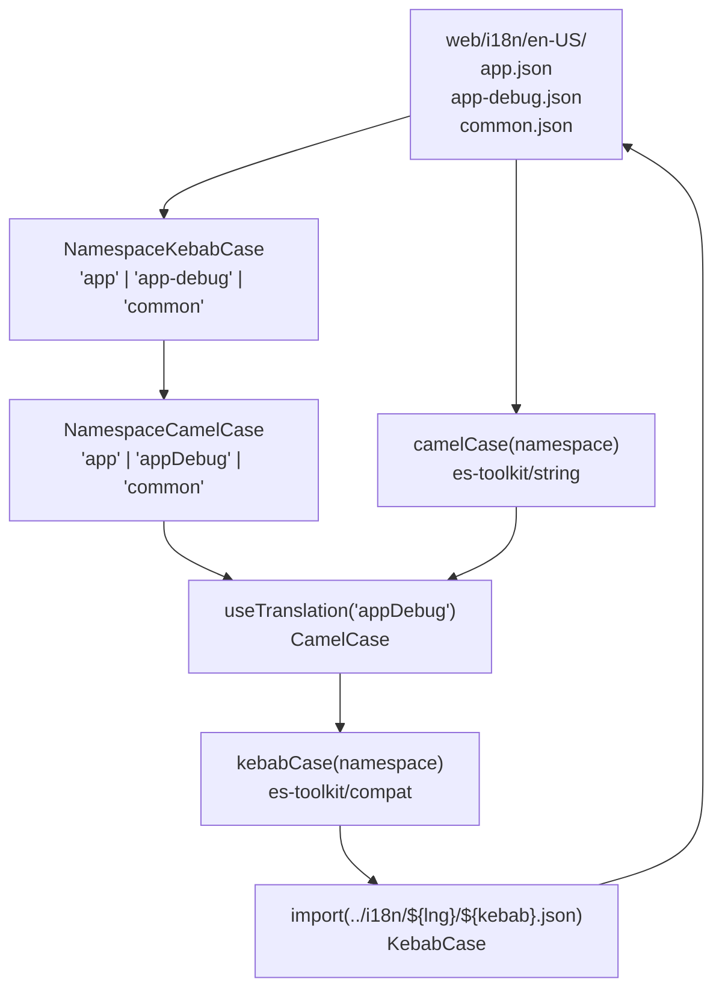
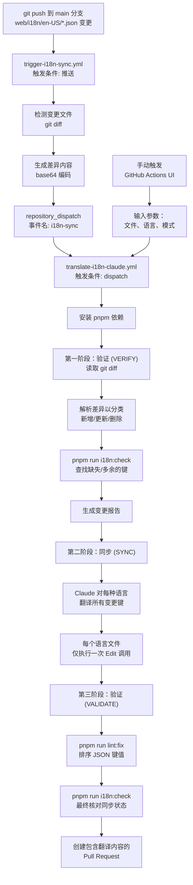
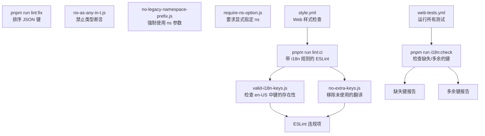

# 国际化 (i18n) 系统

相关源文件

-   [.github/workflows/api-tests.yml](https://github.com/langgenius/dify/blob/92dbc94f/.github/workflows/api-tests.yml)
-   [.github/workflows/autofix.yml](https://github.com/langgenius/dify/blob/92dbc94f/.github/workflows/autofix.yml)
-   [.github/workflows/build-push.yml](https://github.com/langgenius/dify/blob/92dbc94f/.github/workflows/build-push.yml)
-   [.github/workflows/db-migration-test.yml](https://github.com/langgenius/dify/blob/92dbc94f/.github/workflows/db-migration-test.yml)
-   [.github/workflows/deploy-agent-dev.yml](https://github.com/langgenius/dify/blob/92dbc94f/.github/workflows/deploy-agent-dev.yml)
-   [.github/workflows/deploy-dev.yml](https://github.com/langgenius/dify/blob/92dbc94f/.github/workflows/deploy-dev.yml)
-   [.github/workflows/deploy-hitl.yml](https://github.com/langgenius/dify/blob/92dbc94f/.github/workflows/deploy-hitl.yml)
-   [.github/workflows/docker-build.yml](https://github.com/langgenius/dify/blob/92dbc94f/.github/workflows/docker-build.yml)
-   [.github/workflows/main-ci.yml](https://github.com/langgenius/dify/blob/92dbc94f/.github/workflows/main-ci.yml)
-   [.github/workflows/stale.yml](https://github.com/langgenius/dify/blob/92dbc94f/.github/workflows/stale.yml)
-   [.github/workflows/style.yml](https://github.com/langgenius/dify/blob/92dbc94f/.github/workflows/style.yml)
-   [.github/workflows/tool-test-sdks.yaml](https://github.com/langgenius/dify/blob/92dbc94f/.github/workflows/tool-test-sdks.yaml)
-   [.github/workflows/translate-i18n-claude.yml](https://github.com/langgenius/dify/blob/92dbc94f/.github/workflows/translate-i18n-claude.yml)
-   [.github/workflows/trigger-i18n-sync.yml](https://github.com/langgenius/dify/blob/92dbc94f/.github/workflows/trigger-i18n-sync.yml)
-   [.github/workflows/vdb-tests.yml](https://github.com/langgenius/dify/blob/92dbc94f/.github/workflows/vdb-tests.yml)
-   [.github/workflows/web-tests.yml](https://github.com/langgenius/dify/blob/92dbc94f/.github/workflows/web-tests.yml)
-   [api/Dockerfile](https://github.com/langgenius/dify/blob/92dbc94f/api/Dockerfile)
-   [api/migrations/README](https://github.com/langgenius/dify/blob/92dbc94f/api/migrations/README)
-   [web/.nvmrc](https://github.com/langgenius/dify/blob/92dbc94f/web/.nvmrc)
-   [web/Dockerfile](https://github.com/langgenius/dify/blob/92dbc94f/web/Dockerfile)
-   [web/README.md](https://github.com/langgenius/dify/blob/92dbc94f/web/README.md)
-   [web/app/(commonLayout)/app/(appDetailLayout)/layout.tsx](https://github.com/langgenius/dify/blob/92dbc94f/web/app/(commonLayout)/app/(appDetailLayout)/layout.tsx)
-   [web/app/(commonLayout)/datasets/(datasetDetailLayout)/\[datasetId\]/settings/page.tsx](web/app/(commonLayout)/datasets/(datasetDetailLayout)/%5BdatasetId%5D/settings/page.tsx)
-   [web/app/components/base/logo/logo-embedded-chat-avatar.tsx](https://github.com/langgenius/dify/blob/92dbc94f/web/app/components/base/logo/logo-embedded-chat-avatar.tsx)
-   [web/app/components/plugins/marketplace/description/index.spec.tsx](https://github.com/langgenius/dify/blob/92dbc94f/web/app/components/plugins/marketplace/description/index.spec.tsx)
-   [web/app/components/plugins/marketplace/description/index.tsx](https://github.com/langgenius/dify/blob/92dbc94f/web/app/components/plugins/marketplace/description/index.tsx)
-   [web/app/components/provider/serwist.tsx](https://github.com/langgenius/dify/blob/92dbc94f/web/app/components/provider/serwist.tsx)
-   [web/app/serwist/\[path\]/route.ts](web/app/serwist/%5Bpath%5D/route.ts)
-   [web/app/sw.ts](https://github.com/langgenius/dify/blob/92dbc94f/web/app/sw.ts)
-   [web/eslint-rules/rules/no-as-any-in-t.js](https://github.com/langgenius/dify/blob/92dbc94f/web/eslint-rules/rules/no-as-any-in-t.js)
-   [web/eslint-rules/rules/no-legacy-namespace-prefix.js](https://github.com/langgenius/dify/blob/92dbc94f/web/eslint-rules/rules/no-legacy-namespace-prefix.js)
-   [web/eslint-rules/rules/require-ns-option.js](https://github.com/langgenius/dify/blob/92dbc94f/web/eslint-rules/rules/require-ns-option.js)
-   [web/eslint-suppressions.json](https://github.com/langgenius/dify/blob/92dbc94f/web/eslint-suppressions.json)
-   [web/eslint.config.mjs](https://github.com/langgenius/dify/blob/92dbc94f/web/eslint.config.mjs)
-   [web/i18n-config/README.md](https://github.com/langgenius/dify/blob/92dbc94f/web/i18n-config/README.md)
-   [web/i18n-config/lib.client.ts](https://github.com/langgenius/dify/blob/92dbc94f/web/i18n-config/lib.client.ts)
-   [web/i18n-config/lib.server.ts](https://github.com/langgenius/dify/blob/92dbc94f/web/i18n-config/lib.server.ts)
-   [web/i18n-config/server.ts](https://github.com/langgenius/dify/blob/92dbc94f/web/i18n-config/server.ts)
-   [web/knip.config.ts](https://github.com/langgenius/dify/blob/92dbc94f/web/knip.config.ts)
-   [web/next.config.js](https://github.com/langgenius/dify/blob/92dbc94f/web/next.config.js)
-   [web/pnpm-lock.yaml](https://github.com/langgenius/dify/blob/92dbc94f/web/pnpm-lock.yaml)
-   [web/scripts/gen-icons.mjs](https://github.com/langgenius/dify/blob/92dbc94f/web/scripts/gen-icons.mjs)
-   [web/utils/server-only-context.ts](https://github.com/langgenius/dify/blob/92dbc94f/web/utils/server-only-context.ts)

## 目的与范围

本文档描述了 Dify Web 前端使用的国际化 (i18n) 系统。该系统通过 i18next 配合 Next.js App Router 实现了应用的多语言支持，同时支持服务端组件 (Server Components) 和客户端组件 (Client Components)。系统管理着 20 多种语言，拥有自动化的翻译工作流，并为开发者提供了用于维护翻译一致性的工具。

有关后端 API 的国际化，请参阅第 [7.3](/langgenius/dify/7.3-authentication-and-security) 节“身份验证与安全”。有关前端状态管理模式，请参阅第 [9.2](/langgenius/dify/9.2-state-management-and-provider-architecture) 节。

---

## 架构概览

i18n 系统由三层构建：配置层、运行时翻译层和自动化层。它使用 i18next 进行翻译管理，由于 Next.js App Router 的渲染模型差异，为服务端和客户端组件分别提供了不同的代码路径。

### 系统组件架构


**图表：i18n 系统架构**

**来源：** [web/i18n-config/server.ts1-95](https://github.com/langgenius/dify/blob/92dbc94f/web/i18n-config/server.ts#L1-L95) [web/i18n-config/lib.client.ts1-11](https://github.com/langgenius/dify/blob/92dbc94f/web/i18n-config/lib.client.ts#L1-L11) [web/i18n-config/lib.server.ts1-17](https://github.com/langgenius/dify/blob/92dbc94f/web/i18n-config/lib.server.ts#L1-L17) [.github/workflows/translate-i18n-claude.yml1-310](https://github.com/langgenius/dify/blob/92dbc94f/.github/workflows/translate-i18n-claude.yml#L1-L310) [.github/workflows/trigger-i18n-sync.yml1-67](https://github.com/langgenius/dify/blob/92dbc94f/.github/workflows/trigger-i18n-sync.yml#L1-L67)

---

## 翻译文件组织

翻译文件按 locale（语言区域）和 namespace（命名空间）组织。每个命名空间对应应用程序的一个功能区域或模块。

### 文件结构

```
web/i18n/
├── en-US/           # 英语 (美国) - 源语言
│   ├── app.json
│   ├── app-debug.json
│   ├── common.json
│   ├── dataset-settings.json
│   └── ...
├── zh-Hans/         # 简体中文
│   ├── app.json
│   ├── app-debug.json
│   └── ...
├── ja-JP/           # 日语
├── pt-BR/           # 葡萄牙语 (巴西)
└── ...              # 20 多种其他语言
```
### 命名空间规范

| 文件名 (kebab-case) | 命名空间 (camelCase) | 用途 |
| --- | --- | --- |
| `app.json` | `app` | 应用主文本 |
| `app-debug.json` | `appDebug` | 调试界面文本 |
| `common.json` | `common` | 共享/通用文本 |
| `dataset-settings.json` | `datasetSettings` | 知识库配置文本 |
| `plugin.json` | `plugin` | 插件市场文本 |

**核心特征：**

-   文件名使用 **kebab-case**（例如 `app-debug.json`）。
-   命名空间使用 **camelCase**（例如 `appDebug`）。
-   键值采用**点分隔的扁平结构**（例如 `"dialog.title"`）。
-   i18next 配置为 `keySeparator: false`，因此点号被视为字面量。

翻译文件结构示例：

```json
{
  "accessControl": "访问控制",
  "dialog.title": "确认操作",
  "dialog.cancel": "取消"
}
```
**来源：** [web/i18n-config/README.md1-190](https://github.com/langgenius/dify/blob/92dbc94f/web/i18n-config/README.md#L1-L190) [web/i18n-config/server.ts29-32](https://github.com/langgenius/dify/blob/92dbc94f/web/i18n-config/server.ts#L29-L32)

---

## 服务端翻译系统

服务端翻译系统支持 Next.js 服务端组件，采用 async/await 模式。它实现了实例缓存和命名空间的动态加载。

### 服务端翻译流程


**图表：服务端翻译解析过程**

### 使用 `serverOnlyContext` 进行实例缓存

系统使用 React 的 `cache()` API 创建了请求作用域内的单例，用于存储 i18n 实例和 locale 值：

```javascript
// server.ts:18-19
const [getLocaleCache, setLocaleCache] = serverOnlyContext<Locale | null>(null)
const [getI18nInstance, setI18nInstance] = serverOnlyContext<I18nInstance | null>(null)
```
`serverOnlyContext` 模式（来自 [web/utils/server-only-context.ts1-16](https://github.com/langgenius/dify/blob/92dbc94f/web/utils/server-only-context.ts#L1-L16)）利用 React 的 `cache()` 创建了一个在服务端请求期间持久化的 getter/setter 对：

```javascript
// server-only-context.ts:5-14
export function serverOnlyContext<T>(defaultValue: T): [() => T, (v: T) => void] {
  const getRef = cache(() => ({ current: defaultValue }))
  const getValue = (): T => getRef().current
  const setValue = (value: T) => {
    getRef().current = value
  }
  return [getValue, setValue]
}
```
### 动态资源加载

使用 `resourcesToBackend` 动态加载翻译文件：

```javascript
// server.ts:28-32
.use(resourcesToBackend((language: Locale, namespace: NamespaceCamelCase | NamespaceKebabCase) => {
  const fileNamespace = kebabCase(namespace) as NamespaceKebabCase
  return import(`../i18n/${language}/${fileNamespace}.json`)
}))
```
该函数将 camelCase 格式的命名空间转换为 kebab-case 格式的文件名（例如 `appDebug` → `app-debug.json`）。

### 服务端组件中的用法

```javascript
// 示例来自 web/app/(commonLayout)/datasets/(datasetDetailLayout)/[datasetId]/settings/page.tsx
import { useTranslation } from '#i18n'

const Settings = () => {
  const { t } = useTranslation('datasetSettings')

  return (
    <div>
      <div>{t('title')}</div>
      <div>{t('desc')}</div>
    </div>
  )
}
```
`#i18n` 导入别名会根据组件类型自动解析为服务端或客户端实现。

**来源：** [web/i18n-config/server.ts1-95](https://github.com/langgenius/dify/blob/92dbc94f/web/i18n-config/server.ts#L1-L95) [web/i18n-config/lib.server.ts1-17](https://github.com/langgenius/dify/blob/92dbc94f/web/i18n-config/lib.server.ts#L1-L17) [web/utils/server-only-context.ts1-16](https://github.com/langgenius/dify/blob/92dbc94f/web/utils/server-only-context.ts#L1-L16) [web/app/(commonLayout)/datasets/(datasetDetailLayout)/[datasetId]/settings/page.tsx:1-19](https://github.com/langgenius/dify/blob/92dbc94f/web/app/(commonLayout)/datasets/(datasetDetailLayout)/%5BdatasetId%5D/settings/page.tsx)

---

## 客户端翻译系统

客户端翻译使用 react-i18next 的标准 Hook，并包裹了一个精简的兼容层，以保持与服务端 API 的一致性。

### 客户端翻译架构


**图表：客户端翻译设置**

### 资源预加载

所有翻译资源均在根布局级别进行预加载：

```javascript
// server.ts:83-94
export const getResources = cache(async (lng: Locale): Promise<Resource> => {
  const messages = {} as ResourceLanguage

  await Promise.all(
    (namespacesKebabCase).map(async (ns) => {
      const mod = await import(`../i18n/${lng}/${ns}.json`)
      messages[camelCase(ns)] = mod.default
    }),
  )

  return { [lng]: messages }
})
```
这将在单次操作中预加载当前 locale 的所有命名空间，避免了瀑布式请求。

### 客户端 Hook 包装

客户端 Hook 是一个简单的包装器：

```javascript
// lib.client.ts:1-11
'use client'

export function useTranslation(ns?: NamespaceCamelCase) {
  return useTranslationOriginal(ns)
}

export { useLocale } from '@/context/i18n'
```
这保持了与服务端实现的 API 一致性，同时将具体逻辑委托给 react-i18next。

**来源：** [web/i18n-config/lib.client.ts1-11](https://github.com/langgenius/dify/blob/92dbc94f/web/i18n-config/lib.client.ts#L1-L11) [web/i18n-config/server.ts83-94](https://github.com/langgenius/dify/blob/92dbc94f/web/i18n-config/server.ts#L83-L94)

---

## Locale 检测与协商

系统采用两级策略检测用户 locale：优先考虑 Cookie 偏好，其次通过 HTTP 标头协商。

### Locale 检测流程


**图表：Locale 检测算法**

### 实现详情

**基于 Cookie 的偏好：**

```javascript
// server.ts:62-63
const localeCookie = (await cookies()).get('locale')
languages = localeCookie?.value ? [localeCookie.value] : []
```
**标头协商：**

```javascript
// server.ts:66-70
const negotiatorHeaders: Record<string, string> = {};
(await headers()).forEach((value, key) => (negotiatorHeaders[key] = value))
languages = new Negotiator({ headers: negotiatorHeaders }).languages()
```
**安全验证：**

```javascript
// server.ts:73-75
if (!Array.isArray(languages) || languages.length === 0 ||
    !languages.every(lang => typeof lang === 'string' && /^[\w-]+$/.test(lang)))
  languages = [i18n.defaultLocale]
```
此验证通过防止畸形的 Accept-Language 标头来拦截潜在的注入攻击。

**Locale 匹配：**

```javascript
// server.ts:77-79
const matchedLocale = match(languages, locales, i18n.defaultLocale) as Locale
setLocaleCache(matchedLocale)
return matchedLocale
```
使用 `@formatjs/intl-localematcher` 进行符合 RFC 4647 规范的 locale 匹配。

### 语言配置

支持的语言在 [web/i18n-config/languages.ts](https://github.com/langgenius/dify/blob/92dbc94f/web/i18n-config/languages.ts) 中定义：

```javascript
// 示例结构来自 README.md:48-143
export const languages = [
  { value: 'en-US', name: 'English(United States)', supported: true },
  { value: 'zh-Hans', name: '简体中文', supported: true },
  { value: 'ja-JP', name: '日本語 (日本)', supported: false },
  // ... 20 多种语言
]
```
`supported` 标志决定了该语言是否出现在 UI 的语言选择器中。

**来源：** [web/i18n-config/server.ts53-81](https://github.com/langgenius/dify/blob/92dbc94f/web/i18n-config/server.ts#L53-L81) [web/i18n-config/README.md48-143](https://github.com/langgenius/dify/blob/92dbc94f/web/i18n-config/README.md#L48-L143)

---

## 命名空间管理

命名空间将翻译内容按功能区域划分。系统强制执行严格的命名规范并提供类型安全性。

### 命名空间类型系统


**图表：命名空间命名转换系统**

### 关键设计决策

**采用点号分隔的扁平键值：**

```json
{
  "dialog.title": "确认",
  "dialog.message": "你确定吗？"
}
```
**i18next 配置：**

```javascript
// settings.ts (在 server.ts:34 中引用)
{
  keySeparator: false,  // 点号被视为普通字符，而非嵌套对象的分隔符
  // ...
}
```
这意味着 `t('dialog.title')` 返回与字面量键 `"dialog.title"` 关联的字符串，而不是执行嵌套查询。

**类型安全的命名空间使用：**

```javascript
// 摘自 lib.server.ts:5-8 的类型签名
async function getI18nConfig(ns?: NamespaceCamelCase) {
  const lang = await getLocaleOnServer()
  return getTranslation(lang, ns)
}
```
`NamespaceCamelCase` 类型确保了只能传入有效的命名空间。

**来源：** [web/i18n-config/server.ts29-32](https://github.com/langgenius/dify/blob/92dbc94f/web/i18n-config/server.ts#L29-L32) [web/i18n-config/README.md20-34](https://github.com/langgenius/dify/blob/92dbc94f/web/i18n-config/README.md#L20-L34)

---

## 自动化翻译工作流

系统使用 Claude Code (Anthropic API) 自动将英语源文件的变更翻译成所有受支持的语言。

### 翻译自动化流程


**图表：自动化翻译流水线**

### 三阶段翻译过程

**第一阶段：验证 (VERIFY)** 工作流分析 git diff 并对变更进行分类：

```yaml
# translate-i18n-claude.yml:172-225
## 步骤 1.1: 分析 Git Diff
解析差异并分类变更：
- ADD: 仅出现在 + 行中的键（新增键）
- UPDATE: 同时出现在 - 和 + 行中的键（值已更改）
- DELETE: 仅出现在 - 行中的键（已删除的键）

## 步骤 1.3: 对每种语言运行 i18n:check
pnpm --dir ${{ github.workspace }}/web run i18n:check

## 步骤 1.4: 生成变更报告
```
**第二阶段：同步 (SYNC)** Claude 执行翻译并应用变更：

```yaml
# translate-i18n-claude.yml:231-275
### 步骤 2.1: 处理 ADD 操作（每个语言文件批量执行）
1. 首先，在思维中为所有语言翻译所有新增键。
2. 然后，针对每个语言文件，执行一次 Edit 操作：
   - 读取文件一次。
   - 在开头插入所有新增键。
   - 无需担心字母顺序 —— 稍后 lint:fix 会进行排序。
```
**核心效率规则：** 每个语言文件仅调用一次 Edit 工具，将所有键的新增操作合并执行。

**第三阶段：验证 (VALIDATE)** 确保正确性：

```yaml
# translate-i18n-claude.yml:335-346
### 步骤 3.1: 运行 lint:fix
pnpm --dir ${{ github.workspace }}/web run lint:fix

### 步骤 3.2: 再次运行 i18n:check
pnpm --dir ${{ github.workspace }}/web run i18n:check

### 步骤 3.3: 创建 Pull Request
```
### 对人工翻译的特殊处理

工作流会尊重复向 `zh-Hans` 和 `ja-JP` 中已有的人工翻译：

```yaml
# translate-i18n-claude.yml:255-269
如果 zh-Hans 或 ja-JP 文件在同一次推送中也被修改了：
1. 缺失键：仍需添加（以确保完整性）。
2. 现有翻译：与新的英语值进行对比：
   - 如果翻译完全错误 → 更新。
   - 如果翻译大致正确（表达了意思） → 保留。
   - 存疑时，保留人工翻译。
```
### 手动触发选项

工作流可以通过参数手动触发：

| 参数 | 描述 | 示例 |
| --- | --- | --- |
| `files` | 待翻译的特定文件 | `"app common"` |
| `languages` | 目标语言 | `"zh-Hans ja-JP"` |
| `mode` | `incremental` (增量) 或 `full` (全量) | `incremental` (默认) |

**来源：** [.github/workflows/translate-i18n-claude.yml1-310](https://github.com/langgenius/dify/blob/92dbc94f/.github/workflows/translate-i18n-claude.yml#L1-L310) [.github/workflows/trigger-i18n-sync.yml1-67](https://github.com/langgenius/dify/blob/92dbc94f/.github/workflows/trigger-i18n-sync.yml#L1-L67)

---

## 开发工具与验证

系统提供了脚本和 ESLint 规则来维护翻译质量和一致性。

### 验证工具


### i18n:check 脚本

该检查脚本验证翻译的完整性：

```bash
# 示例来自 README.md:160-162
pnpm run i18n:check --file app billing --lang zh-Hans --auto-remove
```
参数说明：

-   `--file`: 以空格分隔的命名空间列表（例如 `app billing`）。
-   `--lang`: 以空格分隔的语言代码列表（例如 `zh-Hans ja-JP`）。
-   `--auto-remove`: 自动删除多余的键。

输出结果：

-   若检测到缺失或多余的键，退出码不为零。
-   列出需要翻译的缺失键。
-   列出应当删除的多余键。

### ESLint i18n 规则

**valid-i18n-keys**（仅针对 JSON 文件）：

```javascript
// eslint.config.mjs:133
'dify-i18n/valid-i18n-keys': 'error',
```
验证非英语文件中的所有翻译键在英语源文件中均存在。

**no-extra-keys**（仅针对 JSON 文件）：

```javascript
// eslint.config.mjs:134
'dify-i18n/no-extra-keys': 'error',
```
检测在英语源文件中不存在、应当移除的翻译键。

**no-as-any-in-t**（针对 TypeScript 文件）：

```javascript
// 示例来自 no-as-any-in-t.js:22-23
messageId: 'noAsAnyInT',
'Avoid using "as any" in t() function calls.'
```
防止在翻译调用中通过类型断言绕过检查：

```javascript
// ❌ 差的做法
t('key' as any)

// ✅ 好的做法
t('key')  // 配合 NamespaceCamelCase 享受类型安全
```
**no-legacy-namespace-prefix**: 强制将命名空间从键中分离：

```javascript
// ❌ 差的做法 (遗留风格)
t('app.dialog.title')

// ✅ 好的做法
const { t } = useTranslation('app')
t('dialog.title')
```
**require-ns-option**: 要求显式指定命名空间参数：

```javascript
// ❌ 差的做法
t('some.key')

// ✅ 好的做法
t('some.key', { ns: 'app' })
```
### CI 集成

```yaml
# .github/workflows/style.yml:105-109
- name: Web style check
  run: pnpm run lint:ci
```
CI 流水线在每次 PR 时都会运行包括 i18n 验证在内的所有 ESLint 规则。

**来源：** [web/i18n-config/README.md159-163](https://github.com/langgenius/dify/blob/92dbc94f/web/i18n-config/README.md#L159-L163) [web/eslint.config.mjs122-135](https://github.com/langgenius/dify/blob/92dbc94f/web/eslint.config.mjs#L122-L135) [web/eslint-rules/rules/no-as-any-in-t.js1-106](https://github.com/langgenius/dify/blob/92dbc94f/web/eslint-rules/rules/no-as-any-in-t.js#L1-L106) [web/eslint-rules/rules/no-legacy-namespace-prefix.js1-200](https://github.com/langgenius/dify/blob/92dbc94f/web/eslint-rules/rules/no-legacy-namespace-prefix.js#L1-L200) [web/eslint-rules/rules/require-ns-option.js1-52](https://github.com/langgenius/dify/blob/92dbc94f/web/eslint-rules/rules/require-ns-option.js#L1-L52) [.github/workflows/style.yml105-109](https://github.com/langgenius/dify/blob/92dbc94f/.github/workflows/style.yml#L105-L109)

---

## 使用模式

### 服务端组件模式

```javascript
import { useTranslation } from '#i18n'

const MyServerComponent = async () => {
  const { t } = useTranslation('app')

  return (
    <div>
      <h1>{t('title')}</h1>
      <p>{t('description')}</p>
    </div>
  )
}
```
对于服务端组件，`#i18n` 别名解析为 [web/i18n-config/lib.server.ts](https://github.com/langgenius/dify/blob/92dbc94f/web/i18n-config/lib.server.ts)。

### 客户端组件模式

```javascript
'use client'
import { useTranslation } from '#i18n'

const MyClientComponent = () => {
  const { t } = useTranslation('common')

  return <button>{t('button.save')}</button>
}
```
对于客户端组件，`#i18n` 别名解析为 [web/i18n-config/lib.client.ts](https://github.com/langgenius/dify/blob/92dbc94f/web/i18n-config/lib.client.ts)。

### 多个命名空间的使用

```javascript
const MyComponent = () => {
  const { t } = useTranslation('app')
  const { t: tCommon } = useTranslation('common')

  return (
    <div>
      <h1>{t('title')}</h1>
      <button>{tCommon('operation.cancel')}</button>
    </div>
  )
}
```
示例来自 [web/app/components/plugins/marketplace/description/index.tsx1-73](https://github.com/langgenius/dify/blob/92dbc94f/web/app/components/plugins/marketplace/description/index.tsx#L1-L73)。

### 针对 Locale 的特定逻辑

```javascript
import { useLocale } from '#i18n'

const Description = () => {
  const locale = useLocale()
  const isZhHans = locale === 'zh-Hans'

  return (
    <div>
      {isZhHans ? <ChineseLayout /> : <DefaultLayout />}
    </div>
  )
}
```
示例来自 [web/app/components/plugins/marketplace/description/index.tsx1-73](https://github.com/langgenius/dify/blob/92dbc94f/web/app/components/plugins/marketplace/description/index.tsx#L1-L73)。

### 翻译键结构建议

**最佳实践：**

```json
{
  "button.save": "保存",
  "button.cancel": "取消",
  "dialog.confirm.title": "确认操作",
  "dialog.confirm.message": "你确定吗？",
  "error.network": "发生网络错误"
}
```
**使用点号进行逻辑分组，但请记住：**

-   点号仅作为普通的键名字段，不代表嵌套对象。
-   在 JSON 结构中，键值必须保持扁平。
-   按功能/组件分组，以提高可维护性。

**来源：** [web/app/components/plugins/marketplace/description/index.tsx1-73](https://github.com/langgenius/dify/blob/92dbc94f/web/app/components/plugins/marketplace/description/index.tsx#L1-L73) [web/i18n-config/README.md42-45](https://github.com/langgenius/dify/blob/92dbc94f/web/i18n-config/README.md#L42-L45)

---

## 总结

Dify i18n 系统通过以下组件提供了全面的多语言支持：

| 组件 | 实现方式 | 关键文件 |
| --- | --- | --- |
| **服务端翻译** | i18next 配合动态导入及请求级缓存 | `server.ts`, `lib.server.ts` |
| **客户端翻译** | react-i18next 配合预加载资源 | `lib.client.ts`, `I18nClientProvider` |
| **Locale 检测** | Cookie → Accept-Language → 默认值 | `getLocaleOnServer()` |
| **自动化** | 采用三阶段工作流的 Claude Code | `translate-i18n-claude.yml` |
| **验证** | ESLint 规则 + pnpm 脚本 | `eslint-rules/`, `i18n:check` |
| **组织形式** | 基于命名空间、kebab-case 文件、扁平键值 | `web/i18n/{locale}/{namespace}.json` |

该系统支持 20 多种语言，具备自动化的翻译同步、类型安全的 API 以及完善的验证工具，确保了整个应用程序翻译质量的一致性。

**来源：** 本文档中引用的所有文件。
