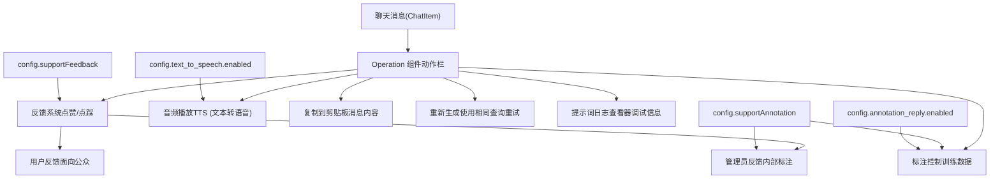
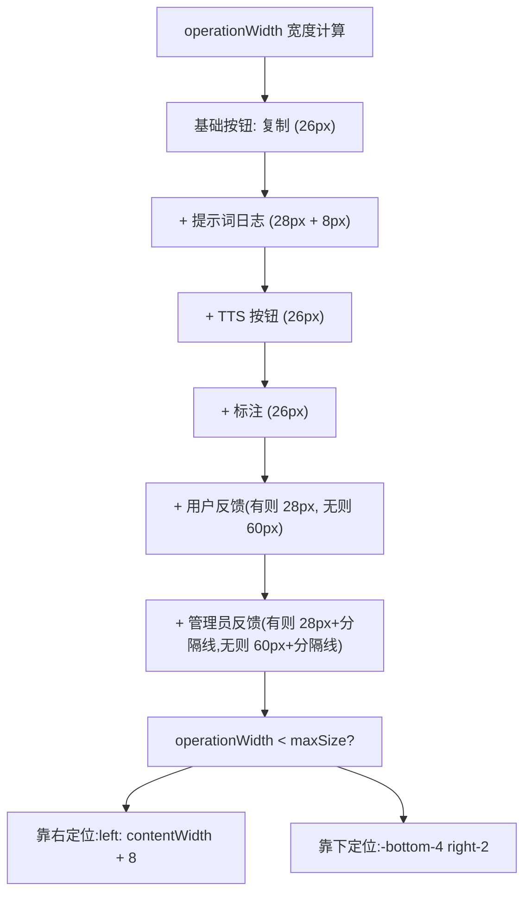
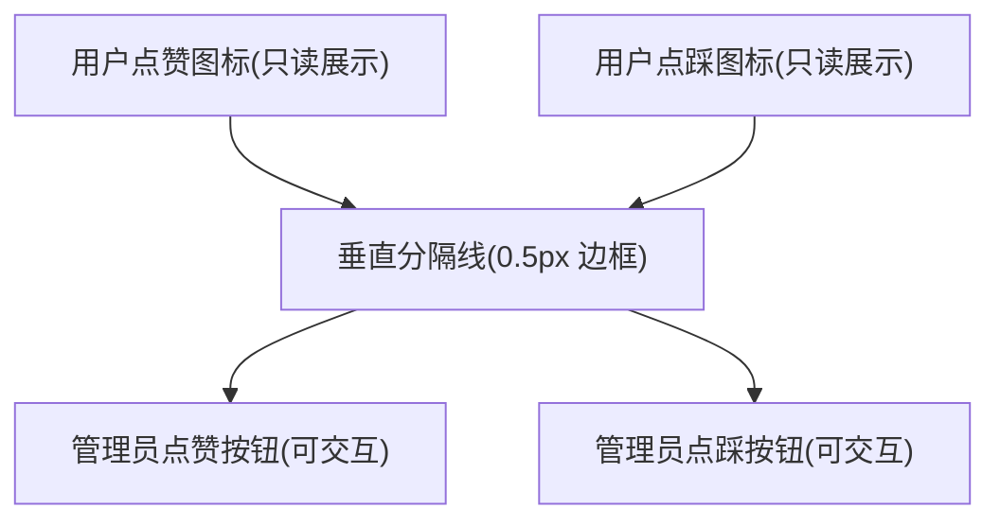
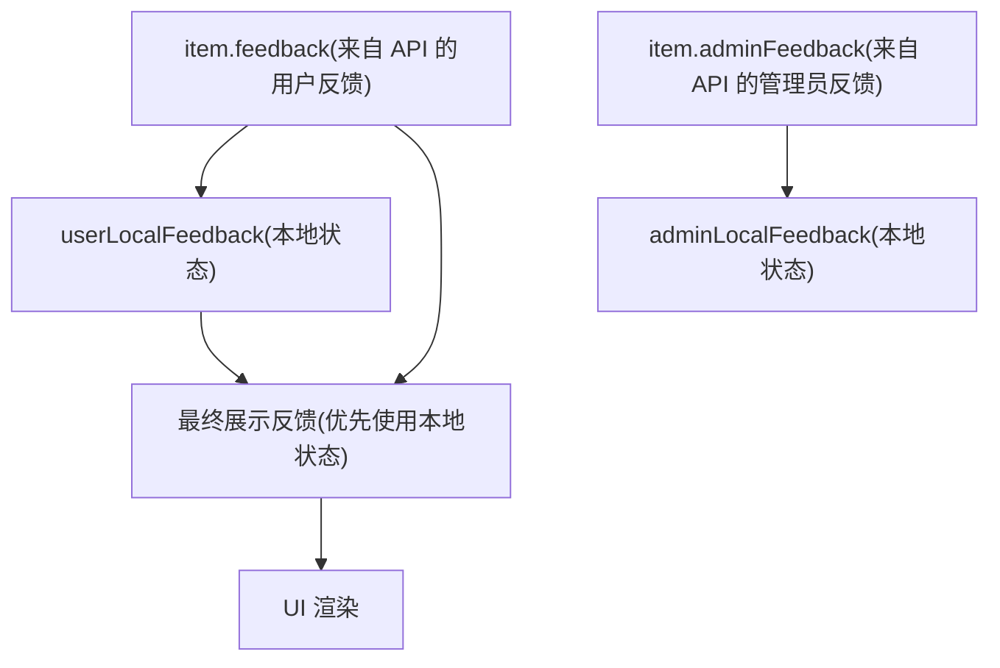
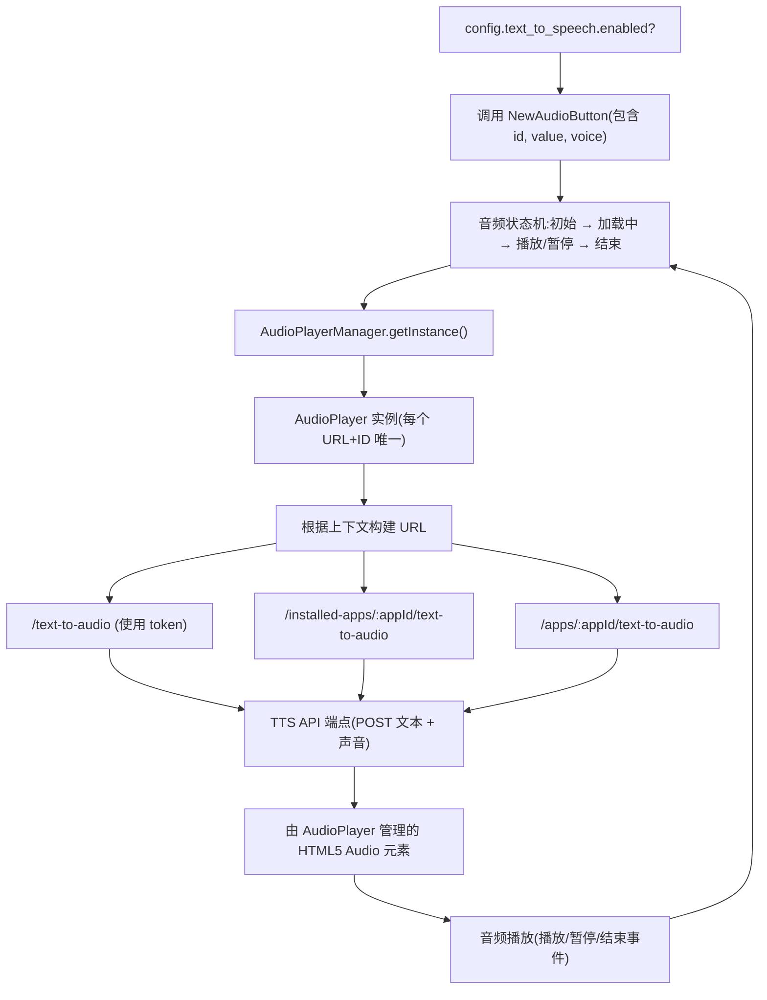
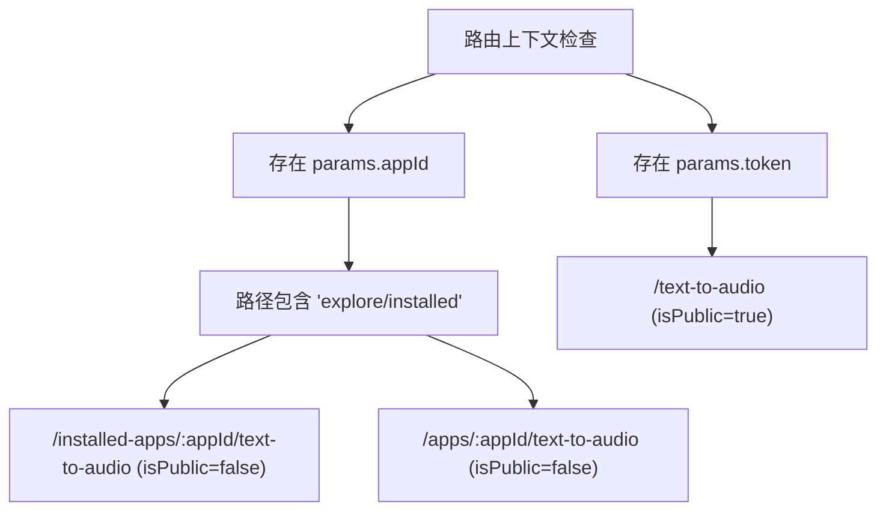
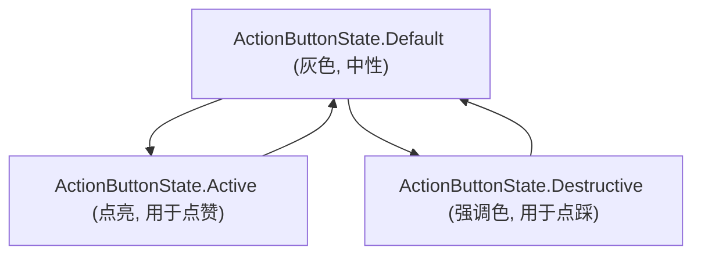
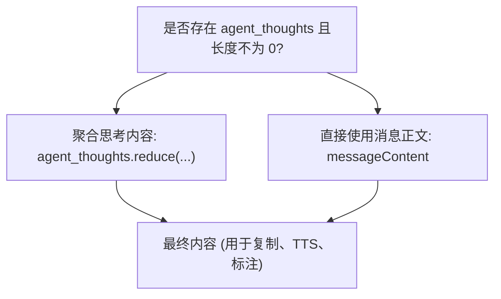

# 聊天 UI 组件与音频功能

相关源文件

-   [api/core/model\_runtime/model\_providers/\_\_base/tts\_model.py](https://github.com/langgenius/dify/blob/92dbc94f/api/core/model_runtime/model_providers/__base/tts_model.py)
-   [web/app/components/app/configuration/config-vision/param-config.tsx](https://github.com/langgenius/dify/blob/92dbc94f/web/app/components/app/configuration/config-vision/param-config.tsx)
-   [web/app/components/base/audio-btn/index.tsx](https://github.com/langgenius/dify/blob/92dbc94f/web/app/components/base/audio-btn/index.tsx)
-   [web/app/components/base/audio-btn/style.module.css](https://github.com/langgenius/dify/blob/92dbc94f/web/app/components/base/audio-btn/style.module.css)
-   [web/app/components/base/chat/chat/answer/operation.tsx](https://github.com/langgenius/dify/blob/92dbc94f/web/app/components/base/chat/chat/answer/operation.tsx)
-   [web/app/components/develop/secret-key/assets/play.svg](https://github.com/langgenius/dify/blob/92dbc94f/web/app/components/develop/secret-key/assets/play.svg)
-   [web/app/components/header/maintenance-notice.tsx](https://github.com/langgenius/dify/blob/92dbc94f/web/app/components/header/maintenance-notice.tsx)

本文档涵盖了 Dify 前端中渲染聊天消息交互控件的 UI 组件，重点介绍了操作组件 (Operation Component)、反馈系统以及音频/TTS (文本转语音) 集成。这些组件允许用户通过复制、重新生成、提供反馈和播放音频等操作与 AI 回复进行交互。

有关整体聊天应用结构和消息渲染的信息，请参阅 [应用类型与执行模式](/langgenius/dify/2.3-application-types-and-execution-modes)。有关 API 级别的反馈和会话管理，请参阅 [会话与反馈 API](/langgenius/dify/8.5-conversation-and-feedback-apis)。

---

## 聊天消息操作概览

聊天界面提供了一个在悬停 AI 消息时显示的动作栏，其中包含各种操作按钮。该动作栏实现在 `Operation` 组件中，位于 [web/app/components/base/chat/chat/answer/operation.tsx](https://github.com/langgenius/dify/blob/92dbc94f/web/app/components/base/chat/chat/answer/operation.tsx)。

**图表：聊天消息操作功能**


**来源：** [web/app/components/base/chat/chat/answer/operation.tsx31-40](https://github.com/langgenius/dify/blob/92dbc94f/web/app/components/base/chat/chat/answer/operation.tsx#L31-L40) [web/app/components/base/chat/chat/answer/operation.tsx52-60](https://github.com/langgenius/dify/blob/92dbc94f/web/app/components/base/chat/chat/answer/operation.tsx#L52-L60)

---

## Operation 组件架构

`Operation` 组件接收的 props 包括聊天条目、问题文本、索引以及各种显示标志。它与聊天上下文集成，以访问配置和回调函数。

### 组件 Props 与结构

| Prop | 类型 | 用途 |
| --- | --- | --- |
| `item` | `ChatItem` | 包含 ID、内容、标注、反馈、Agent 思考过程的聊天消息 |
| `question` | `string` | 触发此响应的用户问题 |
| `index` | `number` | 消息在会话中的位置 |
| `showPromptLog` | `boolean` | 是否显示提示词日志调试按钮 |
| `maxSize` | `number` | 用于位置计算的最大宽度 |
| `contentWidth` | `number` | 消息内容的宽度 |
| `hasWorkflowProcess` | `boolean` | 消息是否包含工作流执行详情 |
| `noChatInput` | `boolean` | 聊天输入是否被禁用（若为 true 则隐藏重新生成按钮） |

**来源：** [web/app/components/base/chat/chat/answer/operation.tsx31-40](https://github.com/langgenius/dify/blob/92dbc94f/web/app/components/base/chat/chat/answer/operation.tsx#L31-L40)

### 聊天上下文 (Chat Context) 集成

该组件从 `useChatContext()` 中访问以下内容：

-   **`config`**: 包含功能标志（`supportFeedback`, `supportAnnotation`, `text_to_speech`, `annotation_reply`, `appId`）的配置对象。
-   **`onAnnotationAdded`**: 创建标注时的回调。
-   **`onAnnotationEdited`**: 修改标注时的回调。
-   **`onAnnotationRemoved`**: 删除标注时的回调。
-   **`onFeedback`**: 提交用户/管理员反馈的回调。
-   **`onRegenerate`**: 重新生成响应的回调。

**来源：** [web/app/components/base/chat/chat/answer/operation.tsx52-60](https://github.com/langgenius/dify/blob/92dbc94f/web/app/components/base/chat/chat/answer/operation.tsx#L52-L60)

### 动态定位逻辑

操作栏根据可用空间和内容进行动态定位：


**来源：** [web/app/components/base/chat/chat/answer/operation.tsx158-176](https://github.com/langgenius/dify/blob/92dbc94f/web/app/components/base/chat/chat/answer/operation.tsx#L158-L176) [web/app/components/base/chat/chat/answer/operation.tsx180-188](https://github.com/langgenius/dify/blob/92dbc94f/web/app/components/base/chat/chat/answer/operation.tsx#L180-L188)

---

## 反馈系统

反馈系统支持两种截然不同的类型：**用户反馈**（面向公众，由终端用户提供）和**管理员反馈**（内部使用，用于标注目的）。显示逻辑根据是否启用了标注而有所不同。

### 用户反馈流程（无标注）

当 `config.supportAnnotation` 为 false 时，仅显示用户反馈：

> **[Mermaid 状态图]**
> *(图表结构无法解析)*

**来源：** [web/app/components/base/chat/chat/answer/operation.tsx128-145](https://github.com/langgenius/dify/blob/92dbc94f/web/app/components/base/chat/chat/answer/operation.tsx#L128-L145) [web/app/components/base/chat/chat/answer/operation.tsx189-228](https://github.com/langgenius/dify/blob/92dbc94f/web/app/components/base/chat/chat/answer/operation.tsx#L189-L228)

### 管理员反馈流程（有标注）

当 `config.supportAnnotation` 为 true 时，同时显示用户和管理员反馈：

**图表：双重反馈系统布局**


**关键实现详情：**

1.  **用户反馈展示**：如果用户已提供反馈，则显示为只读图标，其提示词 (tooltip) 包含评分和可选的文本内容。
2.  **垂直分隔线**：仅当存在用户反馈时才渲染 [web/app/components/base/chat/chat/answer/operation.tsx256](https://github.com/langgenius/dify/blob/92dbc94f/web/app/components/base/chat/chat/answer/operation.tsx#L256-L256)。
3.  **管理员控件**：管理员的点赞/点踩按钮，支持状态切换。
4.  **提示词内容**：使用 `buildFeedbackTooltip()` 函数构建，格式化评分（"点赞"/"点踩"）及可选的文本内容。

**来源：** [web/app/components/base/chat/chat/answer/operation.tsx229-300](https://github.com/langgenius/dify/blob/92dbc94f/web/app/components/base/chat/chat/answer/operation.tsx#L229-L300) [web/app/components/base/chat/chat/answer/operation.tsx99-112](https://github.com/langgenius/dify/blob/92dbc94f/web/app/components/base/chat/chat/answer/operation.tsx#L99-L112)

### 反馈状态管理


组件为两种反馈类型维护了本地状态，以实现在 API 响应前的乐观更新 (optimistic updates)。

**来源：** [web/app/components/base/chat/chat/answer/operation.tsx73-90](https://github.com/langgenius/dify/blob/92dbc94f/web/app/components/base/chat/chat/answer/operation.tsx#L73-L90)

### 反馈弹窗

当用户点击“点踩”时，会打开一个弹窗以收集可选的文本反馈：

**弹窗组件：**

-   **标题**: `t('feedback.title')` - "提供反馈"
-   **副标题**: `t('feedback.subtitle')` - "请告诉我们该回答哪里出了问题"
-   **文本域**: 用于输入详细反馈的多行输入框（4 行）。
-   **按钮**: 取消与提交。

**来源：** [web/app/components/base/chat/chat/answer/operation.tsx354-379](https://github.com/langgenius/dify/blob/92dbc94f/web/app/components/base/chat/chat/answer/operation.tsx#L354-L379)

---

## 音频/TTS 集成

音频播放功能实现了聊天消息的文本转语音 (TTS)。Dify 支持两种音频按钮实现：旧版的 `AudioBtn` 和较新的 `NewAudioButton` 组件。

### 音频系统架构


**来源：** [web/app/components/base/chat/chat/answer/operation.tsx308-314](https://github.com/langgenius/dify/blob/92dbc94f/web/app/components/base/chat/chat/answer/operation.tsx#L308-L314) [web/app/components/base/audio-btn/index.tsx1-111](https://github.com/langgenius/dify/blob/92dbc94f/web/app/components/base/audio-btn/index.tsx#L1-L111)

### AudioBtn 状态机

`AudioBtn` 组件实现了一个包含以下状态的状态机：

| 状态 | 描述 | UI 表现 |
| --- | --- | --- |
| `initial` (初始) | 尚未加载或播放音频 | 播放图标，可用状态 |
| `loading` (加载中) | 正在从 API 获取音频 | 加载转圈，禁用状态 |
| `playing` (播放中) | 音频正在播放 | 暂停图标，可用状态 |
| `paused` (已暂停) | 音频已暂停（转换为 `ended`） | 播放图标，可用状态 |
| `ended` (已结束) | 播放完成或已停止 | 播放图标，可用状态 |

**状态转换逻辑：**

```javascript
// 来自 audio_finished_call 回调
switch (event) {
  case 'ended': setAudioState('ended')
  case 'paused': setAudioState('ended')
  case 'loaded': setAudioState('loading')
  case 'play': setAudioState('playing')
  case 'error': setAudioState('ended')
}
```
**来源：** [web/app/components/base/audio-btn/index.tsx19-50](https://github.com/langgenius/dify/blob/92dbc94f/web/app/components/base/audio-btn/index.tsx#L19-L50)

### TTS 端点的 URL 构建

音频按钮根据路由上下文确定合适的 API 端点：


**来源：** [web/app/components/base/audio-btn/index.tsx51-63](https://github.com/langgenius/dify/blob/92dbc94f/web/app/components/base/audio-btn/index.tsx#L51-L63)

### AudioPlayerManager 模式

`AudioPlayerManager` 实现了单例模式，以确保整个应用程序中同一时间只有一个音频在播放：

**关键方法：**

-   **`getInstance()`**: 返回单例实例。
-   **`getAudioPlayer(url, isPublic, id, value, voice, callback)`**: 为给定参数返回或创建 AudioPlayer。
-   **`playAudio()`**: 开始/恢复播放。
-   **`pauseAudio()`**: 暂停播放。

这确保了在点击一条新消息的播放按钮时，会自动停止之前正在播放的任何音频。

**来源：** [web/app/components/base/audio-btn/index.tsx67-71](https://github.com/langgenius/dify/blob/92dbc94f/web/app/components/base/audio-btn/index.tsx#L67-L71) [web/app/components/base/audio-btn/audio.player.manager.tsx](https://github.com/langgenius/dify/blob/92dbc94f/web/app/components/base/audio-btn/audio.player.manager.tsx) (已引用但未提供源码)

### 后端 TTS 模型接口

后端 TTS 实现通过 `TTSModel` 基类进行抽象：

```python
class TTSModel(AIModel):
    model_type: ModelType = ModelType.TTS

    def invoke(self, model: str, tenant_id: str, credentials: dict,
               content_text: str, voice: str, user: str | None = None) -> Iterable[bytes]:
        # 对于基于插件的 TTS 供应商，委托给 PluginModelClient 处理

    def get_tts_model_voices(self, model: str, credentials: dict,
                            language: str | None = None):
        # 检索 TTS 模型可用的声音列表
```
**来源：** [api/core/model\_runtime/model\_providers/\_\_base/tts\_model.py12-79](https://github.com/langgenius/dify/blob/92dbc94f/api/core/model_runtime/model_providers/__base/tts_model.py#L12-L79)

---

## 动作按钮与 UI 状态

操作栏使用 `ActionButton` 组件，并配合不同的视觉状态来指示交互性。

### ActionButton 状态


**状态用法：**

-   **Default**: 未激活的按钮（未点亮的点赞/点踩）。
-   **Active**: 已提供正面反馈（点赞按钮）。
-   **Destructive**: 已提供负面反馈（点踩按钮）。

**来源：** [web/app/components/base/chat/chat/answer/operation.tsx201-224](https://github.com/langgenius/dify/blob/92dbc94f/web/app/components/base/chat/chat/answer/operation.tsx#L201-L224)

### 常用动作按钮

#### 复制按钮

```javascript
<ActionButton onClick={() => {
  copy(content)
  Toast.notify({ type: 'success', message: t('actionMsg.copySuccessfully') })
}}>
  <RiClipboardLine className="h-4 w-4" />
</ActionButton>
```
将消息内容（或汇总后的 Agent 思考过程）复制到剪贴板，并显示成功提示。

**来源：** [web/app/components/base/chat/chat/answer/operation.tsx315-321](https://github.com/langgenius/dify/blob/92dbc94f/web/app/components/base/chat/chat/answer/operation.tsx#L315-L321)

#### 重新生成按钮

```javascript
<ActionButton onClick={() => onRegenerate?.(item)}>
  <RiResetLeftLine className="h-4 w-4" />
</ActionButton>
```
使用相同的用户查询触发响应的重新生成。当 `noChatInput` 为 true 时隐藏。

**来源：** [web/app/components/base/chat/chat/answer/operation.tsx322-326](https://github.com/langgenius/dify/blob/92dbc94f/web/app/components/base/chat/chat/answer/operation.tsx#L322-L326)

#### 标注控制按钮

`AnnotationCtrlButton` 组件管理标注的创建和编辑：

**Props:**

-   `appId`: 应用标识符。
-   `messageId`: 消息标识符。
-   `cached`: 标注是否已存在。
-   `query`: 原始用户问题。
-   `answer`: AI 响应内容。
-   `onAdded`: 标注创建后的回调。
-   `onEdit`: 打开编辑弹窗的回调。

**来源：** [web/app/components/base/chat/chat/answer/operation.tsx327-337](https://github.com/langgenius/dify/blob/92dbc94f/web/app/components/base/chat/chat/answer/operation.tsx#L327-L337)

---

## 内容聚合逻辑

操作栏处理的消息内容根据消息类型可能来自不同的来源：


这确保了对于基于 Agent 的消息，捕获的是完整的推理链，而不仅仅是最终输出。

**来源：** [web/app/components/base/chat/chat/answer/operation.tsx80-85](https://github.com/langgenius/dify/blob/92dbc94f/web/app/components/base/chat/chat/answer/operation.tsx#L80-L85)

---

## 操作栏的可见性与定位

操作栏使用 CSS 类根据悬停状态和工作流上下文控制其可见性和定位：

### 可见性规则

1.  **反馈栏**: 仅在存在反馈时可见，否则在 `group-hover` 时显示。
2.  **动作按钮**: 默认隐藏，在 `group-hover` 时显示。
3.  **提示词日志**: 默认隐藏，当 `showPromptLog` 为 true 且处于 `group-hover` 时显示。

**CSS 类：**

-   `group-hover:flex`: 当父级拥有 `group` 类且被悬停时显示。
-   `group-hover:block`: 悬停时作为块级元素显示。
-   `hidden`: 默认隐藏状态。

**来源：** [web/app/components/base/chat/chat/answer/operation.tsx189-228](https://github.com/langgenius/dify/blob/92dbc94f/web/app/components/base/chat/chat/answer/operation.tsx#L189-L228) [web/app/components/base/chat/chat/answer/operation.tsx301-339](https://github.com/langgenius/dify/blob/92dbc94f/web/app/components/base/chat/chat/answer/operation.tsx#L301-L339)

### 定位策略

组件会计算如何定位该动作栏：

-   **内容右侧** (`left: contentWidth + 8`): 当总宽度能容纳在可用空间内时。
-   **右下方** (`-bottom-4 right-2`): 当宽度超出空间或存在工作流详情时。

```javascript
const positionRight = useMemo(() => operationWidth < maxSize, [operationWidth, maxSize])
```
**来源：** [web/app/components/base/chat/chat/answer/operation.tsx176](https://github.com/langgenius/dify/blob/92dbc94f/web/app/components/base/chat/chat/answer/operation.tsx#L176-L176) [web/app/components/base/chat/chat/answer/operation.tsx180-188](https://github.com/langgenius/dify/blob/92dbc94f/web/app/components/base/chat/chat/answer/operation.tsx#L180-L188)

---

## 编辑标注弹窗

`EditReplyModal` 组件允许管理员编辑或创建消息的标注：

**Props 结构：**

-   `isShow`: 控制弹窗可见性的布尔值。
-   `query`: 原始用户问题。
-   `answer`: AI 响应。
-   `appId`: 应用标识符。
-   `messageId`: 消息标识符。
-   `annotationId`: 现有标注 ID（若是创建新标注则为空字符串）。
-   `createdAt`: 标注创建的时间戳。
-   **回调函数**: `onHide`, `onEdited`, `onAdded`, `onRemove`。

该弹窗与反馈弹窗是分开的，专门用于管理训练数据标注。

**来源：** [web/app/components/base/chat/chat/answer/operation.tsx341-353](https://github.com/langgenius/dify/blob/92dbc94f/web/app/components/base/chat/chat/answer/operation.tsx#L341-L353)

---

## 功能摘要表：操作特性

| 功能 | 配置标志 | 组件/函数 | 用户操作 | 后端 API |
| --- | --- | --- | --- | --- |
| 用户反馈 | `supportFeedback` | 反馈按钮 | 点赞/点踩并可选填文本 | `onFeedback(id, {rating, content})` |
| 管理员反馈 | `supportFeedback` && `supportAnnotation` | 独立反馈区块 | 点赞/点踩并可选填文本 | 使用相同的 `onFeedback` API |
| TTS 音频 | `text_to_speech.enabled` | `NewAudioButton` | 点击播放/暂停 | `/text-to-audio` 或 `/apps/:appId/text-to-audio` |
| 复制 | 始终启用 | 复制按钮 | 点击进行复制 | 仅限客户端逻辑 |
| 重新生成 | 始终启用（除非 `noChatInput`） | 重新生成按钮 | 点击进行重试 | `onRegenerate(item)` |
| 标注 | `supportAnnotation` && `annotation_reply.enabled` | `AnnotationCtrlButton` | 点击添加/编辑 | `onAnnotationAdded`/`onAnnotationEdited` |
| 提示词日志 | `showPromptLog` 属性 | `Log` 组件 | 悬停以显示 | 客户端展示 |

**来源：** [web/app/components/base/chat/chat/answer/operation.tsx42-382](https://github.com/langgenius/dify/blob/92dbc94f/web/app/components/base/chat/chat/answer/operation.tsx#L42-L382)
