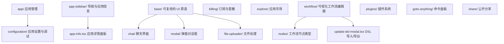
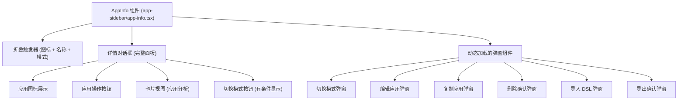
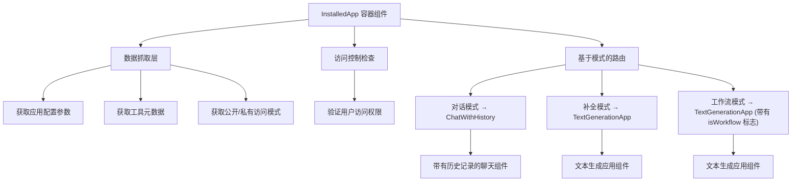
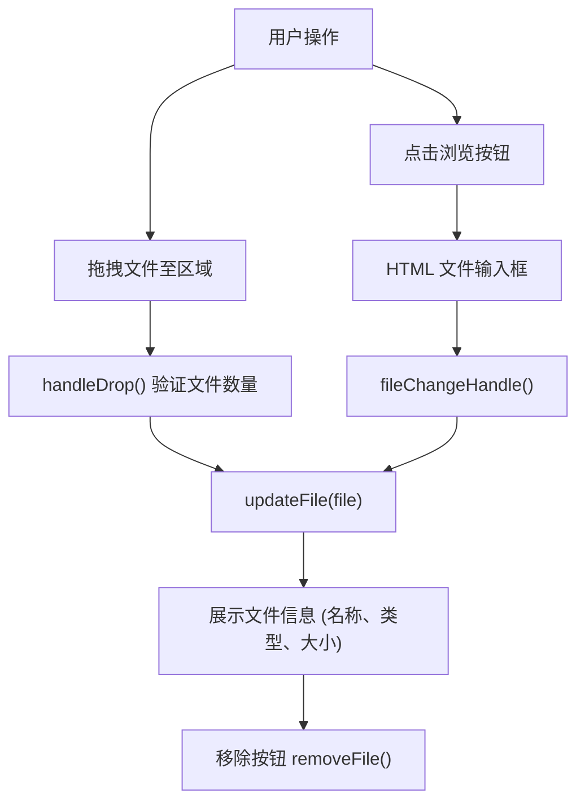
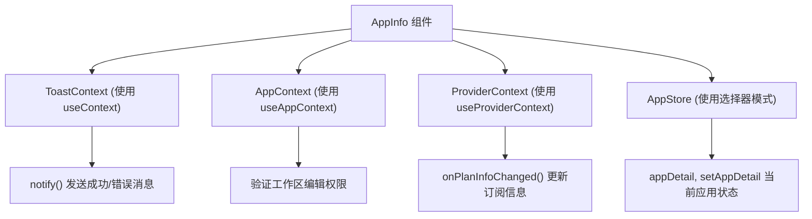
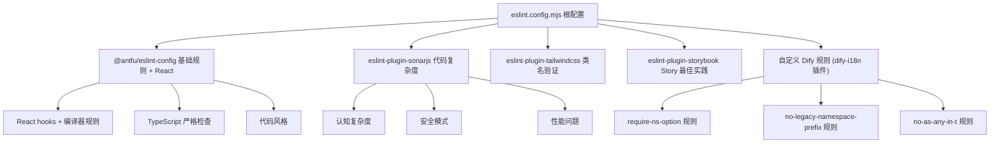
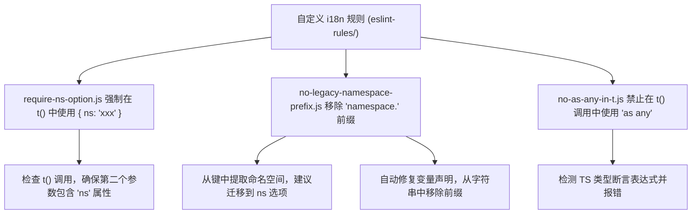
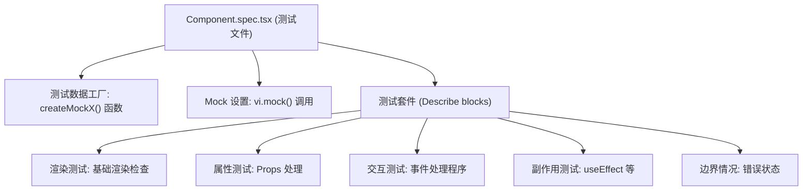
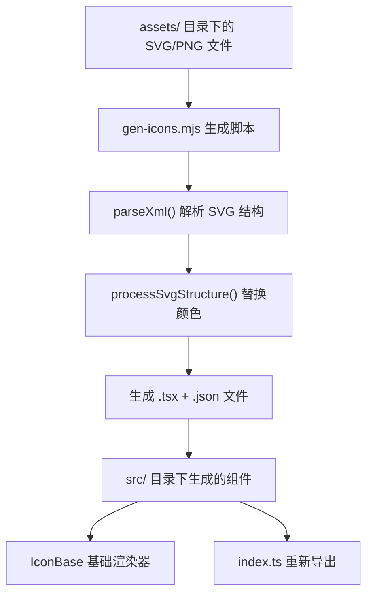
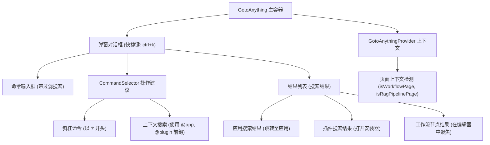

# 组件架构与核心功能

相关源文件

-   [web/app/(commonLayout)/app/(appDetailLayout)/layout.tsx](https://github.com/langgenius/dify/blob/92dbc94f/web/app/(commonLayout)/app/(appDetailLayout)/layout.tsx)
-   [web/app/(commonLayout)/datasets/(datasetDetailLayout)/\[datasetId\]/settings/page.tsx](web/app/(commonLayout)/datasets/(datasetDetailLayout)/%5BdatasetId%5D/settings/page.tsx)
-   [web/app/components/base/logo/logo-embedded-chat-avatar.tsx](https://github.com/langgenius/dify/blob/92dbc94f/web/app/components/base/logo/logo-embedded-chat-avatar.tsx)
-   [web/app/components/plugins/marketplace/description/index.spec.tsx](https://github.com/langgenius/dify/blob/92dbc94f/web/app/components/plugins/marketplace/description/index.spec.tsx)
-   [web/app/components/plugins/marketplace/description/index.tsx](https://github.com/langgenius/dify/blob/92dbc94f/web/app/components/plugins/marketplace/description/index.tsx)
-   [web/app/components/provider/serwist.tsx](https://github.com/langgenius/dify/blob/92dbc94f/web/app/components/provider/serwist.tsx)
-   [web/app/serwist/\[path\]/route.ts](web/app/serwist/%5Bpath%5D/route.ts)
-   [web/app/sw.ts](https://github.com/langgenius/dify/blob/92dbc94f/web/app/sw.ts)
-   [web/eslint-rules/rules/no-as-any-in-t.js](https://github.com/langgenius/dify/blob/92dbc94f/web/eslint-rules/rules/no-as-any-in-t.js)
-   [web/eslint-rules/rules/no-legacy-namespace-prefix.js](https://github.com/langgenius/dify/blob/92dbc94f/web/eslint-rules/rules/no-legacy-namespace-prefix.js)
-   [web/eslint-rules/rules/require-ns-option.js](https://github.com/langgenius/dify/blob/92dbc94f/web/eslint-rules/rules/require-ns-option.js)
-   [web/eslint-suppressions.json](https://github.com/langgenius/dify/blob/92dbc94f/web/eslint-suppressions.json)
-   [web/eslint.config.mjs](https://github.com/langgenius/dify/blob/92dbc94f/web/eslint.config.mjs)
-   [web/i18n-config/lib.client.ts](https://github.com/langgenius/dify/blob/92dbc94f/web/i18n-config/lib.client.ts)
-   [web/i18n-config/lib.server.ts](https://github.com/langgenius/dify/blob/92dbc94f/web/i18n-config/lib.server.ts)
-   [web/i18n-config/server.ts](https://github.com/langgenius/dify/blob/92dbc94f/web/i18n-config/server.ts)
-   [web/knip.config.ts](https://github.com/langgenius/dify/blob/92dbc94f/web/knip.config.ts)
-   [web/next.config.js](https://github.com/langgenius/dify/blob/92dbc94f/web/next.config.js)
-   [web/pnpm-lock.yaml](https://github.com/langgenius/dify/blob/92dbc94f/web/pnpm-lock.yaml)
-   [web/scripts/gen-icons.mjs](https://github.com/langgenius/dify/blob/92dbc94f/web/scripts/gen-icons.mjs)
-   [web/utils/server-only-context.ts](https://github.com/langgenius/dify/blob/92dbc94f/web/utils/server-only-context.ts)

本文档描述了 Dify Web 前端的主要 UI 组件、它们的架构模式以及实现的核心功能。内容涵盖了组件组织、基于弹窗的工作流、文件处理以及代码质量标准。有关状态管理模式，请参阅 [状态管理与 Context 架构](/langgenius/dify/9.2-state-management-and-provider-architecture)。有关测试方法，请参阅 [测试策略与质量保证](/langgenius/dify/9.4-chat-ui-components-and-audio-features)。

---

## 组件组织结构

Dify 前端在 `web/app/components/` 下采用了分层的目录结构。组件按功能领域（而非技术类型）进行分组。

### 目录结构与组件域


**组件设计原则：**

-   **领域驱动组织**: 组件按业务领域分组，而非 UI 模式。
-   **扁平组件层级**: 避免超过 2-3 层的深度嵌套。
-   **懒加载**: 大型组件通过 `next/dynamic` 进行动态导入。
-   **组合优于继承**: 通过更小的原语组合成复杂组件。

**来源：**

-   [web/app/components/app-sidebar/app-info.tsx1-476](https://github.com/langgenius/dify/blob/92dbc94f/web/app/components/app-sidebar/app-info.tsx#L1-L476)
-   [web/app/components/workflow/update-dsl-modal.tsx1-347](https://github.com/langgenius/dify/blob/92dbc94f/web/app/components/workflow/update-dsl-modal.tsx#L1-L347)
-   [web/app/components/explore/installed-app/index.spec.tsx1-617](https://github.com/langgenius/dify/blob/92dbc94f/web/app/components/explore/installed-app/index.spec.tsx#L1-L617)

---

## 核心应用管理组件

### AppInfo 组件 - 应用详情面板

`AppInfo` 组件是查看和管理应用详情的主要界面。它渲染为一个可折叠的侧边栏面板，包含应用元数据和操作。

**组件结构：**


**关键操作：**

| 操作 | 处理函数 | 弹窗组件 | API 调用 |
| --- | --- | --- | --- |
| 编辑应用 | `onEdit` | `CreateAppModal` | `updateAppInfo()` |
| 复制应用 | `onCopy` | `DuplicateAppModal` | `copyApp()` |
| 导出 DSL | `exportCheck` | `DSLExportConfirmModal` | `exportAppConfig()` |
| 导入 DSL | \- | `UpdateDSLModal` | `importDSL()` |
| 删除应用 | `onConfirmDelete` | `Confirm` | `deleteApp()` |
| 切换模式 | \- | `SwitchAppModal` | (内部处理) |

**动态导入：** 所有的弹窗组件都是按需懒加载的，以减少初始包体积：

```javascript
const SwitchAppModal = dynamic(() => import('@/app/components/app/switch-app-modal'), { ssr: false })
const CreateAppModal = dynamic(() => import('@/app/components/explore/create-app-modal'), { ssr: false })
const DuplicateAppModal = dynamic(() => import('@/app/components/app/duplicate-modal'), { ssr: false })
const Confirm = dynamic(() => import('@/app/components/base/confirm'), { ssr: false })
const UpdateDSLModal = dynamic(() => import('@/app/components/workflow/update-dsl-modal'), { ssr: false })
const DSLExportConfirmModal = dynamic(() => import('@/app/components/workflow/dsl-export-confirm-modal'), { ssr: false })
```
**状态管理：** 通过 `useAppStore` 使用 Zustand：

-   `appDetail`: 当前应用的详情。
-   `setAppDetail`: 全局更新应用状态。

**来源：**

-   [web/app/components/app-sidebar/app-info.tsx55-476](https://github.com/langgenius/dify/blob/92dbc94f/web/app/components/app-sidebar/app-info.tsx#L55-L476)
-   [web/app/components/app-sidebar/app-info.tsx36-53](https://github.com/langgenius/dify/blob/92dbc94f/web/app/components/app-sidebar/app-info.tsx#L36-L53)
-   [web/app/components/app-sidebar/app-info.tsx21-23](https://github.com/langgenius/dify/blob/92dbc94f/web/app/components/app-sidebar/app-info.tsx#L21-L23)

### InstalledApp 组件 - 应用类型路由

`InstalledApp` 组件是一个容器，它根据应用模式路由到不同的 UI 实现。它负责处理数据抓取、访问控制和加载状态，然后将渲染任务委托给特定的模式组件。

**组件路由逻辑：**


**数据流与副作用 (Effects)：**

> **[Mermaid 序列图]**
> *(图表结构无法解析)*

**错误处理状态：**

-   **404 Not Found**: 应用 ID 未匹配到任何已安装应用。
-   **403 Forbidden**: 用户缺少访问该应用的权限。
-   **加载中 (Loading)**: 任何服务 Hook 正在抓取数据。
-   **错误 (Error)**: 服务 Hook 返回了错误。

**来源：**

-   [web/app/components/explore/installed-app/index.spec.tsx77-617](https://github.com/langgenius/dify/blob/92dbc94f/web/app/components/explore/installed-app/index.spec.tsx#L77-L617)

---

## 工作流与 DSL 管理组件

### UpdateDSLModal - 工作流导入界面

`UpdateDSLModal` 组件处理从 YAML 文件导入工作流定义。包含文件验证、版本冲突解决以及插件依赖检查。

**导入工作流流程：**

> **[Mermaid 状态图]**
> *(图表结构无法解析)*

**关键函数：**

| 函数名 | 用途 | API 端点 |
| --- | --- | --- |
| `handleFile` | 存储所选文件并读取内容 | \- |
| `validateDSLContent` | 验证 YAML 结构和节点类型 | \- |
| `handleImport` | 启动导入并进行版本检查 | `importDSL()` |
| `onUpdateDSLConfirm` | 在版本警告后确认导入 | `importDSLConfirm()` |
| `handleWorkflowUpdate` | 抓取并更新工作流图 | `fetchWorkflowDraft()` |

**节点类型验证：** 组件会验证导入的节点是否与目标应用模式兼容：

-   **进阶版对话模式**: 拒绝 `End` (结束), `TriggerWebhook`, `TriggerSchedule`, `TriggerPlugin` 节点。
-   **工作流模式**: 拒绝 `Answer` (直接回复) 节点。

**版本冲突处理：** 当返回 `DSLImportStatus.PENDING` 时：

1.  显示 `showErrorModal` 弹窗展示版本对比。
2.  展示导入版本 (`imported_dsl_version`) 与当前系统版本 (`current_dsl_version`)。
3.  要求用户通过 `importDSLConfirm()` 进行显式确认。

**来源：**

-   [web/app/components/workflow/update-dsl-modal.tsx56-347](https://github.com/langgenius/dify/blob/92dbc94f/web/app/components/workflow/update-dsl-modal.tsx#L56-L347)
-   [web/app/components/workflow/update-dsl-modal.tsx140-165](https://github.com/langgenius/dify/blob/92dbc94f/web/app/components/workflow/update-dsl-modal.tsx#L140-L165)
-   [web/app/components/workflow/update-dsl-modal.tsx168-220](https://github.com/langgenius/dify/blob/92dbc94f/web/app/components/workflow/update-dsl-modal.tsx#L168-L220)

### Uploader 组件 - 文件上传处理器

`Uploader` 组件为 DSL 文件提供了拖拽上传和点击上传功能。这是一个可复用的组件，用于 `UpdateDSLModal` 及其他文件上传场景。

**上传交互流程：**


**拖拽事件处理：** 实现了完整的 Drag-and-Drop API：

-   `handleDragEnter`: 设置 `dragging` 状态以显示视觉反馈。
-   `handleDragOver`: 阻止默认行为以允许放置。
-   `handleDragLeave`: 离开区域时清除 `dragging` 状态。
-   `handleDrop`: 提取文件并验证数量（最多 1 个）。

**视觉状态：**

-   **空状态**: 显示上传图标和“拖拽或浏览”文本。
-   **拖拽状态**: 高亮显示边框色。
-   **文件已选**: 显示文件图标、名称、类型标签、大小和移除按钮。

**来源：**

-   [web/app/components/app/create-from-dsl-modal/uploader.tsx25-149](https://github.com/langgenius/dify/blob/92dbc94f/web/app/components/app/create-from-dsl-modal/uploader.tsx#L25-L149)
-   [web/app/components/app/create-from-dsl-modal/uploader.tsx39-67](https://github.com/langgenius/dify/blob/92dbc94f/web/app/components/app/create-from-dsl-modal/uploader.tsx#L39-L67)
-   [web/app/components/app/create-from-dsl-modal/uploader.tsx87-98](https://github.com/langgenius/dify/blob/92dbc94f/web/app/components/app/create-from-dsl-modal/uploader.tsx#L87-L98)

---

## 弹窗管理模式

### 动态弹窗加载策略

前端广泛使用 `next/dynamic` 来懒加载弹窗组件，以减少初始加载体积。弹窗仅在需要时才被加载。

**弹窗加载模式：**

```javascript
const ModalComponent = dynamic(
  () => import('@/app/components/path/to/modal'),
  { ssr: false }  // 弹窗不需要预渲染，故禁用 SSR
)
```
**常用弹窗组件：**

| 弹窗组件 | 用途 | 触发组件 | 状态变量 |
| --- | --- | --- | --- |
| `CreateAppModal` | 创建/编辑应用详情 | AppInfo, 应用列表 | `showEditModal` |
| `DuplicateAppModal` | 复制应用 | AppInfo | `showDuplicateModal` |
| `SwitchAppModal` | 更改应用模式 | AppInfo | `showSwitchModal` |
| `UpdateDSLModal` | 导入工作流 DSL | AppInfo, 工作流 | `showImportDSLModal` |
| `DSLExportConfirmModal` | 导出包含机密变量时的警告 | AppInfo | `secretEnvList.length > 0` |
| `Confirm` | 通用确认对话框 | 多个组件 | `showConfirmDelete` |

### 弹窗状态管理模式

弹窗使用本地 React 状态控制可见性：

```javascript
const [showModal, setShowModal] = useState(false)

// 打开弹窗
setShowModal(true)

// 关闭弹窗 (在 onHide 回调中)
onHide={() => setShowModal(false)}
```
**弹窗生命周期：**

1.  用户触发操作（点击按钮）。
2.  将弹窗状态设为 `true`。
3.  动态导入加载弹窗组件。
4.  弹窗渲染，设置 `isShow={showModal}`。
5.  用户完成操作或取消。
6.  弹窗调用 `onHide()` 或 `onConfirm()`。
7.  父组件将弹窗状态设为 `false`。
8.  弹窗卸载。

**来源：**

-   [web/app/components/app-sidebar/app-info.tsx69-76](https://github.com/langgenius/dify/blob/92dbc94f/web/app/components/app-sidebar/app-info.tsx#L69-L76)
-   [web/app/components/app-sidebar/app-info.tsx410-426](https://github.com/langgenius/dify/blob/92dbc94f/web/app/components/app-sidebar/app-info.tsx#L410-L426)

---

## 组件通信模式

### 基于 Context 的通信

组件使用 React Context 处理横切关注点，如 Toast 通知、应用配置和供应商状态。

**来自 AppInfo 的 Context 使用示例：**


**Context 注入点：**

-   `ToastContext`: 导入自 `@/app/components/base/toast`。
-   `AppContext`: 导入自 `@/context/app-context`。
-   `ProviderContext`: 导入自 `@/context/provider-context`。
-   `DebugConfigurationContext`: 导入自 `@/context/debug-configuration`。
-   `WebAppContext`: 导入自 `@/context/web-app-context`。

**来源：**

-   [web/app/components/app-sidebar/app-info.tsx64-68](https://github.com/langgenius/dify/blob/92dbc94f/web/app/components/app-sidebar/app-info.tsx#L64-L68)
-   [web/app/components/app-sidebar/app-info.tsx207](https://github.com/langgenius/dify/blob/92dbc94f/web/app/components/app-sidebar/app-info.tsx#L207-L207)

### 工作流更新的事件总线 (Event Emitter) 模式

工作流系统使用事件总线广播图的更新：

```javascript
eventEmitter?.emit({
  type: WORKFLOW_DATA_UPDATE,
  payload: {
    nodes: initialNodes(nodes, edges),
    edges: initialEdges(edges, nodes),
    viewport,
    features: newFeatures,
    hash,
    conversation_variables: conversation_variables || [],
    environment_variables: environment_variables || [],
  },
} as any)
```
该模式允许工作流编辑器在导入 DSL 时进行响应式更新，而无需进行 Props 钻取 (prop drilling)。

**来源：**

-   [web/app/components/workflow/update-dsl-modal.tsx126-137](https://github.com/langgenius/dify/blob/92dbc94f/web/app/components/workflow/update-dsl-modal.tsx#L126-L137)
-   [web/app/components/workflow/update-dsl-modal.tsx67](https://github.com/langgenius/dify/blob/92dbc94f/web/app/components/workflow/update-dsl-modal.tsx#L67-L67)

---

## 代码质量与 Lint 架构

### ESLint 配置结构

前端使用包含多个插件层的全面 ESLint 配置：

**ESLint 配置层级：**


**关键规则类别：**

| 插件 | 用途 | 关键规则 |
| --- | --- | --- |
| `@antfu/eslint-config` | 基础 + React + TypeScript | React hooks, TS 严格模式, 风格 |
| `eslint-plugin-sonarjs` | 代码质量 | `cognitive-complexity`, `no-nested-functions`, `max-lines` |
| `eslint-plugin-tailwindcss` | CSS 工具类验证 | `classnames-order`, `no-contradicting-classname` (出于性能考虑已禁用) |
| `eslint-plugin-storybook` | Storybook 最佳实践 | Story 结构验证 |
| `dify-i18n` (自定义) | i18n 命名空间迁移 | `require-ns-option`, `no-legacy-namespace-prefix`, `no-as-any-in-t` |

**React 编译器规则：** 配置中包含了 React Compiler 规则并设为 `warn`，以便逐步采用：

-   `react-hooks/config`
-   `react-hooks/error-boundaries`
-   `react-hooks/immutability`
-   `react-hooks/preserve-manual-memoization`
-   `react-hooks/purity`

**来源：**

-   [web/eslint.config.mjs1-193](https://github.com/langgenius/dify/blob/92dbc94f/web/eslint.config.mjs#L1-L193)
-   [web/eslint.config.mjs8-54](https://github.com/langgenius/dify/blob/92dbc94f/web/eslint.config.mjs#L8-L54)
-   [web/eslint.config.mjs82-130](https://github.com/langgenius/dify/blob/92dbc94f/web/eslint.config.mjs#L82-L130)

### 自定义 i18n Lint 规则

代码库包含三个自定义 ESLint 规则，用于在命名空间迁移期间强制执行 i18n 最佳实践。

**自定义规则实现：**


**规则：`require-ns-option`**

-   **用途:** 确保所有 `t()` 翻译调用都包含显式的命名空间。
-   **检查:** 第二个参数必须是包含 `ns` 属性的对象。
-   **初衷:** 为移除键名中的命名空间前缀做准备。

**规则：`no-legacy-namespace-prefix`**

-   **用途:** 检测并建议移除 `namespace.key` 模式。
-   **处理范围:** 字符串字面量、模板字符串、变量。
-   **自动修复:** 可以更新变量声明（默认禁用）。

**规则：`no-as-any-in-t`**

-   **用途:** 防止在翻译键中通过类型断言绕过类型安全检查。
-   **模式:** `any` (仅限 `as any`) 或 `all` (任何类型断言)。
-   **初衷:** 在 i18n 键重构期间维持类型安全性。

**来源：**

-   [web/eslint-rules/rules/require-ns-option.js1-52](https://github.com/langgenius/dify/blob/92dbc94f/web/eslint-rules/rules/require-ns-option.js#L1-L52)
-   [web/eslint-rules/rules/no-legacy-namespace-prefix.js1-300](https://github.com/langgenius/dify/blob/92dbc94f/web/eslint-rules/rules/no-legacy-namespace-prefix.js#L1-L300)
-   [web/eslint-rules/rules/no-as-any-in-t.js1-106](https://github.com/langgenius/dify/blob/92dbc94f/web/eslint-rules/rules/no-as-any-in-t.js#L1-L106)
-   [web/eslint.config.mjs179-191](https://github.com/langgenius/dify/blob/92dbc94f/web/eslint.config.mjs#L179-L191)

### 使用 Knip 进行死代码检测

项目使用 Knip 检测未使用的文件、依赖和导出项：

**Knip 配置：**

```javascript
{
  entry: [
    'scripts/**/*.{js,ts,mjs}',  // 脚本入口点
    'bin/**/*.{js,ts,mjs}',      // 二进制文件入口点
  ],
  ignore: [
    'i18n/**',      // 自动生成的国际化文件
    'public/**',    // 静态资源
  ],
  ignoreBinaries: ['only-allow'],
  ignoreDependencies: ['babel-loader'],  // next-pwa 所需
  rules: {
    // 所有的规则均设为 'warn' 以逐步采用
    files: 'warn',
    dependencies: 'warn',
    exports: 'warn',
    types: 'warn',
  }
}
```
**检测类别：**

-   **Files:** 未使用的源文件。
-   **Dependencies:** 未使用的 npm 包。
-   **Exports:** 未使用的导出函数/组件。
-   **Types:** 未使用的 TypeScript 类型。
-   **Binaries:** 未使用的二进制脚本。

**来源：**

-   [web/knip.config.ts1-40](https://github.com/langgenius/dify/blob/92dbc94f/web/knip.config.ts#L1-L40)

---

## 组件测试模式

### 测试结构与组织

代码库遵循一致的测试结构，包括工厂函数、全面的 Mock 设置以及基于场景的测试套件。

**标准测试文件结构：**


**工厂函数模式：**

测试文件使用工厂函数创建类型安全的模拟数据：

```javascript
function createMockModelConfig(overrides: Partial<ModelConfig> = {}): ModelConfig {
  return {
    provider: 'openai',
    model_id: 'gpt-3.5-turbo',
    // ... 完整的默认结构
    ...overrides,  // 允许自定义覆盖
  }
}
```
该模式提供了：

-   **类型安全:** 完整的 TypeScript 检查。
-   **默认值:** 合理的默认配置。
-   **灵活性:** 方便通过 overrides 进行自定义。
-   **可复用性:** 可在多个测试中重复使用。

**测试套件类别（要求）：**

1.  **Rendering**: 组件能够正常渲染而不会崩溃。
2.  **Props**: Props 被正确应用和处理。
3.  **User Interactions**: 各种事件触发了预期的行为。
4.  **Effects**: 副作用正确执行。
5.  **Edge Cases**: 错误状态、空值及边界条件处理。

**来源：**

-   [web/app/components/app/configuration/debug/debug-with-single-model/index.spec.tsx17-123](https://github.com/langgenius/dify/blob/92dbc94f/web/app/components/app/configuration/debug/debug-with-single-model/index.spec.tsx#L17-L123)
-   [web/app/components/billing/upgrade-btn/index.spec.tsx32-84](https://github.com/langgenius/dify/blob/92dbc94f/web/app/components/billing/upgrade-btn/index.spec.tsx#L32-L84)
-   [web/app/components/explore/installed-app/index.spec.tsx172-234](https://github.com/langgenius/dify/blob/92dbc94f/web/app/components/explore/installed-app/index.spec.tsx#L172-L234)

### Mock 策略

**仅针对外部依赖进行 Mock：** 测试指南强调仅对外部依赖（服务、Context、第三方库）进行 Mock，而应使用项目内部的真实组件：

```javascript
// ✅ 好的做法：Mock 外部依赖
vi.mock('@/service/base', () => ({ ssePost: mockSsePost }))
vi.mock('next/navigation', () => ({ useRouter: () => ({ push: vi.fn() }) }))

// ❌ 差的做法：不要 Mock 项目内部组件
// 集成测试应使用真实的组件
```
**Context Mock 模式：**

```javascript
const mockDebugConfigContext = {
  appId: 'test-app-id',
  isAPIKeySet: true,
  modelConfig: createMockModelConfig(),
  // ... 完整的 Context 结构
}

vi.mock('@/context/debug-configuration', () => ({
  useDebugConfigurationContext: () => mockDebugConfigContext,
}))
```
**复杂组件的 Mock：** 对于极度复杂的子组件（如拥有 576 行代码的 `ChatWithHistory`），可以创建简单的“测试替身 (test doubles)”：

```javascript
vi.mock('@/app/components/base/chat/chat-with-history', () => ({
  default: ({ installedAppInfo }: Props) => (
    <div data-testid="chat-with-history">
      历史对话组件 - {installedAppInfo?.id}
    </div>
  ),
}))
```
**来源：**

-   [web/app/components/app/configuration/debug/debug-with-single-model/index.spec.tsx126-157](https://github.com/langgenius/dify/blob/92dbc94f/web/app/components/app/configuration/debug/debug-with-single-model/index.spec.tsx#L126-L157)
-   [web/app/components/explore/installed-app/index.spec.tsx14-75](https://github.com/langgenius/dify/blob/92dbc94f/web/app/components/explore/installed-app/index.spec.tsx#L14-L75)

---

## 图标生成系统

### 自动化的 SVG 组件生成

前端包含一个脚本，可自动从 assets 目录中的 SVG 文件生成 React 组件。

**图标生成流水线：**


**处理步骤：**

1.  **遍历目录树**: 递归处理 `assets/public/`, `assets/vender/`, `assets/image/`。
2.  **解析 SVG**: 使用 `@rgrove/parse-xml` 将 SVG 转换为 JSON 结构。
3.  **颜色转换**: 对于厂商 (vender) 图标，将 `fill` 和 `stroke` 替换为 `currentColor`。
4.  **生成文件**:
    -   `{Name}.json`: SVG 结构数据。
    -   `{Name}.tsx`: React 组件包装器。
    -   `index.ts`: 模块重新导出。
5.  **生成 CSS Modules**: 针对 PNG 图像，创建 CSS 背景模块。

**SVG 组件模板：**

```javascript
import * as React from 'react'
import data from './IconName.json'
import IconBase from '@/app/components/base/icons/IconBase'
import type { IconData } from '@/app/components/base/icons/IconBase'

const Icon = ({ ref, ...props }: React.SVGProps<SVGSVGElement>) =>
  <IconBase {...props} ref={ref} data={data as IconData} />

Icon.displayName = 'IconName'
export default Icon
```
**颜色替换逻辑：** 针对供应商图标，将路径更新为使用 `currentColor`：

```javascript
if (child?.attributes?.stroke)
  child.attributes.stroke = 'currentColor'
if (child?.attributes.fill)
  child.attributes.fill = 'currentColor'
```
**来源：**

-   [web/scripts/gen-icons.mjs1-176](https://github.com/langgenius/dify/blob/92dbc94f/web/scripts/gen-icons.mjs#L1-L176)
-   [web/scripts/gen-icons.mjs18-34](https://github.com/langgenius/dify/blob/92dbc94f/web/scripts/gen-icons.mjs#L18-L34)
-   [web/scripts/gen-icons.mjs56-87](https://github.com/langgenius/dify/blob/92dbc94f/web/scripts/gen-icons.mjs#L56-L87)

---

## GotoAnything - 命令面板系统

### 命令面板架构

`GotoAnything` 组件实现了一个通过键盘驱动的命令面板，用于快速导航和执行操作，类似于 VS Code 的命令面板。

**命令面板组件结构：**


**操作注册模式：**

通过 `createActions()` 函数注册操作：

```javascript
const actions = {
  '/': {
    key: '/',
    shortcut: '/',
    title: '斜杠命令',
    search: async (query) => { /* 搜索逻辑 */ },
    action: (result) => { /* 执行命令 */ }
  },
  '@app': {
    key: '@app',
    shortcut: '@app',
    title: '搜索应用',
    search: async (query) => { /* 搜索应用 */ },
    action: (result) => router.push(result.path)
  },
  '@plugin': { /* ... */ }
}
```
**搜索流程：**

> **[Mermaid 序列图]**
> *(图表结构无法解析)*

**感知上下文的特性：**

-   **工作流页面检测**: 展示工作流相关的特定命令。
-   **RAG 流水线检测**: 展示知识库相关的特定命令。
-   **快捷键**: 按下 `ctrl+k` (Windows) 或 `cmd+k` (Mac) 即可打开。

**来源：**

-   [web/app/components/goto-anything/index.spec.tsx1-175](https://github.com/langgenius/dify/blob/92dbc94f/web/app/components/goto-anything/index.spec.tsx#L1-L175)
-   [web/app/components/goto-anything/command-selector.spec.tsx1-85](https://github.com/langgenius/dify/blob/92dbc94f/web/app/components/goto-anything/command-selector.spec.tsx#L1-L85)
-   [web/app/components/goto-anything/context.spec.tsx1-61](https://github.com/langgenius/dify/blob/92dbc94f/web/app/components/goto-anything/context.spec.tsx#L1-L61)

---

## 核心架构总结

1.  **组件组织**: 采用领域驱动的目录划分，而非简单的技术层级划分。
2.  **动态导入**: 大量使用代码分割技术处理弹窗和大型组件。
3.  **Context 组合**: 使用多个 Context 处理横切关注点（通知、鉴权、配置）。
4.  **工厂模式**: 通过工厂函数生成类型安全的测试数据。
5.  **务实的 Mock**: 仅 Mock 外部依赖，集成测试坚持使用真实组件。
6.  **代码质量**: 实施多层级 Lint 检查（基础规则 + 复杂度 + 自定义 i18n 规则）。
7.  **自动化生成**: 图标组件根据 assets 资源自动生成。
8.  **命令面板**: 通过 `GotoAnything` 实现键盘驱动的高效导航。

**来源：**

-   [web/app/components/app-sidebar/app-info.tsx1-476](https://github.com/langgenius/dify/blob/92dbc94f/web/app/components/app-sidebar/app-info.tsx#L1-L476)
-   [web/app/components/workflow/update-dsl-modal.tsx1-347](https://github.com/langgenius/dify/blob/92dbc94f/web/app/components/workflow/update-dsl-modal.tsx#L1-L347)
-   [web/app/components/explore/installed-app/index.spec.tsx1-617](https://github.com/langgenius/dify/blob/92dbc94f/web/app/components/explore/installed-app/index.spec.tsx#L1-L617)
-   [web/eslint.config.mjs1-193](https://github.com/langgenius/dify/blob/92dbc94f/web/eslint.config.mjs#L1-L193)
-   [web/knip.config.ts1-40](https://github.com/langgenius/dify/blob/92dbc94f/web/knip.config.ts#L1-L40)
