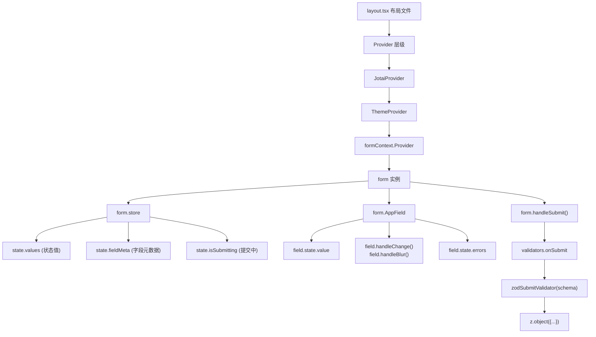
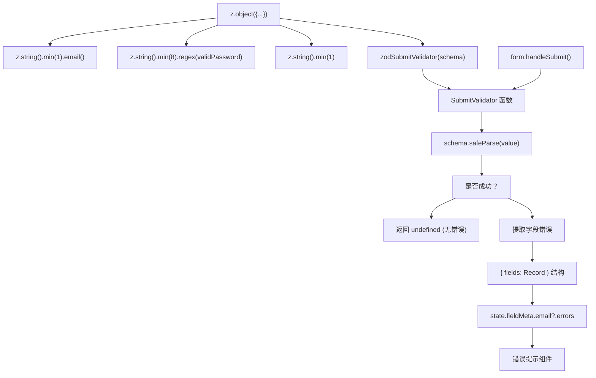
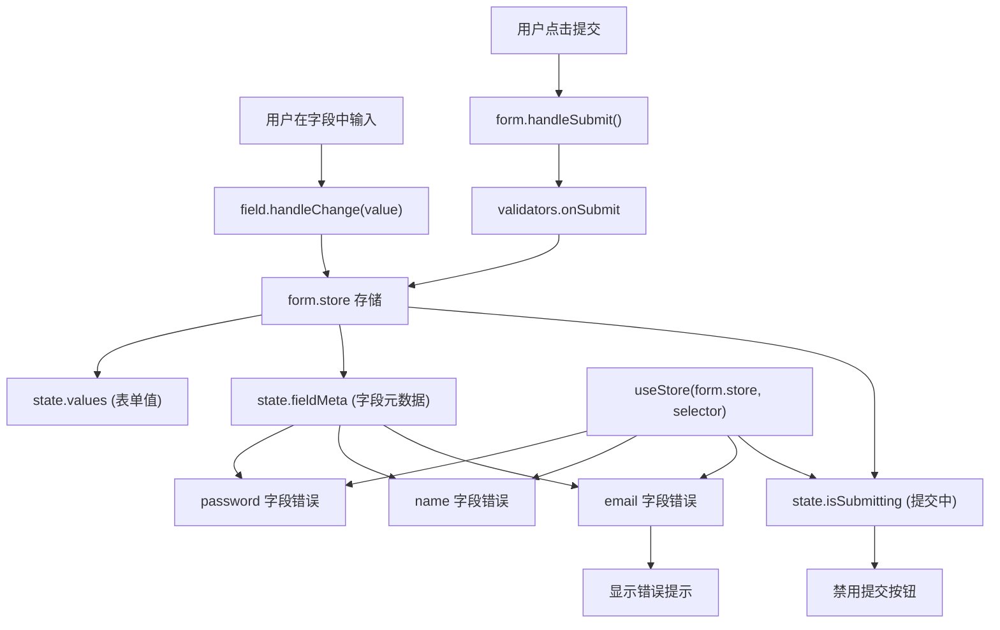
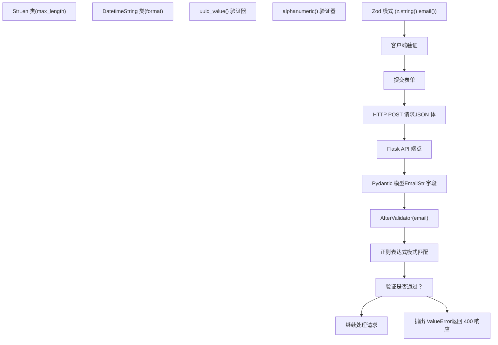
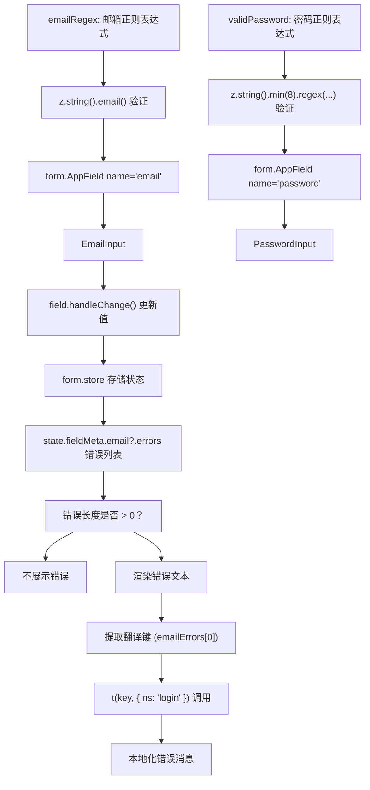
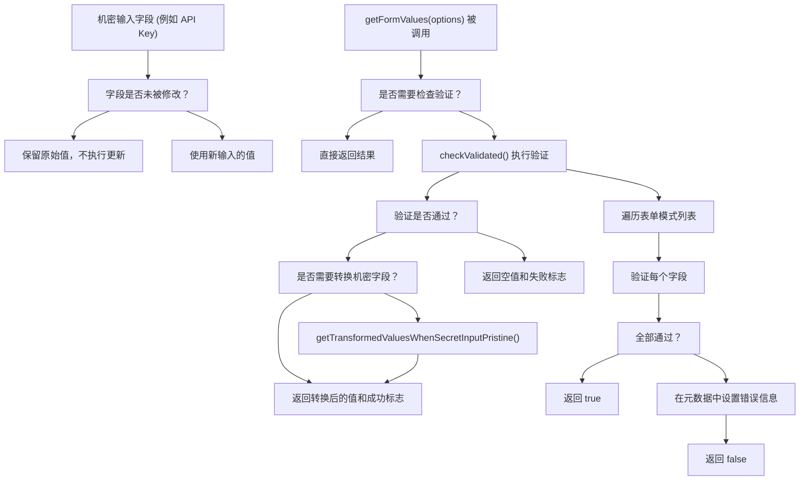

# 表单系统与验证

相关源文件

-   [api/libs/helper.py](https://github.com/langgenius/dify/blob/92dbc94f/api/libs/helper.py)
-   [api/tests/unit\_tests/libs/test\_helper.py](https://github.com/langgenius/dify/blob/92dbc94f/api/tests/unit_tests/libs/test_helper.py)
-   [web/.env.example](https://github.com/langgenius/dify/blob/92dbc94f/web/.env.example)
-   [web/app/activate/activateForm.tsx](https://github.com/langgenius/dify/blob/92dbc94f/web/app/activate/activateForm.tsx)
-   [web/app/components/base/form/hooks/use-get-form-values.ts](https://github.com/langgenius/dify/blob/92dbc94f/web/app/components/base/form/hooks/use-get-form-values.ts)
-   [web/app/components/base/form/utils/zod-submit-validator.ts](https://github.com/langgenius/dify/blob/92dbc94f/web/app/components/base/form/utils/zod-submit-validator.ts)
-   [web/app/forgot-password/ForgotPasswordForm.spec.tsx](https://github.com/langgenius/dify/blob/92dbc94f/web/app/forgot-password/ForgotPasswordForm.spec.tsx)
-   [web/app/forgot-password/ForgotPasswordForm.tsx](https://github.com/langgenius/dify/blob/92dbc94f/web/app/forgot-password/ForgotPasswordForm.tsx)
-   [web/app/install/installForm.tsx](https://github.com/langgenius/dify/blob/92dbc94f/web/app/install/installForm.tsx)
-   [web/app/layout.tsx](https://github.com/langgenius/dify/blob/92dbc94f/web/app/layout.tsx)
-   [web/config/index.ts](https://github.com/langgenius/dify/blob/92dbc94f/web/config/index.ts)
-   [web/docker/entrypoint.sh](https://github.com/langgenius/dify/blob/92dbc94f/web/docker/entrypoint.sh)
-   [web/types/feature.ts](https://github.com/langgenius/dify/blob/92dbc94f/web/types/feature.ts)

## 目的与范围

本文档解释了 Dify Web 前端的表单处理与验证架构。涵盖了 **Tanstack Form** 集成、**Zod** 模式验证、表单 Hook，以及在整个应用的身份验证和配置表单中使用的模式。

有关状态管理架构，请参阅第 [9.2](/langgenius/dify/9.2-state-management-and-provider-architecture) 节。有关表单中的国际化集成，请参阅第 [9.3](/langgenius/dify/9.3-internationalization-system) 节。有关后端 API 验证，请参阅第 [8](/langgenius/dify/8-service-apis) 节。

---

## 表单框架架构

### Tanstack Form 集成

Dify Web 前端使用 **@tanstack/react-form** 进行声明式的、类型安全的表单处理。Tanstack Form 提供了细粒度的响应性、极少的重新渲染以及内置的验证支持。

**核心表单基础设施：**

-   `@tanstack/react-form` - 表单状态管理库。
-   `zod` - 模式验证库。
-   `formContext` - 用于表单实例共享的 React Context。
-   `useAppForm` - 封装了 Dify 惯例的 Tanstack Form 自定义 Hook。

**来源：** [web/app/install/installForm.tsx3](https://github.com/langgenius/dify/blob/92dbc94f/web/app/install/installForm.tsx#L3-L3) [web/app/install/installForm.tsx12](https://github.com/langgenius/dify/blob/92dbc94f/web/app/install/installForm.tsx#L12-L12)


**图表：表单架构与数据流**

**来源：** [web/app/install/installForm.tsx12-13](https://github.com/langgenius/dify/blob/92dbc94f/web/app/install/installForm.tsx#L12-L13) [web/app/install/installForm.tsx43-79](https://github.com/langgenius/dify/blob/92dbc94f/web/app/install/installForm.tsx#L43-L79) [web/app/install/installForm.tsx128-138](https://github.com/langgenius/dify/blob/92dbc94f/web/app/install/installForm.tsx#L128-L138)

---

## 验证系统

### Zod 模式验证

表单使用 **Zod** 模式声明式地定义验证规则。`zodSubmitValidator` 工具函数将 Zod 模式转换为 Tanstack Form 的验证器。

**验证流程：**

1.  定义带有验证规则的 Zod 模式 (schema)。
2.  将模式传递给 `zodSubmitValidator(schema)`。
3.  将生成的验证器赋值给 `form.validators.onSubmit`。
4.  验证在表单提交时运行。
5.  字段错误信息将填充到 `fieldMeta.errors` 数组中。

**来源：** [web/app/install/installForm.tsx10](https://github.com/langgenius/dify/blob/92dbc94f/web/app/install/installForm.tsx#L10-L10) [web/app/install/installForm.tsx24-33](https://github.com/langgenius/dify/blob/92dbc94f/web/app/install/installForm.tsx#L24-L33) [web/app/components/base/form/utils/zod-submit-validator.ts1-22](https://github.com/langgenius/dify/blob/92dbc94f/web/app/components/base/form/utils/zod-submit-validator.ts#L1-L22)


**图表：Zod 验证流水线**

**来源：** [web/app/components/base/form/utils/zod-submit-validator.ts5-22](https://github.com/langgenius/dify/blob/92dbc94f/web/app/components/base/form/utils/zod-submit-validator.ts#L5-L22) [web/app/install/installForm.tsx24-33](https://github.com/langgenius/dify/blob/92dbc94f/web/app/install/installForm.tsx#L24-L33) [web/app/install/installForm.tsx139-143](https://github.com/langgenius/dify/blob/92dbc94f/web/app/install/installForm.tsx#L139-L143)

### zodSubmitValidator 的实现

`zodSubmitValidator` 工具函数将 Zod 验证结果转换为 Tanstack Form 预期的错误格式：

**文件：** [web/app/components/base/form/utils/zod-submit-validator.ts1-22](https://github.com/langgenius/dify/blob/92dbc94f/web/app/components/base/form/utils/zod-submit-validator.ts#L1-L22)

```typescript
type SubmitValidator<T> = ({ value }: { value: T }) =>
  { fields: Record<string, string> } | undefined

export const zodSubmitValidator = <T>(schema: ZodSchema<T>): SubmitValidator<T> => {
  return ({ value }) => {
    const result = schema.safeParse(value)
    if (!result.success) {
      const fieldErrors: Record<string, string> = {}
      for (const issue of result.error.issues) {
        const path = issue.path[0]
        if (path === undefined) continue
        const key = String(path)
        if (!fieldErrors[key])
          fieldErrors[key] = issue.message
      }
      return { fields: fieldErrors }
    }
    return undefined
  }
}
```
**错误映射：**

-   Zod 议题 (issues) → 字段特定的错误消息。
-   每个字段的第一个错误具有最高优先级。
-   如果验证成功，返回 `undefined`。
-   如果验证失败，返回 `{ fields: {...} }`。

**来源：** [web/app/components/base/form/utils/zod-submit-validator.ts5-22](https://github.com/langgenius/dify/blob/92dbc94f/web/app/components/base/form/utils/zod-submit-validator.ts#L5-L22)

---

## 表单实现模式

### useAppForm Hook

表单使用 `useAppForm` Hook 进行初始化，该 Hook 将 Tanstack Form 的 `useForm` 封装并融入了 Dify 特有的惯例：

**模式示例：**

```javascript
const form = useAppForm({
  defaultValues: {
    email: '',
    password: '',
    name: '',
  },
  validators: {
    onSubmit: zodSubmitValidator(accountFormSchema),
  },
  onSubmit: async ({ value }) => {
    // 处理表单提交
    await submitData(value)
  },
})
```
**来源：** [web/app/install/installForm.tsx43-79](https://github.com/langgenius/dify/blob/92dbc94f/web/app/install/installForm.tsx#L43-L79)

**关键属性：**

-   `defaultValues` - 初始表单状态。
-   `validators.onSubmit` - Zod 模式验证器。
-   `onSubmit` - 异步提交处理程序。
-   `form.store` - 响应式状态 Store。
-   `form.handleSubmit()` - 触发验证并提交。

**来源：** [web/app/install/installForm.tsx43-79](https://github.com/langgenius/dify/blob/92dbc94f/web/app/install/installForm.tsx#L43-L79)

### form.AppField 组件

`form.AppField` 组件采用渲染属性 (render prop) 模式将输入字段连接到表单状态：

**模式示例：**

```javascript
<form.AppField name="email">
  {field => (
    <Input
      id="email"
      value={field.state.value}
      onChange={e => field.handleChange(e.target.value)}
      onBlur={field.handleBlur}
      placeholder={t('emailPlaceholder', { ns: 'login' })}
    />
  )}
</form.AppField>
```
**来源：** [web/app/install/installForm.tsx128-138](https://github.com/langgenius/dify/blob/92dbc94f/web/app/install/installForm.tsx#L128-L138)

**字段 API：**

-   `field.state.value` - 当前字段值。
-   `field.handleChange(value)` - 更新字段值。
-   `field.handleBlur()` - 将字段标记为已接触 (touched)。
-   `field.state.errors` - 字段验证错误。

**来源：** [web/app/install/installForm.tsx128-138](https://github.com/langgenius/dify/blob/92dbc94f/web/app/install/installForm.tsx#L128-L138)

### 表单提交处理

表单会阻止浏览器的默认提交行为，并通过 Tanstack Form 处理提交事件：

**模式示例：**

```javascript
<form
  onSubmit={(e) => {
    e.preventDefault()
    e.stopPropagation()
    if (isSubmitting) return
    form.handleSubmit()
  }}
>
  {/* 表单字段 */}
</form>
```
**来源：** [web/app/install/installForm.tsx115-121](https://github.com/langgenius/dify/blob/92dbc94f/web/app/install/installForm.tsx#L115-L121)

**提交流程：**

1.  阻止浏览器默认提交 (`e.preventDefault()`)。
2.  停止事件冒泡 (`e.stopPropagation()`)。
3.  检查提交是否正在进行中。
4.  调用 `form.handleSubmit()` 触发验证和 `onSubmit`。

**来源：** [web/app/install/installForm.tsx115-121](https://github.com/langgenius/dify/blob/92dbc94f/web/app/install/installForm.tsx#L115-L121)

---

## 身份验证表单

### 安装/设置表单 (Install/Setup Form)

安装表单 (`installForm.tsx`) 展示了完整的表单模式，包括验证、提交以及自动登录：

**文件：** [web/app/install/installForm.tsx1-234](https://github.com/langgenius/dify/blob/92dbc94f/web/app/install/installForm.tsx#L1-L234)

**表单模式 (Schema)：**

```javascript
const accountFormSchema = z.object({
  email: z
    .string()
    .min(1, { message: 'error.emailInValid' })
    .email('error.emailInValid'),
  name: z.string().min(1, { message: 'error.nameEmpty' }),
  password: z.string().min(8, {
    message: 'error.passwordLengthInValid',
  }).regex(validPassword, 'error.passwordInvalid'),
})
```
**来源：** [web/app/install/installForm.tsx24-33](https://github.com/langgenius/dify/blob/92dbc94f/web/app/install/installForm.tsx#L24-L33)

**核心特性：**

-   使用 Zod 的 `.email()` 方法验证邮箱。
-   密码长度要求（最少 8 位）及复杂度正则验证。
-   姓名必填（非空）。
-   集成国际化 (i18n) 错误消息。
-   设置成功后自动登录。

**来源：** [web/app/install/installForm.tsx24-33](https://github.com/langgenius/dify/blob/92dbc94f/web/app/install/installForm.tsx#L24-L33) [web/app/install/installForm.tsx52-78](https://github.com/langgenius/dify/blob/92dbc94f/web/app/install/installForm.tsx#L52-L78)

### 忘记密码表单 (Forgot Password Form)

忘记密码表单展示了基于表单状态的条件 UI：

**文件：** [web/app/forgot-password/ForgotPasswordForm.tsx1-151](https://github.com/langgenius/dify/blob/92dbc94f/web/app/forgot-password/ForgotPasswordForm.tsx#L1-L151)

**状态管理：**

```javascript
const [isEmailSent, setIsEmailSent] = useState(false)

// 条件按钮行为
const handleSendResetPasswordClick = async () => {
  if (isSubmitting) return

  if (isEmailSent) {
    router.push('/signin')
  } else {
    form.handleSubmit()
  }
}
```
**来源：** [web/app/forgot-password/ForgotPasswordForm.tsx35](https://github.com/langgenius/dify/blob/92dbc94f/web/app/forgot-password/ForgotPasswordForm.tsx#L35-L35) [web/app/forgot-password/ForgotPasswordForm.tsx61-71](https://github.com/langgenius/dify/blob/92dbc94f/web/app/forgot-password/ForgotPasswordForm.tsx#L61-L71)

**模式：**

-   单个表单具有两个状态：邮箱输入 → 成功确认。
-   按钮文本根据状态变化。
-   成功响应触发状态迁移。
-   错误处理保持表单状态。

**来源：** [web/app/forgot-password/ForgotPasswordForm.tsx42-55](https://github.com/langgenius/dify/blob/92dbc94f/web/app/forgot-password/ForgotPasswordForm.tsx#L42-L55) [web/app/forgot-password/ForgotPasswordForm.tsx107-136](https://github.com/langgenius/dify/blob/92dbc94f/web/app/forgot-password/ForgotPasswordForm.tsx#L107-L136)

### 从 Store 中获取表单状态

通过 Tanstack Form 的 `useStore` Hook 访问表单状态：

**模式示例：**

```javascript
const isSubmitting = useStore(form.store, state => state.isSubmitting)
const emailErrors = useStore(form.store, state => state.fieldMeta.email?.errors)
const nameErrors = useStore(form.store, state => state.fieldMeta.name?.errors)
const passwordErrors = useStore(form.store, state => state.fieldMeta.password?.errors)
```
**来源：** [web/app/install/installForm.tsx81-84](https://github.com/langgenius/dify/blob/92dbc94f/web/app/install/installForm.tsx#L81-L84)

**Store 属性说明：**

-   `state.isSubmitting` - 指示提交是否正在进行的布尔值。
-   `state.fieldMeta.<field>?.errors` - 每个字段的错误消息数组。
-   `state.values` - 当前表单值。
-   响应式更新仅在所订阅的值发生变化时才触发组件重新渲染。

**来源：** [web/app/install/installForm.tsx81-84](https://github.com/langgenius/dify/blob/92dbc94f/web/app/install/installForm.tsx#L81-L84)


**图表：使用 useStore 进行表单状态管理**

**来源：** [web/app/install/installForm.tsx81-84](https://github.com/langgenius/dify/blob/92dbc94f/web/app/install/installForm.tsx#L81-L84) [web/app/install/installForm.tsx115-121](https://github.com/langgenius/dify/blob/92dbc94f/web/app/install/installForm.tsx#L115-L121) [web/app/install/installForm.tsx139-143](https://github.com/langgenius/dify/blob/92dbc94f/web/app/install/installForm.tsx#L139-L143)

---

## 后端验证 (Backend Validation)

### Python 验证器

后端在 `api/libs/helper.py` 中提供了验证工具，以确保在各个 API 端点中实现一致的数据验证：

**文件：** [api/libs/helper.py1-435](https://github.com/langgenius/dify/blob/92dbc94f/api/libs/helper.py#L1-L435)

**验证器函数：**

| 验证器 | 用途 | 示例 |
| --- | --- | --- |
| `email(email: str)` | 使用正则验证邮箱格式 | `email("user@example.com")` |
| `uuid_value(value: Any)` | 验证 UUID 格式 | `uuid_value("123e4567-e89b-12d3-a456-426614174000")` |
| `alphanumeric(value: str)` | 仅允许字母、数字和下划线 | `alphanumeric("my_variable_1")` |
| `timestamp_value(timestamp)` | 验证正整数时间戳 | `timestamp_value(1609459200)` |
| `timezone(timezone_string)` | 验证时区名称 | `timezone("Asia/Shanghai")` |

**来源：** [api/libs/helper.py129-137](https://github.com/langgenius/dify/blob/92dbc94f/api/libs/helper.py#L129-L137) [api/libs/helper.py143-152](https://github.com/langgenius/dify/blob/92dbc94f/api/libs/helper.py#L143-L152) [api/libs/helper.py168-173](https://github.com/langgenius/dify/blob/92dbc94f/api/libs/helper.py#L168-L173) [api/libs/helper.py176-184](https://github.com/langgenius/dify/blob/92dbc94f/api/libs/helper.py#L176-L184) [api/libs/helper.py222-227](https://github.com/langgenius/dify/blob/92dbc94f/api/libs/helper.py#L222-L227)

### Pydantic 验证器

使用 `AfterValidator` 创建自定义的 Pydantic 验证器：

**模式示例：**

```python
from pydantic.functional_validators import AfterValidator
from typing import Annotated

def email(email):
    pattern = r"^[\w\.!#$%&'*+\-/=?^_`{|}~]+@([\w-]+\.)+[\w-]{2,}$"
    if re.match(pattern, email) is not None:
        return email
    raise ValueError(f"{email} 不是有效的邮箱。")

EmailStr = Annotated[str, AfterValidator(email)]
```
**来源：** [api/libs/helper.py129-140](https://github.com/langgenius/dify/blob/92dbc94f/api/libs/helper.py#L129-L140)

**在模型中使用：**

```python
class UserModel(BaseModel):
    email: EmailStr
    uuid: UUIDStrOrEmpty
```
**来源：** [api/libs/helper.py140](https://github.com/langgenius/dify/blob/92dbc94f/api/libs/helper.py#L140-L140) [api/libs/helper.py165](https://github.com/langgenius/dify/blob/92dbc94f/api/libs/helper.py#L165-L165)

### 验证类 (Validation Classes)

**StrLen 验证器：**

```python
class StrLen:
    """将输入限制在指定范围内的整数（含边界）"""

    def __init__(self, max_length, argument="argument"):
        self.max_length = max_length
        self.argument = argument

    def __call__(self, value):
        length = len(value)
        if length > self.max_length:
            error = "无效的 {arg}: {val}。{arg} 长度不能超过 {length}".format(
                arg=self.argument, val=value, length=self.max_length
            )
            raise ValueError(error)
        return value
```
**来源：** [api/libs/helper.py187-202](https://github.com/langgenius/dify/blob/92dbc94f/api/libs/helper.py#L187-L202)

**DatetimeString 验证器：**

```python
class DatetimeString:
    def __init__(self, format, argument="argument"):
        self.format = format
        self.argument = argument

    def __call__(self, value):
        try:
            datetime.strptime(value, self.format)
        except ValueError:
            error = "无效的 {arg}: {val}。{arg} 必须符合格式 {format}".format(
                arg=self.argument, val=value, format=self.format
            )
            raise ValueError(error)
        return value
```
**来源：** [api/libs/helper.py205-219](https://github.com/langgenius/dify/blob/92dbc94f/api/libs/helper.py#L205-L219)


**图表：从前端到后端的验证流程**

**来源：** [web/app/install/installForm.tsx24-33](https://github.com/langgenius/dify/blob/92dbc94f/web/app/install/installForm.tsx#L24-L33) [api/libs/helper.py129-140](https://github.com/langgenius/dify/blob/92dbc94f/api/libs/helper.py#L129-L140) [api/libs/helper.py187-219](https://github.com/langgenius/dify/blob/92dbc94f/api/libs/helper.py#L187-L219)

---

## 验证模式与规则

### 密码验证

密码验证结合了长度要求和复杂度规则：

**前端模式：**

```javascript
export const validPassword = /^(?=.*[a-z])(?=.*\d)\S{8,}$/i
```
**来源：** [web/config/index.ts414](https://github.com/langgenius/dify/blob/92dbc94f/web/config/index.ts#L414-L414)

**验证规则：**

-   最少 8 个字符。
-   至少包含一个字母（通过 `/i` 标志实现大小写不敏感）。
-   至少包含一个数字。
-   不包含空白字符 (`\S`)。

**Zod 集成：**

```javascript
password: z.string().min(8, {
  message: 'error.passwordLengthInValid',
}).regex(validPassword, 'error.passwordInvalid')
```
**来源：** [web/app/install/installForm.tsx30-32](https://github.com/langgenius/dify/blob/92dbc94f/web/app/install/installForm.tsx#L30-L32)

### 邮箱验证

前端和后端使用不同的正则表达式模式进行邮箱验证：

**前端模式：**

```javascript
export const emailRegex = /^[\w.!#$%&'*+\-/=?^{|}~]+@([\w-]+\.)+[\w-]{2,}$/m
```
**来源：** [web/config/index.ts193](https://github.com/langgenius/dify/blob/92dbc94f/web/config/index.ts#L193-L193)

**后端模式：**

```python
pattern = r"^[\w\.!#$%&'*+\-/=?^_`{|}~]+@([\w-]+\.)+[\w-]{2,}$"
```
**来源：** [api/libs/helper.py131](https://github.com/langgenius/dify/blob/92dbc94f/api/libs/helper.py#L131-L131)

**区别：**

-   前端使用了多行标志 `/m`（对单行邮箱没有实质性影响）。
-   后端对字符类中的反引号进行了转义。
-   两者都接受 `@` 前的各种标准邮箱字符。
-   两者都要求顶级域名 (TLD) 至少包含 2 个字符。

**来源：** [web/config/index.ts193](https://github.com/langgenius/dify/blob/92dbc94f/web/config/index.ts#L193-L193) [api/libs/helper.py131](https://github.com/langgenius/dify/blob/92dbc94f/api/libs/helper.py#L131-L131)

### 字段级错误展示

使用条件渲染在输入框下方展示错误信息：

**模式示例：**

```javascript
{emailErrors && emailErrors.length > 0 && (
  <span className="text-sm text-red-400">
    {t(`${emailErrors[0]}` as 'error.emailInValid', { ns: 'login' })}
  </span>
)}
```
**来源：** [web/app/install/installForm.tsx139-143](https://github.com/langgenius/dify/blob/92dbc94f/web/app/install/installForm.tsx#L139-L143)

**核心特性：**

-   检查错误是否存在且数组不为空。
-   仅展示第一个错误。
-   配合国际化 (i18n) 和命名空间展示翻译后的消息。
-   通过类型断言满足 TypeScript 要求（翻译键必须是字符串字面量）。
-   错误文本使用统一的 `red-400` 颜色。

**来源：** [web/app/install/installForm.tsx139-143](https://github.com/langgenius/dify/blob/92dbc94f/web/app/install/installForm.tsx#L139-L143) [web/app/install/installForm.tsx164-168](https://github.com/langgenius/dify/blob/92dbc94f/web/app/install/installForm.tsx#L164-L168)


**图表：验证与错误展示流水线**

**来源：** [web/config/index.ts193](https://github.com/langgenius/dify/blob/92dbc94f/web/config/index.ts#L193-L193) [web/config/index.ts414](https://github.com/langgenius/dify/blob/92dbc94f/web/config/index.ts#L414-L414) [web/app/install/installForm.tsx30-32](https://github.com/langgenius/dify/blob/92dbc94f/web/app/install/installForm.tsx#L30-L32) [web/app/install/installForm.tsx139-143](https://github.com/langgenius/dify/blob/92dbc94f/web/app/install/installForm.tsx#L139-L143)

---

## 表单 Hook 与工具函数

### useGetFormValues Hook

`useGetFormValues` Hook 提供了对表单值的受控访问，并支持可选的验证检查：

**文件：** [web/app/components/base/form/hooks/use-get-form-values.ts1-44](https://github.com/langgenius/dify/blob/92dbc94f/web/app/components/base/form/hooks/use-get-form-values.ts#L1-L44)

**API 示例：**

```javascript
const { getFormValues } = useGetFormValues(form, formSchemas)

const result = getFormValues({
  needCheckValidatedValues: true,
  needTransformWhenSecretFieldIsPristine: false,
})

// 结果：{ values: {...}, isCheckValidated: boolean }
```
**来源：** [web/app/components/base/form/hooks/use-get-form-values.ts10-44](https://github.com/langgenius/dify/blob/92dbc94f/web/app/components/base/form/hooks/use-get-form-values.ts#L10-L44)

**配置选项：**

| 选项 | 类型 | 描述 |
| --- | --- | --- |
| `needCheckValidatedValues` | `boolean` | 若为 `true`，则在返回结果前执行验证。 |
| `needTransformWhenSecretFieldIsPristine` | `boolean` | 若为 `true`，则对未被修改的机密字段进行转换处理。 |

**返回值：**

-   `values` - 表单值对象（若验证失败则返回空对象 `{}`）。
-   `isCheckValidated` - 指示验证是否成功的布尔值。

**来源：** [web/app/components/base/form/hooks/use-get-form-values.ts13-38](https://github.com/langgenius/dify/blob/92dbc94f/web/app/components/base/form/hooks/use-get-form-values.ts#L13-L38)

### 机密输入字段处理 (Secret Input Handling)

机密字段（如 API 密钥或密码）在未被修改时需要特殊处理：

**模式示例：**

```javascript
const getTransformedValuesWhenSecretInputPristine = (
  formSchemas: FormSchema[],
  form: AnyFormApi
) => {
  // 如果机密字段是“原始状态 (pristine)”（未变更），则转换为特定格式
  // 否则，使用当前输入值
}
```
这确保了在用户仅查看但未修改包含敏感数据的表单时，不会不必要地触发机密值的更新。

**来源：** [web/app/components/base/form/hooks/use-get-form-values.ts7](https://github.com/langgenius/dify/blob/92dbc94f/web/app/components/base/form/hooks/use-get-form-values.ts#L7-L7) [web/app/components/base/form/hooks/use-get-form-values.ts29](https://github.com/langgenius/dify/blob/92dbc94f/web/app/components/base/form/hooks/use-get-form-values.ts#L29-L29)

### 表单验证检查

`useCheckValidated` Hook 负责验证所有表单字段并返回结果：

**模式示例：**

```javascript
const { checkValidated } = useCheckValidated(form, formSchemas)

if (checkValidated()) {
  // 所有字段均有效 - 继续提交
} else {
  // 验证失败 - 错误信息已设置在 fieldMeta 中
}
```
**来源：** [web/app/components/base/form/hooks/use-get-form-values.ts8](https://github.com/langgenius/dify/blob/92dbc94f/web/app/components/base/form/hooks/use-get-form-values.ts#L8-L8) [web/app/components/base/form/hooks/use-get-form-values.ts27-32](https://github.com/langgenius/dify/blob/92dbc94f/web/app/components/base/form/hooks/use-get-form-values.ts#L27-L32)


**图表：表单值获取与验证流程**

**来源：** [web/app/components/base/form/hooks/use-get-form-values.ts10-44](https://github.com/langgenius/dify/blob/92dbc94f/web/app/components/base/form/hooks/use-get-form-values.ts#L10-L44)

---

## 总结

Dify Web 前端实现了全面的测试与质量保证策略：

1.  **Vitest + React Testing Library**: 提供了快速、可靠的组件测试。
2.  **选择性 Mock**: 仅对外部依赖进行模拟，对内部代码坚持使用真实实现。
3.  **工厂函数**: 创建可维护、类型安全的测试数据。
4.  **ESLint + SonarJS**: 强制执行代码质量标准和复杂度限制。
5.  **自定义 i18n 规则**: 助力命名空间迁移并保障类型安全。
6.  **Knip**: 检测未使用的文件和依赖。
7.  **Pre-commit Hook**: 在问题进入 CI 前将其拦截。
8.  **完善的测试套件**: 覆盖了渲染、属性处理、交互以及边界情况。

这种多层级的策略确保了前端代码库的质量、可维护性以及可靠性。
