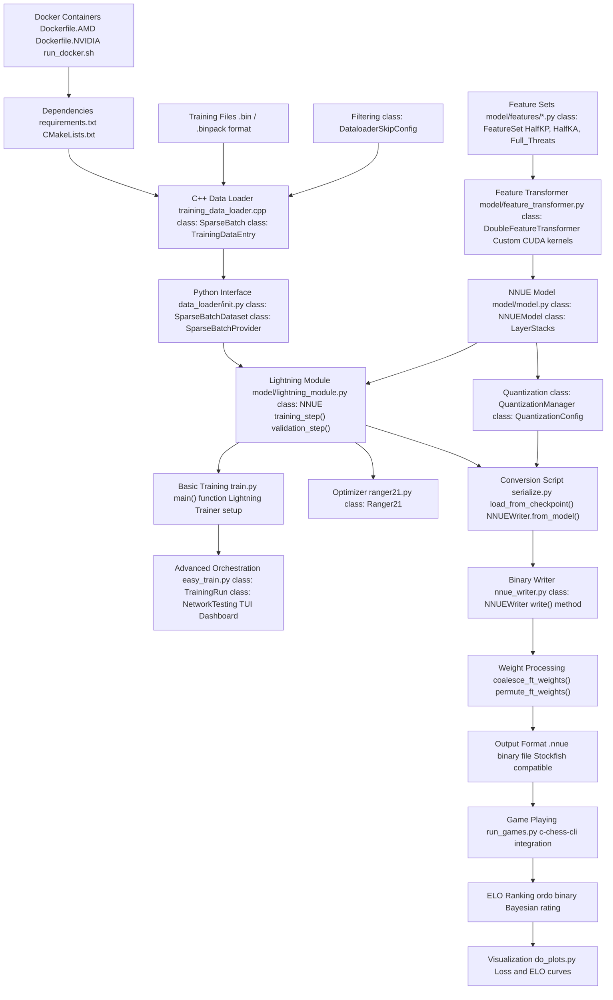
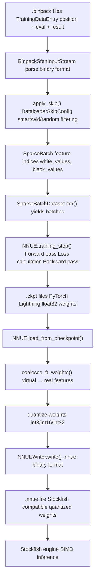

# Overview

-   [Dockerfile.AMD](https://github.com/Chesszyh/nnue-pytorch/blob/024b2064/Dockerfile.AMD)
-   [Dockerfile.NVIDIA](https://github.com/Chesszyh/nnue-pytorch/blob/024b2064/Dockerfile.NVIDIA)
-   [README.md](https://github.com/Chesszyh/nnue-pytorch/blob/024b2064/README.md)
-   [docs/img/SFNNv4\_architecture.drawio](https://github.com/Chesszyh/nnue-pytorch/blob/024b2064/docs/img/SFNNv4_architecture.drawio)
-   [docs/nnue.md](https://github.com/Chesszyh/nnue-pytorch/blob/024b2064/docs/nnue.md)
-   [run\_docker.sh](https://github.com/Chesszyh/nnue-pytorch/blob/024b2064/run_docker.sh)
-   [train.py](https://github.com/Chesszyh/nnue-pytorch/blob/024b2064/train.py)

## Purpose and Scope

This document provides a high-level introduction to the **nnue-pytorch** repository, a training framework for NNUE (Efficiently Updatable Neural Networks) chess evaluation networks. This overview explains the repository's architecture, major components, and how they integrate to form a complete training-to-deployment pipeline.

For detailed information on specific topics:

-   NNUE architecture and principles: see [What is NNUE](#1.1)
-   Setting up your development environment: see [Environment Setup](#1.2)
-   Running your first training: see [Quick Start Tutorial](#1.3)
-   Training system details: see [Training System](#2)
-   Data pipeline implementation: see [Data Pipeline](#3)
-   Model architecture specifics: see [Model Architecture](#4)

**Sources:** [README.md1-71](https://github.com/Chesszyh/nnue-pytorch/blob/024b2064/README.md#L1-L71) [docs/nnue.md1-143](https://github.com/Chesszyh/nnue-pytorch/blob/024b2064/docs/nnue.md#L1-L143)

## What is nnue-pytorch?

The **nnue-pytorch** repository is a production-grade training framework for NNUE evaluation networks used in chess engines, primarily Stockfish. It provides:

1.  **High-performance data loading** via C++ native loaders with SIMD optimizations
2.  **Flexible model architectures** supporting multiple feature sets (HalfKP, HalfKA variants, Full\_Threats)
3.  **Training orchestration** from simple single-GPU scripts to multi-GPU automated pipelines
4.  **Model serialization** to Stockfish-compatible `.nnue` binary format
5.  **Automated evaluation** through game playing and ELO ranking

NNUE (ƎUИИ - Efficiently Updatable Neural Networks) is a neural network architecture designed for fast, low-latency CPU inference in chess engines. It achieves this through sparse inputs, incremental evaluation updates, and integer quantization. For a comprehensive explanation of NNUE principles, see [What is NNUE](#1.1).

**Sources:** [README.md1-71](https://github.com/Chesszyh/nnue-pytorch/blob/024b2064/README.md#L1-L71) [docs/nnue.md144-164](https://github.com/Chesszyh/nnue-pytorch/blob/024b2064/docs/nnue.md#L144-L164)

## Repository Architecture

The repository consists of six major subsystems that form a complete training-to-deployment pipeline:

### System Components with Code Mappings


**Sources:** [train.py1-553](https://github.com/Chesszyh/nnue-pytorch/blob/024b2064/train.py#L1-L553) [data\_loader/\_\_init\_\_.py](https://github.com/Chesszyh/nnue-pytorch/blob/024b2064/data_loader/__init__.py) [model/model.py](https://github.com/Chesszyh/nnue-pytorch/blob/024b2064/model/model.py) [serialize.py](https://github.com/Chesszyh/nnue-pytorch/blob/024b2064/serialize.py) [run\_games.py](https://github.com/Chesszyh/nnue-pytorch/blob/024b2064/run_games.py)

### Data Flow: Training Data to Deployed Network


**Sources:** [training\_data\_loader.cpp](https://github.com/Chesszyh/nnue-pytorch/blob/024b2064/training_data_loader.cpp) [data\_loader/\_\_init\_\_.py](https://github.com/Chesszyh/nnue-pytorch/blob/024b2064/data_loader/__init__.py) [model/lightning\_module.py](https://github.com/Chesszyh/nnue-pytorch/blob/024b2064/model/lightning_module.py) [serialize.py](https://github.com/Chesszyh/nnue-pytorch/blob/024b2064/serialize.py) [nnue\_writer.py](https://github.com/Chesszyh/nnue-pytorch/blob/024b2064/nnue_writer.py)

## Component Overview

### 1\. Development Environment

The repository provides Docker containers for both AMD and NVIDIA GPUs, eliminating local Python environment setup complexity. The containers include PyTorch, CUDA/ROCm, and all required dependencies.

-   **Dockerfiles**: [Dockerfile.NVIDIA1-18](https://github.com/Chesszyh/nnue-pytorch/blob/024b2064/Dockerfile.NVIDIA#L1-L18) [Dockerfile.AMD1-20](https://github.com/Chesszyh/nnue-pytorch/blob/024b2064/Dockerfile.AMD#L1-L20)
-   **Launch script**: [run\_docker.sh1-46](https://github.com/Chesszyh/nnue-pytorch/blob/024b2064/run_docker.sh#L1-L46)
-   **Dependencies**: [requirements.txt](https://github.com/Chesszyh/nnue-pytorch/blob/024b2064/requirements.txt)

For detailed setup instructions, see [Environment Setup](#1.2).

**Sources:** [Dockerfile.NVIDIA1-18](https://github.com/Chesszyh/nnue-pytorch/blob/024b2064/Dockerfile.NVIDIA#L1-L18) [Dockerfile.AMD1-20](https://github.com/Chesszyh/nnue-pytorch/blob/024b2064/Dockerfile.AMD#L1-L20) [run\_docker.sh1-46](https://github.com/Chesszyh/nnue-pytorch/blob/024b2064/run_docker.sh#L1-L46) [README.md5-34](https://github.com/Chesszyh/nnue-pytorch/blob/024b2064/README.md#L5-L34)

### 2\. Training Data Pipeline

The data pipeline is performance-critical and implemented in C++ with SIMD optimizations. It reads binary training files (`.bin` or `.binpack` format), applies configurable filtering, extracts sparse features, and provides them to Python via ctypes.

**Key classes:**

-   `SparseBatch`: C++ structure holding sparse feature indices and labels
-   `SparseBatchDataset`: Python iterator wrapping C++ loader
-   `DataloaderSkipConfig`: Configuration for position filtering (smart FEN skipping, WLD filtering, early game skipping)

Configuration example from `train.py`:

```
DataloaderSkipConfig(
    filtered=not args.no_smart_fen_skipping,
    random_fen_skipping=args.random_fen_skipping,
    wld_filtered=not args.no_wld_fen_skipping,
    early_fen_skipping=args.early_fen_skipping,
    simple_eval_skipping=args.simple_eval_skipping,
    ...
)
```
For complete data pipeline documentation, see [Data Pipeline](#3).

**Sources:** [train.py44-89](https://github.com/Chesszyh/nnue-pytorch/blob/024b2064/train.py#L44-L89) [train.py519-538](https://github.com/Chesszyh/nnue-pytorch/blob/024b2064/train.py#L519-L538) [docs/nnue.md62-63](https://github.com/Chesszyh/nnue-pytorch/blob/024b2064/docs/nnue.md#L62-L63)

### 3\. Model Architecture

The `NNUEModel` class implements the complete neural network with the following structure:

1.  **Feature Set**: Determines input representation (e.g., `HalfKAv2_hm` - 45K features per king position)
2.  **Feature Transformer**: Large sparse first layer, incrementally updatable during search
3.  **Layer Stacks**: Dense fully-connected layers with ClippedReLU activation
4.  **PSQT**: Piece-square table values combined with network output

**Key classes:**

-   `FeatureSet`: Base class for feature definitions
-   `DoubleFeatureTransformer`: Sparse linear layer with custom CUDA kernels
-   `NNUEModel`: Complete network (`features → FT → LayerStacks → output`)
-   `QuantizationManager`: Handles int8/int16/int32 conversion

Feature set selection in `train.py`:

```
feature_set = M.get_feature_set_from_name(args.features)
```
Network initialization:

```
nnue = M.NNUE(    feature_set=feature_set,    config=M.ModelConfig(L1=args.l1),  # L1 = feature transformer size    quantize_config=M.QuantizationConfig(),    ...)
```
For detailed architecture documentation, see [Model Architecture](#4).

**Sources:** [train.py409-438](https://github.com/Chesszyh/nnue-pytorch/blob/024b2064/train.py#L409-L438) [train.py376-377](https://github.com/Chesszyh/nnue-pytorch/blob/024b2064/train.py#L376-L377) [model/model.py](https://github.com/Chesszyh/nnue-pytorch/blob/024b2064/model/model.py) [docs/nnue.md354-383](https://github.com/Chesszyh/nnue-pytorch/blob/024b2064/docs/nnue.md#L354-L383)

### 4\. Training Orchestration

The repository provides two training interfaces:

#### Basic Training: train.py

Single-script training with PyTorch Lightning. Configures data loaders, model, optimizer (Ranger21), and callbacks. Supports multi-GPU training via Lightning's distributed training.

**Main function flow:**

1.  Parse command-line arguments [train.py107-378](https://github.com/Chesszyh/nnue-pytorch/blob/024b2064/train.py#L107-L378)
2.  Create data loaders [train.py519-538](https://github.com/Chesszyh/nnue-pytorch/blob/024b2064/train.py#L519-L538)
3.  Initialize or load `NNUE` model [train.py427-456](https://github.com/Chesszyh/nnue-pytorch/blob/024b2064/train.py#L427-L456)
4.  Configure Lightning `Trainer` [train.py496-514](https://github.com/Chesszyh/nnue-pytorch/blob/024b2064/train.py#L496-L514)
5.  Run training: `trainer.fit(nnue, train, val)` [train.py540-543](https://github.com/Chesszyh/nnue-pytorch/blob/024b2064/train.py#L540-L543)

**Key callbacks:**

-   `ModelCheckpoint`: Save networks periodically [train.py490-494](https://github.com/Chesszyh/nnue-pytorch/blob/024b2064/train.py#L490-L494)
-   `WeightClippingCallback`: Constrain weights to quantization bounds [train.py508](https://github.com/Chesszyh/nnue-pytorch/blob/024b2064/train.py#L508-L508)
-   `TimeLimitAfterCheckpoint`: Stop after time limit [train.py21-41](https://github.com/Chesszyh/nnue-pytorch/blob/024b2064/train.py#L21-L41)

#### Advanced Orchestration: easy\_train.py

Multi-run orchestration with TUI dashboard and automatic evaluation. Manages multiple training runs on different GPUs with different hyperparameters, automatically converts checkpoints to `.nnue`, runs games, and ranks networks by ELO.

**Key features:**

-   Environment validation (Python, CMake, dependencies)
-   Concurrent training on multiple GPUs
-   Automatic network testing thread
-   Real-time TUI dashboard with GPU/CPU monitoring

For training system documentation, see [Training System](#2).

**Sources:** [train.py107-543](https://github.com/Chesszyh/nnue-pytorch/blob/024b2064/train.py#L107-L543) [README.md36-41](https://github.com/Chesszyh/nnue-pytorch/blob/024b2064/README.md#L36-L41)

### 5\. Model Serialization

The `serialize.py` script converts trained checkpoints to Stockfish-compatible `.nnue` files:

**Conversion steps:**

1.  Load checkpoint: `NNUE.load_from_checkpoint()` [serialize.py](https://github.com/Chesszyh/nnue-pytorch/blob/024b2064/serialize.py)
2.  Coalesce virtual features: `coalesce_ft_weights()` - sums virtual feature weights into real features
3.  Quantize weights: Convert float32 → int8/int16/int32
4.  Optional: Permute FT weights for SIMD efficiency (`ftperm.py`)
5.  Write binary: `NNUEWriter.write()` creates `.nnue` file

**Binary format sections:**

-   Header: version, hash, description
-   Feature Transformer: int16 weights + int32 biases
-   Fully-connected layers: int8 weights + int32 biases

The `.nnue` format is documented in detail at [NNUE Binary Format](#5.2).

**Sources:** [serialize.py](https://github.com/Chesszyh/nnue-pytorch/blob/024b2064/serialize.py) [nnue\_writer.py](https://github.com/Chesszyh/nnue-pytorch/blob/024b2064/nnue_writer.py) [docs/nnue.md80-142](https://github.com/Chesszyh/nnue-pytorch/blob/024b2064/docs/nnue.md#L80-L142)

### 6\. Evaluation and Testing

The `run_games.py` script automates network evaluation:

1.  Monitors directory for new `.ckpt` files
2.  Converts to `.nnue` format
3.  Runs gauntlet tournaments using `c-chess-cli`
4.  Calculates Bayesian ELO ratings using `ordo`
5.  Generates rankings with error bars

**Typical workflow:**

```
python run_games.py \    --concurrency 16 \    --stockfish_exe ./stockfish.master \    --c_chess_exe ./c-chess-cli \    --ordo_exe ./ordo \    --book_file_name ./noob_3moves.epd \    run96
```
This can run in parallel with training to provide continuous feedback on network quality.

For evaluation system documentation, see [Evaluation and Testing](#7).

**Sources:** [run\_games.py](https://github.com/Chesszyh/nnue-pytorch/blob/024b2064/run_games.py) [README.md51-60](https://github.com/Chesszyh/nnue-pytorch/blob/024b2064/README.md#L51-L60)

## Training Configuration

### Model Architecture Parameters

The network architecture is controlled by several key parameters:

| Parameter | Description | Example Values | Location |
| --- | --- | --- | --- |
| `--features` | Feature set name | `HalfKAv2_hm` (default), `HalfKP`, `Full_Threats` | [train.py377](https://github.com/Chesszyh/nnue-pytorch/blob/024b2064/train.py#L377-L377) |
| `--l1` | Feature transformer size | 1024, 2048 | [train.py376](https://github.com/Chesszyh/nnue-pytorch/blob/024b2064/train.py#L376-L376) |
| L2, L3 | Layer stack sizes | 8, 32 (typical) | `ModelConfig` |

### Loss Function Parameters

The loss function interpolates between evaluation error and game result prediction:

| Parameter | Description | Default | Location |
| --- | --- | --- | --- |
| `--lambda` | Evaluation vs result (1.0=eval, 0.0=result) | 1.0 | [train.py152-157](https://github.com/Chesszyh/nnue-pytorch/blob/024b2064/train.py#L152-L157) |
| `--start-lambda` | Lambda at first epoch | None | [train.py159-164](https://github.com/Chesszyh/nnue-pytorch/blob/024b2064/train.py#L159-L164) |
| `--end-lambda` | Lambda at last epoch | None | [train.py166-171](https://github.com/Chesszyh/nnue-pytorch/blob/024b2064/train.py#L166-L171) |
| `--in-offset` | Input WDL offset | 270.0 | [train.py187-192](https://github.com/Chesszyh/nnue-pytorch/blob/024b2064/train.py#L187-L192) |
| `--in-scaling` | Input WDL scaling | 340.0 | [train.py201-206](https://github.com/Chesszyh/nnue-pytorch/blob/024b2064/train.py#L201-L206) |
| `--out-offset` | Output WDL offset | 270.0 | [train.py194-199](https://github.com/Chesszyh/nnue-pytorch/blob/024b2064/train.py#L194-L199) |
| `--out-scaling` | Output WDL scaling | 380.0 | [train.py208-213](https://github.com/Chesszyh/nnue-pytorch/blob/024b2064/train.py#L208-L213) |

The loss calculation is implemented in `NNUE.training_step()` and uses WDL (Win/Draw/Loss) probability interpolation.

**Sources:** [train.py152-213](https://github.com/Chesszyh/nnue-pytorch/blob/024b2064/train.py#L152-L213) [train.py411-424](https://github.com/Chesszyh/nnue-pytorch/blob/024b2064/train.py#L411-L424)

### Data Filtering Parameters

Position filtering improves training efficiency by skipping low-quality positions:

| Parameter | Description | Default | Location |
| --- | --- | --- | --- |
| `--no-smart-fen-skipping` | Disable smart position filtering | False (enabled) | [train.py263-267](https://github.com/Chesszyh/nnue-pytorch/blob/024b2064/train.py#L263-L267) |
| `--no-wld-fen-skipping` | Disable WLD-based filtering | False (enabled) | [train.py269-273](https://github.com/Chesszyh/nnue-pytorch/blob/024b2064/train.py#L269-L273) |
| `--random-fen-skipping` | Random skip factor | 3 | [train.py275-280](https://github.com/Chesszyh/nnue-pytorch/blob/024b2064/train.py#L275-L280) |
| `--early-fen-skipping` | Skip N early plies | \-1 (disabled) | [train.py327-332](https://github.com/Chesszyh/nnue-pytorch/blob/024b2064/train.py#L327-L332) |

**Sources:** [train.py257-339](https://github.com/Chesszyh/nnue-pytorch/blob/024b2064/train.py#L257-L339) [train.py525-535](https://github.com/Chesszyh/nnue-pytorch/blob/024b2064/train.py#L525-L535)

## Typical Workflow

### Training Workflow

1.  **Prepare training data**: Obtain `.binpack` files from game databases
2.  **Select feature set**: Choose architecture (e.g., `HalfKAv2_hm`)
3.  **Configure hyperparameters**: Set learning rate, lambda, layer sizes
4.  **Start training**: Run `train.py` or `easy_train.py`
5.  **Monitor progress**: Use TensorBoard for loss curves
6.  **Convert checkpoints**: Run `serialize.py` to create `.nnue` files
7.  **Evaluate networks**: Use `run_games.py` for ELO ranking
8.  **Deploy best network**: Copy `.nnue` to Stockfish

### Quick Start Example

```
# Basic trainingpython train.py \    --features HalfKAv2_hm \    --l1 2048 \    --lambda 1.0 \    --lr 8.75e-4 \    --max_epochs 800 \    --gpus 0 \    training_data.binpack# Convert to .nnuepython serialize.py \    logs/lightning_logs/version_0/checkpoints/epoch=200.ckpt \    epoch200.nnue# Evaluatepython run_games.py \    --concurrency 16 \    --stockfish_exe ./stockfish \    --c_chess_exe ./c-chess-cli \    --ordo_exe ./ordo \    logs/lightning_logs/version_0
```
For detailed tutorials, see [Quick Start Tutorial](#1.3).

**Sources:** [README.md36-60](https://github.com/Chesszyh/nnue-pytorch/blob/024b2064/README.md#L36-L60) [train.py107-543](https://github.com/Chesszyh/nnue-pytorch/blob/024b2064/train.py#L107-L543)

## System Requirements

### Hardware Requirements

-   **GPU**: NVIDIA (CUDA 12.x) or AMD (ROCm 6.x) with 8GB+ VRAM
-   **CPU**: Multi-core processor for data loading
-   **RAM**: 32GB+ recommended
-   **Storage**: 100GB+ for training data and checkpoints

### Software Dependencies

The Docker containers provide all required dependencies:

-   PyTorch 2.6.0+ with CUDA/ROCm
-   Lightning for training orchestration
-   Custom CUDA kernels (compiled at runtime)
-   C++ compiler (g++) for data loader compilation
-   CMake for build system

For manual installation requirements, see [Dependencies and Requirements](#9.2).

**Sources:** [Dockerfile.NVIDIA1-18](https://github.com/Chesszyh/nnue-pytorch/blob/024b2064/Dockerfile.NVIDIA#L1-L18) [Dockerfile.AMD1-20](https://github.com/Chesszyh/nnue-pytorch/blob/024b2064/Dockerfile.AMD#L1-L20) [requirements.txt](https://github.com/Chesszyh/nnue-pytorch/blob/024b2064/requirements.txt)

## Performance Characteristics

### Training Speed

Typical training speeds on modern hardware:

-   **Data loading**: C++ loader handles 1M+ positions/second
-   **Feature extraction**: SIMD-optimized sparse operations
-   **Forward pass**: Custom CUDA kernels for sparse feature transformer
-   **Batch throughput**: 10K-50K positions/second on RTX 3090 (depends on architecture)

### Model Size

Network sizes vary by architecture:

| Feature Set | L1 Size | Parameters | Disk Size (.nnue) |
| --- | --- | --- | --- |
| HalfKP | 256 | ~10M | ~20MB |
| HalfKP | 512 | ~20M | ~40MB |
| HalfKAv2\_hm | 2048 | ~90M | ~180MB |

Quantization reduces disk size by 4x compared to float32 checkpoints.

**Sources:** [docs/nnue.md270-286](https://github.com/Chesszyh/nnue-pytorch/blob/024b2064/docs/nnue.md#L270-L286)

## Key Design Decisions

### Sparse Feature Representation

NNUE uses sparse binary features (0 or 1) representing board state. Only ~30 features are active out of 40K+ possible features in HalfKP. This sparsity enables:

-   Large first layer without performance penalty
-   Incremental evaluation updates during search
-   Efficient SIMD implementations

**Sources:** [docs/nnue.md186-250](https://github.com/Chesszyh/nnue-pytorch/blob/024b2064/docs/nnue.md#L186-L250)

### Integer Quantization

All deployed networks use int8/int16/int32 arithmetic:

-   **Feature Transformer**: int16 weights, int32 accumulators
-   **FC layers**: int8 weights, int32 accumulators
-   Training maintains quantization-aware weight clipping

This enables maximum CPU performance (2-4x faster than float32) with negligible accuracy loss.

**Sources:** [docs/nnue.md162-164](https://github.com/Chesszyh/nnue-pytorch/blob/024b2064/docs/nnue.md#L162-L164)

### C++ Data Loading

The data loader is implemented in C++ for performance:

-   Native binary format parsing
-   SIMD-optimized feature extraction
-   Multi-threaded chunk reading
-   Zero-copy transfer to Python via ctypes

This is critical because data loading can otherwise become the bottleneck.

**Sources:** [docs/nnue.md119-122](https://github.com/Chesszyh/nnue-pytorch/blob/024b2064/docs/nnue.md#L119-L122)

### PyTorch Lightning Integration

Lightning provides production-grade training infrastructure:

-   Automatic checkpointing and recovery
-   Multi-GPU distributed training
-   TensorBoard logging
-   Callback system for weight clipping and time limits

This reduces boilerplate and improves reliability.

**Sources:** [train.py8-14](https://github.com/Chesszyh/nnue-pytorch/blob/024b2064/train.py#L8-L14) [train.py496-514](https://github.com/Chesszyh/nnue-pytorch/blob/024b2064/train.py#L496-L514)

## Next Steps

To begin working with nnue-pytorch:

1.  **Setup**: Follow [Environment Setup](#1.2) to configure Docker or local environment
2.  **Tutorial**: Complete [Quick Start Tutorial](#1.3) to train your first network
3.  **Deep Dive**: Read [Training System](#2) for training configuration options
4.  **Architecture**: Study [Model Architecture](#4) to understand network design
5.  **Optimization**: Explore [Optimization Techniques](#6) for advanced methods

For questions and discussions, visit the repository issues and wiki.

**Sources:** [README.md1-71](https://github.com/Chesszyh/nnue-pytorch/blob/024b2064/README.md#L1-L71)
