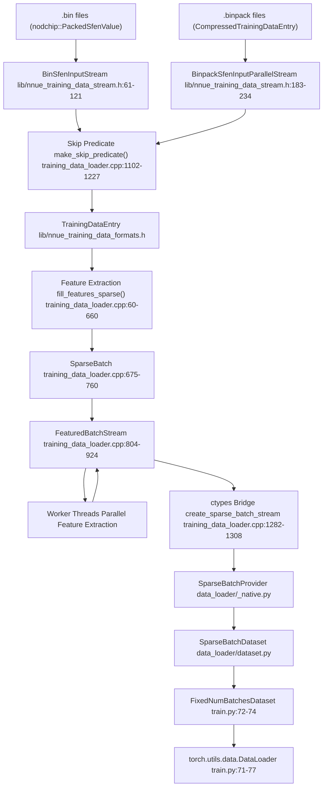
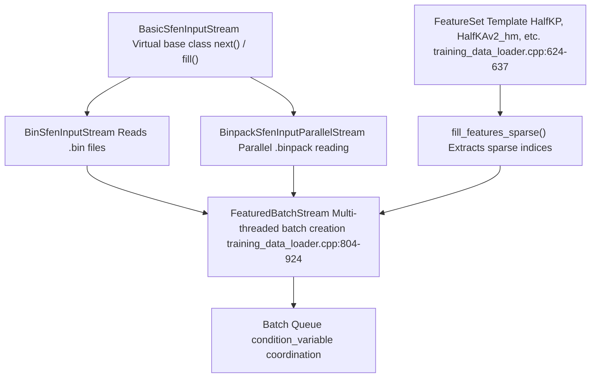
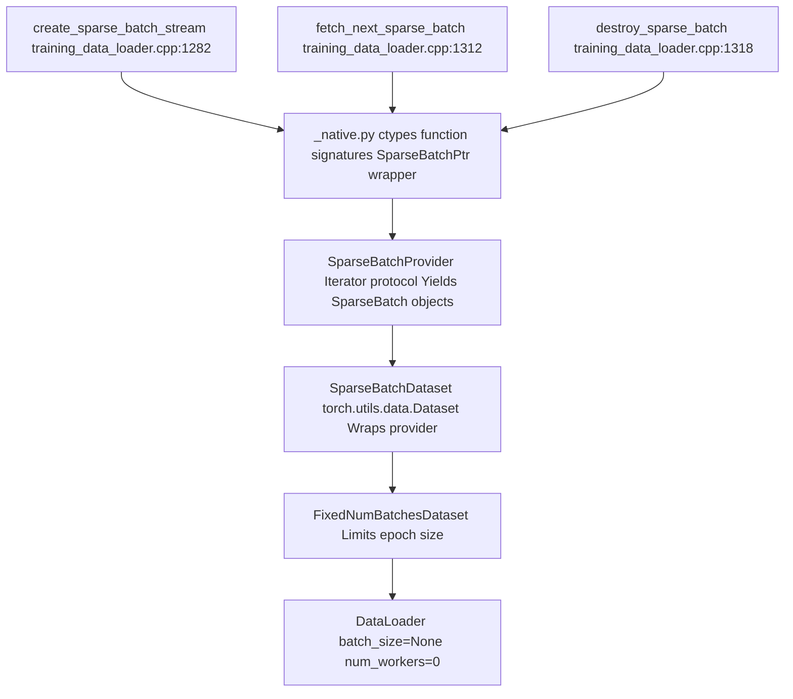

# Data Pipeline

-   [lib/nnue\_training\_data\_formats.h](https://github.com/Chesszyh/nnue-pytorch/blob/024b2064/lib/nnue_training_data_formats.h)
-   [lib/nnue\_training\_data\_stream.h](https://github.com/Chesszyh/nnue-pytorch/blob/024b2064/lib/nnue_training_data_stream.h)
-   [train.py](https://github.com/Chesszyh/nnue-pytorch/blob/024b2064/train.py)
-   [training\_data\_loader.cpp](https://github.com/Chesszyh/nnue-pytorch/blob/024b2064/training_data_loader.cpp)

## Purpose and Scope

This document provides a comprehensive overview of the training data loading system in nnue-pytorch, which transforms binary chess position files into PyTorch-compatible sparse feature tensors. The pipeline consists of a high-performance C++ backend for I/O and feature extraction, with a Python frontend for integration with PyTorch's training infrastructure.

For details on specific feature sets and their implementation, see [Feature Sets](#4.2). For information on the model architecture that consumes this data, see [NNUE Network Structure](#4.1). For training orchestration details, see [Basic Training](#2.1).

## System Overview

The data pipeline bridges the gap between compressed training data files (`.bin` and `.binpack` formats) and the PyTorch training loop. It is designed for maximum throughput, using C++ for performance-critical operations and exposing a simple Python interface.

**Key Design Principles:**

-   **Performance**: C++ implementation with SIMD optimizations and parallel decompression
-   **Flexibility**: Configurable filtering and skipping for position selection
-   **Sparse Representation**: Feature extraction produces sparse indices to minimize memory transfer
-   **Streaming**: Infinite iteration over cyclic datasets without loading everything into memory

## Complete Data Flow


**Sources:** [train.py44-89](https://github.com/Chesszyh/nnue-pytorch/blob/024b2064/train.py#L44-L89) [training\_data\_loader.cpp762-924](https://github.com/Chesszyh/nnue-pytorch/blob/024b2064/training_data_loader.cpp#L762-L924) [lib/nnue\_training\_data\_stream.h41-256](https://github.com/Chesszyh/nnue-pytorch/blob/024b2064/lib/nnue_training_data_stream.h#L41-L256)

## Binary Training Data Formats

The pipeline supports two binary formats for chess training data:

| Format | Extension | Description | Parallelization |
| --- | --- | --- | --- |
| **Plain Binary** | `.bin` | Uncompressed positions using `nodchip::PackedSfenValue` (40 bytes per entry) | Sequential reading only |
| **Binpack** | `.binpack` | Compressed format with interleaved chunks, smaller file size | Parallel decompression via `CompressedTrainingDataEntryParallelReader` |

Both formats store the same information:

-   Board position (piece placement, side to move, castling rights, en passant)
-   Evaluation score (centipawns)
-   Game outcome (win/draw/loss)
-   Move played from this position
-   Ply count

The formats are automatically detected based on file extension by `open_sfen_input_file_parallel()` in [lib/nnue\_training\_data\_stream.h246-255](https://github.com/Chesszyh/nnue-pytorch/blob/024b2064/lib/nnue_training_data_stream.h#L246-L255)

**For detailed format specifications, see [Training Data Formats](#3.1).**

**Sources:** [lib/nnue\_training\_data\_stream.h61-234](https://github.com/Chesszyh/nnue-pytorch/blob/024b2064/lib/nnue_training_data_stream.h#L61-L234) [lib/nnue\_training\_data\_formats.h](https://github.com/Chesszyh/nnue-pytorch/blob/024b2064/lib/nnue_training_data_formats.h)

## C++ Data Loader Architecture

### Core Components


**Sources:** [training\_data\_loader.cpp762-924](https://github.com/Chesszyh/nnue-pytorch/blob/024b2064/training_data_loader.cpp#L762-L924) [lib/nnue\_training\_data\_stream.h41-58](https://github.com/Chesszyh/nnue-pytorch/blob/024b2064/lib/nnue_training_data_stream.h#L41-L58)

### SparseBatch Data Structure

The `SparseBatch` class [training\_data\_loader.cpp675-760](https://github.com/Chesszyh/nnue-pytorch/blob/024b2064/training_data_loader.cpp#L675-L760) is the central data structure representing a batch of positions in sparse feature format:

**Key Fields:**

-   `int* white` / `int* black`: Sparse feature indices for each side (dimension: `size * MAX_ACTIVE_FEATURES`)
-   `float* white_values` / `float* black_values`: Corresponding feature values (usually 1.0, or piece count for virtual features)
-   `float* is_white`: Side to move indicator (1.0 = white, 0.0 = black)
-   `float* score`: Evaluation scores in centipawns
-   `float* outcome`: Game outcomes normalized to \[0, 1\] (0 = loss, 0.5 = draw, 1 = win)
-   `int* psqt_indices`: PSQT bucket indices (based on piece count)
-   `int* layer_stack_indices`: Layer stack bucket indices

The constructor [training\_data\_loader.cpp678-709](https://github.com/Chesszyh/nnue-pytorch/blob/024b2064/training_data_loader.cpp#L678-L709) fills this structure by:

1.  Allocating arrays for the batch size
2.  Calling `fill_features_sparse()` for each position and both colors
3.  Initializing indices to -1 for padding

### Multi-threaded Batch Production

The `FeaturedBatchStream` class [training\_data\_loader.cpp804-924](https://github.com/Chesszyh/nnue-pytorch/blob/024b2064/training_data_loader.cpp#L804-L924) implements a producer-consumer pattern:

1.  **Worker Threads** [training\_data\_loader.cpp826-859](https://github.com/Chesszyh/nnue-pytorch/blob/024b2064/training_data_loader.cpp#L826-L859): Multiple threads extract features in parallel

    -   Each thread reads from the shared stream (protected by `m_stream_mutex`)
    -   Fills `std::vector<TrainingDataEntry>` with `batch_size` entries
    -   Creates `SparseBatch` from entries
    -   Adds batch to queue (protected by `m_batch_mutex`)
2.  **Coordination**: Uses condition variables for flow control

    -   `m_batches_not_full`: Signals when queue has space
    -   `m_batches_any`: Signals when batches are available for consumption
3.  **Concurrency**: Configurable thread count [training\_data\_loader.cpp861-873](https://github.com/Chesszyh/nnue-pytorch/blob/024b2064/training_data_loader.cpp#L861-L873)

    -   Typically uses `concurrency = std::thread::hardware_concurrency()`
    -   Some threads read from disk, others extract features

**For detailed threading model and SIMD optimizations, see [C++ Data Loader Architecture](#3.2).**

**Sources:** [training\_data\_loader.cpp804-924](https://github.com/Chesszyh/nnue-pytorch/blob/024b2064/training_data_loader.cpp#L804-L924)

## Python Data Interface

### Integration via ctypes

The C++ data loader exposes an ABI-stable interface through exported C functions [training\_data\_loader.cpp1229-1321](https://github.com/Chesszyh/nnue-pytorch/blob/024b2064/training_data_loader.cpp#L1229-L1321):

| C Function | Purpose | Python Wrapper |
| --- | --- | --- |
| `create_sparse_batch_stream` | Creates a `FeaturedBatchStream` instance | `SparseBatchProvider.__init__` |
| `fetch_next_sparse_batch` | Retrieves next batch pointer | `SparseBatchProvider.__next__` |
| `destroy_sparse_batch` | Frees batch memory | `SparseBatchProvider` cleanup |
| `destroy_sparse_batch_stream` | Frees stream resources | `SparseBatchProvider.__del__` |

### Python Wrapper Layers


**Sources:** [train.py44-89](https://github.com/Chesszyh/nnue-pytorch/blob/024b2064/train.py#L44-L89)

### SparseBatchDataset

The `SparseBatchDataset` class provides the PyTorch interface to the C++ data loader. Key usage from [train.py56-68](https://github.com/Chesszyh/nnue-pytorch/blob/024b2064/train.py#L56-L68):

```
train_infinite = data_loader.SparseBatchDataset(    features_name,      # e.g., "HalfKAv2_hm^"    train_filenames,    # List of .binpack files    batch_size,         # Positions per batch    num_workers=num_workers,    config=config       # DataloaderSkipConfig)
```
The dataset:

-   Returns infinite batches when iterated (cyclic reading)
-   Wraps each `SparseBatch*` pointer in a Python object
-   Manages C++ memory lifecycle through `__del__` methods
-   Provides zero-copy access to batch data via `ctypes` pointers

The `FixedNumBatchesDataset` wrapper [train.py72-74](https://github.com/Chesszyh/nnue-pytorch/blob/024b2064/train.py#L72-L74) limits iteration to a specific number of batches to define epoch boundaries.

**For detailed Python API documentation, see [Python Data Interface](#3.3).**

**Sources:** [train.py44-89](https://github.com/Chesszyh/nnue-pytorch/blob/024b2064/train.py#L44-L89)

## Data Filtering and Position Selection

### DataloaderSkipConfig

The `DataloaderSkipConfig` structure [training\_data\_loader.cpp1092-1100](https://github.com/Chesszyh/nnue-pytorch/blob/024b2064/training_data_loader.cpp#L1092-L1100) controls which positions are included in training:

| Parameter | Type | Purpose |
| --- | --- | --- |
| `filtered` | bool | Skip positions in check or with captures |
| `random_fen_skipping` | int | Skip positions randomly (e.g., 3 = keep 1 in 4) |
| `wld_filtered` | bool | Skip positions based on WDL probability mismatch |
| `early_fen_skipping` | int | Skip first N plies of each game |
| `simple_eval_skipping` | int | Skip positions with `abs(simple_eval) < N` |
| `pc_y1`, `pc_y2`, `pc_y3` | double | Piece count distribution control (Lagrange interpolation) |

### Skip Predicate Implementation

The `make_skip_predicate()` function [training\_data\_loader.cpp1102-1227](https://github.com/Chesszyh/nnue-pytorch/blob/024b2064/training_data_loader.cpp#L1102-L1227) creates a filtering lambda used during data loading:

**Key Filtering Logic:**

1.  **Predetermined Filtering** [training\_data\_loader.cpp1151-1152](https://github.com/Chesszyh/nnue-pytorch/blob/024b2064/training_data_loader.cpp#L1151-L1152): Skip positions marked with `VALUE_NONE` (32002)
2.  **Early Game Filtering** [training\_data\_loader.cpp1154-1155](https://github.com/Chesszyh/nnue-pytorch/blob/024b2064/training_data_loader.cpp#L1154-L1155): Skip positions with `ply <= early_fen_skipping`
3.  **Random Skipping** [training\_data\_loader.cpp1157-1158](https://github.com/Chesszyh/nnue-pytorch/blob/024b2064/training_data_loader.cpp#L1157-L1158): Bernoulli distribution with probability `prob`
4.  **Smart FEN Filtering** [training\_data\_loader.cpp1160-1161](https://github.com/Chesszyh/nnue-pytorch/blob/024b2064/training_data_loader.cpp#L1160-L1161): Skip captures or checks
5.  **WDL Filtering** [training\_data\_loader.cpp1163-1164](https://github.com/Chesszyh/nnue-pytorch/blob/024b2064/training_data_loader.cpp#L1163-L1164): Skip based on `score_result_prob()` mismatch
6.  **Simple Eval Filtering** [training\_data\_loader.cpp1166-1168](https://github.com/Chesszyh/nnue-pytorch/blob/024b2064/training_data_loader.cpp#L1166-L1168): Skip quiet positions
7.  **Piece Count Distribution** [training\_data\_loader.cpp1182-1220](https://github.com/Chesszyh/nnue-pytorch/blob/024b2064/training_data_loader.cpp#L1182-L1220): Adaptive skipping to match target distribution

The piece count filtering uses Lagrange interpolation [training\_data\_loader.cpp1115-1124](https://github.com/Chesszyh/nnue-pytorch/blob/024b2064/training_data_loader.cpp#L1115-L1124) to define a desired distribution and dynamically adjusts the acceptance rate to match it. This allows training on a balanced mix of opening, middlegame, and endgame positions.

**For detailed filtering algorithms and configuration, see [Data Filtering and Skip Configuration](#3.4).**

**Sources:** [training\_data\_loader.cpp1092-1227](https://github.com/Chesszyh/nnue-pytorch/blob/024b2064/training_data_loader.cpp#L1092-L1227) [train.py525-535](https://github.com/Chesszyh/nnue-pytorch/blob/024b2064/train.py#L525-L535)

## Feature Extraction Process

### Feature Set Template System

Feature extraction is templated over feature set types [training\_data\_loader.cpp624-637](https://github.com/Chesszyh/nnue-pytorch/blob/024b2064/training_data_loader.cpp#L624-L637):

```
template<typename... Ts>struct FeatureSet {    static constexpr int INPUTS = T::INPUTS;    static constexpr int MAX_ACTIVE_FEATURES = T::MAX_ACTIVE_FEATURES;        static std::pair<int, int>    fill_features_sparse(const TrainingDataEntry& e,                          int* features,                          float* values,                          Color color);};
```
Each feature block (e.g., `HalfKP`, `HalfKAv2_hm`, `Full_Threats`) implements:

-   `INPUTS`: Total feature space dimensionality
-   `MAX_ACTIVE_FEATURES`: Maximum active features per position
-   `fill_features_sparse()`: Populates sparse index arrays

### Feature Extraction Example: HalfKAv2\_hm

The `HalfKAv2_hm` feature set [training\_data\_loader.cpp291-342](https://github.com/Chesszyh/nnue-pytorch/blob/024b2064/training_data_loader.cpp#L291-L342) demonstrates the extraction process:

1.  **King Bucketing** [training\_data\_loader.cpp302-311](https://github.com/Chesszyh/nnue-pytorch/blob/024b2064/training_data_loader.cpp#L302-L311): Maps king square to 32 buckets (horizontal mirroring)
2.  **Piece Iteration** [training\_data\_loader.cpp332-338](https://github.com/Chesszyh/nnue-pytorch/blob/024b2064/training_data_loader.cpp#L332-L338): Loops over all pieces on the board
3.  **Index Calculation** [training\_data\_loader.cpp316-322](https://github.com/Chesszyh/nnue-pytorch/blob/024b2064/training_data_loader.cpp#L316-L322): Computes sparse feature index based on:
    -   Oriented king square bucket
    -   Oriented piece square
    -   Piece type and color (11 piece types: packed kings)
4.  **Output**: Returns `(num_active_features, total_input_dimensions)`

For factorized features (suffix `^`), virtual features are also extracted [training\_data\_loader.cpp357-376](https://github.com/Chesszyh/nnue-pytorch/blob/024b2064/training_data_loader.cpp#L357-L376) with values set to piece counts.

**Sources:** [training\_data\_loader.cpp60-621](https://github.com/Chesszyh/nnue-pytorch/blob/024b2064/training_data_loader.cpp#L60-L621)

## Threading Model and Performance

### Concurrency Configuration

The data loader creates worker threads based on the `concurrency` parameter [training\_data\_loader.cpp861-873](https://github.com/Chesszyh/nnue-pytorch/blob/024b2064/training_data_loader.cpp#L861-L873):

```
const int num_feature_threads = std::max(    1,     concurrency - std::max(1, concurrency / num_feature_threads_per_reading_thread));
```
With `num_feature_threads_per_reading_thread = 2` [training\_data\_loader.cpp811](https://github.com/Chesszyh/nnue-pytorch/blob/024b2064/training_data_loader.cpp#L811-L811) the thread allocation is:

-   **Reading threads**: `concurrency / 2` (decompressing binpack chunks)
-   **Feature extraction threads**: `concurrency - (concurrency / 2)` (computing sparse indices)

### Performance Characteristics

Typical throughput (from benchmarking in [training\_data\_loader.cpp1323-1414](https://github.com/Chesszyh/nnue-pytorch/blob/024b2064/training_data_loader.cpp#L1323-L1414)):

-   **Positions/second**: 1-3 million (depends on feature set complexity and skip rate)
-   **Bytes/position**: 20-40 bytes after compression
-   **Batch latency**: Single-digit milliseconds per batch

The bottleneck is typically:

1.  **Decompression** for `.binpack` files (parallelized)
2.  **Feature extraction** for complex feature sets like `Full_Threats` (parallelized)
3.  **Filtering** when skip rates are high (sequential per position)

The system uses SIMD instructions where available (referenced in includes) for bit manipulation during piece iteration.

**Sources:** [training\_data\_loader.cpp804-924](https://github.com/Chesszyh/nnue-pytorch/blob/024b2064/training_data_loader.cpp#L804-L924) [training\_data\_loader.cpp1323-1414](https://github.com/Chesszyh/nnue-pytorch/blob/024b2064/training_data_loader.cpp#L1323-L1414)

## Integration with Training Loop

### Usage in train.py

The complete integration from [train.py519-538](https://github.com/Chesszyh/nnue-pytorch/blob/024b2064/train.py#L519-L538):

```
train, val = make_data_loaders(    train_datasets,          # List of .binpack files    val_datasets,           # Validation files    feature_set,            # FeatureSet object    args.num_workers,       # Thread count    batch_size,             # Positions per batch    data_loader.DataloaderSkipConfig(        filtered=not args.no_smart_fen_skipping,        random_fen_skipping=args.random_fen_skipping,        wld_filtered=not args.no_wld_fen_skipping,        early_fen_skipping=args.early_fen_skipping,        simple_eval_skipping=args.simple_eval_skipping,        param_index=args.param_index,        pc_y1=args.pc_y1,        pc_y2=args.pc_y2,        pc_y3=args.pc_y3,    ),    args.epoch_size,        # Positions per epoch    args.validation_size,   # Validation positions)
```
The returned `DataLoader` objects are then used directly in the Lightning training loop:

```
trainer.fit(nnue, train, val)
```
### Data Format Consumed by Model

Each batch yielded by the data loader contains:

-   **Sparse indices**: `white`, `black` (shape: `[batch_size, MAX_ACTIVE_FEATURES]`)
-   **Sparse values**: `white_values`, `black_values` (shape: `[batch_size, MAX_ACTIVE_FEATURES]`)
-   **Targets**: `score`, `outcome` (shape: `[batch_size]`)
-   **Metadata**: `is_white`, `psqt_indices`, `layer_stack_indices` (shape: `[batch_size]`)

These are directly consumed by the `FeatureTransformer` during the forward pass. See [Feature Transformer](#4.3) for details on how sparse features are processed.

**Sources:** [train.py519-543](https://github.com/Chesszyh/nnue-pytorch/blob/024b2064/train.py#L519-L543)

## Summary

The data pipeline is a high-performance, multi-stage system that:

1.  **Reads** compressed chess positions from disk using parallel I/O
2.  **Filters** positions based on configurable criteria to improve training quality
3.  **Extracts** sparse feature indices specific to the chosen feature set
4.  **Batches** positions into fixed-size groups for efficient GPU processing
5.  **Exposes** a PyTorch-compatible interface via ctypes

This architecture achieves million-position-per-second throughput by leveraging:

-   C++ for I/O and feature extraction performance
-   Parallel decompression and feature extraction
-   Sparse representation to minimize memory transfer
-   Zero-copy data transfer between C++ and Python

The system is flexible enough to support multiple feature sets, data formats, and filtering strategies while maintaining high performance across different hardware configurations.
