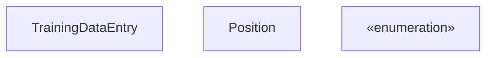
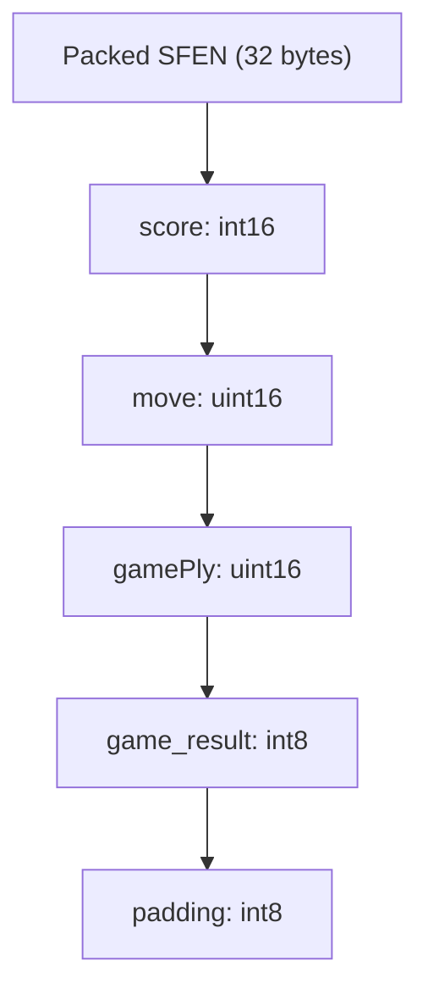

# Training Data Formats

-   [lib/nnue\_training\_data\_formats.h](https://github.com/Chesszyh/nnue-pytorch/blob/024b2064/lib/nnue_training_data_formats.h)
-   [lib/nnue\_training\_data\_stream.h](https://github.com/Chesszyh/nnue-pytorch/blob/024b2064/lib/nnue_training_data_stream.h)
-   [training\_data\_loader.cpp](https://github.com/Chesszyh/nnue-pytorch/blob/024b2064/training_data_loader.cpp)

## Purpose and Scope

This document describes the binary file formats used to store chess training data in the nnue-pytorch repository. The training data consists of chess positions paired with evaluation scores and game outcomes, which are used to train NNUE neural networks.

For information about how these formats are read and processed, see [C++ Data Loader Architecture](#3.2). For filtering and skip configurations, see [Data Filtering and Skip Configuration](#3.4).

## Overview

The repository supports two binary training data formats:

| Format | Extension | Compression | Parallel Reading | Typical Use Case |
| --- | --- | --- | --- | --- |
| Plain Binary | `.bin` | None | No | Legacy datasets, simple workflows |
| Binpack | `.binpack` | LEB128 + bitpacking | Yes | Modern datasets, production training |

Both formats store the same logical data structure (`TrainingDataEntry`) but use different on-disk representations. The `.binpack` format offers superior compression (typically 3-5x smaller files) and supports multi-threaded parallel decompression.

**Sources:** [lib/nnue\_training\_data\_stream.h61-181](https://github.com/Chesszyh/nnue-pytorch/blob/024b2064/lib/nnue_training_data_stream.h#L61-L181)

## TrainingDataEntry Structure


The `TrainingDataEntry` is the in-memory representation of a single training sample. It contains:

-   **`pos`**: Complete chess position (board state, side to move, castling rights, en passant square)
-   **`score`**: Evaluation score in centipawns from the engine's perspective
-   **`result`**: Game outcome from the side-to-move's perspective (-1.0 = loss, 0.0 = draw, 1.0 = win)
-   **`move`**: The move that was played from this position (stored as compressed 16-bit value)
-   **`ply`**: Ply count (half-moves) from the start of the game

**Sources:** [training\_data\_loader.cpp740-747](https://github.com/Chesszyh/nnue-pytorch/blob/024b2064/training_data_loader.cpp#L740-L747) [lib/nnue\_training\_data\_formats.h1548-1594](https://github.com/Chesszyh/nnue-pytorch/blob/024b2064/lib/nnue_training_data_formats.h#L1548-L1594)

## .bin Format (Plain Binary)


The `.bin` format stores training entries as fixed-size `PackedSfenValue` structures written sequentially without any file header or metadata. Each entry is exactly **40 bytes**.

### Binary Layout

| Offset | Size | Field | Description |
| --- | --- | --- | --- |
| 0 | 32 bytes | `sfen` | Huffman-coded chess position (Stockfish format) |
| 32 | 2 bytes | `score` | Evaluation score (int16, little-endian) |
| 34 | 2 bytes | `move` | Compressed move (uint16, little-endian) |
| 36 | 2 bytes | `gamePly` | Ply count (uint16, little-endian) |
| 38 | 1 byte | `game_result` | Game result: 0=loss, 1=draw, 2=win |
| 39 | 1 byte | `padding` | Unused alignment byte |

The packed SFEN representation uses a Huffman-coded encoding where:

-   Piece placement is compressed using variable-length codes
-   Castling rights, en passant, and side-to-move are encoded in remaining bits
-   Empty squares are run-length encoded

**Reading Process:**

**Sources:** [lib/nnue\_training\_data\_stream.h61-121](https://github.com/Chesszyh/nnue-pytorch/blob/024b2064/lib/nnue_training_data_stream.h#L61-L121)

## .binpack Format (Compressed)

The `.binpack` format uses sophisticated compression to achieve much smaller file sizes while maintaining fast decompression. It supports parallel reading across multiple threads.

### Compression Techniques

The `.binpack` format applies multiple compression strategies:

1.  **Chunk-based organization**: Entries are grouped into chunks that can be decompressed independently
2.  **LEB128 encoding**: Variable-length integer encoding for chunk sizes and metadata
3.  **Bitpacking**: Position data is packed at the bit level, eliminating byte boundaries
4.  **Delta encoding**: Score values are delta-encoded within chunks
5.  **Move compression**: Moves are stored using 16-bit compressed representation

### Parallel Reading Architecture

Multiple threads decompress different chunks concurrently, feeding entries into a synchronized queue. This architecture scales efficiently to high core counts.

**Sources:** [lib/nnue\_training\_data\_stream.h123-234](https://github.com/Chesszyh/nnue-pytorch/blob/024b2064/lib/nnue_training_data_stream.h#L123-L234)

## Format Selection and Stream Creation

The data loader automatically selects the appropriate reader based on file extension:

**Stream Interface:**

-   **`next()`**: Returns next `std::optional<TrainingDataEntry>`
-   **`fill(vec, n)`**: Fills vector with up to `n` entries
-   **`eof()`**: Returns true when stream is exhausted

Both readers support cyclic mode, which automatically reopens the file from the beginning when EOF is reached (useful for continuous training).

**Sources:** [lib/nnue\_training\_data\_stream.h236-256](https://github.com/Chesszyh/nnue-pytorch/blob/024b2064/lib/nnue_training_data_stream.h#L236-L256) [training\_data\_loader.cpp770-781](https://github.com/Chesszyh/nnue-pytorch/blob/024b2064/training_data_loader.cpp#L770-L781)

## Position Encoding Details

Chess positions in both formats encode the following information:

### Board Representation

| Component | Encoding Method | Size |
| --- | --- | --- |
| Piece placement | Huffman-coded squares | Variable (20-28 bytes typical) |
| Side to move | 1 bit | \- |
| Castling rights | 4 bits (KQkq) | \- |
| En passant square | 0-6 bits | \- |
| 50-move counter | Not stored (training doesn't need it) | \- |
| Move counter | Not stored (ply is separate field) | \- |

### Move Encoding

Moves are compressed into 16 bits using `CompressedMove`:

| Bits | Field | Description |
| --- | --- | --- |
| 15-14 | Move type | 0=Normal, 1=Promotion, 2=Castle, 3=EnPassant |
| 13-8 | From square | 0-63 (6 bits) |
| 7-2 | To square | 0-63 (6 bits) |
| 1-0 | Promoted piece | 0=Knight, 1=Bishop, 2=Rook, 3=Queen |

**Sources:** [lib/nnue\_training\_data\_formats.h1611-1750](https://github.com/Chesszyh/nnue-pytorch/blob/024b2064/lib/nnue_training_data_formats.h#L1611-L1750)

## Data Conversion Flow

The conversion pipeline:

1.  **Disk → TrainingDataEntry**: Binary format decoded to full position representation
2.  **TrainingDataEntry → SparseBatch**: Feature extraction (see [Feature Sets](#4.2)) converts positions to sparse neural network inputs
3.  **SparseBatch → PyTorch**: ctypes bridge transfers to GPU tensors (see [Python Data Interface](#3.3))

**Sources:** [training\_data\_loader.cpp675-760](https://github.com/Chesszyh/nnue-pytorch/blob/024b2064/training_data_loader.cpp#L675-L760) [lib/nnue\_training\_data\_stream.h76-106](https://github.com/Chesszyh/nnue-pytorch/blob/024b2064/lib/nnue_training_data_stream.h#L76-L106)

## Special Values and Flags

### Sentinel Values

| Field | Sentinel Value | Meaning | Usage |
| --- | --- | --- | --- |
| `score` | 32002 (`VALUE_NONE`) | Position should be skipped | Allows pre-marked filtering without dataset modification |
| `move` | 0 (null move) | No move specified | Used for terminal positions |
| `result` | \-1, 0, 1 | Loss, Draw, Win | Always from side-to-move perspective |

The `VALUE_NONE` sentinel is particularly important for dataset management. Positions can be marked for skipping at data generation time without requiring dataset recompression:

```
// From DataloaderSkipConfig skip predicateif (e.score == VALUE_NONE)    return true;  // Skip this position
```
**Sources:** [training\_data\_loader.cpp1112-1152](https://github.com/Chesszyh/nnue-pytorch/blob/024b2064/training_data_loader.cpp#L1112-L1152)

## Format Comparison Summary

| Aspect | .bin | .binpack |
| --- | --- | --- |
| **Compression ratio** | 1.0x (baseline) | 3-5x better |
| **Read speed (single thread)** | Fast | Moderate (decompression overhead) |
| **Read speed (multi-thread)** | Limited by single stream | Scales linearly with cores |
| **Write complexity** | Simple (direct serialization) | Complex (requires chunking) |
| **Random access** | Yes (40 bytes/entry) | Limited (chunk boundaries) |
| **File size** | ~40 bytes/position | ~8-12 bytes/position |
| **Production use** | Legacy | Recommended |

For modern training workflows with large datasets (billions of positions), `.binpack` is strongly preferred due to:

-   Reduced storage requirements (important for network/cloud training)
-   Parallel decompression fully utilizing multi-core CPUs
-   Better cache efficiency during streaming

**Sources:** [lib/nnue\_training\_data\_stream.h61-234](https://github.com/Chesszyh/nnue-pytorch/blob/024b2064/lib/nnue_training_data_stream.h#L61-L234) [training\_data\_loader.cpp1323-1414](https://github.com/Chesszyh/nnue-pytorch/blob/024b2064/training_data_loader.cpp#L1323-L1414)
