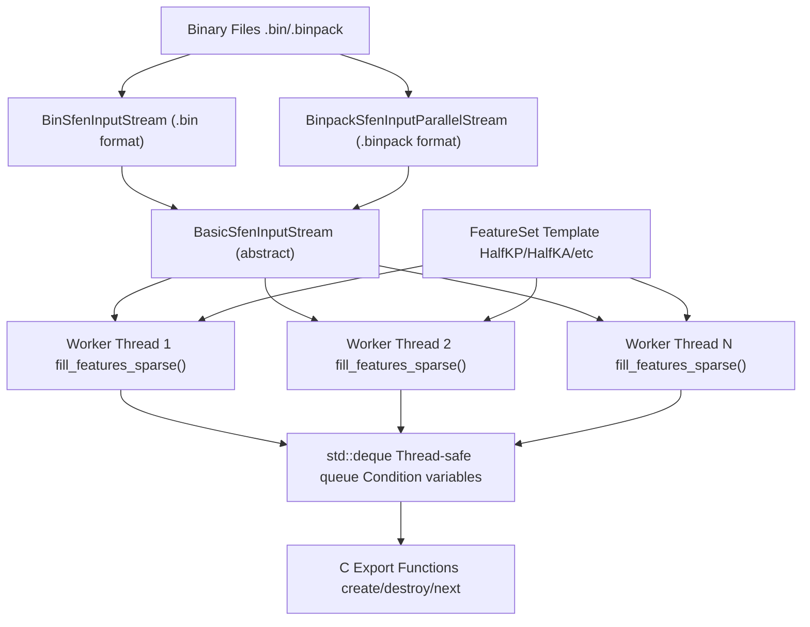
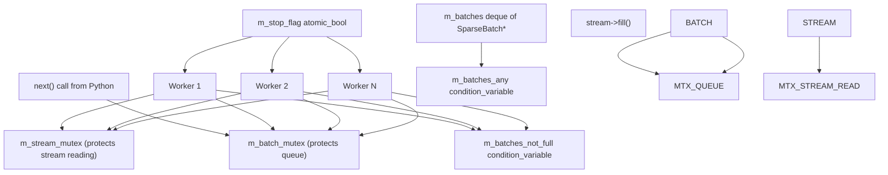
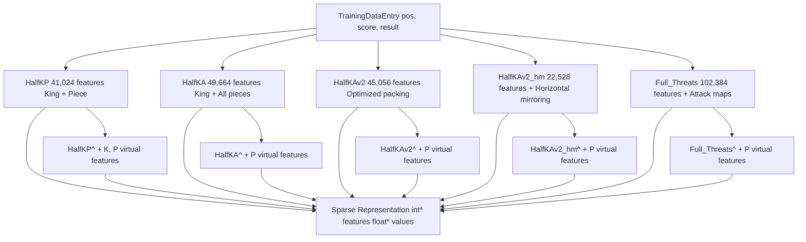
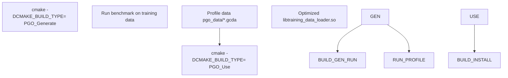
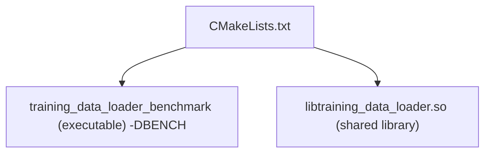

# C++ Data Loader Architecture

-   [.pgo/small.binpack](https://github.com/Chesszyh/nnue-pytorch/blob/024b2064/.pgo/small.binpack)
-   [CMakeLists.txt](https://github.com/Chesszyh/nnue-pytorch/blob/024b2064/CMakeLists.txt)
-   [compile\_data\_loader.bat](https://github.com/Chesszyh/nnue-pytorch/blob/024b2064/compile_data_loader.bat)
-   [lib/nnue\_training\_data\_formats.h](https://github.com/Chesszyh/nnue-pytorch/blob/024b2064/lib/nnue_training_data_formats.h)
-   [lib/nnue\_training\_data\_stream.h](https://github.com/Chesszyh/nnue-pytorch/blob/024b2064/lib/nnue_training_data_stream.h)
-   [training\_data\_loader.cpp](https://github.com/Chesszyh/nnue-pytorch/blob/024b2064/training_data_loader.cpp)

## Purpose and Scope

This document describes the native C++ data loader implementation that handles the performance-critical task of reading binary training data files and converting chess positions into sparse feature representations. The C++ loader is compiled as a shared library (`libtraining_data_loader.so`) and accessed from Python via ctypes.

For information about the Python interface to this loader, see [Python Data Interface](#3.3). For details on the binary file formats being parsed, see [Training Data Formats](#3.1). For filtering and skip configuration, see [Data Filtering and Skip Configuration](#3.4).

## Architecture Overview

The C++ data loader implements a multi-threaded producer-consumer architecture that maximizes I/O and CPU utilization:


**Key Design Principles:**

-   **Separation of Concerns**: Stream reading, feature extraction, and batch construction are separate layers
-   **Lock-Free Reading**: Each worker thread reads from the stream under a shared lock, minimizing contention
-   **Batched Processing**: Workers produce complete batches to amortize synchronization costs
-   **Memory Efficiency**: Direct allocation of flat arrays for sparse features avoids indirection

Sources: [training\_data\_loader.cpp762-924](https://github.com/Chesszyh/nnue-pytorch/blob/024b2064/training_data_loader.cpp#L762-L924) [lib/nnue\_training\_data\_stream.h41-59](https://github.com/Chesszyh/nnue-pytorch/blob/024b2064/lib/nnue_training_data_stream.h#L41-L59)

## Stream Architecture

The stream layer abstracts different binary formats behind a common interface:


**Stream Implementation Details:**

| Stream Type | File Format | Parallel Reading | Compression | Use Case |
| --- | --- | --- | --- | --- |
| `BinSfenInputStream` | `.bin` | No | No | Legacy format, single-threaded |
| `BinpackSfenInputStream` | `.binpack` | No | LZ4 + Huffman | Small-scale training |
| `BinpackSfenInputParallelStream` | `.binpack` | Yes | LZ4 + Huffman | Production training (default) |

The parallel stream distributes file reading across multiple decompression threads managed by `CompressedTrainingDataEntryParallelReader` (defined in `lib/nnue_training_data_formats.h`). Each thread maintains its own decompression context to avoid lock contention.

**Cyclic Reading**: All streams support cyclic mode where they automatically reopen files after reaching EOF, enabling infinite iteration over finite datasets. This is controlled by the `cyclic` constructor parameter.

**Skip Predicates**: Each stream accepts a `std::function<bool(const TrainingDataEntry&)>` that filters entries during reading. This enables efficient data filtering without loading unwanted positions into memory.

Sources: [lib/nnue\_training\_data\_stream.h61-234](https://github.com/Chesszyh/nnue-pytorch/blob/024b2064/lib/nnue_training_data_stream.h#L61-L234) [lib/nnue\_training\_data\_stream.h236-255](https://github.com/Chesszyh/nnue-pytorch/blob/024b2064/lib/nnue_training_data_stream.h#L236-L255)

## Threading Model

The `FeaturedBatchStream` class implements the multi-threaded batch production system:


**Worker Thread Lifecycle:**

Each worker thread executes the following loop ([training\_data\_loader.cpp826-859](https://github.com/Chesszyh/nnue-pytorch/blob/024b2064/training_data_loader.cpp#L826-L859)):

1.  **Read Entries**: Acquire `m_stream_mutex`, call `stream->fill()` to read `m_batch_size` entries
2.  **Extract Features**: Release stream lock, call `fill_features_sparse()` for each entry (CPU-intensive)
3.  **Create Batch**: Allocate `SparseBatch` object with extracted features
4.  **Enqueue Batch**: Acquire `m_batch_mutex`, wait until queue size < `m_concurrency + 1`, push batch
5.  **Signal Consumer**: Notify `m_batches_any` condition variable
6.  **Repeat**: Continue until stream exhausted or stop flag set

**Thread Count Configuration:**

The constructor calculates thread allocation ([training\_data\_loader.cpp861-873](https://github.com/Chesszyh/nnue-pytorch/blob/024b2064/training_data_loader.cpp#L861-L873)):

-   `num_feature_threads_per_reading_thread = 2` (constant ratio)
-   Reading threads: `max(1, concurrency / 2)`
-   Feature threads: `max(1, concurrency - reading_threads)`

This 2:1 ratio balances I/O (reading/decompression) with CPU (feature extraction).

**Synchronization Guarantees:**

-   Queue never exceeds `concurrency + 1` batches (prevents memory overflow)
-   `next()` blocks until batch available or all workers finished
-   Destructor sets stop flag and joins all threads cleanly

Sources: [training\_data\_loader.cpp804-924](https://github.com/Chesszyh/nnue-pytorch/blob/024b2064/training_data_loader.cpp#L804-L924)

## Feature Extraction Pipeline

Feature extraction converts chess positions into sparse integer indices representing active features:

### Feature Set Implementations


Each feature set implements:

-   `static constexpr int INPUTS` - Total feature count
-   `static constexpr int MAX_ACTIVE_FEATURES` - Maximum features per position (typically 32)
-   `static std::pair<int, int> fill_features_sparse(entry, features, values, color)` - Extraction function

**Example: HalfKP Feature Extraction** ([training\_data\_loader.cpp76-96](https://github.com/Chesszyh/nnue-pytorch/blob/024b2064/training_data_loader.cpp#L76-L96)):

```
// For each piece (excluding kings):
//   feature_index = 1 + oriented_square + piece_type_offset + king_square * NUM_PLANES
//   where piece_type_offset = piece_type * 2 + (piece_color != perspective_color)
```
The function populates two arrays:

-   `features[]` - Integer indices into the feature space
-   `values[]` - Always 1.0f for base features (factorized variants differ)

**Coordinate Transformations:**

Different feature sets use different board orientations:

-   `orient()` - Rotate 180° for black ([training\_data\_loader.cpp35-47](https://github.com/Chesszyh/nnue-pytorch/blob/024b2064/training_data_loader.cpp#L35-L47))
-   `orient_flip()` - Vertical flip only ([training\_data\_loader.cpp49-58](https://github.com/Chesszyh/nnue-pytorch/blob/024b2064/training_data_loader.cpp#L49-L58))
-   `orient_flip_2()` - Vertical flip + horizontal mirror based on king file ([training\_data\_loader.cpp282-289](https://github.com/Chesszyh/nnue-pytorch/blob/024b2064/training_data_loader.cpp#L282-L289))

**Factorized Features:**

Factorized variants (suffix `^`) add virtual features representing piece-only information:

-   Base features: King-relative positions
-   Virtual features: King-independent piece positions
-   Values for virtual features encode the count of base features

These accelerate early training by providing piece information independent of king position. Virtual features are coalesced back into base features during serialization (see [Weight Coalescing and Compression](#5.3)).

Sources: [training\_data\_loader.cpp60-622](https://github.com/Chesszyh/nnue-pytorch/blob/024b2064/training_data_loader.cpp#L60-L622) [training\_data\_loader.cpp624-673](https://github.com/Chesszyh/nnue-pytorch/blob/024b2064/training_data_loader.cpp#L624-L673)

## Batch Construction

The `SparseBatch` structure aggregates multiple training entries into a single memory allocation:


**Construction Process** ([training\_data\_loader.cpp678-709](https://github.com/Chesszyh/nnue-pytorch/blob/024b2064/training_data_loader.cpp#L678-L709)):

1.  **Allocate Arrays**: Create flat arrays sized `batch_size * MAX_ACTIVE_FEATURES`
2.  **Initialize to Sentinel**: Set all feature indices to `-1` (marks unused slots)
3.  **Fill Entries**: For each position, extract features for both perspectives (white/black)
4.  **Compute Indices**: Calculate PSQT and layer stack bucket indices based on piece count
5.  **Return Batch**: Ownership transferred to Python via pointer

**Memory Layout:**

Features for position `i` occupy indices `[i * MAX_ACTIVE_FEATURES, (i+1) * MAX_ACTIVE_FEATURES)` in the flat arrays. Unused slots (when actual features < MAX\_ACTIVE\_FEATURES) contain `-1` sentinel values.

**Dual Perspective Extraction:**

Each position generates features from both white and black perspectives:

-   `white[]` - Features for white king's perspective
-   `black[]` - Features for black king's perspective

This dual extraction enables the model to evaluate from either side and supports the NNUE architecture's symmetry requirements.

**Bucket Indices:**

Two bucket systems partition the feature/output space:

-   `psqt_indices[i] = (piece_count - 1) / 4` - For PSQT (Piece-Square Table) values
-   `layer_stack_indices[i] = psqt_indices[i]` - For layer stack selection

These enable the network to specialize behavior based on material count (endgame vs middlegame).

Sources: [training\_data\_loader.cpp675-760](https://github.com/Chesszyh/nnue-pytorch/blob/024b2064/training_data_loader.cpp#L675-L760)

## C/Python Interface

The loader exports a C-compatible API for Python interop via ctypes:

### Export Macros

Platform-specific export declarations ([training\_data\_loader.cpp19-30](https://github.com/Chesszyh/nnue-pytorch/blob/024b2064/training_data_loader.cpp#L19-L30)):

```
x86_64:  EXPORT = (empty), CDECL = (empty)
Windows: EXPORT = __declspec(dllexport), CDECL = __cdecl
Others:  EXPORT = (empty), CDECL = __attribute__((__cdecl__))
```
### Stream Management Functions

> **[Mermaid sequence]**
> *(图表结构无法解析)*

**Primary API Functions** ([training\_data\_loader.cpp1078-1180](https://github.com/Chesszyh/nnue-pytorch/blob/024b2064/training_data_loader.cpp#L1078-L1180)):

| Function | Purpose | Returns |
| --- | --- | --- |
| `create_sparse_batch_stream` | Initialize stream with feature set, files, batch size | `AnyStream*` |
| `sparse_batch_stream_next` | Get next batch (blocking) | `SparseBatch*` |
| `destroy_sparse_batch` | Free batch memory | void |
| `destroy_sparse_batch_stream` | Shutdown stream and join threads | void |

**Feature Set Selection:**

The `create_sparse_batch_stream` function accepts a feature set name string and uses runtime dispatch via `std::variant` to instantiate the appropriate template specialization ([training\_data\_loader.cpp661-673](https://github.com/Chesszyh/nnue-pytorch/blob/024b2064/training_data_loader.cpp#L661-L673) [training\_data\_loader.cpp1078-1180](https://github.com/Chesszyh/nnue-pytorch/blob/024b2064/training_data_loader.cpp#L1078-L1180)).

**Lifetime Management:**

-   **Stream**: Created by `create_*`, owned by Python, destroyed by `destroy_*`
-   **Batch**: Created by worker threads, owned by Python after `next()`, destroyed by `destroy_sparse_batch()`
-   Destructor ensures all worker threads join before freeing resources

**Skip Predicate Integration:**

The C API supports configurable skip predicates via a builder pattern:

-   `create_sparse_batch_stream_filtered` - Accepts `DataloaderSkipConfig*` parameter
-   Skip config is converted to a C++ lambda passed to stream constructor
-   Filtering occurs during stream reading, before feature extraction

Sources: [training\_data\_loader.cpp1078-1414](https://github.com/Chesszyh/nnue-pytorch/blob/024b2064/training_data_loader.cpp#L1078-L1414)

## Performance Optimizations

### SIMD and Architecture-Specific Code

**BMI2 Support Detection** ([CMakeLists.txt24-60](https://github.com/Chesszyh/nnue-pytorch/blob/024b2064/CMakeLists.txt#L24-L60)):

The build system detects CPU capabilities at compile time:

-   Checks `/proc/cpuinfo` for `bmi2` flag
-   AMD CPUs: Requires family ≥ 23 (Zen+)
-   Intel CPUs: Enabled if `bmi2` present
-   Defines `HAS_BMI2` macro when available

**BMI2 Optimization** ([lib/nnue\_training\_data\_formats.h274-310](https://github.com/Chesszyh/nnue-pytorch/blob/024b2064/lib/nnue_training_data_formats.h#L274-L310)):

```
int nthSetBitIndex(uint64_t v, uint64_t n) {#ifdef HAS_BMI2    return intrin::msb(_pdep_u64(1ULL << n, v));#else    // Fallback implementation with byte-level lookup#endif}
```
The `_pdep_u64` intrinsic accelerates sparse bitboard operations used in position parsing. This is critical for decompression performance in `.binpack` files.

### Profile-Guided Optimization (PGO)

**Two-Phase Build Process** ([compile\_data\_loader.bat1-12](https://github.com/Chesszyh/nnue-pytorch/blob/024b2064/compile_data_loader.bat#L1-L12)):


**CMake Configuration** ([CMakeLists.txt13-17](https://github.com/Chesszyh/nnue-pytorch/blob/024b2064/CMakeLists.txt#L13-L17)):

```
PGO_Generate: -fprofile-generate=${PGO_PROFILE_DATA_DIR}
PGO_Use:      -fprofile-use=${PGO_PROFILE_DATA_DIR} -fprofile-correction
```
The profile-guided build:

1.  Compiles with instrumentation (`-fprofile-generate`)
2.  Runs `training_data_loader_benchmark` on representative data
3.  Recompiles with profile feedback (`-fprofile-use`)

Typical speedup: 10-20% for the data loading path.

### Thread Configuration

**Concurrency Tuning** ([training\_data\_loader.cpp811](https://github.com/Chesszyh/nnue-pytorch/blob/024b2064/training_data_loader.cpp#L811-L811)):

The `num_feature_threads_per_reading_thread = 2` constant balances:

-   **I/O Bound**: Decompression and file reading
-   **CPU Bound**: Feature index calculation

For a system with `N` cores:

-   Reading threads: `N / 2` (rounded up to 1 minimum)
-   Feature threads: `N - reading_threads`

This assumes feature extraction is roughly 2× slower than reading/decompression for typical `.binpack` files.

### Memory Access Patterns

**Coalesced Feature Ordering:**

Feature indices are sorted during extraction to ensure coalesced tensor creation in PyTorch. When features are accessed in order during sparse matrix construction, cache locality improves significantly.

For HalfKP: `features[j] = 1 + sq + p_idx * 64 + ksq * 641` produces monotonically increasing indices when pieces are iterated in square order.

Sources: [CMakeLists.txt1-82](https://github.com/Chesszyh/nnue-pytorch/blob/024b2064/CMakeLists.txt#L1-L82) [training\_data\_loader.cpp811](https://github.com/Chesszyh/nnue-pytorch/blob/024b2064/training_data_loader.cpp#L811-L811) [lib/nnue\_training\_data\_formats.h274-310](https://github.com/Chesszyh/nnue-pytorch/blob/024b2064/lib/nnue_training_data_formats.h#L274-L310)

## Build System

### CMake Configuration

**Build Types:**

| Type | Flags | Purpose |
| --- | --- | --- |
| `Debug` | `-g` | Development with debug symbols |
| `Release` | `-O3 -march=native -DNDEBUG` | Standard optimized build |
| `RelWithDebInfo` | `-g -O3 -march=native -DNDEBUG` | Profiling with optimization |
| `PGO_Generate` | `-O3 -march=native -fprofile-generate` | PGO instrumentation |
| `PGO_Use` | `-g -O3 -march=native -fprofile-use` | PGO-optimized final build |

**Compilation Targets** ([CMakeLists.txt64-81](https://github.com/Chesszyh/nnue-pytorch/blob/024b2064/CMakeLists.txt#L64-L81)):


**Dependencies:**

-   `Threads::Threads` - POSIX threads for worker pool
-   C++20 standard required (features: concepts, designated initializers)

**Conditional Compilation:**

The same source file (`training_data_loader.cpp`) compiles as:

-   **Library**: Exports C API functions for Python
-   **Benchmark**: Defines `BENCH` macro, builds standalone executable for profiling

**Installation:**

```
cmake --build ./build --target install
```
Installs `libtraining_data_loader.so` to the project root where Python can load it via:

```
ctypes.CDLL("./libtraining_data_loader.so")
```
Sources: [CMakeLists.txt1-82](https://github.com/Chesszyh/nnue-pytorch/blob/024b2064/CMakeLists.txt#L1-L82)

---

## Summary

The C++ data loader provides a high-performance foundation for NNUE training by:

1.  **Efficient Parsing**: Native decompression of `.binpack` format with parallel readers
2.  **Multi-Threading**: Producer-consumer architecture maximizes CPU/I/O overlap
3.  **Flexible Features**: Template-based design supports multiple feature sets
4.  **Low Overhead**: Direct memory allocation and C ABI minimize Python interop costs
5.  **Optimized Builds**: PGO and architecture-specific SIMD improve throughput

The loader achieves ~10-100× speedup over pure Python implementations, making it the bottleneck-free foundation for large-scale NNUE training.
