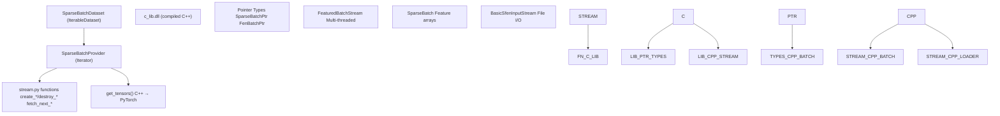
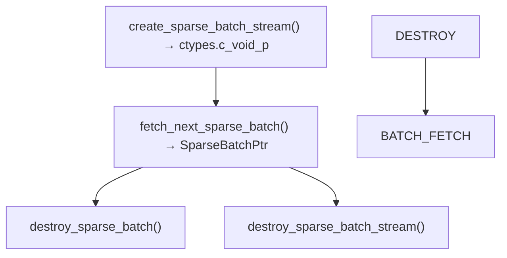
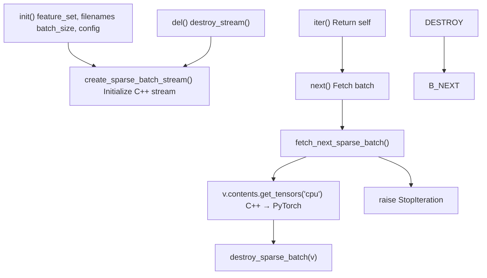
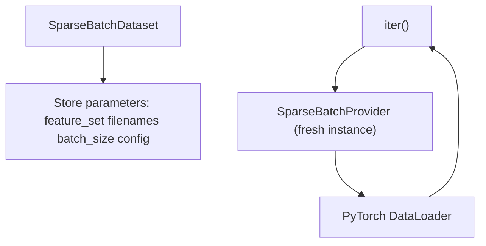
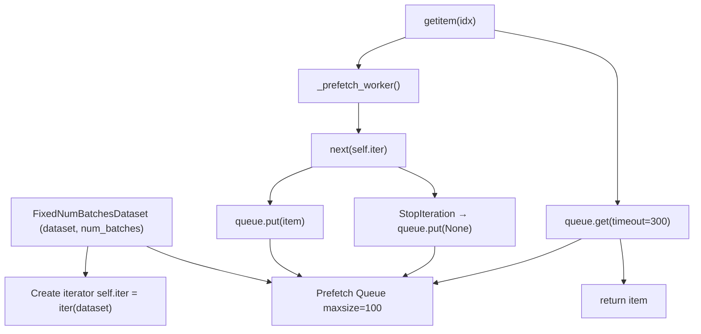

# Python Data Interface

-   [data\_loader/dataset.py](https://github.com/Chesszyh/nnue-pytorch/blob/024b2064/data_loader/dataset.py)
-   [data\_loader/stream.py](https://github.com/Chesszyh/nnue-pytorch/blob/024b2064/data_loader/stream.py)
-   [lib/nnue\_training\_data\_formats.h](https://github.com/Chesszyh/nnue-pytorch/blob/024b2064/lib/nnue_training_data_formats.h)
-   [lib/nnue\_training\_data\_stream.h](https://github.com/Chesszyh/nnue-pytorch/blob/024b2064/lib/nnue_training_data_stream.h)
-   [perf\_sigmoid\_fitter.py](https://github.com/Chesszyh/nnue-pytorch/blob/024b2064/perf_sigmoid_fitter.py)
-   [training\_data\_loader.cpp](https://github.com/Chesszyh/nnue-pytorch/blob/024b2064/training_data_loader.cpp)

## Purpose and Scope

The Python Data Interface provides Python-level access to the high-performance C++ data loader described in [3.2](#3.2). It bridges the native C++ streaming implementation with PyTorch's training infrastructure through a ctypes-based interface. This module consists of iterator protocols, dataset wrappers, and stream management functions that expose C++ `SparseBatch` objects as PyTorch tensors.

For information about the underlying binary formats, see [3.1](#3.1). For details on data filtering and skip configuration, see [3.4](#3.4).

## Architecture Overview

The Python data interface uses a layered architecture that separates stream management, iteration logic, and PyTorch integration:


**Sources**: [data\_loader/dataset.py1-226](https://github.com/Chesszyh/nnue-pytorch/blob/024b2064/data_loader/dataset.py#L1-L226) [data\_loader/stream.py1-89](https://github.com/Chesszyh/nnue-pytorch/blob/024b2064/data_loader/stream.py#L1-L89)

The architecture follows a provider-consumer pattern where:

-   **Stream functions** manage C++ object lifecycles via ctypes
-   **Provider classes** implement Python iterator protocol
-   **Dataset classes** integrate with PyTorch's `DataLoader`

## Stream Management Functions

The [data\_loader/stream.py1-89](https://github.com/Chesszyh/nnue-pytorch/blob/024b2064/data_loader/stream.py#L1-L89) module provides low-level functions for interacting with C++ streams through ctypes. These functions handle object creation, data retrieval, and cleanup.

### Stream Lifecycle


**Sources**: [data\_loader/stream.py42-88](https://github.com/Chesszyh/nnue-pytorch/blob/024b2064/data_loader/stream.py#L42-L88)

### Key Functions

| Function | Purpose | C++ Mapping |
| --- | --- | --- |
| `create_sparse_batch_stream()` | Initialize multi-threaded batch stream | [training\_data\_loader.cpp1106-1148](https://github.com/Chesszyh/nnue-pytorch/blob/024b2064/training_data_loader.cpp#L1106-L1148) |
| `fetch_next_sparse_batch()` | Retrieve next batch from stream | Returns `SparseBatch*` pointer |
| `destroy_sparse_batch()` | Free batch memory | Calls C++ destructor |
| `destroy_sparse_batch_stream()` | Shutdown stream and threads | [training\_data\_loader.cpp1150-1154](https://github.com/Chesszyh/nnue-pytorch/blob/024b2064/training_data_loader.cpp#L1150-L1154) |
| `get_sparse_batch_from_fens()` | Create batch from FEN strings | For testing/debugging |

**Sources**: [data\_loader/stream.py42-88](https://github.com/Chesszyh/nnue-pytorch/blob/024b2064/data_loader/stream.py#L42-L88)

### String Array Conversion

The `_to_c_str_array()` helper [data\_loader/stream.py7-10](https://github.com/Chesszyh/nnue-pytorch/blob/024b2064/data_loader/stream.py#L7-L10) converts Python string lists to C-compatible `char**` arrays:

```
c_str_array = (ctypes.c_char_p * len(str_list))()c_str_array[:] = [s.encode("utf-8") for s in str_list]
```
This is used for passing filename lists to C++ constructors.

**Sources**: [data\_loader/stream.py7-10](https://github.com/Chesszyh/nnue-pytorch/blob/024b2064/data_loader/stream.py#L7-L10)

## Provider Classes

Providers implement Python's iterator protocol to continuously yield batches from C++ streams. They manage stream lifecycle and convert C++ data structures to Python tensors.

### SparseBatchProvider

[data\_loader/dataset.py113-134](https://github.com/Chesszyh/nnue-pytorch/blob/024b2064/data_loader/dataset.py#L113-L134) is the primary iterator for training data:


**Sources**: [data\_loader/dataset.py113-134](https://github.com/Chesszyh/nnue-pytorch/blob/024b2064/data_loader/dataset.py#L113-L134)

The `__next__()` method [data\_loader/dataset.py99-107](https://github.com/Chesszyh/nnue-pytorch/blob/024b2064/data_loader/dataset.py#L99-L107):

1.  Calls `fetch_next_sparse_batch()` to get a `SparseBatchPtr`
2.  Extracts tensors via `v.contents.get_tensors("cpu")`
3.  Destroys the batch to free C++ memory
4.  Returns the tensor tuple

This design ensures deterministic memory cleanup while maintaining Python's iterator semantics.

### TrainingDataProvider

[data\_loader/dataset.py57-111](https://github.com/Chesszyh/nnue-pytorch/blob/024b2064/data_loader/dataset.py#L57-L111) is an abstract base class that generalizes the provider pattern. It's parameterized by stream creation/destruction functions, allowing different batch types (sparse batches, FEN batches) to share the same iteration logic.

**Sources**: [data\_loader/dataset.py57-111](https://github.com/Chesszyh/nnue-pytorch/blob/024b2064/data_loader/dataset.py#L57-L111)

### FenBatchProvider

[data\_loader/dataset.py11-54](https://github.com/Chesszyh/nnue-pytorch/blob/024b2064/data_loader/dataset.py#L11-L54) provides FEN strings instead of feature tensors. Used for debugging or external evaluation tools that need position representations rather than neural network features.

**Sources**: [data\_loader/dataset.py11-54](https://github.com/Chesszyh/nnue-pytorch/blob/024b2064/data_loader/dataset.py#L11-L54)

## Dataset Classes

Dataset classes wrap providers to integrate with PyTorch's training infrastructure.

### SparseBatchDataset

[data\_loader/dataset.py137-163](https://github.com/Chesszyh/nnue-pytorch/blob/024b2064/data_loader/dataset.py#L137-L163) implements `torch.utils.data.IterableDataset` for compatibility with `DataLoader`:


**Sources**: [data\_loader/dataset.py137-163](https://github.com/Chesszyh/nnue-pytorch/blob/024b2064/data_loader/dataset.py#L137-L163)

Key characteristics:

-   **Factory pattern**: Each call to `__iter__()` creates a new `SparseBatchProvider` instance
-   **Stateless**: The dataset object stores only configuration, not iteration state
-   **Worker-safe**: Multiple DataLoader workers can each create independent iterators

This is used with `DataLoader(batch_size=None)` since batching happens in C++ [training\_data\_loader.cpp813-824](https://github.com/Chesszyh/nnue-pytorch/blob/024b2064/training_data_loader.cpp#L813-L824)

### FixedNumBatchesDataset

[data\_loader/dataset.py166-226](https://github.com/Chesszyh/nnue-pytorch/blob/024b2064/data_loader/dataset.py#L166-L226) wraps an iterable dataset to provide a fixed number of batches. This is essential for validation where epochs must have consistent length:


**Sources**: [data\_loader/dataset.py166-226](https://github.com/Chesszyh/nnue-pytorch/blob/024b2064/data_loader/dataset.py#L166-L226)

#### Prefetching Mechanism

The dataset uses a background thread [data\_loader/dataset.py179-191](https://github.com/Chesszyh/nnue-pytorch/blob/024b2064/data_loader/dataset.py#L179-L191) to prefetch batches:

-   **Lazy start**: Prefetch thread starts on first `__getitem__()` call [data\_loader/dataset.py193-200](https://github.com/Chesszyh/nnue-pytorch/blob/024b2064/data_loader/dataset.py#L193-L200)
-   **Queue size**: 100-batch buffer prevents stalls [data\_loader/dataset.py173](https://github.com/Chesszyh/nnue-pytorch/blob/024b2064/data_loader/dataset.py#L173-L173)
-   **Timeout**: 300-second timeout detects stuck data loading [data\_loader/dataset.py209](https://github.com/Chesszyh/nnue-pytorch/blob/024b2064/data_loader/dataset.py#L209-L209)
-   **Cleanup**: Thread shutdown via event flag [data\_loader/dataset.py221-225](https://github.com/Chesszyh/nnue-pytorch/blob/024b2064/data_loader/dataset.py#L221-L225)

This is necessary because PyTorch's `DataLoader` expects `__len__()` and indexed access for validation sets, but the underlying C++ stream is an infinite iterator.

**Sources**: [data\_loader/dataset.py173-226](https://github.com/Chesszyh/nnue-pytorch/blob/024b2064/data_loader/dataset.py#L173-L226)

## Data Flow and Memory Management

The complete data flow from C++ to PyTorch tensors:

```mermaid
flowchart TD
    WORKER["Worker Thread"]
    ENTRIES["vector"]
    SPARSE["new SparseBatch(FeatureSet, entries)"]
    BATCH["SparseBatch object white/black arrays outcome/score arrays"]
    QUEUE_CPP["std::deque m_batches"]
    PTR["SparseBatchPtr (void* wrapper)"]
    CONTENTS["ptr.contents (SparseBatch structure)"]
    GET_TENSORS["get_tensors('cpu')"]
    US["us: torch.Tensor (side to move)"]
    THEM["them: torch.Tensor"]
    WHITE_IDX["white_indices: torch.Tensor (sparse features)"]
    WHITE_VAL["white_values: torch.Tensor"]
    BLACK_IDX["black_indices: torch.Tensor"]
    BLACK_VAL["black_values: torch.Tensor"]
    OUTCOME["outcome: torch.Tensor"]
    SCORE["score: torch.Tensor"]
    PSQT["psqt_indices: torch.Tensor"]
    LS["layer_stack_indices: torch.Tensor"]

    WORKER --> ENTRIES
    ENTRIES --> SPARSE
    SPARSE --> BATCH
    BATCH --> QUEUE_CPP
    QUEUE --> CPP_PTR
    PTR --> CONTENTS
    CONTENTS --> GET_TENSORS
    GET --> TENSORS_US
    GET --> TENSORS_THEM
    GET --> TENSORS_WHITE_IDX
    GET --> TENSORS_WHITE_VAL
    GET --> TENSORS_BLACK_IDX
    GET --> TENSORS_BLACK_VAL
    GET --> TENSORS_OUTCOME
    GET --> TENSORS_SCORE
    GET --> TENSORS_PSQT
    GET --> TENSORS_LS
    PTR --> BATCH
```


**Sources**: [training\_data\_loader.cpp675-760](https://github.com/Chesszyh/nnue-pytorch/blob/024b2064/training_data_loader.cpp#L675-L760) [data\_loader/dataset.py99-107](https://github.com/Chesszyh/nnue-pytorch/blob/024b2064/data_loader/dataset.py#L99-L107)

### Memory Ownership

The interface uses explicit ownership transfer:

1.  **C++ allocates**: `new SparseBatch()` in worker threads [training\_data\_loader.cpp843](https://github.com/Chesszyh/nnue-pytorch/blob/024b2064/training_data_loader.cpp#L843-L843)
2.  **Python borrows**: `get_tensors()` creates PyTorch tensors that **copy** data from C++ arrays
3.  **Python frees C++**: `destroy_sparse_batch()` immediately after tensor extraction [data\_loader/dataset.py104](https://github.com/Chesszyh/nnue-pytorch/blob/024b2064/data_loader/dataset.py#L104-L104)

This avoids lifetime issues since PyTorch tensors own their data independently of C++ objects.

**Sources**: [data\_loader/dataset.py99-107](https://github.com/Chesszyh/nnue-pytorch/blob/024b2064/data_loader/dataset.py#L99-L107)

## Tensor Format

The `get_tensors()` method returns a tuple of 10 tensors:

| Index | Name | Shape | Type | Description |
| --- | --- | --- | --- | --- |
| 0 | `us` | `(batch_size,)` | float32 | 1.0 if white to move, 0.0 if black |
| 1 | `them` | `(batch_size,)` | float32 | Inverse of `us` |
| 2 | `white_indices` | `(batch_size, max_features)` | int32 | Active feature indices for white |
| 3 | `white_values` | `(batch_size, max_features)` | float32 | Feature values (usually 1.0, or factorized counts) |
| 4 | `black_indices` | `(batch_size, max_features)` | int32 | Active feature indices for black |
| 5 | `black_values` | `(batch_size, max_features)` | float32 | Feature values |
| 6 | `outcome` | `(batch_size,)` | float32 | Game result: 0.0 (loss), 0.5 (draw), 1.0 (win) |
| 7 | `score` | `(batch_size,)` | float32 | Evaluation in centipawns |
| 8 | `psqt_indices` | `(batch_size,)` | int32 | PSQT bucket index (piece count / 4) |
| 9 | `layer_stack_indices` | `(batch_size,)` | int32 | Layer stack bucket index |

Padding values:

-   Feature indices: `-1` indicates no feature (sparse padding) [training\_data\_loader.cpp697-699](https://github.com/Chesszyh/nnue-pytorch/blob/024b2064/training_data_loader.cpp#L697-L699)
-   Feature values: `0.0` for padded positions [training\_data\_loader.cpp701-703](https://github.com/Chesszyh/nnue-pytorch/blob/024b2064/training_data_loader.cpp#L701-L703)

**Sources**: [training\_data\_loader.cpp711-759](https://github.com/Chesszyh/nnue-pytorch/blob/024b2064/training_data_loader.cpp#L711-L759)

## Usage Patterns

### Basic Training Loop

```
from data_loader import SparseBatchDataset, DataloaderSkipConfig# Create datasetdataset = SparseBatchDataset(    feature_set='HalfKAv2_hm^',    filenames=['data/training.binpack'],    batch_size=16384,    cyclic=True,    num_workers=4,    config=DataloaderSkipConfig(filtered=True))# Use with PyTorch DataLoader (batch_size=None because batching is in C++)loader = torch.utils.data.DataLoader(dataset, batch_size=None, num_workers=0)for batch in loader:    us, them, w_idx, w_val, b_idx, b_val, outcome, score, psqt, ls = batch    # Forward pass using sparse features
```
**Sources**: [data\_loader/dataset.py137-163](https://github.com/Chesszyh/nnue-pytorch/blob/024b2064/data_loader/dataset.py#L137-L163)

### Validation with Fixed Length

```
from data_loader import SparseBatchDataset, FixedNumBatchesDataset# Create infinite datasetinfinite_dataset = SparseBatchDataset(...)# Wrap for fixed-length validationval_dataset = FixedNumBatchesDataset(infinite_dataset, num_batches=100)# Now has __len__() for progress barsval_loader = torch.utils.data.DataLoader(val_dataset, batch_size=None)
```
This pattern is used in [train.py](https://github.com/Chesszyh/nnue-pytorch/blob/024b2064/train.py) to create validation sets with consistent epoch length while training sets iterate infinitely.

**Sources**: [data\_loader/dataset.py166-226](https://github.com/Chesszyh/nnue-pytorch/blob/024b2064/data_loader/dataset.py#L166-L226)

### Feature Set Selection

The `feature_set` parameter [data\_loader/dataset.py138-139](https://github.com/Chesszyh/nnue-pytorch/blob/024b2064/data_loader/dataset.py#L138-L139) is passed to C++ [data\_loader/stream.py51](https://github.com/Chesszyh/nnue-pytorch/blob/024b2064/data_loader/stream.py#L51-L51) where it's matched against feature implementations [training\_data\_loader.cpp661-673](https://github.com/Chesszyh/nnue-pytorch/blob/024b2064/training_data_loader.cpp#L661-L673) Available options include:

-   `"HalfKP"`, `"HalfKP^"` (factorized)
-   `"HalfKA"`, `"HalfKA^"`
-   `"HalfKAv2"`, `"HalfKAv2^"`
-   `"HalfKAv2_hm"`, `"HalfKAv2_hm^"` (default, half-mirrored king)
-   `"Full_Threats"`, `"Full_Threats^"`

See [4.2](#4.2) for detailed feature set documentation.

**Sources**: [data\_loader/dataset.py138-139](https://github.com/Chesszyh/nnue-pytorch/blob/024b2064/data_loader/dataset.py#L138-L139) [data\_loader/stream.py50-58](https://github.com/Chesszyh/nnue-pytorch/blob/024b2064/data_loader/stream.py#L50-L58) [training\_data\_loader.cpp661-673](https://github.com/Chesszyh/nnue-pytorch/blob/024b2064/training_data_loader.cpp#L661-L673)

## Thread Safety

The Python interface is designed for multi-process PyTorch `DataLoader`:

1.  **Dataset objects** are pickled and sent to worker processes
2.  Each worker calls `__iter__()` to create its own `Provider` instance
3.  Each `Provider` creates a separate C++ stream with independent threads [training\_data\_loader.cpp813-874](https://github.com/Chesszyh/nnue-pytorch/blob/024b2064/training_data_loader.cpp#L813-L874)

This avoids shared state between processes. However, `num_workers` in `DataLoader` should typically be `0` or `1` since the C++ side already uses multiple threads (controlled by the provider's `num_workers` parameter).

**Sources**: [data\_loader/dataset.py137-163](https://github.com/Chesszyh/nnue-pytorch/blob/024b2064/data_loader/dataset.py#L137-L163) [training\_data\_loader.cpp813-874](https://github.com/Chesszyh/nnue-pytorch/blob/024b2064/training_data_loader.cpp#L813-L874)

## Error Handling

The interface propagates errors from C++ to Python:

-   **EOF handling**: `fetch_next()` returns `None` when stream exhausted, triggering `StopIteration` [data\_loader/dataset.py106-107](https://github.com/Chesszyh/nnue-pytorch/blob/024b2064/data_loader/dataset.py#L106-L107)
-   **Timeout**: `FixedNumBatchesDataset` raises `RuntimeError` if prefetch stalls [data\_loader/dataset.py219](https://github.com/Chesszyh/nnue-pytorch/blob/024b2064/data_loader/dataset.py#L219-L219)
-   **Invalid parameters**: C++ assertions for invalid feature sets or malformed data

**Sources**: [data\_loader/dataset.py99-107](https://github.com/Chesszyh/nnue-pytorch/blob/024b2064/data_loader/dataset.py#L99-L107) [data\_loader/dataset.py208-219](https://github.com/Chesszyh/nnue-pytorch/blob/024b2064/data_loader/dataset.py#L208-L219)
