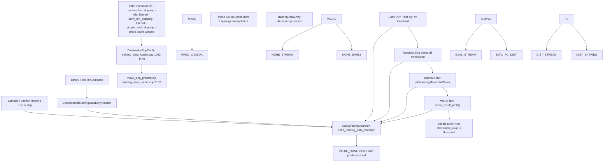
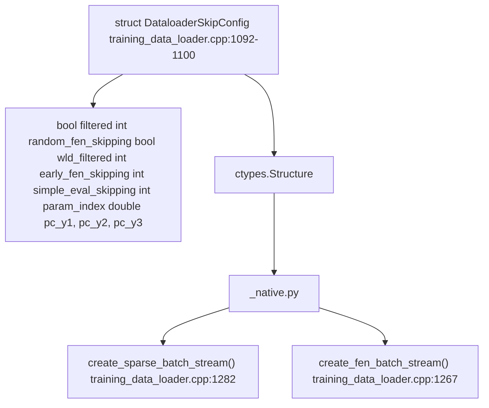
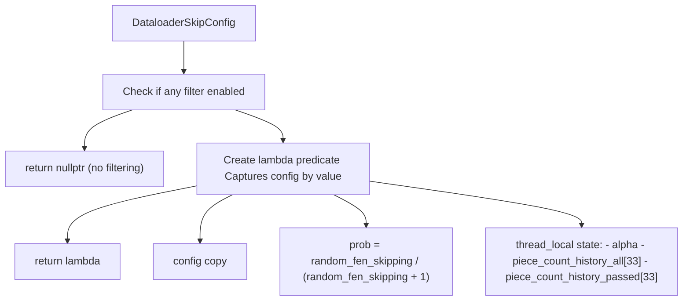
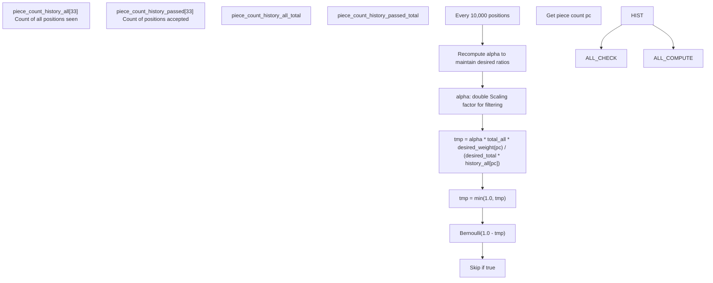

# Data Filtering and Skip Configuration

-   [lib/nnue\_training\_data\_formats.h](https://github.com/Chesszyh/nnue-pytorch/blob/024b2064/lib/nnue_training_data_formats.h)
-   [lib/nnue\_training\_data\_stream.h](https://github.com/Chesszyh/nnue-pytorch/blob/024b2064/lib/nnue_training_data_stream.h)
-   [training\_data\_loader.cpp](https://github.com/Chesszyh/nnue-pytorch/blob/024b2064/training_data_loader.cpp)

This page documents the data filtering system that controls which training positions are loaded and which are skipped during training. This system allows selective sampling of the training data to improve training quality and efficiency by filtering out low-quality positions or balancing the distribution of position types.

For information about the binary training data formats themselves, see [Training Data Formats](#3.1). For the C++ data loader architecture that executes these filters, see [C++ Data Loader Architecture](#3.2).

## Overview

The data filtering system provides fine-grained control over which positions from training files are actually used for training. During data loading, each position is evaluated against a configurable skip predicate that can reject positions based on multiple criteria. This enables:

-   **Quality filtering**: Removing tactical positions (captures/checks) that may have distorted evaluations
-   **Distribution balancing**: Controlling piece count distributions to prevent bias toward endgames or middlegames
-   **Efficiency**: Skipping positions to reduce effective dataset size or balance win/draw/loss ratios
-   **Game phase selection**: Filtering early opening positions that may be book moves

The filtering happens in the C++ data loader before positions are converted to feature vectors, minimizing computational overhead.

**System Architecture Overview:**


Sources: [training\_data\_loader.cpp1092-1227](https://github.com/Chesszyh/nnue-pytorch/blob/024b2064/training_data_loader.cpp#L1092-L1227) [lib/nnue\_training\_data\_stream.h41-59](https://github.com/Chesszyh/nnue-pytorch/blob/024b2064/lib/nnue_training_data_stream.h#L41-L59)

## DataloaderSkipConfig Structure

The filtering configuration is defined by the `DataloaderSkipConfig` structure, which is passed from Python to the C++ data loader via ctypes.

**Configuration Structure:**

| Field | Type | Purpose |
| --- | --- | --- |
| `filtered` | `bool` | Enable tactical position filtering (captures/checks) |
| `random_fen_skipping` | `int` | Random skip rate (N means skip with probability N/(N+1)) |
| `wld_filtered` | `bool` | Enable win/draw/loss probability-based filtering |
| `early_fen_skipping` | `int` | Skip positions with ply count ≤ this value |
| `simple_eval_skipping` | `int` | Skip positions with `abs(simple_eval) < threshold` |
| `param_index` | `int` | Parameter index (currently unused) |
| `pc_y1`, `pc_y2`, `pc_y3` | `double` | Lagrange interpolation weights for piece count distribution |

**Code Structure Mapping:**


Sources: [training\_data\_loader.cpp1092-1100](https://github.com/Chesszyh/nnue-pytorch/blob/024b2064/training_data_loader.cpp#L1092-L1100) [training\_data\_loader.cpp1267-1277](https://github.com/Chesszyh/nnue-pytorch/blob/024b2064/training_data_loader.cpp#L1267-L1277) [training\_data\_loader.cpp1282-1308](https://github.com/Chesszyh/nnue-pytorch/blob/024b2064/training_data_loader.cpp#L1282-L1308)

## Skip Predicate Construction

The `make_skip_predicate()` function converts a `DataloaderSkipConfig` into an executable filter function. If all filtering options are disabled, it returns `nullptr` for maximum efficiency. Otherwise, it returns a lambda function that evaluates each `TrainingDataEntry`.

**Predicate Construction Flow:**


Sources: [training\_data\_loader.cpp1102-1227](https://github.com/Chesszyh/nnue-pytorch/blob/024b2064/training_data_loader.cpp#L1102-L1227)

The predicate returns `true` to **skip** a position, `false` to **accept** it. This inversion is important to understand when reading the code.

## Filtering Methods

### VALUE\_NONE Filtering

Positions with `score == VALUE_NONE` (32002) are always skipped. This allows predetermined filtering without removing positions from the dataset, maintaining compression efficiency.

```
static constexpr int VALUE_NONE = 32002;if (e.score == VALUE_NONE)    return true;  // skip
```
Sources: [training\_data\_loader.cpp1112-1152](https://github.com/Chesszyh/nnue-pytorch/blob/024b2064/training_data_loader.cpp#L1112-L1152)

### Early Game Filtering

Filters positions from the opening phase based on ply count. This removes book moves and early positions that may not be representative of real play.

```
if (e.ply <= config.early_fen_skipping)    return true;  // skip
```
**Configuration Example:**

-   `early_fen_skipping = 5`: Skip positions from the first 5 plies

Sources: [training\_data\_loader.cpp1154-1155](https://github.com/Chesszyh/nnue-pytorch/blob/024b2064/training_data_loader.cpp#L1154-L1155)

### Random FEN Skipping

Probabilistic downsampling that randomly rejects positions. Uses a Bernoulli distribution with probability `N/(N+1)`.

```
auto do_skip = [&]() {    std::bernoulli_distribution distrib(prob);    auto& prng = rng::get_thread_local_rng();    return distrib(prng);};if (config.random_fen_skipping && do_skip())    return true;  // skip
```
**Configuration Examples:**

-   `random_fen_skipping = 0`: No random skipping
-   `random_fen_skipping = 3`: Skip 75% of positions (3/4)
-   `random_fen_skipping = 9`: Skip 90% of positions (9/10)

Sources: [training\_data\_loader.cpp1142-1146](https://github.com/Chesszyh/nnue-pytorch/blob/024b2064/training_data_loader.cpp#L1142-L1146) [training\_data\_loader.cpp1157-1158](https://github.com/Chesszyh/nnue-pytorch/blob/024b2064/training_data_loader.cpp#L1157-L1158)

### Tactical Position Filtering

Filters positions where the side to move is in check or the last move was a capture. These positions often have distorted evaluations due to tactical complications.

```
auto do_filter = [&]() {     return (e.isCapturingMove() || e.isInCheck()); };if (config.filtered && do_filter())    return true;  // skip
```
The methods `isCapturingMove()` and `isInCheck()` are defined on `TrainingDataEntry` in the binary format definitions.

Sources: [training\_data\_loader.cpp1148-1149](https://github.com/Chesszyh/nnue-pytorch/blob/024b2064/training_data_loader.cpp#L1148-L1149) [training\_data\_loader.cpp1160-1161](https://github.com/Chesszyh/nnue-pytorch/blob/024b2064/training_data_loader.cpp#L1160-L1161)

### WLD (Win/Loss/Draw) Filtering

Filters positions based on the correlation between their static evaluation score and game result. Positions where the score doesn't match the result well are rejected. This uses `score_result_prob()` which measures agreement between the evaluation and the actual game outcome.

```
auto do_wld_skip = [&]() {    std::bernoulli_distribution distrib(1.0 - e.score_result_prob());    auto& prng = rng::get_thread_local_rng();    return distrib(prng);};if (config.wld_filtered && do_wld_skip())    return true;  // skip
```
Higher `score_result_prob()` means the position evaluation aligns well with the game outcome, making it more likely to be kept.

Sources: [training\_data\_loader.cpp1136-1140](https://github.com/Chesszyh/nnue-pytorch/blob/024b2064/training_data_loader.cpp#L1136-L1140) [training\_data\_loader.cpp1163-1164](https://github.com/Chesszyh/nnue-pytorch/blob/024b2064/training_data_loader.cpp#L1163-L1164)

### Simple Eval Filtering

Filters quiet positions where the static evaluation (material + simple positional factors) is below a threshold. This can help focus training on more complex positions.

```
if (config.simple_eval_skipping > 0    && std::abs(e.pos.simple_eval()) < config.simple_eval_skipping)    return true;  // skip
```
Sources: [training\_data\_loader.cpp1166-1168](https://github.com/Chesszyh/nnue-pytorch/blob/024b2064/training_data_loader.cpp#L1166-L1168)

## Piece Count Distribution Control

The most sophisticated filter balances the distribution of piece counts across the training data. Without this, datasets tend to be biased toward endgames (fewer pieces) because games naturally progress from opening to endgame.

### Lagrange Interpolation for Desired Distribution

The desired relative frequency for positions with a given piece count is defined by Lagrange interpolation through three control points:

```
auto desired_piece_count_weights = <FileRef file-url="https://github.com/Chesszyh/nnue-pytorch/blob/024b2064/&config" undefined  file-path="&config">Hii</FileRef> -> double {    double x  = pc;    double x1 = 0,  y1 = config.pc_y1;    double x2 = 16, y2 = config.pc_y2;    double x3 = 32, y3 = config.pc_y3;    double l1 = (x - x2) * (x - x3) / ((x1 - x2) * (x1 - x3));    double l2 = (x - x1) * (x - x3) / ((x2 - x1) * (x2 - x3));    double l3 = (x - x1) * (x - x2) / ((x3 - x1) * (x3 - x2));    return l1 * y1 + l2 * y2 + l3 * y3;};
```
**Control Points:**

-   `(0, pc_y1)`: Weight for empty board (0 pieces)
-   `(16, pc_y2)`: Weight for middlegame (16 pieces)
-   `(32, pc_y3)`: Weight for starting position (32 pieces)

**Example Configurations:**

| Configuration | Effect |
| --- | --- |
| `pc_y1=0.5, pc_y2=1.0, pc_y3=0.5` | Prefer middlegame positions |
| `pc_y1=1.0, pc_y2=1.0, pc_y3=1.0` | Uniform distribution |
| `pc_y1=0.0, pc_y2=2.0, pc_y3=1.0` | Heavily favor middlegame, reduce endgames |

Sources: [training\_data\_loader.cpp1115-1124](https://github.com/Chesszyh/nnue-pytorch/blob/024b2064/training_data_loader.cpp#L1115-L1124)

### Adaptive Filtering Algorithm

The system maintains thread-local statistics and adaptively adjusts filtering probabilities to achieve the desired distribution:

**State Tracking:**


**Algorithm Steps:**

1.  **Track Statistics**: For each piece count, maintain counts of positions seen and accepted
2.  **Compute Target**: Calculate desired ratio based on Lagrange weights
3.  **Adaptive Scaling**: Every 10,000 positions, recompute `alpha` to keep skip rates bounded
4.  **Filter Decision**: Accept position with probability based on current vs. desired distribution

**Maximum Skipping Rate:**

```
static constexpr double max_skipping_rate = 10.0;
```
This ensures no piece count bin is filtered at more than 90% rejection rate, preventing complete elimination of any piece count range.

Sources: [training\_data\_loader.cpp1126-1222](https://github.com/Chesszyh/nnue-pytorch/blob/024b2064/training_data_loader.cpp#L1126-L1222)

### Implementation Details

The filtering probability for a position with piece count `pc` is:

```
probability_keep = min(1.0, alpha * N_total * weight(pc) / (W_total * N_pc))
```
Where:

-   `N_total`: Total positions processed
-   `N_pc`: Positions with piece count `pc` processed
-   `weight(pc)`: Desired weight from Lagrange interpolation
-   `W_total`: Sum of all Lagrange weights
-   `alpha`: Adaptive scaling factor

The `alpha` factor is recomputed every 10,000 positions to ensure the maximum skip rate constraint is satisfied across all piece count bins.

Sources: [training\_data\_loader.cpp1211-1217](https://github.com/Chesszyh/nnue-pytorch/blob/024b2064/training_data_loader.cpp#L1211-L1217)

## Integration with Data Pipeline

The skip predicate is integrated at the stream level, before feature extraction or batch creation.

**Integration Points:**

```mermaid
flowchart TD
    DATASET["SparseBatchDataset"]
    PROVIDER["SparseBatchProvider"]
    CREATE_STREAM["create_sparse_batch_stream() training_data_loader.cpp:1282"]
    CREATE_FEN["create_fen_batch_stream() training_data_loader.cpp:1267"]
    CONFIG_PARAM["DataloaderSkipConfig config"]
    MAKE_PRED["make_skip_predicate(config) training_data_loader.cpp:1102"]
    PREDICATE["std::function"]
    OPEN_PARALLEL["open_sfen_input_file_parallel() nnue_training_data_stream.h:246"]
    BINPACK_STREAM["BinpackSfenInputParallelStream"]
    BIN_STREAM["BinSfenInputStream"]
    READER["CompressedTrainingDataEntryParallelReader"]
    FILTER["Apply skipPredicate"]
    ENTRIES["TrainingDataEntry (filtered)"]

    DATASET --> PROVIDER
    PROVIDER --> CREATE_STREAM
    PROVIDER --> CREATE_FEN
    CREATE --> STREAM_CONFIG_PARAM
    CREATE --> FEN_CONFIG_PARAM
    CONFIG --> PARAM_MAKE_PRED
    MAKE --> PRED_PREDICATE
    PREDICATE --> OPEN_PARALLEL
    OPEN --> PARALLEL_BINPACK_STREAM
    OPEN --> PARALLEL_BIN_STREAM
    BINPACK --> STREAM_READER
    BIN --> STREAM_READER
    READER --> FILTER
    FILTER --> ENTRIES
```


Sources: [training\_data\_loader.cpp1267-1308](https://github.com/Chesszyh/nnue-pytorch/blob/024b2064/training_data_loader.cpp#L1267-L1308) [lib/nnue\_training\_data\_stream.h246-255](https://github.com/Chesszyh/nnue-pytorch/blob/024b2064/lib/nnue_training_data_stream.h#L246-L255)

### Stream Types and Filtering

**BinSfenInputStream** (single-threaded):

```
BinSfenInputStream(std::string filename, bool cyclic,                    std::function<bool(const TrainingDataEntry&)> skipPredicate)
```
The predicate is applied in the `next()` method:

```
if (!m_skipPredicate || !m_skipPredicate(entry))    return entry;
```
**BinpackSfenInputParallelStream** (multi-threaded):

```
BinpackSfenInputParallelStream(int concurrency,                                const std::vector<std::string>& filenames,                               bool cyclic,                                std::function<bool(const TrainingDataEntry&)> skipPredicate)
```
The predicate is passed to the parallel reader which applies it during decompression, distributing the filtering work across threads.

Sources: [lib/nnue\_training\_data\_stream.h61-121](https://github.com/Chesszyh/nnue-pytorch/blob/024b2064/lib/nnue_training_data_stream.h#L61-L121) [lib/nnue\_training\_data\_stream.h183-234](https://github.com/Chesszyh/nnue-pytorch/blob/024b2064/lib/nnue_training_data_stream.h#L183-L234)

## Practical Examples

### Typical Training Configuration

From the benchmark code in the data loader:

```
const DataloaderSkipConfig config = {    .filtered             = true,   // Skip captures/checks    .random_fen_skipping  = 3,      // Keep 1/4 of positions    .wld_filtered         = true,   // WLD filtering enabled    .early_fen_skipping   = 5,      // Skip first 5 plies    .simple_eval_skipping = 0,      // No simple eval filtering    .param_index          = 0,    .pc_y1                = 1.0,    // Piece count distribution    .pc_y2                = 2.0,    // Prefer middlegame    .pc_y3                = 1.0};
```
This configuration:

-   Removes tactical positions
-   Reduces dataset to 25% of original size
-   Filters by WLD correlation
-   Skips opening book moves
-   Prefers middlegame positions (16 pieces) 2:1 over starting/endgame

Sources: [training\_data\_loader.cpp1366-1374](https://github.com/Chesszyh/nnue-pytorch/blob/024b2064/training_data_loader.cpp#L1366-L1374)

### No Filtering Configuration

To disable all filtering:

```
const DataloaderSkipConfig config = {    .filtered             = false,    .random_fen_skipping  = 0,    .wld_filtered         = false,    .early_fen_skipping   = 0,    .simple_eval_skipping = 0,    .param_index          = 0,    .pc_y1                = 1.0,    .pc_y2                = 1.0,    .pc_y3                = 1.0};
```
This returns `nullptr` from `make_skip_predicate()`, bypassing all filtering overhead.

Sources: [training\_data\_loader.cpp1102-1227](https://github.com/Chesszyh/nnue-pytorch/blob/024b2064/training_data_loader.cpp#L1102-L1227)

## Performance Considerations

### Thread-Local State

Each filtering thread maintains its own statistics (`piece_count_history_all`, `piece_count_history_passed`, `alpha`). This avoids synchronization overhead but means the piece count distribution is balanced per-thread rather than globally. For multi-threaded readers, this is acceptable because each thread processes a large number of positions.

### Filtering Overhead

The filtering happens during binary deserialization, before the expensive feature extraction step. Rejected positions never get converted to sparse feature vectors, saving significant computation. The predicate evaluation is dominated by:

1.  Piece count computation: O(1) using `piecesBB().count()`
2.  Random number generation: Fast thread-local PRNG
3.  Statistics updates: Simple array indexing

Sources: [training\_data\_loader.cpp1126-1220](https://github.com/Chesszyh/nnue-pytorch/blob/024b2064/training_data_loader.cpp#L1126-L1220)

### Debug Output

Debug printing can be enabled to monitor filtering behavior:

```
constexpr bool do_debug_print = false;if (do_debug_print) {    if (uint64_t(piece_count_history_all_total) % 10000 == 0) {        std::cout << "Total : " << piece_count_history_all_total << '\n';        std::cout << "Passed: " << piece_count_history_passed_total << '\n';        for (int i = 0; i < 33; ++i)            std::cout << i << ' ' << piece_count_history_passed[i] << '\n';    }}
```
This shows the acceptance rate per piece count every 10,000 positions.

Sources: [training\_data\_loader.cpp1170-1180](https://github.com/Chesszyh/nnue-pytorch/blob/024b2064/training_data_loader.cpp#L1170-L1180)
