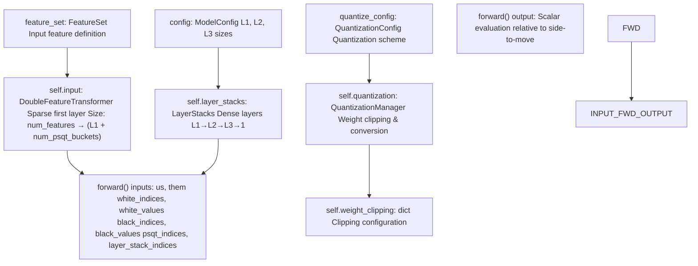
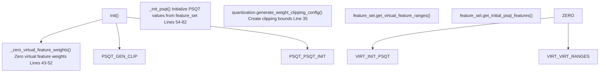
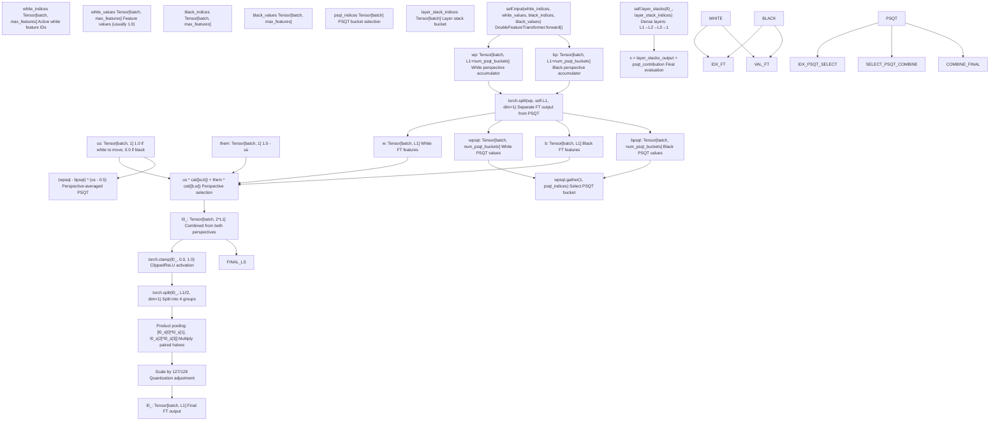
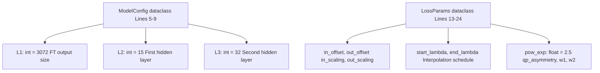
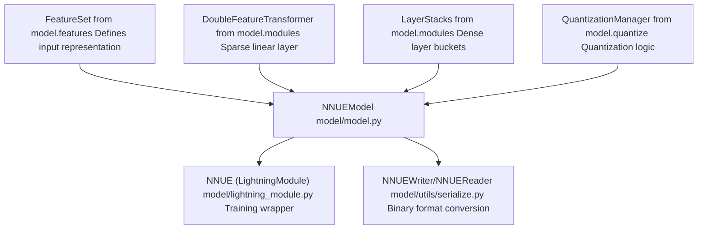
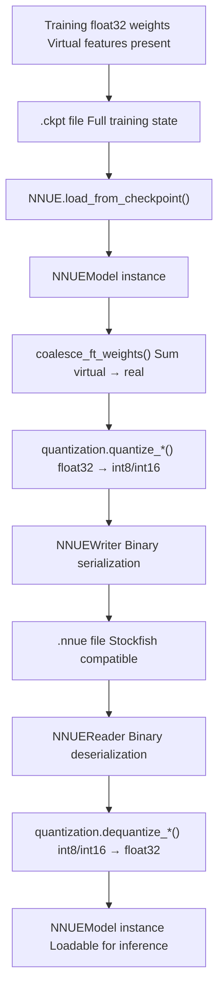
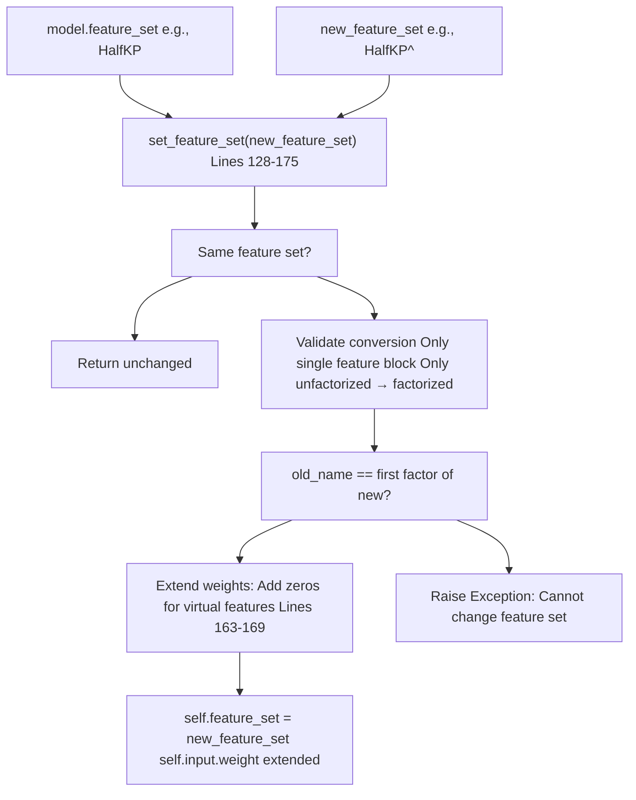

# Model Architecture

-   [data\_loader/\_\_init\_\_.py](https://github.com/Chesszyh/nnue-pytorch/blob/024b2064/data_loader/__init__.py)
-   [data\_loader/\_native.py](https://github.com/Chesszyh/nnue-pytorch/blob/024b2064/data_loader/_native.py)
-   [data\_loader/config.py](https://github.com/Chesszyh/nnue-pytorch/blob/024b2064/data_loader/config.py)
-   [docs/img/SFNNv4\_architecture.drawio](https://github.com/Chesszyh/nnue-pytorch/blob/024b2064/docs/img/SFNNv4_architecture.drawio)
-   [docs/nnue.md](https://github.com/Chesszyh/nnue-pytorch/blob/024b2064/docs/nnue.md)
-   [model/config.py](https://github.com/Chesszyh/nnue-pytorch/blob/024b2064/model/config.py)
-   [model/lightning\_module.py](https://github.com/Chesszyh/nnue-pytorch/blob/024b2064/model/lightning_module.py)
-   [model/model.py](https://github.com/Chesszyh/nnue-pytorch/blob/024b2064/model/model.py)
-   [model/utils/coalesce\_weights.py](https://github.com/Chesszyh/nnue-pytorch/blob/024b2064/model/utils/coalesce_weights.py)
-   [model/utils/serialize.py](https://github.com/Chesszyh/nnue-pytorch/blob/024b2064/model/utils/serialize.py)

This page provides comprehensive documentation of the `NNUEModel` architecture, explaining how components fit together to create an efficiently evaluable chess position evaluator. It covers the overall model structure, data flow, and component interactions at a high level.

For detailed information about specific subsystems, see:

-   Network layer structure and computation flow: [NNUE Network Structure](#4.1)
-   Feature engineering and input representations: [Feature Sets](#4.2)
-   First layer sparse computation: [Feature Transformer](#4.3)
-   Dense layer architecture: [Layer Stacks and Dense Layers](#4.4)
-   Integer quantization scheme: [Quantization System](#4.5)
-   Training acceleration via factorization: [Virtual Features and Factorization](#4.6)

## NNUE Design Principles

NNUE (ƎUИИ - Efficiently Updatable Neural Network) is a neural network architecture optimized for chess position evaluation that operates on three core principles:

1.  **Sparse Inputs**: The network maintains a relatively low number of non-zero inputs (typically ~0.1% sparsity for large networks), enabling large first layers while maintaining performance.

2.  **Incremental Updates**: Input features change minimally between positions, allowing efficient accumulator updates instead of full recomputation.

3.  **Integer Quantization**: The network is designed for low-precision integer inference (int8/int16), enabling maximum CPU performance through SIMD operations.

These principles enable NNUE networks to achieve millions of evaluations per second per thread, which is critical for chess engine search performance.

**Sources:** [docs/nnue.md144-164](https://github.com/Chesszyh/nnue-pytorch/blob/024b2064/docs/nnue.md#L144-L164)

## NNUEModel Class Structure

The `NNUEModel` class in [model/model.py10-209](https://github.com/Chesszyh/nnue-pytorch/blob/024b2064/model/model.py#L10-L209) serves as the primary neural network implementation. It orchestrates all model components and defines the complete forward pass computation.

**Key Components:**

| Component | Type | Purpose | Size/Config |
| --- | --- | --- | --- |
| `self.input` | `DoubleFeatureTransformer` | First layer with sparse inputs, handles both perspectives | `num_features → (L1 + num_psqt_buckets)` |
| `self.feature_set` | `FeatureSet` | Defines input feature representation | Typically HalfKAv2\_hm: ~45K features |
| `self.layer_stacks` | `LayerStacks` | Dense layers after feature transformer | L1→L2→L3→1 with bucketing |
| `self.quantization` | `QuantizationManager` | Manages quantization scheme | int16 for FT, int8 for FC layers |
| `self.num_psqt_buckets` | `int` | Number of PSQT output buckets | Default: 8 |
| `self.num_ls_buckets` | `int` | Number of layer stack buckets | Default: 8 |

**Sources:** [model/model.py10-38](https://github.com/Chesszyh/nnue-pytorch/blob/024b2064/model/model.py#L10-L38) [model/config.py1-25](https://github.com/Chesszyh/nnue-pytorch/blob/024b2064/model/config.py#L1-L25)

## Model Initialization and Weight Setup

The model performs specialized initialization to support NNUE training requirements:

**Virtual Feature Initialization:** Virtual features are used during training to accelerate learning of correlated real features. The model zeros their weights at initialization [model/model.py43-52](https://github.com/Chesszyh/nnue-pytorch/blob/024b2064/model/model.py#L43-L52) because they only serve as training aids and will be coalesced back into real features during serialization (see [Virtual Features and Factorization](#4.6)).

**PSQT Initialization:** The PSQT (Piece-Square Table) outputs are initialized with traditional chess piece-square values from the feature set [model/model.py54-82](https://github.com/Chesszyh/nnue-pytorch/blob/024b2064/model/model.py#L54-L82) These values are scaled by `1 / quantization.nnue2score` to match the network's output scale. The bias is set to zero as it cancels during perspective averaging.

**Sources:** [model/model.py39-82](https://github.com/Chesszyh/nnue-pytorch/blob/024b2064/model/model.py#L39-L82)

## Forward Pass Data Flow

The forward pass transforms sparse feature indices into a final evaluation score through a multi-stage pipeline:

**Forward Pass Implementation:** [model/model.py177-208](https://github.com/Chesszyh/nnue-pytorch/blob/024b2064/model/model.py#L177-L208)

**Key Stages:**

1.  **Feature Transformer** [line 188](https://github.com/Chesszyh/nnue-pytorch/blob/024b2064/line 188): Processes sparse indices through `DoubleFeatureTransformer`, producing two perspective accumulators.

2.  **Split and Perspective Combination** [lines 189-192](https://github.com/Chesszyh/nnue-pytorch/blob/024b2064/lines 189-192): Separates feature transformer outputs from PSQT values, then combines perspectives based on side-to-move. The formula `us * cat([w,b]) + them * cat([b,w])` selects white's perspective first when white to move, black's first when black to move.

3.  **Product Pooling** [lines 194-198](https://github.com/Chesszyh/nnue-pytorch/blob/024b2064/lines 194-198): Splits the L1 neurons into 4 groups and applies element-wise multiplication to pairs, reducing dimensionality while adding non-linearity. The `127/128` scaling compensates for quantization where `1.0` is represented as `127`.

4.  **Layer Stacks** [line 206](https://github.com/Chesszyh/nnue-pytorch/blob/024b2064/line 206): Dense layers process the pooled features through bucketed layer stacks (see [Layer Stacks and Dense Layers](#4.4)).

5.  **PSQT Integration** [lines 200-206](https://github.com/Chesszyh/nnue-pytorch/blob/024b2064/lines 200-206): PSQT values are bucketed by position characteristics, selected via `psqt_indices`, and averaged over perspectives with the formula `(wpsqt - bpsqt) * (us - 0.5)`.

**Sources:** [model/model.py177-208](https://github.com/Chesszyh/nnue-pytorch/blob/024b2064/model/model.py#L177-L208) [docs/nnue.md525-559](https://github.com/Chesszyh/nnue-pytorch/blob/024b2064/docs/nnue.md#L525-L559)

## Weight Clipping for Quantization Compatibility

The model maintains weight bounds compatible with the target quantization scheme during training:

```mermaid
flowchart TD
    WC_GEN["quantization.generate_weight_clipping_config(model) Creates clipping configuration Returns list of parameter groups"]
    WC_STORE["self.weight_clipping List[dict] Each dict contains params, min_weight, max_weight"]
    WC_CALL["clip_weights() Called by WeightClippingCallback After each optimizer step"]
    WC_ITER["For each group in weight_clipping:"]
    WC_PARAMS["For each parameter in group['params']:"]
    WC_CHECK["Check for 'virtual_params' Special handling for factorized features"]
    WC_CLAMP["p.data.clamp_(min_weight, max_weight) In-place clipping"]
    VIRTUAL["Virtual feature handling: Adjust bounds by virtual layer values Lines 96-111"]
    THREAT["Full_Threats feature set: clip_threat_weights() int8 range for threat features Lines 119-126"]

    WC --> GEN_WC_STORE
    WC --> CALL_WC_ITER
    WC --> ITER_WC_PARAMS
    WC --> PARAMS_WC_CHECK
    WC --> CHECK_WC_CLAMP
    WC --> CHECK_VIRTUAL
```

The `clip_weights()` method [model/model.py84-117](https://github.com/Chesszyh/nnue-pytorch/blob/024b2064/model/model.py#L84-L117) ensures all weights remain within quantization-compatible ranges. For example:

-   Feature transformer weights: `-127/255` to `127/255` for int16 quantization
-   Fully connected layer weights: int8-compatible ranges

Virtual features require special handling [lines 96-111](https://github.com/Chesszyh/nnue-pytorch/blob/024b2064/lines 96-111) where bounds are adjusted by subtracting the virtual parameter tensor to account for their coalesced contribution.

**Sources:** [model/model.py84-127](https://github.com/Chesszyh/nnue-pytorch/blob/024b2064/model/model.py#L84-L127)

## Model Configuration Classes

**ModelConfig** [model/config.py5-9](https://github.com/Chesszyh/nnue-pytorch/blob/024b2064/model/config.py#L5-L9) defines the network layer sizes:

-   `L1`: Feature transformer output size (default 3072), determines the size of the accumulator and number of neurons in the first sparse layer
-   `L2`: First dense hidden layer size (default 15)
-   `L3`: Second dense hidden layer size (default 32)
-   Output layer is always size 1 (scalar evaluation)

**LossParams** [model/config.py13-24](https://github.com/Chesszyh/nnue-pytorch/blob/024b2064/model/config.py#L13-L24) controls the loss function computation (see [Loss Functions and Training Configuration](#2.3) for details).

**Sources:** [model/config.py1-25](https://github.com/Chesszyh/nnue-pytorch/blob/024b2064/model/config.py#L1-L25)

## Component Relationships

**NNUEModel** serves as the central integration point:

-   **Feature Sets** [model/features](https://github.com/Chesszyh/nnue-pytorch/blob/024b2064/model/features): Provide `num_features`, `hash`, `get_virtual_feature_ranges()`, `get_initial_psqt_features()`, and feature index generation logic
-   **DoubleFeatureTransformer** [model/modules](https://github.com/Chesszyh/nnue-pytorch/blob/024b2064/model/modules): Implements the sparse first layer with custom CUDA kernels for efficient sparse matrix operations
-   **LayerStacks** [model/modules](https://github.com/Chesszyh/nnue-pytorch/blob/024b2064/model/modules): Manages bucketed dense layers with factorized linear transformations
-   **QuantizationManager** [model/quantize](https://github.com/Chesszyh/nnue-pytorch/blob/024b2064/model/quantize): Converts float32 weights to int8/int16 and provides `nnue2score` scaling constant

The model is wrapped by:

-   **NNUE (Lightning Module)** [model/lightning\_module.py16-162](https://github.com/Chesszyh/nnue-pytorch/blob/024b2064/model/lightning_module.py#L16-L162): Adds training loop, optimizer configuration, and loss calculation
-   **NNUEWriter/NNUEReader** [model/utils/serialize.py69-360](https://github.com/Chesszyh/nnue-pytorch/blob/024b2064/model/utils/serialize.py#L69-L360): Serializes to/from binary `.nnue` format for Stockfish deployment

**Sources:** [model/model.py1-8](https://github.com/Chesszyh/nnue-pytorch/blob/024b2064/model/model.py#L1-L8) [model/lightning\_module.py1-14](https://github.com/Chesszyh/nnue-pytorch/blob/024b2064/model/lightning_module.py#L1-L14) [model/utils/serialize.py1-18](https://github.com/Chesszyh/nnue-pytorch/blob/024b2064/model/utils/serialize.py#L1-L18)

## Feature Set Integration

```mermaid
flowchart TD
    NUM["feature_set.num_features Used for input layer size"]
    HASH["feature_set.hash Used in .nnue file header"]
    VIRT_RANGES["feature_set.get_virtual_feature_ranges() Returns [(start, end), ...] For zeroing virtual weights"]
    PSQT_INIT["feature_set.get_initial_psqt_features() Returns list of floats Traditional PSQ values"]
    NUM_REAL["feature_set.num_real_features Used during weight coalescing"]
    V2R["feature_set.get_virtual_to_real_features_gather_indices() Mapping for coalescing"]
    INIT["init() Creates DoubleFeatureTransformer with num_features"]
    ZERO["_zero_virtual_feature_weights() Uses get_virtual_feature_ranges()"]
    INIT_PSQT["_init_psqt() Uses get_initial_psqt_features()"]
    COALESCE["coalesce_ft_weights() model/utils/coalesce_weights.py Uses num_real_features and mapping"]

    NUM --> INIT
    VIRT --> RANGES_ZERO
    PSQT --> INIT_INIT_PSQT
    NUM --> REAL_COALESCE
    V2R --> COALESCE
```

The feature set abstraction allows the model to work with different input representations (HalfKP, HalfKA, HalfKAv2\_hm, etc.) without changing the core model code. See [Feature Sets](#4.2) for available feature blocks and their characteristics.

**Sources:** [model/model.py28-52](https://github.com/Chesszyh/nnue-pytorch/blob/024b2064/model/model.py#L28-L52) [model/utils/coalesce\_weights.py7-19](https://github.com/Chesszyh/nnue-pytorch/blob/024b2064/model/utils/coalesce_weights.py#L7-L19)

## Model Persistence and Conversion

The model supports multiple serialization formats:

| Format | Type | Purpose | Tools |
| --- | --- | --- | --- |
| `.ckpt` | PyTorch Lightning checkpoint | Training state, full float32 | Automatic during training |
| `.pt` | PyTorch state dict | Model weights only, float32 | `serialize.py` conversion |
| `.nnue` | Binary quantized format | Stockfish deployment, int8/int16 | `serialize.py` conversion |

**Weight Coalescing:** Virtual features must be coalesced before serialization [model/utils/coalesce\_weights.py7-19](https://github.com/Chesszyh/nnue-pytorch/blob/024b2064/model/utils/coalesce_weights.py#L7-L19) The `coalesce_ft_weights()` function sums virtual feature weights back into their corresponding real features using the mapping from `feature_set.get_virtual_to_real_features_gather_indices()`.

**Quantization:** The `QuantizationManager` [model/quantize](https://github.com/Chesszyh/nnue-pytorch/blob/024b2064/model/quantize) converts between float32 training weights and int8/int16 inference weights while maintaining accuracy. See [Quantization System](#4.5) for details.

**Binary Format:** `NNUEWriter` [model/utils/serialize.py69-217](https://github.com/Chesszyh/nnue-pytorch/blob/024b2064/model/utils/serialize.py#L69-L217) writes the binary `.nnue` format with version header, feature transformer weights (int16), and fully connected layer weights (int8). Optional LEB128 compression reduces file size. See [NNUE Binary Format](#5.2) for format specification.

**Sources:** [model/utils/serialize.py69-360](https://github.com/Chesszyh/nnue-pytorch/blob/024b2064/model/utils/serialize.py#L69-L360) [model/utils/coalesce\_weights.py7-33](https://github.com/Chesszyh/nnue-pytorch/blob/024b2064/model/utils/coalesce_weights.py#L7-L33)

## Dynamic Feature Set Conversion

The model supports limited runtime conversion between feature sets:

The `set_feature_set()` method [model/model.py128-175](https://github.com/Chesszyh/nnue-pytorch/blob/024b2064/model/model.py#L128-L175) allows converting from an unfactorized feature set (e.g., `HalfKP`) to its factorized version (e.g., `HalfKP^`) by zero-padding the weight matrix for virtual features. This enables:

1.  Training with a base feature set initially
2.  Switching to factorized features mid-training for acceleration

The method only supports this specific conversion pattern due to implementation complexity of more general conversions.

**Sources:** [model/model.py128-175](https://github.com/Chesszyh/nnue-pytorch/blob/024b2064/model/model.py#L128-L175)

## Summary

The `NNUEModel` class provides a complete NNUE chess evaluation network with:

-   **Sparse Input Processing**: `DoubleFeatureTransformer` handles ~0.1% sparse inputs efficiently
-   **Dual Perspective Architecture**: Separate accumulators for white and black viewpoints
-   **Product Pooling**: Non-linear dimensionality reduction after feature transformer
-   **Bucketed Layer Stacks**: Position-adaptive dense layers via PSQT and layer stack bucketing
-   **Quantization Integration**: Weight clipping and scaling for int8/int16 deployment
-   **Virtual Feature Support**: Factorization accelerates training of correlated features
-   **Flexible Serialization**: Multiple formats for training, inference, and deployment

The architecture balances accuracy and inference speed, achieving millions of evaluations per second while maintaining strong playing strength. The modular design separates concerns across feature sets, layer implementations, and quantization logic.

**Sources:** [model/model.py1-209](https://github.com/Chesszyh/nnue-pytorch/blob/024b2064/model/model.py#L1-L209) [docs/nnue.md144-347](https://github.com/Chesszyh/nnue-pytorch/blob/024b2064/docs/nnue.md#L144-L347)
