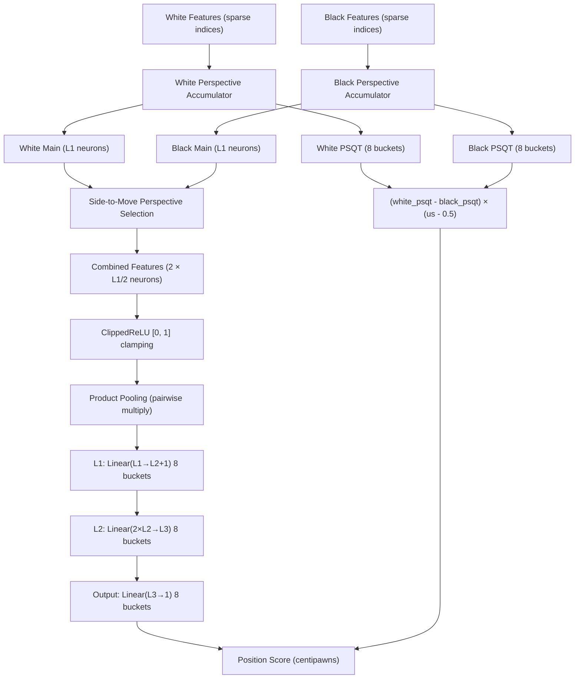
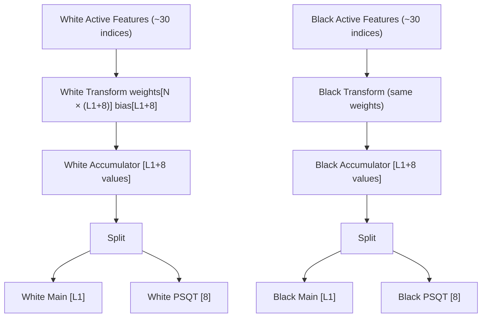
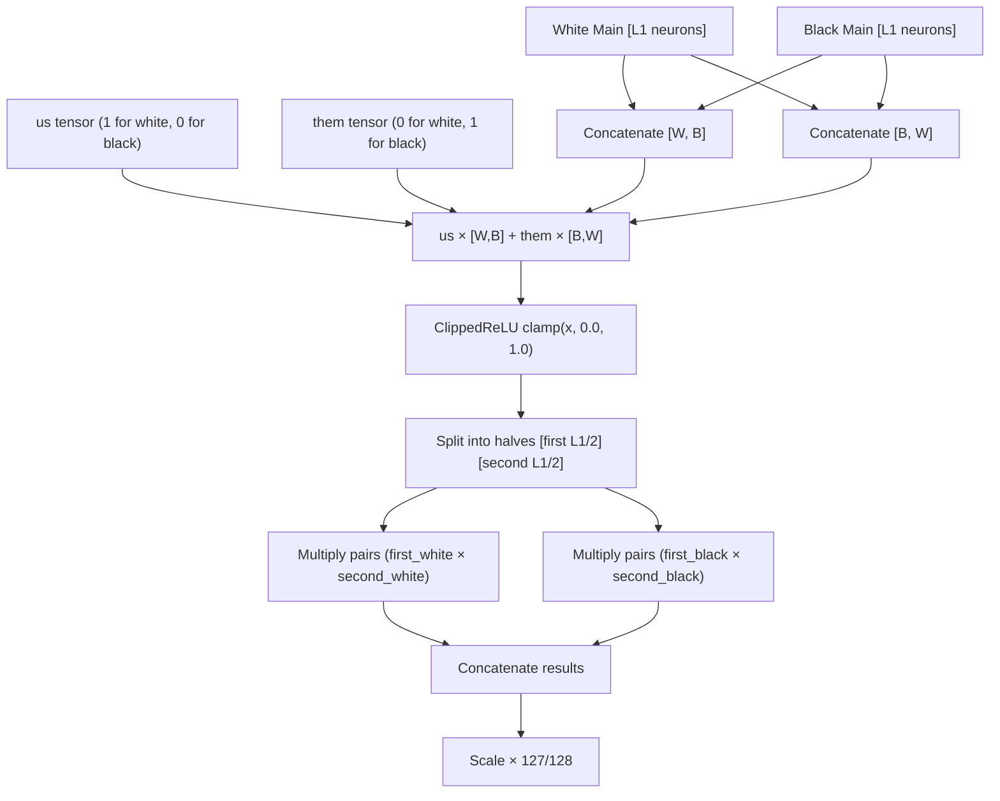
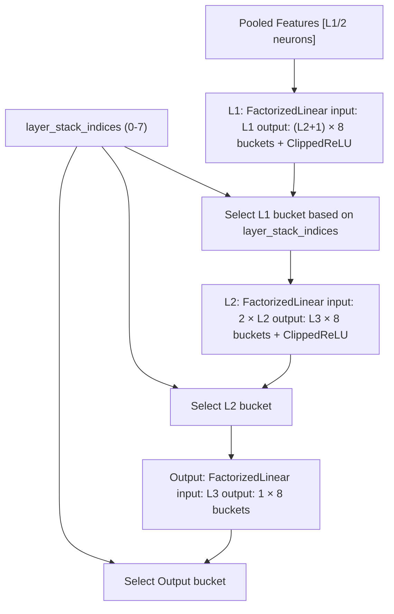
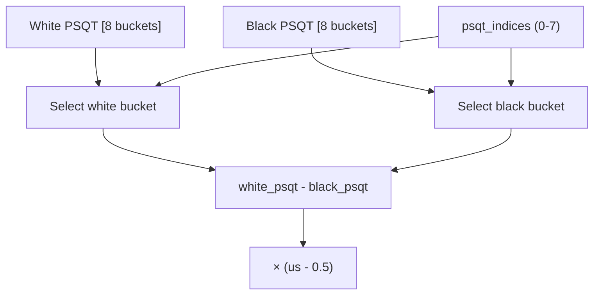
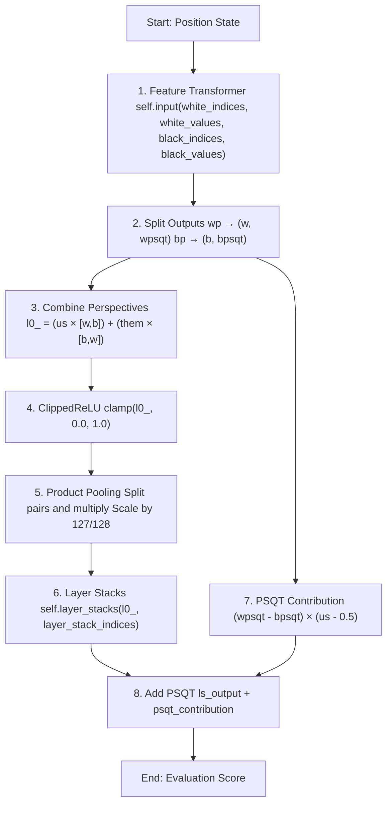
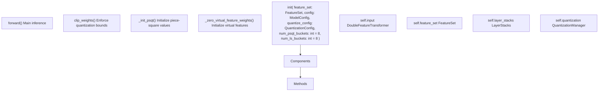
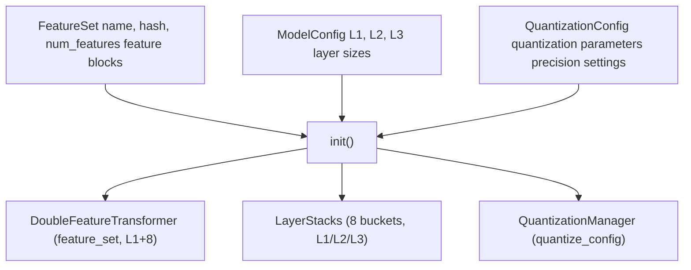

# NNUE Network Structure

-   [docs/img/SFNNv4\_architecture.drawio](https://github.com/Chesszyh/nnue-pytorch/blob/024b2064/docs/img/SFNNv4_architecture.drawio)
-   [docs/nnue.md](https://github.com/Chesszyh/nnue-pytorch/blob/024b2064/docs/nnue.md)
-   [model/model.py](https://github.com/Chesszyh/nnue-pytorch/blob/024b2064/model/model.py)
-   [model/utils/coalesce\_weights.py](https://github.com/Chesszyh/nnue-pytorch/blob/024b2064/model/utils/coalesce_weights.py)
-   [model/utils/serialize.py](https://github.com/Chesszyh/nnue-pytorch/blob/024b2064/model/utils/serialize.py)

## Purpose and Scope

This page provides a high-level overview of the NNUE network architecture implemented in this repository, explaining how the major components (feature transformer, layer stacks, and PSQT values) fit together to produce a chess position evaluation. For details on specific feature sets like HalfKP or HalfKA, see [Feature Sets](#4.2). For implementation details of the feature transformer, see [Feature Transformer](#4.3). For layer stack internals, see [Layer Stacks and Dense Layers](#4.4).

## Architecture Overview

The NNUE network consists of three main components that work together to evaluate a chess position:


**Sources:** [model/model.py177-208](https://github.com/Chesszyh/nnue-pytorch/blob/024b2064/model/model.py#L177-L208) [docs/nnue.md263-346](https://github.com/Chesszyh/nnue-pytorch/blob/024b2064/docs/nnue.md#L263-L346)

## Network Components

### Feature Transformer

The feature transformer is the first and largest layer of the network. It converts sparse input features (piece positions) into a dense vector representation called an **accumulator**.

| Property | Value | Description |
| --- | --- | --- |
| Class | `DoubleFeatureTransformer` | Maintains separate accumulators for white and black perspectives |
| Input Size | `feature_set.num_features` | Typically 40k-100k sparse features |
| Output Size | `L1 + num_psqt_buckets` | Dense vector (e.g., 1024 + 8 = 1032) |
| Perspectives | 2 | One for white, one for black |
| Update Strategy | Incremental | Only changed features updated per move |

The feature transformer produces two outputs per perspective:

-   **Main features**: `L1` neurons used for the neural network path
-   **PSQT features**: `num_psqt_buckets` neurons (typically 8) used for piece-square evaluation


**Key Implementation Details:**

-   The transform uses sparse linear operations for efficiency [model/modules/\_\_init\_\_.py](https://github.com/Chesszyh/nnue-pytorch/blob/024b2064/model/modules/__init__.py)
-   Virtual features (if used) are initialized to zero and coalesced during serialization [model/model.py43-52](https://github.com/Chesszyh/nnue-pytorch/blob/024b2064/model/model.py#L43-L52)
-   The same weights can be used for both perspectives (with board orientation) or separate weights

**Sources:** [model/model.py28-30](https://github.com/Chesszyh/nnue-pytorch/blob/024b2064/model/model.py#L28-L30) [model/modules/\_\_init\_\_.py](https://github.com/Chesszyh/nnue-pytorch/blob/024b2064/model/modules/__init__.py) [docs/nnue.md287-347](https://github.com/Chesszyh/nnue-pytorch/blob/024b2064/docs/nnue.md#L287-L347)

### Perspective Combination and Activation

After the feature transformer, the network combines the two perspective accumulators based on whose turn it is to move:


**Code Reference:** [model/model.py191-198](https://github.com/Chesszyh/nnue-pytorch/blob/024b2064/model/model.py#L191-L198)

The formula for perspective combination is:

```
l0_ = (us * cat([w, b], dim=1)) + (them * cat([b, w], dim=1))
```
Where:

-   `us` is 1 for the side to move, 0 otherwise
-   `them` is the opposite: 0 for side to move, 1 otherwise
-   This ensures the side-to-move perspective comes first

The **product pooling** step multiplies pairs of neurons together, reducing dimensionality while adding non-linearity. The scaling by 127/128 accounts for the quantized representation where 1.0 is represented by 127 rather than 128.

**Sources:** [model/model.py191-198](https://github.com/Chesszyh/nnue-pytorch/blob/024b2064/model/model.py#L191-L198) [docs/nnue.md241](https://github.com/Chesszyh/nnue-pytorch/blob/024b2064/docs/nnue.md#L241-L241)

### Layer Stacks

The layer stacks process the activated features through multiple fully-connected layers with bucketing:


**Bucketing Strategy:**

The network uses 8 buckets to specialize evaluation based on game phase and material:

| Bucket Index | Typical Use Case |
| --- | --- |
| 0-7 | Selected based on material count or game phase heuristics |

Each bucket has its own set of weights, allowing the network to learn different evaluation strategies for different types of positions.

**Layer Details:**

1.  **L1 Layer**: Maps `L1` inputs to `L2 + 1` outputs (the +1 is used internally for some architectures)
2.  **L2 Layer**: Maps `2 × L2` inputs (doubled due to ClippedReLU keeping both positive and clamped values) to `L3` outputs
3.  **Output Layer**: Maps `L3` inputs to a single scalar output

**Sources:** [model/model.py32](https://github.com/Chesszyh/nnue-pytorch/blob/024b2064/model/model.py#L32-L32) [model/modules/\_\_init\_\_.py](https://github.com/Chesszyh/nnue-pytorch/blob/024b2064/model/modules/__init__.py) [docs/nnue.md273-285](https://github.com/Chesszyh/nnue-pytorch/blob/024b2064/docs/nnue.md#L273-L285)

### PSQT (Piece-Square Table) Path

The PSQT path provides a fast, traditional piece-square evaluation that bypasses the neural network:


The PSQT contribution is calculated as:

```
psqt_contribution = (wpsqt - bpsqt) × (us - 0.5)
```
Where:

-   `us - 0.5` is 0.5 for white to move, -0.5 for black to move
-   This both averages the perspectives and flips the sign for black

The PSQT values are initialized with traditional piece-square values and trained alongside the neural network [model/model.py54-82](https://github.com/Chesszyh/nnue-pytorch/blob/024b2064/model/model.py#L54-L82)

**Sources:** [model/model.py54-82](https://github.com/Chesszyh/nnue-pytorch/blob/024b2064/model/model.py#L54-L82) [model/model.py200-206](https://github.com/Chesszyh/nnue-pytorch/blob/024b2064/model/model.py#L200-L206) [docs/nnue.md130](https://github.com/Chesszyh/nnue-pytorch/blob/024b2064/docs/nnue.md#L130-L130)

## Forward Pass Flow

The complete forward pass through the network follows this sequence:


**Complete Code Reference:** [model/model.py177-208](https://github.com/Chesszyh/nnue-pytorch/blob/024b2064/model/model.py#L177-L208)

**Key Points:**

1.  **Sparse Feature Processing**: Only active features (typically ~30 out of 40k+) are processed
2.  **Dual Perspectives**: White and black perspectives are computed independently
3.  **Side-to-Move Selection**: The network knows whose turn it is through the `us`/`them` tensors
4.  **Product Pooling**: Adds non-linearity and reduces dimensionality efficiently
5.  **Bucketed Evaluation**: Different weights for different position types
6.  **PSQT Bypass**: Fast piece-square evaluation runs in parallel to neural network

**Sources:** [model/model.py177-208](https://github.com/Chesszyh/nnue-pytorch/blob/024b2064/model/model.py#L177-L208)

## Typical Network Sizes

Common configurations used in production:

| Configuration | L1 | L2 | L3 | Parameters | Size (quantized) |
| --- | --- | --- | --- | --- | --- |
| Classic | 256 | 32 | 32 | ~10M | ~20 MB |
| Modern Small | 512 | 16 | 32 | ~20M | ~40 MB |
| Modern Large | 1024 | 8 | 32 | ~40M | ~80 MB |

The parameters are dominated by the feature transformer:

-   Feature Transformer: `num_features × L1` (e.g., 41k × 1024 = 42M weights)
-   Layer Stacks: `(L1 × L2) + (2×L2 × L3) + (L3 × 1)` per bucket × 8 buckets

**Trade-offs:**

-   **Larger L1**: More capacity in feature transformer, but slower incremental updates
-   **Smaller L2/L3**: Faster dense layers, but less capacity for complex patterns
-   **More Buckets**: Better specialization, but more parameters and larger model size

**Sources:** [docs/nnue.md269-285](https://github.com/Chesszyh/nnue-pytorch/blob/024b2064/docs/nnue.md#L269-L285) [model/config.py](https://github.com/Chesszyh/nnue-pytorch/blob/024b2064/model/config.py)

## NNUEModel Class Structure

The main model class ties all components together:


**Key Responsibilities:**

1.  **Component Initialization**: Creates feature transformer, layer stacks, and quantization manager [model/model.py28-35](https://github.com/Chesszyh/nnue-pytorch/blob/024b2064/model/model.py#L28-L35)
2.  **Weight Management**: Handles weight clipping for quantization compatibility [model/model.py84-118](https://github.com/Chesszyh/nnue-pytorch/blob/024b2064/model/model.py#L84-L118)
3.  **PSQT Initialization**: Sets up traditional piece-square values as starting point [model/model.py54-82](https://github.com/Chesszyh/nnue-pytorch/blob/024b2064/model/model.py#L54-L82)
4.  **Virtual Feature Handling**: Zeros virtual features during initialization [model/model.py43-52](https://github.com/Chesszyh/nnue-pytorch/blob/024b2064/model/model.py#L43-L52)
5.  **Forward Pass Orchestration**: Coordinates all components during inference [model/model.py177-208](https://github.com/Chesszyh/nnue-pytorch/blob/024b2064/model/model.py#L177-L208)

**Sources:** [model/model.py10-208](https://github.com/Chesszyh/nnue-pytorch/blob/024b2064/model/model.py#L10-L208)

## Architecture Configuration

The network architecture is configured through several objects:


**ModelConfig Fields:**

-   `L1`: Feature transformer output size (e.g., 1024)
-   `L2`: First dense layer output size (e.g., 8)
-   `L3`: Second dense layer output size (e.g., 32)

**QuantizationConfig Fields:**

-   Defines quantization schemes for different layers
-   Specifies int8/int16/int32 precision for weights and biases
-   See [Quantization System](#4.5) for details

**Sources:** [model/config.py](https://github.com/Chesszyh/nnue-pytorch/blob/024b2064/model/config.py) [model/model.py11-18](https://github.com/Chesszyh/nnue-pytorch/blob/024b2064/model/model.py#L11-L18) [model/quantize.py](https://github.com/Chesszyh/nnue-pytorch/blob/024b2064/model/quantize.py)

## Historical Context

The architecture has evolved through multiple Stockfish versions:

| Version | L1 Size | Changes |
| --- | --- | --- |
| SFNNv1-v2 | 256×2 | Original HalfKP architecture |
| SFNNv3-v4 | 256×2 | Added PSQT outputs |
| SFNNv5-v6 | 512×2 | Doubled feature transformer size |
| SFNNv7+ | 1024×2 | Modern large architecture |

Recent innovations include:

-   **Product Pooling**: Pairwise multiplication for efficient non-linearity
-   **Bucketed Evaluation**: Multiple specialized networks for different positions
-   **Factorized Features**: Virtual features to speed up training (see [Virtual Features](#4.6))

**Sources:** [docs/nnue.md132-142](https://github.com/Chesszyh/nnue-pytorch/blob/024b2064/docs/nnue.md#L132-L142) [docs/img/SFNNv4\_architecture.drawio1](https://github.com/Chesszyh/nnue-pytorch/blob/024b2064/docs/img/SFNNv4_architecture.drawio#L1-L1)
