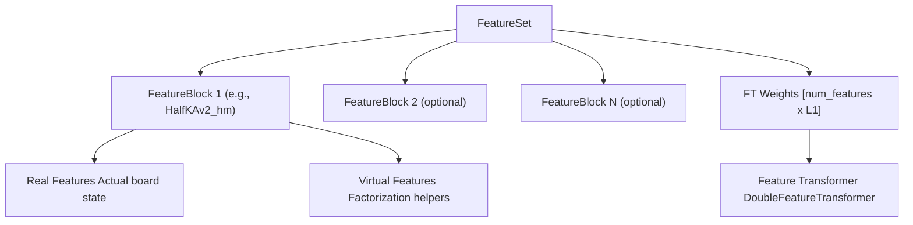
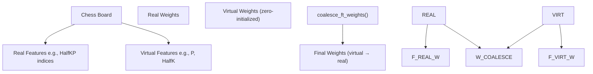
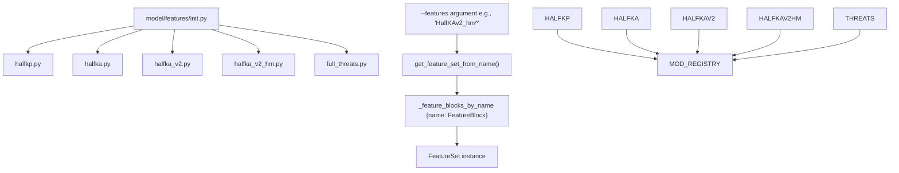
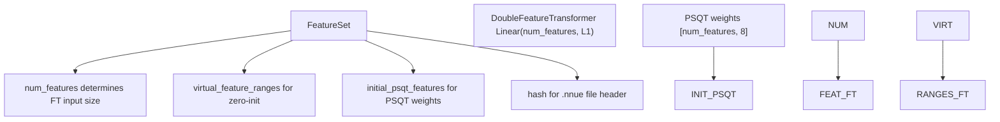

# Feature Sets

-   [model/callbacks.py](https://github.com/Chesszyh/nnue-pytorch/blob/024b2064/model/callbacks.py)
-   [model/features/\_\_init\_\_.py](https://github.com/Chesszyh/nnue-pytorch/blob/024b2064/model/features/__init__.py)
-   [model/features/feature\_set.py](https://github.com/Chesszyh/nnue-pytorch/blob/024b2064/model/features/feature_set.py)
-   [model/features/full\_threats.py](https://github.com/Chesszyh/nnue-pytorch/blob/024b2064/model/features/full_threats.py)
-   [model/features/halfkp.py](https://github.com/Chesszyh/nnue-pytorch/blob/024b2064/model/features/halfkp.py)
-   [model/modules/layer\_stacks.py](https://github.com/Chesszyh/nnue-pytorch/blob/024b2064/model/modules/layer_stacks.py)
-   [model/quantize.py](https://github.com/Chesszyh/nnue-pytorch/blob/024b2064/model/quantize.py)

This document describes the feature set system in nnue-pytorch, including available feature blocks, factorization mechanisms, and the feature registry architecture. Feature sets define how chess board positions are encoded as sparse input vectors for the NNUE neural network.

For information about how features are transformed by the neural network, see [Feature Transformer](#4.3). For details on how virtual features are coalesced during model serialization, see [Virtual Features and Factorization](#4.6).

## Overview

A **feature set** is a combination of one or more **feature blocks** that encode different aspects of a chess position into sparse binary vectors. Each feature block represents a specific encoding scheme (e.g., king-piece relationships, attack maps) and contributes a distinct range of feature indices to the overall input space.

The feature set determines:

-   The input dimensionality of the feature transformer
-   Which board aspects are encoded (piece positions, king safety, threats, etc.)
-   Whether factorization is used to accelerate training
-   The hash value used for network identification


**Diagram: Feature Set Architecture**

Sources: [model/features/feature\_set.py1-129](https://github.com/Chesszyh/nnue-pytorch/blob/024b2064/model/features/feature_set.py#L1-L129) [model/features/feature\_block.py](https://github.com/Chesszyh/nnue-pytorch/blob/024b2064/model/features/feature_block.py)

## Feature Block Types

The repository provides several pre-implemented feature blocks, each with different characteristics and use cases.

### Available Feature Blocks

| Feature Block | Hash | Real Features | Description | Factorized Variant |
| --- | --- | --- | --- | --- |
| `HalfKP` | `0x5D69D5B8` | 40,960 (64×640) | King position + single piece per square | `HalfKP^` |
| `HalfKA` | `0x7546FA1C` | 49,152 (64×768) | King position + all pieces including kings | `HalfKA^` |
| `HalfKAv2` | `0x3C778D2C` | 45,056 (64×704) | Optimized HalfKA variant | `HalfKAv2^` |
| `HalfKAv2_hm` | `0x41A443B5` | 22,528 (32×704) | HalfKAv2 with king bucketing | `HalfKAv2_hm^` |
| `Full_Threats` | `0x8F234CB8` | 102,464 | HalfKA + piece attack/threat information | `Full_Threats^` |

The default feature set is `HalfKAv2_hm^` (factorized).

Sources: [model/features/\_\_init\_\_.py57](https://github.com/Chesszyh/nnue-pytorch/blob/024b2064/model/features/__init__.py#L57-L57) [model/features/halfkp.py26](https://github.com/Chesszyh/nnue-pytorch/blob/024b2064/model/features/halfkp.py#L26-L26) [model/features/halfka\_v2\_hm.py](https://github.com/Chesszyh/nnue-pytorch/blob/024b2064/model/features/halfka_v2_hm.py) [model/features/full\_threats.py135](https://github.com/Chesszyh/nnue-pytorch/blob/024b2064/model/features/full_threats.py#L135-L135)

### HalfKP Features

The `HalfKP` feature block encodes the position of the player's king and each non-king piece on the board. For each perspective (white/black), it creates a feature index based on:

-   King square (64 possibilities)
-   Piece square (64 possibilities)
-   Piece type and color (10 piece types: 5 piece types × 2 colors, excluding kings)

```
# Feature index calculation from halfkp.pydef halfkp_idx(is_white_pov: bool, king_sq: int, sq: int, p: chess.Piece) -> int:    p_idx = (p.piece_type - 1) * 2 + (p.color != is_white_pov)    return 1 + orient(is_white_pov, sq) + p_idx * NUM_SQ + king_sq * NUM_PLANES
```
Total features: `1 + 64 × 64 × 10 = 40,960`

Sources: [model/features/halfkp.py18-20](https://github.com/Chesszyh/nnue-pytorch/blob/024b2064/model/features/halfkp.py#L18-L20) [model/features/halfkp.py23-45](https://github.com/Chesszyh/nnue-pytorch/blob/024b2064/model/features/halfkp.py#L23-L45)

### HalfKA and Variants

`HalfKA` extends `HalfKP` by including the opponent's king position as a feature. This provides additional information about king safety and king-king relationships.

`HalfKAv2` optimizes the encoding by using king bucketing to reduce the feature space while maintaining expressiveness. Instead of 64 distinct king positions, it groups symmetrically equivalent positions.

`HalfKAv2_hm` further reduces the feature space by using horizontal mirroring, resulting in 32 king buckets instead of 64. This is the **default feature set** due to its balance of expressiveness and efficiency.

Sources: [model/features/halfka.py](https://github.com/Chesszyh/nnue-pytorch/blob/024b2064/model/features/halfka.py) [model/features/halfka\_v2.py](https://github.com/Chesszyh/nnue-pytorch/blob/024b2064/model/features/halfka_v2.py) [model/features/halfka\_v2\_hm.py](https://github.com/Chesszyh/nnue-pytorch/blob/024b2064/model/features/halfka_v2_hm.py)

### Full\_Threats Features

The `Full_Threats` feature block is the most complex, encoding both piece positions and attack/threat information:

-   Standard HalfKA-style piece-square features (79,856 base features)
-   Attack maps for each piece type showing which squares are attacked
-   Different handling for each piece type based on attack patterns

```
# Feature space compositionNUM_INPUTS = 79856 + NUM_PLANES_REAL * NUM_SQ // 2# Where NUM_PLANES_REAL = 64 * 11 = 704# Total: 79,856 + 22,528 = 102,384 features
```
This feature set provides the richest representation but requires more computation and memory.

Sources: [model/features/full\_threats.py74](https://github.com/Chesszyh/nnue-pytorch/blob/024b2064/model/features/full_threats.py#L74-L74) [model/features/full\_threats.py132-144](https://github.com/Chesszyh/nnue-pytorch/blob/024b2064/model/features/full_threats.py#L132-L144)

## Factorization and Virtual Features

Feature blocks with the `^` suffix use **factorization** to accelerate training. Factorization adds auxiliary "virtual features" that help the network learn faster during early training, which are then eliminated at serialization time.


**Diagram: Feature Factorization Flow**

Sources: [model/features/feature\_block.py](https://github.com/Chesszyh/nnue-pytorch/blob/024b2064/model/features/feature_block.py) [model/features/halfkp.py48-96](https://github.com/Chesszyh/nnue-pytorch/blob/024b2064/model/features/halfkp.py#L48-L96)

### Factorization Example: HalfKP^

For the `HalfKP^` factorized variant:

**Real features** (40,960 total):

-   `HalfKP`: King-piece combinations as in standard HalfKP

**Virtual features** (704 total):

-   `HalfK` (64 features): King position weighted by piece count
-   `P` (640 features): Piece positions independent of king

Each real feature `HalfKP[k, p]` is factorized as:

```
HalfKP[k, p] = HalfKP[k, p] + HalfK[k] + P[p]
```
The virtual features are zero-initialized but can learn useful patterns during training. At serialization, virtual weights are added back into real weights via `get_feature_factors()`.

Sources: [model/features/halfkp.py82-93](https://github.com/Chesszyh/nnue-pytorch/blob/024b2064/model/features/halfkp.py#L82-L93) [model/features/feature\_set.py88-100](https://github.com/Chesszyh/nnue-pytorch/blob/024b2064/model/features/feature_set.py#L88-L100)

### Virtual Feature Initialization

Virtual feature weights are zero-initialized to ensure the factorized model starts with the same effective representation as the non-factorized version:

```
# From FeatureSet.get_virtual_feature_ranges()def get_virtual_feature_ranges(self) -> list[tuple[int, int]]:    ranges = []    offset = 0    for feature in self.features:        if feature.num_virtual_features:            ranges.append(                (offset + feature.num_real_features, offset + feature.num_features)            )        offset += feature.num_features    return ranges
```
These ranges are used during model initialization to selectively zero out virtual feature weights.

Sources: [model/features/feature\_set.py38-54](https://github.com/Chesszyh/nnue-pytorch/blob/024b2064/model/features/feature_set.py#L38-L54)

## Feature Registry and Selection

The feature system uses a dynamic registry pattern for feature block discovery and instantiation.


**Diagram: Feature Registry Architecture**

Sources: [model/features/\_\_init\_\_.py16-72](https://github.com/Chesszyh/nnue-pytorch/blob/024b2064/model/features/__init__.py#L16-L72)

### Feature Selection

Feature sets are selected via the `--features` command-line argument. The syntax supports:

-   **Single block**: `--features HalfKAv2_hm`
-   **Factorized block**: `--features HalfKAv2_hm^`
-   **Multiple blocks**: `--features HalfKP+HalfKA` (concatenation)

```
# From model/features/__init__.pydef get_feature_set_from_name(name: str) -> FeatureSet:    feature_block_names = name.split("+")    blocks = get_feature_blocks_from_names(feature_block_names)    return FeatureSet(blocks)
```
The parser splits on `+` to allow combining multiple feature blocks into a single feature set.

Sources: [model/features/\_\_init\_\_.py46-49](https://github.com/Chesszyh/nnue-pytorch/blob/024b2064/model/features/__init__.py#L46-L49) [model/features/\_\_init\_\_.py56-64](https://github.com/Chesszyh/nnue-pytorch/blob/024b2064/model/features/__init__.py#L56-L64)

### Registration Process

Each feature module must define a `get_feature_block_clss()` function that returns a list of feature block classes:

```
# Example from halfkp.pydef get_feature_block_clss() -> list[type[FeatureBlock]]:    return [Features, FactorizedFeatures]
```
The `_init()` function at module load time iterates through all feature modules and populates `_feature_blocks_by_name`:

```
def _add_feature_block(feature_block_cls: Callable[[], FeatureBlock]) -> None:    feature_block = feature_block_cls()    _feature_blocks_by_name[feature_block.name] = feature_block
```
Sources: [model/features/\_\_init\_\_.py27-35](https://github.com/Chesszyh/nnue-pytorch/blob/024b2064/model/features/__init__.py#L27-L35) [model/features/\_\_init\_\_.py67-72](https://github.com/Chesszyh/nnue-pytorch/blob/024b2064/model/features/__init__.py#L67-L72) [model/features/halfkp.py104-105](https://github.com/Chesszyh/nnue-pytorch/blob/024b2064/model/features/halfkp.py#L104-L105)

## Feature Block Interface

All feature blocks must implement the `FeatureBlock` interface:

**Diagram: FeatureBlock Class Hierarchy**

Sources: [model/features/feature\_block.py](https://github.com/Chesszyh/nnue-pytorch/blob/024b2064/model/features/feature_block.py) [model/features/halfkp.py23-27](https://github.com/Chesszyh/nnue-pytorch/blob/024b2064/model/features/halfkp.py#L23-L27) [model/features/halfkp.py48-57](https://github.com/Chesszyh/nnue-pytorch/blob/024b2064/model/features/halfkp.py#L48-L57)

### Key Methods

**`get_active_features(board: chess.Board) -> tuple[torch.Tensor, torch.Tensor]`**

-   Returns two tensors: white perspective features and black perspective features
-   Each tensor contains indices of active features (non-zero elements)
-   Used primarily for inference; training uses C++ data loader

**`get_feature_factors(idx: int) -> list[int]`**

-   For factorized blocks, returns the list of feature indices (real + virtual) that contribute to the real feature at `idx`
-   Used during weight coalescing at serialization time
-   Non-factorized blocks raise an exception

**`get_initial_psqt_features() -> list[int]`**

-   Returns initial values for PSQT (Piece-Square Table) features
-   Based on traditional chess piece values (pawn=126, knight=781, etc.)
-   Used to initialize the PSQT weights in the model

Sources: [model/features/feature\_block.py](https://github.com/Chesszyh/nnue-pytorch/blob/024b2064/model/features/feature_block.py) [model/features/halfkp.py82-93](https://github.com/Chesszyh/nnue-pytorch/blob/024b2064/model/features/halfkp.py#L82-L93) [model/features/full\_threats.py109-129](https://github.com/Chesszyh/nnue-pytorch/blob/024b2064/model/features/full_threats.py#L109-L129)

## Feature Set Hash Calculation

Each feature set has a unique hash computed from its constituent feature blocks:

```
def _calculate_features_hash(features):    if len(features) == 1:        return features[0].hash        tail_hash = _calculate_features_hash(features[1:])    return features[0].hash ^ (tail_hash << 1) ^ (tail_hash >> 1) & 0xFFFFFFFF
```
This hash is embedded in the `.nnue` file format and used by chess engines to verify compatibility. Changing the feature set results in a different hash, preventing incompatible networks from being loaded.

Sources: [model/features/feature\_set.py7-12](https://github.com/Chesszyh/nnue-pytorch/blob/024b2064/model/features/feature_set.py#L7-L12)

## Creating Custom Feature Blocks

To add a new feature block:

1.  **Create a new module** in `model/features/` (e.g., `my_features.py`)

2.  **Define feature block class(es)** inheriting from `FeatureBlock`:

    ```
    from collections import OrderedDictfrom .feature_block import FeatureBlockclass MyFeatures(FeatureBlock):    def __init__(self):        super().__init__(            "MyFeatures",            0x12345678,  # Unique hash            OrderedDict([("MyFeatures", num_features)])        )        def get_active_features(self, board):        # Return (white_features, black_features)        ...        def get_initial_psqt_features(self):        # Return initial PSQT values        ...
    ```

3.  **Define discovery function**:

    ```
    def get_feature_block_clss() -> list[type[FeatureBlock]]:    return [MyFeatures]
    ```

4.  **Register in `__init__.py`**:

    ```
    from . import my_features_feature_modules: list[types.ModuleType] = [    ...,    my_features,]
    ```

5.  **Implement C++ feature extraction** (if needed for training):

    -   Add feature extraction logic to `training_data_loader.cpp`
    -   Implement sparse feature generation for your encoding scheme

Sources: [model/features/\_\_init\_\_.py8-22](https://github.com/Chesszyh/nnue-pytorch/blob/024b2064/model/features/__init__.py#L8-L22) [model/features/halfkp.py23-45](https://github.com/Chesszyh/nnue-pytorch/blob/024b2064/model/features/halfkp.py#L23-L45) [model/features/feature\_block.py](https://github.com/Chesszyh/nnue-pytorch/blob/024b2064/model/features/feature_block.py)

## Feature Set Usage in Model

The `FeatureSet` is passed to the `NNUEModel` constructor and determines:


**Diagram: FeatureSet Integration with NNUEModel**

Sources: [model/features/feature\_set.py15-129](https://github.com/Chesszyh/nnue-pytorch/blob/024b2064/model/features/feature_set.py#L15-L129) [model/model.py](https://github.com/Chesszyh/nnue-pytorch/blob/024b2064/model/model.py)

### Weight Clipping and Quantization

Feature weights must be clipped to quantization bounds during training. The `QuantizationManager` generates clipping configurations, but it does not directly depend on the feature set. However, threat features (from `Full_Threats`) have special clipping bounds:

```
# From QuantizationManagerself.max_threat_weight = config.ft_quantized_one / 512
```
The model's `clip_threat_weights()` method applies this special clipping only when threat features are present.

Sources: [model/quantize.py35](https://github.com/Chesszyh/nnue-pytorch/blob/024b2064/model/quantize.py#L35-L35) [model/callbacks.py6-17](https://github.com/Chesszyh/nnue-pytorch/blob/024b2064/model/callbacks.py#L6-L17)

## Summary

The feature set system provides a modular, extensible architecture for encoding chess positions:

-   **Feature blocks** define encoding schemes (HalfKP, HalfKA, variants)
-   **Factorization** accelerates training with virtual features
-   **Registry pattern** enables dynamic feature selection
-   **Flexible composition** supports combining multiple blocks
-   **Hash-based versioning** ensures model compatibility

The default `HalfKAv2_hm^` provides an optimal balance of expressiveness, training speed, and model size for most use cases.

Sources: [model/features/\_\_init\_\_.py1-80](https://github.com/Chesszyh/nnue-pytorch/blob/024b2064/model/features/__init__.py#L1-L80) [model/features/feature\_set.py1-129](https://github.com/Chesszyh/nnue-pytorch/blob/024b2064/model/features/feature_set.py#L1-L129) [model/features/feature\_block.py](https://github.com/Chesszyh/nnue-pytorch/blob/024b2064/model/features/feature_block.py)
