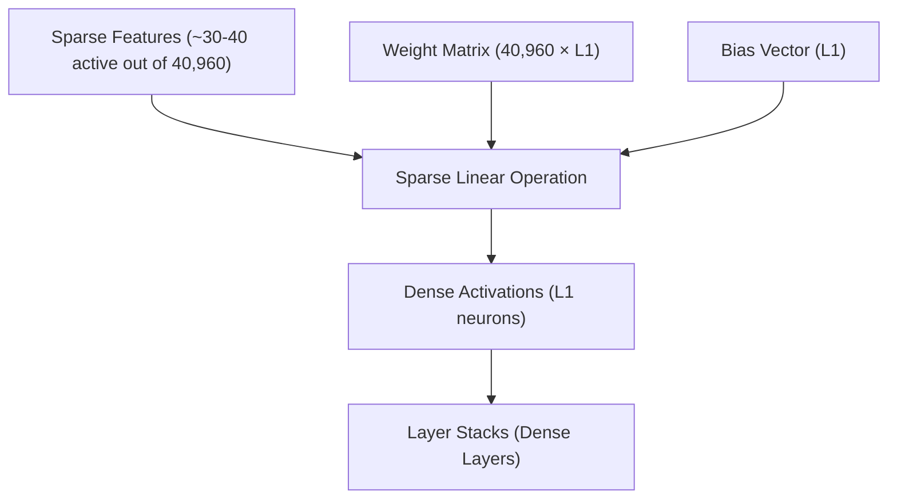
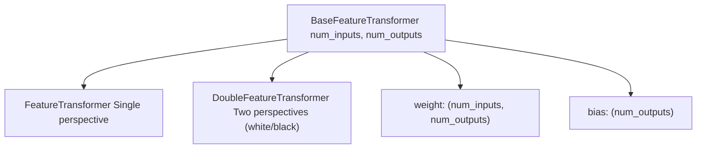
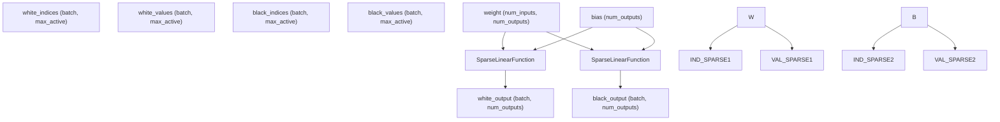
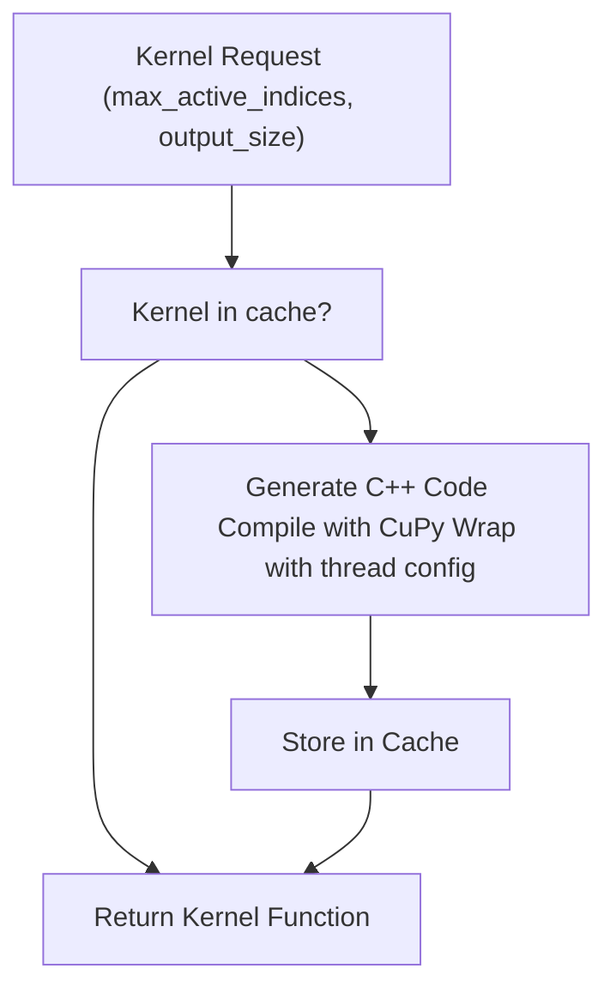
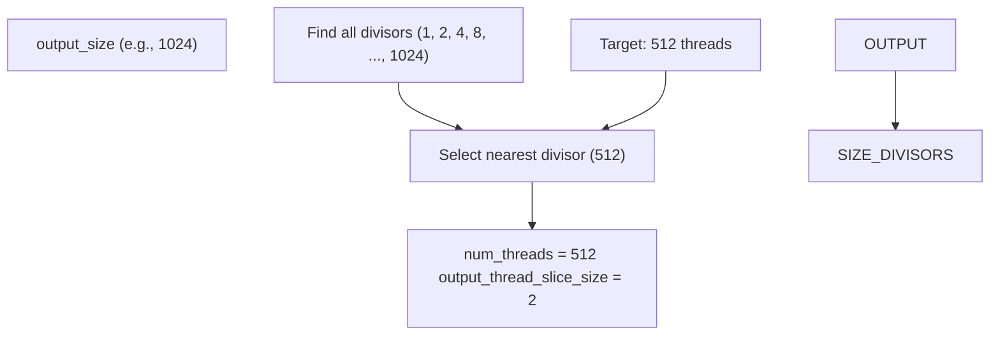

# Feature Transformer

-   [docs/img/SFNNv4\_architecture.drawio](https://github.com/Chesszyh/nnue-pytorch/blob/024b2064/docs/img/SFNNv4_architecture.drawio)
-   [docs/nnue.md](https://github.com/Chesszyh/nnue-pytorch/blob/024b2064/docs/nnue.md)
-   [model/model.py](https://github.com/Chesszyh/nnue-pytorch/blob/024b2064/model/model.py)
-   [model/modules/\_\_init\_\_.py](https://github.com/Chesszyh/nnue-pytorch/blob/024b2064/model/modules/__init__.py)
-   [model/modules/feature\_transformer/\_\_init\_\_.py](https://github.com/Chesszyh/nnue-pytorch/blob/024b2064/model/modules/feature_transformer/__init__.py)
-   [model/modules/feature\_transformer/functions.py](https://github.com/Chesszyh/nnue-pytorch/blob/024b2064/model/modules/feature_transformer/functions.py)
-   [model/modules/feature\_transformer/kernel.py](https://github.com/Chesszyh/nnue-pytorch/blob/024b2064/model/modules/feature_transformer/kernel.py)
-   [model/modules/feature\_transformer/module.py](https://github.com/Chesszyh/nnue-pytorch/blob/024b2064/model/modules/feature_transformer/module.py)
-   [model/utils/coalesce\_weights.py](https://github.com/Chesszyh/nnue-pytorch/blob/024b2064/model/utils/coalesce_weights.py)
-   [model/utils/serialize.py](https://github.com/Chesszyh/nnue-pytorch/blob/024b2064/model/utils/serialize.py)
-   [tests/test\_feature\_transformer.py](https://github.com/Chesszyh/nnue-pytorch/blob/024b2064/tests/test_feature_transformer.py)

## Purpose and Scope

This page documents the Feature Transformer, the first and largest layer in the NNUE network architecture. The feature transformer takes sparse input features (representing chess board state) and transforms them into dense hidden layer activations. This page covers:

-   The role and importance of the feature transformer in NNUE
-   The sparse linear operation implementation
-   Class hierarchy (`BaseFeatureTransformer`, `FeatureTransformer`, `DoubleFeatureTransformer`)
-   Custom CUDA kernels for forward and backward passes
-   Two-perspective architecture for white and black sides

For information about the input feature sets, see [Feature Sets](#4.2). For details on quantization of the feature transformer weights, see [Quantization System](#4.5). For virtual feature handling, see [Virtual Features and Factorization](#4.6).

## Overview

### Role in the NNUE Architecture

The feature transformer is the first layer of the NNUE network. It converts sparse binary input features (typically 30-40 active features out of 40,000+ possible features) into a dense vector of hidden neuron activations. This layer accounts for the majority of the network's parameters (typically 10-20 million weights) but remains fast due to input sparsity.


**Diagram: Feature Transformer Position in Network**

The key innovation is that only the columns of the weight matrix corresponding to active features need to be processed. For a position with 32 active features, this means processing only 32 columns instead of all 40,960 columns.

Sources: [docs/nnue.md144-300](https://github.com/Chesszyh/nnue-pytorch/blob/024b2064/docs/nnue.md#L144-L300) [model/model.py28-30](https://github.com/Chesszyh/nnue-pytorch/blob/024b2064/model/model.py#L28-L30)

### The Accumulator Concept

The feature transformer implements the "accumulator" - a crucial optimization where the output of this layer is incrementally updated between positions rather than recomputed from scratch. When a move is made:

-   **Features removed**: Subtract corresponding weight columns from accumulator
-   **Features added**: Add corresponding weight columns to accumulator
-   **King moves**: Refresh entire accumulator (all features change)

This incremental update is handled by the chess engine during search, not by the trainer. During training, each batch position is evaluated independently.

Sources: [docs/nnue.md287-299](https://github.com/Chesszyh/nnue-pytorch/blob/024b2064/docs/nnue.md#L287-L299) [docs/nnue.md370-448](https://github.com/Chesszyh/nnue-pytorch/blob/024b2064/docs/nnue.md#L370-L448)

## Class Hierarchy

### BaseFeatureTransformer

The base class defines the core parameters and initialization logic.


**Diagram: Feature Transformer Class Hierarchy**

Key implementation details from [model/modules/feature\_transformer/module.py9-24](https://github.com/Chesszyh/nnue-pytorch/blob/024b2064/model/modules/feature_transformer/module.py#L9-L24):

| Component | Type | Shape | Initialization |
| --- | --- | --- | --- |
| `weight` | `nn.Parameter` | `(num_inputs, num_outputs)` | Uniform(-σ, σ) where σ = sqrt(1/num\_inputs) |
| `bias` | `nn.Parameter` | `(num_outputs)` | Uniform(-σ, σ) where σ = sqrt(1/num\_inputs) |

The weight matrix uses **column-major layout** conceptually (each feature corresponds to a column) which is favorable for sparse operations where we sum selected columns.

Sources: [model/modules/feature\_transformer/module.py9-24](https://github.com/Chesszyh/nnue-pytorch/blob/024b2064/model/modules/feature_transformer/module.py#L9-L24)

### FeatureTransformer

The single-perspective feature transformer processes features from one side's perspective.

```
# Forward signature from model/modules/feature_transformer/module.py:27-30def forward(self, feature_indices, feature_values):    return SparseLinearFunction.apply(        feature_indices, feature_values, self.weight, self.bias    )
```
**Input format:**

-   `feature_indices`: `(batch_size, max_active_features)` - int32 tensor of active feature indices
-   `feature_values`: `(batch_size, max_active_features)` - float32 tensor of feature values (arity)

**Output:**

-   `(batch_size, num_outputs)` - float32 tensor of activations

Sources: [model/modules/feature\_transformer/module.py26-30](https://github.com/Chesszyh/nnue-pytorch/blob/024b2064/model/modules/feature_transformer/module.py#L26-L30)

### DoubleFeatureTransformer

The two-perspective transformer processes features for both white and black sides simultaneously, sharing the same weight matrix.


**Diagram: DoubleFeatureTransformer Data Flow**

The implementation at [model/modules/feature\_transformer/module.py33-50](https://github.com/Chesszyh/nnue-pytorch/blob/024b2064/model/modules/feature_transformer/module.py#L33-L50) applies the same `SparseLinearFunction` twice with different inputs but shared weights.

Sources: [model/modules/feature\_transformer/module.py33-50](https://github.com/Chesszyh/nnue-pytorch/blob/024b2064/model/modules/feature_transformer/module.py#L33-L50) [model/model.py28-30](https://github.com/Chesszyh/nnue-pytorch/blob/024b2064/model/model.py#L28-L30)

## Sparse Linear Operations

### Mathematical Foundation

The sparse linear operation computes `y = Wx + b` where `x` is sparse. Instead of computing:

```
y[i] = sum(W[j,i] * x[j] for j in 0..num_inputs) + b[i]
```
We compute:

```
y[i] = sum(W[j,i] * x[j] for j in active_features) + b[i]
```
This reduces complexity from O(num\_inputs × num\_outputs) to O(num\_active × num\_outputs), typically a 1000× improvement.

Sources: [docs/nnue.md173-190](https://github.com/Chesszyh/nnue-pytorch/blob/024b2064/docs/nnue.md#L173-L190)

### SparseLinearFunction Implementation

The `SparseLinearFunction` is a custom PyTorch autograd function that implements both forward and backward passes using custom CUDA kernels.

```mermaid
flowchart TD
    B_IN["grad_output"]
    B_KERNEL["Get/Compile Backward Kernel make_sparse_input_linear_backward_kernel"]
    B_EXEC["Execute Kernel grid=(batch_size,)"]
    B_OUT["weight_grad, bias_grad"]
    F_IN["feature_indices, feature_values weight, bias"]
    F_VALIDATE["Input Validation shapes, dtypes, devices"]
    F_KERNEL["Get/Compile Forward Kernel make_sparse_input_linear_forward_kernel"]
    F_EXEC["Execute Kernel grid=(batch_size,)"]
    F_OUT["output (batch_size, output_size)"]

    B --> IN_B_KERNEL
    B --> KERNEL_B_EXEC
    B --> EXEC_B_OUT
    F --> IN_F_VALIDATE
    F --> VALIDATE_F_KERNEL
    F --> KERNEL_F_EXEC
    F --> EXEC_F_OUT
```


**Diagram: SparseLinearFunction Flow**

Key assertions from [model/modules/feature\_transformer/functions.py15-40](https://github.com/Chesszyh/nnue-pytorch/blob/024b2064/model/modules/feature_transformer/functions.py#L15-L40):

| Requirement | Validation |
| --- | --- |
| Shape compatibility | `feature_indices.shape == feature_values.shape` |
| Data types | `feature_indices: int32`, `feature_values: float32`, `weight: float32`, `bias: float32` |
| Device | All tensors must be on CUDA |
| Memory layout | All tensors must be contiguous |

Sources: [model/modules/feature\_transformer/functions.py10-104](https://github.com/Chesszyh/nnue-pytorch/blob/024b2064/model/modules/feature_transformer/functions.py#L10-L104)

## Custom CUDA Kernels

### Kernel Compilation and Caching

The system dynamically generates, compiles, and caches CUDA kernels based on architecture parameters.


**Diagram: Kernel Compilation Flow**

The kernel generation code at [model/modules/feature\_transformer/kernel.py47-173](https://github.com/Chesszyh/nnue-pytorch/blob/024b2064/model/modules/feature_transformer/kernel.py#L47-L173) uses the following caching strategy:

-   Cache key: `(max_active_indices, output_size, num_threads)`
-   Global dictionaries: `_sparse_input_linear_forward_kernel_cache`, `_sparse_input_linear_backward_kernel_cache`
-   Optimal thread count: 512 threads, adjusted to nearest divisor of `output_size`

Sources: [model/modules/feature\_transformer/kernel.py5-45](https://github.com/Chesszyh/nnue-pytorch/blob/024b2064/model/modules/feature_transformer/kernel.py#L5-L45)

### Forward Kernel

The forward kernel computes the sparse linear transformation in parallel across the batch.

**Key features from [model/modules/feature\_transformer/kernel.py68-173](https://github.com/Chesszyh/nnue-pytorch/blob/024b2064/model/modules/feature_transformer/kernel.py#L68-L173):**

| Aspect | Implementation |
| --- | --- |
| Thread organization | `grid=(batch_size,)`, `block=(num_threads,)` |
| Output slicing | Each thread processes `output_size // num_threads` outputs |
| Shared memory | `shared_output[output_size]` to reduce global memory access |
| Loop optimization | `#pragma unroll` for inner loops |
| Early termination | Break when `input_index == -1` |

**Kernel structure:**

1.  Copy bias slice to shared memory
2.  For each active feature:
    -   Load feature index and value
    -   If index != -1: accumulate `weight[index, :] * value`
    -   Else: break (no more active features)
3.  Write shared memory to global output

Sources: [model/modules/feature\_transformer/kernel.py68-173](https://github.com/Chesszyh/nnue-pytorch/blob/024b2064/model/modules/feature_transformer/kernel.py#L68-L173)

### Backward Kernel

The backward kernel computes gradients with respect to weights and biases.

**Key differences from forward kernel ([model/modules/feature\_transformer/kernel.py197-311](https://github.com/Chesszyh/nnue-pytorch/blob/024b2064/model/modules/feature_transformer/kernel.py#L197-L311)):**

| Component | Implementation |
| --- | --- |
| Weight gradient | Uses `atomicAdd` for accumulation (race condition handling) |
| Bias gradient | Uses `atomicAdd` for accumulation |
| Zero skipping | Only accumulates when `shared_output_grad[s] != 0.0f` |
| Input gradients | Not computed (features are indices, not differentiable) |

The `atomicAdd` operations are necessary because multiple threads may update the same weight gradient row when the same feature appears in different batch positions.

Sources: [model/modules/feature\_transformer/kernel.py197-311](https://github.com/Chesszyh/nnue-pytorch/blob/024b2064/model/modules/feature_transformer/kernel.py#L197-L311)

### Thread Configuration Optimization

The system optimizes thread count to balance parallelism and efficiency:


**Diagram: Thread Count Selection**

This ensures:

-   Each thread processes an integer number of outputs
-   Thread count is close to optimal (512)
-   No wasted threads

Sources: [model/modules/feature\_transformer/kernel.py5-45](https://github.com/Chesszyh/nnue-pytorch/blob/024b2064/model/modules/feature_transformer/kernel.py#L5-L45)

## Two-Perspective Architecture

### Why Two Perspectives

NNUE maintains separate accumulators for white and black perspectives to allow the network to understand position features relative to each side's king. This provides:

-   Position evaluation from both sides simultaneously
-   Ability to learn tempo (whose turn it is)
-   Better positional understanding (e.g., white king safety vs black king safety)

Sources: [docs/nnue.md311-328](https://github.com/Chesszyh/nnue-pytorch/blob/024b2064/docs/nnue.md#L311-L328)

### Weight Sharing

Both perspectives use the **same weight matrix**. The feature sets are designed to map equivalent positions to equivalent features. For example, with HalfKP:

-   White king on e1 with white pawn on e2 (white's perspective)
-   Black king on e8 with black pawn on e7 (black's perspective, board flipped)

Both generate the same feature index, so they use the same weights.

Alternative: Some engines use separate weights for white/black perspectives, but this doubles model size.

Sources: [docs/nnue.md323-328](https://github.com/Chesszyh/nnue-pytorch/blob/024b2064/docs/nnue.md#L323-L328)

### DoubleFeatureTransformer in NNUEModel

The integration in [model/model.py28-30](https://github.com/Chesszyh/nnue-pytorch/blob/024b2064/model/model.py#L28-L30) shows how the feature transformer is instantiated:

```
self.input = DoubleFeatureTransformer(    feature_set.num_features, self.L1 + self.num_psqt_buckets)
```
Note: The output size includes both the L1 neurons and PSQT (Piece-Square Table) buckets. The PSQT values are later split off and used separately.

The forward pass at [model/model.py188](https://github.com/Chesszyh/nnue-pytorch/blob/024b2064/model/model.py#L188-L188) returns two outputs:

```
wp, bp = self.input(white_indices, white_values, black_indices, black_values)
```
Where `wp` and `bp` are white and black perspective outputs, each of shape `(batch_size, L1 + num_psqt_buckets)`.

Sources: [model/model.py28-30](https://github.com/Chesszyh/nnue-pytorch/blob/024b2064/model/model.py#L28-L30) [model/model.py177-208](https://github.com/Chesszyh/nnue-pytorch/blob/024b2064/model/model.py#L177-L208)

## Initialization

### Weight Initialization

Weights are initialized using a uniform distribution scaled by Xavier/He initialization principles:

```
sigma = math.sqrt(1 / num_inputs)weight = torch.rand(...) * (2 * sigma) - sigma  # Uniform(-sigma, sigma)
```
This provides:

-   Mean: 0
-   Variance: σ²/3 where σ = 1/√num\_inputs
-   Prevents gradient vanishing/explosion

Sources: [model/modules/feature\_transformer/module.py15-23](https://github.com/Chesszyh/nnue-pytorch/blob/024b2064/model/modules/feature_transformer/module.py#L15-L23)

### Virtual Feature Initialization

Virtual features (used in factorized feature sets) are initialized to zero at [model/model.py43-52](https://github.com/Chesszyh/nnue-pytorch/blob/024b2064/model/model.py#L43-L52):

```
def _zero_virtual_feature_weights(self):    weights = self.input.weight    with torch.no_grad():        for a, b in self.feature_set.get_virtual_feature_ranges():            weights[a:b, :] = 0.0    self.input.weight = nn.Parameter(weights)
```
This is done because virtual features are only used during training to help learn correlated real features. They start at zero and only develop during training.

Sources: [model/model.py43-52](https://github.com/Chesszyh/nnue-pytorch/blob/024b2064/model/model.py#L43-L52)

### PSQT Initialization

The PSQT (Piece-Square Table) neurons are initialized with classical chess evaluation values at [model/model.py54-82](https://github.com/Chesszyh/nnue-pytorch/blob/024b2064/model/model.py#L54-L82):

```
initial_values = self.feature_set.get_initial_psqt_features()new_weights = torch.tensor(initial_values, ...) * scalefor i in range(self.num_psqt_buckets):    input_weights[:, self.L1 + i] = new_weights    input_bias[self.L1 + i] = 0.0
```
This provides a reasonable starting point before the network learns to adjust these values during training.

Sources: [model/model.py54-82](https://github.com/Chesszyh/nnue-pytorch/blob/024b2064/model/model.py#L54-L82)

## Serialization and Weight Coalescing

### Weight Coalescing

Before serialization, virtual feature weights are coalesced back into real feature weights. The `coalesce_ft_weights` function at [model/utils/coalesce\_weights.py7-19](https://github.com/Chesszyh/nnue-pytorch/blob/024b2064/model/utils/coalesce_weights.py#L7-L19) sums virtual feature weights into their corresponding real features:

```
def coalesce_ft_weights(feature_set, layer):    weight = layer.weight.data    indices = feature_set.get_virtual_to_real_features_gather_indices()    weight_coalesced = weight.new_zeros((feature_set.num_real_features, weight.shape[1]))    for i_real, is_virtual in enumerate(indices):        weight_coalesced[i_real, :] = sum(weight[i_virtual, :] for i_virtual in is_virtual)    return weight_coalesced
```
This reduces the model to only real features, which the chess engine understands.

Sources: [model/utils/coalesce\_weights.py7-19](https://github.com/Chesszyh/nnue-pytorch/blob/024b2064/model/utils/coalesce_weights.py#L7-L19) [model/utils/serialize.py149](https://github.com/Chesszyh/nnue-pytorch/blob/024b2064/model/utils/serialize.py#L149-L149)

### Binary Serialization

The feature transformer is serialized to the .nnue format at [model/utils/serialize.py144-174](https://github.com/Chesszyh/nnue-pytorch/blob/024b2064/model/utils/serialize.py#L144-L174):

**Serialization order:**

1.  Bias vector (int16 for L1, int32 for PSQT)
2.  Weight matrix (int16 or int8 depending on feature set)
3.  PSQT weight matrix (int32)

Optional LEB128 compression can be applied to reduce file size further.

Sources: [model/utils/serialize.py144-174](https://github.com/Chesszyh/nnue-pytorch/blob/024b2064/model/utils/serialize.py#L144-L174)

## Performance Considerations

### Benchmark Results

From [tests/test\_feature\_transformer.py80-122](https://github.com/Chesszyh/nnue-pytorch/blob/024b2064/tests/test_feature_transformer.py#L80-L122) typical performance metrics:

| Configuration | Performance |
| --- | --- |
| Input features | 40,960 |
| Batch size | 8,192 |
| Active features | ~48 (64 max, 75% filled) |
| Output size | 264 |
| Throughput | ~1M positions/second (single GPU) |

The benchmark shows that the sparse implementation achieves high throughput due to:

-   Custom CUDA kernels optimized for sparse operations
-   Efficient memory access patterns
-   Thread-level parallelism

Sources: [tests/test\_feature\_transformer.py80-122](https://github.com/Chesszyh/nnue-pytorch/blob/024b2064/tests/test_feature_transformer.py#L80-L122)

### Memory Layout

The weight matrix is stored in row-major order in PyTorch (default), but conceptually accessed column-wise during sparse operations. Each active feature corresponds to gathering one column (or row in the stored layout) of the weight matrix.

This layout is efficient because:

-   Each thread processes a contiguous slice of the output
-   Weight access pattern is predictable
-   Coalescing of memory accesses in CUDA

Sources: [docs/nnue.md365-367](https://github.com/Chesszyh/nnue-pytorch/blob/024b2064/docs/nnue.md#L365-L367)

### Quantization Impact

During training, weights remain in float32. The quantization scheme limits their range to ensure safe conversion to int16 during serialization:

-   FT weights: typically quantized to int16 with scale factor 127
-   FT biases: typically quantized to int32

The weight clipping callback ensures weights stay within quantization bounds during training. See [Quantization System](#4.5) for details.

Sources: [model/model.py84-117](https://github.com/Chesszyh/nnue-pytorch/blob/024b2064/model/model.py#L84-L117)

## Testing and Validation

The test suite at [tests/test\_feature\_transformer.py36-77](https://github.com/Chesszyh/nnue-pytorch/blob/024b2064/tests/test_feature_transformer.py#L36-L77) validates:

1.  **Forward pass correctness**: CUDA kernel output matches CPU reference implementation
2.  **Backward pass correctness**: Gradients match CPU reference implementation
3.  **Numerical precision**: Maximum error < 1e-4 for float32

The CPU reference implementation uses dense matrix operations for validation:

```
def SparseLinearFunctionEmulate(input_indices, input_values, weight, bias):    # Construct dense input from sparse representation    inputs = torch.zeros(batch_size, num_inputs, dtype=torch.float32)    for i in range(batch_size):        for j in range(max_active_indices):            feature = input_indices[i, j]            value = input_values[i, j]            inputs[i, feature] += value    return torch.mm(inputs, weight) + bias
```
Sources: [tests/test\_feature\_transformer.py15-77](https://github.com/Chesszyh/nnue-pytorch/blob/024b2064/tests/test_feature_transformer.py#L15-L77)

---

**Key Takeaways:**

1.  The feature transformer is the largest layer but remains fast due to sparse inputs
2.  Custom CUDA kernels provide optimized forward/backward passes
3.  Two perspectives (white/black) share weights for parameter efficiency
4.  Virtual features help training but are coalesced before serialization
5.  The accumulator concept (implemented by engines) enables incremental updates
6.  Thread-level parallelism and memory optimization are critical for performance
