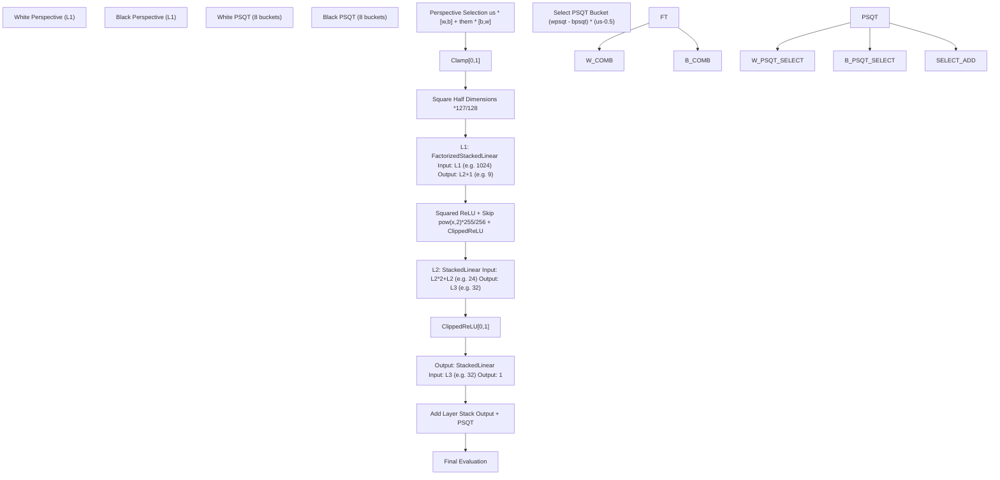
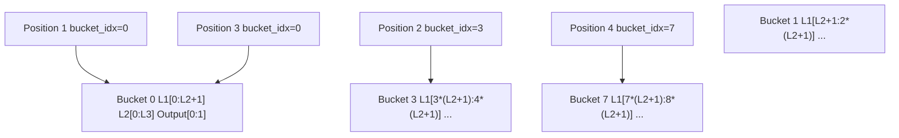
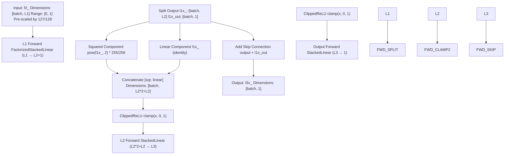
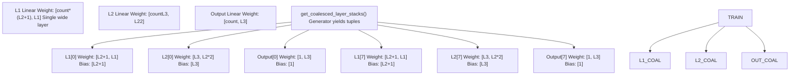

# Layer Stacks and Dense Layers

-   [model/callbacks.py](https://github.com/Chesszyh/nnue-pytorch/blob/024b2064/model/callbacks.py)
-   [model/features/\_\_init\_\_.py](https://github.com/Chesszyh/nnue-pytorch/blob/024b2064/model/features/__init__.py)
-   [model/features/full\_threats.py](https://github.com/Chesszyh/nnue-pytorch/blob/024b2064/model/features/full_threats.py)
-   [model/model.py](https://github.com/Chesszyh/nnue-pytorch/blob/024b2064/model/model.py)
-   [model/modules/layer\_stacks.py](https://github.com/Chesszyh/nnue-pytorch/blob/024b2064/model/modules/layer_stacks.py)
-   [model/quantize.py](https://github.com/Chesszyh/nnue-pytorch/blob/024b2064/model/quantize.py)
-   [model/utils/coalesce\_weights.py](https://github.com/Chesszyh/nnue-pytorch/blob/024b2064/model/utils/coalesce_weights.py)
-   [model/utils/serialize.py](https://github.com/Chesszyh/nnue-pytorch/blob/024b2064/model/utils/serialize.py)

## Purpose and Scope

This document describes the dense neural network layers that process the output from the Feature Transformer to produce the final position evaluation. After the Feature Transformer converts sparse chess features into dense L1-dimensional vectors, the Layer Stacks apply a series of fully-connected layers with non-linear activations to compute the position score.

For information about the Feature Transformer that precedes these layers, see [Feature Transformer](#4.3). For details on quantization of these layers, see [Quantization System](#4.5). For the overall network structure, see [NNUE Network Structure](#4.1).

Sources: [model/modules/layer\_stacks.py1-59](https://github.com/Chesszyh/nnue-pytorch/blob/024b2064/model/modules/layer_stacks.py#L1-L59)

## Architecture Overview

The layer stacks consist of three fully-connected layers applied sequentially after the Feature Transformer output. The architecture uses a bucketing system where multiple independent layer stacks process different position types simultaneously.

**Architecture Overview: Complete flow from Feature Transformer output through Layer Stacks to final evaluation**

Sources: [model/model.py177-208](https://github.com/Chesszyh/nnue-pytorch/blob/024b2064/model/model.py#L177-L208) [model/modules/layer\_stacks.py30-44](https://github.com/Chesszyh/nnue-pytorch/blob/024b2064/model/modules/layer_stacks.py#L30-L44)

## LayerStacks Module

The `LayerStacks` class implements the dense neural network layers. It maintains three sequential linear layers with specialized activations, organized into multiple independent "buckets" for position-type specialization.

### Class Structure

| Component | Type | Dimensions | Purpose |
| --- | --- | --- | --- |
| `l1` | `FactorizedStackedLinear` | `L1 → L2+1` | First hidden layer with factorization |
| `l2` | `StackedLinear` | `L2*2 → L3` | Second hidden layer |
| `output` | `StackedLinear` | `L3 → 1` | Output layer |
| `count` | `int` | Default: 8 | Number of layer stack buckets |

The class constructor initializes these layers and sets the output bias to zero:

[model/modules/layer\_stacks.py10-29](https://github.com/Chesszyh/nnue-pytorch/blob/024b2064/model/modules/layer_stacks.py#L10-L29)

Sources: [model/modules/layer\_stacks.py10-29](https://github.com/Chesszyh/nnue-pytorch/blob/024b2064/model/modules/layer_stacks.py#L10-L29)

## Bucketing System

The bucketing system allows the model to specialize different layer stacks for different position characteristics. Each bucket is an independent set of weights for the three layers.

**Bucketing System: Positions are routed to different layer stacks based on bucket indices**

During training and inference, each position in a batch is associated with a `layer_stack_indices` tensor that selects which bucket processes that position. The buckets are implemented as a single wide layer where each bucket occupies a contiguous slice of the output dimensions.

Sources: [model/modules/layer\_stacks.py11-25](https://github.com/Chesszyh/nnue-pytorch/blob/024b2064/model/modules/layer_stacks.py#L11-L25) [model/model.py25-26](https://github.com/Chesszyh/nnue-pytorch/blob/024b2064/model/model.py#L25-L26)

## Stacked Linear Implementation

The `StackedLinear` and `FactorizedStackedLinear` classes implement the bucketed fully-connected layers. While the source code for these classes is in `model/modules/stacked_linear.py` (not provided in detail), we can infer their behavior from usage:

### StackedLinear

A `StackedLinear(in_features, out_features, count)` layer creates a single `nn.Linear` layer with dimensions `[count * out_features, in_features]`. During the forward pass, the `ls_indices` parameter selects which slice of the output to use for each position in the batch.

### FactorizedStackedLinear

The first layer uses `FactorizedStackedLinear`, which includes an additional factorization mechanism to share weights across buckets. This is only applied to L1 because non-linearities in subsequent layers break the factorization assumption.

[model/modules/layer\_stacks.py19-23](https://github.com/Chesszyh/nnue-pytorch/blob/024b2064/model/modules/layer_stacks.py#L19-L23)

Sources: [model/modules/layer\_stacks.py19-25](https://github.com/Chesszyh/nnue-pytorch/blob/024b2064/model/modules/layer_stacks.py#L19-L25)

## Activation Functions and Forward Pass

The forward pass through the layer stacks applies specialized activation functions between layers:

**Forward Pass Flow: Data transformations and activations through the three layers**

### Detailed Forward Pass Steps

1.  **L1 Layer**: Applies `FactorizedStackedLinear` and splits output into `L2` dimensions and a single skip connection value

2.  **Squared ReLU Activation**: The L2-dimensional output is transformed by:

    -   Squaring: `pow(l1x_, 2.0)`
    -   Scaling: `* (255/256)` to match quantized behavior
    -   Concatenating with linear component: `cat([sqr, linear], dim=1)`
    -   Clamping: `clamp(0.0, 1.0)`
3.  **L2 Layer**: Applies `StackedLinear` with dimensions `L2*2+L2 → L3`

4.  **ClippedReLU**: Standard `clamp(0.0, 1.0)`

5.  **Output Layer**: Final linear transformation to single value

6.  **Skip Connection**: Adds the 1-dimensional skip value from L1 output

[model/modules/layer\_stacks.py30-44](https://github.com/Chesszyh/nnue-pytorch/blob/024b2064/model/modules/layer_stacks.py#L30-L44)

Sources: [model/modules/layer\_stacks.py30-44](https://github.com/Chesszyh/nnue-pytorch/blob/024b2064/model/modules/layer_stacks.py#L30-L44)

## Quantization Compatibility

The layer stack architecture is designed to match quantized inference behavior during training. Several scaling factors ensure floating-point training produces results equivalent to integer inference:

| Operation | Floating-Point Scale | Quantized Equivalent |
| --- | --- | --- |
| Input to L1 | `* (127/128)` | Division by 128 in int8 |
| Squared activation | `* (255/256)` | Represents 1.0 as 255 in int8 |
| Weight ranges | Clipped to quantization bounds | Direct int8 representation |

The `WeightClippingCallback` enforces these bounds during training:

[model/callbacks.py6-18](https://github.com/Chesszyh/nnue-pytorch/blob/024b2064/model/callbacks.py#L6-L18)

Weight clipping configurations are generated by the `QuantizationManager`:

[model/quantize.py40-60](https://github.com/Chesszyh/nnue-pytorch/blob/024b2064/model/quantize.py#L40-L60)

Sources: [model/modules/layer\_stacks.py33-35](https://github.com/Chesszyh/nnue-pytorch/blob/024b2064/model/modules/layer_stacks.py#L33-L35) [model/callbacks.py6-18](https://github.com/Chesszyh/nnue-pytorch/blob/024b2064/model/callbacks.py#L6-L18) [model/quantize.py40-60](https://github.com/Chesszyh/nnue-pytorch/blob/024b2064/model/quantize.py#L40-L60)

## Factorization in L1

The first layer uses `FactorizedStackedLinear` instead of regular `StackedLinear`. This factorization allows sharing weights across buckets to improve training efficiency.

The factorization is only applied to L1 because:

-   Later layers have non-linearities that break linear factorization assumptions
-   By design, weights in L2 and L3 should diverge across buckets

[model/modules/layer\_stacks.py19-23](https://github.com/Chesszyh/nnue-pytorch/blob/024b2064/model/modules/layer_stacks.py#L19-L23)

The `coalesce_weights` method combines the factorized weights:

[model/modules/layer\_stacks.py56-59](https://github.com/Chesszyh/nnue-pytorch/blob/024b2064/model/modules/layer_stacks.py#L56-L59)

Sources: [model/modules/layer\_stacks.py19-23](https://github.com/Chesszyh/nnue-pytorch/blob/024b2064/model/modules/layer_stacks.py#L19-L23) [model/modules/layer\_stacks.py56-59](https://github.com/Chesszyh/nnue-pytorch/blob/024b2064/model/modules/layer_stacks.py#L56-L59)

## Serialization and Export

When exporting to `.nnue` format, the layer stacks are decomposed from their training representation (single wide layers) into individual per-bucket layers for inference.

### Serialization Process

**Serialization Process: Converting from training representation to individual bucket layers**

The `get_coalesced_layer_stacks()` generator method yields individual linear layers for each bucket:

[model/modules/layer\_stacks.py46-54](https://github.com/Chesszyh/nnue-pytorch/blob/024b2064/model/modules/layer_stacks.py#L46-L54)

During serialization, each bucket's layers are written separately with their own hash:

[model/utils/serialize.py92-96](https://github.com/Chesszyh/nnue-pytorch/blob/024b2064/model/utils/serialize.py#L92-L96)

### Quantization During Export

FC layers are quantized to int8 weights and int32 biases:

[model/utils/serialize.py176-213](https://github.com/Chesszyh/nnue-pytorch/blob/024b2064/model/utils/serialize.py#L176-L213)

The quantization scales are:

-   **Hidden layers**: `weight_scale_hidden = 64.0`
-   **Output layer**: `weight_scale_out = 16.0`
-   **Bias scale (hidden)**: `64.0 * 127.0`
-   **Bias scale (output)**: `16.0 * 600.0`

Sources: [model/modules/layer\_stacks.py46-54](https://github.com/Chesszyh/nnue-pytorch/blob/024b2064/model/modules/layer_stacks.py#L46-L54) [model/utils/serialize.py92-96](https://github.com/Chesszyh/nnue-pytorch/blob/024b2064/model/utils/serialize.py#L92-L96) [model/utils/serialize.py176-213](https://github.com/Chesszyh/nnue-pytorch/blob/024b2064/model/utils/serialize.py#L176-L213)

## Configuration Parameters

The layer stack architecture is controlled by `ModelConfig`:

| Parameter | Default | Description |
| --- | --- | --- |
| `L1` | 1024 | Feature transformer output size |
| `L2` | 8 | First hidden layer size (per bucket) |
| `L3` | 32 | Second hidden layer size (per bucket) |

Additional parameters in `NNUEModel`:

| Parameter | Default | Description |
| --- | --- | --- |
| `num_ls_buckets` | 8 | Number of layer stack buckets |
| `num_psqt_buckets` | 8 | Number of PSQT buckets |

The total parameter count for layer stacks with default configuration:

-   **L1**: `8 * (1024 * 9 + 9) = 73,800` parameters
-   **L2**: `8 * (24 * 32 + 32) = 6,400` parameters
-   **Output**: `8 * (32 * 1 + 1) = 264` parameters
-   **Total**: ~80,000 parameters

Sources: [model/model.py11-26](https://github.com/Chesszyh/nnue-pytorch/blob/024b2064/model/model.py#L11-L26)

## Integration with PSQT

The layer stacks produce an evaluation that is combined with Piece-Square Table (PSQT) values. The PSQT component is computed separately in the Feature Transformer and averaged across perspectives:

[model/model.py200-206](https://github.com/Chesszyh/nnue-pytorch/blob/024b2064/model/model.py#L200-L206)

The formula `(wpsqt - bpsqt) * (us - 0.5)` performs:

-   Perspective difference: `wpsqt - bpsqt`
-   Sign flip for black to move: `us - 0.5` is `+0.5` for white, `-0.5` for black
-   Average across both perspectives

This separation allows the model to learn positional factors (via layer stacks) independently from material-based evaluation (via PSQT).

Sources: [model/model.py200-206](https://github.com/Chesszyh/nnue-pytorch/blob/024b2064/model/model.py#L200-L206)
