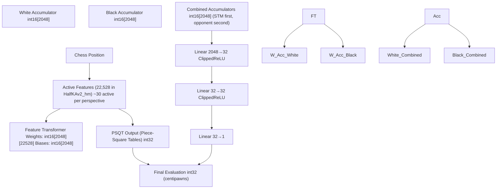
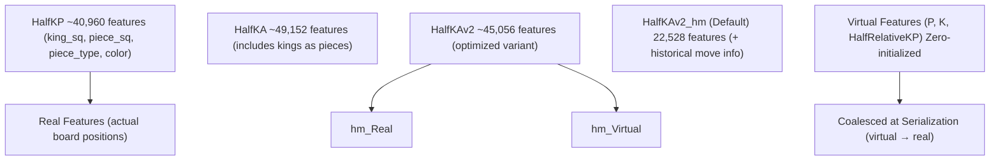
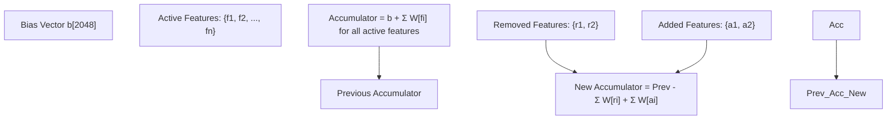
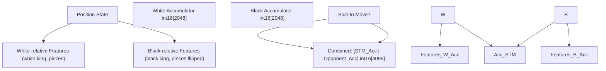
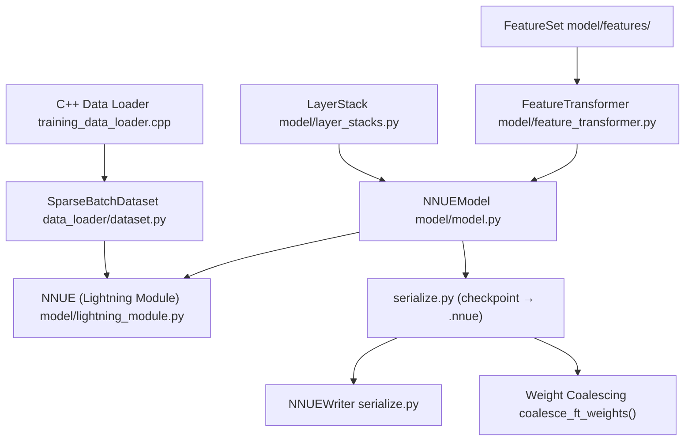
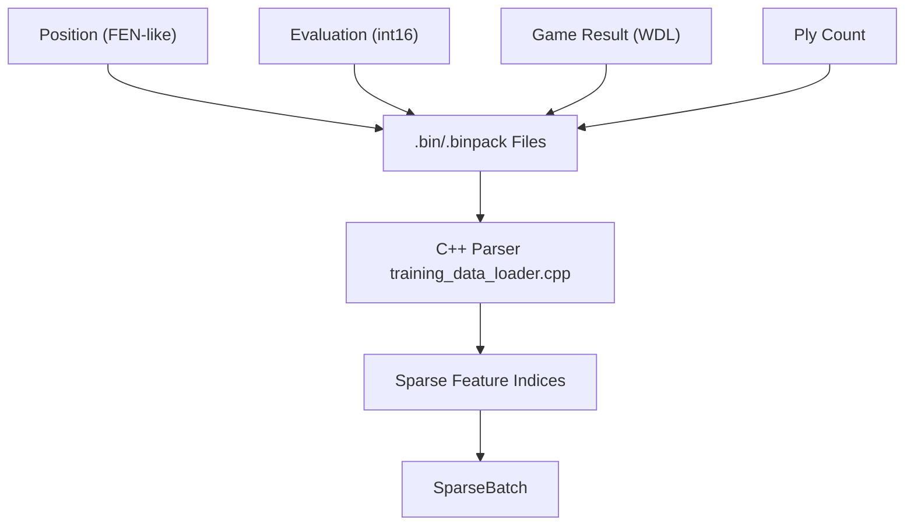

# What is NNUE

-   [docs/img/SFNNv4\_architecture.drawio](https://github.com/Chesszyh/nnue-pytorch/blob/024b2064/docs/img/SFNNv4_architecture.drawio)
-   [docs/img/SFNNv7\_architecture.drawio](https://github.com/Chesszyh/nnue-pytorch/blob/024b2064/docs/img/SFNNv7_architecture.drawio)
-   [docs/img/SFNNv7\_architecture\_detailed.drawio](https://github.com/Chesszyh/nnue-pytorch/blob/024b2064/docs/img/SFNNv7_architecture_detailed.drawio)
-   [docs/img/SFNNv7\_architecture\_detailed\_v2.drawio](https://github.com/Chesszyh/nnue-pytorch/blob/024b2064/docs/img/SFNNv7_architecture_detailed_v2.drawio)
-   [docs/nnue.md](https://github.com/Chesszyh/nnue-pytorch/blob/024b2064/docs/nnue.md)

This page provides a technical introduction to the NNUE (Efficiently Updatable Neural Network) architecture, its core design principles, and its implementation in this repository. For information about setting up the training environment, see [Environment Setup](#1.2). For details about the model architecture implementation, see [Model Architecture](#4).

## Overview

NNUE (ƎUИИ - "Efficiently Updatable Neural Network") is a neural network architecture specifically designed for real-time board game evaluation with extremely low latency requirements. It was invented by Yu Nasu for Shogi and integrated into YaneuraOu in May 2018, then ported to chess by Hisayori Noda for Stockfish in June 2019.

NNUE achieves million(s) of evaluations per second per thread by exploiting three key properties of chess positions:

1.  **Sparse inputs**: Only a small fraction of possible features are active in any position
2.  **Incremental updates**: Consecutive positions differ by only a few features
3.  **Integer quantization**: All computations can be performed in low-precision integer arithmetic

Sources: [docs/nnue.md146-161](https://github.com/Chesszyh/nnue-pytorch/blob/024b2064/docs/nnue.md#L146-L161)

## Core Design Principles

NNUE operates on the following fundamental principles that distinguish it from conventional neural networks:

| Principle | Description | Impact |
| --- | --- | --- |
| **Sparse Inputs** | Network inputs have ~0.1% sparsity (30-40 active features out of 40,000+) | Enables large first layer without computational penalty |
| **Minimal Input Changes** | Each move changes only 2-4 features on average | Allows incremental accumulator updates instead of full evaluation |
| **Quantized Inference** | All operations use int8/int16/int32 arithmetic | Maximizes CPU SIMD throughput (AVX2/AVX-512) |
| **Shallow Architecture** | Typically 2-4 layers total | Minimizes quantization error accumulation |

Sources: [docs/nnue.md146-165](https://github.com/Chesszyh/nnue-pytorch/blob/024b2064/docs/nnue.md#L146-L165)

## High-Level Architecture

The NNUE architecture consists of a large sparse first layer (Feature Transformer) followed by small dense layers (Layer Stacks):


Sources: [docs/nnue.md262-347](https://github.com/Chesszyh/nnue-pytorch/blob/024b2064/docs/nnue.md#L262-L347) [docs/img/SFNNv7\_architecture.drawio1-100](https://github.com/Chesszyh/nnue-pytorch/blob/024b2064/docs/img/SFNNv7_architecture.drawio#L1-L100)

## Feature Sets

NNUE uses **factorized feature sets** that represent the board state from both players' perspectives. The most common feature sets are:


Each feature is a tuple representing a piece relative to a king position. For HalfKP:

-   `(our_king_square, piece_square, piece_type, piece_color)`
-   `piece_type` ∈ {pawn, knight, bishop, rook, queen} (king excluded)
-   Feature index: `piece_square + (piece_type * 2 + piece_color + king_square * 10) * 64`

Sources: [docs/nnue.md300-347](https://github.com/Chesszyh/nnue-pytorch/blob/024b2064/docs/nnue.md#L300-L347) [model/features/](https://github.com/Chesszyh/nnue-pytorch/blob/024b2064/model/features/)

## The Accumulator: Efficient Incremental Updates

The **accumulator** is the core innovation that enables NNUE's efficiency. Instead of recomputing the first layer for each position, NNUE maintains the accumulated state and updates it incrementally:


**Refresh vs Update Operations:**

| Operation | When Used | Cost | Implementation |
| --- | --- | --- | --- |
| **Refresh** | King moves, first evaluation | O(num\_active\_features) | `refresh_accumulator()` in [docs/nnue.md393-412](https://github.com/Chesszyh/nnue-pytorch/blob/024b2064/docs/nnue.md#L393-L412) |
| **Update** | Normal moves (non-king) | O(num\_changed\_features) | `update_accumulator()` in [docs/nnue.md414-448](https://github.com/Chesszyh/nnue-pytorch/blob/024b2064/docs/nnue.md#L414-L448) |

Average features changed per move: **~2.5** (one piece moved, possibly one captured).

Sources: [docs/nnue.md287-450](https://github.com/Chesszyh/nnue-pytorch/blob/024b2064/docs/nnue.md#L287-L450)

## Two-Perspective Architecture

NNUE maintains **two separate accumulators**, one for each player's perspective:


**Perspective Handling Options:**

1.  **Separate weights per perspective**: Larger model, learns color-specific patterns
2.  **Shared weights with orientation**: Board state mirrored/rotated for black

This repository uses **separate weights** by default. The combined accumulator is always arranged with the side-to-move's perspective first, allowing the network to learn tempo.

Sources: [docs/nnue.md311-347](https://github.com/Chesszyh/nnue-pytorch/blob/024b2064/docs/nnue.md#L311-L347)

## Quantization Scheme

NNUE uses fixed-point integer arithmetic throughout inference:

| Layer Type | Weight Type | Bias Type | Activation Type | Scale Factor |
| --- | --- | --- | --- | --- |
| Feature Transformer | `int16` | `int16` | `int16` | 127 |
| Layer Stack Linear | `int8` | `int32` | `int8` | 127 |
| PSQT | `int32` | `int32` | `int32` | 9600 (600×16) |

The quantization scheme is represented as `FP<type, scale>` where:

-   `type`: Integer type (i8, i16, i32)
-   `scale`: Fixed-point scale factor

For example, `FP<i16, 127>` means a float value `x` is stored as `int16(x * 127)`.

**Quantization-Aware Training:** Training maintains float32 weights but clips them to quantization bounds during training using `WeightClippingCallback`. See [Quantization System](#4.5) for details.

Sources: [docs/nnue.md162-164](https://github.com/Chesszyh/nnue-pytorch/blob/024b2064/docs/nnue.md#L162-L164) [docs/nnue.md80-165](https://github.com/Chesszyh/nnue-pytorch/blob/024b2064/docs/nnue.md#L80-L165)

## NNUE Model Components in This Repository

The NNUE implementation in this repository is organized into the following key components:


**Key Classes and Their Roles:**

| Class/Module | Location | Purpose |
| --- | --- | --- |
| `FeatureSet` | [model/features/](https://github.com/Chesszyh/nnue-pytorch/blob/024b2064/model/features/)(various) | Defines feature factorization (HalfKP, HalfKAv2\_hm, etc.) |
| `FeatureTransformer` | [model/feature\_transformer.py](https://github.com/Chesszyh/nnue-pytorch/blob/024b2064/model/feature_transformer.py) | Sparse linear layer with custom CUDA kernels |
| `LayerStack` | [model/layer\_stacks.py](https://github.com/Chesszyh/nnue-pytorch/blob/024b2064/model/layer_stacks.py) | Dense layers with bucketing support |
| `NNUEModel` | [model/model.py](https://github.com/Chesszyh/nnue-pytorch/blob/024b2064/model/model.py) | Complete model combining FT + LS + PSQT |
| `NNUE` | [model/lightning\_module.py](https://github.com/Chesszyh/nnue-pytorch/blob/024b2064/model/lightning_module.py) | PyTorch Lightning wrapper for training |
| `SparseBatchDataset` | [data\_loader/dataset.py](https://github.com/Chesszyh/nnue-pytorch/blob/024b2064/data_loader/dataset.py) | Python interface to C++ data loader |
| `NNUEWriter` | [serialize.py](https://github.com/Chesszyh/nnue-pytorch/blob/024b2064/serialize.py) | Writes quantized binary .nnue format |

Sources: [model/model.py](https://github.com/Chesszyh/nnue-pytorch/blob/024b2064/model/model.py) [model/feature\_transformer.py](https://github.com/Chesszyh/nnue-pytorch/blob/024b2064/model/feature_transformer.py) [model/lightning\_module.py](https://github.com/Chesszyh/nnue-pytorch/blob/024b2064/model/lightning_module.py) [serialize.py](https://github.com/Chesszyh/nnue-pytorch/blob/024b2064/serialize.py)

## Training Data Format

NNUE models are trained on binary packed game data with the following structure:


The data loader extracts:

-   **Active feature indices** for each perspective
-   **Evaluation** (centipawn score)
-   **Game outcome** (win/draw/loss)

These are converted to sparse tensors for efficient GPU training. See [Training Data Formats](#3.1) for details.

Sources: [halfkp\_1024x2-8-32asm/training\_data\_loader.cpp](https://github.com/Chesszyh/nnue-pytorch/blob/024b2064/halfkp_1024x2-8-32asm/training_data_loader.cpp) [data\_loader/dataset.py](https://github.com/Chesszyh/nnue-pytorch/blob/024b2064/data_loader/dataset.py)

## Performance Characteristics

NNUE achieves its speed through several optimizations:

| Optimization | Technique | Impact |
| --- | --- | --- |
| **Sparse First Layer** | Only process active features | ~30 columns instead of 40,960 |
| **Accumulator Updates** | Incremental instead of full refresh | ~2-4 feature updates instead of ~30 |
| **SIMD Instructions** | AVX2/AVX-512 for int8/int16 operations | 16-32 operations per instruction |
| **Low Precision** | int8/int16 arithmetic | Higher throughput than float32 |

**Inference Speed:** Multi-million evaluations per second per thread on modern CPUs.

**Model Size:** Typical Stockfish NNUE is ~20-40MB compressed.

Sources: [docs/nnue.md154-161](https://github.com/Chesszyh/nnue-pytorch/blob/024b2064/docs/nnue.md#L154-L161) [docs/nnue.md269-286](https://github.com/Chesszyh/nnue-pytorch/blob/024b2064/docs/nnue.md#L269-L286)

## Relationship to Stockfish

The NNUE models trained by this repository are designed to be loaded by the Stockfish chess engine:

1.  **Training**: PyTorch trains in float32 with quantization-aware clipping
2.  **Serialization**: [serialize.py](https://github.com/Chesszyh/nnue-pytorch/blob/024b2064/serialize.py) converts to quantized binary format
3.  **Deployment**: Stockfish loads `.nnue` file and performs integer inference

The evaluation flow in Stockfish:

```
Position → Active Features → Accumulator Update → Dense Layers → Evaluation
```
See [NNUE Binary Format](#5.2) for the file format specification compatible with Stockfish.

Sources: [docs/nnue.md1-143](https://github.com/Chesszyh/nnue-pytorch/blob/024b2064/docs/nnue.md#L1-L143) [serialize.py](https://github.com/Chesszyh/nnue-pytorch/blob/024b2064/serialize.py)
