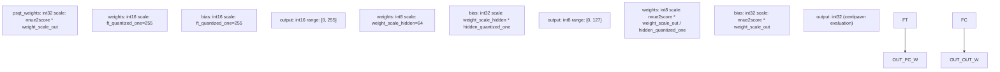
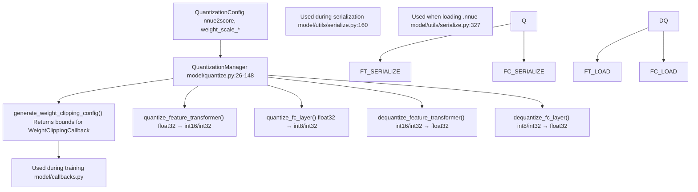
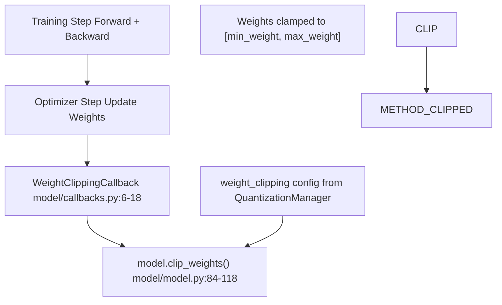
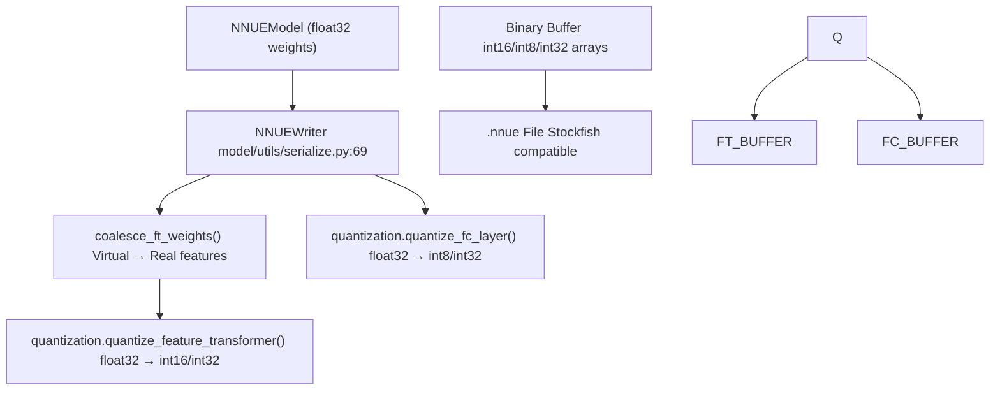

# Quantization System

-   [docs/img/SFNNv4\_architecture.drawio](https://github.com/Chesszyh/nnue-pytorch/blob/024b2064/docs/img/SFNNv4_architecture.drawio)
-   [docs/nnue.md](https://github.com/Chesszyh/nnue-pytorch/blob/024b2064/docs/nnue.md)
-   [model/callbacks.py](https://github.com/Chesszyh/nnue-pytorch/blob/024b2064/model/callbacks.py)
-   [model/features/\_\_init\_\_.py](https://github.com/Chesszyh/nnue-pytorch/blob/024b2064/model/features/__init__.py)
-   [model/features/full\_threats.py](https://github.com/Chesszyh/nnue-pytorch/blob/024b2064/model/features/full_threats.py)
-   [model/model.py](https://github.com/Chesszyh/nnue-pytorch/blob/024b2064/model/model.py)
-   [model/modules/layer\_stacks.py](https://github.com/Chesszyh/nnue-pytorch/blob/024b2064/model/modules/layer_stacks.py)
-   [model/quantize.py](https://github.com/Chesszyh/nnue-pytorch/blob/024b2064/model/quantize.py)
-   [model/utils/coalesce\_weights.py](https://github.com/Chesszyh/nnue-pytorch/blob/024b2064/model/utils/coalesce_weights.py)
-   [model/utils/serialize.py](https://github.com/Chesszyh/nnue-pytorch/blob/024b2064/model/utils/serialize.py)

This page documents the quantization system that converts floating-point NNUE models to low-precision integer formats for efficient inference. Quantization is critical for NNUE evaluation speed, enabling millions of evaluations per second using integer arithmetic (int8/int16/int32) instead of floating-point operations.

For information about the overall model architecture, see [NNUE Network Structure](#4.1). For details on model serialization where quantization is applied, see [Checkpoint Conversion](#5.1) and [NNUE Binary Format](#5.2).

## Quantization Overview

NNUE networks are designed to run in quantized integer domain during inference, while training occurs in float32. The quantization system bridges these two representations by:

1.  **Defining scale factors** that map float ranges to integer ranges
2.  **Clipping weights during training** to stay within quantizable bounds
3.  **Quantizing/dequantizing** weights during serialization and loading
4.  **Accounting for quantization error** in the forward pass during training

The quantization scheme uses different integer types for different layers to balance precision and performance:

| Layer Type | Weight Type | Bias Type | Activation Output |
| --- | --- | --- | --- |
| Feature Transformer | int16 | int16 | int16 (clipped to \[0, 255\]) |
| FC Hidden Layers | int8 | int32 | int8 (clipped to \[0, 127\]) |
| FC Output Layer | int8 | int32 | int32 |

**Diagram: Quantization Data Types by Layer**


Sources: [docs/nnue.md80-164](https://github.com/Chesszyh/nnue-pytorch/blob/024b2064/docs/nnue.md#L80-L164) [model/quantize.py17-148](https://github.com/Chesszyh/nnue-pytorch/blob/024b2064/model/quantize.py#L17-L148)

## Quantization Configuration

The `QuantizationConfig` dataclass defines the scale factors used throughout the quantization process:

**QuantizationConfig Parameters:**

| Parameter | Default | Description |
| --- | --- | --- |
| `nnue2score` | 600.0 | Scale factor to convert network output to centipawn evaluation |
| `weight_scale_hidden` | 64.0 | Weight scale for hidden layer int8 quantization |
| `weight_scale_out` | 16.0 | Weight scale for output layer quantization |
| `ft_quantized_one` | 255.0 | Feature transformer activation range (1.0 → 255) |
| `hidden_quantized_one` | 127.0 | Hidden layer activation range (1.0 → 127) |

These parameters determine the numeric ranges and precision of quantized values. The default values are tuned for Stockfish compatibility and balance between precision and overflow prevention.

Sources: [model/quantize.py17-24](https://github.com/Chesszyh/nnue-pytorch/blob/024b2064/model/quantize.py#L17-L24)

## QuantizationManager

The `QuantizationManager` class handles all quantization operations. It is instantiated with a `QuantizationConfig` and provides methods for:

-   Generating weight clipping bounds for training
-   Quantizing weights/biases to integer formats
-   Dequantizing weights/biases back to float32

**Diagram: QuantizationManager Integration**


Sources: [model/quantize.py26-148](https://github.com/Chesszyh/nnue-pytorch/blob/024b2064/model/quantize.py#L26-L148) [model/model.py34-35](https://github.com/Chesszyh/nnue-pytorch/blob/024b2064/model/model.py#L34-L35) [model/callbacks.py6-18](https://github.com/Chesszyh/nnue-pytorch/blob/024b2064/model/callbacks.py#L6-L18)

### Computed Maximum Weights

The `QuantizationManager` computes maximum allowable weights based on the configuration:

```
self.max_hidden_weight = hidden_quantized_one / weight_scale_hidden# 127 / 64 ≈ 1.984self.max_out_weight = (hidden_quantized_one * hidden_quantized_one) / (nnue2score * weight_scale_out)# (127 * 127) / (600 * 16) ≈ 1.68
```
These bounds ensure weights don't overflow when converted to int8/int16.

Sources: [model/quantize.py34-38](https://github.com/Chesszyh/nnue-pytorch/blob/024b2064/model/quantize.py#L34-L38)

## Feature Transformer Quantization

The feature transformer uses int16 for both weights and biases, with a special scale factor `ft_quantized_one = 255.0`:

**Quantization formula:**

```
quantized_weight = round(float_weight * 255.0) as int16
quantized_bias = round(float_bias * 255.0) as int16
```
**PSQT weights** (piece-square table values) use a different scale:

```
quantized_psqt = round(float_psqt * nnue2score * weight_scale_out) as int32
                = round(float_psqt * 600 * 16) as int32
```
The feature transformer output is clipped to \[0, 255\] to match the quantized representation during inference.

**Implementation:**

[model/quantize.py62-91](https://github.com/Chesszyh/nnue-pytorch/blob/024b2064/model/quantize.py#L62-L91)

```
def quantize_feature_transformer(self, bias, weight, psqt_weight, callback):    bias = bias.mul(self.ft_quantized_one).round().to(torch.int16)    weight = weight.mul(self.ft_quantized_one).round().to(torch.int16)    psqt_weight = (psqt_weight.mul(self.nnue2score * self.weight_scale_out)                   .round().to(torch.int32))    return bias, weight, psqt_weight
```
Sources: [model/quantize.py62-91](https://github.com/Chesszyh/nnue-pytorch/blob/024b2064/model/quantize.py#L62-L91) [model/utils/serialize.py144-174](https://github.com/Chesszyh/nnue-pytorch/blob/024b2064/model/utils/serialize.py#L144-L174)

## FC Layer Quantization

Fully connected layers use int8 for weights and int32 for biases. The scale factors differ between hidden layers and the output layer.

**Hidden Layer Quantization:**

```
kWeightScale = weight_scale_hidden = 64.0
kBiasScale = weight_scale_hidden * hidden_quantized_one = 64 * 127 = 8128

quantized_weight = round(clamp(float_weight, -127/64, 127/64) * 64) as int8
quantized_bias = round(float_bias * 8128) as int32
```
**Output Layer Quantization:**

```
kWeightScale = (nnue2score * weight_scale_out) / hidden_quantized_one
             = (600 * 16) / 127 ≈ 75.59

kBiasScale = nnue2score * weight_scale_out = 600 * 16 = 9600

quantized_weight = round(clamp(float_weight, -max, max) * 75.59) as int8
quantized_bias = round(float_bias * 9600) as int32
```
The clamping prevents overflow when converting to int8 (range: -128 to 127).

**Implementation:**

[model/quantize.py93-127](https://github.com/Chesszyh/nnue-pytorch/blob/024b2064/model/quantize.py#L93-L127)

```
def quantize_fc_layer(self, bias, weight, output_layer=False, callback):    kWeightScale = kWeightScaleOut if output_layer else kWeightScaleHidden    kBiasScale = kBiasScaleOut if output_layer else kBiasScaleHidden    kMaxWeight = self.hidden_quantized_one / kWeightScale        bias = bias.mul(kBiasScale).round().to(torch.int32)    weight = (weight.clamp(-kMaxWeight, kMaxWeight)              .mul(kWeightScale).round().to(torch.int8))    return bias, weight
```
Sources: [model/quantize.py93-127](https://github.com/Chesszyh/nnue-pytorch/blob/024b2064/model/quantize.py#L93-L127) [model/utils/serialize.py176-213](https://github.com/Chesszyh/nnue-pytorch/blob/024b2064/model/utils/serialize.py#L176-L213)

## Weight Clipping During Training

To ensure weights remain quantizable during training, the model clips weights after each training batch using `WeightClippingCallback`. This prevents gradients from pushing weights outside the valid quantization range.

**Diagram: Weight Clipping Flow**


The weight clipping configuration is generated by `QuantizationManager.generate_weight_clipping_config()`:

[model/quantize.py40-60](https://github.com/Chesszyh/nnue-pytorch/blob/024b2064/model/quantize.py#L40-L60)

```
def generate_weight_clipping_config(self, model):    return [        {            "params": [model.layer_stacks.l1.linear.weight],            "min_weight": -self.max_hidden_weight,            "max_weight": self.max_hidden_weight,            "virtual_params": model.layer_stacks.l1.factorized_linear.weight,        },        {            "params": [model.layer_stacks.l2.linear.weight],            "min_weight": -self.max_hidden_weight,            "max_weight": self.max_hidden_weight,        },        {            "params": [model.layer_stacks.output.linear.weight],            "min_weight": -self.max_out_weight,            "max_weight": self.max_out_weight,        },    ]
```
The clipping is applied in `NNUEModel.clip_weights()`:

[model/model.py84-118](https://github.com/Chesszyh/nnue-pytorch/blob/024b2064/model/model.py#L84-L118)

For layers with virtual features (factorized layers), the clipping accounts for the virtual parameter contribution to avoid over-constraining real weights.

Sources: [model/model.py84-118](https://github.com/Chesszyh/nnue-pytorch/blob/024b2064/model/model.py#L84-L118) [model/callbacks.py6-18](https://github.com/Chesszyh/nnue-pytorch/blob/024b2064/model/callbacks.py#L6-L18) [model/quantize.py40-60](https://github.com/Chesszyh/nnue-pytorch/blob/024b2064/model/quantize.py#L40-L60)

## Quantization During Serialization

When converting a trained model to `.nnue` format, the `NNUEWriter` uses the `QuantizationManager` to quantize all weights and biases:

**Diagram: Serialization Quantization Pipeline**


The quantization process includes optional histogram callbacks to inspect the distribution of quantized values:

[model/utils/serialize.py153-162](https://github.com/Chesszyh/nnue-pytorch/blob/024b2064/model/utils/serialize.py#L153-L162)

```
def histogram_callback(bias, weight, psqt_weight):    ascii_hist("ft bias:", bias.numpy())    ascii_hist("ft weight:", weight.numpy())    ascii_hist("ft psqt weight:", psqt_weight.numpy())bias, weight, psqt_weight = model.quantization.quantize_feature_transformer(    bias, weight, psqt_weight, histogram_callback)
```
For FC layers, the callback also reports clipping statistics:

[model/utils/serialize.py183-196](https://github.com/Chesszyh/nnue-pytorch/blob/024b2064/model/utils/serialize.py#L183-L196)

```
def histogram_callback(bias, weight, clipped, total_elements, clipped_max, kMaxWeight):    ascii_hist("fc bias:", bias.numpy())    print("layer has {}/{} clipped weights. Exceeding by {} the maximum {}.".format(        clipped, total_elements, clipped_max, kMaxWeight))    ascii_hist("fc weight:", weight.numpy())
```
Sources: [model/utils/serialize.py69-217](https://github.com/Chesszyh/nnue-pytorch/blob/024b2064/model/utils/serialize.py#L69-L217) [model/utils/coalesce\_weights.py7-19](https://github.com/Chesszyh/nnue-pytorch/blob/024b2064/model/utils/coalesce_weights.py#L7-L19)

## Dequantization During Model Loading

When loading a `.nnue` file back into PyTorch format, the `NNUEReader` dequantizes weights using the inverse operations:

**Feature Transformer Dequantization:**

```
float_weight = int16_weight / ft_quantized_one
float_bias = int16_bias / ft_quantized_one
float_psqt = int32_psqt / (nnue2score * weight_scale_out)
```
**FC Layer Dequantization:**

```
float_weight = int8_weight / kWeightScale
float_bias = int32_bias / kBiasScale
```
[model/quantize.py81-91](https://github.com/Chesszyh/nnue-pytorch/blob/024b2064/model/quantize.py#L81-L91) and [model/quantize.py129-147](https://github.com/Chesszyh/nnue-pytorch/blob/024b2064/model/quantize.py#L129-L147)

This allows fine-tuning or analysis of pretrained networks in PyTorch.

Sources: [model/quantize.py81-91](https://github.com/Chesszyh/nnue-pytorch/blob/024b2064/model/quantize.py#L81-L91) [model/quantize.py129-147](https://github.com/Chesszyh/nnue-pytorch/blob/024b2064/model/quantize.py#L129-L147) [model/utils/serialize.py327-350](https://github.com/Chesszyh/nnue-pytorch/blob/024b2064/model/utils/serialize.py#L327-L350)

## Special Case: Full\_Threats Feature Set

The `Full_Threats` feature set uses a hybrid quantization scheme where threat features (first 79856 features) use int8 quantization while the remaining HalfKA-style features use int16:

[model/utils/serialize.py167-174](https://github.com/Chesszyh/nnue-pytorch/blob/024b2064/model/utils/serialize.py#L167-L174)

```
if model.feature_set.name.startswith("Full_Threats"):    threat_weight = weight[:79856].to(torch.int8)    psq_weight = weight[79856:]    self.write_tensor(threat_weight.flatten().numpy())    self.write_tensor(psq_weight.flatten().numpy(), ft_compression)
```
The threat weights are also clipped more aggressively during training:

[model/model.py119-127](https://github.com/Chesszyh/nnue-pytorch/blob/024b2064/model/model.py#L119-L127)

```
def clip_threat_weights(self):    if self.feature_set.name.startswith("Full_Threats"):        p = self.input.weight[0:79856]        min_weight = -128 / 255        max_weight = 127 / 255        p.data.clamp_(min_weight, max_weight)
```
Sources: [model/model.py119-127](https://github.com/Chesszyh/nnue-pytorch/blob/024b2064/model/model.py#L119-L127) [model/utils/serialize.py167-174](https://github.com/Chesszyh/nnue-pytorch/blob/024b2064/model/utils/serialize.py#L167-L174) [model/features/full\_threats.py1-185](https://github.com/Chesszyh/nnue-pytorch/blob/024b2064/model/features/full_threats.py#L1-L185)

## Summary

The quantization system provides:

1.  **Consistent quantization scheme** matching Stockfish's expectations
2.  **Weight clipping during training** to maintain quantization compatibility
3.  **Seamless conversion** between float32 (training) and int8/int16/int32 (inference)
4.  **Layer-specific scale factors** optimized for precision and performance
5.  **Support for hybrid quantization schemes** (e.g., Full\_Threats)

The key classes are:

-   `QuantizationConfig`: Configuration parameters
-   `QuantizationManager`: Core quantization logic
-   `WeightClippingCallback`: Training-time weight bounds enforcement
-   `NNUEWriter`/`NNUEReader`: Serialization with quantization

Sources: [model/quantize.py1-148](https://github.com/Chesszyh/nnue-pytorch/blob/024b2064/model/quantize.py#L1-L148) [model/model.py1-209](https://github.com/Chesszyh/nnue-pytorch/blob/024b2064/model/model.py#L1-L209) [model/callbacks.py1-18](https://github.com/Chesszyh/nnue-pytorch/blob/024b2064/model/callbacks.py#L1-L18) [model/utils/serialize.py1-361](https://github.com/Chesszyh/nnue-pytorch/blob/024b2064/model/utils/serialize.py#L1-L361)
