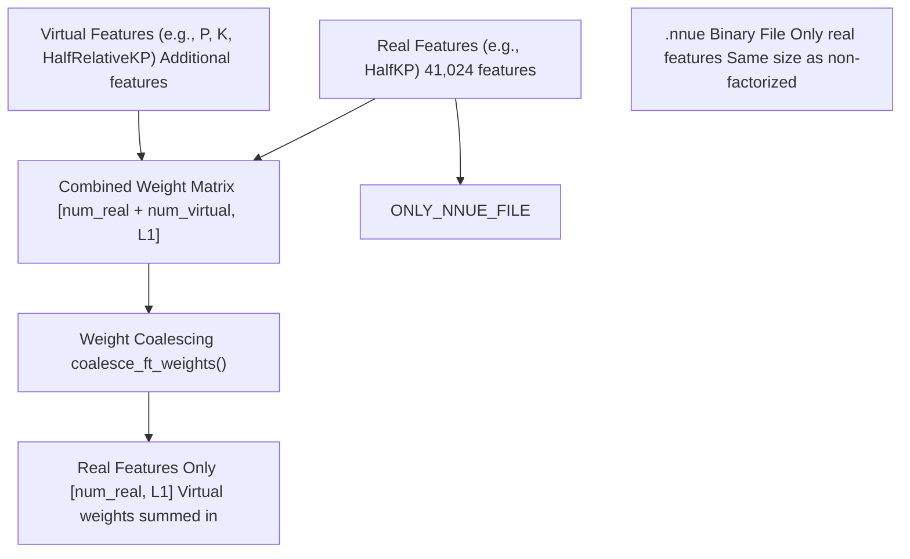
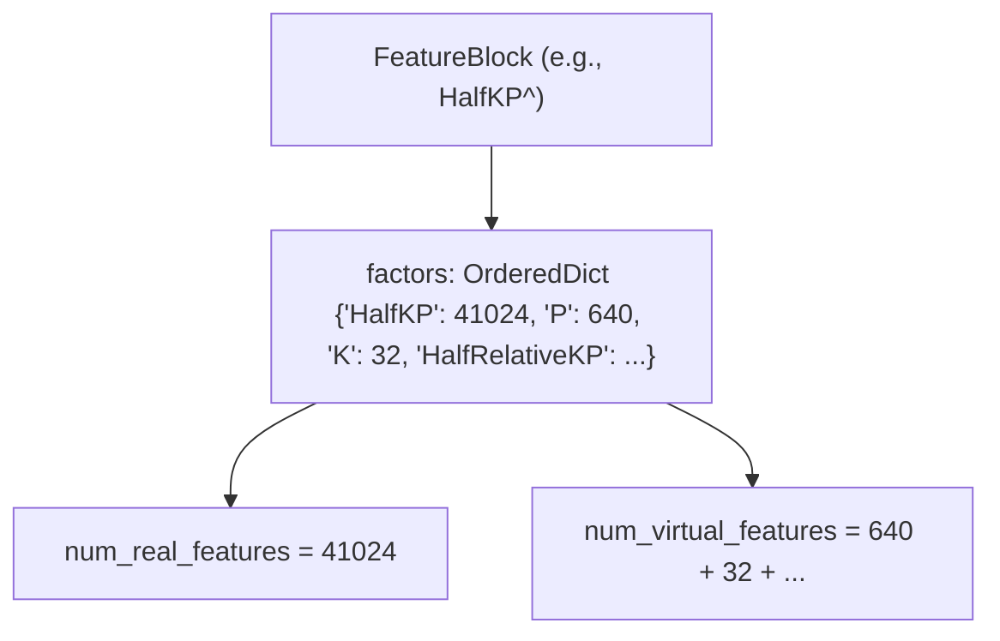
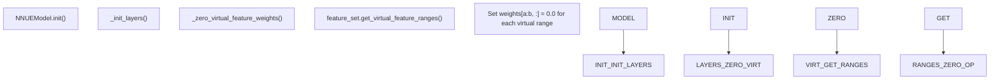
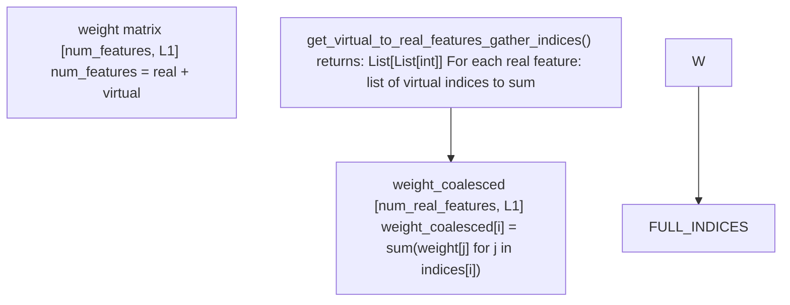
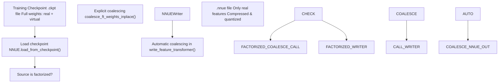
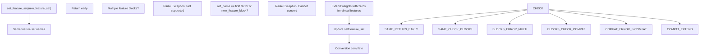

# Virtual Features and Factorization

-   [model/\_\_init\_\_.py](https://github.com/Chesszyh/nnue-pytorch/blob/024b2064/model/__init__.py)
-   [model/model.py](https://github.com/Chesszyh/nnue-pytorch/blob/024b2064/model/model.py)
-   [model/utils/\_\_init\_\_.py](https://github.com/Chesszyh/nnue-pytorch/blob/024b2064/model/utils/__init__.py)
-   [model/utils/coalesce\_weights.py](https://github.com/Chesszyh/nnue-pytorch/blob/024b2064/model/utils/coalesce_weights.py)
-   [model/utils/serialize.py](https://github.com/Chesszyh/nnue-pytorch/blob/024b2064/model/utils/serialize.py)
-   [serialize.py](https://github.com/Chesszyh/nnue-pytorch/blob/024b2064/serialize.py)
-   [visualize.py](https://github.com/Chesszyh/nnue-pytorch/blob/024b2064/visualize.py)
-   [visualize\_multi\_hist.py](https://github.com/Chesszyh/nnue-pytorch/blob/024b2064/visualize_multi_hist.py)

This page documents the virtual feature system and factorization mechanism in the NNUE training architecture. Virtual features are additional feature representations that accelerate training by allowing the model to learn correlated features more efficiently. During training, the model maintains both real and virtual features, but at serialization time, virtual features are "coalesced" (summed) back into real features, resulting in no parameter overhead in the deployed network.

For information about feature sets and their characteristics, see [Feature Sets](#4.2). For details on model serialization, see [Model Serialization](#5).

## Virtual Features Overview

Virtual features are auxiliary feature representations that exist only during training. They provide the model with additional degrees of freedom to learn correlated patterns, but are eliminated during the conversion to the deployment format through a process called weight coalescing.

**Key Characteristics:**

-   **Zero-initialized**: Virtual feature weights start at zero and are learned during training
-   **Training-only**: They exist only in the training model, not in the final `.nnue` file
-   **Coalesced at serialization**: Virtual feature weights are summed into corresponding real features when saving the model
-   **No inference overhead**: The deployed network has the same size as if trained without virtual features


**Sources:** [model/model.py39-52](https://github.com/Chesszyh/nnue-pytorch/blob/024b2064/model/model.py#L39-L52) [model/utils/coalesce\_weights.py7-19](https://github.com/Chesszyh/nnue-pytorch/blob/024b2064/model/utils/coalesce_weights.py#L7-L19)

## Factorization Naming Convention

Feature sets with factorization are indicated by a `^` suffix in their name. For example:

| Base Feature Set | Factorized Version | Virtual Features Added |
| --- | --- | --- |
| `HalfKP` | `HalfKP^` | P, K, HalfRelativeKP |
| `HalfKAv2` | `HalfKAv2^` | Similar factorization |
| `HalfKAv2_hm` | `HalfKAv2_hm^` | Default configuration |

The factorized versions contain both the original real features and additional virtual features that represent sub-components or alternative representations of the same positional information.


**Sources:** [model/model.py128-175](https://github.com/Chesszyh/nnue-pytorch/blob/024b2064/model/model.py#L128-L175) feature block implementations in `model/features/`

## Weight Initialization and Training

During model initialization, virtual feature weights are explicitly zeroed to ensure they start with no influence on the model's predictions. This is critical because virtual features are designed to be learned representations that help with correlated real features.

### Initialization Process


The zeroing operation is performed in [model/model.py43-52](https://github.com/Chesszyh/nnue-pytorch/blob/024b2064/model/model.py#L43-L52):

```
def _zero_virtual_feature_weights(self):    """    We zero all virtual feature weights because there's not need for them    to be initialized; they only aid the training of correlated features.    """    weights = self.input.weight    with torch.no_grad():        for a, b in self.feature_set.get_virtual_feature_ranges():            weights[a:b, :] = 0.0    self.input.weight = nn.Parameter(weights)
```
**Sources:** [model/model.py39-52](https://github.com/Chesszyh/nnue-pytorch/blob/024b2064/model/model.py#L39-L52)

### Training Behavior

During training, both real and virtual feature weights are updated by gradient descent. The optimizer treats them identically, allowing the network to learn useful representations in the virtual features that correlate with and support the real features.

**Weight Clipping Considerations:**

The quantization-aware weight clipping mechanism accounts for virtual features. When virtual feature weights are present, the clipping bounds are adjusted to ensure that when virtual weights are eventually coalesced (summed) with real weights, the result stays within quantization bounds.

See [model/model.py84-117](https://github.com/Chesszyh/nnue-pytorch/blob/024b2064/model/model.py#L84-L117) for the `clip_weights()` implementation that handles virtual features specially through the `virtual_params` mechanism.

**Sources:** [model/model.py84-117](https://github.com/Chesszyh/nnue-pytorch/blob/024b2064/model/model.py#L84-L117)

## Weight Coalescing Process

Weight coalescing is the process of combining virtual feature weights back into real feature weights. This happens at serialization time, producing a weight matrix with only real features.

### Coalescing Algorithm

The coalescing process uses a gather-and-sum operation defined by the feature set's mapping from virtual to real features:


The core implementation is in [model/utils/coalesce\_weights.py7-19](https://github.com/Chesszyh/nnue-pytorch/blob/024b2064/model/utils/coalesce_weights.py#L7-L19):

```
def coalesce_ft_weights(    feature_set: FeatureSet, layer: BaseFeatureTransformer) -> torch.Tensor:    weight = layer.weight.data    indices = feature_set.get_virtual_to_real_features_gather_indices()    weight_coalesced = weight.new_zeros(        (feature_set.num_real_features, weight.shape[1])    )    for i_real, is_virtual in enumerate(indices):        weight_coalesced[i_real, :] = sum(            weight[i_virtual, :] for i_virtual in is_virtual        )    return weight_coalesced
```
**Key Points:**

-   `indices` is a list where `indices[i]` contains all feature indices (real and virtual) that contribute to real feature `i`
-   For real features, this typically includes the feature itself plus related virtual features
-   The sum operation combines all contributing weights

**Sources:** [model/utils/coalesce\_weights.py7-19](https://github.com/Chesszyh/nnue-pytorch/blob/024b2064/model/utils/coalesce_weights.py#L7-L19)

### In-Place Coalescing

An in-place variant exists for scenarios where memory efficiency is critical:

```
def coalesce_ft_weights_inplace(    feature_set: FeatureSet, layer: BaseFeatureTransformer) -> None:    # Creates a new zeroed weight matrix and replaces layer.weight.data    # See model/utils/coalesce_weights.py:22-32
```
**Sources:** [model/utils/coalesce\_weights.py22-32](https://github.com/Chesszyh/nnue-pytorch/blob/024b2064/model/utils/coalesce_weights.py#L22-L32)

## Integration with Serialization

Coalescing is automatically invoked during model serialization to ensure the output `.nnue` file contains only real features.

### Serialization Pipeline with Coalescing


**Sources:** [serialize.py118-152](https://github.com/Chesszyh/nnue-pytorch/blob/024b2064/serialize.py#L118-L152) [model/utils/serialize.py144-174](https://github.com/Chesszyh/nnue-pytorch/blob/024b2064/model/utils/serialize.py#L144-L174)

### Serialization Code Flow

In [serialize.py](https://github.com/Chesszyh/nnue-pytorch/blob/024b2064/serialize.py) when preparing for optimization or permutation:

```
# Lines 122-124, 144-145if not args.source.endswith(".nnue"):    M.coalesce_ft_weights_inplace(nnue.model.feature_set, nnue.model.input)    nnue.model.layer_stacks.coalesce_layer_stacks_inplace()
```
In [model/utils/serialize.py144-174](https://github.com/Chesszyh/nnue-pytorch/blob/024b2064/model/utils/serialize.py#L144-L174) the `NNUEWriter.write_feature_transformer()` method automatically coalesces:

```
# Line 149all_weight = coalesce_ft_weights(model.feature_set, layer)weight = all_weight[:, : model.L1]psqt_weight = all_weight[:, model.L1 :]
```
**Sources:** [serialize.py118-152](https://github.com/Chesszyh/nnue-pytorch/blob/024b2064/serialize.py#L118-L152) [model/utils/serialize.py144-174](https://github.com/Chesszyh/nnue-pytorch/blob/024b2064/model/utils/serialize.py#L144-L174)

## Dynamic Feature Set Conversion

The model supports dynamic conversion from unfactorized to factorized feature sets during training or loading. This is useful for transfer learning or starting from a pre-trained unfactorized network.

### Conversion Algorithm

The `set_feature_set()` method in [model/model.py128-175](https://github.com/Chesszyh/nnue-pytorch/blob/024b2064/model/model.py#L128-L175) handles this conversion:


The conversion checks if the current feature block name matches the first factor in the new factorized feature block. For example, converting from `HalfKP` to `HalfKP^` is allowed because `HalfKP` is the first factor in the `factors` OrderedDict of `HalfKP^`.

**Sources:** [model/model.py128-175](https://github.com/Chesszyh/nnue-pytorch/blob/024b2064/model/model.py#L128-L175)

## Visualization of Coalesced Weights

The visualization tools automatically coalesce weights before displaying them to show the effective weights that will be deployed:

```
# visualize.py:42-44weights = M.coalesce_ft_weights(self.model.feature_set, self.model.input)weights = weights[:, : self.model.L1]weights = weights.flatten().numpy()
```
This ensures that visualizations reflect the actual deployed network behavior, not the training-time representation with virtual features.

**Sources:** [visualize.py40-52](https://github.com/Chesszyh/nnue-pytorch/blob/024b2064/visualize.py#L40-L52) [visualize\_multi\_hist.py91-96](https://github.com/Chesszyh/nnue-pytorch/blob/024b2064/visualize_multi_hist.py#L91-L96)

## Benefits and Use Cases

### Training Acceleration

Virtual features allow the network to learn decomposed representations. For example, in `HalfKP^`:

-   Real feature: `HalfKP` (king position + piece position)
-   Virtual features: `P` (piece only), `K` (king only), `HalfRelativeKP` (relative position)

The network can learn that certain patterns depend primarily on piece position, while others depend on king-piece relationships. This decomposition often leads to faster convergence.

### No Inference Cost

Because virtual features are coalesced at serialization:

-   The final `.nnue` file has the same size as a non-factorized network
-   Inference speed is identical
-   All training benefits come "for free" at deployment time

### Compatibility

The coalescing mechanism ensures that:

-   Networks trained with factorization are compatible with inference engines expecting unfactorized features
-   The feature set name in the deployed network matches the base feature set (e.g., `HalfKP`, not `HalfKP^`)

**Sources:** [model/model.py39-52](https://github.com/Chesszyh/nnue-pytorch/blob/024b2064/model/model.py#L39-L52) [model/utils/serialize.py144-174](https://github.com/Chesszyh/nnue-pytorch/blob/024b2064/model/utils/serialize.py#L144-L174)

## Summary Table

| Aspect | Training | Serialization | Deployment |
| --- | --- | --- | --- |
| **Feature Count** | Real + Virtual | Virtual coalesced to Real | Real only |
| **Weight Matrix Size** | `[num_real + num_virtual, L1]` | Intermediate | `[num_real, L1]` |
| **Virtual Weights** | Learned by gradient descent | Summed into real weights | Not present |
| **Memory Overhead** | Higher (virtual features) | Temporary during conversion | None |
| **File Format** | `.ckpt` (PyTorch) | `.pt` or `.nnue` | `.nnue` |
| **Inference Cost** | N/A | N/A | Same as unfactorized |

**Sources:** [model/model.py10-209](https://github.com/Chesszyh/nnue-pytorch/blob/024b2064/model/model.py#L10-L209) [model/utils/coalesce\_weights.py1-33](https://github.com/Chesszyh/nnue-pytorch/blob/024b2064/model/utils/coalesce_weights.py#L1-L33) [model/utils/serialize.py69-217](https://github.com/Chesszyh/nnue-pytorch/blob/024b2064/model/utils/serialize.py#L69-L217)
