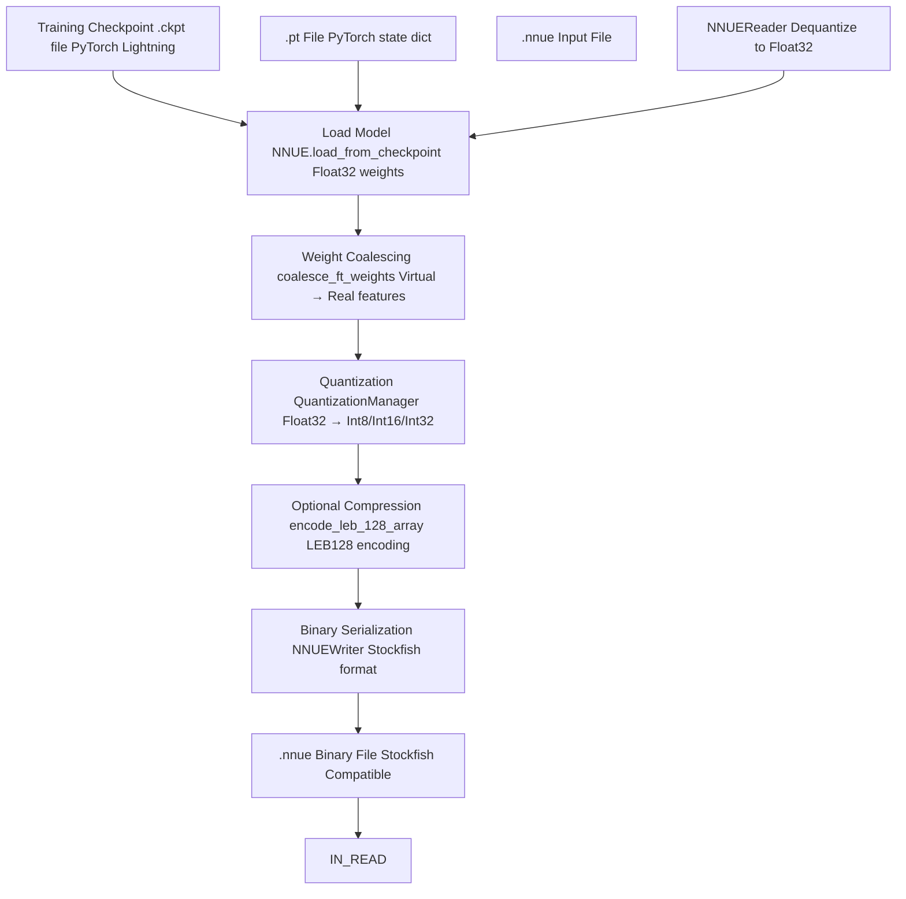
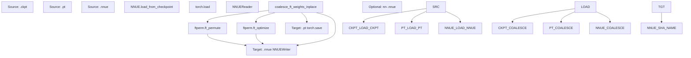
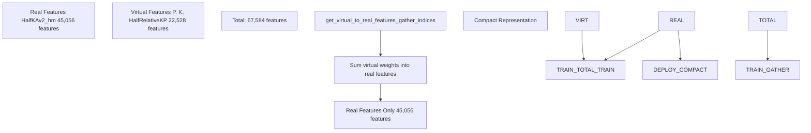
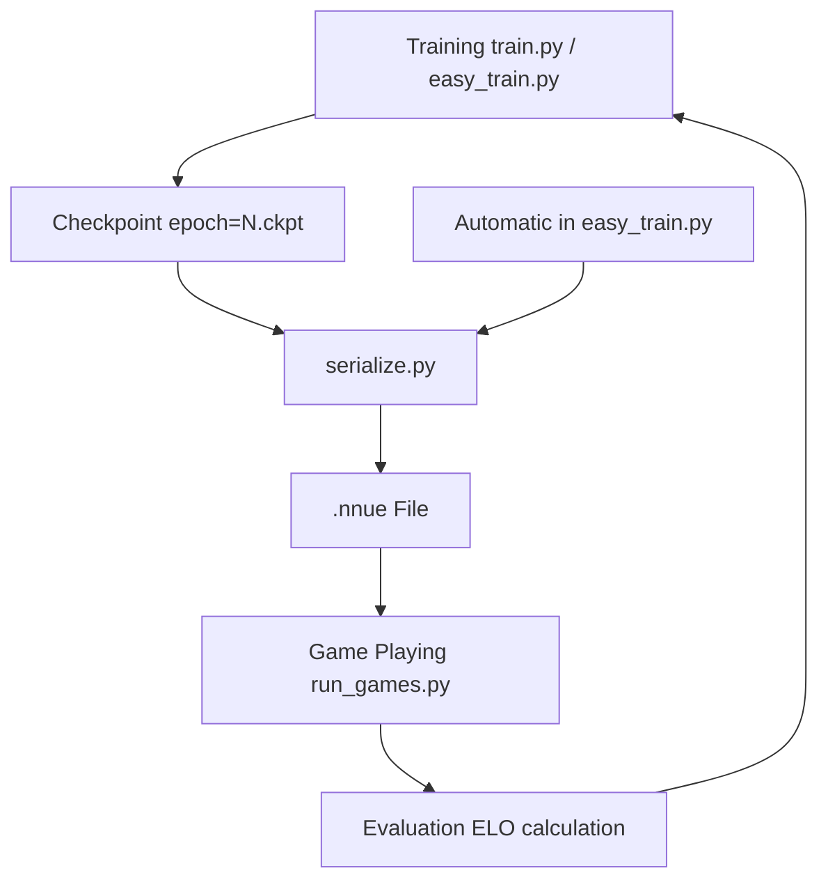

# Model Serialization

-   [model/\_\_init\_\_.py](https://github.com/Chesszyh/nnue-pytorch/blob/024b2064/model/__init__.py)
-   [model/model.py](https://github.com/Chesszyh/nnue-pytorch/blob/024b2064/model/model.py)
-   [model/utils/\_\_init\_\_.py](https://github.com/Chesszyh/nnue-pytorch/blob/024b2064/model/utils/__init__.py)
-   [model/utils/coalesce\_weights.py](https://github.com/Chesszyh/nnue-pytorch/blob/024b2064/model/utils/coalesce_weights.py)
-   [model/utils/serialize.py](https://github.com/Chesszyh/nnue-pytorch/blob/024b2064/model/utils/serialize.py)
-   [serialize.py](https://github.com/Chesszyh/nnue-pytorch/blob/024b2064/serialize.py)
-   [visualize.py](https://github.com/Chesszyh/nnue-pytorch/blob/024b2064/visualize.py)
-   [visualize\_multi\_hist.py](https://github.com/Chesszyh/nnue-pytorch/blob/024b2064/visualize_multi_hist.py)

This document covers the model serialization system, which handles conversion between training checkpoints and deployment-ready NNUE binary files. The serialization pipeline supports three formats: PyTorch Lightning checkpoints (`.ckpt`), PyTorch state dictionaries (`.pt`), and Stockfish-compatible NNUE binary files (`.nnue`). This includes weight coalescing, quantization, compression, and optional feature transformer optimization.

For information about the quantization scheme itself, see [Quantization System](#4.5). For feature transformer optimization through permutation, see [Feature Transformer Permutation](#6.1). For visualization of serialized models, see [Model Visualization](#5.4).

## Conversion Pipeline Overview

The serialization system transforms floating-point training checkpoints into compact integer-quantized binary files suitable for fast inference in chess engines. The pipeline handles several critical transformations:


**Sources:** [serialize.py1-186](https://github.com/Chesszyh/nnue-pytorch/blob/024b2064/serialize.py#L1-L186) [model/utils/serialize.py1-361](https://github.com/Chesszyh/nnue-pytorch/blob/024b2064/model/utils/serialize.py#L1-L361)

## Format Conversion Script

The `serialize.py` script provides the command-line interface for all format conversions. It supports bidirectional conversion between `.ckpt`, `.pt`, and `.nnue` formats.

### Command-Line Interface

| Argument | Type | Description |
| --- | --- | --- |
| `source` | positional | Source file (`.ckpt`, `.pt`, or `.nnue`) |
| `target` | positional | Target file (`.pt` or `.nnue`) |
| `--out-sha` | flag | Name output as `nn-<sha>.nnue` based on content hash |
| `--description` | string | Description string embedded in `.nnue` header |
| `--ft_compression` | string | Compression method: `none` or `leb128` (default: `leb128`) |
| `--ft_perm` | path | Apply pre-computed feature transformer permutation |
| `--ft_optimize` | flag | Run full feature transformer optimization (time-consuming) |
| `--ft_optimize_data` | path | Dataset path for FT optimization |
| `--ft_optimize_count` | int | Number of positions for FT optimization (default: 10000) |
| `--l1` | int | Feature transformer size (must match trained model) |

### Conversion Flow


**Sources:** [serialize.py10-182](https://github.com/Chesszyh/nnue-pytorch/blob/024b2064/serialize.py#L10-L182)

### Loading Models

The script handles three source formats:

**PyTorch Lightning Checkpoint (`.ckpt`):**

```
# serialize.py:83-91nnue = M.NNUE.load_from_checkpoint(    args.source,    feature_set=feature_set,    config=M.ModelConfig(L1=args.l1),    quantize_config=M.QuantizationConfig(),    map_location=torch.device("cpu"))
```
**PyTorch State Dictionary (`.pt`):**

```
# serialize.py:92-93nnue = torch.load(args.source, weights_only=False)
```
**NNUE Binary (`.nnue`):**

```
# serialize.py:94-104with open(args.source, 'rb') as f:    nnue = M.NNUE(feature_set, M.ModelConfig(L1=args.l1), M.QuantizationConfig())    reader = M.NNUEReader(f, feature_set, M.ModelConfig(L1=args.l1), M.QuantizationConfig())    nnue.model = reader.model
```
**Sources:** [serialize.py83-106](https://github.com/Chesszyh/nnue-pytorch/blob/024b2064/serialize.py#L83-L106)

### Pre-Serialization Processing

Before writing to `.nnue` format, the script may perform weight coalescing and feature transformer optimization:

**Weight Coalescing:** Required when converting from factorized feature sets (with virtual features) to compact binary format. This operation sums virtual feature weights into their corresponding real features.

```
# serialize.py:122-123, 144-145M.coalesce_ft_weights_inplace(nnue.model.feature_set, nnue.model.input)nnue.model.layer_stacks.coalesce_layer_stacks_inplace()
```
**Feature Transformer Permutation:** Reorders feature transformer weights to maximize zero-valued blocks, improving SIMD efficiency during inference.

```
# serialize.py:118-125if args.ft_perm is not None and target_is_nnue:    import ftperm    if not args.source.endswith('.nnue'):        M.coalesce_ft_weights_inplace(nnue.model.feature_set, nnue.model.input)        nnue.model.layer_stacks.coalesce_layer_stacks_inplace()    ftperm.ft_permute(nnue.model, args.ft_perm)
```
**Sources:** [serialize.py115-152](https://github.com/Chesszyh/nnue-pytorch/blob/024b2064/serialize.py#L115-L152)

## NNUE Binary Format Structure

The `.nnue` binary format is a compact, Stockfish-compatible representation of the neural network. All values are stored in little-endian byte order.

### File Structure

```mermaid
flowchart TD
    FILE["NNUE Binary File"]
    HEADER["Header Version: 0x7AF32F20 Hash: Feature set + Architecture Description: UTF-8 string"]
    FT_SECTION["Feature Transformer Section Hash: feature_set.hash ^ (L1 * 2)"]
    FT_BIAS["FT Bias int16[L1] or compressed"]
    FT_WEIGHT["FT Weights int16[num_features][L1] or compressed"]
    FT_PSQT["PSQT Weights int32[num_features][num_psqt_buckets]"]
    FC_SECTIONS["FC Layer Sections (8 buckets)"]
    FC_HASH["FC Hash Architecture signature"]
    L1["L1 Layer Bias: int32[L2+1] Weight: int8[L2+1][L1*2] (padded to 32)"]
    L2["L2 Layer Bias: int32[L3] Weight: int8[L3][2*L2] (padded to 32)"]
    OUTPUT["Output Layer Bias: int32[1] Weight: int8[1][L3] (padded to 32)"]

    FILE --> HEADER
    FILE --> FT_SECTION
    FT --> SECTION_FT_BIAS
    FT --> SECTION_FT_WEIGHT
    FT --> SECTION_FT_PSQT
    FILE --> FC_SECTIONS
    FC --> SECTIONS_FC_HASH
    FC --> SECTIONS_L1
    FC --> SECTIONS_L2
    FC --> SECTIONS_OUTPUT
```


**Sources:** [model/utils/serialize.py64-217](https://github.com/Chesszyh/nnue-pytorch/blob/024b2064/model/utils/serialize.py#L64-L217)

### Header Format

The header contains version information, architecture hash, and optional description:

| Offset | Type | Field | Description |
| --- | --- | --- | --- |
| 0x00 | uint32 | Version | Fixed value: `0x7AF32F20` |
| 0x04 | uint32 | Hash | `fc_hash ^ feature_set.hash ^ (L1 * 2)` |
| 0x08 | uint32 | Description Length | Length of UTF-8 description string |
| 0x0C | bytes | Description | UTF-8 encoded description |

```
# model/utils/serialize.py:121-128def write_header(self, model: NNUEModel, fc_hash: int, description: str) -> None:    self.int32(VERSION)  # version    self.int32(fc_hash ^ model.feature_set.hash ^ (model.L1 * 2))  # network hash    encoded_description = description.encode('utf-8')    self.int32(len(encoded_description))    self.buf.extend(encoded_description)
```
**Sources:** [model/utils/serialize.py64-128](https://github.com/Chesszyh/nnue-pytorch/blob/024b2064/model/utils/serialize.py#L64-L128)

### Architecture Hashing

The file uses cryptographic hashing to ensure architecture compatibility:

```
# model/utils/serialize.py:98-119@staticmethoddef fc_hash(model: NNUEModel) -> int:    # InputSlice hash    prev_hash = 0xEC42E90D    prev_hash ^= model.L1 * 2        # Fully connected layers    layers = [model.layer_stacks.l1.linear, model.layer_stacks.l2.linear,               model.layer_stacks.output.linear]    for layer in layers:        layer_hash = 0xCC03DAE4        layer_hash += layer.out_features // model.num_ls_buckets        layer_hash ^= prev_hash >> 1        layer_hash ^= (prev_hash << 31) & 0xFFFFFFFF        if layer.out_features // model.num_ls_buckets != 1:            layer_hash = (layer_hash + 0x538D24C7) & 0xFFFFFFFF  # Clipped ReLU hash        prev_hash = layer_hash    return layer_hash
```
**Sources:** [model/utils/serialize.py98-119](https://github.com/Chesszyh/nnue-pytorch/blob/024b2064/model/utils/serialize.py#L98-L119)

## Weight Quantization

The serialization process quantizes floating-point weights to integer types according to the quantization scheme:

| Layer | Weight Type | Bias Type | Scale Factor |
| --- | --- | --- | --- |
| Feature Transformer | int16 | int16 | 127 |
| Feature Transformer (Full\_Threats subset) | int8 | int16 | 127 |
| PSQT | int32 | n/a | 600 \* 127 |
| FC Layers | int8 | int32 | 127 |
| Output Layer | int8 | int32 | 127 \* 9600 |

### Feature Transformer Quantization

```
# model/utils/serialize.py:144-174def write_feature_transformer(self, model: NNUEModel, ft_compression: str) -> None:    layer = model.input    bias = layer.bias.data[:model.L1]        all_weight = coalesce_ft_weights(model.feature_set, layer)    weight = all_weight[:, :model.L1]    psqt_weight = all_weight[:, model.L1:]        bias, weight, psqt_weight = model.quantization.quantize_feature_transformer(        bias, weight, psqt_weight, histogram_callback    )        # Weights stored as [num_features][outputs]    self.write_tensor(bias.flatten().numpy(), ft_compression)        # Special handling for Full_Threats feature set    if model.feature_set.name.startswith('Full_Threats'):        threat_weight = weight[:79856].to(torch.int8)        psq_weight = weight[79856:]        self.write_tensor(threat_weight.flatten().numpy())        self.write_tensor(psq_weight.flatten().numpy(), ft_compression)    else:        self.write_tensor(weight.flatten().numpy(), ft_compression)        self.write_tensor(psqt_weight.flatten().numpy(), ft_compression)
```
**Sources:** [model/utils/serialize.py144-174](https://github.com/Chesszyh/nnue-pytorch/blob/024b2064/model/utils/serialize.py#L144-L174)

### Fully-Connected Layer Quantization

FC layers use int8 weights with 32-element input padding:

```
# model/utils/serialize.py:176-213def write_fc_layer(self, model: NNUEModel, layer: nn.Linear, is_output=False) -> None:    bias = layer.bias.data    weight = layer.weight.data        bias, weight = model.quantization.quantize_fc_layer(        bias, weight, is_output, histogram_callback    )        # FC inputs are padded to 32 elements by spec    num_input = weight.shape[1]    if num_input % 32 != 0:        num_input += 32 - (num_input % 32)        new_w = torch.zeros(weight.shape[0], num_input, dtype=torch.int8)        new_w[:, :weight.shape[1]] = weight        weight = new_w        self.buf.extend(bias.flatten().numpy().tobytes())    self.buf.extend(weight.flatten().numpy().tobytes())
```
**Sources:** [model/utils/serialize.py176-213](https://github.com/Chesszyh/nnue-pytorch/blob/024b2064/model/utils/serialize.py#L176-L213)

## Weight Coalescing

Weight coalescing transforms factorized feature sets (which include virtual features for training acceleration) into compact real-only representations suitable for deployment.

### Virtual to Real Feature Mapping


**Sources:** [model/utils/coalesce\_weights.py1-33](https://github.com/Chesszyh/nnue-pytorch/blob/024b2064/model/utils/coalesce_weights.py#L1-L33)

### Coalescing Implementation

The `coalesce_ft_weights` function maps virtual features to their corresponding real features:

```
# model/utils/coalesce_weights.py:7-19def coalesce_ft_weights(    feature_set: FeatureSet, layer: BaseFeatureTransformer) -> torch.Tensor:    weight = layer.weight.data    indices = feature_set.get_virtual_to_real_features_gather_indices()    weight_coalesced = weight.new_zeros(        (feature_set.num_real_features, weight.shape[1])    )    for i_real, is_virtual in enumerate(indices):        weight_coalesced[i_real, :] = sum(            weight[i_virtual, :] for i_virtual in is_virtual        )    return weight_coalesced
```
The in-place variant modifies the layer directly:

```
# model/utils/coalesce_weights.py:22-33def coalesce_ft_weights_inplace(    feature_set: FeatureSet, layer: BaseFeatureTransformer) -> None:    weight = layer.weight.data    indices = feature_set.get_virtual_to_real_features_gather_indices()    weight_coalesced = torch.zeros_like(weight)    for i_real, is_virtual in enumerate(indices):        weight_coalesced[i_real, :] = sum(            weight[i_virtual, :] for i_virtual in is_virtual        )    layer.weight.data = weight_coalesced
```
**Sources:** [model/utils/coalesce\_weights.py7-33](https://github.com/Chesszyh/nnue-pytorch/blob/024b2064/model/utils/coalesce_weights.py#L7-L33)

### Why Coalescing is Required

During training, virtual features allow the network to learn correlated patterns more effectively. For example, a "piece on square" feature might have corresponding virtual features for "piece anywhere" and "king position." The gradients from the virtual features help train the real features faster.

At deployment time, only real features are evaluated, so virtual feature weights must be summed back into their real counterparts. This maintains model accuracy while reducing the feature count by approximately 33% for `HalfKAv2_hm^`.

**Sources:** [model/model.py43-52](https://github.com/Chesszyh/nnue-pytorch/blob/024b2064/model/model.py#L43-L52) [serialize.py122-145](https://github.com/Chesszyh/nnue-pytorch/blob/024b2064/serialize.py#L122-L145)

## Compression

The NNUE format supports LEB128 (Little Endian Base 128) compression for feature transformer weights and biases, which typically reduces file size by 20-40%.

### LEB128 Encoding

LEB128 is a variable-length integer encoding that uses 7 bits per byte for data and 1 bit as a continuation flag:

```
# model/utils/serialize.py:32-43@njitdef encode_leb_128_array(arr: npt.NDArray) -> list:    res = []    for v in arr:        while True:            byte = v & 0x7F            v = v >> 7            if (v == 0 and byte & 0x40 == 0) or (v == -1 and byte & 0x40 != 0):                res.append(byte)                break            res.append(byte | 0x80)    return res
```
### Compression Format

Compressed tensors are prefixed with a magic string:

```
# model/utils/serialize.py:135-142def write_tensor(self, arr: npt.NDArray, compression='none') -> None:    if compression == 'none':        self.buf.extend(arr.tobytes())    elif compression == 'leb128':        self.buf.extend('COMPRESSED_LEB128'.encode('utf-8'))        self.write_leb_128_array(arr)    else:        raise Exception('Invalid compression method.')
```
### Compression Trade-offs

| Aspect | Uncompressed | LEB128 Compressed |
| --- | --- | --- |
| File Size | ~50-100 MB | ~30-70 MB |
| Load Time | Faster | Slower (~10-20% overhead) |
| Use Case | Local development | Distribution |

Compression is particularly effective for feature transformer weights because many weights are small integers that compress well. The `--ft_compression` argument defaults to `leb128` for this reason.

**Sources:** [model/utils/serialize.py32-310](https://github.com/Chesszyh/nnue-pytorch/blob/024b2064/model/utils/serialize.py#L32-L310) [serialize.py30-35](https://github.com/Chesszyh/nnue-pytorch/blob/024b2064/serialize.py#L30-L35)

## Reading NNUE Files

The `NNUEReader` class deserializes `.nnue` files back into PyTorch models:

```
# model/utils/serialize.py:219-264class NNUEReader:    def __init__(self, f: BinaryIO, feature_set: FeatureSet,                  config: ModelConfig, quantize_config: QuantizationConfig):        self.f = f        self.feature_set = feature_set        self.model = NNUEModel(feature_set, config, quantize_config)        self.config = config        fc_hash = NNUEWriter.fc_hash(self.model)                self.read_header(feature_set, fc_hash)        self.read_int32(feature_set.hash ^ (self.config.L1 * 2))  # FT hash        self.read_feature_transformer(self.model.input, self.model.num_psqt_buckets)                # Read FC layers for each bucket        for i in range(self.model.num_ls_buckets):            l1 = nn.Linear(2 * self.config.L1 // 2, self.config.L2 + 1)            l2 = nn.Linear(self.config.L2 * 2, self.config.L3)            output = nn.Linear(self.config.L3, 1)                        self.read_int32(fc_hash)  # FC layers hash            self.read_fc_layer(l1)            self.read_fc_layer(l2)            self.read_fc_layer(output, is_output=True)                        # Copy into bucketed layer stacks            self.model.layer_stacks.l1.linear.weight.data[i*(self.config.L2+1):(i+1)*(self.config.L2+1), :] = l1.weight            # ... similar for biases and other layers
```
### Decompression

The reader automatically detects and handles compressed tensors:

```
# model/utils/serialize.py:291-310def determine_compression(self) -> str:    leb128_magic = b'COMPRESSED_LEB128'    if self.peek(len(leb128_magic)) == leb128_magic:        self.f.read(len(leb128_magic))  # actually advance the file pointer        return 'leb128'    else:        return 'none'def tensor(self, dtype: npt.DTypeLike, shape: Sequence[int]) -> torch.Tensor:    compression = self.determine_compression()        if compression == 'none':        d = np.fromfile(self.f, dtype, reduce(operator.mul, shape, 1))        d = torch.from_numpy(d.astype(np.float32))        d = d.reshape(shape)        return d    elif compression == 'leb128':        return self.read_leb_128_array(dtype, shape)
```
**Sources:** [model/utils/serialize.py219-310](https://github.com/Chesszyh/nnue-pytorch/blob/024b2064/model/utils/serialize.py#L219-L310)

## Model Loading Utility

The `load_model` utility provides a unified interface for loading models from any format:

```
# model/utils/load_model.py (inferred from usage)def load_model(path, feature_set, config, quantize_config):    if path.endswith('.ckpt'):        return NNUE.load_from_checkpoint(path, feature_set=feature_set,                                         config=config, quantize_config=quantize_config)    elif path.endswith('.pt'):        return torch.load(path, weights_only=False)    elif path.endswith('.nnue'):        with open(path, 'rb') as f:            nnue = NNUE(feature_set, config, quantize_config)            reader = NNUEReader(f, feature_set, config, quantize_config)            nnue.model = reader.model            return nnue.model
```
This utility is used by visualization tools and evaluation scripts to load models uniformly.

**Sources:** [visualize.py666-668](https://github.com/Chesszyh/nnue-pytorch/blob/024b2064/visualize.py#L666-L668) [model/\_\_init\_\_.py10](https://github.com/Chesszyh/nnue-pytorch/blob/024b2064/model/__init__.py#L10-L10)

## Content-Addressed Storage

The `--out-sha` option generates filenames based on the network's SHA256 hash:

```
# serialize.py:170-175if args.out_sha:    sha = hashlib.sha256(buf).hexdigest()    final_path = os.path.join(out_dir, f'nn-{sha[:12]}.nnue')    with open(final_path, 'wb') as f:        f.write(buf)    print(f'Wrote {final_path}')
```
This ensures that identical networks have identical filenames, making it easy to:

-   Deduplicate networks across training runs
-   Version control networks by content
-   Verify network integrity

The Stockfish project uses this naming convention (e.g., `nn-1111cefa1111.nnue`).

**Sources:** [serialize.py17-175](https://github.com/Chesszyh/nnue-pytorch/blob/024b2064/serialize.py#L17-L175)

## Usage Examples

### Basic Conversion

Convert a training checkpoint to NNUE format:

```
python serialize.py epoch=50.ckpt output.nnue --features HalfKAv2_hm^ --l1 1024
```
### Content-Addressed Output

Generate a content-hashed filename:

```
python serialize.py epoch=50.ckpt output_dir/ --out-sha --features HalfKAv2_hm^# Creates output_dir/nn-<hash>.nnue
```
### Compression Options

Disable compression for faster loading:

```
python serialize.py model.ckpt output.nnue --ft_compression none
```
### With Feature Transformer Optimization

Apply full FT optimization (time-consuming):

```
python serialize.py model.ckpt output.nnue \    --ft_optimize \    --ft_optimize_data training_data.bin \    --ft_optimize_count 50000
```
### Apply Pre-computed Permutation

Use a pre-computed permutation file:

```
python serialize.py model.ckpt output.nnue --ft_perm perm.txt
```
### Roundtrip Conversion

Convert NNUE back to PyTorch for further training:

```
python serialize.py model.nnue model.pt --features HalfKAv2_hm --l1 1024
```
**Sources:** [serialize.py10-82](https://github.com/Chesszyh/nnue-pytorch/blob/024b2064/serialize.py#L10-L82)

## Integration with Training Pipeline

The serialization system integrates with the training pipeline through automatic checkpoint conversion:


The `easy_train.py` orchestrator automatically converts new checkpoints to NNUE format and submits them for evaluation, creating a continuous training-evaluation loop.

**Sources:** [serialize.py1-186](https://github.com/Chesszyh/nnue-pytorch/blob/024b2064/serialize.py#L1-L186) Diagram 3 from system overview
