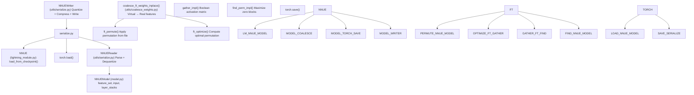

# Checkpoint Conversion (serialize.py)

-   [model/\_\_init\_\_.py](https://github.com/Chesszyh/nnue-pytorch/blob/024b2064/model/__init__.py)
-   [model/utils/\_\_init\_\_.py](https://github.com/Chesszyh/nnue-pytorch/blob/024b2064/model/utils/__init__.py)
-   [serialize.py](https://github.com/Chesszyh/nnue-pytorch/blob/024b2064/serialize.py)
-   [visualize.py](https://github.com/Chesszyh/nnue-pytorch/blob/024b2064/visualize.py)
-   [visualize\_multi\_hist.py](https://github.com/Chesszyh/nnue-pytorch/blob/024b2064/visualize_multi_hist.py)

## Purpose and Scope

This page documents the `serialize.py` script, which converts NNUE models between different file formats: PyTorch Lightning checkpoints (`.ckpt`), PyTorch state dictionaries (`.pt`), and Stockfish-compatible binary files (`.nnue`). The script also supports optional optimization steps during conversion, including weight coalescing, compression, and feature transformer permutation.

For details about the `.nnue` binary file format structure, see [NNUE Binary Format](#5.2). For in-depth documentation of weight coalescing and compression algorithms, see [Weight Coalescing and Compression](#5.3). For tools to inspect converted models, see [Model Visualization](#5.4).

## Supported Format Conversions

The `serialize.py` script supports conversions between three file formats:

| Source Format | Target Format | Notes |
| --- | --- | --- |
| `.ckpt` | `.pt` | Converts PyTorch Lightning checkpoint to plain PyTorch model |
| `.ckpt` | `.nnue` | Converts checkpoint to deployable Stockfish binary |
| `.pt` | `.nnue` | Converts PyTorch model to Stockfish binary |
| `.nnue` | `.pt` | Loads binary format back to PyTorch (for inspection) |
| `.nnue` | `.nnue` | Re-serializes with different options (compression, permutation) |

**Note**: Converting **to** `.ckpt` format is not supported [serialize.py154-155](https://github.com/Chesszyh/nnue-pytorch/blob/024b2064/serialize.py#L154-L155)

Sources: [serialize.py1-186](https://github.com/Chesszyh/nnue-pytorch/blob/024b2064/serialize.py#L1-L186)

## Command-Line Interface

### Basic Usage

```
python serialize.py SOURCE TARGET [OPTIONS]
```
### Arguments and Options

| Argument/Option | Type | Default | Description |
| --- | --- | --- | --- |
| `source` | positional | required | Source file (`.ckpt`, `.pt`, or `.nnue`) |
| `target` | positional | required | Target file (`.pt` or `.nnue`) |
| `--out-sha` | flag | false | Save as `nn-<sha256>.nnue` instead of using target name |
| `--description` | string | None | Description string to embed in `.nnue` header |
| `--ft_compression` | string | `"leb128"` | Compression method: `"none"` or `"leb128"` (only for `.nnue` output) |
| `--ft_perm` | path | None | Apply permutation from specified file |
| `--ft_optimize` | flag | false | Perform full feature transformer optimization (time-consuming) |
| `--ft_optimize_data` | path | None | Dataset path for FT optimization |
| `--ft_optimize_count` | int | 10000 | Number of positions for FT optimization |
| `--no-cupy` | flag | false | Use numpy instead of cupy for optimization (slower) |
| `--device` | int | 0 | CUDA device for cupy operations |
| `--l1` | int | 2048 | Feature transformer output size |
| `--features` | string | required | Feature set name (e.g., `HalfKAv2_hm^`) |

Sources: [serialize.py11-74](https://github.com/Chesszyh/nnue-pytorch/blob/024b2064/serialize.py#L11-L74)

## Conversion Workflow

### High-Level Flow Diagram

```mermaid
flowchart TD
    START["serialize.py main()"]
    PARSE["Parse command-line arguments"]
    LOAD_CKPT["Load from .ckpt NNUE.load_from_checkpoint()"]
    LOAD_PT["Load from .pt torch.load()"]
    LOAD_NNUE["Load from .nnue NNUEReader"]
    CHECK_PERM["--ft_perm provided?"]
    COALESCE1["coalesce_ft_weights_inplace() layer_stacks.coalesce_layer_stacks_inplace()"]
    APPLY_PERM["ftperm.ft_permute()"]
    CHECK_OPT["--ft_optimize flag set?"]
    COALESCE2["coalesce_ft_weights_inplace() layer_stacks.coalesce_layer_stacks_inplace()"]
    RUN_OPT["ftperm.ft_optimize() use_cupy"]
    SAVE_PT["Save to .pt torch.save()"]
    SAVE_NNUE["Save to .nnue NNUEWriter"]
    COMPUTE_SHA["Compute SHA256 save as nn-.nnue"]

    START --> PARSE
    PARSE --> LOAD_CKPT
    PARSE --> LOAD_PT
    PARSE --> LOAD_NNUE
    LOAD --> CKPT_CHECK_PERM
    LOAD --> PT_CHECK_PERM
    LOAD --> NNUE_CHECK_PERM
    CHECK --> PERM_COALESCE1
    CHECK --> PERM_CHECK_OPT
    COALESCE1 --> APPLY_PERM
    APPLY --> PERM_CHECK_OPT
    CHECK --> OPT_COALESCE2
    CHECK --> OPT_SAVE_PT
    COALESCE2 --> RUN_OPT
    RUN --> OPT_SAVE_PT
```


Sources: [serialize.py10-185](https://github.com/Chesszyh/nnue-pytorch/blob/024b2064/serialize.py#L10-L185)

### Detailed Conversion Steps

#### Step 1: Source Loading

The loading process differs based on source format:

**Loading from `.ckpt` (PyTorch Lightning Checkpoint)**

[serialize.py83-91](https://github.com/Chesszyh/nnue-pytorch/blob/024b2064/serialize.py#L83-L91) loads checkpoints using the Lightning module's `load_from_checkpoint` method:

```
nnue = M.NNUE.load_from_checkpoint(    args.source,    feature_set=feature_set,    config=M.ModelConfig(L1=args.l1),    quantize_config=M.QuantizationConfig(),    map_location=torch.device("cpu"))nnue.eval()
```
This creates a full `NNUE` Lightning module with training/validation logic intact.

**Loading from `.pt` (PyTorch State Dictionary)**

[serialize.py92-93](https://github.com/Chesszyh/nnue-pytorch/blob/024b2064/serialize.py#L92-L93) uses standard PyTorch loading:

```
nnue = torch.load(args.source, weights_only=False)
```
This loads a previously serialized `NNUE` object directly.

**Loading from `.nnue` (Binary Format)**

[serialize.py94-104](https://github.com/Chesszyh/nnue-pytorch/blob/024b2064/serialize.py#L94-L104) uses `NNUEReader` to parse the binary format:

```
nnue = M.NNUE(feature_set, M.ModelConfig(L1=args.l1), M.QuantizationConfig())reader = M.NNUEReader(    f, feature_set, M.ModelConfig(L1=args.l1), M.QuantizationConfig())nnue.model = reader.modelif args.description is None:    args.description = reader.description
```
The reader extracts the description field from the binary header for potential re-use.

Sources: [serialize.py83-106](https://github.com/Chesszyh/nnue-pytorch/blob/024b2064/serialize.py#L83-L106)

#### Step 2: Optional Weight Coalescing

When applying permutations or full optimization [serialize.py121-124](https://github.com/Chesszyh/nnue-pytorch/blob/024b2064/serialize.py#L121-L124) [serialize.py143-145](https://github.com/Chesszyh/nnue-pytorch/blob/024b2064/serialize.py#L143-L145) the script first coalesces virtual features into real features:

```
M.coalesce_ft_weights_inplace(nnue.model.feature_set, nnue.model.input)nnue.model.layer_stacks.coalesce_layer_stacks_inplace()
```
**Purpose**: Virtual features (P, K, HalfRelativeKP) used during training must be collapsed into real features before optimization or final serialization. See [Virtual Features and Factorization](#4.6) for details on the virtual feature system.

**Note**: Coalescing is only performed if the source is **not** already a `.nnue` file, since `.nnue` files only contain coalesced weights.

Sources: [serialize.py121-124](https://github.com/Chesszyh/nnue-pytorch/blob/024b2064/serialize.py#L121-L124) [serialize.py143-145](https://github.com/Chesszyh/nnue-pytorch/blob/024b2064/serialize.py#L143-L145)

#### Step 3: Optional Feature Transformer Optimization

Two optimization modes are available:

**Mode 1: Apply Pre-computed Permutation** (`--ft_perm`)

[serialize.py118-125](https://github.com/Chesszyh/nnue-pytorch/blob/024b2064/serialize.py#L118-L125) applies a permutation from a file:

```
import ftpermftperm.ft_permute(nnue.model, args.ft_perm)
```
The permutation file specifies how to reorder feature transformer weights to maximize zero-valued 4-neuron blocks for SIMD efficiency.

**Mode 2: Compute Optimal Permutation** (`--ft_optimize`)

[serialize.py127-152](https://github.com/Chesszyh/nnue-pytorch/blob/024b2064/serialize.py#L127-L152) performs full optimization:

```
import ftpermif args.use_cupy:    if args.device is not None:        ftperm.set_cupy_device(args.device)ftperm.ft_optimize(    nnue.model,    args.ft_optimize_data,    args.ft_optimize_count,    use_cupy=args.use_cupy)
```
This optimization:

1.  Samples positions from `--ft_optimize_data`
2.  Gathers feature activations
3.  Computes permutation to maximize zero blocks
4.  Applies permutation to model weights

**Mutual Exclusivity**: The two modes are mutually exclusive [serialize.py115-116](https://github.com/Chesszyh/nnue-pytorch/blob/024b2064/serialize.py#L115-L116)

See [Feature Transformer Permutation](#6.1) for detailed documentation of the optimization algorithm.

Sources: [serialize.py115-152](https://github.com/Chesszyh/nnue-pytorch/blob/024b2064/serialize.py#L115-L152)

#### Step 4: Target Saving

**Saving to `.pt` Format**

[serialize.py156-157](https://github.com/Chesszyh/nnue-pytorch/blob/024b2064/serialize.py#L156-L157) uses PyTorch serialization:

```
torch.save(nnue, args.target)
```
This saves the entire `NNUE` object including the Lightning module wrapper.

**Saving to `.nnue` Format**

[serialize.py158-179](https://github.com/Chesszyh/nnue-pytorch/blob/024b2064/serialize.py#L158-L179) uses `NNUEWriter` to create the binary format:

```
writer = M.NNUEWriter(    nnue.model, args.description, ft_compression=args.ft_compression)buf = writer.bufif args.out_sha:    sha = hashlib.sha256(buf).hexdigest()    final_path = os.path.join(out_dir, f"nn-{sha[:12]}.nnue")    with open(final_path, "wb") as f:        f.write(buf)else:    with open(args.target, "wb") as f:        f.write(buf)
```
The `NNUEWriter` handles:

-   Quantization (float32 → int8/int16)
-   Compression (optional LEB128 encoding)
-   Binary format serialization
-   Header generation

The `--out-sha` flag enables automatic naming based on the SHA256 hash of the output, following Stockfish's naming convention.

Sources: [serialize.py154-179](https://github.com/Chesszyh/nnue-pytorch/blob/024b2064/serialize.py#L154-L179)

## Integration with Core Components


Sources: [serialize.py1-186](https://github.com/Chesszyh/nnue-pytorch/blob/024b2064/serialize.py#L1-L186) [model/\_\_init\_\_.py1-31](https://github.com/Chesszyh/nnue-pytorch/blob/024b2064/model/__init__.py#L1-L31) [model/utils/\_\_init\_\_.py1-12](https://github.com/Chesszyh/nnue-pytorch/blob/024b2064/model/utils/__init__.py#L1-L12)

## Common Use Cases

### Use Case 1: Basic Checkpoint to NNUE Conversion

Convert a training checkpoint to a deployable network:

```
python serialize.py epoch=50.ckpt output.nnue \    --features HalfKAv2_hm^ \    --l1 2048 \    --description "Training run XYZ, epoch 50"
```
This produces `output.nnue` with:

-   Default LEB128 compression enabled
-   Custom description embedded
-   Virtual features coalesced automatically

### Use Case 2: SHA-Named Output

Generate networks with automatic hash-based naming:

```
python serialize.py epoch=50.ckpt output/ \    --features HalfKAv2_hm^ \    --out-sha
```
This creates `output/nn-<sha256>.nnue` where the filename is derived from the network's hash. This is the standard naming convention used by Stockfish.

### Use Case 3: Optimized Network with Permutation

Apply feature transformer optimization during conversion:

```
python serialize.py epoch=50.ckpt optimized.nnue \    --features HalfKAv2_hm^ \    --ft_optimize \    --ft_optimize_data training_data.binpack \    --ft_optimize_count 10000
```
This performs PGO-style optimization by:

1.  Loading 10,000 positions from the training data
2.  Computing which features activate frequently
3.  Finding a permutation that maximizes zero-valued 4-neuron blocks
4.  Applying the permutation to the model

**Warning**: This process is very time-consuming [serialize.py47](https://github.com/Chesszyh/nnue-pytorch/blob/024b2064/serialize.py#L47-L47) and requires significant GPU memory.

### Use Case 4: Re-compress Existing NNUE

Re-serialize an existing `.nnue` file with different compression:

```
# Remove compressionpython serialize.py compressed.nnue uncompressed.nnue \    --features HalfKAv2_hm^ \    --ft_compression none# Add compressionpython serialize.py uncompressed.nnue compressed.nnue \    --features HalfKAv2_hm^ \    --ft_compression leb128
```
### Use Case 5: Apply Pre-computed Permutation

If you've already computed an optimal permutation and saved it:

```
python serialize.py base.nnue optimized.nnue \    --features HalfKAv2_hm^ \    --ft_perm permutation.txt
```
This applies the permutation from `permutation.txt` without recomputing it.

Sources: [serialize.py1-186](https://github.com/Chesszyh/nnue-pytorch/blob/024b2064/serialize.py#L1-L186)

## Validation and Error Handling

### Format Validation

The script validates formats at key points:

| Validation | Location | Error |
| --- | --- | --- |
| Invalid source extension | [serialize.py106](https://github.com/Chesszyh/nnue-pytorch/blob/024b2064/serialize.py#L106-L106) | "Invalid network input format." |
| Target is `.ckpt` | [serialize.py154-155](https://github.com/Chesszyh/nnue-pytorch/blob/024b2064/serialize.py#L154-L155) | "Cannot convert into .ckpt" |
| Invalid target extension | [serialize.py181](https://github.com/Chesszyh/nnue-pytorch/blob/024b2064/serialize.py#L181-L181) | "Invalid network output format." |
| Invalid compression method | [serialize.py112-113](https://github.com/Chesszyh/nnue-pytorch/blob/024b2064/serialize.py#L112-L113) | "Invalid compression method." |

### Optimization Constraints

When using `--ft_optimize`:

| Constraint | Check Location | Error |
| --- | --- | --- |
| Must provide `--ft_optimize_data` | [serialize.py130-133](https://github.com/Chesszyh/nnue-pytorch/blob/024b2064/serialize.py#L130-L133) | "Invalid dataset path for FT optimization." |
| Must have valid `--ft_optimize_count` | [serialize.py134-137](https://github.com/Chesszyh/nnue-pytorch/blob/024b2064/serialize.py#L134-L137) | "Invalid number of positions to optimize FT with." |
| Cannot combine with `--ft_perm` | [serialize.py115-116](https://github.com/Chesszyh/nnue-pytorch/blob/024b2064/serialize.py#L115-L116) | "Options --ft\_perm and --ft\_optimize are mutually exclusive." |

### Automatic Corrections

The script automatically handles some inconsistencies:

**Compression for Non-NNUE Targets**: If `--ft_compression` is specified but the target is not `.nnue`, the script silently resets it to `"none"` [serialize.py108-110](https://github.com/Chesszyh/nnue-pytorch/blob/024b2064/serialize.py#L108-L110)

Sources: [serialize.py106-137](https://github.com/Chesszyh/nnue-pytorch/blob/024b2064/serialize.py#L106-L137) [serialize.py154-181](https://github.com/Chesszyh/nnue-pytorch/blob/024b2064/serialize.py#L154-L181)

## Performance Considerations

### Memory Requirements

| Operation | Memory Usage | Notes |
| --- | --- | --- |
| Basic conversion | ~1 GB | Model held in CPU memory |
| `--ft_optimize` with cupy | ~8-16 GB GPU | Activation matrix can be large |
| `--ft_optimize` with numpy | ~16-32 GB RAM | Slower but uses system memory |

### Compression Impact

| Compression | File Size | Load Time | Inference Speed |
| --- | --- | --- | --- |
| `none` | 100% | Fastest | Same |
| `leb128` | ~60-70% | ~10% slower | Same |

LEB128 compression primarily affects file size and initial loading time, not inference performance.

### Optimization Time

Full feature transformer optimization (`--ft_optimize`) typically takes:

-   10-30 minutes with cupy (GPU)
-   1-2 hours with numpy (CPU)

The time depends on:

-   Number of positions (`--ft_optimize_count`)
-   Feature set size
-   L1 dimension size
-   Hardware capabilities

Sources: [serialize.py1-186](https://github.com/Chesszyh/nnue-pytorch/blob/024b2064/serialize.py#L1-L186)

## File Format Version Compatibility

The `NNUEWriter` and `NNUEReader` maintain version information in the binary format header. The current implementation supports:

-   **Feature Transformer Hash**: Identifies the feature set structure
-   **Version Number**: Indicates format version
-   **Architecture Hash**: Identifies the network architecture

When loading a `.nnue` file, the reader validates these hashes against the provided `feature_set` and `ModelConfig`. Mismatches will cause loading to fail.

For detailed format specification, see [NNUE Binary Format](#5.2).

Sources: [serialize.py94-104](https://github.com/Chesszyh/nnue-pytorch/blob/024b2064/serialize.py#L94-L104) [serialize.py165-167](https://github.com/Chesszyh/nnue-pytorch/blob/024b2064/serialize.py#L165-L167)
