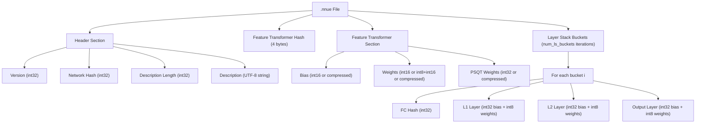
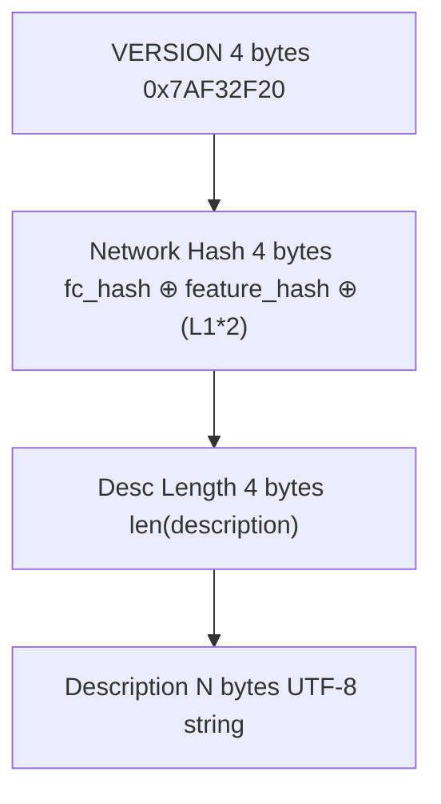
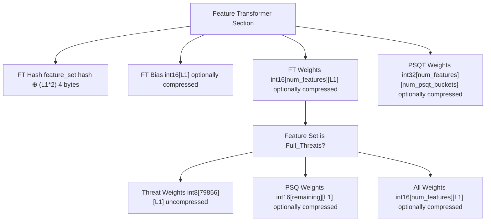
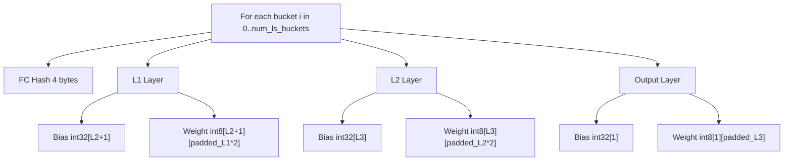
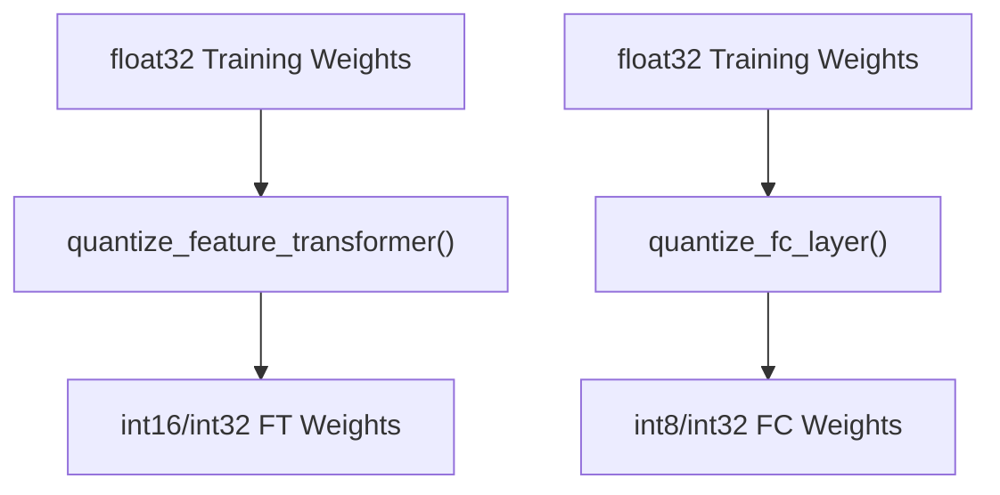
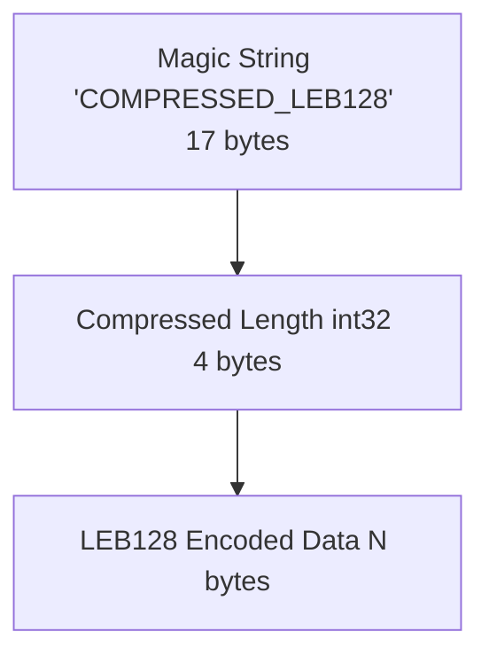
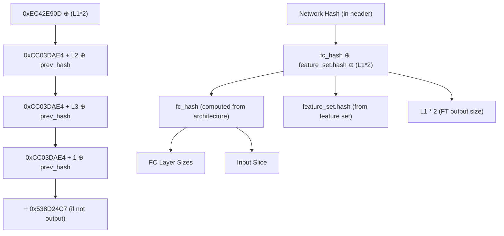
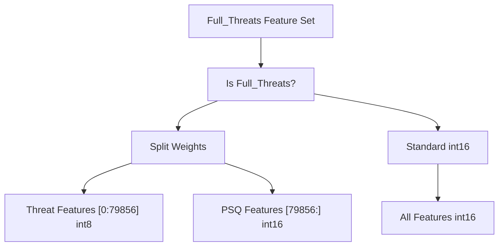
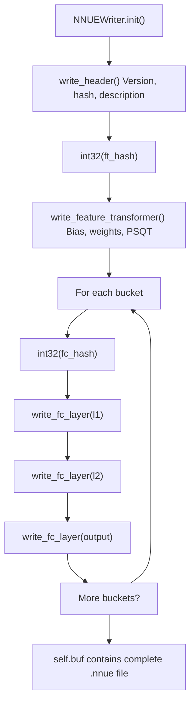
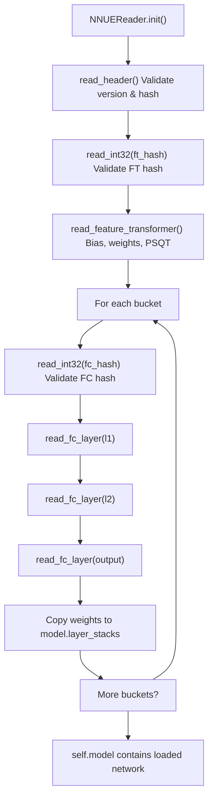

# NNUE Binary Format

-   [model/\_\_init\_\_.py](https://github.com/Chesszyh/nnue-pytorch/blob/024b2064/model/__init__.py)
-   [model/model.py](https://github.com/Chesszyh/nnue-pytorch/blob/024b2064/model/model.py)
-   [model/utils/\_\_init\_\_.py](https://github.com/Chesszyh/nnue-pytorch/blob/024b2064/model/utils/__init__.py)
-   [model/utils/coalesce\_weights.py](https://github.com/Chesszyh/nnue-pytorch/blob/024b2064/model/utils/coalesce_weights.py)
-   [model/utils/serialize.py](https://github.com/Chesszyh/nnue-pytorch/blob/024b2064/model/utils/serialize.py)
-   [serialize.py](https://github.com/Chesszyh/nnue-pytorch/blob/024b2064/serialize.py)
-   [visualize.py](https://github.com/Chesszyh/nnue-pytorch/blob/024b2064/visualize.py)
-   [visualize\_multi\_hist.py](https://github.com/Chesszyh/nnue-pytorch/blob/024b2064/visualize_multi_hist.py)

This document specifies the binary file format for `.nnue` files, which are used to store trained NNUE networks in a compact, deployment-ready format compatible with Stockfish and other chess engines. The format is optimized for inference efficiency, using integer quantization and optional compression.

For information about converting between checkpoint formats, see [Checkpoint Conversion (serialize.py)](#5.1). For details about compression methods and weight coalescing, see [Weight Coalescing and Compression](#5.3).

## Overview

The `.nnue` binary format stores a complete NNUE network with the following characteristics:

-   **Little-endian byte order** for all multi-byte values
-   **Integer quantization**: int16/int32 for feature transformer, int8/int32 for FC layers
-   **Optional LEB128 compression** for feature transformer weights to reduce file size
-   **Versioning and hash validation** to ensure compatibility
-   **Padding requirements** for FC layer inputs (32-element alignment)

The format is written by [\`NNUEWriter\`](https://github.com/Chesszyh/nnue-pytorch/blob/024b2064/`NNUEWriter`) and read by [\`NNUEReader\`](https://github.com/Chesszyh/nnue-pytorch/blob/024b2064/`NNUEReader`)

Sources: [model/utils/serialize.py1-361](https://github.com/Chesszyh/nnue-pytorch/blob/024b2064/model/utils/serialize.py#L1-L361)

## File Structure Overview


**Diagram: Overall structure of the .nnue binary file**

Sources: [model/utils/serialize.py69-217](https://github.com/Chesszyh/nnue-pytorch/blob/024b2064/model/utils/serialize.py#L69-L217)

## Binary Format Specification

### Endianness and Basic Types

All multi-byte values use **little-endian** byte order. The format uses these primitive operations:

| Method | Type | Size | Description |
| --- | --- | --- | --- |
| `int32(v)` | `uint32` | 4 bytes | Unsigned 32-bit integer |
| `tensor(dtype, shape)` | Variable | Variable | Array of values with optional compression |
| `buf.extend(bytes)` | Variable | Variable | Raw byte array |

Sources: [model/utils/serialize.py215-216](https://github.com/Chesszyh/nnue-pytorch/blob/024b2064/model/utils/serialize.py#L215-L216) [model/utils/serialize.py135-143](https://github.com/Chesszyh/nnue-pytorch/blob/024b2064/model/utils/serialize.py#L135-L143)

### Header Section

The header contains version information, a validation hash, and a human-readable description:


**Diagram: Header section byte layout**

The version constant is defined as:

```
VERSION = 0x7AF32F20
```
The network hash is computed by XORing:

-   `fc_hash`: Hash of the fully-connected layer architecture
-   `feature_set.hash`: Hash of the feature set
-   `L1 * 2`: Feature transformer output size (doubled for perspective)

The description defaults to:

```
"Network trained with the https://github.com/official-stockfish/nnue-pytorch trainer."
```
Sources: [model/utils/serialize.py65-66](https://github.com/Chesszyh/nnue-pytorch/blob/024b2064/model/utils/serialize.py#L65-L66) [model/utils/serialize.py121-128](https://github.com/Chesszyh/nnue-pytorch/blob/024b2064/model/utils/serialize.py#L121-L128) [model/utils/serialize.py265-269](https://github.com/Chesszyh/nnue-pytorch/blob/024b2064/model/utils/serialize.py#L265-L269)

### Feature Transformer Section

After the header, the file contains the feature transformer hash and weights:


**Diagram: Feature transformer section structure**

The feature transformer stores:

1.  **Bias**: `int16[L1]` - One bias value per output neuron
2.  **Weights**: `int16[num_features][L1]` - Input-to-hidden weights (may be split for `Full_Threats`)
3.  **PSQT Weights**: `int32[num_features][num_psqt_buckets]` - Piece-square table values

For the `Full_Threats` feature set, weights are split:

-   First 79856 features use `int8` (threat features)
-   Remaining features use `int16` (piece-square features)

Sources: [model/utils/serialize.py144-174](https://github.com/Chesszyh/nnue-pytorch/blob/024b2064/model/utils/serialize.py#L144-L174) [model/utils/serialize.py312-334](https://github.com/Chesszyh/nnue-pytorch/blob/024b2064/model/utils/serialize.py#L312-L334)

### Fully Connected Layers Section

Following the feature transformer, the file contains `num_ls_buckets` (typically 8) copies of the fully-connected layers:


**Diagram: Fully-connected layer section structure for one bucket**

Each FC layer stores:

1.  **Bias**: `int32[outputs]` - One bias per output neuron
2.  **Weight**: `int8[outputs][padded_inputs]` - Quantized weights

**Important**: The input dimension is padded to the next multiple of 32 as required by the NNUE specification.

Sources: [model/utils/serialize.py92-96](https://github.com/Chesszyh/nnue-pytorch/blob/024b2064/model/utils/serialize.py#L92-L96) [model/utils/serialize.py176-213](https://github.com/Chesszyh/nnue-pytorch/blob/024b2064/model/utils/serialize.py#L176-L213) [model/utils/serialize.py336-354](https://github.com/Chesszyh/nnue-pytorch/blob/024b2064/model/utils/serialize.py#L336-L354)

## Data Types and Quantization

The binary format uses different quantized types for different components:

| Component | Type | Range | Scale Factor |
| --- | --- | --- | --- |
| FT Bias | `int16` | \[-32768, 32767\] | Determined by `QuantizationManager` |
| FT Weight | `int16` | \[-32768, 32767\] | Determined by `QuantizationManager` |
| FT Weight (threats) | `int8` | \[-128, 127\] | Special case for `Full_Threats` |
| FT PSQT | `int32` | \[-2³¹, 2³¹-1\] | Determined by `QuantizationManager` |
| FC Bias | `int32` | \[-2³¹, 2³¹-1\] | Determined by `QuantizationManager` |
| FC Weight | `int8` | \[-128, 127\] | Determined by `QuantizationManager` |

The quantization process is managed by [\`QuantizationManager\`](https://github.com/Chesszyh/nnue-pytorch/blob/024b2064/`QuantizationManager`) and applied during serialization:


**Diagram: Quantization pipeline during serialization**

Sources: [model/utils/serialize.py160-162](https://github.com/Chesszyh/nnue-pytorch/blob/024b2064/model/utils/serialize.py#L160-L162) [model/utils/serialize.py199-201](https://github.com/Chesszyh/nnue-pytorch/blob/024b2064/model/utils/serialize.py#L199-L201)

## Compression

The feature transformer section supports optional LEB128 (Little Endian Base 128) compression to reduce file size. Compression is controlled by the `--ft_compression` flag in `serialize.py`.

### Compressed Tensor Format

When compression is enabled, each compressed tensor has this structure:


**Diagram: Compressed tensor structure**

### LEB128 Encoding

The LEB128 encoding uses 7 bits per byte for data, with the high bit as a continuation flag:

| Byte Structure | Meaning |
| --- | --- |
| `0xxxxxxx` | Last byte (bit 7 = 0) |
| `1xxxxxxx` | More bytes follow (bit 7 = 1) |

The encoding/decoding functions are:

-   [\`encode\_leb\_128\_array(arr)\`](https://github.com/Chesszyh/nnue-pytorch/blob/024b2064/`encode_leb_128_array(arr)`): Encodes numpy array to LEB128
-   [\`decode\_leb\_128\_array(arr, n)\`](https://github.com/Chesszyh/nnue-pytorch/blob/024b2064/`decode_leb_128_array(arr, n)`): Decodes LEB128 bytes to numpy array

Sources: [model/utils/serialize.py32-61](https://github.com/Chesszyh/nnue-pytorch/blob/024b2064/model/utils/serialize.py#L32-L61) [model/utils/serialize.py130-143](https://github.com/Chesszyh/nnue-pytorch/blob/024b2064/model/utils/serialize.py#L130-L143) [model/utils/serialize.py271-310](https://github.com/Chesszyh/nnue-pytorch/blob/024b2064/model/utils/serialize.py#L271-L310)

## Version and Hash System

The format uses a multi-layered hash system for validation:


**Diagram: Hash computation system for version validation**

The hash system ensures:

1.  **Architecture compatibility**: Different layer sizes produce different hashes
2.  **Feature set compatibility**: Different feature sets produce different hashes
3.  **Version compatibility**: Files from incompatible versions are rejected

Sources: [model/utils/serialize.py98-119](https://github.com/Chesszyh/nnue-pytorch/blob/024b2064/model/utils/serialize.py#L98-L119) [model/utils/serialize.py121-128](https://github.com/Chesszyh/nnue-pytorch/blob/024b2064/model/utils/serialize.py#L121-L128) [model/utils/serialize.py265-269](https://github.com/Chesszyh/nnue-pytorch/blob/024b2064/model/utils/serialize.py#L265-L269)

## Padding Requirements

FC layer inputs must be padded to the next multiple of 32 elements, as required by the NNUE specification for efficient SIMD operations:

```
# Example: If layer.weight.shape[1] = 50# Padded shape = 64 (next multiple of 32)num_input = weight.shape[1]if num_input % 32 != 0:    num_input += 32 - (num_input % 32)    new_w = torch.zeros(weight.shape[0], num_input, dtype=torch.int8)    new_w[:, :weight.shape[1]] = weight    weight = new_w
```
| Layer | Unpadded Input | Padded Input |
| --- | --- | --- |
| L1 | `L1 * 2` (e.g., 1024) | `L1 * 2` (already multiple of 32) |
| L2 | `L2 * 2` (e.g., 16) | 32 (padded from 16) |
| Output | `L3` (e.g., 32) | 32 (already multiple of 32) |

During reading, the padding is stripped:

```
layer.weight.data = layer.weight.data[:non_padded_shape[0], :non_padded_shape[1]]
```
Sources: [model/utils/serialize.py203-209](https://github.com/Chesszyh/nnue-pytorch/blob/024b2064/model/utils/serialize.py#L203-L209) [model/utils/serialize.py336-354](https://github.com/Chesszyh/nnue-pytorch/blob/024b2064/model/utils/serialize.py#L336-L354)

## Special Cases

### Full\_Threats Feature Set

The `Full_Threats` feature set has special handling where threat features use `int8` quantization while piece-square features use `int16`:


**Diagram: Special handling for Full\_Threats feature set**

This is handled in both writing and reading:

**Writing:**

```
if model.feature_set.name.startswith("Full_Threats"):    threat_weight = weight[:79856].to(torch.int8)    psq_weight = weight[79856:]    self.write_tensor(threat_weight.flatten().numpy())    self.write_tensor(psq_weight.flatten().numpy(), ft_compression)
```
**Reading:**

```
if self.feature_set.name.startswith("Full_Threats"):    threat_weight = self.tensor(np.int8, [79856, shape[1] - num_psqt_buckets])    psq_weight = self.tensor(np.int16, [shape[0] - 79856, shape[1] - num_psqt_buckets])    weight = torch.cat([threat_weight, psq_weight], dim=0)
```
Sources: [model/utils/serialize.py167-172](https://github.com/Chesszyh/nnue-pytorch/blob/024b2064/model/utils/serialize.py#L167-L172) [model/utils/serialize.py319-322](https://github.com/Chesszyh/nnue-pytorch/blob/024b2064/model/utils/serialize.py#L319-L322)

## Reading and Writing Implementation

### Writing Workflow


**Diagram: Writing workflow in NNUEWriter**

### Reading Workflow


**Diagram: Reading workflow in NNUEReader**

The main entry points for serialization are:

| Operation | Entry Point | Key Method |
| --- | --- | --- |
| Write to .nnue | [\`serialize.py165-167](https://github.com/Chesszyh/nnue-pytorch/blob/024b2064/`serialize.py#L165-L167) | `NNUEWriter(model, description, ft_compression)` |
| Read from .nnue | [\`serialize.py95-104](https://github.com/Chesszyh/nnue-pytorch/blob/024b2064/`serialize.py#L95-L104) | `NNUEReader(f, feature_set, config, quantize_config)` |
| Convert formats | [\`serialize.py10-182](https://github.com/Chesszyh/nnue-pytorch/blob/024b2064/`serialize.py#L10-L182) | `main()` handles .ckpt → .nnue, .pt → .nnue, .nnue → .pt |

Sources: [model/utils/serialize.py69-217](https://github.com/Chesszyh/nnue-pytorch/blob/024b2064/model/utils/serialize.py#L69-L217) [model/utils/serialize.py219-361](https://github.com/Chesszyh/nnue-pytorch/blob/024b2064/model/utils/serialize.py#L219-L361) [serialize.py10-185](https://github.com/Chesszyh/nnue-pytorch/blob/024b2064/serialize.py#L10-L185)

## Usage Example

To create a `.nnue` file from a checkpoint:

```
# Basic conversionpython serialize.py model.ckpt output.nnue# With compressionpython serialize.py model.ckpt output.nnue --ft_compression leb128# With custom descriptionpython serialize.py model.ckpt output.nnue --description "My custom network"# With SHA-based namingpython serialize.py model.ckpt output_dir/ --out-sha# Creates: output_dir/nn-<sha12>.nnue
```
To read a `.nnue` file for inspection:

```
import model as Mwith open('network.nnue', 'rb') as f:    reader = M.NNUEReader(        f,        feature_set=M.get_feature_set_from_name('HalfKAv2_hm'),        config=M.ModelConfig(),        quantize_config=M.QuantizationConfig()    )    model = reader.model    description = reader.description
```
Sources: [serialize.py10-185](https://github.com/Chesszyh/nnue-pytorch/blob/024b2064/serialize.py#L10-L185) [model/utils/serialize.py219-264](https://github.com/Chesszyh/nnue-pytorch/blob/024b2064/model/utils/serialize.py#L219-L264)
