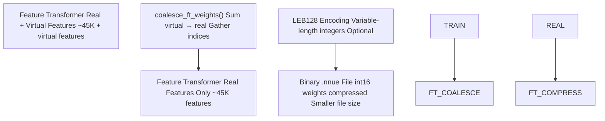
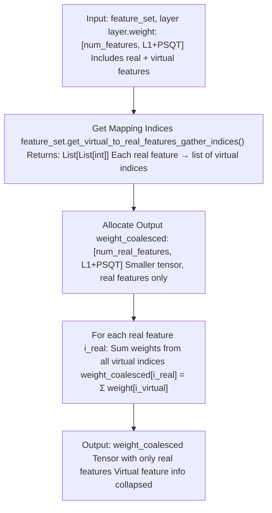
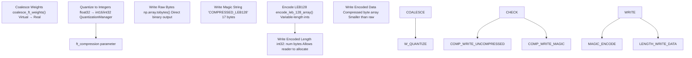
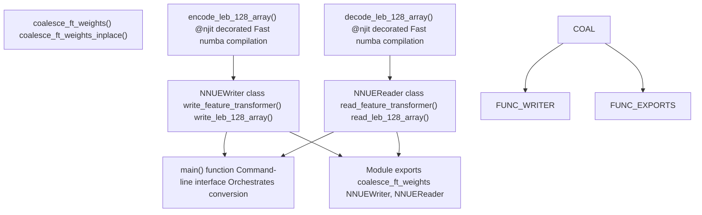

# Weight Coalescing and Compression

-   [model/\_\_init\_\_.py](https://github.com/Chesszyh/nnue-pytorch/blob/024b2064/model/__init__.py)
-   [model/model.py](https://github.com/Chesszyh/nnue-pytorch/blob/024b2064/model/model.py)
-   [model/utils/\_\_init\_\_.py](https://github.com/Chesszyh/nnue-pytorch/blob/024b2064/model/utils/__init__.py)
-   [model/utils/coalesce\_weights.py](https://github.com/Chesszyh/nnue-pytorch/blob/024b2064/model/utils/coalesce_weights.py)
-   [model/utils/serialize.py](https://github.com/Chesszyh/nnue-pytorch/blob/024b2064/model/utils/serialize.py)
-   [serialize.py](https://github.com/Chesszyh/nnue-pytorch/blob/024b2064/serialize.py)
-   [visualize.py](https://github.com/Chesszyh/nnue-pytorch/blob/024b2064/visualize.py)
-   [visualize\_multi\_hist.py](https://github.com/Chesszyh/nnue-pytorch/blob/024b2064/visualize_multi_hist.py)

This document describes the weight coalescing and compression techniques applied during model serialization. Weight coalescing reduces the model size by collapsing virtual features (used only during training) back into real features. Compression further reduces the binary file size using LEB128 encoding.

For information about the overall serialization workflow, see [Checkpoint Conversion (serialize.py)](#5.1). For details about the binary file format structure, see [NNUE Binary Format](#5.2).

## Overview

The NNUE training system uses **virtual features** during training to accelerate learning of correlated feature patterns. At serialization time, these virtual features must be **coalesced** (collapsed) back into their corresponding real features to produce a deployable network. Additionally, **LEB128 compression** can be applied to the feature transformer weights to reduce file size without loss of precision.


**Sources:** [serialize.py118-125](https://github.com/Chesszyh/nnue-pytorch/blob/024b2064/serialize.py#L118-L125) [model/utils/coalesce\_weights.py7-19](https://github.com/Chesszyh/nnue-pytorch/blob/024b2064/model/utils/coalesce_weights.py#L7-L19) [model/utils/serialize.py144-174](https://github.com/Chesszyh/nnue-pytorch/blob/024b2064/model/utils/serialize.py#L144-L174)

## Weight Coalescing

### Purpose of Virtual Features

Virtual features are additional feature indices that exist only during training. They are defined in factorized feature sets (indicated by the `^` suffix, e.g., `HalfKAv2_hm^`). Virtual features enable the network to learn correlations between related features more effectively during training, but they do not exist in the final deployed network.

During model initialization, all virtual feature weights are zeroed out:

[model/model.py43-52](https://github.com/Chesszyh/nnue-pytorch/blob/024b2064/model/model.py#L43-L52)

At serialization time, the weights learned for virtual features are summed back into their corresponding real features, effectively coalescing the learned representations.

### Coalescing Implementation

The coalescing process is implemented in the `coalesce_ft_weights()` function:


**Implementation in code:**

[model/utils/coalesce\_weights.py7-19](https://github.com/Chesszyh/nnue-pytorch/blob/024b2064/model/utils/coalesce_weights.py#L7-L19)

The function creates a new tensor with dimensions `(num_real_features, output_size)` and populates it by gathering and summing weights from the original tensor according to the virtual-to-real feature mapping.

**Sources:** [model/utils/coalesce\_weights.py1-33](https://github.com/Chesszyh/nnue-pytorch/blob/024b2064/model/utils/coalesce_weights.py#L1-L33)

### In-Place Coalescing

For serialization, an in-place variant is used to avoid creating temporary copies:

[model/utils/coalesce\_weights.py22-33](https://github.com/Chesszyh/nnue-pytorch/blob/024b2064/model/utils/coalesce_weights.py#L22-L33)

This variant modifies `layer.weight.data` directly, replacing the full weight tensor (real + virtual) with the coalesced real-only weights.

**Sources:** [model/utils/coalesce\_weights.py22-33](https://github.com/Chesszyh/nnue-pytorch/blob/024b2064/model/utils/coalesce_weights.py#L22-L33) [serialize.py122-124](https://github.com/Chesszyh/nnue-pytorch/blob/024b2064/serialize.py#L122-L124)

### Coalescing in Serialization Pipeline

Coalescing occurs at two points in the serialization pipeline:

1.  **Before feature transformer permutation optimization** (if enabled): [serialize.py118-125](https://github.com/Chesszyh/nnue-pytorch/blob/024b2064/serialize.py#L118-L125)

2.  **Inside NNUEWriter when writing the feature transformer**: [model/utils/serialize.py144-151](https://github.com/Chesszyh/nnue-pytorch/blob/024b2064/model/utils/serialize.py#L144-L151)


The coalescing is performed on both the main feature transformer weights and the layer stack weights (if they use factorization):

[serialize.py122-123](https://github.com/Chesszyh/nnue-pytorch/blob/024b2064/serialize.py#L122-L123)

**Sources:** [serialize.py118-153](https://github.com/Chesszyh/nnue-pytorch/blob/024b2064/serialize.py#L118-L153) [model/utils/serialize.py144-151](https://github.com/Chesszyh/nnue-pytorch/blob/024b2064/model/utils/serialize.py#L144-L151)

## Compression

### LEB128 Encoding

LEB128 (Little Endian Base 128) is a variable-length integer encoding that compresses data by using fewer bytes for smaller absolute values. Each byte encodes 7 bits of data plus a continuation bit.

| Encoding Property | Description |
| --- | --- |
| **Format** | Variable-length, 7 data bits + 1 continuation bit per byte |
| **Signed** | Yes, uses sign extension |
| **Efficiency** | Small values use fewer bytes (1-2 bytes typical for weights) |
| **Applicability** | Feature transformer weights and biases (int16/int32) |
| **Not Applied To** | Fully-connected layer weights (int8, already compact) |

The encoding algorithm:

[model/utils/serialize.py32-43](https://github.com/Chesszyh/nnue-pytorch/blob/024b2064/model/utils/serialize.py#L32-L43)

The decoding algorithm:

[model/utils/serialize.py46-61](https://github.com/Chesszyh/nnue-pytorch/blob/024b2064/model/utils/serialize.py#L46-L61)

**Sources:** [model/utils/serialize.py32-61](https://github.com/Chesszyh/nnue-pytorch/blob/024b2064/model/utils/serialize.py#L32-L61)

### Compression Workflow


**Sources:** [model/utils/serialize.py144-174](https://github.com/Chesszyh/nnue-pytorch/blob/024b2064/model/utils/serialize.py#L144-L174) [model/utils/serialize.py130-142](https://github.com/Chesszyh/nnue-pytorch/blob/024b2064/model/utils/serialize.py#L130-L142)

### Compression Application

Compression is controlled by the `--ft_compression` command-line argument in `serialize.py`:

[serialize.py29-34](https://github.com/Chesszyh/nnue-pytorch/blob/024b2064/serialize.py#L29-L34)

Default behavior is `"leb128"`. The compression is applied to:

1.  **Feature transformer bias** (int16 → int32 quantized)
2.  **Feature transformer weights** (int16 quantized)
3.  **PSQT weights** (int32 quantized)

Fully-connected layer weights are **not** compressed because they are already stored as int8, which is very compact.

For special feature sets like `Full_Threats`, the compression is selectively applied:

[model/utils/serialize.py167-174](https://github.com/Chesszyh/nnue-pytorch/blob/024b2064/model/utils/serialize.py#L167-L174)

Here, threat weights use int8 (no compression), while PSQ weights use int16 (with optional compression).

**Sources:** [serialize.py29-34](https://github.com/Chesszyh/nnue-pytorch/blob/024b2064/serialize.py#L29-L34) [model/utils/serialize.py167-174](https://github.com/Chesszyh/nnue-pytorch/blob/024b2064/model/utils/serialize.py#L167-L174)

### Decompression on Read

The `NNUEReader` automatically detects compression by checking for the magic string:

[model/utils/serialize.py291-297](https://github.com/Chesszyh/nnue-pytorch/blob/024b2064/model/utils/serialize.py#L291-L297)

The `tensor()` method transparently handles both compressed and uncompressed data:

[model/utils/serialize.py299-310](https://github.com/Chesszyh/nnue-pytorch/blob/024b2064/model/utils/serialize.py#L299-L310)

**Sources:** [model/utils/serialize.py291-310](https://github.com/Chesszyh/nnue-pytorch/blob/024b2064/model/utils/serialize.py#L291-L310)

## Complete Serialization Flow

The following diagram shows how coalescing and compression integrate into the full serialization pipeline:

```mermaid
flowchart TD
    CKPT["PyTorch Checkpoint .ckpt file Float32 weights + virtual features"]
    LOAD["NNUE.load_from_checkpoint() Restore full training state"]
    FT_OPT["--ft_optimize or --ft_perm"]
    COALESCE_PRE["coalesce_ft_weights_inplace() Required before FT optimization"]
    FT_PERM["ftperm.ft_permute() or ftperm.ft_optimize() Reorder for SIMD efficiency"]
    WRITER_INIT["NNUEWriter(model, description, ft_compression)"]
    WRITE_HEADER["write_header() Version + hash + description"]
    WRITE_FT["write_feature_transformer() 1. Coalesce weights 2. Quantize to int16/int32 3. Optionally compress (LEB128) 4. Write to buffer"]
    WRITE_FC["write_fc_layer() × N For each layer stack bucket: 1. Quantize to int8/int32 2. Pad to 32-byte alignment 3. Write raw (no compression)"]
    NNUE_FILE["Binary .nnue File Stockfish-compatible format Reduced size with compression"]

    CKPT --> LOAD
    LOAD --> FT_OPT
    FT --> OPT_COALESCE_PRE
    COALESCE --> PRE_FT_PERM
    FT --> PERM_WRITER_INIT
    FT --> OPT_WRITER_INIT
    WRITER --> INIT_WRITE_HEADER
    WRITE --> HEADER_WRITE_FT
    WRITE --> FT_WRITE_FC
    WRITE --> FC_NNUE_FILE
```


**Sources:** [serialize.py83-179](https://github.com/Chesszyh/nnue-pytorch/blob/024b2064/serialize.py#L83-L179) [model/utils/serialize.py69-216](https://github.com/Chesszyh/nnue-pytorch/blob/024b2064/model/utils/serialize.py#L69-L216)

## Usage Examples

### Basic Serialization with Compression

Convert a checkpoint to NNUE format with default LEB128 compression:

```
python serialize.py model.ckpt output.nnue --features HalfKAv2_hm^
```
This applies both coalescing (due to the `^` factorized feature set) and compression (default `leb128`).

### Disable Compression

To serialize without compression (larger file, faster to write/read):

```
python serialize.py model.ckpt output.nnue --features HalfKAv2_hm^ --ft_compression none
```
### Serialization with FT Optimization

When applying feature transformer optimization, coalescing happens automatically:

```
python serialize.py model.ckpt output.nnue \  --features HalfKAv2_hm^ \  --ft_optimize \  --ft_optimize_data training.binpack \  --ft_optimize_count 10000
```
The coalescing is performed at [serialize.py143-145](https://github.com/Chesszyh/nnue-pytorch/blob/024b2064/serialize.py#L143-L145) before calling `ftperm.ft_optimize()`.

**Sources:** [serialize.py10-185](https://github.com/Chesszyh/nnue-pytorch/blob/024b2064/serialize.py#L10-L185)

## Implementation Details

### Coalescing Function Signatures

| Function | Purpose | Modifies In-Place |
| --- | --- | --- |
| `coalesce_ft_weights(feature_set, layer)` | Returns coalesced weights as new tensor | No |
| `coalesce_ft_weights_inplace(feature_set, layer)` | Modifies layer.weight.data directly | Yes |

Both functions are exported from the `model` module:

[model/\_\_init\_\_.py8-9](https://github.com/Chesszyh/nnue-pytorch/blob/024b2064/model/__init__.py#L8-L9)

### Compression Statistics

The `NNUEWriter` prints compression statistics during serialization using ASCII histograms:

[model/utils/serialize.py20-29](https://github.com/Chesszyh/nnue-pytorch/blob/024b2064/model/utils/serialize.py#L20-L29)

This provides visibility into the weight distribution before and after quantization, helping identify potential issues.

### Compression Efficiency

LEB128 compression is most effective for:

-   **Small magnitude weights**: Common in well-trained networks
-   **Sparse activations**: Many weights near zero
-   **Feature transformer layers**: Larger parameter count benefits more from compression

Typical compression ratios for feature transformer weights:

-   Uncompressed int16: 2 bytes per weight
-   LEB128 compressed: 1-2 bytes per weight (average ~1.3-1.5 bytes)
-   Overall file size reduction: 15-30%

**Sources:** [model/utils/serialize.py20-43](https://github.com/Chesszyh/nnue-pytorch/blob/024b2064/model/utils/serialize.py#L20-L43) [model/utils/serialize.py130-142](https://github.com/Chesszyh/nnue-pytorch/blob/024b2064/model/utils/serialize.py#L130-L142)

## Code Organization


**Sources:** [model/utils/coalesce\_weights.py1-33](https://github.com/Chesszyh/nnue-pytorch/blob/024b2064/model/utils/coalesce_weights.py#L1-L33) [model/utils/serialize.py1-361](https://github.com/Chesszyh/nnue-pytorch/blob/024b2064/model/utils/serialize.py#L1-L361) [serialize.py1-186](https://github.com/Chesszyh/nnue-pytorch/blob/024b2064/serialize.py#L1-L186) [model/\_\_init\_\_.py1-31](https://github.com/Chesszyh/nnue-pytorch/blob/024b2064/model/__init__.py#L1-L31)

## Performance Considerations

### Memory Usage

-   **Coalescing**: Creates a temporary tensor of size `(num_real_features, output_size)`, typically smaller than the input due to virtual feature removal
-   **In-place coalescing**: Reuses existing tensor storage, no additional memory allocation
-   **Compression encoding**: Builds a Python list during encoding; memory overhead is proportional to the number of weights

### CPU Time

-   **Coalescing**: O(num\_features × output\_size) operations, dominated by memory access patterns
-   **LEB128 encoding**: O(num\_values × avg\_bytes\_per\_value), typically ~1-2 iterations per value
-   **Numba JIT compilation**: First call incurs compilation overhead (~1 second), subsequent calls are fast

The `@njit` decorator from Numba compiles the LEB128 functions to native code:

[model/utils/serialize.py32](https://github.com/Chesszyh/nnue-pytorch/blob/024b2064/model/utils/serialize.py#L32-L32)

This provides near-C performance for the encoding/decoding operations.

**Sources:** [model/utils/serialize.py32-61](https://github.com/Chesszyh/nnue-pytorch/blob/024b2064/model/utils/serialize.py#L32-L61)

## Integration with Visualization

The visualization tools (`visualize.py`, `visualize_multi_hist.py`) use coalescing to display weights:

[visualize.py41-44](https://github.com/Chesszyh/nnue-pytorch/blob/024b2064/visualize.py#L41-L44)

This ensures that the visualizations show the final weights as they would appear in the deployed network, making it easier to debug and analyze the trained model.

**Sources:** [visualize.py40-52](https://github.com/Chesszyh/nnue-pytorch/blob/024b2064/visualize.py#L40-L52) [visualize\_multi\_hist.py91-100](https://github.com/Chesszyh/nnue-pytorch/blob/024b2064/visualize_multi_hist.py#L91-L100)
