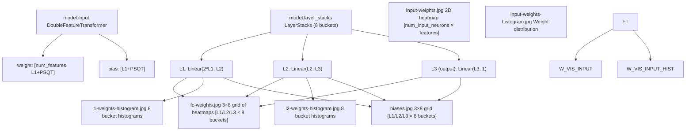

# Model Visualization

-   [model/\_\_init\_\_.py](https://github.com/Chesszyh/nnue-pytorch/blob/024b2064/model/__init__.py)
-   [model/utils/\_\_init\_\_.py](https://github.com/Chesszyh/nnue-pytorch/blob/024b2064/model/utils/__init__.py)
-   [serialize.py](https://github.com/Chesszyh/nnue-pytorch/blob/024b2064/serialize.py)
-   [visualize.py](https://github.com/Chesszyh/nnue-pytorch/blob/024b2064/visualize.py)
-   [visualize\_multi\_hist.py](https://github.com/Chesszyh/nnue-pytorch/blob/024b2064/visualize_multi_hist.py)

This page documents the visualization tools for inspecting trained NNUE models. These tools generate visual representations of model weights, biases, and their distributions to help understand model behavior, debug training issues, and compare different networks.

For information about converting models between formats before visualization, see [Checkpoint Conversion](#5.1). For details on the binary format structure being visualized, see [NNUE Binary Format](#5.2).

## Overview

The repository provides two main visualization scripts:

-   **`visualize.py`**: Single-model inspection tool that generates detailed visualizations of feature transformer weights, layer stack weights, and biases. Supports difference visualization between two models.
-   **`visualize_multi_hist.py`**: Multi-model comparison tool that generates histogram plots comparing weight distributions across multiple networks.

Both tools accept models in `.ckpt`, `.pt`, or `.nnue` formats and produce matplotlib-based visualizations that can be saved to disk or displayed interactively.

**Sources:** [visualize.py1-712](https://github.com/Chesszyh/nnue-pytorch/blob/024b2064/visualize.py#L1-L712) [visualize\_multi\_hist.py1-170](https://github.com/Chesszyh/nnue-pytorch/blob/024b2064/visualize_multi_hist.py#L1-L170)

## Visualization Pipeline

The following diagram shows how models are processed for visualization:

```mermaid
flowchart TD
    CKPT[".ckpt file (Lightning checkpoint)"]
    PT[".pt file (PyTorch serialized)"]
    NNUE[".nnue file (Binary format)"]
    LOAD["load_model() or NNUE.load_from_checkpoint()"]
    COALESCE["coalesce_ft_weights() Virtual → Real features"]
    VIS_CLASS["NNUEVisualizer class"]
    PLOT_INPUT["plot_input_weights() Feature transformer"]
    PLOT_FC["plot_fc_weights() Layer stack weights"]
    PLOT_BIAS["plot_fc_biases() Layer stack biases"]
    MULTI_LOAD["Load multiple models"]
    HIST_FT["plot_hists() FT weight distributions"]
    HIST_LS["plot_hists() L1/L2/L3 distributions"]
    MATSHOW["matplotlib matshow() 2D weight matrices"]
    HIST["matplotlib hist() Weight histograms"]
    SAVE["Save to .jpg/.png or show interactively"]

    CKPT --> LOAD
    PT --> LOAD
    NNUE --> LOAD
    LOAD --> COALESCE
    COALESCE --> VIS_CLASS
    VIS --> CLASS_PLOT_INPUT
    VIS --> CLASS_PLOT_FC
    VIS --> CLASS_PLOT_BIAS
    PLOT --> INPUT_MATSHOW
    PLOT --> INPUT_HIST
    PLOT --> FC_MATSHOW
    PLOT --> FC_HIST
    PLOT --> BIAS_MATSHOW
    LOAD --> MULTI_LOAD
    MULTI --> LOAD_HIST_FT
    MULTI --> LOAD_HIST_LS
    HIST --> FT_HIST
    HIST --> LS_HIST
    MATSHOW --> SAVE
    HIST --> SAVE
```


**Sources:** [visualize.py9-549](https://github.com/Chesszyh/nnue-pytorch/blob/024b2064/visualize.py#L9-L549) [visualize\_multi\_hist.py57-162](https://github.com/Chesszyh/nnue-pytorch/blob/024b2064/visualize_multi_hist.py#L57-L162) [model/utils/load\_model.py](https://github.com/Chesszyh/nnue-pytorch/blob/024b2064/model/utils/load_model.py)

## Model Component Mapping

The visualization tools map to specific components of the NNUE architecture:


**Sources:** [visualize.py40-549](https://github.com/Chesszyh/nnue-pytorch/blob/024b2064/visualize.py#L40-L549) [model/model.py](https://github.com/Chesszyh/nnue-pytorch/blob/024b2064/model/model.py)

## Single Model Visualization (visualize.py)

### Basic Usage

```
# Visualize a checkpointpython visualize.py model.ckpt --features HalfKAv2_hm --l1 1024# Visualize and save to directorypython visualize.py model.nnue --save-dir ./plots --features HalfKAv2_hm# Compare two models (visualize difference)python visualize.py new.nnue --ref-model baseline.nnue --features HalfKAv2_hm
```
**Sources:** [visualize.py551-711](https://github.com/Chesszyh/nnue-pytorch/blob/024b2064/visualize.py#L551-L711)

### Feature Transformer Visualization

The `plot_input_weights()` method creates a comprehensive visualization of the feature transformer weights. The layout arranges weights by:

1.  **Horizontal axis**: Input neurons (L1 size, e.g., 1024 or 2048)
2.  **Vertical axis**: Input features organized by piece type and board position
3.  **Color intensity**: Weight magnitude (or absolute value if `--input-weights-vmin ≥ 0`)

The visualization uses one of two orderings:

-   **`piece-centric-flipped-king`** (default): Features organized by piece with flipped king position, matching the Stockfish Evaluation Guide layout
-   **`king-centric`**: Features organized by king position

Each input neuron's section shows all feature weights as a vertical stripe, with pieces arranged in a standard pattern: pawns at top, then knights, bishops, rooks, queens, and kings.

**Sources:** [visualize.py40-316](https://github.com/Chesszyh/nnue-pytorch/blob/024b2064/visualize.py#L40-L316)

### Layer Stack Visualization

The `plot_fc_weights()` method generates a 3×N grid where:

-   **Rows**: L1, L2, and output layers
-   **Columns**: Layer stack buckets (typically 8)
-   **Content**: Weight matrices as heatmaps

For L1 weights, horizontal lines separate the weight groups corresponding to different output neurons, showing the contribution from each pair of feature transformer outputs (white and black perspectives).

**Sources:** [visualize.py317-476](https://github.com/Chesszyh/nnue-pytorch/blob/024b2064/visualize.py#L317-L476)

### Bias Visualization

The `plot_fc_biases()` method creates a similar 3×N grid showing bias values for each layer and bucket. Biases are displayed as single-row matrices for easy comparison across buckets.

**Sources:** [visualize.py477-549](https://github.com/Chesszyh/nnue-pytorch/blob/024b2064/visualize.py#L477-L549)

### Neuron Sorting

When `--sort-input-neurons` is enabled, neurons are reordered by the L1-norm of their associated weights (sum of absolute values). This reveals which neurons are most important and can highlight dead or underutilized neurons.

```
# From visualize.py:74-82neuron_weights_norm = np.zeros(hd)for i in range(hd):    neuron_weights_norm[i] = np.sum(np.abs(weights[i::hd]))self.sorted_input_neurons = np.flip(np.argsort(neuron_weights_norm))
```
**Sources:** [visualize.py74-289](https://github.com/Chesszyh/nnue-pytorch/blob/024b2064/visualize.py#L74-L289)

## Command-Line Options

### visualize.py Options

| Option | Type | Default | Description |
| --- | --- | --- | --- |
| `model` | positional | required | Source model (.ckpt, .pt, or .nnue) |
| `--ref-model` | string | None | Reference model for difference visualization |
| `--ref-features` | string | Same as model | Feature set for reference model |
| `--features` | string | required | Feature set (HalfKAv2\_hm, HalfKAv2\_hm^) |
| `--l1` | int | 256 | Feature transformer output size |
| `--input-weights-vmin` | float | \-1 | Minimum colormap value for input weights |
| `--input-weights-vmax` | float | 1 | Maximum colormap value for input weights |
| `--input-weights-auto-scale` | flag | False | Auto-scale input weight colormap |
| `--input-weights-order` | choice | piece-centric-flipped-king | Weight ordering (piece-centric-flipped-king, king-centric) |
| `--sort-input-neurons` | flag | False | Sort neurons by L1-norm of weights |
| `--fc-weights-vmin` | float | \-2 | Minimum colormap value for FC weights |
| `--fc-weights-vmax` | float | 2 | Maximum colormap value for FC weights |
| `--fc-weights-auto-scale` | flag | False | Auto-scale FC weight colormap |
| `--no-hist` | flag | False | Skip histogram generation |
| `--no-biases` | flag | False | Skip bias visualization |
| `--no-input-weights` | flag | False | Skip input weight visualization |
| `--no-fc-weights` | flag | False | Skip FC weight visualization |
| `--default-width` | int | 1600 | Plot width in pixels |
| `--default-height` | int | 900 | Plot height in pixels |
| `--save-dir` | string | None | Directory to save plots |
| `--dont-show` | flag | False | Don't display plots interactively |
| `--label` | string | model filename | Label for plot titles and filenames |

**Sources:** [visualize.py551-656](https://github.com/Chesszyh/nnue-pytorch/blob/024b2064/visualize.py#L551-L656)

### visualize\_multi\_hist.py Options

| Option | Type | Default | Description |
| --- | --- | --- | --- |
| `models` | positional | required | List of models to compare |
| `--features` | string | required | Feature set (HalfKAv2, HalfKAv2^, HalfKAv2\_hm, HalfKAv2\_hm^) |
| `--l1` | int | 256 | Feature transformer output size |
| `--dont-show` | flag | False | Don't display plots interactively |

**Sources:** [visualize\_multi\_hist.py57-69](https://github.com/Chesszyh/nnue-pytorch/blob/024b2064/visualize_multi_hist.py#L57-L69)

## Multi-Model Comparison

### visualize\_multi\_hist.py

This tool generates histogram comparisons across multiple models, producing four output files:

1.  **`input_weights_hist.png`**: Feature transformer weight distributions
2.  **`input_weights_psqt_hist.png`**: PSQT weight distributions (scaled by 600 to Stockfish internal units)
3.  **`l1_weights_hist.png`**: L1 layer weight distributions per bucket
4.  **`l2_weights_hist.png`**: L2 layer weight distributions per bucket
5.  **`output_weights_hist.png`**: Output layer weight distributions per bucket

Each histogram uses logarithmic y-axis scaling to show the full distribution including tails.

```
# Compare three modelspython visualize_multi_hist.py net1.nnue net2.nnue net3.nnue \    --features HalfKAv2_hm --l1 1024
```
**Sources:** [visualize\_multi\_hist.py91-162](https://github.com/Chesszyh/nnue-pytorch/blob/024b2064/visualize_multi_hist.py#L91-L162)

### Difference Visualization

Using `visualize.py` with `--ref-model` subtracts the reference model's weights from the target model before visualization:

```
# From visualize.py:46-52if self.args.ref_model:    ref_weights = M.coalesce_ft_weights(        self.ref_model.feature_set, self.ref_model.input    )    ref_weights = ref_weights[:, : self.model.L1]    ref_weights = ref_weights.flatten().numpy()    weights -= ref_weights
```
This is useful for:

-   Tracking training progress by comparing checkpoints
-   Analyzing fine-tuning changes
-   Understanding architectural modifications

**Sources:** [visualize.py46-514](https://github.com/Chesszyh/nnue-pytorch/blob/024b2064/visualize.py#L46-L514)

## Visualization Interpretation

### Color Schemes

The tools use two colormaps depending on the value range:

-   **coolwarm** (diverging): Used when `vmin < 0`, showing positive weights in red and negative in blue
-   **viridis** (sequential): Used when `vmin ≥ 0`, showing absolute values from dark to bright

**Sources:** [visualize.py207-502](https://github.com/Chesszyh/nnue-pytorch/blob/024b2064/visualize.py#L207-L502)

### Feature Transformer Layout

The feature transformer visualization uses a grid layout where each input neuron occupies a vertical stripe. Within each stripe:

-   Width: 128 pixels (64 for white pieces + 64 for black pieces)
-   Height: 368 pixels (organized by piece type)
-   Layout segments:
    -   Pawns: 8 pixels per rank (48 total, excluding first/last rank)
    -   Knights, Bishops, Rooks, Queens, Kings: 64 pixels each

King bucket information is encoded in the feature position, with 32 king buckets for the half-board representation.

**Sources:** [visualize.py108-176](https://github.com/Chesszyh/nnue-pytorch/blob/024b2064/visualize.py#L108-L176)

### Histogram Binning

Histograms use quantization-aware binning:

-   **Input weights**: 127 bins per integer (int16 quantization scale)
-   **L1 weights**: 64 bins per integer (int8 quantization scale)
-   **L2 weights**: 64 bins per integer
-   **Multi-model histograms**: Shared bins computed from min/max across all models

**Sources:** [visualize.py305-474](https://github.com/Chesszyh/nnue-pytorch/blob/024b2064/visualize.py#L305-L474) [visualize\_multi\_hist.py9-18](https://github.com/Chesszyh/nnue-pytorch/blob/024b2064/visualize_multi_hist.py#L9-L18)

## Interactive Features

When displayed interactively (without `--dont-show`), the feature transformer visualization provides mouse-over information showing:

-   Input neuron ID (sorted or original)
-   Piece type and color
-   Piece square
-   King square

This is implemented via matplotlib's `format_coord` function:

```
# From visualize.py:249-296def format_coord(x, y):    # ... coordinate calculations ...    return "{}, {} on {}, white king on {}".format(        neuron_label, piece_name, piece_square_name, king_square_name    )ax = plt.gca()ax.format_coord = format_coord
```
**Sources:** [visualize.py249-296](https://github.com/Chesszyh/nnue-pytorch/blob/024b2064/visualize.py#L249-L296)

## Implementation Details

### Weight Coalescing

Both visualization tools coalesce virtual features back to real features before visualization using `coalesce_ft_weights()`. This ensures that factorized training (with virtual P, K, HalfRelativeKP features) is visualized in the same feature space as non-factorized models.

**Sources:** [visualize.py42-44](https://github.com/Chesszyh/nnue-pytorch/blob/024b2064/visualize.py#L42-L44) [visualize\_multi\_hist.py91-93](https://github.com/Chesszyh/nnue-pytorch/blob/024b2064/visualize_multi_hist.py#L91-L93) [model/utils/coalesce\_weights.py](https://github.com/Chesszyh/nnue-pytorch/blob/024b2064/model/utils/coalesce_weights.py)

### Layer Stack Iteration

The tools iterate through layer stacks using the `get_coalesced_layer_stacks()` method, which returns tuples of `(l1, l2, output)` for each bucket:

```
# From visualize.py:374-376for bucket_id, (l1, l2, output) in enumerate(    self.model.layer_stacks.get_coalesced_layer_stacks()):
```
**Sources:** [visualize.py374-506](https://github.com/Chesszyh/nnue-pytorch/blob/024b2064/visualize.py#L374-L506) [visualize\_multi\_hist.py127-131](https://github.com/Chesszyh/nnue-pytorch/blob/024b2064/visualize_multi_hist.py#L127-L131)

### Figure Management

The `_process_fig()` method handles both saving and display:

-   If `--save-dir` is specified, saves to `{save_dir}/{label}_{name}.jpg`
-   If not, displays interactively with `plt.show()`
-   Supports optional label prefixes for organized output

**Sources:** [visualize.py24-38](https://github.com/Chesszyh/nnue-pytorch/blob/024b2064/visualize.py#L24-L38)

### Model Loading

Both tools use the unified `load_model()` utility function that handles all three formats:

```
# From visualize.py:666-668model = M.load_model(    args.model, feature_set, M.ModelConfig(L1=args.l1), M.QuantizationConfig())
```
This function is defined in `model/utils/load_model.py` and automatically detects the format by file extension.

**Sources:** [visualize.py666-668](https://github.com/Chesszyh/nnue-pytorch/blob/024b2064/visualize.py#L666-L668) [visualize\_multi\_hist.py86-89](https://github.com/Chesszyh/nnue-pytorch/blob/024b2064/visualize_multi_hist.py#L86-L89) [model/utils/load\_model.py](https://github.com/Chesszyh/nnue-pytorch/blob/024b2064/model/utils/load_model.py)
