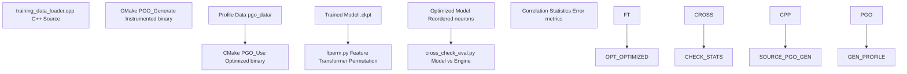
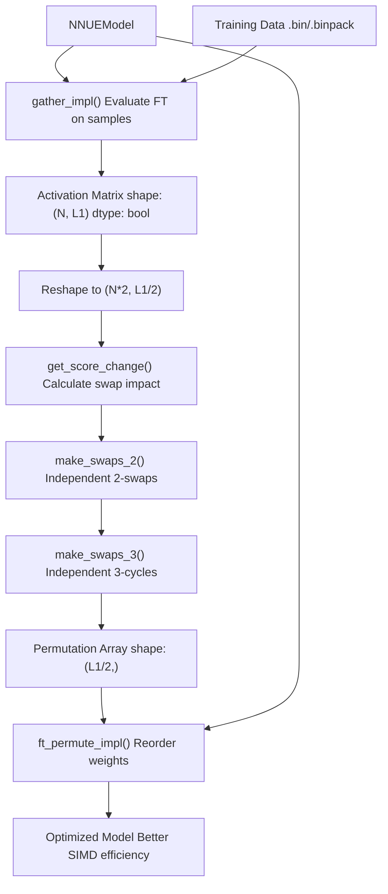
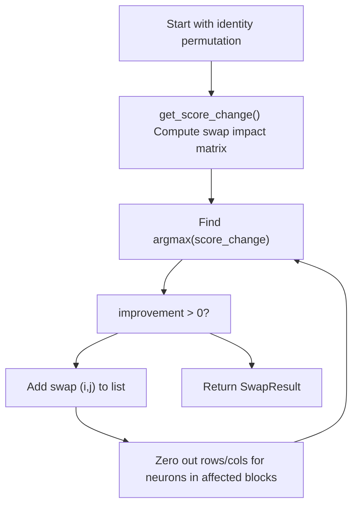
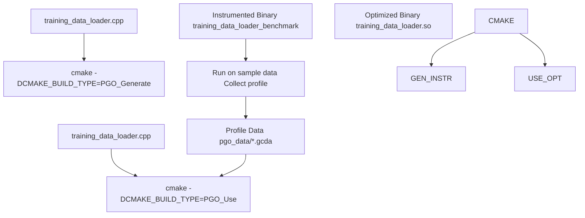
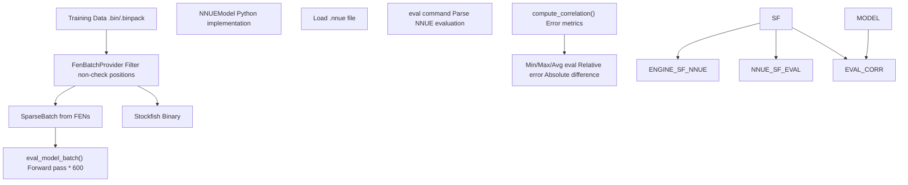
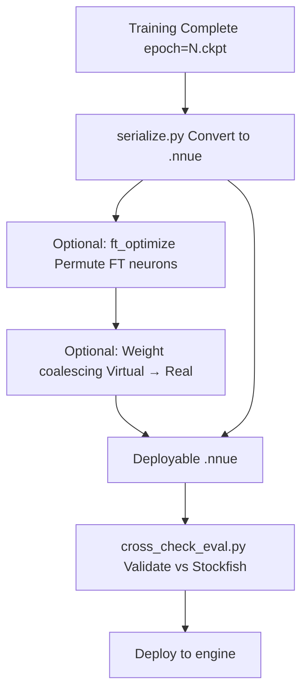

# Optimization Techniques

-   [.pgo/small.binpack](https://github.com/Chesszyh/nnue-pytorch/blob/024b2064/.pgo/small.binpack)
-   [CMakeLists.txt](https://github.com/Chesszyh/nnue-pytorch/blob/024b2064/CMakeLists.txt)
-   [compile\_data\_loader.bat](https://github.com/Chesszyh/nnue-pytorch/blob/024b2064/compile_data_loader.bat)
-   [cross\_check\_eval.py](https://github.com/Chesszyh/nnue-pytorch/blob/024b2064/cross_check_eval.py)
-   [ftperm.py](https://github.com/Chesszyh/nnue-pytorch/blob/024b2064/ftperm.py)

## Purpose and Scope

This document covers advanced optimization techniques used in nnue-pytorch to improve model inference performance and training pipeline efficiency. These optimizations occur primarily after model training, transforming trained networks into highly optimized forms suitable for deployment in chess engines.

The techniques documented here include:

-   **Feature Transformer Permutation**: Reordering FT neurons to maximize zero-valued SIMD blocks
-   **Profile-Guided Optimization (PGO)**: Compiler-level optimization for the C++ data loader
-   **Performance Analysis Tools**: Validation and cross-checking utilities

For model serialization and format conversion, see [Model Serialization](#5). For training-time optimizations like quantization-aware training, see [Quantization System](#4.5).

---

## Overview

The optimization pipeline enhances both model inference speed and data loading throughput through complementary techniques:


**Sources**: [ftperm.py1-749](https://github.com/Chesszyh/nnue-pytorch/blob/024b2064/ftperm.py#L1-L749) [CMakeLists.txt1-82](https://github.com/Chesszyh/nnue-pytorch/blob/024b2064/CMakeLists.txt#L1-L82) [cross\_check\_eval.py1-222](https://github.com/Chesszyh/nnue-pytorch/blob/024b2064/cross_check_eval.py#L1-L222)

### Performance Impact Summary

| Optimization | Target Component | Typical Improvement | Cost |
| --- | --- | --- | --- |
| FT Permutation | Feature Transformer inference | 2-10% speedup | High VRAM, 5-30 min compute |
| PGO | C++ data loader | 10-20% throughput | Two-phase compilation |
| Weight Coalescing | Model size | 10-30% reduction | Negligible |

---

## Feature Transformer Permutation

### Algorithm Overview

The feature transformer permutation optimization, implemented in `ftperm.py`, reorders the L1/2 neurons to maximize the number of 4-neuron blocks that evaluate to zero during inference. This exploits SIMD instruction sets that can skip computation for all-zero blocks.

**Algorithm by Daniel Monroe (@Ergodice)**

The optimization operates on activation matrices where `True` indicates a zero-valued activation after clipping.


**Sources**: [ftperm.py58-677](https://github.com/Chesszyh/nnue-pytorch/blob/024b2064/ftperm.py#L58-L677)

### Core Data Structures

The algorithm works with several key data structures:

| Structure | Type | Shape | Purpose |
| --- | --- | --- | --- |
| `actmat` | `np.bool_` | `(N, L1)` | Boolean matrix: True = zero activation |
| `actmat_chunked` | `np.bool_` | `(N, L1/2/4, 4)` | Grouped into 4-neuron SIMD blocks |
| `score_change` | `np.int_` | `(L1/2, L1/2)` | Impact of swapping neurons i,j |
| `perm` | `np.int_` | `(L1/2,)` | Final permutation indices |

**Sources**: [ftperm.py99-204](https://github.com/Chesszyh/nnue-pytorch/blob/024b2064/ftperm.py#L99-L204)

### Swap Algorithm Implementation

The permutation search uses two types of independent operations:

#### 2-Swap Operations

`make_swaps_2()` finds pairs of neurons `(i, j)` whose swap increases the number of all-zero 4-neuron blocks:


**Sources**: [ftperm.py215-271](https://github.com/Chesszyh/nnue-pytorch/blob/024b2064/ftperm.py#L215-L271)

The key insight is in `get_swapped_zero_positive_count()` [ftperm.py99-154](https://github.com/Chesszyh/nnue-pytorch/blob/024b2064/ftperm.py#L99-L154):

1.  Group activations into 4-neuron blocks: `actmat_chunked` shape `(N, L1/2/4, 4)`
2.  Count zeros per block: `num_zeros = sum(actmat_chunked, axis=2)`
3.  Mark elements where rest of block is zero: `rest_zero_indicator = (num_zeros - actmat_chunked == 3)`
4.  Compute swap benefit: `einsum("bi,bj->ij", actmat_flat, rest_zero_indicator)`

#### 3-Cycle Operations

`make_swaps_3()` finds triplets `(i, j, k)` for right-rotation that improve the objective:

**Sources**: [ftperm.py273-362](https://github.com/Chesszyh/nnue-pytorch/blob/024b2064/ftperm.py#L273-L362)

The algorithm:

1.  Computes 3D score change tensor: `score_changes[i,j,k] = change[i,j] + change[j,k] + change[k,i]`
2.  Compresses to block-level granularity to reduce memory
3.  Finds best triplets ensuring all three neurons are in different blocks
4.  Iteratively selects independent rotations

### Integration with Serialization

The permutation can be applied during serialization via two workflows:

**Manual Multi-Step Workflow**:

```
# 1. Gather activation datapython ftperm.py gather --data=data.binpack --net=model.nnue \    --count=1000000 --features=HalfKAv2_hm --out=ftact.npy# 2. Find permutationpython ftperm.py find_perm --data=ftact.npy --out=ftact.perm# 3. Evaluate permutationpython ftperm.py eval_perm --data=ftact.npy --perm=ftact.perm# 4. Apply during serializationpython serialize.py model.nnue optimized.nnue \    --features=HalfKAv2_hm --ft_perm=ftact.perm
```
**Automatic Single-Step Workflow**:

```
python serialize.py model.nnue optimized.nnue \    --features=HalfKAv2_hm --ft_optimize \    --ft_optimize_data=data.binpack --ft_optimize_count=1000000
```
**Sources**: [ftperm.py1-32](https://github.com/Chesszyh/nnue-pytorch/blob/024b2064/ftperm.py#L1-L32) [ftperm.py652-677](https://github.com/Chesszyh/nnue-pytorch/blob/024b2064/ftperm.py#L652-L677)

### Implementation Details

#### Weight Permutation

The `ft_permute_impl()` function [ftperm.py520-541](https://github.com/Chesszyh/nnue-pytorch/blob/024b2064/ftperm.py#L520-L541) applies the permutation to model weights:

```
Input:  perm shape (L1/2,)
Extend: permutation += [x + L1/2 for x in perm]  # Both FT sides
Add:    permutation += range(L1, num_outputs)    # PSQT weights unchanged

Apply to:
  - input.weight[:, ft_permutation]    # Feature transformer weights
  - input.bias[ft_permutation]         # Feature transformer biases
  - l1.linear.weight[:, permutation]   # First layer stack weights
```
The permutation must be applied symmetrically to both white and black perspectives since the feature transformer is shared.

#### GPU Acceleration

The algorithm supports both NumPy and CuPy backends. The CuPy path [ftperm.py102-139](https://github.com/Chesszyh/nnue-pytorch/blob/024b2064/ftperm.py#L102-L139) significantly accelerates the `einsum` operations on large activation matrices:

```
swapped_zero_count = cp.einsum("bi,bj->ij", actmat_flat, rest_zero_indicator)
```
For systems with limited VRAM, the `--no-cupy` flag [ftperm.py687-691](https://github.com/Chesszyh/nnue-pytorch/blob/024b2064/ftperm.py#L687-L691) falls back to NumPy with batched processing.

**Sources**: [ftperm.py99-188](https://github.com/Chesszyh/nnue-pytorch/blob/024b2064/ftperm.py#L99-L188) [ftperm.py520-541](https://github.com/Chesszyh/nnue-pytorch/blob/024b2064/ftperm.py#L520-L541)

---

## Profile-Guided Optimization (PGO)

### Build System Configuration

The CMake build system supports PGO for the C++ data loader through a two-phase compilation process defined in `CMakeLists.txt`.


**Sources**: [CMakeLists.txt13-81](https://github.com/Chesszyh/nnue-pytorch/blob/024b2064/CMakeLists.txt#L13-L81)

### CMake Build Types

The build system defines three relevant build types:

| Build Type | Flags | Purpose |
| --- | --- | --- |
| `PGO_Generate` | `-fprofile-generate=${PGO_PROFILE_DATA_DIR}` | Create instrumented binary |
| `PGO_Use` | `-fprofile-use=${PGO_PROFILE_DATA_DIR} -fprofile-correction` | Compile with profile data |
| `RelWithDebInfo` | `-g -O3 -march=native -DNDEBUG` | Standard optimized build |

**Sources**: [CMakeLists.txt14-17](https://github.com/Chesszyh/nnue-pytorch/blob/024b2064/CMakeLists.txt#L14-L17)

### PGO Workflow

The two-phase process is automated in `compile_data_loader.bat`:

**Phase 1 - Profile Generation** [compile\_data\_loader.bat1-4](https://github.com/Chesszyh/nnue-pytorch/blob/024b2064/compile_data_loader.bat#L1-L4):

```
cmake -S . -B build-pgo-generate -DCMAKE_BUILD_TYPE=PGO_Generatecmake --build ./build-pgo-generate --config PGO_Generate./build-pgo-generate/training_data_loader_benchmark .pgo/small.binpack
```
This creates `training_data_loader_benchmark` executable with `-DBENCH` flag [CMakeLists.txt68](https://github.com/Chesszyh/nnue-pytorch/blob/024b2064/CMakeLists.txt#L68-L68) Running it on representative data generates profile information in `build-pgo-generate/pgo_data/`.

**Phase 2 - Optimized Compilation** [compile\_data\_loader.bat6-10](https://github.com/Chesszyh/nnue-pytorch/blob/024b2064/compile_data_loader.bat#L6-L10):

```
cmake -S . -B build \    -DCMAKE_BUILD_TYPE=PGO_Use \    -DPGO_PROFILE_DATA_DIR=build-pgo-generate/pgo_data \    -DCMAKE_INSTALL_PREFIX="./"cmake --build ./build --config PGO_Use --target install
```
This produces the optimized `training_data_loader.so` library used by the Python training scripts.

**Sources**: [compile\_data\_loader.bat1-12](https://github.com/Chesszyh/nnue-pytorch/blob/024b2064/compile_data_loader.bat#L1-L12)

### Compiler Optimizations Enabled

PGO enables the compiler to:

1.  **Branch Prediction**: Optimize hot paths identified in profile data
2.  **Function Inlining**: Inline frequently called functions
3.  **Code Layout**: Arrange hot code together for better cache utilization
4.  **Dead Code Elimination**: Remove cold paths

The `-fprofile-correction` flag [CMakeLists.txt17](https://github.com/Chesszyh/nnue-pytorch/blob/024b2064/CMakeLists.txt#L17-L17) handles cases where profile data is incomplete or inconsistent.

### BMI2 Support Detection

The build system detects BMI2 CPU instruction support [CMakeLists.txt24-60](https://github.com/Chesszyh/nnue-pytorch/blob/024b2064/CMakeLists.txt#L24-L60):

```
check_bmi2_support()if(CPU_SUPPORTS_BMI2)    message(STATUS "Adding BMI2 support")    add_definitions(-DHAS_BMI2)endif()
```
For AMD CPUs, BMI2 is only enabled for family 23+ due to slow PDEP/PEXT on earlier generations. This optimization is crucial for efficient bitboard manipulation in chess position parsing.

**Sources**: [CMakeLists.txt24-60](https://github.com/Chesszyh/nnue-pytorch/blob/024b2064/CMakeLists.txt#L24-L60)

---

## Performance Analysis Tools

### Cross-Checking with Stockfish

The `cross_check_eval.py` script validates model outputs against Stockfish's NNUE evaluation to detect quantization errors, implementation bugs, or training issues.


**Sources**: [cross\_check\_eval.py1-222](https://github.com/Chesszyh/nnue-pytorch/blob/024b2064/cross_check_eval.py#L1-L222)

### Evaluation Process

#### Model Evaluation Path

The `eval_model_batch()` function [cross\_check\_eval.py42-73](https://github.com/Chesszyh/nnue-pytorch/blob/024b2064/cross_check_eval.py#L42-L73) evaluates positions using the Python model:

1.  Extract tensors from `SparseBatchPtr`
2.  Forward pass: `model.forward(...) * 600.0` (convert to centipawns)
3.  Flip sign for black-to-move positions

#### Engine Evaluation Path

The `eval_engine_batch()` function [cross\_check\_eval.py136-151](https://github.com/Chesszyh/nnue-pytorch/blob/024b2064/cross_check_eval.py#L136-L151) queries Stockfish:

1.  Launch Stockfish subprocess with stdin/stdout pipes
2.  Send UCI commands: `uci`, `setoption name EvalFile value <net>`
3.  For each FEN: `position fen <fen>`, `eval`
4.  Parse output with regex: `re_nnue_eval = re.compile(r"NNUE evaluation:?\s*?([-+]?\d*?\.\d*)")`
5.  Convert to integer centipawns: `int(float(v) * 208)`

**Sources**: [cross\_check\_eval.py76-151](https://github.com/Chesszyh/nnue-pytorch/blob/024b2064/cross_check_eval.py#L76-L151)

### Statistical Metrics

The `compute_correlation()` function [cross\_check\_eval.py88-133](https://github.com/Chesszyh/nnue-pytorch/blob/024b2064/cross_check_eval.py#L88-L133) computes comprehensive error statistics:

| Metric | Formula | Purpose |
| --- | --- | --- |
| **Basic Statistics** |  |  |
| Min/Max/Avg eval | `min()`, `max()`, `mean()` | Range of evaluations |
| Avg absolute eval | `mean(abs(eval))` | Evaluation magnitude |
| **Error Metrics** |  |  |
| Relative model error | `mean(abs(m-e)/(abs(m)+0.001))` | Error relative to model |
| Relative engine error | `mean(abs(m-e)/(abs(e)+0.001))` | Error relative to engine |
| Avg absolute difference | `mean(abs(m-e))` | Average centipawn error |
| Min/Max difference | `min(abs(m-e))`, `max(abs(m-e))` | Error bounds |

**Sources**: [cross\_check\_eval.py88-133](https://github.com/Chesszyh/nnue-pytorch/blob/024b2064/cross_check_eval.py#L88-L133)

### Usage Example

```
python cross_check_eval.py \    --net=model.nnue \    --engine=/path/to/stockfish \    --data=validation.binpack \    --features=HalfKAv2_hm \    --count=10000
```
Expected output for a correctly implemented model:

```
Min engine/model eval: -2500 / -2480
Max engine/model eval: 2500 / 2520
Avg engine/model eval: 12.3 / 12.5
Avg abs engine/model eval: 145.2 / 145.8
Relative engine error: 0.023
Relative model error: 0.022
Avg abs difference: 3.2
Min difference: 0
Max difference: 15
```
Discrepancies larger than ~5 centipawns average suggest implementation issues.

**Sources**: [cross\_check\_eval.py164-217](https://github.com/Chesszyh/nnue-pytorch/blob/024b2064/cross_check_eval.py#L164-L217)

### FEN Filtering

Both tools filter out positions where the king is in check [ftperm.py447-454](https://github.com/Chesszyh/nnue-pytorch/blob/024b2064/ftperm.py#L447-L454) [cross\_check\_eval.py154-161](https://github.com/Chesszyh/nnue-pytorch/blob/024b2064/cross_check_eval.py#L154-L161):

```
def filter_fens(fens):    filtered_fens = []    for fen in fens:        board = chess.Board(fen=fen)        if not board.is_check():            filtered_fens.append(fen)    return filtered_fens
```
This is necessary because Stockfish cannot evaluate positions with the king in check (they are illegal positions in normal gameplay).

**Sources**: [ftperm.py447-454](https://github.com/Chesszyh/nnue-pytorch/blob/024b2064/ftperm.py#L447-L454) [cross\_check\_eval.py154-161](https://github.com/Chesszyh/nnue-pytorch/blob/024b2064/cross_check_eval.py#L154-L161)

---

## Integration with Training Pipeline

### Optimization Workflow in Model Lifecycle

Optimizations are typically applied at different stages of the model lifecycle:


**Sources**: [ftperm.py24-32](https://github.com/Chesszyh/nnue-pytorch/blob/024b2064/ftperm.py#L24-L32) [cross\_check\_eval.py164-217](https://github.com/Chesszyh/nnue-pytorch/blob/024b2064/cross_check_eval.py#L164-L217)

### Performance Considerations

#### Memory Requirements

FT permutation requires significant VRAM for the CuPy einsum operations:

| L1 Size | Activation Matrix | Score Change Matrix | Approx VRAM |
| --- | --- | --- | --- |
| 1024 | `(1M, 1024)` | `(512, 512)` | ~2 GB |
| 2048 | `(1M, 2048)` | `(1024, 1024)` | ~6 GB |

The `--count` parameter controls the number of sampled positions. Reduce it if encountering VRAM issues [ftperm.py1-4](https://github.com/Chesszyh/nnue-pytorch/blob/024b2064/ftperm.py#L1-L4)

#### Computation Time

Typical optimization times on modern hardware:

-   **FT Permutation** (1M samples, L1=2048): 5-30 minutes depending on GPU
-   **PGO Compilation**: 2-5 minutes for both phases
-   **Cross-check validation** (10k positions): 1-2 minutes

**Sources**: [ftperm.py550-583](https://github.com/Chesszyh/nnue-pytorch/blob/024b2064/ftperm.py#L550-L583) [compile\_data\_loader.bat1-12](https://github.com/Chesszyh/nnue-pytorch/blob/024b2064/compile_data_loader.bat#L1-L12)

### Best Practices

1.  **FT Permutation**:

    -   Use representative training data for gathering activations
    -   Typical count: 1M-10M positions for stable permutation
    -   Always validate with `eval_perm` before applying
2.  **PGO**:

    -   Profile data should cover diverse training scenarios
    -   Use actual `.binpack` files, not toy data
    -   Rebuild when changing CPU architecture
3.  **Validation**:

    -   Run cross-check on multiple data sources
    -   Compare against known-good baseline networks
    -   Monitor relative error <2.5% for production models

**Sources**: [ftperm.py1-32](https://github.com/Chesszyh/nnue-pytorch/blob/024b2064/ftperm.py#L1-L32) [compile\_data\_loader.bat1-12](https://github.com/Chesszyh/nnue-pytorch/blob/024b2064/compile_data_loader.bat#L1-L12) [cross\_check\_eval.py164-217](https://github.com/Chesszyh/nnue-pytorch/blob/024b2064/cross_check_eval.py#L164-L217)
