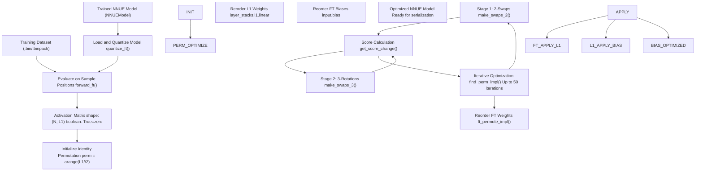
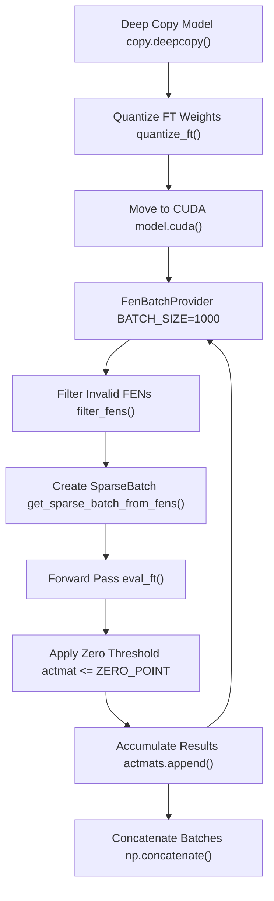
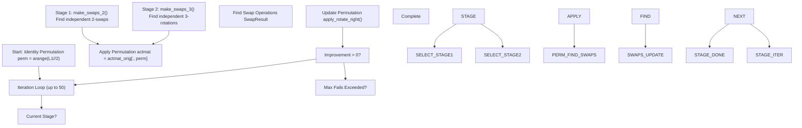
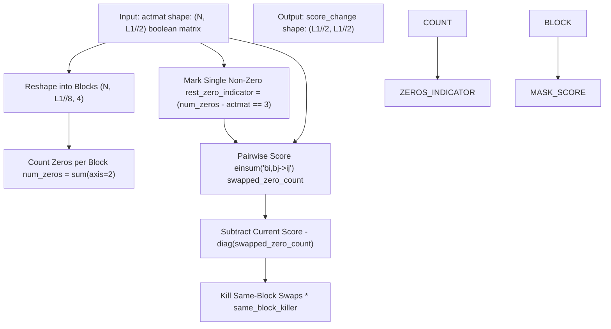
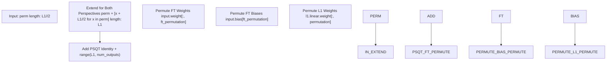
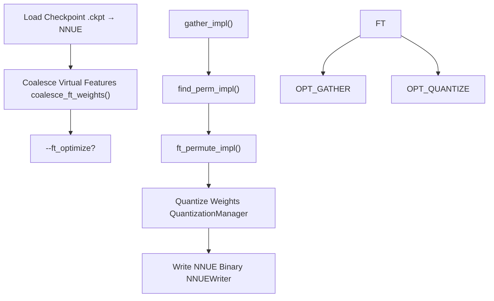

# Feature Transformer Permutation

-   [cross\_check\_eval.py](https://github.com/Chesszyh/nnue-pytorch/blob/024b2064/cross_check_eval.py)
-   [ftperm.py](https://github.com/Chesszyh/nnue-pytorch/blob/024b2064/ftperm.py)

## Purpose and Scope

Feature Transformer Permutation (`ftperm.py`) implements a profile-guided optimization technique that reorders the neurons in the feature transformer layer to maximize zero-valued 4-neuron blocks. This optimization improves SIMD (Single Instruction, Multiple Data) efficiency during inference in the Stockfish chess engine by enabling entire blocks to be skipped when all neurons in the block evaluate to zero.

This optimization is applied during model serialization as a post-training step. For information about the overall serialization workflow, see [Checkpoint Conversion](#5.1). For details about the feature transformer architecture itself, see [Feature Transformer](#4.3).

**Sources:** [ftperm.py1-62](https://github.com/Chesszyh/nnue-pytorch/blob/024b2064/ftperm.py#L1-L62)

## Overview

The optimization process follows a profile-guided approach similar to compiler optimization:

1.  **Profile Phase**: Gather activation patterns by evaluating the model on representative positions from a dataset
2.  **Analysis Phase**: Find an optimal neuron permutation that maximizes the number of all-zero 4-neuron blocks
3.  **Application Phase**: Reorder the feature transformer weights according to the discovered permutation

The algorithm exploits the fact that during inference, neurons are processed in blocks of 4 using SIMD instructions. When all 4 neurons in a block are zero, the entire block can be skipped, resulting in faster evaluation.

**Sources:** [ftperm.py58-65](https://github.com/Chesszyh/nnue-pytorch/blob/024b2064/ftperm.py#L58-L65) [ftperm.py550-677](https://github.com/Chesszyh/nnue-pytorch/blob/024b2064/ftperm.py#L550-L677)

## Workflow Diagram


**Sources:** [ftperm.py652-677](https://github.com/Chesszyh/nnue-pytorch/blob/024b2064/ftperm.py#L652-L677) [ftperm.py365-416](https://github.com/Chesszyh/nnue-pytorch/blob/024b2064/ftperm.py#L365-L416) [ftperm.py520-547](https://github.com/Chesszyh/nnue-pytorch/blob/024b2064/ftperm.py#L520-L547)

## Motivation: SIMD Block Processing

During inference in Stockfish, the feature transformer layer processes neurons in blocks of 4 for SIMD efficiency. The constant `ZERO_BLOCK_SIZE = 4` defines this grouping.

### Why Permutation Matters

When a neuron evaluates to zero (or near-zero after quantization), it contributes nothing to the final evaluation. If all 4 neurons in a block are zero, the entire block can be skipped:

| Block State | SIMD Operations | Efficiency |
| --- | --- | --- |
| \[0, 0, 0, 0\] | Skip entire block | **High** |
| \[0, 0, 0, X\] | Process all 4 | Low |
| \[X, X, X, X\] | Process all 4 | Baseline |

By reordering neurons to group zeros together, more blocks become all-zero, enabling more skips.

### Activation Matrix Representation

The activation matrix is a boolean array of shape `(N, L1)` where:

-   `N` is the number of sample positions
-   `L1` is the feature transformer output size
-   `True` indicates the neuron evaluated to zero (≤ ZERO\_POINT)
-   `False` indicates non-zero activation

**Sources:** [ftperm.py64](https://github.com/Chesszyh/nnue-pytorch/blob/024b2064/ftperm.py#L64-L64) [ftperm.py550-552](https://github.com/Chesszyh/nnue-pytorch/blob/024b2064/ftperm.py#L550-L552) [ftperm.py608-611](https://github.com/Chesszyh/nnue-pytorch/blob/024b2064/ftperm.py#L608-L611)

## Activation Gathering Phase

### Process Overview


### Implementation Details

The gathering process ([ftperm.py550-582](https://github.com/Chesszyh/nnue-pytorch/blob/024b2064/ftperm.py#L550-L582)):

1.  **Model Preparation**: Create a quantized copy of the model to match inference behavior
2.  **Batch Processing**: Process positions in batches of 1000 to manage memory
3.  **FEN Filtering**: Skip positions where the king is in check (cannot be evaluated)
4.  **Forward Pass**: Evaluate only through the feature transformer layer using `forward_ft()`
5.  **Zero Detection**: Apply threshold (`ZERO_POINT = 0.0`) to identify zero activations
6.  **Accumulation**: Collect boolean activation matrices across all batches

The quantization step ([ftperm.py457-463](https://github.com/Chesszyh/nnue-pytorch/blob/024b2064/ftperm.py#L457-L463)) is critical—it ensures the activation patterns match what will occur during inference:

```
# Quantize to int16 for FT weights, int32 for biasesmodel.input.weight.data *= quantization.ft_quantized_onemodel.input.bias.data *= quantization.ft_quantized_one
```
**Sources:** [ftperm.py550-582](https://github.com/Chesszyh/nnue-pytorch/blob/024b2064/ftperm.py#L550-L582) [ftperm.py457-463](https://github.com/Chesszyh/nnue-pytorch/blob/024b2064/ftperm.py#L457-L463) [ftperm.py466-489](https://github.com/Chesszyh/nnue-pytorch/blob/024b2064/ftperm.py#L466-L489) [ftperm.py492-517](https://github.com/Chesszyh/nnue-pytorch/blob/024b2064/ftperm.py#L492-L517)

## Permutation Search Phase

### Algorithm Overview

The search algorithm ([ftperm.py365-416](https://github.com/Chesszyh/nnue-pytorch/blob/024b2064/ftperm.py#L365-L416)) uses an iterative multi-stage approach developed by Daniel Monroe (@Ergodice):


The algorithm maintains a permutation array `perm` of length `L1/2` (half the feature transformer output size). Both perspectives (white and black) use the same permutation.

**Sources:** [ftperm.py365-416](https://github.com/Chesszyh/nnue-pytorch/blob/024b2064/ftperm.py#L365-L416)

### Stage 1: 2-Swaps

The `make_swaps_2()` function ([ftperm.py215-270](https://github.com/Chesszyh/nnue-pytorch/blob/024b2064/ftperm.py#L215-L270)) finds pairs of neurons that should be swapped to increase the number of all-zero blocks:

#### Score Calculation


The key insight is that swapping neurons `i` and `j` improves the score when:

-   Neuron `i` is zero in positions where neuron `j` is the only non-zero in its block
-   Neuron `j` is zero in positions where neuron `i` is the only non-zero in its block

The `rest_zero_indicator` matrix marks elements where all other neurons in the block are zero ([ftperm.py119-131](https://github.com/Chesszyh/nnue-pytorch/blob/024b2064/ftperm.py#L119-L131)).

#### Greedy Selection

The algorithm greedily selects swaps ([ftperm.py240-261](https://github.com/Chesszyh/nnue-pytorch/blob/024b2064/ftperm.py#L240-L261)):

1.  Find the swap `(i, j)` with maximum improvement
2.  If improvement ≤ 0, terminate stage
3.  Add swap to list and mark affected blocks as unavailable
4.  Zeroing out scores for neurons in the same blocks as `i` and `j` ensures all selected swaps are **independent** (can be applied in any order)

**Sources:** [ftperm.py215-270](https://github.com/Chesszyh/nnue-pytorch/blob/024b2064/ftperm.py#L215-L270) [ftperm.py190-203](https://github.com/Chesszyh/nnue-pytorch/blob/024b2064/ftperm.py#L190-L203) [ftperm.py157-187](https://github.com/Chesszyh/nnue-pytorch/blob/024b2064/ftperm.py#L157-L187) [ftperm.py99-154](https://github.com/Chesszyh/nnue-pytorch/blob/024b2064/ftperm.py#L99-L154)

### Stage 2: 3-Rotations

The `make_swaps_3()` function ([ftperm.py273-362](https://github.com/Chesszyh/nnue-pytorch/blob/024b2064/ftperm.py#L273-L362)) extends the optimization to 3-element right-rotations: `(i, j, k) → (k, i, j)`.

#### Why Rotations?

Some improvements require moving 3 neurons in a cycle. For example:

-   Neuron at position A should go to B
-   Neuron at position B should go to C
-   Neuron at position C should go to A

This cannot be achieved with 2-swaps alone.

#### Algorithm Differences

The 3-rotation algorithm ([ftperm.py286-294](https://github.com/Chesszyh/nnue-pytorch/blob/024b2064/ftperm.py#L286-L294)) computes a 3D score tensor:

```
# score_changes[i, j, k] = improvement from rotation (i, j, k)score_changes = (    score_changes[:, :, None]           # score_change[i, j]    + score_changes[None, :, :]         # score_change[j, k]    + (score_changes.T)[:, None, :]     # score_change[k, i])
```
To avoid memory issues, the algorithm compresses to block-level maxima ([ftperm.py301-311](https://github.com/Chesszyh/nnue-pytorch/blob/024b2064/ftperm.py#L301-L311)) before selecting the best rotation.

**Sources:** [ftperm.py273-362](https://github.com/Chesszyh/nnue-pytorch/blob/024b2064/ftperm.py#L273-L362)

### Termination Conditions

The optimization terminates when:

1.  No improvement found in current stage (Stage 1 allows 0 failures, Stage 2 allows 0 failures)
2.  All stages exhausted
3.  Maximum iteration limit (50) reached

**Sources:** [ftperm.py402-414](https://github.com/Chesszyh/nnue-pytorch/blob/024b2064/ftperm.py#L402-L414)

## Permutation Application Phase

### Weight Reordering

The `ft_permute_impl()` function ([ftperm.py520-541](https://github.com/Chesszyh/nnue-pytorch/blob/024b2064/ftperm.py#L520-L541)) applies the discovered permutation to model weights:


### Key Implementation Details

1.  **Perspective Symmetry** ([ftperm.py529-530](https://github.com/Chesszyh/nnue-pytorch/blob/024b2064/ftperm.py#L529-L530)): The same permutation is applied to both white and black perspectives of the feature transformer

2.  **PSQT Preservation** ([ftperm.py532-533](https://github.com/Chesszyh/nnue-pytorch/blob/024b2064/ftperm.py#L532-L533)): PSQT (Piece-Square Table) weights are appended with an identity permutation—they are not reordered

3.  **Three Weight Updates**:

    -   Feature transformer input weights: `(num_features, num_outputs)` → permute columns
    -   Feature transformer biases: `(num_outputs,)` → permute elements
    -   First layer stack weights: `(layer_size, L1)` → permute columns (excluding PSQT inputs)

**Sources:** [ftperm.py520-541](https://github.com/Chesszyh/nnue-pytorch/blob/024b2064/ftperm.py#L520-L541)

## Usage

### Standalone Usage

The script provides three subcommands for manual workflow:

#### 1\. Gather Activation Data

```
python ftperm.py gather \    --net=nn-5af11540bbfe.nnue \    --data=data/fishpack32.binpack \    --count=1000000 \    --features=HalfKAv2_hm \    --out=ftact1m.npy
```
**Parameters:**

-   `--net`: Path to `.nnue` file
-   `--data`: Training dataset (`.bin` or `.binpack`)
-   `--count`: Number of positions to process
-   `--features`: Feature set name
-   `--out`: Output file for activation matrix

#### 2\. Find Optimal Permutation

```
python ftperm.py find_perm \    --data=ftact1m.npy \    --out=ftact.perm
```
#### 3\. Evaluate Permutation

```
python ftperm.py eval_perm \    --data=ftact1m.npy \    --perm=ftact.perm
```
This prints statistics:

-   **Combined zeros in base matrix**: Percentage of all-zero blocks before permutation
-   **Combined zeros in perm matrix**: Percentage after permutation

#### 4\. Apply to Model

```
python serialize.py nn-5af11540bbfe.nnue permuted.nnue \    --features=HalfKAv2_hm \    --ft_perm=ftact.perm
```
**Sources:** [ftperm.py5-32](https://github.com/Chesszyh/nnue-pytorch/blob/024b2064/ftperm.py#L5-L32) [ftperm.py585-649](https://github.com/Chesszyh/nnue-pytorch/blob/024b2064/ftperm.py#L585-L649)

### Integrated Usage

The recommended approach integrates all steps into the serialization process:

```
python serialize.py nn-5af11540bbfe.nnue optimized.nnue \    --features=HalfKAv2_hm \    --ft_optimize \    --ft_optimize_data=data/fishpack32.binpack \    --ft_optimize_count=1000000
```
The `ft_optimize()` function ([ftperm.py652-677](https://github.com/Chesszyh/nnue-pytorch/blob/024b2064/ftperm.py#L652-L677)) performs the complete pipeline:

| Step | Function | Description |
| --- | --- | --- |
| 1 | `gather_impl()` | Gather activation matrix |
| 2 | `find_perm_impl()` | Find optimal permutation |
| 3 | `eval_perm_impl()` | Evaluate improvement |
| 4 | `ft_permute_impl()` | Apply to model weights |

**Sources:** [ftperm.py652-677](https://github.com/Chesszyh/nnue-pytorch/blob/024b2064/ftperm.py#L652-L677) [serialize.py](https://github.com/Chesszyh/nnue-pytorch/blob/024b2064/serialize.py#LNaN-LNaN)

## GPU Acceleration

### CuPy Integration

The algorithm supports GPU acceleration via CuPy ([ftperm.py41](https://github.com/Chesszyh/nnue-pytorch/blob/024b2064/ftperm.py#L41-L41)) for the computationally intensive score calculation:

```
--use-cupy      # Use GPU (default)--no-cupy       # Use NumPy (CPU fallback)--device=0      # GPU device index
```
### Memory Considerations

The score calculation requires storing large matrices:

-   For `L1 = 1024`: score matrix is `512 × 512` per batch
-   For `L1 = 2048`: score matrix is `1024 × 1024` per batch

The implementation uses batching ([ftperm.py164-169](https://github.com/Chesszyh/nnue-pytorch/blob/024b2064/ftperm.py#L164-L169)) to process activation data in chunks:

```
BATCH_SIZE = 10000  # Positions per batch
```
If GPU memory is insufficient, reduce `--count` or use `--no-cupy` for CPU fallback.

**Sources:** [ftperm.py100-154](https://github.com/Chesszyh/nnue-pytorch/blob/024b2064/ftperm.py#L100-L154) [ftperm.py157-187](https://github.com/Chesszyh/nnue-pytorch/blob/024b2064/ftperm.py#L157-L187) [ftperm.py686-693](https://github.com/Chesszyh/nnue-pytorch/blob/024b2064/ftperm.py#L686-L693)

## Performance Characteristics

### Computational Complexity

| Stage | Time Complexity | Space Complexity | Parallelizable |
| --- | --- | --- | --- |
| Activation Gathering | O(N × L1) | O(N × L1) | Yes (GPU) |
| 2-Swap Score | O(N × L1²) | O(L1²) | Yes (GPU) |
| 2-Swap Selection | O(L1² × iterations) | O(L1²) | No |
| 3-Rotation Score | O(N × L1³) | O(L1³) compressed | Yes (GPU) |
| 3-Rotation Selection | O(L1³ × iterations) | O(L1³) compressed | No |

Where:

-   `N` = number of sample positions
-   `L1` = feature transformer output size (typically 1024 or 2048)

### Typical Performance

For `--count=1000000` on a modern GPU:

-   Activation gathering: ~2-5 minutes
-   Permutation search: ~10-30 minutes
-   Total improvement: 0.5-2.0% more zero blocks

### Improvement Metrics

The algorithm tracks improvement as percentage increase in all-zero blocks:

```
Improvement = (new_zero_blocks - old_zero_blocks) / total_blocks * 100
```
Typical results ([ftperm.py263-268](https://github.com/Chesszyh/nnue-pytorch/blob/024b2064/ftperm.py#L263-L268) [ftperm.py359-361](https://github.com/Chesszyh/nnue-pytorch/blob/024b2064/ftperm.py#L359-L361)):

-   Stage 1 (2-swaps): 0.5-1.5% improvement
-   Stage 2 (3-rotations): 0.1-0.5% additional improvement

**Sources:** [ftperm.py263-268](https://github.com/Chesszyh/nnue-pytorch/blob/024b2064/ftperm.py#L263-L268) [ftperm.py359-361](https://github.com/Chesszyh/nnue-pytorch/blob/024b2064/ftperm.py#L359-L361) [ftperm.py608-625](https://github.com/Chesszyh/nnue-pytorch/blob/024b2064/ftperm.py#L608-L625)

## Implementation Details

### Data Structures

The algorithm uses the following key data structures:

| Structure | Type | Shape | Description |
| --- | --- | --- | --- |
| `actmat` | `np.ndarray[np.bool_]` | `(N, L1//2)` | Activation matrix (reshaped from `(N, L1)`) |
| `perm` | `np.ndarray[np.int_]` | `(L1//2,)` | Current neuron permutation |
| `score_change` | `np.ndarray[np.int_]` | `(L1//2, L1//2)` | Improvement matrix for 2-swaps |
| `score_changes` | `np.ndarray[np.int_]` | `(L1//2, L1//2, L1//2)` | Improvement tensor for 3-rotations |

### Permutation Representation

The permutation operates on half the feature transformer (one perspective) due to symmetry. The full permutation mapping is:

```
Neuron Index     Permutation Applied
────────────     ───────────────────
0 to L1//2-1     perm[0] to perm[L1//2-1]
L1//2 to L1-1    perm[0]+L1//2 to perm[L1//2-1]+L1//2
L1 to num_outputs  Identity (PSQT, unchanged)
```
**Sources:** [ftperm.py368-374](https://github.com/Chesszyh/nnue-pytorch/blob/024b2064/ftperm.py#L368-L374) [ftperm.py520-533](https://github.com/Chesszyh/nnue-pytorch/blob/024b2064/ftperm.py#L520-L533)

### Swap Operations

Two primitive operations manipulate permutations:

#### apply\_swap

```
def apply_swap(perm: npt.NDArray, i: int, j: int) -> None:    """Swap i-th and j-th elements in the array perm."""    perm[i], perm[j] = perm[j], perm[i]
```
#### apply\_rotate\_right

```
def apply_rotate_right(perm: npt.NDArray, indices: tuple[int, ...]) -> None:    """Right-rotate values at selected indices."""    # (i, j, k) → (k, i, j)    values = [perm[i] for i in indices]    new_values = [values[-1]] + values[:-1]    for i, j in zip(indices, new_values):        perm[i] = j
```
These operations are applied to the permutation array, not directly to weights. Weight reordering happens once at the end.

**Sources:** [ftperm.py80-96](https://github.com/Chesszyh/nnue-pytorch/blob/024b2064/ftperm.py#L80-L96)

### Block-Level Independence Guarantee

The algorithm ensures all selected swaps/rotations are independent by zeroing out scores for affected blocks ([ftperm.py256-261](https://github.com/Chesszyh/nnue-pytorch/blob/024b2064/ftperm.py#L256-L261) [ftperm.py354-357](https://github.com/Chesszyh/nnue-pytorch/blob/024b2064/ftperm.py#L354-L357)):

```
# After selecting a swap (i, j)indices_to_kill = all_indices_in_same_block(i) + all_indices_in_same_block(j)for index in indices_to_kill:    score_change[:, index] = 0  # Zero out columns    score_change[index, :] = 0  # Zero out rows
```
This prevents later iterations from selecting overlapping swaps, which would invalidate score calculations.

**Sources:** [ftperm.py232-261](https://github.com/Chesszyh/nnue-pytorch/blob/024b2064/ftperm.py#L232-L261) [ftperm.py354-357](https://github.com/Chesszyh/nnue-pytorch/blob/024b2064/ftperm.py#L354-L357)

## Integration with Serialization Pipeline

The feature transformer permutation integrates with the model serialization pipeline as an optional optimization step:


The permutation is applied **after** virtual feature coalescing but **before** quantization. This ordering ensures:

1.  Virtual features are already collapsed, so permutation operates on real features only
2.  Quantization accounts for the permuted weight layout
3.  The final binary format reflects the optimized neuron order

**Sources:** [ftperm.py652-677](https://github.com/Chesszyh/nnue-pytorch/blob/024b2064/ftperm.py#L652-L677) [serialize.py workflow implied by ftperm.py22-30](https://github.com/Chesszyh/nnue-pytorch/blob/024b2064/serialize.py workflow implied by ftperm.py#L22-L30)

---

**Complete Sources:** [ftperm.py1-749](https://github.com/Chesszyh/nnue-pytorch/blob/024b2064/ftperm.py#L1-L749) [cross\_check\_eval.py1-222](https://github.com/Chesszyh/nnue-pytorch/blob/024b2064/cross_check_eval.py#L1-L222)
