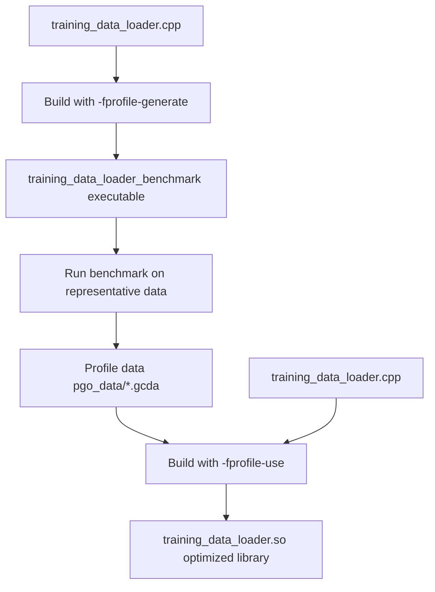
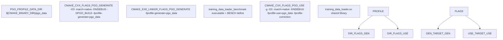
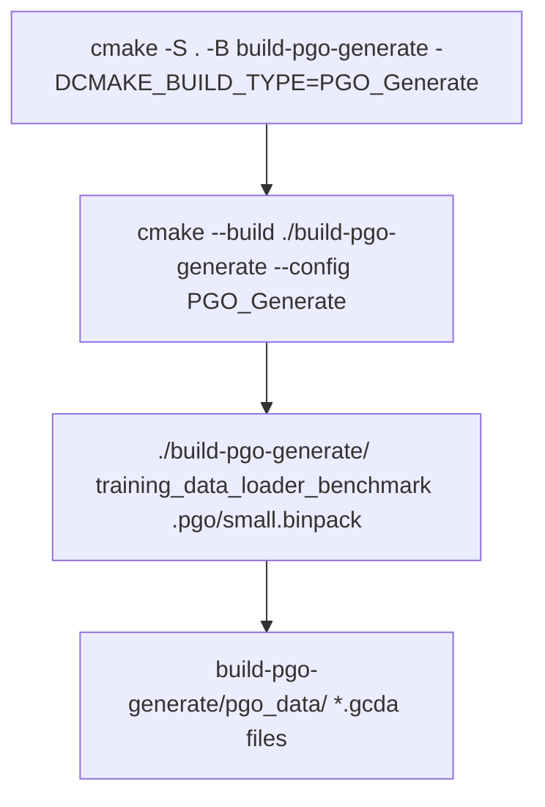
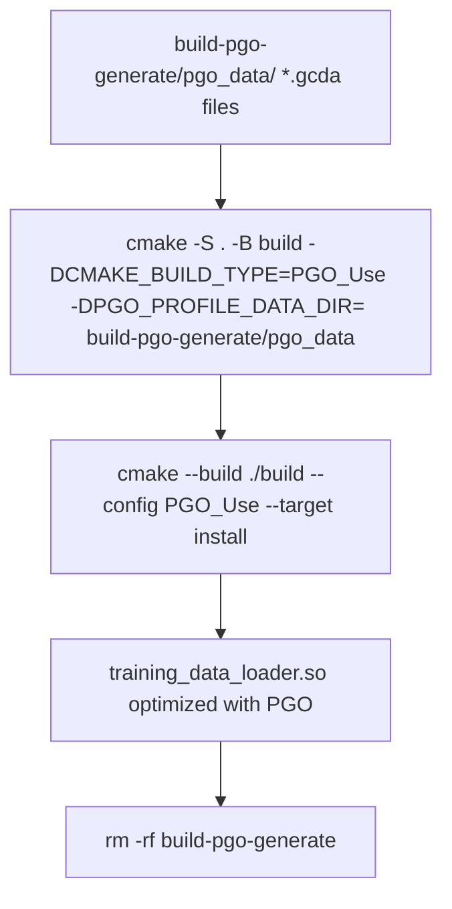
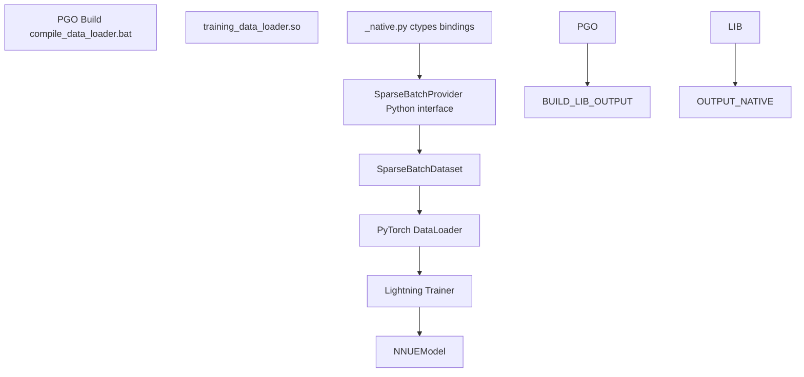

# Profile-Guided Optimization (PGO)

-   [.pgo/small.binpack](https://github.com/Chesszyh/nnue-pytorch/blob/024b2064/.pgo/small.binpack)
-   [CMakeLists.txt](https://github.com/Chesszyh/nnue-pytorch/blob/024b2064/CMakeLists.txt)
-   [compile\_data\_loader.bat](https://github.com/Chesszyh/nnue-pytorch/blob/024b2064/compile_data_loader.bat)
-   [lib/nnue\_training\_data\_formats.h](https://github.com/Chesszyh/nnue-pytorch/blob/024b2064/lib/nnue_training_data_formats.h)
-   [lib/nnue\_training\_data\_stream.h](https://github.com/Chesszyh/nnue-pytorch/blob/024b2064/lib/nnue_training_data_stream.h)
-   [training\_data\_loader.cpp](https://github.com/Chesszyh/nnue-pytorch/blob/024b2064/training_data_loader.cpp)

This document covers the Profile-Guided Optimization (PGO) build process for the C++ training data loader. PGO is a compiler optimization technique that uses runtime profiling information to generate more efficient machine code. For information about other performance optimizations in the model itself, see [Feature Transformer Permutation](#6.1).

The C++ data loader ([training\_data\_loader.cpp](https://github.com/Chesszyh/nnue-pytorch/blob/024b2064/training_data_loader.cpp)) is the most performance-critical component of the training pipeline, responsible for reading, parsing, and transforming training data at high throughput. PGO enables the compiler to optimize hot code paths based on actual usage patterns, resulting in measurable performance improvements.

## PGO Overview

Profile-Guided Optimization is a two-phase compilation process:

1.  **Profile Generation Phase**: Compile the code with instrumentation that records execution statistics during runtime
2.  **Profile Use Phase**: Recompile the code using the recorded statistics to guide optimizations

The compiler uses profile data to make better decisions about:

-   Function inlining
-   Branch prediction
-   Code layout and instruction cache optimization
-   Register allocation
-   Loop unrolling


**Diagram: Two-Phase PGO Build Process**

Sources: [CMakeLists.txt13-81](https://github.com/Chesszyh/nnue-pytorch/blob/024b2064/CMakeLists.txt#L13-L81) [compile\_data\_loader.bat1-12](https://github.com/Chesszyh/nnue-pytorch/blob/024b2064/compile_data_loader.bat#L1-L12)

## Build System Configuration

The PGO build process is configured in the CMake build system through custom build types and compiler flags.

### CMake Build Types

[CMakeLists.txt13-18](https://github.com/Chesszyh/nnue-pytorch/blob/024b2064/CMakeLists.txt#L13-L18) defines the PGO configuration variables and flags:


**Diagram: CMake PGO Configuration**

Sources: [CMakeLists.txt13-81](https://github.com/Chesszyh/nnue-pytorch/blob/024b2064/CMakeLists.txt#L13-L81)

### Compiler Flags

The following table shows the compiler flags used in each phase:

| Phase | Compiler Flags | Linker Flags | Purpose |
| --- | --- | --- | --- |
| **PGO\_Generate** | `-O3 -march=native -DNDEBUG -DPGO_BUILD -fprofile-generate=${PGO_PROFILE_DATA_DIR}` | `-fprofile-generate=${PGO_PROFILE_DATA_DIR}` | Enable instrumentation to collect profile data |
| **PGO\_USE** | `-g -O3 -march=native -DNDEBUG -fprofile-use=${PGO_PROFILE_DATA_DIR} -fprofile-correction` | (standard) | Use profile data to guide optimizations |
| **Standard Release** | `-O3 -march=native -DNDEBUG` | (standard) | Default optimizations without PGO |

**Key flags:**

-   `-fprofile-generate`: Instruments code to collect execution counts
-   `-fprofile-use`: Uses collected data to optimize code generation
-   `-fprofile-correction`: Handles minor inconsistencies between profile and source
-   `-march=native`: Enables CPU-specific optimizations
-   `-DPGO_BUILD`: Preprocessor define for conditional compilation during profiling

Sources: [CMakeLists.txt10-17](https://github.com/Chesszyh/nnue-pytorch/blob/024b2064/CMakeLists.txt#L10-L17)

## Build Logic

The CMake build system uses conditional logic to switch between PGO phases and normal builds:

```mermaid
flowchart TD
    START["CMake Configuration"]
    CHECK_TYPE["CMAKE_BUILD_TYPE?"]
    PGO_GEN["Build Type: PGO_Generate"]
    PGO_USE["Build Type: PGO_USE"]
    NORMAL["Other Build Type"]
    GEN_FLAGS["Set CMAKE_CXX_FLAGS CMAKE_EXE_LINKER_FLAGS to PGO_Generate values"]
    USE_FLAGS["Set CMAKE_CXX_FLAGS to PGO_USE values"]
    GEN_TARGET["Build executable: training_data_loader_benchmark with BENCH definition"]
    USE_TARGET["Build shared library: training_data_loader.so"]
    NORMAL_TARGET["Build shared library: training_data_loader.so"]
    MKDIR["Create directory: ${PGO_PROFILE_DATA_DIR}"]

    START --> CHECK_TYPE
    CHECK --> TYPE_PGO_GEN
    CHECK --> TYPE_PGO_USE
    CHECK --> TYPE_NORMAL
    PGO --> GEN_GEN_FLAGS
    GEN --> FLAGS_GEN_TARGET
    GEN --> TARGET_MKDIR
    PGO --> USE_USE_FLAGS
    USE --> FLAGS_USE_TARGET
    NORMAL --> NORMAL_TARGET
```


**Diagram: CMake Build Logic Flow**

Sources: [CMakeLists.txt64-81](https://github.com/Chesszyh/nnue-pytorch/blob/024b2064/CMakeLists.txt#L64-L81)

### Build Targets

**Profile Generation Build** ([CMakeLists.txt64-70](https://github.com/Chesszyh/nnue-pytorch/blob/024b2064/CMakeLists.txt#L64-L70)):

-   Creates `training_data_loader_benchmark` executable
-   Defines `BENCH` preprocessor macro to enable benchmark code
-   Links against `Threads::Threads`
-   Creates `${PGO_PROFILE_DATA_DIR}` directory for profile output

**Profile Use Build** ([CMakeLists.txt72-74](https://github.com/Chesszyh/nnue-pytorch/blob/024b2064/CMakeLists.txt#L72-L74)):

-   Creates `training_data_loader.so` shared library
-   Uses profile data from previous generation phase

**Standard Build** ([CMakeLists.txt75-80](https://github.com/Chesszyh/nnue-pytorch/blob/024b2064/CMakeLists.txt#L75-L80)):

-   Creates `training_data_loader.so` shared library without PGO
-   Installs to `CMAKE_INSTALL_PREFIX`

## Running the PGO Build

The complete PGO build process is automated in [compile\_data\_loader.bat](https://github.com/Chesszyh/nnue-pytorch/blob/024b2064/compile_data_loader.bat) This script performs both phases sequentially:

### Step 1: Generate Profile Data


**Diagram: Profile Generation Commands**

[compile\_data\_loader.bat1-4](https://github.com/Chesszyh/nnue-pytorch/blob/024b2064/compile_data_loader.bat#L1-L4) performs:

1.  **Configure**: Creates build directory with `PGO_Generate` build type
2.  **Build**: Compiles instrumented benchmark executable
3.  **Run**: Executes benchmark on representative training data (`.pgo/small.binpack`)
    -   This generates `*.gcda` profile files in `build-pgo-generate/pgo_data/`

### Step 2: Build with Profile Data


**Diagram: Profile Use Commands**

[compile\_data\_loader.bat6-12](https://github.com/Chesszyh/nnue-pytorch/blob/024b2064/compile_data_loader.bat#L6-L12) performs:

1.  **Configure**: Creates build directory with `PGO_USE` build type, pointing to profile data
2.  **Build**: Compiles optimized library using profile information
3.  **Install**: Copies `training_data_loader.so` to install directory
4.  **Cleanup**: Removes temporary profile generation build directory

Sources: [compile\_data\_loader.bat1-12](https://github.com/Chesszyh/nnue-pytorch/blob/024b2064/compile_data_loader.bat#L1-L12)

## Profile Data Requirements

For effective PGO optimization, the profiling run must be **representative** of actual workload:

### Benchmark Data

The benchmark uses `.pgo/small.binpack` training data ([compile\_data\_loader.bat4](https://github.com/Chesszyh/nnue-pytorch/blob/024b2064/compile_data_loader.bat#L4-L4)):

-   Must contain diverse chess positions
-   Should exercise common code paths in the data loader
-   Should represent typical feature extraction patterns

### Profile Data Files

Generated profile data is stored in `*.gcda` format:

-   Located in `${PGO_PROFILE_DATA_DIR}` (default: `build-pgo-generate/pgo_data/`)
-   Contains execution counts for each basic block
-   Used by compiler during profile-use phase

## Integration with Training Pipeline

The PGO-optimized data loader integrates seamlessly into the training pipeline:


**Diagram: PGO Library Integration**

The optimized `training_data_loader.so` library is loaded by the Python training code via ctypes. The PGO optimizations improve:

-   Feature extraction throughput
-   Batch creation performance
-   Thread coordination efficiency
-   Memory access patterns

Sources: [training\_data\_loader.cpp1-1500](https://github.com/Chesszyh/nnue-pytorch/blob/024b2064/training_data_loader.cpp#L1-L1500) [compile\_data\_loader.bat1-12](https://github.com/Chesszyh/nnue-pytorch/blob/024b2064/compile_data_loader.bat#L1-L12)

## Performance Considerations

### What PGO Optimizes

In the context of `training_data_loader.cpp`, PGO particularly benefits:

1.  **Feature Extraction Hot Paths** ([training\_data\_loader.cpp60-622](https://github.com/Chesszyh/nnue-pytorch/blob/024b2064/training_data_loader.cpp#L60-L622)):

    -   `HalfKP::fill_features_sparse`
    -   `HalfKAv2_hm::fill_features_sparse`
    -   `Full_Threats::fill_features_sparse`
    -   Sparse index calculation and sorting
2.  **Batch Processing** ([training\_data\_loader.cpp675-760](https://github.com/Chesszyh/nnue-pytorch/blob/024b2064/training_data_loader.cpp#L675-L760)):

    -   `SparseBatch` constructor
    -   Feature coalescing loops
    -   Memory allocation patterns
3.  **Stream Threading** ([training\_data\_loader.cpp804-924](https://github.com/Chesszyh/nnue-pytorch/blob/024b2064/training_data_loader.cpp#L804-L924)):

    -   `FeaturedBatchStream` worker threads
    -   Mutex contention patterns
    -   Condition variable signaling

### Expected Performance Gains

PGO typically provides:

-   **5-15%** improvement in data loading throughput
-   Better instruction cache utilization
-   Reduced branch mispredictions
-   Optimized function inlining decisions

### BMI2 Interaction

PGO works in conjunction with BMI2 CPU feature detection ([CMakeLists.txt24-60](https://github.com/Chesszyh/nnue-pytorch/blob/024b2064/CMakeLists.txt#L24-L60)):

-   If CPU supports BMI2, `HAS_BMI2` is defined
-   PGO optimizes BMI2 code paths differently from fallback paths
-   Profile data reflects actual BMI2 usage patterns

Sources: [training\_data\_loader.cpp1-1500](https://github.com/Chesszyh/nnue-pytorch/blob/024b2064/training_data_loader.cpp#L1-L1500) [CMakeLists.txt24-60](https://github.com/Chesszyh/nnue-pytorch/blob/024b2064/CMakeLists.txt#L24-L60)

## Troubleshooting

### Common Issues

| Issue | Cause | Solution |
| --- | --- | --- |
| Profile data not found | Benchmark not run before profile-use phase | Ensure `.pgo/small.binpack` exists and benchmark completes successfully |
| Profile version mismatch | Compiler version changed between phases | Use same compiler version for both PGO phases |
| Performance regression | Non-representative profiling data | Use larger/more diverse dataset for profiling run |
| Build fails with `-fprofile-correction` | Severe profile mismatch | Regenerate profile data with current source code |

### Verification

To verify PGO is working:

1.  **Check for profile data files**: `ls build-pgo-generate/pgo_data/*.gcda`
2.  **Compare file sizes**: PGO-optimized library may be different size than normal build
3.  **Benchmark performance**: Run actual training and measure data loader throughput

Sources: [CMakeLists.txt1-82](https://github.com/Chesszyh/nnue-pytorch/blob/024b2064/CMakeLists.txt#L1-L82) [compile\_data\_loader.bat1-12](https://github.com/Chesszyh/nnue-pytorch/blob/024b2064/compile_data_loader.bat#L1-L12)

## Manual PGO Build

For manual control or debugging, execute the PGO phases separately:

### Phase 1: Generate

```
# Configure for profile generationcmake -S . -B build-pgo-generate -DCMAKE_BUILD_TYPE=PGO_Generate# Build benchmark executablecmake --build ./build-pgo-generate --config PGO_Generate# Run benchmark on representative data./build-pgo-generate/training_data_loader_benchmark /path/to/training/data.binpack
```
### Phase 2: Use

```
# Configure for profile usecmake -S . -B build \    -DCMAKE_BUILD_TYPE=PGO_Use \    -DPGO_PROFILE_DATA_DIR=build-pgo-generate/pgo_data \    -DCMAKE_INSTALL_PREFIX="./"# Build optimized librarycmake --build ./build --config PGO_Use --target install
```
### Cleanup

```
# Remove temporary build directoryrm -rf build-pgo-generate
```
Sources: [compile\_data\_loader.bat1-12](https://github.com/Chesszyh/nnue-pytorch/blob/024b2064/compile_data_loader.bat#L1-L12)

## Related Build Options

The PGO build system integrates with other CMake configurations:

-   **CPU Feature Detection**: BMI2 support detected at configure time ([CMakeLists.txt24-60](https://github.com/Chesszyh/nnue-pytorch/blob/024b2064/CMakeLists.txt#L24-L60))
-   **Threading**: Links against `Threads::Threads` ([CMakeLists.txt62](https://github.com/Chesszyh/nnue-pytorch/blob/024b2064/CMakeLists.txt#L62-L62))
-   **Optimization Flags**: Uses `-march=native` for CPU-specific instructions ([CMakeLists.txt10](https://github.com/Chesszyh/nnue-pytorch/blob/024b2064/CMakeLists.txt#L10-L10))
-   **Debug Symbols**: PGO\_USE build includes `-g` for profiling with debug info ([CMakeLists.txt17](https://github.com/Chesszyh/nnue-pytorch/blob/024b2064/CMakeLists.txt#L17-L17))

For information about runtime performance analysis, see [Performance Analysis Tools](#6.3).

Sources: [CMakeLists.txt1-82](https://github.com/Chesszyh/nnue-pytorch/blob/024b2064/CMakeLists.txt#L1-L82)
