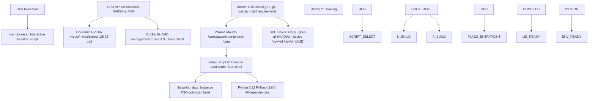
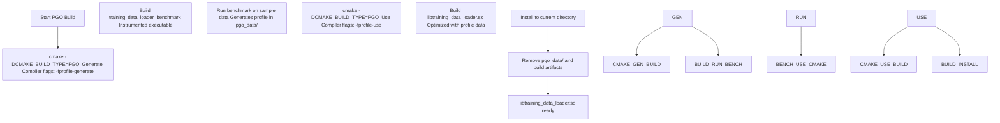
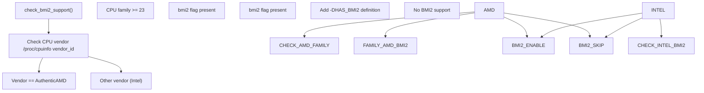

# Environment Setup

-   [.gitignore](https://github.com/Chesszyh/nnue-pytorch/blob/024b2064/.gitignore)
-   [.pgo/small.binpack](https://github.com/Chesszyh/nnue-pytorch/blob/024b2064/.pgo/small.binpack)
-   [CMakeLists.txt](https://github.com/Chesszyh/nnue-pytorch/blob/024b2064/CMakeLists.txt)
-   [Dockerfile.AMD](https://github.com/Chesszyh/nnue-pytorch/blob/024b2064/Dockerfile.AMD)
-   [Dockerfile.NVIDIA](https://github.com/Chesszyh/nnue-pytorch/blob/024b2064/Dockerfile.NVIDIA)
-   [README.md](https://github.com/Chesszyh/nnue-pytorch/blob/024b2064/README.md)
-   [compile\_data\_loader.bat](https://github.com/Chesszyh/nnue-pytorch/blob/024b2064/compile_data_loader.bat)
-   [requirements.txt](https://github.com/Chesszyh/nnue-pytorch/blob/024b2064/requirements.txt)
-   [run\_docker.sh](https://github.com/Chesszyh/nnue-pytorch/blob/024b2064/run_docker.sh)
-   [setup\_script.sh](https://github.com/Chesszyh/nnue-pytorch/blob/024b2064/setup_script.sh)

This document guides you through setting up the development environment for nnue-pytorch. Two setup methods are available: Docker-based (recommended) and local installation. Both methods prepare the environment for training NNUE neural networks, including compilation of the native C++ data loader and installation of Python dependencies.

For information about the training data format and how data loading works after setup, see [Training Data Formats](#3.1) and [C++ Data Loader Architecture](#3.2). For build system details beyond initial setup, see [Build System (CMake)](#9.1).

---

## Overview of Setup Options

The repository supports two installation approaches with different tradeoffs:

| Approach | Advantages | Disadvantages |
| --- | --- | --- |
| **Docker** | Zero local configuration; includes CUDA/ROCm; consistent environment; automatic dependency management | Requires 30-60GB disk space; Docker overhead |
| **Local** | Full control; no container overhead; easier debugging | Manual dependency management; Python/C++ environment complexity; CUDA/ROCm toolkit required |

Both approaches ultimately produce the same artifacts: a compiled `libtraining_data_loader.so` (C++ shared library) and a Python environment with all required packages.

---

## Docker Setup (Recommended)

### Architecture Overview

The Docker-based setup uses official PyTorch containers from NVIDIA or AMD ROCm, adding only minimal build tools and project-specific dependencies.


**Sources:** [run\_docker.sh](https://github.com/Chesszyh/nnue-pytorch/blob/024b2064/run_docker.sh) [Dockerfile.NVIDIA](https://github.com/Chesszyh/nnue-pytorch/blob/024b2064/Dockerfile.NVIDIA) [Dockerfile.AMD](https://github.com/Chesszyh/nnue-pytorch/blob/024b2064/Dockerfile.AMD) [setup\_script.sh](https://github.com/Chesszyh/nnue-pytorch/blob/024b2064/setup_script.sh)

### Prerequisites

**For NVIDIA users:**

-   Docker Engine
-   Up-to-date NVIDIA driver (compatible with CUDA 12.x)
-   NVIDIA Container Toolkit

**For AMD users:**

-   Docker Engine
-   Up-to-date ROCm driver (6.4.3 or compatible)

Driver compatibility is automatically handled by the container runtime. Your host does not need CUDA or ROCm toolkits installed—only the driver.

**Sources:** [README.md9-20](https://github.com/Chesszyh/nnue-pytorch/blob/024b2064/README.md#L9-L20)

### Running the Setup Script

Execute the interactive setup script:

```
./run_docker.sh
```
The script performs the following steps:

1.  **GPU vendor selection**: Prompts for NVIDIA or AMD
2.  **Image build**: Selects [Dockerfile.NVIDIA](https://github.com/Chesszyh/nnue-pytorch/blob/024b2064/Dockerfile.NVIDIA) or [Dockerfile.AMD](https://github.com/Chesszyh/nnue-pytorch/blob/024b2064/Dockerfile.AMD) and builds the image
3.  **Data directory input**: Prompts for a path to mount as `/data` in the container
4.  **Container launch**: Starts the container with appropriate GPU flags

The container image is tagged as `nnue-pytorch:nvidia` or `nnue-pytorch:amd` and can be reused without rebuilding.

**Sources:** [run\_docker.sh1-46](https://github.com/Chesszyh/nnue-pytorch/blob/024b2064/run_docker.sh#L1-L46)

### Container Initialization Flow

> **[Mermaid sequence]**
> *(图表结构无法解析)*

**Sources:** [setup\_script.sh1-5](https://github.com/Chesszyh/nnue-pytorch/blob/024b2064/setup_script.sh#L1-L5) [compile\_data\_loader.bat1-12](https://github.com/Chesszyh/nnue-pytorch/blob/024b2064/compile_data_loader.bat#L1-L12)

### Container Configuration Details

**NVIDIA container** ([Dockerfile.NVIDIA](https://github.com/Chesszyh/nnue-pytorch/blob/024b2064/Dockerfile.NVIDIA)):

-   Base image: `nvcr.io/nvidia/pytorch:25.03-py3`
-   Includes: CUDA 12.x, cuDNN, PyTorch 2.6.0, Python 3.12
-   GPU access: `--gpus all` flag

**AMD container** ([Dockerfile.AMD](https://github.com/Chesszyh/nnue-pytorch/blob/024b2064/Dockerfile.AMD)):

-   Base image: `rocm/pytorch:rocm6.4.3_ubuntu24.04_py3.12_pytorch_release_2.6.0`
-   Includes: ROCm 6.4.3, PyTorch 2.6.0, Python 3.12
-   Additional step: CuPy installation with HIP backend ([Dockerfile.AMD14](https://github.com/Chesszyh/nnue-pytorch/blob/024b2064/Dockerfile.AMD#L14-L14))
-   GPU access: `--device /dev/kfd --device /dev/dri`

Both containers install system packages (g++, git, curl) and Python dependencies from [requirements.txt](https://github.com/Chesszyh/nnue-pytorch/blob/024b2064/requirements.txt)

**Sources:** [Dockerfile.NVIDIA1-18](https://github.com/Chesszyh/nnue-pytorch/blob/024b2064/Dockerfile.NVIDIA#L1-L18) [Dockerfile.AMD1-20](https://github.com/Chesszyh/nnue-pytorch/blob/024b2064/Dockerfile.AMD#L1-L20)

---

## Local Installation

### Prerequisites

Local installation requires manual setup of the following components:

| Component | Minimum Version | Purpose |
| --- | --- | --- |
| **CMake** | 3.10 | Build system for C++ data loader |
| **C++ Compiler** | C++20 support | Required for `training_data_loader.cpp` |
| **Python** | 3.10+ | PyTorch and training scripts |
| **CUDA Toolkit** (NVIDIA) | 12.x | GPU acceleration |
| **ROCm** (AMD) | 6.x | GPU acceleration |

**Sources:** [CMakeLists.txt1-20](https://github.com/Chesszyh/nnue-pytorch/blob/024b2064/CMakeLists.txt#L1-L20)

### Python Environment Setup

1.  Create a virtual environment:

```
python3 -m venv envsource env/bin/activate  # Linux/Mac# or: env\Scripts\activate  # Windows
```
2.  Install Python dependencies:

```
pip install -r requirements.txt
```
The [requirements.txt](https://github.com/Chesszyh/nnue-pytorch/blob/024b2064/requirements.txt) file specifies:

-   `lightning`: PyTorch Lightning framework for training orchestration
-   `psutil`, `GPUtil`: System monitoring (used by `easy_train.py`)
-   `asciimatics`: TUI dashboard rendering
-   `python-chess==0.31.4`: Chess-specific utilities
-   `matplotlib`, `tensorboard`: Visualization and logging
-   `numba`: JIT compilation for performance-critical Python code
-   `numpy<2.0`: Numerical operations (version constraint for compatibility)
-   `requests`: HTTP client for downloading dependencies

**Sources:** [requirements.txt1-10](https://github.com/Chesszyh/nnue-pytorch/blob/024b2064/requirements.txt#L1-L10)

### C++ Data Loader Compilation

The C++ data loader (`training_data_loader.cpp`) must be compiled to a shared library. Two build approaches are available: standard build and Profile-Guided Optimization (PGO) build.

#### Standard Build

```
cmake -S . -B build -DCMAKE_BUILD_TYPE=Releasecmake --build ./buildcmake --install ./build --prefix ./
```
This produces `libtraining_data_loader.so` (Linux) or equivalent platform-specific library.

**Sources:** [CMakeLists.txt1-82](https://github.com/Chesszyh/nnue-pytorch/blob/024b2064/CMakeLists.txt#L1-L82)

#### PGO Build (Recommended)

Profile-Guided Optimization provides 10-20% performance improvement by optimizing the compiled code based on runtime profiling. The [compile\_data\_loader.bat](https://github.com/Chesszyh/nnue-pytorch/blob/024b2064/compile_data_loader.bat) script automates the two-phase process:


Execute the PGO build:

```
sh compile_data_loader.bat
```
The script requires a sample `.binpack` file at `.pgo/small.binpack` for profiling.

**Sources:** [compile\_data\_loader.bat1-12](https://github.com/Chesszyh/nnue-pytorch/blob/024b2064/compile_data_loader.bat#L1-L12) [CMakeLists.txt13-74](https://github.com/Chesszyh/nnue-pytorch/blob/024b2064/CMakeLists.txt#L13-L74)

### Build System Configuration

The CMake build system ([CMakeLists.txt](https://github.com/Chesszyh/nnue-pytorch/blob/024b2064/CMakeLists.txt)) provides several configuration options:

#### Build Types

| Build Type | Compiler Flags | Use Case |
| --- | --- | --- |
| `Debug` | `-g` | Development with debug symbols |
| `Release` | `-O3 -march=native -DNDEBUG` | Production without debug info |
| `RelWithDebInfo` | `-g -O3 -march=native -DNDEBUG` | Production with debug symbols |
| `PGO_Generate` | `-O3 -march=native -fprofile-generate` | First phase of PGO |
| `PGO_Use` | `-g -O3 -march=native -fprofile-use` | Second phase of PGO |

**Sources:** [CMakeLists.txt5-74](https://github.com/Chesszyh/nnue-pytorch/blob/024b2064/CMakeLists.txt#L5-L74)

#### BMI2 CPU Feature Detection

The build system automatically detects BMI2 (Bit Manipulation Instruction Set 2) support:


BMI2 detection is important because early AMD Zen processors (family < 23) have slow BMI2 implementations. When `HAS_BMI2` is defined, the data loader uses optimized bit manipulation operations.

**Sources:** [CMakeLists.txt24-60](https://github.com/Chesszyh/nnue-pytorch/blob/024b2064/CMakeLists.txt#L24-L60)

---

## Verification

After setup (Docker or local), verify the environment:

### Check C++ Data Loader

```
ls -lh libtraining_data_loader.so  # Linuxls -lh libtraining_data_loader.dylib  # macOSls -lh libtraining_data_loader.dll  # Windows
```
The library should exist in the repository root.

### Check Python Environment

```
import torchimport lightningfrom data_loader import create_sparse_batch_data_loaderprint(f"PyTorch: {torch.__version__}")print(f"CUDA available: {torch.cuda.is_available()}")print(f"Lightning: {lightning.__version__}")
```
Expected output shows PyTorch 2.6+ with CUDA/ROCm support enabled.

### Test Data Loader Compilation

The Python `data_loader` module automatically loads the compiled library via ctypes. If the library is missing or incompatible, imports will fail with clear error messages.

**Sources:** This verification approach is implied by the build artifacts and the module structure in the data pipeline.

---

## Common Issues and Troubleshooting

| Issue | Cause | Solution |
| --- | --- | --- |
| `libtraining_data_loader.so not found` | C++ library not compiled | Run `sh compile_data_loader.bat` |
| `CUDA out of memory` during build | Container memory limits | Increase Docker memory allocation or reduce parallelism |
| `bmi2` detection fails on AMD Zen 1/2 | Intentional for slow BMI2 | Normal behavior; code will use fallback implementation |
| Docker build exceeds disk space | Large base images | Clean Docker cache: `docker system prune -a` |
| PGO profile not found | Missing `.pgo/small.binpack` | Download sample training data |

**Sources:** Based on common issues derived from build system complexity and Docker configuration.

---

## Next Steps

After successful environment setup:

1.  Prepare training data (see [Training Data Formats](#3.1))
2.  Follow the [Quick Start Tutorial](#1.3) to train your first network
3.  Or dive into [Basic Training (train.py)](#2.1) for detailed training documentation

The environment is now ready for all training and evaluation workflows described in this wiki.
