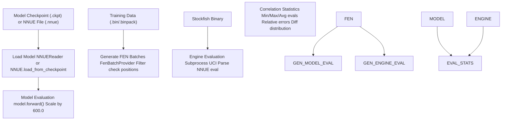
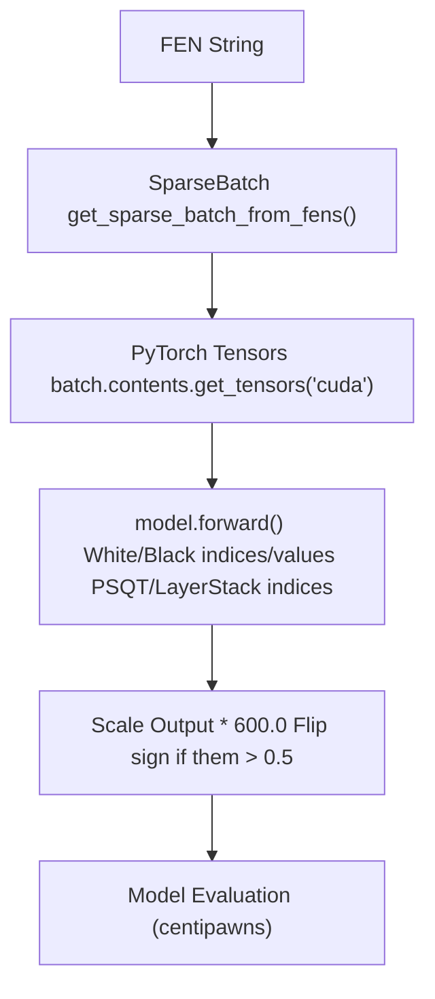
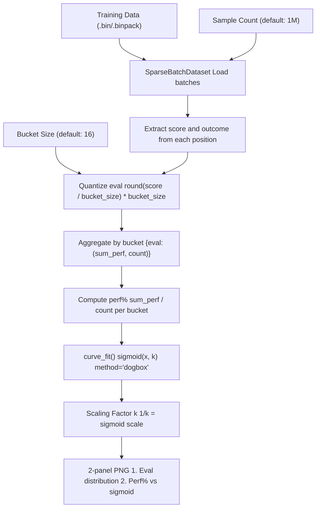
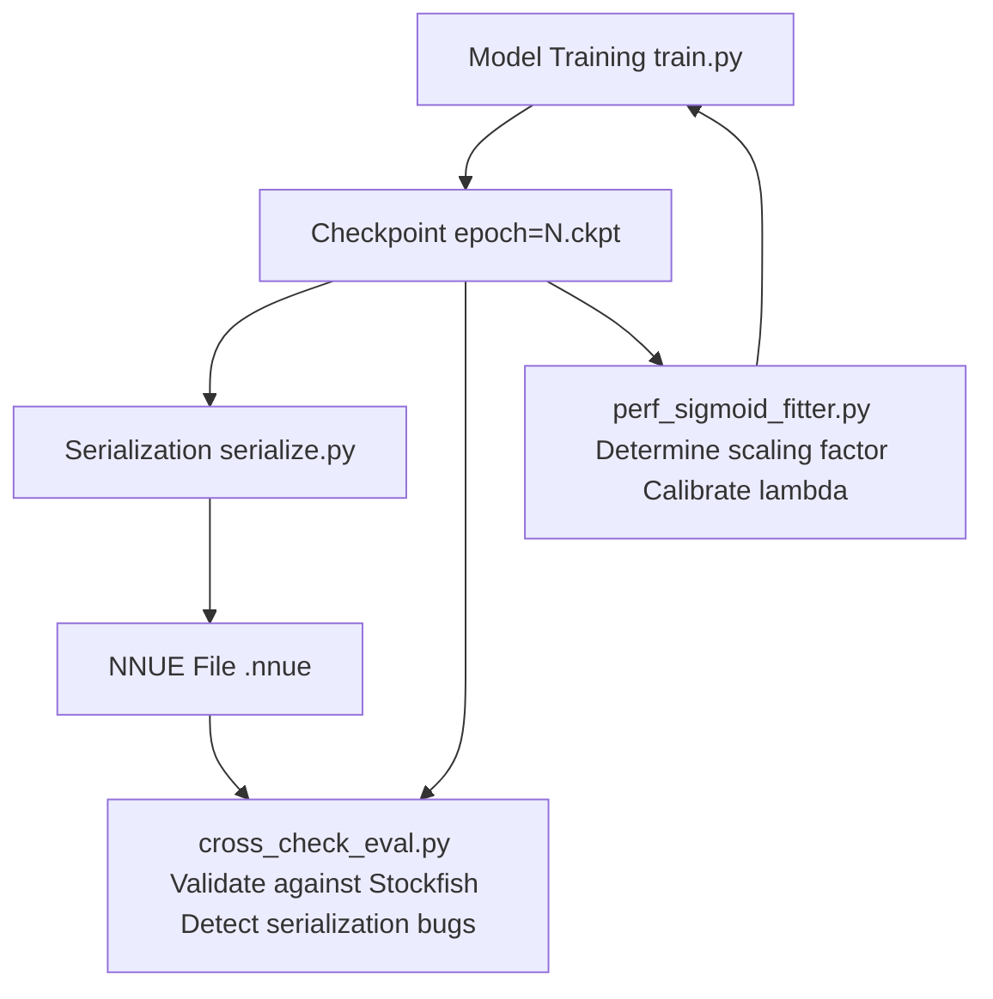

# Performance Analysis Tools

-   [cross\_check\_eval.py](https://github.com/Chesszyh/nnue-pytorch/blob/024b2064/cross_check_eval.py)
-   [data\_loader/dataset.py](https://github.com/Chesszyh/nnue-pytorch/blob/024b2064/data_loader/dataset.py)
-   [data\_loader/stream.py](https://github.com/Chesszyh/nnue-pytorch/blob/024b2064/data_loader/stream.py)
-   [ftperm.py](https://github.com/Chesszyh/nnue-pytorch/blob/024b2064/ftperm.py)
-   [perf\_sigmoid\_fitter.py](https://github.com/Chesszyh/nnue-pytorch/blob/024b2064/perf_sigmoid_fitter.py)

This page documents tools for analyzing and validating NNUE model performance. These utilities help verify model correctness, calibrate output scaling, and diagnose training issues. For information about optimizing model inference performance through weight permutation, see [Feature Transformer Permutation](#6.1). For training metrics visualization and ELO tracking, see [Visualization and Analysis](#7.3).

## Overview

The nnue-pytorch repository provides two primary performance analysis tools:

| Tool | Primary Purpose | Key Outputs |
| --- | --- | --- |
| `cross_check_eval.py` | Validate model predictions against Stockfish evaluation | Correlation metrics, error statistics |
| `perf_sigmoid_fitter.py` | Fit sigmoid curves to WDL data for optimal scaling | Sigmoid scaling factor `k` |

These tools operate independently of the training loop but use the same data loading infrastructure to process positions from `.bin` or `.binpack` files.

## Cross-Validation Against Stockfish

The `cross_check_eval.py` script validates a trained NNUE model by comparing its evaluations against Stockfish's NNUE evaluation on sample positions. This is critical for detecting quantization errors, implementation bugs, or serialization issues.

### Workflow


Sources: [cross\_check\_eval.py1-221](https://github.com/Chesszyh/nnue-pytorch/blob/024b2064/cross_check_eval.py#L1-L221)

### Command-Line Interface

The script accepts both checkpoint files (for development) and serialized `.nnue` files (for deployment validation):

```
# Using a checkpoint filepython cross_check_eval.py \    --checkpoint=epoch=100.ckpt \    --features=HalfKAv2_hm \    --data=validation.binpack \    --engine=stockfish \    --count=10000# Using a serialized NNUE filepython cross_check_eval.py \    --net=nn-5af11540bbfe.nnue \    --features=HalfKAv2_hm \    --data=validation.binpack \    --engine=stockfish \    --count=10000
```
**Key Parameters:**

| Parameter | Description |
| --- | --- |
| `--checkpoint` | Path to PyTorch Lightning checkpoint (`.ckpt`) |
| `--net` | Path to serialized NNUE file (`.nnue`) |
| `--engine` | Path to Stockfish binary with NNUE support |
| `--data` | Training data file for position sampling |
| `--count` | Number of positions to evaluate (default: 100) |
| `--features` | Feature set name (must match model) |
| `--l1` | L1 layer size (must match model) |

Sources: [cross\_check\_eval.py164-179](https://github.com/Chesszyh/nnue-pytorch/blob/024b2064/cross_check_eval.py#L164-L179)

### Model Evaluation Pipeline

The script evaluates positions through the Python model implementation:


The model evaluation uses the full forward pass including feature transformer, layer stacks, and output head, scaled to centipawn units [cross\_check\_eval.py42-73](https://github.com/Chesszyh/nnue-pytorch/blob/024b2064/cross_check_eval.py#L42-L73)

Sources: [cross\_check\_eval.py42-73](https://github.com/Chesszyh/nnue-pytorch/blob/024b2064/cross_check_eval.py#L42-L73)

### Engine Evaluation via UCI

Stockfish evaluation is obtained by launching the engine as a subprocess and communicating via UCI protocol:

```
# Construct UCI command sequenceparts = ["uci", "setoption name EvalFile value {}".format(net_path)]for fen in fens:    parts.append("position fen {}".format(fen))    parts.append("eval")parts.append("quit")
```
The engine's NNUE evaluation output is parsed using regex `r"NNUE evaluation:?\s*?([-+]?\d*?\.\d*)"` and converted to centipawns [cross\_check\_eval.py136-151](https://github.com/Chesszyh/nnue-pytorch/blob/024b2064/cross_check_eval.py#L136-L151)

Sources: [cross\_check\_eval.py136-151](https://github.com/Chesszyh/nnue-pytorch/blob/024b2064/cross_check_eval.py#L136-L151)

### Position Filtering

Positions where a king is in check are filtered out because Stockfish cannot evaluate such positions:

```
def filter_fens(fens):    # We don't want fens where a king is in check, as these cannot be evaluated by the engine.    filtered_fens = []    for fen in fens:        board = chess.Board(fen=fen)        if not board.is_check():            filtered_fens.append(fen)    return filtered_fens
```
Sources: [cross\_check\_eval.py154-161](https://github.com/Chesszyh/nnue-pytorch/blob/024b2064/cross_check_eval.py#L154-L161)

### Correlation Metrics

The script computes comprehensive correlation statistics between model and engine evaluations:

**Basic Statistics:**

-   Minimum, maximum, and average evaluations (both model and engine)
-   Average absolute evaluation magnitude

**Error Metrics:**

-   **Relative Engine Error**: `sum(|model - engine| / (|engine| + 0.001)) / N`
-   **Relative Model Error**: `sum(|model - engine| / (|model| + 0.001)) / N`
-   **Average Absolute Difference**: Mean of `|model - engine|`
-   **Min/Max Difference**: Range of absolute differences

These metrics help identify:

-   **Quantization errors** (systematic bias in one direction)
-   **Serialization bugs** (large random errors)
-   **Feature extraction issues** (consistent scaling differences)

Sources: [cross\_check\_eval.py79-133](https://github.com/Chesszyh/nnue-pytorch/blob/024b2064/cross_check_eval.py#L79-L133)

### Example Output

```
Min engine/model eval: -523 / -519
Max engine/model eval: 487 / 482
Avg engine/model eval: 12.3 / 11.8
Avg abs engine/model eval: 156.2 / 154.7
Relative engine error: 0.0287
Relative model error: 0.0291
Avg abs difference: 4.2
Min difference: 0
Max difference: 18
```
Typical correlation should show:

-   Average absolute difference < 10 centipawns for correctly serialized models
-   Relative errors < 5% for production-quality models
-   Max difference < 50 centipawns (larger differences indicate potential bugs)

Sources: [cross\_check\_eval.py79-133](https://github.com/Chesszyh/nnue-pytorch/blob/024b2064/cross_check_eval.py#L79-L133)

## WDL Sigmoid Fitting

The `perf_sigmoid_fitter.py` script analyzes the relationship between chess position evaluations and game outcomes (Win/Draw/Loss), fitting a sigmoid curve to determine the optimal scaling factor. This is essential for calibrating the model's output to match expected winning probabilities.

### Purpose and Theory

In chess engines, the evaluation function should ideally predict winning probability according to a sigmoid relationship:

```
P(win | eval) = 1 / (1 + exp(-k * eval))
```
The scaling factor `k` determines how evaluation maps to winning probability. The script empirically determines `k` from actual game outcomes in training data.

Sources: [perf\_sigmoid\_fitter.py1-147](https://github.com/Chesszyh/nnue-pytorch/blob/024b2064/perf_sigmoid_fitter.py#L1-L147)

### Data Collection Pipeline


Sources: [perf\_sigmoid\_fitter.py56-93](https://github.com/Chesszyh/nnue-pytorch/blob/024b2064/perf_sigmoid_fitter.py#L56-L93) [perf\_sigmoid\_fitter.py95-121](https://github.com/Chesszyh/nnue-pytorch/blob/024b2064/perf_sigmoid_fitter.py#L95-L121)

### Command-Line Usage

```
# Analyze 1M positions with default bucketingpython perf_sigmoid_fitter.py data.binpack 1000000 16# Quick analysis with fewer positionspython perf_sigmoid_fitter.py data.binpack 100000 32
```
**Parameters:**

1.  `filename`: Path to `.bin` or `.binpack` file
2.  `count`: Number of positions to analyze (default: 1,000,000)
3.  `bucket_size`: Eval bucketing granularity in centipawns (default: 16)

Sources: [perf\_sigmoid\_fitter.py134-146](https://github.com/Chesszyh/nnue-pytorch/blob/024b2064/perf_sigmoid_fitter.py#L134-L146)

### Data Aggregation

The script buckets evaluations and aggregates outcomes:

```
# Bucket evaluationsbucket = torch.round(score / bucket_size) * bucket_sizeperf = outcome  # Win=1.0, Draw=0.5, Loss=0.0# Aggregate into dictionaryfor b, p in zip(bucket, perf):    bucket_id = int(b)    pp = float(p)    if bucket_id in data:        t = data[bucket_id]        data[bucket_id] = (t[0] + pp, t[1] + 1)    else:        data[bucket_id] = (pp, 1)
```
Result: Dictionary mapping `{eval: (total_perf, count)}` where `perf%` is computed as `total_perf / count`.

Sources: [perf\_sigmoid\_fitter.py56-92](https://github.com/Chesszyh/nnue-pytorch/blob/024b2064/perf_sigmoid_fitter.py#L56-L92)

### Curve Fitting Algorithm

The fitting uses SciPy's `curve_fit` with the Dogbox algorithm:

```
def sigmoid(x, k):    y = 1 / (1 + np.exp(-k * x))    return ydef fit_data(x, y, sigma):    # 1/361 is the initial guess. It's good enough to find the solution    p0 = [1 / 361]    popt, pcov = curve_fit(sigmoid, x, y, p0, sigma, method="dogbox")    return popt[0]
```
**Fitting Details:**

-   Initial guess: `k = 1/361` (empirically good for chess)
-   Weighting: `sigma = 1 / count` (inverse of sample count per bucket)
-   Method: Dogbox (bounded optimization, robust to outliers)

Sources: [perf\_sigmoid\_fitter.py9-18](https://github.com/Chesszyh/nnue-pytorch/blob/024b2064/perf_sigmoid_fitter.py#L9-L18)

### Output Visualization

The script generates a two-panel PNG showing:

**Panel 1: Evaluation Distribution**

-   X-axis: Evaluation (log scale)
-   Y-axis: Density (frequency of positions at each eval)
-   Purpose: Understand data distribution

**Panel 2: Performance Curve**

-   X-axis: Evaluation
-   Y-axis: Performance (win rate)
-   Scatter plot: Actual perf% from data
-   Curve: Fitted sigmoid `1 / (1 + exp(-k * eval))`
-   Legend: Shows computed `k` value

Sources: [perf\_sigmoid\_fitter.py21-53](https://github.com/Chesszyh/nnue-pytorch/blob/024b2064/perf_sigmoid_fitter.py#L21-L53)

### Typical Results

Example output for standard NNUE training data:

```
k:  0.002809
inv k:  356.0
```
**Interpretation:**

-   `k ≈ 1/356` means an evaluation of +356 centipawns corresponds to ~73% winning probability
-   For Stockfish NNUE, typical values: `k ∈ [0.0025, 0.0030]` (i.e., `1/k ∈ [333, 400]`)
-   Values outside this range may indicate:
    -   **Too low `k`** (high `1/k`): Model outputs are too aggressive
    -   **Too high `k`** (low `1/k`): Model outputs are too conservative

This `k` value can inform the `--lambda` parameter during training, which controls WDL loss scaling [perf\_sigmoid\_fitter.py40-42](https://github.com/Chesszyh/nnue-pytorch/blob/024b2064/perf_sigmoid_fitter.py#L40-L42)

Sources: [perf\_sigmoid\_fitter.py40-42](https://github.com/Chesszyh/nnue-pytorch/blob/024b2064/perf_sigmoid_fitter.py#L40-L42)

## Integration as Module

The `perf_sigmoid_fitter.py` can be imported as a Python module for online analysis during training:

```
import perf_sigmoid_fitter# Compute sigmoid scaling from batchesdata = perf_sigmoid_fitter.gather_statistics_from_batches(    training_batches,  # Iterator of batch tuples    bucket_size=16)# Extract k valuek = perf_sigmoid_fitter.fit_data(    list(data.keys()),    [data[eval][0] / data[eval][1] for eval in data.keys()],    [1 / data[eval][1] for eval in data.keys()])
```
This enables dynamic lambda adjustment based on current training data characteristics.

Sources: [perf\_sigmoid\_fitter.py56-131](https://github.com/Chesszyh/nnue-pytorch/blob/024b2064/perf_sigmoid_fitter.py#L56-L131)

## Common Analysis Workflows

### Validating Serialized Networks

After serializing a checkpoint to `.nnue` format, validate correctness:

```
# 1. Cross-check against Stockfishpython cross_check_eval.py \    --net=output.nnue \    --features=HalfKAv2_hm \    --data=test.binpack \    --engine=stockfish \    --count=10000# Expected: Avg abs difference < 5 cp
```
If differences are large:

-   Check feature set matches (`--features`)
-   Verify quantization configuration
-   Inspect serialization code for bugs

Sources: [cross\_check\_eval.py164-179](https://github.com/Chesszyh/nnue-pytorch/blob/024b2064/cross_check_eval.py#L164-L179)

### Calibrating Training Lambda

Determine optimal lambda for new training data:

```
# 1. Fit sigmoid to training datapython perf_sigmoid_fitter.py train.binpack 1000000 16# Output: k = 0.00281 (1/k = 356)# 2. Set lambda ≈ 1/k in trainingpython train.py --lambda=356 ...
```
The lambda parameter in training should roughly match the empirical sigmoid scaling to properly weight WDL loss.

Sources: [perf\_sigmoid\_fitter.py134-146](https://github.com/Chesszyh/nnue-pytorch/blob/024b2064/perf_sigmoid_fitter.py#L134-L146)

### Debugging Evaluation Drift

If model evaluation systematically differs from Stockfish:

```
# 1. Check correlation at different training stagespython cross_check_eval.py --checkpoint=epoch=50.ckpt ...python cross_check_eval.py --checkpoint=epoch=100.ckpt ...python cross_check_eval.py --checkpoint=epoch=150.ckpt ...# 2. Look for increasing divergence over time# - Increasing relative error → potential overtraining# - Increasing bias → quantization or clipping issues
```
Sources: [cross\_check\_eval.py164-221](https://github.com/Chesszyh/nnue-pytorch/blob/024b2064/cross_check_eval.py#L164-L221)

## Performance Considerations

### Memory Usage

Both tools load positions in batches to manage memory:

| Tool | Batch Size | Memory per Batch |
| --- | --- | --- |
| `cross_check_eval.py` | 1000 positions | ~50 MB (sparse features) |
| `perf_sigmoid_fitter.py` | 8192 positions | ~400 MB (sparse features) |

For large-scale analysis (>1M positions), the tools process data incrementally without loading everything into memory.

Sources: [cross\_check\_eval.py181](https://github.com/Chesszyh/nnue-pytorch/blob/024b2064/cross_check_eval.py#L181-L181) [perf\_sigmoid\_fitter.py100](https://github.com/Chesszyh/nnue-pytorch/blob/024b2064/perf_sigmoid_fitter.py#L100-L100)

### Execution Time

Typical execution times on modern hardware:

-   **cross\_check\_eval.py**: ~0.5 seconds per position (Stockfish UCI overhead dominates)

    -   1000 positions: ~8-10 minutes
    -   10000 positions: ~80-100 minutes
-   **perf\_sigmoid\_fitter.py**: ~1000 positions per second (data loading limited)

    -   100k positions: ~2 minutes
    -   1M positions: ~15-20 minutes

The bottleneck for cross-checking is Stockfish evaluation time. For sigmoid fitting, it's disk I/O and data parsing.

Sources: [cross\_check\_eval.py136-151](https://github.com/Chesszyh/nnue-pytorch/blob/024b2064/cross_check_eval.py#L136-L151) [perf\_sigmoid\_fitter.py56-121](https://github.com/Chesszyh/nnue-pytorch/blob/024b2064/perf_sigmoid_fitter.py#L56-L121)

## Summary

The performance analysis tools provide essential validation and calibration capabilities:


**Key Takeaways:**

1.  **cross\_check\_eval.py** validates model implementation correctness by comparing against Stockfish

    -   Use after serialization to catch quantization/conversion bugs
    -   Expected: < 10 cp average absolute difference
2.  **perf\_sigmoid\_fitter.py** determines the empirical relationship between eval and winning probability

    -   Use before training to set optimal lambda parameter
    -   Typical k values: 0.0025-0.0030 (1/k = 333-400)
3.  Both tools operate independently of training and can be used at any stage of model development


Sources: [cross\_check\_eval.py1-221](https://github.com/Chesszyh/nnue-pytorch/blob/024b2064/cross_check_eval.py#L1-L221) [perf\_sigmoid\_fitter.py1-147](https://github.com/Chesszyh/nnue-pytorch/blob/024b2064/perf_sigmoid_fitter.py#L1-L147)
