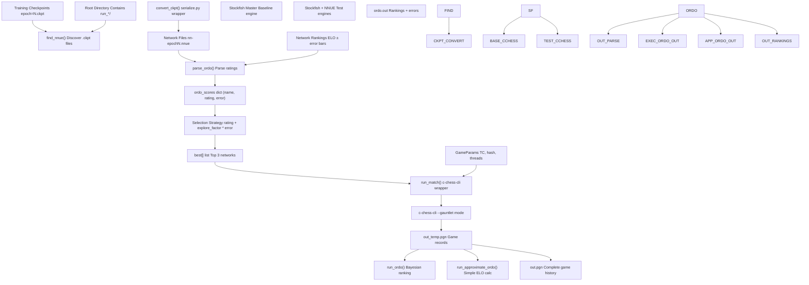
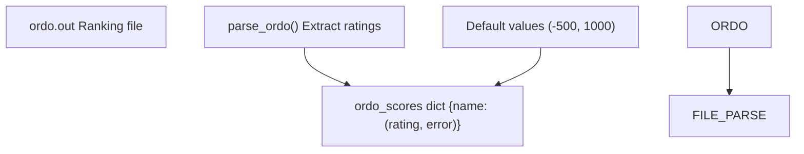
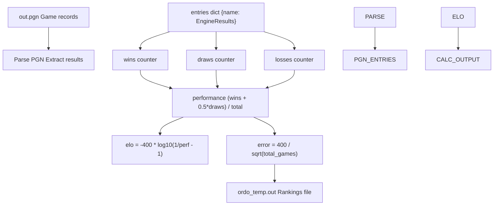
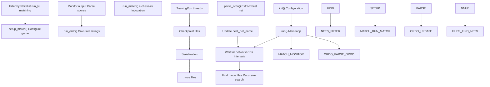
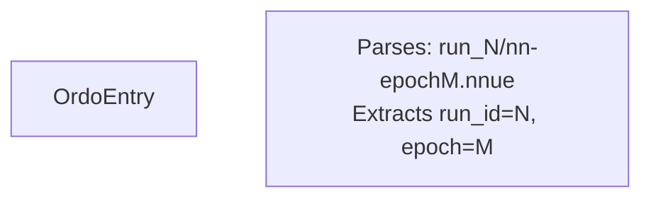
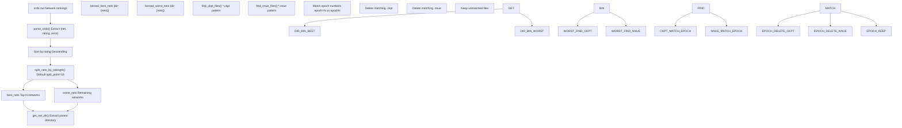

# Evaluation and Testing

-   [delete\_bad\_nets.py](https://github.com/Chesszyh/nnue-pytorch/blob/024b2064/delete_bad_nets.py)
-   [do\_plots.py](https://github.com/Chesszyh/nnue-pytorch/blob/024b2064/do_plots.py)
-   [run\_games.py](https://github.com/Chesszyh/nnue-pytorch/blob/024b2064/run_games.py)
-   [scripts/easy\_train.py](https://github.com/Chesszyh/nnue-pytorch/blob/024b2064/scripts/easy_train.py)
-   [scripts/easy\_train\_example.bat](https://github.com/Chesszyh/nnue-pytorch/blob/024b2064/scripts/easy_train_example.bat)
-   [scripts/easy\_train\_example.sh](https://github.com/Chesszyh/nnue-pytorch/blob/024b2064/scripts/easy_train_example.sh)

This page documents the system for evaluating trained NNUE networks through automated chess game playing and statistical ranking. The evaluation pipeline converts model checkpoints to deployable NNUE files, runs tournament-style games against baseline engines using `c-chess-cli`, calculates Bayesian ELO ratings with `ordo`, and provides visualization tools for tracking training progress.

For information about the training process that produces checkpoints, see [Training System](#2). For details on checkpoint conversion and serialization, see [Model Serialization](#5).

## Evaluation Pipeline Overview

The evaluation system operates as a continuous feedback loop that tests networks as they are produced during training. The system can run standalone via `run_games.py` or as part of the integrated training orchestration in `easy_train.py`.

**System Architecture**


**Sources:** [run\_games.py1-605](https://github.com/Chesszyh/nnue-pytorch/blob/024b2064/run_games.py#L1-L605)

The pipeline runs continuously in rounds, where each round:

1.  Discovers new checkpoint files
2.  Converts them to NNUE format
3.  Selects the most promising networks based on previous ratings and uncertainty
4.  Plays games against a baseline
5.  Recalculates rankings
6.  Repeats

## Running Games with run\_games.py

The `run_games.py` script provides standalone functionality for running gauntlet-style tournaments where candidate networks compete against a master baseline engine.

### Core Components

**GameParams Class**

The `GameParams` class encapsulates all game configuration parameters:


**Sources:** [run\_games.py26-69](https://github.com/Chesszyh/nnue-pytorch/blob/024b2064/run_games.py#L26-L69)

The `get_all_params()` method [run\_games.py46-68](https://github.com/Chesszyh/nnue-pytorch/blob/024b2064/run_games.py#L46-L68) constructs the command-line arguments for `c-chess-cli`, supporting both time control and nodes-per-move modes.

### Network Discovery and Conversion

**Checkpoint Conversion**

The `convert_ckpt()` function [run\_games.py71-102](https://github.com/Chesszyh/nnue-pytorch/blob/024b2064/run_games.py#L71-L102) recursively searches for checkpoint files and converts unconverted ones:

| Operation | Pattern | Output |
| --- | --- | --- |
| Find checkpoints | `epoch*.ckpt` | List of checkpoint paths |
| Generate .nnue path | Remove `default/version_N/checkpoints/` | Simplified path structure |
| Convert naming | `epoch=3.ckpt` → `nn-epoch3.nnue` | Standard naming convention |
| Invoke serialization | `serialize.py ckpt nnue --features=X` | Binary NNUE file |

**Sources:** [run\_games.py71-102](https://github.com/Chesszyh/nnue-pytorch/blob/024b2064/run_games.py#L71-L102)

**Network Discovery**

The `find_nnue()` function [run\_games.py104-106](https://github.com/Chesszyh/nnue-pytorch/blob/024b2064/run_games.py#L104-L106) uses recursive glob to locate all available networks matching the pattern `nn-epoch*.nnue`.

### Ordo Integration

**Parsing Ordo Output**

The `parse_ordo()` function [run\_games.py109-129](https://github.com/Chesszyh/nnue-pytorch/blob/024b2064/run_games.py#L109-L129) reads the `ordo.out` file and extracts ratings:


**Sources:** [run\_games.py109-129](https://github.com/Chesszyh/nnue-pytorch/blob/024b2064/run_games.py#L109-L129)

Default scores of (-500, 1000) are assigned to networks without ratings, representing maximum uncertainty.

### Network Selection Strategy

The selection algorithm [run\_games.py411-444](https://github.com/Chesszyh/nnue-pytorch/blob/024b2064/run_games.py#L411-L444) implements Upper Confidence Bound (UCB) exploration:

1.  **Display top performers** [run\_games.py415-426](https://github.com/Chesszyh/nnue-pytorch/blob/024b2064/run_games.py#L415-L426) - Sort by rating descending
2.  **Select for testing** [run\_games.py429-444](https://github.com/Chesszyh/nnue-pytorch/blob/024b2064/run_games.py#L429-L444) - Sort by `rating + explore_factor * error`
3.  **Choose top 3** [run\_games.py438-444](https://github.com/Chesszyh/nnue-pytorch/blob/024b2064/run_games.py#L438-L444) - Balance exploitation vs exploration

The `explore_factor` parameter (default 1.5) controls the exploration-exploitation tradeoff. Higher values favor testing uncertain networks; lower values favor exploiting known strong networks.

**Sources:** [run\_games.py385-492](https://github.com/Chesszyh/nnue-pytorch/blob/024b2064/run_games.py#L385-L492)

### Match Execution

**Match Configuration**

The `run_match()` function [run\_games.py132-218](https://github.com/Chesszyh/nnue-pytorch/blob/024b2064/run_games.py#L132-L218) constructs and executes `c-chess-cli` commands:

```mermaid
flowchart TD
    CMD_BUILD["Command Construction"]
    GAUNTLET["--gauntlet One vs many mode"]
    ROUNDS["--rounds 1 Single round"]
    CONCUR["--concurrency N Parallel games"]
    TC["Game Parameters TC/nodes/hash/threads"]
    OPENINGS["--openings Book file + randomization"]
    RESIGN["--resign count=3 score=700"]
    DRAW["--draw count=8 score=10"]
    PGN_OUT["--pgn out_temp.pgn"]
    BASE_ENG["--engine cmd=stockfish_base name=master"]
    TEST_ENG["--engine cmd=stockfish_test name=netname option.EvalFile=path"]

    CMD --> BUILD_GAUNTLET
    CMD --> BUILD_ROUNDS
    CMD --> BUILD_CONCUR
    CMD --> BUILD_TC
    CMD --> BUILD_OPENINGS
    CMD --> BUILD_RESIGN
    CMD --> BUILD_DRAW
    CMD --> BUILD_PGN_OUT
    CMD --> BUILD_BASE_ENG
    CMD --> BUILD_TEST_ENG
```


**Sources:** [run\_games.py132-218](https://github.com/Chesszyh/nnue-pytorch/blob/024b2064/run_games.py#L132-L218)

**Retry Logic**

The function implements automatic retry [run\_games.py186-216](https://github.com/Chesszyh/nnue-pytorch/blob/024b2064/run_games.py#L186-L216) with up to 10 attempts to handle transient failures like engine hangs or `c-chess-cli` errors.

**Progress Monitoring**

Real-time output parsing [run\_games.py196-208](https://github.com/Chesszyh/nnue-pytorch/blob/024b2064/run_games.py#L196-L208) displays score updates as games complete, with epoch deduplication to avoid output clutter.

### ELO Calculation Methods

The system supports two methods for calculating ratings:

#### Method 1: Full Ordo (Bayesian)

The `run_ordo()` function [run\_games.py351-382](https://github.com/Chesszyh/nnue-pytorch/blob/024b2064/run_games.py#L351-L382) invokes the external `ordo` tool:

| Parameter | Value | Purpose |
| --- | --- | --- |
| `-q` | \- | Quiet mode |
| `-g` | \- | Use games format |
| `-J` | \- | Assume draws |
| `-p {pgn}` | PGN file | Input games |
| `-a 0.0 --anchor=master` | Anchor rating | Fix master at 0.0 |
| `--draw-auto --white-auto` | Auto-detection | Detect draw/white advantage |
| `-s 100` | \- | Simulation count |
| `--cpus={N}` | Concurrency | Parallel processing |
| `-o {output}` | File path | Output rankings |

**Sources:** [run\_games.py351-382](https://github.com/Chesszyh/nnue-pytorch/blob/024b2064/run_games.py#L351-L382)

#### Method 2: Approximate Ordo

The `run_approximate_ordo()` function [run\_games.py280-348](https://github.com/Chesszyh/nnue-pytorch/blob/024b2064/run_games.py#L280-L348) implements a simplified ELO calculation:


**Sources:** [run\_games.py280-348](https://github.com/Chesszyh/nnue-pytorch/blob/024b2064/run_games.py#L280-L348)

**EngineResults Class** [run\_games.py221-277](https://github.com/Chesszyh/nnue-pytorch/blob/024b2064/run_games.py#L221-L277)

This helper class tracks game statistics per engine:

-   **Properties:** `wins`, `draws`, `losses`, `total_games`, `points`, `performance`
-   **ELO calculation:** Uses logistic formula assuming all games against master (rating 0)
-   **Error estimation:** 95% confidence interval using `400 / sqrt(N)` approximation

The approximate method is faster but less accurate than full Bayesian ordo, especially with fewer games.

### Round Execution

The `run_round()` function [run\_games.py385-492](https://github.com/Chesszyh/nnue-pytorch/blob/024b2064/run_games.py#L385-L492) orchestrates a complete evaluation cycle:

**Parallel Execution Strategy**

> **[Mermaid sequence]**
> *(图表结构无法解析)*

**Sources:** [run\_games.py385-492](https://github.com/Chesszyh/nnue-pytorch/blob/024b2064/run_games.py#L385-L492)

This parallel design allows ordo to process accumulated games while new games are being played, maximizing throughput.

### Command-Line Interface

**Key Arguments** [run\_games.py494-601](https://github.com/Chesszyh/nnue-pytorch/blob/024b2064/run_games.py#L494-L601)

| Argument | Type | Default | Description |
| --- | --- | --- | --- |
| `root_dir` | str | Required | Directory to search for networks and store results |
| `--concurrency` | int | 8 | Number of parallel game threads |
| `--explore_factor` | float | 1.5 | UCB exploration parameter |
| `--ordo_exe` | str | None | Path to ordo binary (uses approximate if None) |
| `--c_chess_exe` | str | `./c-chess-cli` | Path to c-chess-cli |
| `--stockfish_base` | str | `./stockfish` | Master baseline engine |
| `--stockfish_test` | str | None | Test engine (defaults to base) |
| `--book_file_name` | str | `./noob_3moves.epd` | Opening book |
| `--time_per_game` | float | 4.0 | Base time in seconds |
| `--time_increment_per_move` | float | 0.04 | Increment per move |
| `--nodes_per_move` | int | None | Fixed nodes (overrides time) |
| `--hash` | int | 8 | Hash table size in MB |
| `--threads` | int | 1 | Engine threads |
| `--games_per_round` | int | 200 | Games per round |

**Sources:** [run\_games.py494-601](https://github.com/Chesszyh/nnue-pytorch/blob/024b2064/run_games.py#L494-L601)

## Integration with easy\_train.py

The `easy_train.py` script integrates network testing as part of the training orchestration. The `NetworkTesting` class [scripts/easy\_train.py1389-1680](https://github.com/Chesszyh/nnue-pytorch/blob/024b2064/scripts/easy_train.py#L1389-L1680) runs testing in a separate thread.

### NetworkTesting Architecture


**Sources:** [scripts/easy\_train.py1389-1680](https://github.com/Chesszyh/nnue-pytorch/blob/024b2064/scripts/easy_train.py#L1389-L1680)

### Key Differences from Standalone Mode

**Automatic Serialization**

The `NetworkTesting` class automatically serializes checkpoints [scripts/easy\_train.py1498-1546](https://github.com/Chesszyh/nnue-pytorch/blob/024b2064/scripts/easy_train.py#L1498-L1546) without requiring manual conversion, using the same `serialize.py` wrapper.

**Network Whitelisting**

The `_network_matches_whitelist()` method [scripts/easy\_train.py1481-1496](https://github.com/Chesszyh/nnue-pytorch/blob/024b2064/scripts/easy_train.py#L1481-L1496) filters networks based on training run IDs, ensuring only relevant networks from the current experiment are tested.

**Best Network Tracking**

The class maintains `best_net_name` [scripts/easy\_train.py1448](https://github.com/Chesszyh/nnue-pytorch/blob/024b2064/scripts/easy_train.py#L1448-L1448) and exposes it via a property [scripts/easy\_train.py1676-1678](https://github.com/Chesszyh/nnue-pytorch/blob/024b2064/scripts/easy_train.py#L1676-L1678) allowing the TUI dashboard to display real-time information about the strongest network.

**Integrated Logging**

All output is coordinated with the main TUI dashboard rather than using independent console output.

### OrdoEntry Class

The `OrdoEntry` class [scripts/easy\_train.py608-659](https://github.com/Chesszyh/nnue-pytorch/blob/024b2064/scripts/easy_train.py#L608-L659) provides structured parsing of ordo output lines:


**Sources:** [scripts/easy\_train.py608-659](https://github.com/Chesszyh/nnue-pytorch/blob/024b2064/scripts/easy_train.py#L608-L659)

The pattern `r".*?run_(\d+).*?nn-epoch(\d+)\.nnue"` [scripts/easy\_train.py614](https://github.com/Chesszyh/nnue-pytorch/blob/024b2064/scripts/easy_train.py#L614-L614) extracts both the run ID and epoch number from network paths.

### Best Checkpoint Selection

The `find_best_checkpoint()` function [scripts/easy\_train.py661-698](https://github.com/Chesszyh/nnue-pytorch/blob/024b2064/scripts/easy_train.py#L661-L698) determines the optimal checkpoint based on ordo rankings:

**Algorithm** [scripts/easy\_train.py676-698](https://github.com/Chesszyh/nnue-pytorch/blob/024b2064/scripts/easy_train.py#L676-L698)

1.  Parse ordo file for all entries containing `nn-epoch`
2.  Sort by `rating - error` (conservative estimate)
3.  Extract run\_id and epoch from the top entry
4.  Search for matching `.ckpt` file with pattern `run_{run_id}` and `epoch={epoch}`
5.  Fall back to `.nnue` file if checkpoint not found

This enables resuming training from the best-performing network rather than the most recent checkpoint.

**Sources:** [scripts/easy\_train.py661-698](https://github.com/Chesszyh/nnue-pytorch/blob/024b2064/scripts/easy_train.py#L661-L698)

## Visualization and Analysis

The `do_plots.py` script provides comprehensive visualization of training progress and network strength.

### Plot Generation Pipeline

```mermaid
flowchart TD
    FIND_EVENTS["find_event_files() Recursive search for events.out.tfevents*"]
    FIND_ORDO["find_ordo_file() Search for ordo.out"]
    TFEVENT["EventAccumulator TensorBoard parser"]
    VAL_LOSS["Extract val_loss Scalar values"]
    TRAIN_LOSS["Extract train_loss Scalar values"]
    ORDO_PARSE["parse_ordo_file() Extract ratings"]
    AGG_VAL["aggregate_dict() min/max/avg"]
    AGG_TRAIN["aggregate_dict() min/max/avg"]
    FILTER_LOSS["Filter by loss_range Best + range"]
    FILTER_ELO["Filter by elo_range Best - range"]
    PLOT_TRAIN["ax_train_loss subplot Step vs Loss"]
    PLOT_VAL["ax_val_loss subplot Step vs Loss"]
    PLOT_ELO["ax_elo subplot Epoch vs ELO ± error"]
    FIG["Figure output PNG file"]

    FIND --> EVENTS_TFEVENT
    FIND --> ORDO_ORDO_PARSE
    TFEVENT --> VAL_LOSS
    TFEVENT --> TRAIN_LOSS
    VAL --> LOSS_FILTER_LOSS
    TRAIN --> LOSS_FILTER_LOSS
    FILTER --> LOSS_AGG_VAL
    FILTER --> LOSS_AGG_TRAIN
    ORDO --> PARSE_FILTER_ELO
    AGG --> VAL_PLOT_VAL
    AGG --> TRAIN_PLOT_TRAIN
    FILTER --> ELO_PLOT_ELO
    PLOT --> TRAIN_FIG
    PLOT --> VAL_FIG
    PLOT --> ELO_FIG
```


**Sources:** [do\_plots.py1-267](https://github.com/Chesszyh/nnue-pytorch/blob/024b2064/do_plots.py#L1-L267)

### Loss Curve Processing

**Event File Discovery** [do\_plots.py10-18](https://github.com/Chesszyh/nnue-pytorch/blob/024b2064/do_plots.py#L10-L18)

The function searches for TensorBoard event files matching the pattern `events.out.tfevents.*` and returns all matching paths.

**Loss Extraction and Filtering** [do\_plots.py86-159](https://github.com/Chesszyh/nnue-pytorch/blob/024b2064/do_plots.py#L86-L159)

```
# Pseudocode representation of the processfor tfevents_file in tfevents_files:    events_acc = EventAccumulator(tfevents_file)    events_acc.Reload()        # Extract validation loss    vv = events_acc.Scalars("val_loss")    minloss = min([v[2] for v in vv])        # Keep only values within range of minimum    for v in vv:        if v[2] < minloss + loss_range:            step = v[1]            val_losses[step].append(v[2])        # Similar for train_loss
```
This filtering focuses plots on the most informative loss values, excluding outliers and early training noise.

**Sources:** [do\_plots.py136-159](https://github.com/Chesszyh/nnue-pytorch/blob/024b2064/do_plots.py#L136-L159)

### Data Aggregation

The `aggregate_dict()` function [do\_plots.py40-53](https://github.com/Chesszyh/nnue-pytorch/blob/024b2064/do_plots.py#L40-L53) supports three aggregation modes for combining multiple runs:

| Mode | Aggregator | Use Case |
| --- | --- | --- |
| `min` | Minimum value | Best-case performance |
| `max` | Maximum value | Worst-case performance |
| `avg` | Mean value | Average performance |

**Sources:** [do\_plots.py40-53](https://github.com/Chesszyh/nnue-pytorch/blob/024b2064/do_plots.py#L40-L53)

### ELO Visualization

**Ordo File Parsing** [do\_plots.py65-79](https://github.com/Chesszyh/nnue-pytorch/blob/024b2064/do_plots.py#L65-L79)

The `parse_ordo_file()` function extracts:

-   Network path
-   Epoch number (via regex `.*nn-epoch(\d*)\\.nnue`)
-   ELO rating
-   Rating error (standard deviation)

**Filtering and Plotting** [do\_plots.py181-202](https://github.com/Chesszyh/nnue-pytorch/blob/024b2064/do_plots.py#L181-L202)

```
# Filter to show only competitive networksmaxelo = max([row[2] for row in rows])for row in rows:    epoch, elo, error = row[1], row[2], row[3]    if elo > maxelo - elo_range:        # Include in plot        # Plot with error barsax_elo.errorbar(epochs, elos, yerr=errors, label=root_dir)
```
This focuses visualization on the top-performing networks within a configurable ELO range.

**Sources:** [do\_plots.py181-202](https://github.com/Chesszyh/nnue-pytorch/blob/024b2064/do_plots.py#L181-L202)

### Multi-Experiment Support

**Split Mode** [do\_plots.py119-127](https://github.com/Chesszyh/nnue-pytorch/blob/024b2064/do_plots.py#L119-L127)

When `--split` is enabled:

-   The tool treats each subdirectory as a separate experiment
-   Uses a shared `ordo.out` file at the root level
-   Filters ordo entries by subdirectory path
-   Plots each subdirectory as a separate series

This enables comparing multiple training runs (e.g., different hyperparameters) on a single plot.

**Sources:** [do\_plots.py119-127](https://github.com/Chesszyh/nnue-pytorch/blob/024b2064/do_plots.py#L119-L127)

### Command-Line Interface

**Arguments** [do\_plots.py217-262](https://github.com/Chesszyh/nnue-pytorch/blob/024b2064/do_plots.py#L217-L262)

| Argument | Type | Default | Description |
| --- | --- | --- | --- |
| `root_dirs` | str+ | Required | Directories containing tfevents and ordo files |
| `--output` | str | `experiment_loss_Elo.png` | Output filename |
| `--elo_range` | float | 50.0 | Show networks within this ELO of best |
| `--loss_range` | float | 0.004 | Show losses within this range of minimum |
| `--split` | flag | False | Split subdirectories as separate experiments |

**Sources:** [do\_plots.py217-262](https://github.com/Chesszyh/nnue-pytorch/blob/024b2064/do_plots.py#L217-L262)

## Network Management with delete\_bad\_nets.py

The `delete_bad_nets.py` script implements automated cleanup of underperforming networks to save disk space.

### Deletion Strategy


**Sources:** [delete\_bad\_nets.py1-167](https://github.com/Chesszyh/nnue-pytorch/blob/024b2064/delete_bad_nets.py#L1-L167)

### Implementation Details

**Network Splitting** [delete\_bad\_nets.py49-53](https://github.com/Chesszyh/nnue-pytorch/blob/024b2064/delete_bad_nets.py#L49-L53)

```
def split_nets_by_strength(nets, split_point=16):    nets.sort(key=lambda x: -x[1])  # Sort by rating descending    best_nets = nets[:min(split_point, len(nets))]    worst_nets = nets[min(split_point, len(nets)):]    return best_nets, worst_nets
```
**Sources:** [delete\_bad\_nets.py49-53](https://github.com/Chesszyh/nnue-pytorch/blob/024b2064/delete_bad_nets.py#L49-L53)

**Epoch Matching Patterns** [delete\_bad\_nets.py79-80](https://github.com/Chesszyh/nnue-pytorch/blob/024b2064/delete_bad_nets.py#L79-L80)

| File Type | Pattern | Example |
| --- | --- | --- |
| .nnue | `.*epoch([0-9]*)\\.nnue` | `nn-epoch100.nnue` → `100` |
| .ckpt | `.*epoch=([0-9]*).*\\.ckpt` | `epoch=100-step=1000.ckpt` → `100` |

**Sources:** [delete\_bad\_nets.py79-112](https://github.com/Chesszyh/nnue-pytorch/blob/024b2064/delete_bad_nets.py#L79-L112)

**Safety Features**

1.  **Ordo requirement** [delete\_bad\_nets.py82-84](https://github.com/Chesszyh/nnue-pytorch/blob/024b2064/delete_bad_nets.py#L82-L84) - Exits if no ordo file found
2.  **Conservative deletion** - Only deletes networks explicitly listed in ordo
3.  **Per-directory organization** [delete\_bad\_nets.py56-75](https://github.com/Chesszyh/nnue-pytorch/blob/024b2064/delete_bad_nets.py#L56-L75) - Bins networks by parent directory to avoid cross-contamination
4.  **Verbose logging** [delete\_bad\_nets.py103-119](https://github.com/Chesszyh/nnue-pytorch/blob/024b2064/delete_bad_nets.py#L103-L119) - Prints all delete/keep decisions

**Sources:** [delete\_bad\_nets.py78-120](https://github.com/Chesszyh/nnue-pytorch/blob/024b2064/delete_bad_nets.py#L78-L120)

### Usage

```
python delete_bad_nets.py root_dir [num_best_to_keep]
```
**Parameters:**

-   `root_dir` - Directory containing ordo.out and network files
-   `num_best_to_keep` - Number of top networks to preserve (default: 16)

**Directory Structure Example** [delete\_bad\_nets.py142-152](https://github.com/Chesszyh/nnue-pytorch/blob/024b2064/delete_bad_nets.py#L142-L152)

```
root_dir/
├── run_0/
│   ├── lightning_logs/version_0/checkpoints/*.ckpt
│   └── *.nnue
├── run_1/
│   ├── lightning_logs/version_0/checkpoints/*.ckpt
│   └── *.nnue
└── ordo.out
```
The script preserves the top N networks globally but organizes deletion by subdirectory, ensuring only networks from the same training run compete for preservation.

**Sources:** [delete\_bad\_nets.py122-167](https://github.com/Chesszyh/nnue-pytorch/blob/024b2064/delete_bad_nets.py#L122-L167)

## Summary

The evaluation and testing system provides a complete pipeline for:

1.  **Automated game playing** - Converting checkpoints to NNUE files and running gauntlet tournaments via `c-chess-cli`
2.  **Statistical ranking** - Calculating Bayesian ELO ratings with error bars using `ordo` or approximate methods
3.  **Network selection** - Using Upper Confidence Bound exploration to balance testing strong networks vs. uncertain ones
4.  **Continuous feedback** - Integrated with `easy_train.py` for automatic evaluation during training
5.  **Visualization** - Plotting loss curves and ELO progression over time
6.  **Resource management** - Automated cleanup of underperforming networks

The system supports both standalone operation via `run_games.py` for focused evaluation and integrated operation via `easy_train.py` for hands-off training with automatic quality assessment.

**Key Design Principles:**

-   **Parallel execution** - Games and ordo calculations run concurrently
-   **Fault tolerance** - Automatic retries for transient failures
-   **Exploration-exploitation balance** - UCB-based network selection
-   **Minimal manual intervention** - Automatic conversion, testing, and cleanup
-   **Comprehensive tracking** - Full game history and statistical confidence intervals

**Sources:** [run\_games.py1-605](https://github.com/Chesszyh/nnue-pytorch/blob/024b2064/run_games.py#L1-L605) [scripts/easy\_train.py608-1680](https://github.com/Chesszyh/nnue-pytorch/blob/024b2064/scripts/easy_train.py#L608-L1680) [do\_plots.py1-267](https://github.com/Chesszyh/nnue-pytorch/blob/024b2064/do_plots.py#L1-L267) [delete\_bad\_nets.py1-167](https://github.com/Chesszyh/nnue-pytorch/blob/024b2064/delete_bad_nets.py#L1-L167)
