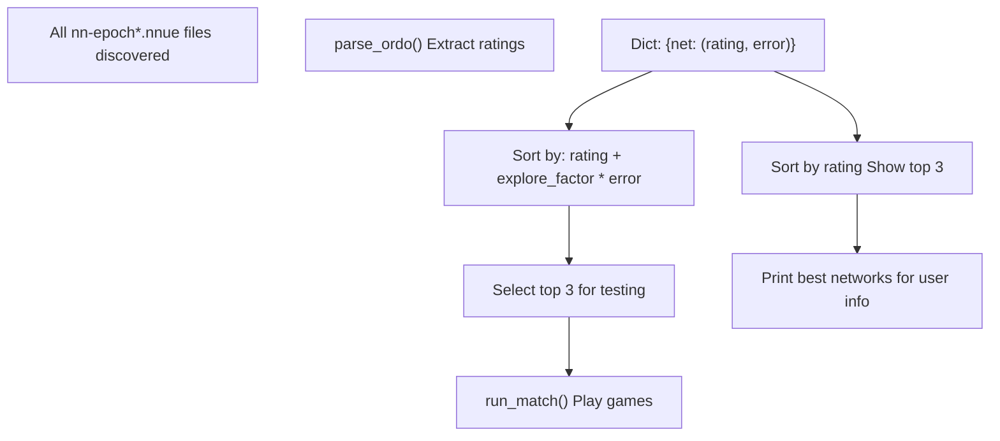
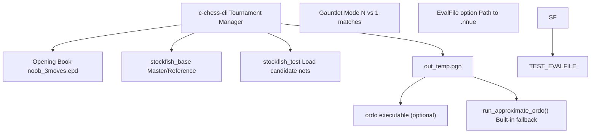
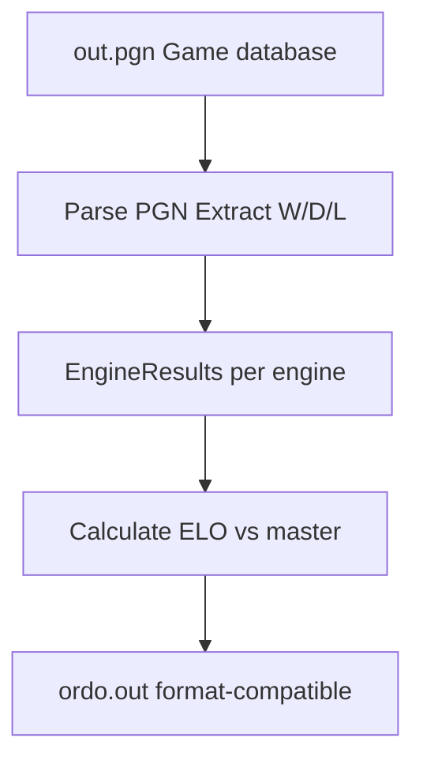
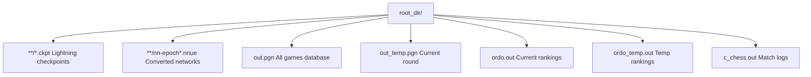
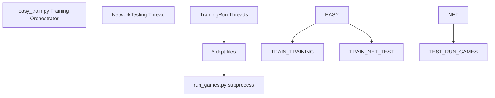

# Running Games (run\_games.py)

-   [delete\_bad\_nets.py](https://github.com/Chesszyh/nnue-pytorch/blob/024b2064/delete_bad_nets.py)
-   [do\_plots.py](https://github.com/Chesszyh/nnue-pytorch/blob/024b2064/do_plots.py)
-   [run\_games.py](https://github.com/Chesszyh/nnue-pytorch/blob/024b2064/run_games.py)

## Purpose and Scope

This document explains the automated game playing and network evaluation system implemented in `run_games.py`. This script continuously discovers trained NNUE networks (from checkpoint files), evaluates them by playing chess games against a baseline, and ranks them using ELO ratings. The system implements an exploration-exploitation strategy to efficiently identify the strongest networks while training is ongoing.

For information about model serialization to `.nnue` format, see [Checkpoint Conversion](#5.1). For visualization of results, see [Visualization and Analysis](#7.3). For ELO calculation details, see [ELO Calculation with Ordo](#7.2).

**Sources:** [run\_games.py1-605](https://github.com/Chesszyh/nnue-pytorch/blob/024b2064/run_games.py#L1-L605)

---

## System Overview

The `run_games.py` script serves as an autonomous evaluation loop that bridges the gap between trained models and empirical chess strength measurement. It integrates multiple external tools to create a comprehensive testing pipeline.

```mermaid
flowchart TD
    FIND_CKPT["convert_ckpt() Find *.ckpt files"]
    SERIALIZE["subprocess: serialize.py Convert to .nnue"]
    FIND_NNUE["find_nnue() Find nn-epoch*.nnue"]
    PARSE_ORDO["parse_ordo() Read ordo.out rating ± error"]
    EXPLORE["Exploration Strategy rating + factor * error Select top 3"]
    MATCH["run_match() c-chess-cli gauntlet test nets vs master"]
    PGN_TEMP["out_temp.pgn Current round games"]
    PGN_MAIN["out.pgn All games accumulated"]
    ORDO_CALC["run_ordo() or run_approximate_ordo() Bayesian ELO"]
    ORDO_OUT["ordo.out Rankings + errors"]
    RUN_ROUND["run_round() One evaluation cycle"]
    MAIN_LOOP["main() while True Continuous evaluation"]

    FIND --> CKPT_SERIALIZE
    SERIALIZE --> FIND_NNUE
    FIND --> NNUE_PARSE_ORDO
    PARSE --> ORDO_EXPLORE
    EXPLORE --> MATCH
    MATCH --> PGN_TEMP
    PGN --> TEMP_PGN_MAIN
    PGN --> MAIN_ORDO_CALC
    ORDO --> CALC_ORDO_OUT
    ORDO --> OUT_PARSE_ORDO
    RUN --> ROUND_FIND_CKPT
    RUN --> ROUND_EXPLORE
    RUN --> ROUND_MATCH
    RUN --> ROUND_ORDO_CALC
    MAIN --> LOOP_RUN_ROUND
```


**Diagram: Overall System Architecture**

The system operates in rounds, where each round:

1.  Discovers and converts new checkpoints
2.  Selects promising networks using current ratings
3.  Plays games against a baseline
4.  Updates ratings based on results

**Sources:** [run\_games.py385-601](https://github.com/Chesszyh/nnue-pytorch/blob/024b2064/run_games.py#L385-L601)

---

## The Evaluation Loop

The core functionality is implemented in `run_round()` which executes continuously via the `main()` function's infinite loop.

### Round Execution Flow

> **[Mermaid sequence]**
> *(图表结构无法解析)*

**Diagram: Execution Flow Per Round**

The match and ordo calculations run in parallel threads to maximize throughput, since ordo is single-threaded and can be slow for large game databases.

**Sources:** [run\_games.py385-492](https://github.com/Chesszyh/nnue-pytorch/blob/024b2064/run_games.py#L385-L492) [run\_games.py448-474](https://github.com/Chesszyh/nnue-pytorch/blob/024b2064/run_games.py#L448-L474)

### Checkpoint Conversion

The `convert_ckpt()` function discovers checkpoint files and converts them to deployable `.nnue` format:

| Step | Function | Purpose |
| --- | --- | --- |
| 1\. Discovery | `Path.rglob("epoch*.ckpt")` | Find all checkpoint files recursively |
| 2\. Path Transform | Regex substitution | `run0/default/version_0/checkpoints/epoch=3.ckpt` → `run0/nn-epoch3.nnue` |
| 3\. Conversion | `subprocess: serialize.py` | Convert checkpoint to NNUE binary format |
| 4\. Skip Existing | `os.path.exists()` check | Only convert if `.nnue` doesn't exist |

**Sources:** [run\_games.py71-102](https://github.com/Chesszyh/nnue-pytorch/blob/024b2064/run_games.py#L71-L102)

The path transformation removes Lightning-specific directory structure and normalizes epoch naming:

```
# Pattern matching examples:"default/version_0/checkpoints/" -> ""  # Older Lightning"lightning_logs/version_0/checkpoints/" -> ""  # Newer Lightning"epoch=3.ckpt" -> "nn-epoch3.nnue""epoch=3-step=321151.ckpt" -> "nn-epoch3.nnue"  # Step info removed
```
**Sources:** [run\_games.py78-89](https://github.com/Chesszyh/nnue-pytorch/blob/024b2064/run_games.py#L78-L89)

---

## Network Selection Strategy

The script implements an **Upper Confidence Bound (UCB)**\-like exploration strategy to balance testing promising networks (exploitation) with reducing uncertainty about network strength (exploration).

### Selection Algorithm


**Diagram: Network Selection Process**

**Sources:** [run\_games.py397-444](https://github.com/Chesszyh/nnue-pytorch/blob/024b2064/run_games.py#L397-L444)

### Exploration Factor

The `explore_factor` parameter (default: 1.5) controls the exploration-exploitation tradeoff:

-   **High factor**: More exploration, tests networks with high uncertainty
-   **Low factor**: More exploitation, focuses on currently highest-rated networks

The selection criterion is computed as:

```
expected_improvement = rating + explore_factor * error
```
Networks are ranked by this metric, and the top 3 are selected for the next round of games.

**Sources:** [run\_games.py515-519](https://github.com/Chesszyh/nnue-pytorch/blob/024b2064/run_games.py#L515-L519) [run\_games.py428-444](https://github.com/Chesszyh/nnue-pytorch/blob/024b2064/run_games.py#L428-L444)

### Ordo Score Parsing

The `parse_ordo()` function extracts ratings from the ordo output file:

| Field | Column | Description |
| --- | --- | --- |
| Network Name | `fields[1]` | Path to `.nnue` file (e.g., `run0/nn-epoch10.nnue`) |
| Rating | `fields[3]` | ELO rating (float) |
| Error | `fields[4]` | 95% confidence interval (float) |

Default values of `(-500, 1000)` are assigned to networks not yet in the ordo file, ensuring they get tested with high priority due to large uncertainty.

**Sources:** [run\_games.py109-129](https://github.com/Chesszyh/nnue-pytorch/blob/024b2064/run_games.py#L109-L129)

---

## Game Configuration

Games are configured via the `GameParams` class, which encapsulates all chess engine settings.

### GameParams Class


**Diagram: GameParams Configuration**

**Sources:** [run\_games.py26-68](https://github.com/Chesszyh/nnue-pytorch/blob/024b2064/run_games.py#L26-L68)

### Time Control Options

The script supports two types of time control:

**1\. Time-based (default):**

```
# Example: 4 seconds per game + 0.04 seconds per movetime_per_game = 4.0time_increment_per_move = 0.04# Generates: tc=4.0+0.04
```
**2\. Node-based (overrides time):**

```
# Example: Fixed 10000 nodes per movenodes_per_move = 10000# Generates: tc=10000+10000, nodes=10000
```
**Sources:** [run\_games.py549-556](https://github.com/Chesszyh/nnue-pytorch/blob/024b2064/run_games.py#L549-L556) [run\_games.py57-64](https://github.com/Chesszyh/nnue-pytorch/blob/024b2064/run_games.py#L57-L64)

### Standard Parameters

| Parameter | Default | Description |
| --- | --- | --- |
| `hash` | 8 MB | Hash table size per engine |
| `threads` | 1 | Search threads per engine |
| `games_per_round` | 200 | Number of games to play each round |
| `concurrency` | 8 | Number of games to run in parallel |

**Sources:** [run\_games.py554-556](https://github.com/Chesszyh/nnue-pytorch/blob/024b2064/run_games.py#L554-L556) [run\_games.py509-512](https://github.com/Chesszyh/nnue-pytorch/blob/024b2064/run_games.py#L509-L512)

---

## External Tool Integration

The script integrates three external tools to create a complete evaluation pipeline.

### Tool Dependencies


**Diagram: External Tool Integration**

**Sources:** [run\_games.py527-547](https://github.com/Chesszyh/nnue-pytorch/blob/024b2064/run_games.py#L527-L547)

### c-chess-cli Command Construction

The `run_match()` function builds a complex command line for c-chess-cli:

```
# Core structurecommand = [    "c-chess-cli",    "-gauntlet",        # N vs 1 tournament    "-rounds", "1",    "-concurrency", f"{concurrency}",    # Game parameters from GameParams.get_all_params()    # Opening book specification    # Draw/resign adjudication rules    # PGN output file    # Engine specifications]
```
**Sources:** [run\_games.py132-183](https://github.com/Chesszyh/nnue-pytorch/blob/024b2064/run_games.py#L132-L183)

Key command components:

| Component | Purpose | Configuration |
| --- | --- | --- |
| Gauntlet Mode | Multiple engines vs single baseline | `-gauntlet` |
| Concurrency | Parallel game execution | `-concurrency 8` |
| Opening Book | Starting positions | `-openings file=noob_3moves.epd order=random` |
| Resign Adjudication | Stop hopeless games early | `-resign count=3 score=700` |
| Draw Adjudication | Adjudicate drawn positions | `-draw count=8 score=10` |

**Sources:** [run\_games.py149-172](https://github.com/Chesszyh/nnue-pytorch/blob/024b2064/run_games.py#L149-L172)

### Engine Specification

Each engine in the tournament is specified with:

```
# Master/baseline enginecommand += ["-engine", f"cmd={stockfish_base}", "name=master"]# Test engines (candidate networks)for net in best:    evalfile = os.path.join(os.getcwd(), net)    netname = PurePath(*PurePath(evalfile).parts[-2:])    command += [        "-engine",        f"cmd={stockfish_test}",        f"name={netname}",        f"option.EvalFile={evalfile}"    ]
```
The network name is extracted to include the last two path components (e.g., `run0/nn-epoch10.nnue`) for identification in results.

**Sources:** [run\_games.py174-183](https://github.com/Chesszyh/nnue-pytorch/blob/024b2064/run_games.py#L174-L183)

### Error Handling and Retries

Games can fail due to engine crashes or c-chess-cli issues. The system implements retry logic:

```
for i in range(tries):  # default: tries=10    # Run c-chess-cli    if process.wait() != 0:        if i == tries - 1:            print_atomic("Error running match!")        else:            print_atomic(f"Retrying running match ({i}/{tries}) in 10s ...")            time.sleep(10)    else:        break  # Success
```
**Sources:** [run\_games.py187-216](https://github.com/Chesszyh/nnue-pytorch/blob/024b2064/run_games.py#L187-L216)

---

## Rating Calculation

The script supports two methods for computing ELO ratings: the full `ordo` tool or a built-in approximate calculation.

### Ordo Integration

When the `--ordo_exe` path is provided, the script uses the external ordo tool:

```
command = [    ordo_exe,    "-q",                    # Quiet mode    "-g",                    # Games format    "-J",                    # Use Jeffreys prior    "-p", f"{pgn_file_name}",    "-a", "0.0",             # Anchor rating    "--anchor=master",       # Anchor on master engine    "--draw-auto",           # Auto-detect draw rate    "--white-auto",          # Auto-detect white advantage    "-s", "100",             # Number of simulations    f"--cpus={concurrency}",    "-o", f"{ordo_file_name_temp}"]
```
**Sources:** [run\_games.py351-383](https://github.com/Chesszyh/nnue-pytorch/blob/024b2064/run_games.py#L351-L383)

### Approximate Ordo Calculation

When ordo is unavailable, `run_approximate_ordo()` provides a fast alternative:


**Diagram: Approximate Ordo Process**

**Sources:** [run\_games.py280-348](https://github.com/Chesszyh/nnue-pytorch/blob/024b2064/run_games.py#L280-L348)

### EngineResults Class

Tracks game results for each engine:

| Property | Formula | Description |
| --- | --- | --- |
| `wins` | Count | Number of wins |
| `draws` | Count | Number of draws |
| `losses` | Count | Number of losses |
| `points` | `wins + draws * 0.5` | Tournament score |
| `performance` | `points / total_games` | Win rate |
| `elo` | `-400 * log10(1/performance - 1)` | ELO rating |
| `elo_error_95` | `400 / sqrt(total_games)` | Confidence interval |

**Sources:** [run\_games.py221-278](https://github.com/Chesszyh/nnue-pytorch/blob/024b2064/run_games.py#L221-L278)

The ELO formula implements the standard conversion from performance to rating:

```
ELO = -400 * log₁₀(1/performance - 1)
```
With epsilon clamping to avoid division by zero for perfect scores.

**Sources:** [run\_games.py265-273](https://github.com/Chesszyh/nnue-pytorch/blob/024b2064/run_games.py#L265-L273)

---

## Output Files and Directory Structure

The script manages multiple output files within the specified `root_dir`:


**Diagram: Output File Structure**

**Sources:** [run\_games.py145](https://github.com/Chesszyh/nnue-pytorch/blob/024b2064/run_games.py#L145-L145) [run\_games.py283](https://github.com/Chesszyh/nnue-pytorch/blob/024b2064/run_games.py#L283-L283) [run\_games.py354](https://github.com/Chesszyh/nnue-pytorch/blob/024b2064/run_games.py#L354-L354) [run\_games.py479](https://github.com/Chesszyh/nnue-pytorch/blob/024b2064/run_games.py#L479-L479)

### File Accumulation Strategy

Games are accumulated across rounds to build a comprehensive database:

1.  Current round games written to `out_temp.pgn`
2.  After ordo calculation starts, games appended to `out.pgn`
3.  Temporary file deleted after successful append

This allows ordo to run on the full database in parallel with new games being played.

**Sources:** [run\_games.py476-491](https://github.com/Chesszyh/nnue-pytorch/blob/024b2064/run_games.py#L476-L491)

### Thread Safety

The script uses a global lock for print statements to prevent garbled output from concurrent threads:

```
GLOBAL_LOCK = threading.Lock()def print_atomic(*args, **kwargs):    GLOBAL_LOCK.acquire()    try:        print(*args, **kwargs)    finally:        GLOBAL_LOCK.release()
```
**Sources:** [run\_games.py15-23](https://github.com/Chesszyh/nnue-pytorch/blob/024b2064/run_games.py#L15-L23)

---

## Command-Line Interface

### Required Arguments

| Argument | Type | Description |
| --- | --- | --- |
| `root_dir` | str | Directory to search for checkpoints and store results |

**Sources:** [run\_games.py500-507](https://github.com/Chesszyh/nnue-pytorch/blob/024b2064/run_games.py#L500-L507)

### Optional Arguments

| Argument | Default | Description |
| --- | --- | --- |
| `--concurrency` | 8 | Number of parallel games |
| `--explore_factor` | 1.5 | Exploration weight in UCB algorithm |
| `--ordo_exe` | None | Path to ordo binary (uses approximate if None) |
| `--c_chess_exe` | `./c-chess-cli` | Path to c-chess-cli |
| `--stockfish_base` | `./stockfish` | Path to reference Stockfish |
| `--stockfish_test` | (same as base) | Path to test Stockfish binary |
| `--book_file_name` | `./noob_3moves.epd` | Path to opening book |
| `--time_per_game` | 4.0 | Seconds per game |
| `--time_increment_per_move` | 0.04 | Increment per move |
| `--nodes_per_move` | None | Fixed nodes per move (overrides time) |
| `--hash` | 8 | Hash table size (MB) |
| `--threads` | 1 | Engine threads |
| `--games_per_round` | 200 | Games per evaluation round |
| `--features` | (from model) | Feature set name for checkpoint conversion |

**Sources:** [run\_games.py509-557](https://github.com/Chesszyh/nnue-pytorch/blob/024b2064/run_games.py#L509-L557)

### Feature Set Argument

The `--features` argument is passed through to `serialize.py` during checkpoint conversion. It's added via the `add_feature_args()` function from the model module.

**Sources:** [run\_games.py13](https://github.com/Chesszyh/nnue-pytorch/blob/024b2064/run_games.py#L13-L13) [run\_games.py557](https://github.com/Chesszyh/nnue-pytorch/blob/024b2064/run_games.py#L557-L557) [run\_games.py97](https://github.com/Chesszyh/nnue-pytorch/blob/024b2064/run_games.py#L97-L97)

### Validation

The script validates all required executables and files before starting:

```
if not shutil.which(stockfish_base):    sys.exit("Stockfish base is not executable !")if not shutil.which(stockfish_test):    sys.exit("Stockfish test is not executable!")if args.ordo_exe and not shutil.which(args.ordo_exe):    sys.exit("ordo is not executable!")if not shutil.which(args.c_chess_exe):    sys.exit("c_chess_cli is not executable!")if not os.path.exists(args.book_file_name):    sys.exit("book does not exist!")
```
**Sources:** [run\_games.py565-578](https://github.com/Chesszyh/nnue-pytorch/blob/024b2064/run_games.py#L565-L578)

---

## Usage Examples

### Basic Usage

```
python run_games.py training_output/ \    --stockfish_base ./stockfish \    --c_chess_exe ./c-chess-cli \    --book_file_name ./noob_3moves.epd
```
This will:

-   Search `training_output/` for `.ckpt` files
-   Convert them to `.nnue` format
-   Run 200 games per round at 4+0.04 time control
-   Use approximate ordo calculation
-   Continuously loop until interrupted

### With External Ordo

```
python run_games.py training_output/ \    --ordo_exe ./ordo \    --concurrency 16 \    --games_per_round 400
```
Uses the external ordo binary for more accurate Bayesian ELO calculation with 16 concurrent games and 400 games per round.

### Fixed Nodes Per Move

```
python run_games.py training_output/ \    --nodes_per_move 10000 \    --threads 4 \    --hash 128
```
Each engine searches exactly 10,000 nodes per move with 4 threads and 128 MB hash.

### High Exploration

```
python run_games.py training_output/ \    --explore_factor 2.5
```
Increases exploration, testing networks with high uncertainty more aggressively.

**Sources:** [run\_games.py582-601](https://github.com/Chesszyh/nnue-pytorch/blob/024b2064/run_games.py#L582-L601)

---

## Integration with Training Pipeline

The `run_games.py` script is designed to run alongside training via `easy_train.py`, which spawns a separate `NetworkTesting` thread that invokes this script.


**Diagram: Integration with easy\_train.py**

The continuous loop allows the script to automatically discover and test new networks as training progresses, providing real-time feedback on model quality.

**Sources:** [run\_games.py582-601](https://github.com/Chesszyh/nnue-pytorch/blob/024b2064/run_games.py#L582-L601)
