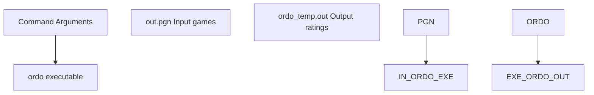
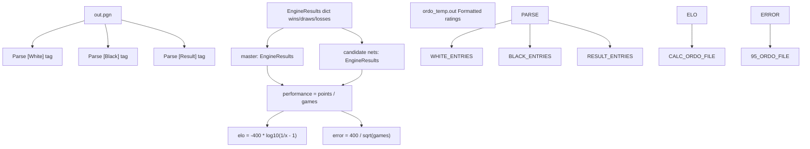
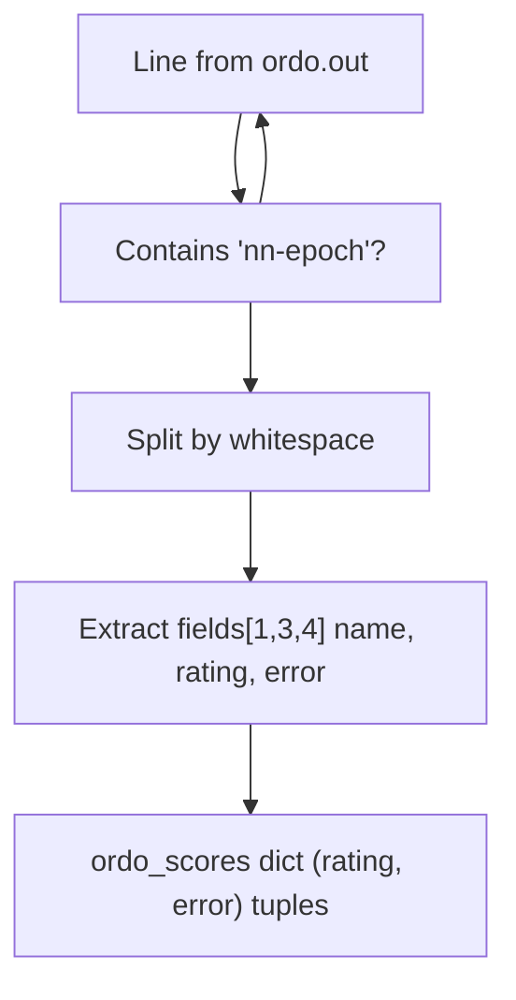
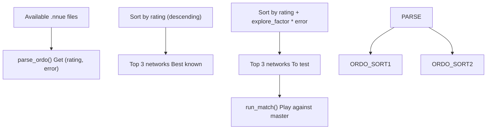
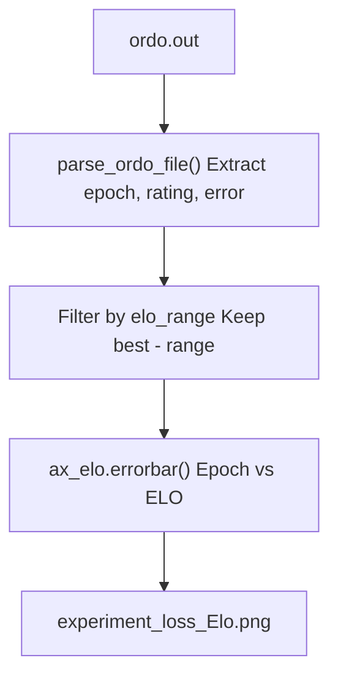
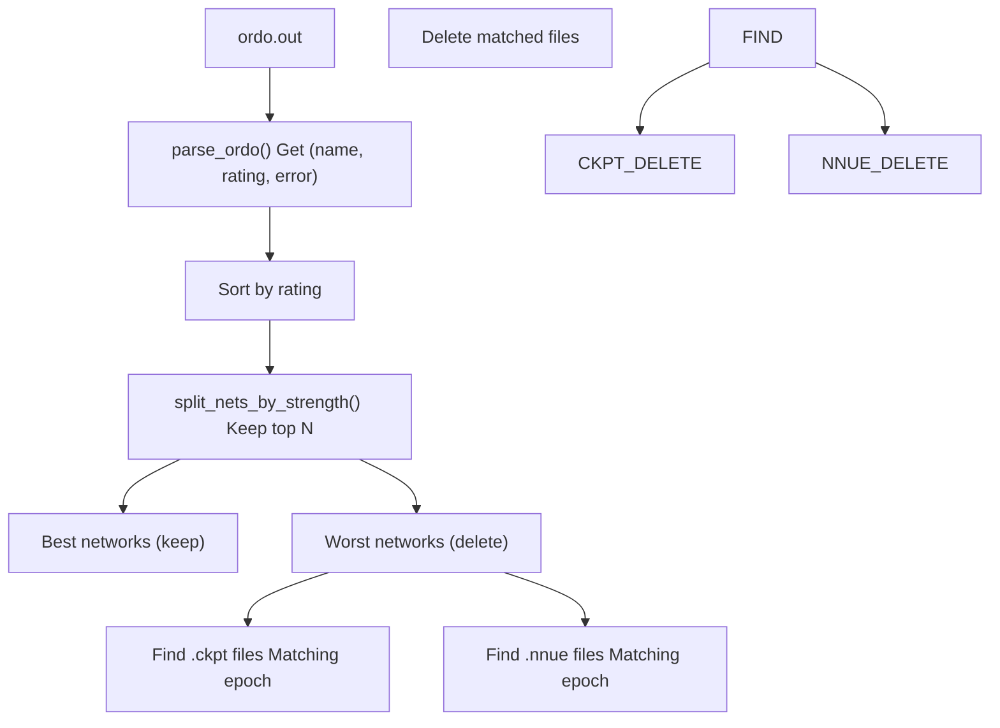

# ELO Calculation with Ordo

-   [delete\_bad\_nets.py](https://github.com/Chesszyh/nnue-pytorch/blob/024b2064/delete_bad_nets.py)
-   [do\_plots.py](https://github.com/Chesszyh/nnue-pytorch/blob/024b2064/do_plots.py)
-   [run\_games.py](https://github.com/Chesszyh/nnue-pytorch/blob/024b2064/run_games.py)

## Purpose and Scope

This document explains how the nnue-pytorch system calculates ELO ratings for trained neural networks using the ordo rating tool. The ordo system provides Bayesian ELO ratings with error bars, enabling automatic network selection and quality tracking during training. For information about playing games to generate the data for ordo, see [Running Games (run\_games.py)](#7.1). For information about visualizing ordo results, see [Visualization and Analysis](#7.3).

## Overview of Ordo Integration

The system uses **ordo**, a Bayesian ELO rating calculator for chess engines, to rank trained neural networks based on game results. Ordo analyzes PGN game files and produces ratings with statistical error bars, which the system uses to:

1.  **Select networks for testing** - Networks with high `rating + explore_factor * error` are prioritized
2.  **Track training progress** - ELO ratings over epochs indicate improvement
3.  **Identify weak networks** - Low-rated networks can be automatically deleted

The system supports two modes of operation:

-   **Full ordo** - Uses the external ordo executable (recommended)
-   **Approximate ordo** - Built-in calculation when ordo is unavailable

Sources: [run\_games.py1-605](https://github.com/Chesszyh/nnue-pytorch/blob/024b2064/run_games.py#L1-L605)

## Ordo Execution Architecture

```mermaid
flowchart TD
    MATCH["run_match()"]
    PGN_TEMP["out_temp.pgn Temporary game records"]
    PGN_MAIN["out.pgn Accumulated games"]
    CHECK_ORDO["ordo_exe provided?"]
    FULL_ORDO["run_ordo() External ordo executable"]
    APPROX_ORDO["run_approximate_ordo() Built-in calculation"]
    ORDO_TEMP["ordo_temp.out Temporary ratings"]
    ORDO_OUT["ordo.out Final ratings"]
    PARSE["parse_ordo() Extract ratings + errors"]
    SELECTION["Network Selection rating + explore_factor * error"]
    PLOTS["do_plots.py ELO visualization"]
    DELETE["delete_bad_nets.py Cleanup"]

    MATCH --> PGN_TEMP
    PGN --> TEMP_PGN_MAIN
    PGN --> MAIN_CHECK_ORDO
    CHECK --> ORDO_FULL_ORDO
    CHECK --> ORDO_APPROX_ORDO
    FULL --> ORDO_ORDO_TEMP
    APPROX --> ORDO_ORDO_TEMP
    ORDO --> TEMP_ORDO_OUT
    ORDO --> OUT_PARSE
    PARSE --> SELECTION
    ORDO --> OUT_PLOTS
    ORDO --> OUT_DELETE
```


**Diagram: Ordo Execution Flow**

The system runs game playing and ordo calculation in parallel threads to maximize throughput, as ordo can be single-threaded and time-consuming on large game databases.

Sources: [run\_games.py448-474](https://github.com/Chesszyh/nnue-pytorch/blob/024b2064/run_games.py#L448-L474) [run\_games.py476-491](https://github.com/Chesszyh/nnue-pytorch/blob/024b2064/run_games.py#L476-L491)

## Full Ordo Mode

### Command-Line Invocation

The `run_ordo()` function executes the external ordo binary with specific parameters:


**Diagram: Ordo Command Structure**

| Argument | Value | Purpose |
| --- | --- | --- |
| `-q` | \- | Quiet mode (less output) |
| `-g` | \- | Use game results only |
| `-J` | \- | Use Bayesian calculation |
| `-p` | `{pgn_file_name}` | PGN file to analyze |
| `-a` | `0.0` | Anchor rating |
| `--anchor` | `master` | Anchor engine name |
| `--draw-auto` | \- | Auto-detect draw rate |
| `--white-auto` | \- | Auto-detect white advantage |
| `-s` | `100` | Simulation count |
| `--cpus` | `{concurrency}` | Parallel threads |
| `-o` | `{ordo_file_name_temp}` | Output file |

Sources: [run\_games.py351-382](https://github.com/Chesszyh/nnue-pytorch/blob/024b2064/run_games.py#L351-L382)

### Anchoring Strategy

The system anchors all ratings to the **master** engine at 0.0 ELO. This provides a stable reference point where:

-   Positive ratings indicate networks stronger than the baseline
-   Negative ratings indicate networks weaker than the baseline
-   All candidate networks are compared against the same baseline

Sources: [run\_games.py364-365](https://github.com/Chesszyh/nnue-pytorch/blob/024b2064/run_games.py#L364-L365)

### Atomic Output File Update

To prevent race conditions with concurrent readers, ordo writes to a temporary file first:

```
ordo_temp.out  →  (atomic rename)  →  ordo.out
```
This ensures that `ordo.out` is never in a partially-written state.

Sources: [run\_games.py355](https://github.com/Chesszyh/nnue-pytorch/blob/024b2064/run_games.py#L355-L355) [run\_games.py380](https://github.com/Chesszyh/nnue-pytorch/blob/024b2064/run_games.py#L380-L380)

## Approximate Ordo Mode

When the ordo executable is unavailable, the system provides a built-in calculation through `run_approximate_ordo()`. This mode leverages the gauntlet tournament structure where all candidate networks play only against the master baseline.

### Gauntlet-Based ELO Calculation


**Diagram: Approximate Ordo Calculation Flow**

Sources: [run\_games.py280-348](https://github.com/Chesszyh/nnue-pytorch/blob/024b2064/run_games.py#L280-L348)

### EngineResults Class

The `EngineResults` class tracks game outcomes and calculates ratings:

| Property | Formula | Description |
| --- | --- | --- |
| `wins` | Count | Number of wins |
| `draws` | Count | Number of draws |
| `losses` | Count | Number of losses |
| `total_games` | `wins + draws + losses` | Total games played |
| `points` | `wins + draws * 0.5` | Total points scored |
| `performance` | `points / total_games` | Win percentage |
| `elo` | `-400 * log10(1/x - 1)` | ELO rating where x = performance |
| `elo_error_95` | `400 / sqrt(total_games)` | 95% confidence interval |

The ELO formula uses a logit transformation with a clamping mechanism to avoid division by zero:

```
epsilon = 1e-3
x = clamp(performance, epsilon, 1 - epsilon)
elo = -400 * log10(1/x - 1)
```
Sources: [run\_games.py221-277](https://github.com/Chesszyh/nnue-pytorch/blob/024b2064/run_games.py#L221-L277)

### Limitations of Approximate Mode

The approximate calculation assumes:

1.  **Gauntlet structure** - All games are against master, not round-robin
2.  **Independent ratings** - Each network's rating is calculated independently
3.  **No transitivity** - Cannot infer A vs C from A vs B and B vs C results

This is sufficient for the training pipeline but less accurate than full Bayesian ordo when networks play each other directly.

Sources: [run\_games.py280-283](https://github.com/Chesszyh/nnue-pytorch/blob/024b2064/run_games.py#L280-L283)

## Ordo Output Format

The `ordo.out` file contains a human-readable table of ratings:

```
    # PLAYER                     :  RATING  ERROR    POINTS  PLAYED  (%)
    1 master                     :    0.0   ----     150.0     300   50
    2 run0/nn-epoch120.nnue      :   45.3    8.2     165.5     300   55
    3 run1/nn-epoch95.nnue       :   32.1    8.5     158.0     300   53
    4 run0/nn-epoch110.nnue      :   18.7    8.7     152.5     300   51
```
### Parsing Logic

The `parse_ordo()` function extracts ratings from this format:


**Diagram: Ordo Output Parsing**

| Field Index | Content | Example |
| --- | --- | --- |
| `fields[1]` | Network name | `run0/nn-epoch120.nnue` |
| `fields[3]` | Rating | `45.3` |
| `fields[4]` | Error | `8.2` |

Sources: [run\_games.py109-129](https://github.com/Chesszyh/nnue-pytorch/blob/024b2064/run_games.py#L109-L129)

### Default Scores for Untested Networks

Networks without ordo entries receive pessimistic default scores:

```
ordo_scores[name] = (-500, 1000)
```
This ensures untested networks are prioritized for evaluation (high error term).

Sources: [run\_games.py113-114](https://github.com/Chesszyh/nnue-pytorch/blob/024b2064/run_games.py#L113-L114)

## Network Selection Strategy

The system uses an **Upper Confidence Bound (UCB)** strategy to balance exploration and exploitation:

```
selection_score = rating + explore_factor * error
```
### Selection Process


**Diagram: Network Selection Algorithm**

The `explore_factor` parameter controls the exploration-exploitation tradeoff:

-   **Low values** (e.g., 0.5): Exploit - focus on known strong networks
-   **Default** (1.5): Balanced - test networks with uncertain strength
-   **High values** (e.g., 3.0): Explore - prioritize networks with high uncertainty

Sources: [run\_games.py412-444](https://github.com/Chesszyh/nnue-pytorch/blob/024b2064/run_games.py#L412-L444) [run\_games.py515-518](https://github.com/Chesszyh/nnue-pytorch/blob/024b2064/run_games.py#L515-L518)

### Two-Stage Display

The system displays both:

1.  **Best networks so far** - Sorted by rating alone

    ```
    Best nets so far:
       run0/nn-epoch120.nnue : 45.3 +- 8.2
    ```

2.  **Networks to measure** - Sorted by `rating + explore_factor * error`

    ```
    Measuring nets:
       run1/nn-epoch95.nnue : 32.1 +- 8.5
    ```


Sources: [run\_games.py414-426](https://github.com/Chesszyh/nnue-pytorch/blob/024b2064/run_games.py#L414-L426) [run\_games.py428-444](https://github.com/Chesszyh/nnue-pytorch/blob/024b2064/run_games.py#L428-L444)

## Integration with Other Tools

### Visualization (do\_plots.py)

The plotting tool parses ordo.out to create ELO progression graphs:


**Diagram: Ordo Data Visualization Pipeline**

The parser extracts epoch numbers from network names using regex:

```
Pattern: nn-epoch(\d+)\.nnue
Example: run0/nn-epoch120.nnue → epoch=120
```
Sources: [do\_plots.py65-79](https://github.com/Chesszyh/nnue-pytorch/blob/024b2064/do_plots.py#L65-L79) [do\_plots.py173-202](https://github.com/Chesszyh/nnue-pytorch/blob/024b2064/do_plots.py#L173-L202)

### Network Cleanup (delete\_bad\_nets.py)

The cleanup script uses ordo rankings to identify weak networks for deletion:


**Diagram: Network Cleanup Based on Ordo Ratings**

The default behavior keeps the top 16 networks by rating and deletes the rest.

Sources: [delete\_bad\_nets.py78-120](https://github.com/Chesszyh/nnue-pytorch/blob/024b2064/delete_bad_nets.py#L78-L120)

## Configuration and Usage

### Command-Line Arguments (run\_games.py)

| Argument | Default | Description |
| --- | --- | --- |
| `--ordo_exe` | `None` | Path to ordo executable; if None, uses approximate mode |
| `--explore_factor` | `1.5` | UCB exploration coefficient |
| `--concurrency` | `8` | CPU cores for ordo and game playing |

Sources: [run\_games.py520-525](https://github.com/Chesszyh/nnue-pytorch/blob/024b2064/run_games.py#L520-L525) [run\_games.py509-512](https://github.com/Chesszyh/nnue-pytorch/blob/024b2064/run_games.py#L509-L512)

### Example Usage

**With external ordo:**

```
python run_games.py experiments/ \    --ordo_exe ./ordo \    --explore_factor 1.5 \    --concurrency 16
```
**Without ordo (approximate mode):**

```
python run_games.py experiments/ \    --explore_factor 1.5 \    --concurrency 16
```
Sources: [run\_games.py494-605](https://github.com/Chesszyh/nnue-pytorch/blob/024b2064/run_games.py#L494-L605)

## Thread Safety and Parallelization

The system runs ordo and game playing in parallel threads:

```
run_match_thread = threading.Thread(target=run_match, args=(...))run_ordo_thread = threading.Thread(target=run_ordo, args=(...))run_match_thread.start()run_ordo_thread.start()run_match_thread.join()run_ordo_thread.join()
```
This parallelization is safe because:

1.  Games write to `out_temp.pgn` (temporary)
2.  Ordo reads from `out.pgn` (accumulated)
3.  Ordo writes to `ordo_temp.out` then atomically renames
4.  The temporary PGN is appended to main PGN after both threads complete

Sources: [run\_games.py448-491](https://github.com/Chesszyh/nnue-pytorch/blob/024b2064/run_games.py#L448-L491)

## Statistical Interpretation

### Error Bars

The error values represent the **95% confidence interval** of the rating estimate. For approximate ordo:

```
error_95 = 400 / sqrt(total_games)
```
This means:

-   200 games → ±28.3 ELO
-   400 games → ±20.0 ELO
-   1000 games → ±12.6 ELO

More games reduce uncertainty, making ratings more reliable.

Sources: [run\_games.py276-277](https://github.com/Chesszyh/nnue-pytorch/blob/024b2064/run_games.py#L276-L277)

### Bayesian vs Frequentist

Full ordo uses **Bayesian ELO** calculation with simulation (`-s 100`), which:

-   Handles sparse data better than frequentist approaches
-   Provides posterior distributions over ratings
-   Accounts for correlation in round-robin tournaments

The approximate mode uses a **frequentist logit transformation**, suitable for the gauntlet structure.

Sources: [run\_games.py360](https://github.com/Chesszyh/nnue-pytorch/blob/024b2064/run_games.py#L360-L360) [run\_games.py265-269](https://github.com/Chesszyh/nnue-pytorch/blob/024b2064/run_games.py#L265-L269)
