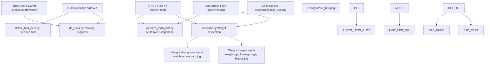
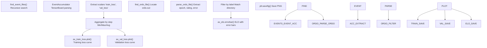
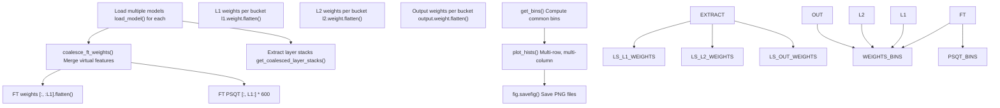
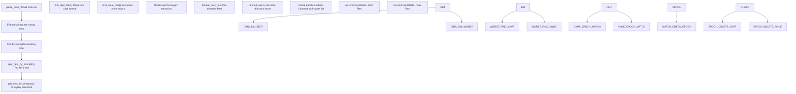
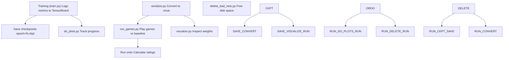

# Visualization and Analysis

-   [delete\_bad\_nets.py](https://github.com/Chesszyh/nnue-pytorch/blob/024b2064/delete_bad_nets.py)
-   [do\_plots.py](https://github.com/Chesszyh/nnue-pytorch/blob/024b2064/do_plots.py)
-   [model/\_\_init\_\_.py](https://github.com/Chesszyh/nnue-pytorch/blob/024b2064/model/__init__.py)
-   [model/utils/\_\_init\_\_.py](https://github.com/Chesszyh/nnue-pytorch/blob/024b2064/model/utils/__init__.py)
-   [run\_games.py](https://github.com/Chesszyh/nnue-pytorch/blob/024b2064/run_games.py)
-   [serialize.py](https://github.com/Chesszyh/nnue-pytorch/blob/024b2064/serialize.py)
-   [visualize.py](https://github.com/Chesszyh/nnue-pytorch/blob/024b2064/visualize.py)
-   [visualize\_multi\_hist.py](https://github.com/Chesszyh/nnue-pytorch/blob/024b2064/visualize_multi_hist.py)

## Overview

This document covers the tools for visualizing training progress, analyzing network weights, and managing network quality in the nnue-pytorch repository. These tools enable researchers to monitor training effectiveness, understand learned features, and maintain organized experiment directories.

The visualization and analysis system consists of:

-   **Training progress monitoring**: Track loss curves and ELO ratings over time ([do\_plots.py](https://github.com/Chesszyh/nnue-pytorch/blob/024b2064/do_plots.py))
-   **Weight inspection**: Visualize learned features in the feature transformer and layer stacks ([visualize.py](https://github.com/Chesszyh/nnue-pytorch/blob/024b2064/visualize.py))
-   **Network comparison**: Compare weight distributions across multiple trained networks ([visualize\_multi\_hist.py](https://github.com/Chesszyh/nnue-pytorch/blob/024b2064/visualize_multi_hist.py))
-   **Quality management**: Automatically clean up underperforming networks ([delete\_bad\_nets.py](https://github.com/Chesszyh/nnue-pytorch/blob/024b2064/delete_bad_nets.py))

For information about running games to generate evaluation data, see [Running Games](#7.1). For ELO calculation details, see [ELO Calculation with Ordo](#7.2).

## Visualization Workflow


**Diagram**: Visualization and Analysis Workflow

Sources: [do\_plots.py1-267](https://github.com/Chesszyh/nnue-pytorch/blob/024b2064/do_plots.py#L1-L267) [visualize.py1-712](https://github.com/Chesszyh/nnue-pytorch/blob/024b2064/visualize.py#L1-L712) [visualize\_multi\_hist.py1-170](https://github.com/Chesszyh/nnue-pytorch/blob/024b2064/visualize_multi_hist.py#L1-L170) [delete\_bad\_nets.py1-167](https://github.com/Chesszyh/nnue-pytorch/blob/024b2064/delete_bad_nets.py#L1-L167)

## Training Progress Visualization

The `do_plots.py` script generates comprehensive plots showing training and validation loss curves alongside ELO progression over epochs. This provides a unified view of both optimization metrics and actual playing strength.

### Data Sources

The script aggregates data from two sources:

1.  **TensorBoard event files**: Training and validation loss metrics logged during training
2.  **Ordo ranking file**: ELO ratings calculated from game results


**Diagram**: do\_plots.py Data Processing Pipeline

Sources: [do\_plots.py10-63](https://github.com/Chesszyh/nnue-pytorch/blob/024b2064/do_plots.py#L10-L63) [do\_plots.py86-215](https://github.com/Chesszyh/nnue-pytorch/blob/024b2064/do_plots.py#L86-L215)

### Usage

Basic usage to plot a single experiment:

```
python do_plots.py experiment_dir/
```
Compare multiple experiments:

```
python do_plots.py experiment1/ experiment2/ experiment3/ \    --output comparison.png
```
| Argument | Default | Description |
| --- | --- | --- |
| `root_dirs` | (required) | One or more directories containing TensorBoard events and ordo.out |
| `--output` | `experiment_loss_Elo.png` | Output filename for the generated plot |
| `--elo_range` | `50.0` | Show only ELO data within this range of the best result |
| `--loss_range` | `0.004` | Show only loss data within this range of the best result |
| `--split` | `False` | Split each root\_dir into subdirectories for separate plotting |

The `--split` flag is useful when training multiple runs in subdirectories but maintaining a single `ordo.out` file at the root level ([do\_plots.py118-128](https://github.com/Chesszyh/nnue-pytorch/blob/024b2064/do_plots.py#L118-L128)).

### Implementation Details

**Event File Discovery**: The script recursively searches for files matching the pattern `events.out.tfevents.*` ([do\_plots.py10-18](https://github.com/Chesszyh/nnue-pytorch/blob/024b2064/do_plots.py#L10-L18)):

**Loss Aggregation**: When multiple TensorBoard runs exist (e.g., from multi-GPU training), the script aggregates values by step using configurable aggregation modes ([do\_plots.py40-53](https://github.com/Chesszyh/nnue-pytorch/blob/024b2064/do_plots.py#L40-L53)):

-   `min`: Takes minimum loss at each step
-   `max`: Takes maximum loss at each step
-   `avg`: Averages losses at each step

**Ordo Parsing**: The script extracts networks matching the pattern `nn-epoch(\d+).nnue` and their associated ELO ratings and error bars ([do\_plots.py65-79](https://github.com/Chesszyh/nnue-pytorch/blob/024b2064/do_plots.py#L65-L79)).

Sources: [do\_plots.py1-267](https://github.com/Chesszyh/nnue-pytorch/blob/024b2064/do_plots.py#L1-L267)

## Network Weight Visualization

The `visualize.py` script provides detailed visualization of NNUE network weights and biases, with special support for the complex feature transformer structure. It can visualize single networks or compute differences between two networks.

### NNUEVisualizer Class

The visualization logic is encapsulated in the `NNUEVisualizer` class ([visualize.py9-549](https://github.com/Chesszyh/nnue-pytorch/blob/024b2064/visualize.py#L9-L549)):

```mermaid
flowchart TD
    INIT["init() Initialize models and args"]
    PROCESS["_process_fig() Save or display figures"]
    PLOT_INPUT["plot_input_weights() Feature transformer visualization"]
    PLOT_FC["plot_fc_weights() Layer stack weights"]
    PLOT_BIAS["plot_fc_biases() Layer stack biases"]
    COALESCE["coalesce_ft_weights() Merge virtual features"]
    MASK["Create img_mask Map features to pixels"]
    FILL["Fill image array Per-neuron visualization"]
    MATSHOW["plt.matshow() Display weight matrix"]
    HIST["plt.hist() Weight histogram"]
    GET_LAYERS["get_coalesced_layer_stacks() Per-bucket layers"]
    EXTRACT_L1["Extract L1 weights Feature transformer output"]
    EXTRACT_L2["Extract L2 weights 32 → 32 layer"]
    EXTRACT_OUT["Extract output weights 32 → 1 layer"]
    SUBPLOT["plt.subplots() Multi-bucket layout"]

    INIT --> PLOT_INPUT
    INIT --> PLOT_FC
    INIT --> PLOT_BIAS
    PLOT --> INPUT_COALESCE
    COALESCE --> MASK
    MASK --> FILL
    FILL --> MATSHOW
    FILL --> HIST
    PLOT --> FC_GET_LAYERS
    GET --> LAYERS_EXTRACT_L1
    GET --> LAYERS_EXTRACT_L2
    GET --> LAYERS_EXTRACT_OUT
    EXTRACT --> L1_SUBPLOT
    EXTRACT --> L2_SUBPLOT
    EXTRACT --> OUT_SUBPLOT
```


**Diagram**: NNUEVisualizer Architecture

Sources: [visualize.py9-23](https://github.com/Chesszyh/nnue-pytorch/blob/024b2064/visualize.py#L9-L23) [visualize.py40-316](https://github.com/Chesszyh/nnue-pytorch/blob/024b2064/visualize.py#L40-L316) [visualize.py317-476](https://github.com/Chesszyh/nnue-pytorch/blob/024b2064/visualize.py#L317-L476)

### Feature Transformer Visualization

The most complex visualization is the feature transformer weights ([visualize.py40-316](https://github.com/Chesszyh/nnue-pytorch/blob/024b2064/visualize.py#L40-L316)), which maps the sparse HalfKP/HalfKA feature space to a 2D image where each input neuron occupies a rectangular region.

**Layout Strategy**: The visualization arranges neurons in a grid with a preferred 4:1 aspect ratio ([visualize.py57-71](https://github.com/Chesszyh/nnue-pytorch/blob/024b2064/visualize.py#L57-L71)):

-   For `L1=1024` neurons: 256×4 grid (64 neurons per row, 16 rows)
-   Each neuron shows all features in a structured layout organized by piece type and king/piece positions

**Two Ordering Modes** ([visualize.py117-167](https://github.com/Chesszyh/nnue-pytorch/blob/024b2064/visualize.py#L117-L167)):

1.  **Piece-centric with flipped king** (default): Organizes weights by piece first, compatible with the Stockfish evaluation guide visualization
2.  **King-centric**: Organizes weights by king position first

**Neuron Sorting**: The `--sort-input-neurons` flag sorts neurons by the L1-norm of their weights, placing most impactful neurons first ([visualize.py74-82](https://github.com/Chesszyh/nnue-pytorch/blob/024b2064/visualize.py#L74-L82)).

**Interactive Coordinate Display**: When displaying plots interactively, hovering over a pixel shows which piece, piece square, and king square the weight corresponds to ([visualize.py249-296](https://github.com/Chesszyh/nnue-pytorch/blob/024b2064/visualize.py#L249-L296)).

### Differential Visualization

When a reference model is provided via `--ref-model`, the visualizer computes weight differences ([visualize.py46-52](https://github.com/Chesszyh/nnue-pytorch/blob/024b2064/visualize.py#L46-L52)):

```
if self.args.ref_model:    ref_weights = M.coalesce_ft_weights(...)    weights -= ref_weights  # Subtract reference weights
```
This is useful for:

-   Comparing networks at different training epochs
-   Analyzing the effect of hyperparameter changes
-   Identifying which features changed most during training

### Command-Line Interface

| Argument | Default | Description |
| --- | --- | --- |
| `model` | (required) | Source model (.ckpt, .pt, or .nnue) |
| `--ref-model` | None | Reference model for differential visualization |
| `--ref-features` | Same as model | Feature set for reference model |
| `--input-weights-vmin` | \-1 | Colormap minimum for input weights (≥0 plots absolute values) |
| `--input-weights-vmax` | 1 | Colormap maximum for input weights |
| `--input-weights-auto-scale` | False | Use automatic colormap scaling |
| `--input-weights-order` | `piece-centric-flipped-king` | Weight ordering: `piece-centric-flipped-king` or `king-centric` |
| `--sort-input-neurons` | False | Sort neurons by weight L1-norm |
| `--fc-weights-vmin` | \-2 | Colormap minimum for FC layer weights |
| `--fc-weights-vmax` | 2 | Colormap maximum for FC layer weights |
| `--fc-weights-auto-scale` | False | Use automatic colormap scaling for FC layers |
| `--no-hist` | False | Skip histogram generation |
| `--no-biases` | False | Skip bias visualization |
| `--no-input-weights` | False | Skip input weight visualization |
| `--no-fc-weights` | False | Skip FC weight visualization |
| `--save-dir` | None | Directory to save plots (if not set, displays interactively) |
| `--label` | Basename of model | Label for plot titles and filenames |

Example usage:

```
# Visualize a single networkpython visualize.py experiment/nn-epoch100.nnue --save-dir plots/# Compare two networkspython visualize.py epoch100.nnue \    --ref-model epoch50.nnue \    --label "epoch100_vs_50" \    --save-dir comparison/# Visualize with sorted neurons and king-centric orderingpython visualize.py model.nnue \    --sort-input-neurons \    --input-weights-order king-centric
```
Sources: [visualize.py551-712](https://github.com/Chesszyh/nnue-pytorch/blob/024b2064/visualize.py#L551-L712)

## Multi-Network Comparison

The `visualize_multi_hist.py` script generates histogram plots comparing weight distributions across multiple networks. This is useful for analyzing training dynamics and comparing different training runs.

### Functionality

The script generates four histogram plots:

1.  **Feature transformer weights**: Distribution of FT weights across all neurons
2.  **Feature transformer PSQT weights**: Distribution of PSQT (Piece-Square Table) components
3.  **L1 weights**: Distribution per bucket across networks
4.  **L2 weights**: Distribution per bucket across networks
5.  **Output weights**: Distribution per bucket across networks


**Diagram**: Multi-Network Histogram Generation Pipeline

Sources: [visualize\_multi\_hist.py57-166](https://github.com/Chesszyh/nnue-pytorch/blob/024b2064/visualize_multi_hist.py#L57-L166)

### Implementation Details

**Bin Calculation**: The script computes common histogram bins across all networks to ensure consistent x-axis scaling ([visualize\_multi\_hist.py9-18](https://github.com/Chesszyh/nnue-pytorch/blob/024b2064/visualize_multi_hist.py#L9-L18)):

```
def get_bins(inputs_columns, num_bins):    a = float("+inf")    b = float("-inf")    for inputs in inputs_columns:        for inp in inputs:            a = min(a, float(np.min(inp)))            b = max(b, float(np.max(inp)))    a -= 0.001    b += 0.001    return [a + (b - a) / num_bins * i for i in range(num_bins + 1)]
```
**Multi-Grid Layout**: The `plot_hists()` function creates a grid of histograms where rows represent different networks and columns represent different components (e.g., buckets for layer stacks) ([visualize\_multi\_hist.py21-54](https://github.com/Chesszyh/nnue-pytorch/blob/024b2064/visualize_multi_hist.py#L21-L54)).

**PSQT Scaling**: Feature transformer PSQT weights are multiplied by 600 to convert to Stockfish internal units ([visualize\_multi\_hist.py98-100](https://github.com/Chesszyh/nnue-pytorch/blob/024b2064/visualize_multi_hist.py#L98-L100)).

### Usage

```
# Compare three networkspython visualize_multi_hist.py \    epoch50.nnue epoch100.nnue epoch150.nnue \    --features HalfKAv2_hm
```
This generates PNG files:

-   `input_weights_hist.png`: FT weight distributions
-   `input_weights_psqt_hist.png`: PSQT weight distributions
-   `l1_weights_hist.png`: L1 layer weight distributions (all buckets)
-   `l2_weights_hist.png`: L2 layer weight distributions (all buckets)
-   `output_weights_hist.png`: Output layer weight distributions (all buckets)

Sources: [visualize\_multi\_hist.py1-170](https://github.com/Chesszyh/nnue-pytorch/blob/024b2064/visualize_multi_hist.py#L1-L170)

## Network Quality Management

The `delete_bad_nets.py` script automates cleanup of underperforming networks based on ordo rankings. This helps maintain manageable disk usage during long training runs with frequent checkpointing.

### Cleanup Workflow


**Diagram**: Network Cleanup Process

Sources: [delete\_bad\_nets.py7-120](https://github.com/Chesszyh/nnue-pytorch/blob/024b2064/delete_bad_nets.py#L7-L120)

### Safety Features

The script includes several safety mechanisms:

1.  **Ordo dependency**: Nothing is deleted if `ordo.out` is not found ([delete\_bad\_nets.py82-84](https://github.com/Chesszyh/nnue-pytorch/blob/024b2064/delete_bad_nets.py#L82-L84))
2.  **Whitelist approach**: Only networks explicitly listed in ordo can be deleted; unlisted networks are always kept ([delete\_bad\_nets.py138-139](https://github.com/Chesszyh/nnue-pytorch/blob/024b2064/delete_bad_nets.py#L138-L139))
3.  **Directory isolation**: Networks are binned by parent directory, preventing cross-directory deletions ([delete\_bad\_nets.py56-75](https://github.com/Chesszyh/nnue-pytorch/blob/024b2064/delete_bad_nets.py#L56-L75))
4.  **Epoch matching**: .ckpt and .nnue files must have matching epoch numbers to be deleted together ([delete\_bad\_nets.py95-119](https://github.com/Chesszyh/nnue-pytorch/blob/024b2064/delete_bad_nets.py#L95-L119))

### Usage

```
# Keep top 16 networks, delete restpython delete_bad_nets.py experiment_dir/# Keep top 32 networkspython delete_bad_nets.py experiment_dir/ 32
```
**Arguments**:

-   `root_dir`: Directory to clean up (must contain or have child with `ordo.out`)
-   `num_best_to_keep`: Number of best networks to preserve (default: 16)

### File Matching Patterns

The script uses regular expressions to match files ([delete\_bad\_nets.py79-80](https://github.com/Chesszyh/nnue-pytorch/blob/024b2064/delete_bad_nets.py#L79-L80) [delete\_bad\_nets.py95-96](https://github.com/Chesszyh/nnue-pytorch/blob/024b2064/delete_bad_nets.py#L95-L96)):

| File Type | Pattern | Example |
| --- | --- | --- |
| NNUE files | `.*epoch([0-9]*).nnue` | `nn-epoch100.nnue` |
| Checkpoint files | `.*epoch=([0-9]*).*\.ckpt` | `epoch=100-step=250000.ckpt` |

The epoch number is extracted and used to match corresponding .ckpt and .nnue files for deletion.

Sources: [delete\_bad\_nets.py1-167](https://github.com/Chesszyh/nnue-pytorch/blob/024b2064/delete_bad_nets.py#L1-L167)

## Integration with Training Pipeline

The visualization and analysis tools integrate seamlessly with the training workflow:


**Diagram**: Visualization Tools in Training Pipeline

Sources: [do\_plots.py1-267](https://github.com/Chesszyh/nnue-pytorch/blob/024b2064/do_plots.py#L1-L267) [visualize.py1-712](https://github.com/Chesszyh/nnue-pytorch/blob/024b2064/visualize.py#L1-L712) [delete\_bad\_nets.py1-167](https://github.com/Chesszyh/nnue-pytorch/blob/024b2064/delete_bad_nets.py#L1-L167)

### Typical Workflow

1.  **During training**: Monitor progress with `do_plots.py` to track loss and ELO improvements
2.  **After training milestones**: Use `visualize.py` to inspect learned features at specific epochs
3.  **When comparing approaches**: Use `visualize_multi_hist.py` to compare weight distributions across different training configurations
4.  **Periodically**: Run `delete_bad_nets.py` to remove underperforming checkpoints and maintain disk space

The visualization tools require no special configuration and work directly with the standard training outputs. All tools support both `.ckpt` (training checkpoints) and `.nnue` (deployment format) files, automatically detecting and loading the appropriate format.

Sources: [model/\_\_init\_\_.py1-32](https://github.com/Chesszyh/nnue-pytorch/blob/024b2064/model/__init__.py#L1-L32) [model/utils/\_\_init\_\_.py1-13](https://github.com/Chesszyh/nnue-pytorch/blob/024b2064/model/utils/__init__.py#L1-L13)
