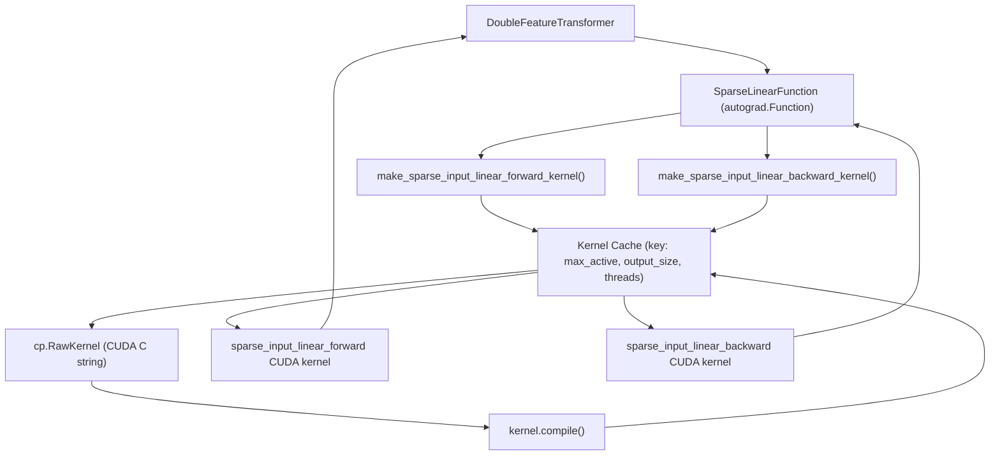
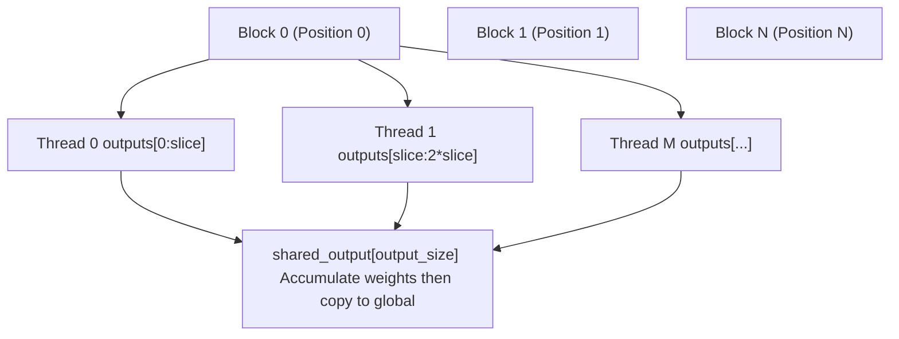
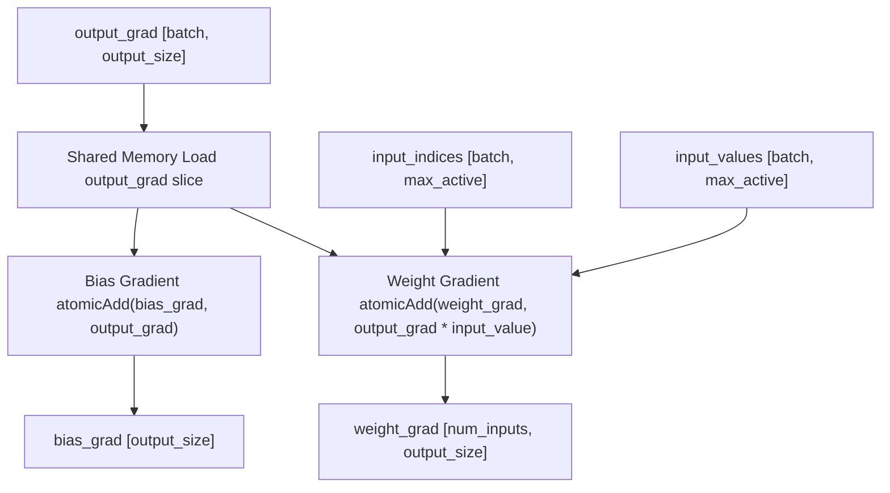
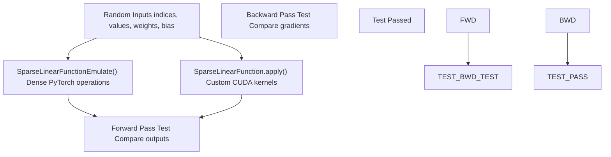
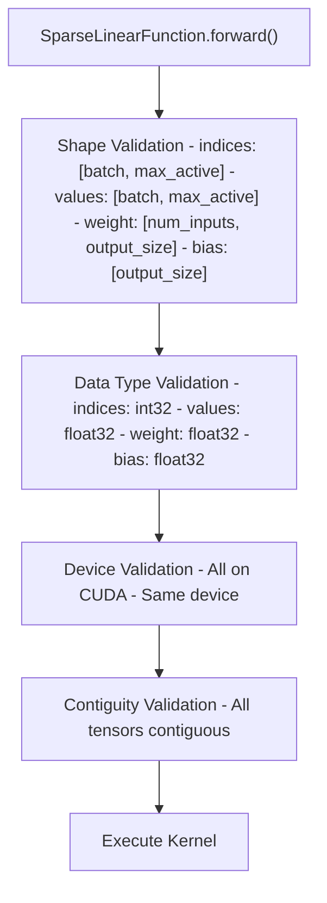
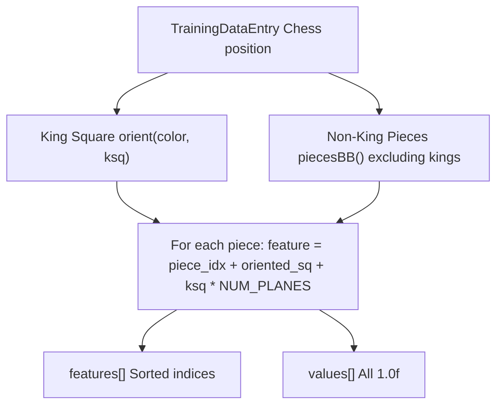
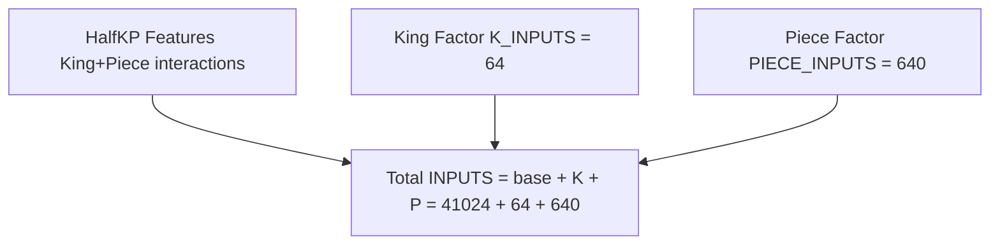
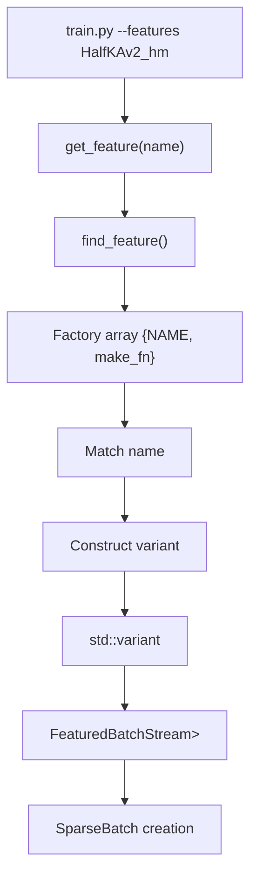
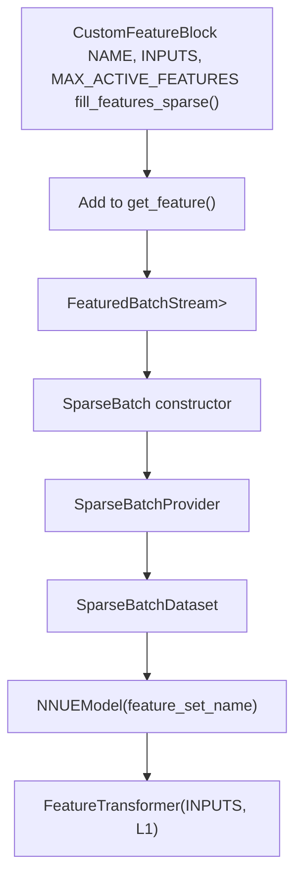

# Advanced Topics

-   [lib/nnue\_training\_data\_formats.h](https://github.com/Chesszyh/nnue-pytorch/blob/024b2064/lib/nnue_training_data_formats.h)
-   [lib/nnue\_training\_data\_stream.h](https://github.com/Chesszyh/nnue-pytorch/blob/024b2064/lib/nnue_training_data_stream.h)
-   [model/modules/\_\_init\_\_.py](https://github.com/Chesszyh/nnue-pytorch/blob/024b2064/model/modules/__init__.py)
-   [model/modules/feature\_transformer/\_\_init\_\_.py](https://github.com/Chesszyh/nnue-pytorch/blob/024b2064/model/modules/feature_transformer/__init__.py)
-   [model/modules/feature\_transformer/functions.py](https://github.com/Chesszyh/nnue-pytorch/blob/024b2064/model/modules/feature_transformer/functions.py)
-   [model/modules/feature\_transformer/kernel.py](https://github.com/Chesszyh/nnue-pytorch/blob/024b2064/model/modules/feature_transformer/kernel.py)
-   [model/modules/feature\_transformer/module.py](https://github.com/Chesszyh/nnue-pytorch/blob/024b2064/model/modules/feature_transformer/module.py)
-   [tests/test\_feature\_transformer.py](https://github.com/Chesszyh/nnue-pytorch/blob/024b2064/tests/test_feature_transformer.py)
-   [training\_data\_loader.cpp](https://github.com/Chesszyh/nnue-pytorch/blob/024b2064/training_data_loader.cpp)

This page covers advanced implementation details for developers who need deep understanding of the system internals. It documents custom CUDA kernels, testing infrastructure, and the feature set extension mechanism.

For basic model architecture concepts, see [Model Architecture](#4). For serialization details, see [Model Serialization](#5). For optimization techniques like FT permutation, see [Optimization Techniques](#6).

## 8.1 Custom CUDA Kernels

The feature transformer uses custom CUDA kernels to efficiently process sparse input features. These kernels are dynamically compiled at runtime and cached for reuse.

### Kernel Architecture

The sparse linear operation is split into forward and backward kernels that handle the unique structure of NNUE feature inputs:


**Sources:** [model/modules/feature\_transformer/kernel.py1-312](https://github.com/Chesszyh/nnue-pytorch/blob/024b2064/model/modules/feature_transformer/kernel.py#L1-L312) [model/modules/feature\_transformer/functions.py1-105](https://github.com/Chesszyh/nnue-pytorch/blob/024b2064/model/modules/feature_transformer/functions.py#L1-L105) [model/modules/feature\_transformer/module.py1-51](https://github.com/Chesszyh/nnue-pytorch/blob/024b2064/model/modules/feature_transformer/module.py#L1-L51)

### Forward Kernel Implementation

The forward kernel accumulates weights for active features into shared memory before writing to global memory:

| Component | Description | Location in Code |
| --- | --- | --- |
| **Input Indices** | `int32_t[batch_size, max_active_features]` - feature IDs, -1 for empty slots | [model/modules/feature\_transformer/kernel.py82-93](https://github.com/Chesszyh/nnue-pytorch/blob/024b2064/model/modules/feature_transformer/kernel.py#L82-L93) |
| **Input Values** | `float32[batch_size, max_active_features]` - feature arities | [model/modules/feature\_transformer/kernel.py94-98](https://github.com/Chesszyh/nnue-pytorch/blob/024b2064/model/modules/feature_transformer/kernel.py#L94-L98) |
| **Weight Matrix** | `float32[num_inputs, output_size]` - learnable weights | [model/modules/feature\_transformer/kernel.py100-102](https://github.com/Chesszyh/nnue-pytorch/blob/024b2064/model/modules/feature_transformer/kernel.py#L100-L102) |
| **Bias Vector** | `float32[output_size]` - learnable biases | [model/modules/feature\_transformer/kernel.py104-106](https://github.com/Chesszyh/nnue-pytorch/blob/024b2064/model/modules/feature_transformer/kernel.py#L104-L106) |
| **Output** | `float32[batch_size, output_size]` - computed activations | [model/modules/feature\_transformer/kernel.py108-113](https://github.com/Chesszyh/nnue-pytorch/blob/024b2064/model/modules/feature_transformer/kernel.py#L108-L113) |

The kernel parallelizes across the batch dimension (one CUDA block per position) and output dimension (multiple threads per block):


**Key optimization:** Each thread handles `output_thread_slice_size = output_size // num_threads` consecutive outputs, enabling coalesced memory access.

**Sources:** [model/modules/feature\_transformer/kernel.py68-173](https://github.com/Chesszyh/nnue-pytorch/blob/024b2064/model/modules/feature_transformer/kernel.py#L68-L173)

### Backward Kernel Implementation

The backward kernel computes gradients for weights and biases using atomic operations to handle concurrent updates:


**Atomic operations:** Required because multiple positions in a batch may activate the same feature, causing concurrent writes to the same weight gradient location [model/modules/feature\_transformer/kernel.py276-277](https://github.com/Chesszyh/nnue-pytorch/blob/024b2064/model/modules/feature_transformer/kernel.py#L276-L277) [model/modules/feature\_transformer/kernel.py293](https://github.com/Chesszyh/nnue-pytorch/blob/024b2064/model/modules/feature_transformer/kernel.py#L293-L293)

**Sources:** [model/modules/feature\_transformer/kernel.py197-311](https://github.com/Chesszyh/nnue-pytorch/blob/024b2064/model/modules/feature_transformer/kernel.py#L197-L311)

### Kernel Compilation and Caching

Kernels are compiled on-demand using CuPy and cached based on hyperparameters:

| Cache Key Component | Purpose |
| --- | --- |
| `max_active_indices` | Determines loop unrolling and shared memory size |
| `output_size` | Determines thread count and memory layout |
| `num_threads` | Optimized thread count for given output size |

The caching mechanism:

```
# Forward kernel cache_sparse_input_linear_forward_kernel_cache = dict()def make_sparse_input_linear_forward_kernel(max_active_indices: int, output_size: int):    num_threads = _get_num_threads_for_forward(output_size)    output_thread_slice_size = output_size // num_threads    key = (max_active_indices, output_size, num_threads)        if key not in _sparse_input_linear_forward_kernel_cache:        # Compile CUDA kernel with template parameters        kernel = cp.RawKernel(cuda_source_string, "sparse_input_linear_forward")        kernel.compile()        _sparse_input_linear_forward_kernel_cache[key] = kernel        return _sparse_input_linear_forward_kernel_cache[key]
```
**Thread count optimization:** The system finds the nearest divisor of `output_size` to the target of 512 threads [model/modules/feature\_transformer/kernel.py5-11](https://github.com/Chesszyh/nnue-pytorch/blob/024b2064/model/modules/feature_transformer/kernel.py#L5-L11) ensuring that `output_size % num_threads == 0` for even work distribution.

**Sources:** [model/modules/feature\_transformer/kernel.py14-24](https://github.com/Chesszyh/nnue-pytorch/blob/024b2064/model/modules/feature_transformer/kernel.py#L14-L24) [model/modules/feature\_transformer/kernel.py27-37](https://github.com/Chesszyh/nnue-pytorch/blob/024b2064/model/modules/feature_transformer/kernel.py#L27-L37) [model/modules/feature\_transformer/kernel.py47-173](https://github.com/Chesszyh/nnue-pytorch/blob/024b2064/model/modules/feature_transformer/kernel.py#L47-L173)

### Performance Characteristics

The sparse linear kernels achieve high performance through:

1.  **Coalesced Memory Access:** Threads access consecutive memory locations [model/modules/feature\_transformer/kernel.py125-138](https://github.com/Chesszyh/nnue-pytorch/blob/024b2064/model/modules/feature_transformer/kernel.py#L125-L138)
2.  **Shared Memory Buffering:** Reduces global memory traffic [model/modules/feature\_transformer/kernel.py122](https://github.com/Chesszyh/nnue-pytorch/blob/024b2064/model/modules/feature_transformer/kernel.py#L122-L122)
3.  **Early Termination:** Loop breaks on first -1 index [model/modules/feature\_transformer/kernel.py152](https://github.com/Chesszyh/nnue-pytorch/blob/024b2064/model/modules/feature_transformer/kernel.py#L152-L152)
4.  **Pragma Unroll:** Compiler hint for inner loops [model/modules/feature\_transformer/kernel.py134](https://github.com/Chesszyh/nnue-pytorch/blob/024b2064/model/modules/feature_transformer/kernel.py#L134-L134)

Typical performance: ~300,000 positions/second on modern GPUs (RTX 3090) with batch size 8192 and 40,960 input features [tests/test\_feature\_transformer.py81-86](https://github.com/Chesszyh/nnue-pytorch/blob/024b2064/tests/test_feature_transformer.py#L81-L86)

**Sources:** [tests/test\_feature\_transformer.py80-122](https://github.com/Chesszyh/nnue-pytorch/blob/024b2064/tests/test_feature_transformer.py#L80-L122)

## 8.2 Testing and Validation

The system includes comprehensive testing infrastructure to validate kernel correctness and measure performance.

### Unit Test Architecture


**Sources:** [tests/test\_feature\_transformer.py36-78](https://github.com/Chesszyh/nnue-pytorch/blob/024b2064/tests/test_feature_transformer.py#L36-L78)

### Reference Implementation

The test suite includes a pure PyTorch reference implementation that serves as ground truth:

```
def SparseLinearFunctionEmulate(    input_indices: torch.Tensor,    input_values: torch.Tensor,    weight: torch.Tensor,    bias: torch.Tensor,) -> torch.Tensor:    batch_size = input_indices.shape[0]    num_inputs = weight.shape[0]    max_active_indices = input_indices.shape[1]        # Expand sparse representation to dense    inputs = torch.zeros(batch_size, num_inputs, dtype=torch.float32, device=weight.device)    for i in range(batch_size):        for j in range(max_active_indices):            feature = input_indices[i, j]            value = input_values[i, j]            inputs[i, feature] += value        # Standard dense linear operation    return torch.mm(inputs, weight) + bias
```
This reference implementation is intentionally simple and obviously correct, trading performance for clarity [tests/test\_feature\_transformer.py15-33](https://github.com/Chesszyh/nnue-pytorch/blob/024b2064/tests/test_feature_transformer.py#L15-L33)

**Sources:** [tests/test\_feature\_transformer.py15-33](https://github.com/Chesszyh/nnue-pytorch/blob/024b2064/tests/test_feature_transformer.py#L15-L33)

### Test Coverage

The test validates:

| Test Aspect | Validation Method | Tolerance |
| --- | --- | --- |
| **Forward Pass** | Compare output tensors element-wise | `max_error < 1e-4` |
| **Backward Pass (Weights)** | Compare weight gradients element-wise | `max_error < 1e-4` |
| **Backward Pass (Bias)** | Compare bias gradients element-wise | `max_error < 1e-4` |
| **Multiple Positions** | Two independent forward passes | Same tolerance |

The test uses fixed random seed for reproducibility [tests/test\_feature\_transformer.py43-56](https://github.com/Chesszyh/nnue-pytorch/blob/024b2064/tests/test_feature_transformer.py#L43-L56)

**Sources:** [tests/test\_feature\_transformer.py36-78](https://github.com/Chesszyh/nnue-pytorch/blob/024b2064/tests/test_feature_transformer.py#L36-L78)

### Input Validation

The `SparseLinearFunction` performs extensive validation on the forward pass to catch errors early:


Each validation uses assertions that provide clear error messages during development [model/modules/feature\_transformer/functions.py15-40](https://github.com/Chesszyh/nnue-pytorch/blob/024b2064/model/modules/feature_transformer/functions.py#L15-L40)

**Sources:** [model/modules/feature\_transformer/functions.py10-69](https://github.com/Chesszyh/nnue-pytorch/blob/024b2064/model/modules/feature_transformer/functions.py#L10-L69)

### Performance Benchmarking

The benchmark measures throughput in positions per second:

```
def bench():    INPUT_SIZE = 40960    BATCH_SIZE = 8192    ITERS = 64    STRIDE = 264    MAX_ACTIVE_FEATURES = 64        layer = DoubleFeatureTransformer(INPUT_SIZE, STRIDE).cuda()        for _ in range(ITERS):        output0, output1 = layer(indices0, values0, indices1, values1)        output0 = torch.clamp(output0, 0.0, 1.0)        output1 = torch.clamp(output1, 0.0, 1.0)                g = ((output0 - output1) ** 2).mean()        g.backward()                torch.cuda.synchronize()        print("{} pos/s".format((ITERS * BATCH_SIZE) / elapsed))
```
The benchmark simulates realistic training conditions including:

-   Sparse indices (75% active, 25% padding with -1)
-   Forward and backward passes
-   Activation clipping
-   Gradient computation
-   GPU synchronization for accurate timing

**Sources:** [tests/test\_feature\_transformer.py80-122](https://github.com/Chesszyh/nnue-pytorch/blob/024b2064/tests/test_feature_transformer.py#L80-L122)

## 8.3 Extending Feature Sets

The system uses a flexible feature block architecture that allows implementing custom feature extractors.

### Feature Block Interface

All feature blocks must implement this interface:


**Sources:** [training\_data\_loader.cpp60-591](https://github.com/Chesszyh/nnue-pytorch/blob/024b2064/training_data_loader.cpp#L60-L591)

### Required Static Members

Each feature block struct must define:

| Member | Type | Purpose | Example |
| --- | --- | --- | --- |
| `NAME` | `std::string_view` | Feature set identifier | `"HalfKP"`, `"HalfKAv2_hm^"` |
| `INPUTS` | `constexpr int` | Total number of possible features | `41024` for HalfKP |
| `MAX_ACTIVE_FEATURES` | `constexpr int` | Maximum active features per position | `32` for most, `160` for Full\_Threats |

**Factorized variants:** Feature blocks with virtual features append `^` to the name and increase `INPUTS` and `MAX_ACTIVE_FEATURES` accordingly [training\_data\_loader.cpp100-110](https://github.com/Chesszyh/nnue-pytorch/blob/024b2064/training_data_loader.cpp#L100-L110)

**Sources:** [training\_data\_loader.cpp61-66](https://github.com/Chesszyh/nnue-pytorch/blob/024b2064/training_data_loader.cpp#L61-L66) [training\_data\_loader.cpp100-106](https://github.com/Chesszyh/nnue-pytorch/blob/024b2064/training_data_loader.cpp#L100-L106)

### Feature Extraction Method

The core method signature:

```
static std::pair<int, int> fill_features_sparse(    const TrainingDataEntry& e,    int* features,        // Output: feature indices    float* values,        // Output: feature values (arity)    Color color           // Perspective (White or Black))
```
**Return value:** `{num_active_features, total_inputs}` where:

-   `num_active_features`: Number of features written (≤ MAX\_ACTIVE\_FEATURES)
-   `total_inputs`: Same as INPUTS constant

**Contract:**

1.  Write feature indices to `features[0..num_active_features-1]`
2.  Write corresponding values to `values[0..num_active_features-1]`
3.  Features must be sorted for efficient sparse tensor coalescing [training\_data\_loader.cpp84-85](https://github.com/Chesszyh/nnue-pytorch/blob/024b2064/training_data_loader.cpp#L84-L85)
4.  Return the count of features written

**Sources:** [training\_data\_loader.cpp76-96](https://github.com/Chesszyh/nnue-pytorch/blob/024b2064/training_data_loader.cpp#L76-L96)

### Example: HalfKP Implementation

The HalfKP feature set encodes king position and piece positions:


Key implementation details:

```
static int feature_index(Color color, Square ksq, Square sq, Piece p) {    auto p_idx = static_cast<int>(p.type()) * 2 + (p.color() != color);    return 1 + static_cast<int>(orient(color, sq)) + p_idx * NUM_SQ         + static_cast<int>(ksq) * NUM_PLANES;}static std::pair<int, int>fill_features_sparse(const TrainingDataEntry& e, int* features, float* values, Color color) {    auto& pos = e.pos;    auto pieces = pos.piecesBB() & ~(pos.piecesBB(whitePiece) | pos.piecesBB(blackKing));    auto ksq = pos.kingSquare(color);        int j = 0;    for (Square sq : pieces) {        auto p = pos.pieceAt(sq);        values[j] = 1.0f;        features[j] = feature_index(color, orient(color, ksq), sq, p);        ++j;    }        return {j, INPUTS};}
```
**Orientation:** The `orient()` function applies perspective transformation (180° rotation for Black) [training\_data\_loader.cpp35-47](https://github.com/Chesszyh/nnue-pytorch/blob/024b2064/training_data_loader.cpp#L35-L47)

**Sources:** [training\_data\_loader.cpp60-97](https://github.com/Chesszyh/nnue-pytorch/blob/024b2064/training_data_loader.cpp#L60-L97)

### Factorized Features

Factorized feature blocks add virtual features that accelerate early training:


**Implementation pattern:**

1.  Call base feature block's `fill_features_sparse()` to get base features
2.  Add virtual features with appropriate offsets
3.  Return combined count

Example from HalfKPFactorized:

```
static std::pair<int, int>fill_features_sparse(const TrainingDataEntry& e, int* features, float* values, Color color) {    // Get base features    auto [start_j, offset] = HalfKP::fill_features_sparse(e, features, values, color);    int j = start_j;        // Add king square factor    auto ksq = e.pos.kingSquare(color);    features[j] = offset + static_cast<int>(orient(color, ksq));    values[j] = static_cast<float>(start_j);  // Arity = number of base features    ++j;    offset += K_INPUTS;        // Add piece factors    for (Square sq : pieces) {        auto p = e.pos.pieceAt(sq);        auto p_idx = static_cast<int>(p.type()) * 2 + (p.color() != color);        values[j] = 1.0f;        features[j] = offset + (p_idx * NUM_SQ) + static_cast<int>(orient(color, sq));        ++j;    }        return {j, INPUTS};}
```
**Virtual feature values:** The king factor uses the count of base features as its value, creating a learned scaling effect [training\_data\_loader.cpp121](https://github.com/Chesszyh/nnue-pytorch/blob/024b2064/training_data_loader.cpp#L121-L121)

**Sources:** [training\_data\_loader.cpp99-144](https://github.com/Chesszyh/nnue-pytorch/blob/024b2064/training_data_loader.cpp#L99-L144)

### Feature Registration System

Features are registered using a variant-based lookup:


The registration happens at compile time:

```
auto get_feature(std::string_view name) {    return find_feature<HalfKP,                        HalfKPFactorized,                        HalfKA,                        HalfKAFactorized,                        HalfKAv2,                        HalfKAv2Factorized,                        HalfKAv2_hm,                        HalfKAv2_hmFactorized,                        Full_Threats,                        Full_ThreatsFactorized                        >(name);}template<typename... Ts>auto find_feature(std::string_view name) {    using Variant = std::variant<std::monostate, Ts...>;    using Factory = Variant (*)();        static constexpr Entry factories[] = {        {Ts::NAME, +[]() -> Variant { return Ts{}; }}...    };        for (auto& f : factories) {        if (name == f.name)            return f.make();    }        return Variant{std::monostate{}};}
```
**Adding a new feature set:**

1.  Define the feature block struct with required members
2.  Implement `fill_features_sparse()` method
3.  Add to the template parameter pack in `get_feature()` [training\_data\_loader.cpp661-673](https://github.com/Chesszyh/nnue-pytorch/blob/024b2064/training_data_loader.cpp#L661-L673)

**Sources:** [training\_data\_loader.cpp624-673](https://github.com/Chesszyh/nnue-pytorch/blob/024b2064/training_data_loader.cpp#L624-L673)

### Feature Set Wrapper

The `FeatureSet<T>` template wraps feature blocks for use in the streaming system:

```
template<typename T, typename... Ts>struct FeatureSet {    static_assert(sizeof...(Ts) == 0, "Currently only one feature subset supported.");        static constexpr int INPUTS = T::INPUTS;    static constexpr int MAX_ACTIVE_FEATURES = T::MAX_ACTIVE_FEATURES;    static constexpr std::string_view NAME = T::NAME;        static std::pair<int, int>    fill_features_sparse(const TrainingDataEntry& e, int* features, float* values, Color color) {        return T::fill_features_sparse(e, features, values, color);    }};
```
This indirection allows future extension to multi-feature-block architectures while maintaining a simple interface [training\_data\_loader.cpp624-637](https://github.com/Chesszyh/nnue-pytorch/blob/024b2064/training_data_loader.cpp#L624-L637)

**Sources:** [training\_data\_loader.cpp624-637](https://github.com/Chesszyh/nnue-pytorch/blob/024b2064/training_data_loader.cpp#L624-L637)

### Integration with Training Pipeline

Custom features automatically integrate with the data pipeline:


The feature set's `INPUTS` constant automatically determines the feature transformer input size, and `MAX_ACTIVE_FEATURES` determines memory allocation for sparse batches.

**Sources:** [training\_data\_loader.cpp675-760](https://github.com/Chesszyh/nnue-pytorch/blob/024b2064/training_data_loader.cpp#L675-L760) [training\_data\_loader.cpp804-924](https://github.com/Chesszyh/nnue-pytorch/blob/024b2064/training_data_loader.cpp#L804-L924)
