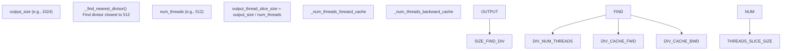
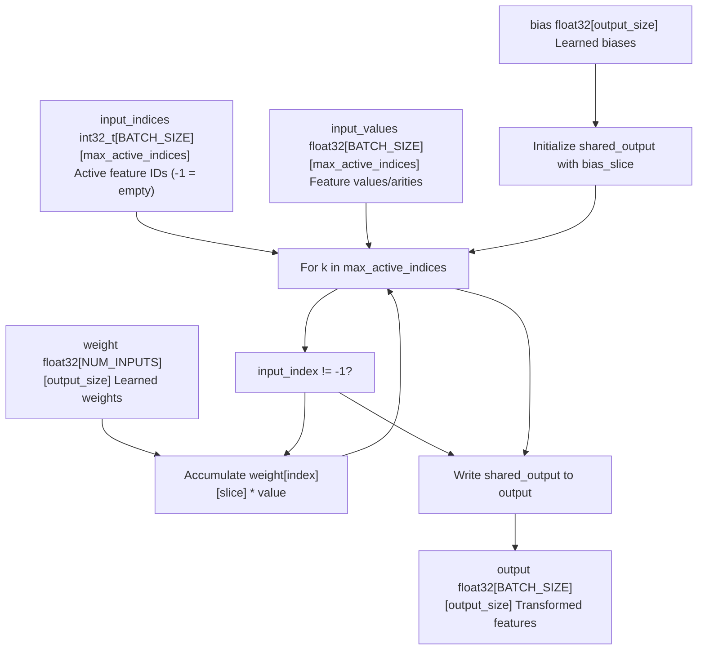
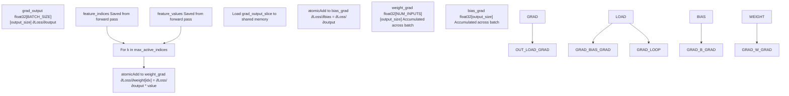
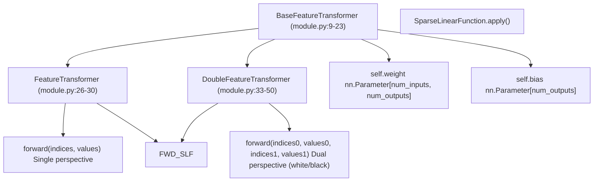
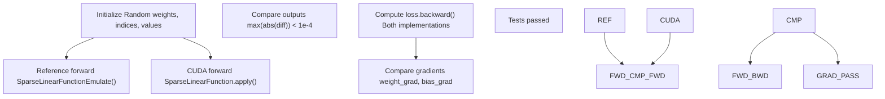

# Custom CUDA Kernels

-   [model/modules/\_\_init\_\_.py](https://github.com/Chesszyh/nnue-pytorch/blob/024b2064/model/modules/__init__.py)
-   [model/modules/feature\_transformer/\_\_init\_\_.py](https://github.com/Chesszyh/nnue-pytorch/blob/024b2064/model/modules/feature_transformer/__init__.py)
-   [model/modules/feature\_transformer/functions.py](https://github.com/Chesszyh/nnue-pytorch/blob/024b2064/model/modules/feature_transformer/functions.py)
-   [model/modules/feature\_transformer/kernel.py](https://github.com/Chesszyh/nnue-pytorch/blob/024b2064/model/modules/feature_transformer/kernel.py)
-   [model/modules/feature\_transformer/module.py](https://github.com/Chesszyh/nnue-pytorch/blob/024b2064/model/modules/feature_transformer/module.py)
-   [tests/test\_feature\_transformer.py](https://github.com/Chesszyh/nnue-pytorch/blob/024b2064/tests/test_feature_transformer.py)

This document describes the custom CUDA kernel implementations used for sparse linear operations in the feature transformer. These kernels are critical for performance, as they exploit the sparsity of NNUE input features to achieve efficient forward and backward passes during training.

For information about the feature transformer architecture that uses these kernels, see [Feature Transformer](#4.3). For testing infrastructure, see [Testing and Validation](#8.2).

## Purpose and Scope

The NNUE architecture processes highly sparse inputs where only a small subset of features (typically 30-64 out of 40,000+) are active for any given chess position. Standard dense matrix operations are inefficient for this scenario. The custom CUDA kernels implement optimized sparse linear operations that:

-   Process only active feature indices, avoiding computation on zeros
-   Use shared memory for intermediate results
-   Employ thread-level parallelism across output dimensions
-   Support efficient gradient computation via custom backward pass

These kernels are used exclusively in the feature transformer layer ([model/modules/feature\_transformer/module.py26-50](https://github.com/Chesszyh/nnue-pytorch/blob/024b2064/model/modules/feature_transformer/module.py#L26-L50)) and are central to the training pipeline's performance.

## System Architecture

The custom CUDA kernel system consists of three main components: kernel generation and compilation, PyTorch integration via autograd functions, and the feature transformer modules that expose the functionality.

**Diagram: CUDA Kernel System Architecture**

```mermaid
flowchart TD
    FT["FeatureTransformer (module.py)"]
    DFT["DoubleFeatureTransformer (module.py)"]
    FT_FORWARD["forward() feature_indices, feature_values"]
    SLF["SparseLinearFunction (functions.py)"]
    SLF_FWD["forward() Validates inputs, calls CUDA"]
    SLF_BWD["backward() Computes weight/bias gradients"]
    MAKE_FWD["make_sparse_input_linear_forward_kernel() (kernel.py)"]
    MAKE_BWD["make_sparse_input_linear_backward_kernel() (kernel.py)"]
    FWD_CACHE["_sparse_input_linear_forward_kernel_cache Dict[(max_active, out_size, threads)]"]
    BWD_CACHE["_sparse_input_linear_backward_kernel_cache Dict[(max_active, out_size, threads)]"]
    RAW_KERNEL["cp.RawKernel() CUDA C++ source code"]
    COMPILE["kernel.compile() PTX/CUBIN generation"]
    FWD_KERNEL["sparse_input_linear_forward global kernel"]
    BWD_KERNEL["sparse_input_linear_backward global kernel"]
    SHARED_MEM["shared float[output_size] Per-block scratch space"]
    ATOMIC["atomicAdd() Gradient accumulation"]

    FT --> SLF
    DFT --> SLF
    FT --> FORWARD_SLF_FWD
    SLF --> FWD_MAKE_FWD
    SLF --> BWD_MAKE_BWD
    MAKE --> FWD_FWD_CACHE
    MAKE --> BWD_BWD_CACHE
    FWD --> CACHE_RAW_KERNEL
    BWD --> CACHE_RAW_KERNEL
    RAW --> KERNEL_COMPILE
    COMPILE --> FWD_CACHE
    COMPILE --> BWD_CACHE
    FWD --> CACHE_FWD_KERNEL
    BWD --> CACHE_BWD_KERNEL
    FWD --> KERNEL_SHARED_MEM
    BWD --> KERNEL_SHARED_MEM
    BWD --> KERNEL_ATOMIC
```


Sources: [model/modules/feature\_transformer/kernel.py1-312](https://github.com/Chesszyh/nnue-pytorch/blob/024b2064/model/modules/feature_transformer/kernel.py#L1-L312) [model/modules/feature\_transformer/functions.py1-105](https://github.com/Chesszyh/nnue-pytorch/blob/024b2064/model/modules/feature_transformer/functions.py#L1-L105) [model/modules/feature\_transformer/module.py1-51](https://github.com/Chesszyh/nnue-pytorch/blob/024b2064/model/modules/feature_transformer/module.py#L1-L51)

## Kernel Compilation and Caching

The CUDA kernels are generated dynamically at runtime using CuPy's `RawKernel` interface. This approach allows kernel specialization based on problem dimensions, which eliminates unnecessary branching and enables aggressive compiler optimizations.

### Kernel Factory Functions

Two factory functions generate specialized kernels:

| Factory Function | Kernel Purpose | Cache Dictionary | Key Dimensions |
| --- | --- | --- | --- |
| `make_sparse_input_linear_forward_kernel()` | Forward pass computation | `_sparse_input_linear_forward_kernel_cache` | `(max_active_indices, output_size, num_threads)` |
| `make_sparse_input_linear_backward_kernel()` | Gradient computation | `_sparse_input_linear_backward_kernel_cache` | `(max_active_indices, output_size, num_threads)` |

Each factory function:

1.  Computes optimal thread count for the given `output_size`
2.  Checks the cache for an existing compiled kernel
3.  On cache miss, generates CUDA C++ source code with template substitution
4.  Compiles the kernel via `cp.RawKernel()`
5.  Wraps the kernel with thread configuration
6.  Stores the result in the cache

Sources: [model/modules/feature\_transformer/kernel.py50-173](https://github.com/Chesszyh/nnue-pytorch/blob/024b2064/model/modules/feature_transformer/kernel.py#L50-L173) [model/modules/feature\_transformer/kernel.py179-311](https://github.com/Chesszyh/nnue-pytorch/blob/024b2064/model/modules/feature_transformer/kernel.py#L179-L311)

### Thread Count Optimization

The number of CUDA threads per block is determined by finding the nearest divisor of `output_size` to the optimal thread count (512):


This ensures that:

-   Each thread processes an equal slice of outputs (`output_thread_slice_size`)
-   Thread count maximizes GPU occupancy (target: 512 threads/block)
-   All outputs are covered exactly once per position

Sources: [model/modules/feature\_transformer/kernel.py5-37](https://github.com/Chesszyh/nnue-pytorch/blob/024b2064/model/modules/feature_transformer/kernel.py#L5-L37)

## Forward Pass Kernel

The forward pass kernel implements the sparse linear transformation: `output = weight[active_indices] @ values + bias`.

### Kernel Signature and Parameters

**Diagram: Forward Kernel Data Flow**


Sources: [model/modules/feature\_transformer/kernel.py69-173](https://github.com/Chesszyh/nnue-pytorch/blob/024b2064/model/modules/feature_transformer/kernel.py#L69-L173)

### Thread Organization and Shared Memory

The forward kernel uses a 1D grid of blocks where:

-   **Grid dimension**: `(BATCH_SIZE,)` - one block per batch position
-   **Block dimension**: `(num_threads,)` - typically 512 threads
-   **Shared memory**: `float[output_size]` - scratch space for accumulation

Each thread is responsible for computing `output_thread_slice_size` consecutive outputs. The algorithm:

1.  **Initialization** ([kernel.py134-138](https://github.com/Chesszyh/nnue-pytorch/blob/024b2064/kernel.py#L134-L138)):

    -   Each thread copies its slice of the bias into shared memory

    ```
    for (uint32_t s = 0; s < output_thread_slice_size; ++s) {    shared_output_slice[s] = bias_slice[s];}
    ```

2.  **Accumulation** ([kernel.py140-153](https://github.com/Chesszyh/nnue-pytorch/blob/024b2064/kernel.py#L140-L153)):

    -   Iterate over active feature indices
    -   For each valid index (not -1), load the corresponding weight row
    -   Multiply by feature value and accumulate to shared memory
    -   Early exit on first -1 index (rest are guaranteed empty)
3.  **Output** ([kernel.py155-159](https://github.com/Chesszyh/nnue-pytorch/blob/024b2064/kernel.py#L155-L159)):

    -   Copy shared memory results to global output

Sources: [model/modules/feature\_transformer/kernel.py114-161](https://github.com/Chesszyh/nnue-pytorch/blob/024b2064/model/modules/feature_transformer/kernel.py#L114-L161)

### Input Validation

The `SparseLinearFunction.forward()` method performs extensive validation before kernel launch:

| Validation Check | Assertion | Purpose |
| --- | --- | --- |
| Tensor shapes | `len(feature_indices.shape) == 2` | Ensure 2D index matrix |
| Shape consistency | `feature_indices.shape == feature_values.shape` | Indices/values must align |
| Data types | `feature_indices.dtype == torch.int32` | Kernel expects int32 indices |
| Device placement | `feature_indices.is_cuda` | All tensors on GPU |
| Memory layout | `feature_indices.is_contiguous()` | Kernel assumes contiguous memory |

Sources: [model/modules/feature\_transformer/functions.py15-40](https://github.com/Chesszyh/nnue-pytorch/blob/024b2064/model/modules/feature_transformer/functions.py#L15-L40)

## Backward Pass Kernel

The backward pass kernel computes gradients with respect to weights and biases given the output gradient.

### Gradient Computation Algorithm

**Diagram: Backward Kernel Gradient Flow**


Sources: [model/modules/feature\_transformer/kernel.py197-311](https://github.com/Chesszyh/nnue-pytorch/blob/024b2064/model/modules/feature_transformer/kernel.py#L197-L311)

### Atomic Operations for Gradient Accumulation

Since multiple threads and blocks may update the same gradient locations (different batch positions can share active features), the backward kernel uses atomic operations:

-   **Bias gradient** ([kernel.py270-278](https://github.com/Chesszyh/nnue-pytorch/blob/024b2064/kernel.py#L270-L278)):

    ```
    for (uint32_t s = 0; s < output_thread_slice_size; ++s) {    const float sog = shared_output_grad_slice[s];    if (sog != 0.0f) {        atomicAdd(&bias_grad_slice[s], sog);    }}
    ```

-   **Weight gradient** ([kernel.py286-295](https://github.com/Chesszyh/nnue-pytorch/blob/024b2064/kernel.py#L286-L295)):

    ```
    for (int s = 0; s < output_thread_slice_size; ++s) {    const float sog = shared_output_grad_slice[s];    if (sog != 0.0f) {        atomicAdd(&weight_grad_slice[s], sog * input_value);    }}
    ```


The zero-check optimization (`sog != 0.0f`) reduces atomic contention by skipping updates for zero gradients, which are common in neural network training.

Sources: [model/modules/feature\_transformer/kernel.py244-298](https://github.com/Chesszyh/nnue-pytorch/blob/024b2064/model/modules/feature_transformer/kernel.py#L244-L298)

## PyTorch Integration

The `SparseLinearFunction` class bridges PyTorch's autograd system with the custom CUDA kernels.

### Autograd Function Interface

**Diagram: SparseLinearFunction Integration**

```mermaid
flowchart TD
    INPUTS["Inputs: feature_indices (no grad) feature_values (no grad) weight (requires_grad) bias (requires_grad)"]
    FWD_CALL["SparseLinearFunction.apply()"]
    OUTPUT["output requires_grad=True"]
    BACKWARD["Automatic backward() triggered by loss.backward()"]
    VALIDATE["Validate tensors Shape, dtype, device, contiguity"]
    ALLOC_OUT["Allocate output tensor torch.empty()"]
    GET_KERNEL["make_sparse_input_linear_forward_kernel()"]
    LAUNCH_FWD["kernel(grid=(batch_size,), args=(…))"]
    SAVE["ctx.save_for_backward() Stores input tensors"]
    ALLOC_GRAD["Allocate gradient tensors torch.zeros()"]
    GET_BKWD["make_sparse_input_linear_backward_kernel()"]
    LAUNCH_BKWD["kernel(grid=(batch_size,), args=(…))"]
    RETURN_GRAD["Return (None, None, weight_grad, bias_grad)"]

    INPUTS --> FWD_CALL
    FWD --> CALL_VALIDATE
    VALIDATE --> ALLOC_OUT
    ALLOC --> OUT_GET_KERNEL
    GET --> KERNEL_LAUNCH_FWD
    LAUNCH --> FWD_OUTPUT
    LAUNCH --> FWD_SAVE
    OUTPUT --> BACKWARD
    BACKWARD --> ALLOC_GRAD
    ALLOC --> GRAD_GET_BKWD
    GET --> BKWD_LAUNCH_BKWD
    LAUNCH --> BKWD_RETURN_GRAD
    SAVE --> LAUNCH_BKWD
```


Sources: [model/modules/feature\_transformer/functions.py10-104](https://github.com/Chesszyh/nnue-pytorch/blob/024b2064/model/modules/feature_transformer/functions.py#L10-L104)

### Tensor Lifecycle

1.  **Forward pass** ([functions.py12-69](https://github.com/Chesszyh/nnue-pytorch/blob/024b2064/functions.py#L12-L69)):

    -   Validates all input tensors (shape, dtype, device, contiguity)
    -   Saves tensors for backward pass via `ctx.save_for_backward()`
    -   Allocates output tensor with `requires_grad=True`
    -   Launches forward kernel with grid size `(batch_size,)`
2.  **Backward pass** ([functions.py72-104](https://github.com/Chesszyh/nnue-pytorch/blob/024b2064/functions.py#L72-L104)):

    -   Asserts that gradients are not needed for indices/values (lines 73-74)
    -   Makes grad\_output contiguous if needed (line 76)
    -   Retrieves saved tensors from context (line 78)
    -   Zero-initializes gradient tensors (lines 85-88)
    -   Launches backward kernel
    -   Returns `(None, None, weight_grad, bias_grad)` matching forward signature

Sources: [model/modules/feature\_transformer/functions.py10-104](https://github.com/Chesszyh/nnue-pytorch/blob/024b2064/model/modules/feature_transformer/functions.py#L10-L104)

## Feature Transformer Modules

The kernels are exposed through two module classes that manage weight/bias parameters and forward calls.

### Module Hierarchy


Sources: [model/modules/feature\_transformer/module.py1-51](https://github.com/Chesszyh/nnue-pytorch/blob/024b2064/model/modules/feature_transformer/module.py#L1-L51)

### Parameter Initialization

The `BaseFeatureTransformer` initializes weights and biases with uniform distribution scaled by $\\sigma = \\sqrt{1/\\text{num\_inputs}}$:

```
sigma = math.sqrt(1 / num_inputs)self.weight = nn.Parameter(    torch.rand(num_inputs, num_outputs, dtype=torch.float32) * (2 * sigma) - sigma)self.bias = nn.Parameter(    torch.rand(num_outputs, dtype=torch.float32) * (2 * sigma) - sigma)
```
This initialization scheme provides appropriate variance for the feature transformer's role in the NNUE architecture.

Sources: [model/modules/feature\_transformer/module.py15-23](https://github.com/Chesszyh/nnue-pytorch/blob/024b2064/model/modules/feature_transformer/module.py#L15-L23)

## Performance Characteristics

The custom CUDA kernels provide significant performance advantages over dense operations or naive sparse implementations.

### Sparsity Exploitation

For typical NNUE inputs with ~32 active features out of 40,960 total:

-   **Sparsity ratio**: 32/40,960 ≈ 0.078%
-   **Computation reduction**: ~1,280x fewer operations than dense matrix multiply
-   **Memory access pattern**: Sequential reads of weight rows (cache-friendly)

### Shared Memory Benefits

Using shared memory for intermediate accumulation:

-   Avoids repeated writes to slower global memory
-   Enables coalesced reads of bias and weights
-   Reduces memory bandwidth pressure during accumulation

### Benchmark Results

The test suite includes a benchmark ([test\_feature\_transformer.py80-122](https://github.com/Chesszyh/nnue-pytorch/blob/024b2064/test_feature_transformer.py#L80-L122)):

| Configuration | Value |
| --- | --- |
| Input size | 40,960 features |
| Batch size | 8,192 positions |
| Output size (L1) | 264 neurons |
| Active features | 64 max (48 avg) |
| Iterations | 64 |

This configuration simulates realistic training conditions and measures positions processed per second.

Sources: [tests/test\_feature\_transformer.py80-122](https://github.com/Chesszyh/nnue-pytorch/blob/024b2064/tests/test_feature_transformer.py#L80-L122)

## Testing and Validation

The test suite validates kernel correctness by comparing against a reference implementation.

### Reference Implementation

The `SparseLinearFunctionEmulate()` function provides a CPU-based reference:

```
def SparseLinearFunctionEmulate(input_indices, input_values, weight, bias):    # Convert sparse inputs to dense representation    inputs = torch.zeros(batch_size, num_inputs, dtype=torch.float32, device=weight.device)    for i in range(batch_size):        for j in range(max_active_indices):            feature = input_indices[i, j]            value = input_values[i, j]            inputs[i, feature] += value        # Standard dense matrix multiplication    return torch.mm(inputs, weight) + bias
```
Sources: [tests/test\_feature\_transformer.py15-33](https://github.com/Chesszyh/nnue-pytorch/blob/024b2064/tests/test_feature_transformer.py#L15-L33)

### Test Coverage

The `test()` function validates:

1.  **Forward pass correctness**:

    -   Compares CUDA kernel output against reference implementation
    -   Maximum allowed error: 1e-4 (floating-point tolerance)
2.  **Backward pass correctness**:

    -   Computes gradients through both implementations
    -   Compares weight and bias gradients
    -   Verifies gradient accumulation is correct
3.  **Dual perspective handling**:

    -   Tests `DoubleFeatureTransformer` with two sets of indices/values
    -   Ensures white/black perspectives are processed independently

Sources: [tests/test\_feature\_transformer.py36-77](https://github.com/Chesszyh/nnue-pytorch/blob/024b2064/tests/test_feature_transformer.py#L36-L77)

### Test Execution Flow


Sources: [tests/test\_feature\_transformer.py36-77](https://github.com/Chesszyh/nnue-pytorch/blob/024b2064/tests/test_feature_transformer.py#L36-L77)

## Kernel Limitations and Design Constraints

### Fixed Thread Configuration

The kernels require `output_size` to be divisible by the chosen thread count. The `_find_nearest_divisor()` function ensures this by finding the divisor of `output_size` closest to 512. This means:

-   Output sizes that are not multiples of common thread counts may use suboptimal parallelism
-   Odd or prime output sizes will force smaller thread counts

### Memory Requirements

Each thread block allocates `sizeof(float) * output_size` bytes of shared memory. For large output sizes (e.g., 2048), this requires 8KB of shared memory per block, which may limit occupancy on older GPU architectures.

### Index Format Constraints

The kernels assume:

-   Indices are sorted (or at least, -1 sentinels appear at the end)
-   Once a -1 index is encountered, all subsequent indices in that position are -1
-   This enables early exit but requires careful data loading in the C++ data loader

Sources: [model/modules/feature\_transformer/kernel.py5-37](https://github.com/Chesszyh/nnue-pytorch/blob/024b2064/model/modules/feature_transformer/kernel.py#L5-L37) [model/modules/feature\_transformer/kernel.py140-153](https://github.com/Chesszyh/nnue-pytorch/blob/024b2064/model/modules/feature_transformer/kernel.py#L140-L153)

## Integration with Training Pipeline

The CUDA kernels are invoked during every training step:

1.  **Data loading**: C++ data loader produces sparse indices/values ([data\_loader/training\_data\_loader.cpp](https://github.com/Chesszyh/nnue-pytorch/blob/024b2064/data_loader/training_data_loader.cpp))
2.  **Forward pass**: Feature transformer applies sparse linear operation
3.  **Network propagation**: Outputs flow through layer stacks
4.  **Loss computation**: WDL loss calculated
5.  **Backward pass**: Gradients flow back through layer stacks
6.  **Sparse backward**: Custom CUDA kernel computes feature transformer gradients
7.  **Optimizer step**: Ranger21 updates weights using computed gradients

The kernels handle the most computationally intensive layer (feature transformer has 40K+ inputs → 256-2048 outputs), making them critical to overall training throughput.

Sources: [model/modules/feature\_transformer/functions.py1-105](https://github.com/Chesszyh/nnue-pytorch/blob/024b2064/model/modules/feature_transformer/functions.py#L1-L105) [tests/test\_feature\_transformer.py101-121](https://github.com/Chesszyh/nnue-pytorch/blob/024b2064/tests/test_feature_transformer.py#L101-L121)
