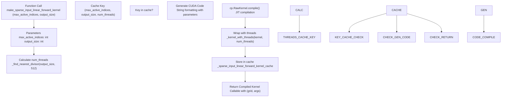
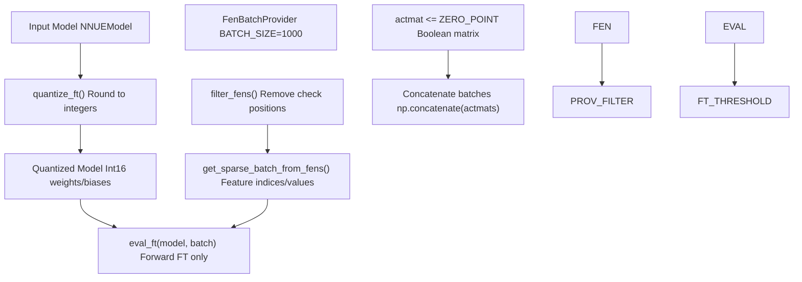

# Testing and Validation

-   [cross\_check\_eval.py](https://github.com/Chesszyh/nnue-pytorch/blob/024b2064/cross_check_eval.py)
-   [ftperm.py](https://github.com/Chesszyh/nnue-pytorch/blob/024b2064/ftperm.py)
-   [model/modules/\_\_init\_\_.py](https://github.com/Chesszyh/nnue-pytorch/blob/024b2064/model/modules/__init__.py)
-   [model/modules/feature\_transformer/\_\_init\_\_.py](https://github.com/Chesszyh/nnue-pytorch/blob/024b2064/model/modules/feature_transformer/__init__.py)
-   [model/modules/feature\_transformer/functions.py](https://github.com/Chesszyh/nnue-pytorch/blob/024b2064/model/modules/feature_transformer/functions.py)
-   [model/modules/feature\_transformer/kernel.py](https://github.com/Chesszyh/nnue-pytorch/blob/024b2064/model/modules/feature_transformer/kernel.py)
-   [model/modules/feature\_transformer/module.py](https://github.com/Chesszyh/nnue-pytorch/blob/024b2064/model/modules/feature_transformer/module.py)
-   [tests/test\_feature\_transformer.py](https://github.com/Chesszyh/nnue-pytorch/blob/024b2064/tests/test_feature_transformer.py)

This page documents the testing and validation infrastructure used to ensure correctness of the NNUE training system. The system includes unit tests for custom CUDA kernels, validation tools for comparing model outputs against reference implementations, and analysis tools for evaluating model quality.

**Scope**: This page covers testing methodologies, validation scripts, and quality assurance tools. For information about training evaluation metrics and game-based testing, see [Evaluation and Testing](#7). For information about the CUDA kernel implementations themselves, see [Custom CUDA Kernels](#8.1).

## Testing Architecture Overview

The testing infrastructure operates at multiple levels to ensure correctness and quality:

```mermaid
flowchart TD
    UNIT_TEST["tests/test_feature_transformer.py Unit tests for CUDA kernels"]
    REF_IMPL["SparseLinearFunctionEmulate CPU reference implementation"]
    CUDA_IMPL["SparseLinearFunction Custom CUDA kernel"]
    CROSS_CHECK["cross_check_eval.py Model vs Stockfish comparison"]
    ACTMAT_EVAL["ftperm.py::eval_perm_impl Activation matrix analysis"]
    FT_MODULE["DoubleFeatureTransformer model/modules/feature_transformer/"]
    FT_KERNEL["CUDA Kernels kernel.py"]
    NNUE_MODEL["NNUEModel Complete network"]
    CORRECTNESS["Correctness Max error < 1e-4"]
    CORRELATION["Correlation Relative error analysis"]
    PERFORMANCE["Performance pos/s throughput"]

    UNIT --> TEST_REF_IMPL
    UNIT --> TEST_CUDA_IMPL
    REF --> IMPL_CORRECTNESS
    CUDA --> IMPL_CORRECTNESS
    CROSS --> CHECK_NNUE_MODEL
    CROSS --> CHECK_CORRELATION
    ACTMAT --> EVAL_FT_MODULE
    ACTMAT --> EVAL_CORRECTNESS
    UNIT --> TEST_FT_KERNEL
    FT --> KERNEL_FT_MODULE
    CROSS --> CHECK_NNUE_MODEL
    UNIT --> TEST_PERFORMANCE
```


**Sources**: [tests/test\_feature\_transformer.py1-127](https://github.com/Chesszyh/nnue-pytorch/blob/024b2064/tests/test_feature_transformer.py#L1-L127) [cross\_check\_eval.py1-222](https://github.com/Chesszyh/nnue-pytorch/blob/024b2064/cross_check_eval.py#L1-L222) [ftperm.py608-677](https://github.com/Chesszyh/nnue-pytorch/blob/024b2064/ftperm.py#L608-L677)

## Unit Testing: CUDA Kernel Correctness

The primary unit test suite validates the custom CUDA kernels used for sparse linear operations in the feature transformer.

### Test Structure

The test suite in `test_feature_transformer.py` implements two main test functions:

| Function | Purpose | Validation Method |
| --- | --- | --- |
| `test()` | Correctness validation | Compare CUDA output against CPU reference implementation |
| `bench()` | Performance benchmarking | Measure throughput (positions/second) |

### Reference Implementation

The test uses a CPU-based reference implementation to validate CUDA kernel correctness:

```mermaid
flowchart TD
    INPUT_DATA["Random Test Data indices, values, weights, bias"]
    EMU["SparseLinearFunctionEmulate Dense matrix operations"]
    CPU_FWD["Forward Pass (CPU) torch.mm + bias"]
    CPU_BWD["Backward Pass (CPU) PyTorch autograd"]
    SPARSE_FN["SparseLinearFunction.apply Custom CUDA kernel"]
    CUDA_FWD["Forward Kernel sparse_input_linear_forward"]
    CUDA_BWD["Backward Kernel sparse_input_linear_backward"]
    COMPARE_FWD["Compare Outputs max(abs(diff)) < 1e-4"]
    COMPARE_BWD["Compare Gradients weight_grad, bias_grad"]

    INPUT --> DATA_EMU
    INPUT --> DATA_SPARSE_FN
    EMU --> CPU_FWD
    CPU --> FWD_CPU_BWD
    SPARSE --> FN_CUDA_FWD
    CUDA --> FWD_CUDA_BWD
    CPU --> FWD_COMPARE_FWD
    CUDA --> FWD_COMPARE_FWD
    CPU --> BWD_COMPARE_BWD
    CUDA --> BWD_COMPARE_BWD
```


**Sources**: [tests/test\_feature\_transformer.py15-78](https://github.com/Chesszyh/nnue-pytorch/blob/024b2064/tests/test_feature_transformer.py#L15-L78)

### Forward Pass Validation

The reference implementation `SparseLinearFunctionEmulate` performs a standard dense matrix multiplication:

**Key validation steps** [tests/test\_feature\_transformer.py58-72](https://github.com/Chesszyh/nnue-pytorch/blob/024b2064/tests/test_feature_transformer.py#L58-L72):

1.  Generate identical random inputs (indices, values, weights, biases)
2.  Execute CPU reference: `SparseLinearFunctionEmulate(indices, values, weight, bias)`
3.  Execute CUDA implementation: `SparseLinearFunction.apply(indices.cuda(), values.cuda(), weight.cuda(), bias.cuda())`
4.  Assert `max(abs(output_cpu - output_cuda)) < MAX_ERROR` where `MAX_ERROR = 1e-4`

**Sparse to dense conversion** [tests/test\_feature\_transformer.py21-33](https://github.com/Chesszyh/nnue-pytorch/blob/024b2064/tests/test_feature_transformer.py#L21-L33):

```
# The emulator reconstructs a dense input matrix from sparse representationinputs = torch.zeros(batch_size, num_inputs)for i in range(batch_size):    for j in range(max_active_indices):        feature = input_indices[i, j]        value = input_values[i, j]        inputs[i, feature] += value
```
### Backward Pass Validation

The test validates gradient computation by:

1.  Computing loss: `(output0 - output1).sum()`
2.  Calling `.backward()` on both CPU and CUDA paths
3.  Comparing weight gradients: `max(abs(weight0.grad - weight1.grad)) < MAX_ERROR`
4.  Comparing bias gradients: `max(abs(bias0.grad - bias1.grad)) < MAX_ERROR`

**Sources**: [tests/test\_feature\_transformer.py73-76](https://github.com/Chesszyh/nnue-pytorch/blob/024b2064/tests/test_feature_transformer.py#L73-L76)

### Performance Benchmarking

The `bench()` function measures throughput with realistic parameters:

| Parameter | Value | Description |
| --- | --- | --- |
| `INPUT_SIZE` | 40,960 | Total number of input features |
| `BATCH_SIZE` | 8,192 | Positions per batch |
| `STRIDE` | 264 | Output dimension |
| `MAX_ACTIVE_FEATURES` | 64 | Maximum active inputs per position |
| `ITERS` | 64 | Number of forward+backward iterations |

The benchmark reports throughput in **positions/second** by measuring the total time for all iterations including both forward and backward passes [tests/test\_feature\_transformer.py107-121](https://github.com/Chesszyh/nnue-pytorch/blob/024b2064/tests/test_feature_transformer.py#L107-L121)

**Sources**: [tests/test\_feature\_transformer.py80-122](https://github.com/Chesszyh/nnue-pytorch/blob/024b2064/tests/test_feature_transformer.py#L80-L122)

## CUDA Kernel Implementation Validation

The custom CUDA kernels are compiled at runtime with extensive parameter validation.

### Kernel Compilation and Caching


**Sources**: [model/modules/feature\_transformer/kernel.py47-173](https://github.com/Chesszyh/nnue-pytorch/blob/024b2064/model/modules/feature_transformer/kernel.py#L47-L173)

### Thread Allocation Strategy

The kernel uses a heuristic to determine optimal thread count [model/modules/feature\_transformer/kernel.py5-24](https://github.com/Chesszyh/nnue-pytorch/blob/024b2064/model/modules/feature_transformer/kernel.py#L5-L24):

1.  Target: 512 threads (optimal for most GPUs)
2.  Find nearest divisor of `output_size` to 512
3.  Each thread processes `output_size / num_threads` elements

This ensures:

-   All threads have equal work (`output_size % num_threads == 0`)
-   Thread count is close to hardware optimal
-   Memory accesses are coalesced

### Runtime Assertions

The forward pass includes extensive validation [model/modules/feature\_transformer/functions.py15-40](https://github.com/Chesszyh/nnue-pytorch/blob/024b2064/model/modules/feature_transformer/functions.py#L15-L40):

| Assertion | Purpose |
| --- | --- |
| `feature_indices.dtype == torch.int32` | Correct index type |
| `feature_values.dtype == torch.float32` | Correct value type |
| `feature_indices.is_cuda` | Data on GPU |
| `feature_indices.is_contiguous()` | Memory layout |
| `feature_values.device == weight.device` | Same device |

**Sources**: [model/modules/feature\_transformer/functions.py10-69](https://github.com/Chesszyh/nnue-pytorch/blob/024b2064/model/modules/feature_transformer/functions.py#L10-L69)

## Model Validation Against Stockfish

The `cross_check_eval.py` script validates trained models by comparing their evaluations against Stockfish's built-in NNUE evaluation.

### Validation Workflow

```mermaid
flowchart TD
    NET[".nnue file Trained network"]
    CKPT[".ckpt file Alternative: checkpoint"]
    DATA["Training data .bin or .binpack"]
    SF["Stockfish binary Chess engine"]
    FEN_PROVIDER["FenBatchProvider data_loader.FenBatchProvider"]
    FILTER["filter_fens() Remove check positions"]
    POSITIONS["Valid FEN strings Not in check"]
    LOAD_MODEL["Load Model NNUEReader or NNUE.load_from_checkpoint"]
    SPARSE_BATCH["get_sparse_batch_from_fens() Convert to sparse tensors"]
    MODEL_FWD["model.forward() Python evaluation"]
    MODEL_EVALS["Model evaluations Scaled by 600.0"]
    ENGINE_PROC["subprocess.Popen Stockfish process"]
    UCI_CMD["UCI commands position fen, eval"]
    REGEX["Regex extraction re_nnue_eval pattern"]
    ENGINE_EVALS["Engine evaluations int(float * 208)"]
    STATS["compute_correlation() Error metrics"]
    REPORT["Statistics Report Min/Max/Avg/Correlation"]

    NET --> LOAD_MODEL
    CKPT --> LOAD_MODEL
    DATA --> FEN_PROVIDER
    FEN --> PROVIDER_FILTER
    FILTER --> POSITIONS
    LOAD --> MODEL_MODEL_FWD
    POSITIONS --> SPARSE_BATCH
    SPARSE --> BATCH_MODEL_FWD
    MODEL --> FWD_MODEL_EVALS
    SF --> ENGINE_PROC
    POSITIONS --> UCI_CMD
    ENGINE --> PROC_UCI_CMD
    UCI --> CMD_REGEX
    REGEX --> ENGINE_EVALS
    MODEL --> EVALS_STATS
    ENGINE --> EVALS_STATS
    STATS --> REPORT
```


**Sources**: [cross\_check\_eval.py1-222](https://github.com/Chesszyh/nnue-pytorch/blob/024b2064/cross_check_eval.py#L1-L222)

### Evaluation Process

**Model evaluation** [cross\_check\_eval.py42-73](https://github.com/Chesszyh/nnue-pytorch/blob/024b2064/cross_check_eval.py#L42-L73):

1.  Load model from `.nnue` or `.ckpt` file
2.  For each position batch:
    -   Convert FENs to sparse batch representation
    -   Forward pass through model
    -   Scale output by 600.0 (centipawn scaling)
    -   Flip sign for black-to-move positions

**Engine evaluation** [cross\_check\_eval.py136-151](https://github.com/Chesszyh/nnue-pytorch/blob/024b2064/cross_check_eval.py#L136-L151):

1.  Start Stockfish subprocess
2.  Send UCI commands:

    ```
    uci
    setoption name EvalFile value <net_path>
    position fen <fen>
    eval
    ```

3.  Parse NNUE evaluation from output using regex: `r"NNUE evaluation:?\s*?([-+]?\d*?\.\d*)"`
4.  Scale to integer centipawns: `int(float(v) * 208)`

### Correlation Metrics

The validation computes comprehensive error statistics [cross\_check\_eval.py79-133](https://github.com/Chesszyh/nnue-pytorch/blob/024b2064/cross_check_eval.py#L79-L133):

| Metric | Formula | Purpose |
| --- | --- | --- |
| Min/Max eval | `min(evals)`, `max(evals)` | Range check |
| Average eval | `sum(evals) / len(evals)` | Bias detection |
| Average absolute eval | `sum(abs(v) for v in evals) / len(evals)` | Scale check |
| Relative model error | `sum(abs(model-engine)/(abs(engine)+0.001)) / N` | Model accuracy |
| Relative engine error | `sum(abs(model-engine)/(abs(model)+0.001)) / N` | Symmetry check |
| Min/Max difference | `min/max(abs(model-engine))` | Outlier detection |

**Note**: A small epsilon (0.001) is added to denominators to avoid division by zero for near-zero evaluations.

**Sources**: [cross\_check\_eval.py79-133](https://github.com/Chesszyh/nnue-pytorch/blob/024b2064/cross_check_eval.py#L79-L133)

### Position Filtering

Both validation scripts filter out positions where a king is in check [cross\_check\_eval.py154-161](https://github.com/Chesszyh/nnue-pytorch/blob/024b2064/cross_check_eval.py#L154-L161):

```
def filter_fens(fens):    filtered_fens = []    for fen in fens:        board = chess.Board(fen=fen)        if not board.is_check():            filtered_fens.append(fen)    return filtered_fens
```
**Reason**: Stockfish's `eval` command cannot evaluate positions where a king is in check, as these positions are illegal to evaluate (they should have been captured in the previous move).

**Sources**: [cross\_check\_eval.py154-161](https://github.com/Chesszyh/nnue-pytorch/blob/024b2064/cross_check_eval.py#L154-L161) [ftperm.py447-454](https://github.com/Chesszyh/nnue-pytorch/blob/024b2064/ftperm.py#L447-L454)

## Activation Matrix Testing

The `ftperm.py` script includes testing functionality for analyzing feature transformer activations and validating permutations.

### Activation Gathering

The `gather_impl` function collects activation data for validation [ftperm.py550-582](https://github.com/Chesszyh/nnue-pytorch/blob/024b2064/ftperm.py#L550-L582):


**Key parameters** [ftperm.py550-552](https://github.com/Chesszyh/nnue-pytorch/blob/024b2064/ftperm.py#L550-L552):

-   `ZERO_POINT = 0.0`: Threshold for considering activations as zero
-   `BATCH_SIZE = 1000`: Positions per batch
-   Returns: Boolean matrix `(N, L1)` where `True` indicates zero activation

**Sources**: [ftperm.py550-582](https://github.com/Chesszyh/nnue-pytorch/blob/024b2064/ftperm.py#L550-L582)

### Permutation Evaluation

The `eval_perm_impl` function measures the quality of a permutation by counting 4-neuron zero blocks [ftperm.py608-626](https://github.com/Chesszyh/nnue-pytorch/blob/024b2064/ftperm.py#L608-L626):

**Evaluation metric** [ftperm.py608-625](https://github.com/Chesszyh/nnue-pytorch/blob/024b2064/ftperm.py#L608-L625):

1.  Reshape activation matrix: `(N*2, L1/2)` (split white/black perspectives)
2.  Group into 4-neuron blocks: `(N*2, L1/8, 4)`
3.  Check if all 4 neurons are zero: `np.all(actmat, axis=2)`
4.  Compute percentage: `count_nonzero(all_zero_blocks) / total_blocks * 100`

**Comparison output**:

```
Combined zeros in base matrix: X.XXXXXX%
Combined zeros in perm matrix: Y.YYYYYY%
```
A higher percentage indicates better permutation quality, as it means more 4-neuron blocks can be skipped during SIMD inference.

**Sources**: [ftperm.py608-626](https://github.com/Chesszyh/nnue-pytorch/blob/024b2064/ftperm.py#L608-L626)

### Forward Pass Testing

The `forward_ft` function implements a reference forward pass for testing [ftperm.py466-489](https://github.com/Chesszyh/nnue-pytorch/blob/024b2064/ftperm.py#L466-L489):

**Implementation details**:

1.  Feature transformer forward pass
2.  Split into L1-dimensional vectors: `w, b = torch.split(wp, model.L1, dim=1)`
3.  Perspective combination: `us * [w, b] + them * [b, w]`
4.  Clamp to quantization range: `clamp(0.0, ft_quantized_one)`
5.  Split and multiply pairs: `l0_s[0] * l0_s[1]` (squared ReLU)
6.  Scale factor: `1/512` (adjusts for quantization shift)
7.  Round to integers

This reference implementation can be compared against the actual model forward pass to validate correctness.

**Sources**: [ftperm.py466-489](https://github.com/Chesszyh/nnue-pytorch/blob/024b2064/ftperm.py#L466-L489)

## Running Tests

### Unit Tests

Execute the feature transformer test suite:

```
python tests/test_feature_transformer.py
```
**Expected output**:

```
Tests passed.
<N> pos/s
```
The test validates correctness (forward and backward passes) and reports throughput.

**Requirements**:

-   CUDA-enabled GPU
-   PyTorch with CUDA support
-   CuPy installed

**Sources**: [tests/test\_feature\_transformer.py124-126](https://github.com/Chesszyh/nnue-pytorch/blob/024b2064/tests/test_feature_transformer.py#L124-L126)

### Model Validation

Validate a trained network against Stockfish:

```
python cross_check_eval.py \    --net networks/nn-5af11540bbfe.nnue \    --engine path/to/stockfish \    --data training_data.binpack \    --features HalfKAv2_hm \    --count 1000
```
**Required arguments**:

-   `--net`: Path to `.nnue` file
-   `--engine`: Path to Stockfish binary
-   `--data`: Path to training data (`.bin` or `.binpack`)
-   `--features`: Feature set name (must match network)

**Optional arguments**:

-   `--checkpoint`: Use `.ckpt` file instead of `.nnue`
-   `--count`: Number of positions to evaluate (default: 100)
-   `--l1`: L1 dimension if non-default

**Output example**:

```
Processed 1000 positions.
Min engine/model eval: -450 / -448
Max engine/model eval: 520 / 518
Avg engine/model eval: 12.3 / 12.5
Avg abs engine/model eval: 85.2 / 85.4
Relative engine error: 0.023
Relative model error: 0.024
Avg abs difference: 8.5
Min difference: 0.2
Max difference: 45.3
```
**Sources**: [cross\_check\_eval.py164-221](https://github.com/Chesszyh/nnue-pytorch/blob/024b2064/cross_check_eval.py#L164-L221)

### Activation Analysis

Gather and evaluate activation matrices:

```
# 1. Gather activation datapython ftperm.py gather \    --net nn-5af11540bbfe.nnue \    --data training_data.binpack \    --count 100000 \    --features HalfKAv2_hm \    --out activations.npy# 2. Find optimal permutationpython ftperm.py find_perm \    --data activations.npy \    --out permutation.perm# 3. Evaluate permutation qualitypython ftperm.py eval_perm \    --data activations.npy \    --perm permutation.perm
```
The `eval_perm` command outputs the percentage of 4-neuron zero blocks before and after applying the permutation, validating that the optimization improves SIMD efficiency.

**Sources**: [ftperm.py585-677](https://github.com/Chesszyh/nnue-pytorch/blob/024b2064/ftperm.py#L585-L677) [ftperm.py684-745](https://github.com/Chesszyh/nnue-pytorch/blob/024b2064/ftperm.py#L684-L745)

## Test Coverage Summary

The testing infrastructure provides validation at multiple levels:

| Test Type | Script | Target | Validation Method |
| --- | --- | --- | --- |
| **Unit Tests** | `test_feature_transformer.py` | CUDA kernels | Compare against CPU reference |
| **Model Validation** | `cross_check_eval.py` | Complete network | Compare against Stockfish eval |
| **Activation Analysis** | `ftperm.py` | Feature transformer | Measure zero-block percentage |
| **Gradient Correctness** | `test_feature_transformer.py` | Backward pass | Compare weight/bias gradients |
| **Performance** | `test_feature_transformer.py` | Throughput | Measure positions/second |

All tests are designed to be run before deploying networks or after making changes to the CUDA kernels, ensuring that the optimized implementations maintain correctness while achieving high performance.

**Sources**: [tests/test\_feature\_transformer.py1-127](https://github.com/Chesszyh/nnue-pytorch/blob/024b2064/tests/test_feature_transformer.py#L1-L127) [cross\_check\_eval.py1-222](https://github.com/Chesszyh/nnue-pytorch/blob/024b2064/cross_check_eval.py#L1-L222) [ftperm.py1-749](https://github.com/Chesszyh/nnue-pytorch/blob/024b2064/ftperm.py#L1-L749)
