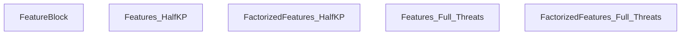
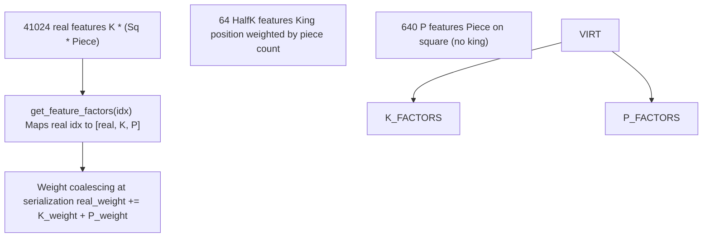
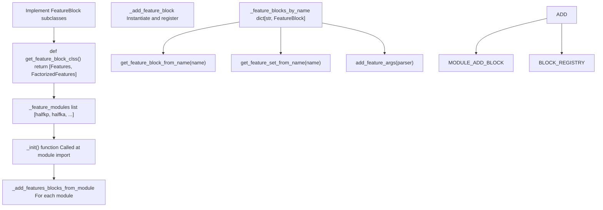
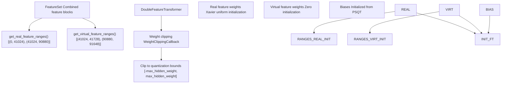

# Extending Feature Sets

-   [model/callbacks.py](https://github.com/Chesszyh/nnue-pytorch/blob/024b2064/model/callbacks.py)
-   [model/features/\_\_init\_\_.py](https://github.com/Chesszyh/nnue-pytorch/blob/024b2064/model/features/__init__.py)
-   [model/features/feature\_set.py](https://github.com/Chesszyh/nnue-pytorch/blob/024b2064/model/features/feature_set.py)
-   [model/features/full\_threats.py](https://github.com/Chesszyh/nnue-pytorch/blob/024b2064/model/features/full_threats.py)
-   [model/features/halfkp.py](https://github.com/Chesszyh/nnue-pytorch/blob/024b2064/model/features/halfkp.py)
-   [model/modules/layer\_stacks.py](https://github.com/Chesszyh/nnue-pytorch/blob/024b2064/model/modules/layer_stacks.py)
-   [model/quantize.py](https://github.com/Chesszyh/nnue-pytorch/blob/024b2064/model/quantize.py)

This page provides a technical guide for implementing custom feature blocks and integrating them into the nnue-pytorch feature registry system. Feature blocks are modular components that extract chess position features for the neural network input layer.

For general information about available feature sets and how to select them during training, see [Feature Sets](#4.2). For details about virtual feature factorization and weight coalescing, see [Virtual Features and Factorization](#4.6).

## FeatureBlock Interface Overview

All feature blocks must inherit from the `FeatureBlock` base class and implement specific methods to integrate with the training pipeline. The base class defines the contract for feature extraction, factorization, and PSQT initialization.

### Core FeatureBlock Structure


**Sources:** [model/features/halfkp.py23-45](https://github.com/Chesszyh/nnue-pytorch/blob/024b2064/model/features/halfkp.py#L23-L45) [model/features/halfkp.py48-96](https://github.com/Chesszyh/nnue-pytorch/blob/024b2064/model/features/halfkp.py#L48-L96) [model/features/full\_threats.py132-144](https://github.com/Chesszyh/nnue-pytorch/blob/024b2064/model/features/full_threats.py#L132-L144) [model/features/full\_threats.py147-176](https://github.com/Chesszyh/nnue-pytorch/blob/024b2064/model/features/full_threats.py#L147-L176)

### Required Constructor Arguments

The `FeatureBlock.__init__` constructor requires three parameters:

| Parameter | Type | Description |
| --- | --- | --- |
| `name` | `str` | Unique identifier for the feature block (e.g., "HalfKP", "HalfKA^") |
| `hash` | `int` | 32-bit hash value for version compatibility checking |
| `features` | `OrderedDict[str, int]` | Mapping of feature component names to their dimensions |

The `features` OrderedDict defines both real and virtual features. Real features appear first, followed by virtual features. The sum of all values is `num_features`, while the sum of only the first entries (before virtual features) is `num_real_features`.

**Sources:** [model/features/halfkp.py24-27](https://github.com/Chesszyh/nnue-pytorch/blob/024b2064/model/features/halfkp.py#L24-L27) [model/features/halfkp.py50-56](https://github.com/Chesszyh/nnue-pytorch/blob/024b2064/model/features/halfkp.py#L50-L56)

## Implementing a Basic Feature Block

A basic (non-factorized) feature block only needs to implement two methods: `get_active_features()` and `get_initial_psqt_features()`.

### Example: HalfKP Feature Block

```mermaid
flowchart TD
    BOARD["chess.Board"]
    TURN["Side to move (WHITE or BLACK)"]
    KING_SQ["King square board.king(turn)"]
    PIECE_MAP["Piece map board.piece_map()"]
    ORIENT_K["orient(turn, ksq) Flip if black POV"]
    ITER["For each (sq, piece)"]
    SKIP["piece == KING?"]
    NEXT["Skip"]
    CALC_IDX["idx = 1 + orient_sq + p_idx * 64 + orient_k * 641"]
    ORIENT_SQ["orient(turn, sq) Flip if black POV"]
    PIECE_IDX["p_idx = (pt-1)*2 + (color != turn)"]
    INDICES["indices[idx] = 1.0"]
    WHITE_FEAT["White perspective tensor"]
    BLACK_FEAT["Black perspective tensor"]
    RETURN["Return (white, black)"]

    BOARD --> KING_SQ
    BOARD --> PIECE_MAP
    KING --> SQ_ORIENT_K
    PIECE --> MAP_ITER
    ITER --> SKIP
    SKIP --> NEXT
    SKIP --> CALC_IDX
    ITER --> ORIENT_SQ
    ITER --> PIECE_IDX
    ORIENT --> K_CALC_IDX
    ORIENT --> SQ_CALC_IDX
    PIECE --> IDX_CALC_IDX
    CALC --> IDX_INDICES
    INDICES --> WHITE_FEAT
    INDICES --> BLACK_FEAT
    WHITE --> FEAT_RETURN
    BLACK --> FEAT_RETURN
```


**Sources:** [model/features/halfkp.py14-21](https://github.com/Chesszyh/nnue-pytorch/blob/024b2064/model/features/halfkp.py#L14-L21) [model/features/halfkp.py29-42](https://github.com/Chesszyh/nnue-pytorch/blob/024b2064/model/features/halfkp.py#L29-L42)

### Implementation Steps

1.  **Define feature dimensions in constructor:**

```
NUM_SQ = 64NUM_PT = 10NUM_PLANES = NUM_SQ * NUM_PT + 1class Features(FeatureBlock):    def __init__(self):        super().__init__(            "HalfKP",            0x5D69D5B8,  # Feature hash            OrderedDict([("HalfKP", NUM_PLANES * NUM_SQ)])        )
```
**Sources:** [model/features/halfkp.py9-27](https://github.com/Chesszyh/nnue-pytorch/blob/024b2064/model/features/halfkp.py#L9-L27)

2.  **Implement `get_active_features()` to return sparse feature indices:**

The method receives a `chess.Board` and must return a tuple of two tensors (white perspective, black perspective). Each tensor is a sparse representation where non-zero values indicate active features.

```
def get_active_features(self, board: chess.Board) -> tuple[torch.Tensor, torch.Tensor]:    def piece_features(turn):        indices = torch.zeros(NUM_PLANES * NUM_SQ)        for sq, p in board.piece_map().items():            if p.piece_type == chess.KING:                continue            ksq = board.king(turn)            indices[halfkp_idx(turn, orient(turn, ksq), sq, p)] = 1.0        return indices        return (piece_features(chess.WHITE), piece_features(chess.BLACK))
```
**Sources:** [model/features/halfkp.py29-42](https://github.com/Chesszyh/nnue-pytorch/blob/024b2064/model/features/halfkp.py#L29-L42)

3.  **Implement `get_initial_psqt_features()` for PSQT layer initialization:**

This method returns a list of initial piece-square table values (in Stockfish internal units). For simple feature blocks without PSQT support, raise an exception.

```
def get_initial_psqt_features(self):    raise Exception("Not supported yet. See HalfKA")
```
**Sources:** [model/features/halfkp.py44-45](https://github.com/Chesszyh/nnue-pytorch/blob/024b2064/model/features/halfkp.py#L44-L45) [model/features/full\_threats.py143-144](https://github.com/Chesszyh/nnue-pytorch/blob/024b2064/model/features/full_threats.py#L143-L144)

For feature blocks that support PSQT, compute material values for each feature index. See [model/features/full\_threats.py109-129](https://github.com/Chesszyh/nnue-pytorch/blob/024b2064/model/features/full_threats.py#L109-L129) for a complete example.

## Implementing Factorized Features

Factorized feature blocks add virtual features that decompose real features into factors, enabling faster early-stage training through parameter sharing. The factorized variant typically wraps a base feature block.

### Factorization Architecture


**Sources:** [model/features/halfkp.py48-96](https://github.com/Chesszyh/nnue-pytorch/blob/024b2064/model/features/halfkp.py#L48-L96) [model/features/feature\_set.py88-100](https://github.com/Chesszyh/nnue-pytorch/blob/024b2064/model/features/feature_set.py#L88-L100)

### Implementation Pattern

1.  **Extend feature dictionary with virtual features:**

```
class FactorizedFeatures(FeatureBlock):    def __init__(self):        super().__init__(            "HalfKP^",  # ^ suffix indicates factorization            0x5D69D5B8,  # Same hash as base            OrderedDict([                ("HalfKP", NUM_PLANES * NUM_SQ),  # Real features                ("HalfK", NUM_SQ),                # Virtual: King position                ("P", NUM_SQ * 10)                # Virtual: Piece on square            ])        )        self.base = Features()  # Wrap base implementation
```
**Sources:** [model/features/halfkp.py48-57](https://github.com/Chesszyh/nnue-pytorch/blob/024b2064/model/features/halfkp.py#L48-L57)

2.  **Extend `get_active_features()` to include virtual features:**

Virtual features are appended to the base feature tensor. For HalfKP factorization:

-   HalfK feature: King square weighted by total piece count
-   P feature: Piece on square (independent of king)

```
def get_active_features(self, board: chess.Board) -> tuple[torch.Tensor, torch.Tensor]:    white, black = self.base.get_active_features(board)        def piece_features(base, color):        indices = torch.zeros(NUM_SQ * 11)        piece_count = 0                # P features: piece on square        for sq, p in board.piece_map().items():            if p.piece_type == chess.KING:                continue            piece_count += 1            p_idx = (p.piece_type - 1) * 2 + (p.color != color)            indices[(p_idx + 1) * NUM_SQ + orient(color, sq)] = 1.0                # HalfK feature: king square weighted by piece count        ksq = board.king(color)        indices[orient(color, ksq)] = piece_count                return torch.cat((base, indices))        return (piece_features(white, chess.WHITE), piece_features(black, chess.BLACK))
```
**Sources:** [model/features/halfkp.py59-80](https://github.com/Chesszyh/nnue-pytorch/blob/024b2064/model/features/halfkp.py#L59-L80)

3.  **Implement `get_feature_factors()` for weight coalescing:**

This method maps each real feature index to its factorization: a list containing the real feature index plus all virtual feature indices it decomposes into.

```
def get_feature_factors(self, idx: int) -> list[int]:    if idx >= self.num_real_features:        raise Exception("Feature must be real")        k_idx = idx // NUM_PLANES    p_idx = idx % NUM_PLANES - 1        return [        idx,                                         # Real feature        self.get_factor_base_feature("HalfK") + k_idx,  # King factor        self.get_factor_base_feature("P") + p_idx       # Piece factor    ]
```
**Sources:** [model/features/halfkp.py82-93](https://github.com/Chesszyh/nnue-pytorch/blob/024b2064/model/features/halfkp.py#L82-L93)

The `get_factor_base_feature(name)` method returns the starting index for a named virtual feature component within the global feature space.

### Advanced Factorization: Full\_Threats

The `Full_Threats^` feature block demonstrates conditional factorization where only certain real features decompose:

```
def get_feature_factors(self, idx: int) -> list[int]:    if idx >= self.num_real_features:        raise Exception("Feature must be real")        # Threat features (idx < 79856) don't factorize    if idx < 79856:        return [idx]        # HalfKA features factorize into real + virtual A    a_idx = (idx - 79856) % NUM_PLANES_REAL    k_idx = (idx - 79856) // NUM_PLANES_REAL        # Special case: adjust for enemy king position    if a_idx // NUM_SQ == 10 and k_idx != KingBuckets[a_idx % NUM_SQ]:        a_idx += NUM_SQ        return [idx, self.get_factor_base_feature("A") + a_idx]
```
**Sources:** [model/features/full\_threats.py160-172](https://github.com/Chesszyh/nnue-pytorch/blob/024b2064/model/features/full_threats.py#L160-L172)

## Feature Registry Integration

The feature registry system automatically discovers and registers feature blocks defined in modules under `model/features/`.

### Registration Flow


**Sources:** [model/features/\_\_init\_\_.py67-72](https://github.com/Chesszyh/nnue-pytorch/blob/024b2064/model/features/__init__.py#L67-L72) [model/features/\_\_init\_\_.py27-35](https://github.com/Chesszyh/nnue-pytorch/blob/024b2064/model/features/__init__.py#L27-L35)

### Integration Steps

1.  **Create a new Python module in `model/features/`:**

Create a file like `model/features/my_feature.py` with your feature block implementations.

2.  **Implement the discovery function:**

Every feature module must export a `get_feature_block_clss()` function that returns a list of feature block classes:

```
def get_feature_block_clss() -> list[type[FeatureBlock]]:    return [Features, FactorizedFeatures]
```
**Sources:** [model/features/halfkp.py104-105](https://github.com/Chesszyh/nnue-pytorch/blob/024b2064/model/features/halfkp.py#L104-L105) [model/features/full\_threats.py183-184](https://github.com/Chesszyh/nnue-pytorch/blob/024b2064/model/features/full_threats.py#L183-L184)

3.  **Register the module in `model/features/__init__.py`:**

Add your module to the `_feature_modules` list:

```
from . import halfkp, halfka, halfka_v2, halfka_v2_hm, full_threats, my_feature_feature_modules: list[types.ModuleType] = [    halfkp,    halfka,    halfka_v2,    halfka_v2_hm,    full_threats,    my_feature,  # Add your module here]
```
**Sources:** [model/features/\_\_init\_\_.py14-22](https://github.com/Chesszyh/nnue-pytorch/blob/024b2064/model/features/__init__.py#L14-L22)

4.  **Use your feature block via command-line argument:**

```
# Basic feature blockpython train.py --features MyFeature# Factorized feature blockpython train.py --features MyFeature^# Combined with other blockspython train.py --features MyFeature^+HalfKA^
```
The `+` operator combines multiple feature blocks into a `FeatureSet`. The `^` suffix selects the factorized variant.

**Sources:** [model/features/\_\_init\_\_.py46-64](https://github.com/Chesszyh/nnue-pytorch/blob/024b2064/model/features/__init__.py#L46-L64)

## Feature Initialization and Quantization

Feature transformers require careful initialization to maintain compatibility with quantization during training.

### Weight Initialization Zones


**Sources:** [model/features/feature\_set.py38-63](https://github.com/Chesszyh/nnue-pytorch/blob/024b2064/model/features/feature_set.py#L38-L63) [model/callbacks.py6-18](https://github.com/Chesszyh/nnue-pytorch/blob/024b2064/model/callbacks.py#L6-L18) [model/quantize.py40-60](https://github.com/Chesszyh/nnue-pytorch/blob/024b2064/model/quantize.py#L40-L60)

### PSQT Initialization

The `get_initial_psqt_features()` method provides piece-square table values for initializing feature transformer biases. These values are typically material values in Stockfish internal units:

| Piece Type | Stockfish Value |
| --- | --- |
| Pawn | 126 |
| Knight | 781 |
| Bishop | 825 |
| Rook | 1276 |
| Queen | 2538 |

For each feature index representing "piece X on square Y from perspective Z", assign the material value (positive for friendly pieces, negative for opponent pieces).

**Sources:** [model/features/full\_threats.py109-129](https://github.com/Chesszyh/nnue-pytorch/blob/024b2064/model/features/full_threats.py#L109-L129)

### Quantization Bounds

During training, weights must remain within quantization-compatible bounds. The `QuantizationManager` computes these bounds based on the quantization scheme:

| Layer | Weight Type | Scale Factor | Max Weight |
| --- | --- | --- | --- |
| Feature Transformer | `int16` | `ft_quantized_one = 255` | `255.0` |
| Layer Stack L1 | `int8` | `weight_scale_hidden = 64` | `127/64 ≈ 1.984` |
| Layer Stack L2+ | `int8` | `weight_scale_hidden = 64` | `127/64 ≈ 1.984` |
| Output Layer | `int8` | `weight_scale_out = 16` | Computed from score scale |

The `WeightClippingCallback` enforces these bounds at each training batch.

**Sources:** [model/quantize.py17-39](https://github.com/Chesszyh/nnue-pytorch/blob/024b2064/model/quantize.py#L17-L39) [model/callbacks.py6-17](https://github.com/Chesszyh/nnue-pytorch/blob/024b2064/model/callbacks.py#L6-L17)

## Testing Your Feature Block

### Unit Testing Checklist

Before using a new feature block in training, verify:

1.  **Feature count consistency:**

    -   `num_features = num_real_features + num_virtual_features`
    -   Feature dictionary sums match `num_features`
2.  **Active features correctness:**

    -   Test `get_active_features()` on known board positions
    -   Verify white and black perspectives differ correctly
    -   Check that sparse indices are within `[0, num_features)`
3.  **Factorization correctness (for factorized blocks):**

    -   All real features have valid factorizations
    -   `get_feature_factors(idx)` returns `[idx] + virtual_factors`
    -   Virtual factor indices are in correct ranges
4.  **PSQT initialization:**

    -   `get_initial_psqt_features()` length matches `num_features`
    -   Material values have correct signs (positive for friendly, negative for opponent)

### Example Test Pattern

```
def test_my_feature_block():    feature_block = MyFeatureBlock()        # Test feature counts    assert feature_block.num_features > 0    assert feature_block.num_real_features <= feature_block.num_features        # Test on starting position    board = chess.Board()    white_features, black_features = feature_block.get_active_features(board)        assert white_features.shape[0] == feature_block.num_features    assert black_features.shape[0] == feature_block.num_features        # Verify sparse representation    assert torch.all(white_features >= 0)    assert torch.all(black_features >= 0)
```
### Integration Testing with Data Loader

Test your feature block with the C++ data loader to ensure compatibility:

```
# Create a small training dataset# Test data loading with your featurepython train.py --features MyFeature^ --max-epochs 1 --num-workers 1
```
Monitor for:

-   Data loader initialization errors
-   Feature index out-of-bounds errors
-   Unexpected tensor shapes in the feature transformer

**Sources:** [model/features/feature\_set.py65-86](https://github.com/Chesszyh/nnue-pytorch/blob/024b2064/model/features/feature_set.py#L65-L86)

## Advanced Considerations

### Performance Optimization

For features used during actual training (not just evaluation), implement efficient index calculation:

1.  **Precompute lookup tables:** For complex orientation or piece-type mappings
2.  **Use integer arithmetic:** Avoid floating-point calculations in index computation
3.  **Minimize branching:** Use arithmetic tricks instead of if/else chains

**Sources:** [model/features/halfkp.py14-21](https://github.com/Chesszyh/nnue-pytorch/blob/024b2064/model/features/halfkp.py#L14-L21)

### C++ Data Loader Support

Features that require complex board analysis (like threat maps in `Full_Threats`) should delegate active feature extraction to the C++ data loader for performance:

```
def get_active_features(self, board: chess.Board):    raise Exception(        "Not supported yet, you must use the c++ data loader for support during training"    )
```
The C++ implementation goes in [lib/training\_data\_loader.cpp](https://github.com/Chesszyh/nnue-pytorch/blob/024b2064/lib/training_data_loader.cpp) with corresponding feature extraction logic.

**Sources:** [model/features/full\_threats.py138-141](https://github.com/Chesszyh/nnue-pytorch/blob/024b2064/model/features/full_threats.py#L138-L141) [model/features/full\_threats.py155-158](https://github.com/Chesszyh/nnue-pytorch/blob/024b2064/model/features/full_threats.py#L155-L158)

### Feature Block Composition

Feature blocks can be combined using the `+` operator to create composite feature sets:

```
# Combined feature setfeature_set = get_feature_set_from_name("HalfKP^+MyFeature")
```
The `FeatureSet` class concatenates feature indices with appropriate offsets, ensuring each block has a unique index space.

**Sources:** [model/features/feature\_set.py15-36](https://github.com/Chesszyh/nnue-pytorch/blob/024b2064/model/features/feature_set.py#L15-L36) [model/features/\_\_init\_\_.py46-49](https://github.com/Chesszyh/nnue-pytorch/blob/024b2064/model/features/__init__.py#L46-L49)

### Bucket-Specific Features

For advanced architectures, features can be bucket-specific (king position dependent). The `Full_Threats` implementation demonstrates this with `KingBuckets` mapping:

```
KingBuckets = [  -1, -1, -1, -1, 31, 30, 29, 28,  -1, -1, -1, -1, 27, 26, 25, 24,  # ... 32 unique bucket positions]
```
This maps king squares to bucket indices, allowing different feature subspaces for different king positions.

**Sources:** [model/features/full\_threats.py77-86](https://github.com/Chesszyh/nnue-pytorch/blob/024b2064/model/features/full_threats.py#L77-L86) [model/features/full\_threats.py96-106](https://github.com/Chesszyh/nnue-pytorch/blob/024b2064/model/features/full_threats.py#L96-L106)

---

**Key Takeaways:**

-   Inherit from `FeatureBlock` and implement required methods
-   Use factorization (`^` suffix) to accelerate early training via virtual features
-   Register new modules in `model/features/__init__.py`
-   Ensure PSQT initialization and quantization compatibility
-   Test thoroughly before production training runs
-   Consider C++ implementation for computationally intensive features
