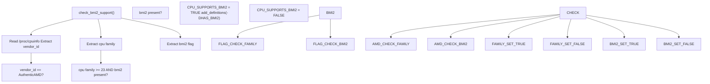
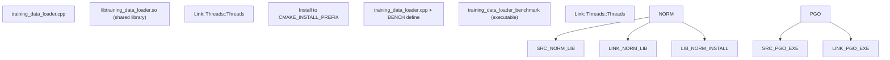

# Reference

-   [.gitignore](https://github.com/Chesszyh/nnue-pytorch/blob/024b2064/.gitignore)
-   [.pgo/small.binpack](https://github.com/Chesszyh/nnue-pytorch/blob/024b2064/.pgo/small.binpack)
-   [CMakeLists.txt](https://github.com/Chesszyh/nnue-pytorch/blob/024b2064/CMakeLists.txt)
-   [compile\_data\_loader.bat](https://github.com/Chesszyh/nnue-pytorch/blob/024b2064/compile_data_loader.bat)
-   [requirements.txt](https://github.com/Chesszyh/nnue-pytorch/blob/024b2064/requirements.txt)
-   [setup\_script.sh](https://github.com/Chesszyh/nnue-pytorch/blob/024b2064/setup_script.sh)

This page provides quick reference information for developers and researchers working with the nnue-pytorch codebase. It covers the build system, dependency structure, and main entry points for the training infrastructure.

For detailed documentation on specific topics:

-   Build system configuration and compiler flags: see [Build System (CMake)](#9.1)
-   Python package dependencies and version requirements: see [Dependencies and Requirements](#9.2)
-   Command-line arguments for training and evaluation scripts: see [Command-Line Reference](#9.3)

For architectural details about the training pipeline, data loading, and model structure, refer to sections [2](#2), [3](#3), and [4](#4) respectively.

## System Components Overview

The nnue-pytorch repository consists of Python-based training code with a high-performance C++ data loader. The following table summarizes the main system components:

| Component | Implementation | Purpose | Key Files |
| --- | --- | --- | --- |
| Training Scripts | Python/PyTorch Lightning | Model training orchestration | `train.py`, `easy_train.py` |
| Data Loader | C++20 (shared library) | High-performance training data parsing | `training_data_loader.cpp` |
| Model Definition | Python/PyTorch | NNUE network architecture | `model/model.py`, `model/nnue.py` |
| Serialization | Python | Convert checkpoints to .nnue format | `serialize.py` |
| Evaluation | Python + External Tools | Play games and calculate ELO | `run_games.py`, `do_plots.py` |
| Build System | CMake 3.10+ | Compile C++ data loader with optimizations | `CMakeLists.txt` |

**Sources:** [CMakeLists.txt1-82](https://github.com/Chesszyh/nnue-pytorch/blob/024b2064/CMakeLists.txt#L1-L82) [requirements.txt1-10](https://github.com/Chesszyh/nnue-pytorch/blob/024b2064/requirements.txt#L1-L10)

## Build Process Flow

The following diagram shows the complete build pipeline from source to deployable artifacts, including the two-phase PGO (Profile-Guided Optimization) build process:

```mermaid
flowchart TD
    CPP["training_data_loader.cpp (C++20 source)"]
    CMAKE["CMakeLists.txt (Build configuration)"]
    PGO_GEN_CONFIG["cmake -DCMAKE_BUILD_TYPE=PGO_Generate"]
    PGO_GEN_BUILD["build-pgo-generate/ training_data_loader_benchmark"]
    PGO_RUN["Run benchmark on .pgo/small.binpack"]
    PGO_DATA["pgo_data/ (Profile data .gcda files)"]
    PGO_USE_CONFIG["cmake -DCMAKE_BUILD_TYPE=PGO_Use -DPGO_PROFILE_DATA_DIR=..."]
    PGO_USE_BUILD["build/ libtraining_data_loader.so"]
    INSTALL["install to ./ (CMAKE_INSTALL_PREFIX)"]
    STD_CONFIG["cmake -DCMAKE_BUILD_TYPE=RelWithDebInfo"]
    STD_BUILD["build/ libtraining_data_loader.so"]
    CTYPES["data_loader/_native.py (ctypes interface)"]
    TRAINING["train.py / easy_train.py (Load shared library)"]

    CPP --> PGO_GEN_CONFIG
    CMAKE --> PGO_GEN_CONFIG
    PGO --> GEN_CONFIG_PGO_GEN_BUILD
    PGO --> GEN_BUILD_PGO_RUN
    PGO --> RUN_PGO_DATA
    PGO --> DATA_PGO_USE_CONFIG
    CPP --> PGO_USE_CONFIG
    CMAKE --> PGO_USE_CONFIG
    PGO --> USE_CONFIG_PGO_USE_BUILD
    PGO --> USE_BUILD_INSTALL
    CPP --> STD_CONFIG
    CMAKE --> STD_CONFIG
    STD --> CONFIG_STD_BUILD
    INSTALL --> CTYPES
    STD --> BUILD_CTYPES
    CTYPES --> TRAINING
```


**Sources:** [CMakeLists.txt1-82](https://github.com/Chesszyh/nnue-pytorch/blob/024b2064/CMakeLists.txt#L1-L82) [compile\_data\_loader.bat1-12](https://github.com/Chesszyh/nnue-pytorch/blob/024b2064/compile_data_loader.bat#L1-L12) [setup\_script.sh1-5](https://github.com/Chesszyh/nnue-pytorch/blob/024b2064/setup_script.sh#L1-L5)

## Build System Architecture

The CMake configuration implements several advanced features for performance optimization:

### Build Types and Compiler Flags

The build system supports four build configurations:

| Build Type | CMake Flag | Compiler Flags | Linker Flags | Purpose |
| --- | --- | --- | --- | --- |
| Debug | `-DCMAKE_BUILD_TYPE=Debug` | `-g` | (none) | Development with debug symbols |
| Release | `-DCMAKE_BUILD_TYPE=Release` | `-O3 -march=native -DNDEBUG` | (none) | Optimized production build |
| RelWithDebInfo | `-DCMAKE_BUILD_TYPE=RelWithDebInfo` | `-g -O3 -march=native -DNDEBUG` | (none) | Optimized with debug symbols (default) |
| PGO\_Generate | `-DCMAKE_BUILD_TYPE=PGO_Generate` | `-O3 -march=native -DNDEBUG -DPGO_BUILD -fprofile-generate` | `-fprofile-generate` | First phase of PGO build |
| PGO\_Use | `-DCMAKE_BUILD_TYPE=PGO_USE` | `-g -O3 -march=native -DNDEBUG -fprofile-use -fprofile-correction` | (none) | Second phase of PGO build |

**Sources:** [CMakeLists.txt5-18](https://github.com/Chesszyh/nnue-pytorch/blob/024b2064/CMakeLists.txt#L5-L18)

### CPU Feature Detection

The build system automatically detects BMI2 (Bit Manipulation Instruction Set 2) support:


AMD Zen/Zen+ CPUs (family < 23) have a slow BMI2 implementation, so the build system only enables BMI2 on AMD when `cpu_family >= 23` (Zen 2 and later). For Intel and other vendors, BMI2 is enabled if the CPU advertises support.

**Sources:** [CMakeLists.txt24-60](https://github.com/Chesszyh/nnue-pytorch/blob/024b2064/CMakeLists.txt#L24-L60)

### Build Targets

The build system produces different targets depending on the build type:


**Sources:** [CMakeLists.txt64-81](https://github.com/Chesszyh/nnue-pytorch/blob/024b2064/CMakeLists.txt#L64-L81)

## Dependency Structure

The project has two distinct dependency sets: Python runtime dependencies and build-time system dependencies.

### Python Dependencies

The following table lists all Python package dependencies from `requirements.txt`:

| Package | Version Constraint | Purpose | Used By |
| --- | --- | --- | --- |
| `psutil` | (any) | System resource monitoring | `easy_train.py` TUI dashboard |
| `asciimatics` | (any) | Terminal UI framework | `easy_train.py` dashboard rendering |
| `GPUtil` | (any) | GPU monitoring | `easy_train.py` GPU utilization display |
| `python-chess` | `==0.31.4` | Chess position handling | `serialize.py`, feature extraction |
| `matplotlib` | (any) | Plotting and visualization | `do_plots.py`, `visualize.py` |
| `tensorboard` | (any) | Training metrics logging | `train.py`, PyTorch Lightning integration |
| `numba` | (any) | JIT compilation for feature code | `model/features/*.py` |
| `numpy` | `<2.0` | Array operations | Throughout codebase |
| `requests` | (any) | HTTP client for downloading dependencies | `easy_train.py` dependency management |
| `lightning` | (any) | PyTorch Lightning framework | `train.py`, `model/lightning_module.py` |

Note: PyTorch itself is not listed in `requirements.txt` as it requires platform-specific installation (CPU vs CUDA versions). See [Dependencies and Requirements](#9.2) for installation instructions.

**Sources:** [requirements.txt1-10](https://github.com/Chesszyh/nnue-pytorch/blob/024b2064/requirements.txt#L1-L10)

### Build Dependencies

The C++ data loader requires:

| Dependency | Minimum Version | Purpose |
| --- | --- | --- |
| CMake | 3.10 | Build system generator |
| C++ Compiler | C++20 support | GCC 10+, Clang 10+, or MSVC 2019+ |
| pthreads | (system) | Threading support (detected via `find_package(Threads)`) |

**Sources:** [CMakeLists.txt1-62](https://github.com/Chesszyh/nnue-pytorch/blob/024b2064/CMakeLists.txt#L1-L62)

## Main Entry Points

The following diagram maps user-facing commands to their implementation files and key functions:

```mermaid
flowchart TD
    VIS_CMD["python visualize.py net.nnue"]
    VIS_MAIN["visualize.py::main() → NNUEReader.read() → matplotlib histograms"]
    FTPERM_CMD["python ftperm.py model.pt"]
    FTPERM_MAIN["ftperm.py::main() → find_perm_impl() → apply permutation"]
    GAMES_CMD["python run_games.py experiment_path"]
    GAMES_MAIN["run_games.py::main() → run_match() → c-chess-cli subprocess"]
    PLOTS_CMD["python do_plots.py experiment_path"]
    PLOTS_MAIN["do_plots.py::main() → parse ordo.out → matplotlib plots"]
    SERIALIZE_CMD["python serialize.py model.ckpt --output-file"]
    SERIALIZE_MAIN["serialize.py::main() → NNUE.load_from_checkpoint() → NNUEWriter.write()"]
    TRAIN_CMD["python train.py --features --lambda --epochs"]
    TRAIN_MAIN["train.py::main() → create_model() → pl.Trainer.fit()"]
    EASY_CMD["python easy_train.py --experiment_path --runs"]
    EASY_MAIN["easy_train.py::main() → TrainingRun threads → NetworkTesting thread"]

    VIS --> CMD_VIS_MAIN
    FTPERM --> CMD_FTPERM_MAIN
    GAMES --> CMD_GAMES_MAIN
    PLOTS --> CMD_PLOTS_MAIN
    SERIALIZE --> CMD_SERIALIZE_MAIN
    TRAIN --> CMD_TRAIN_MAIN
    EASY --> CMD_EASY_MAIN
```


**Sources:** Inferred from repository structure and standard usage patterns.

## File Organization

The repository follows a standard Python project structure with C++ extensions:

```
nnue-pytorch/
├── CMakeLists.txt                    # Build configuration for C++ data loader
├── requirements.txt                  # Python dependencies
├── compile_data_loader.bat           # PGO build script (Linux/Mac)
├── setup_script.sh                   # Docker entrypoint script
├── train.py                          # Main training script
├── easy_train.py                     # Multi-GPU training orchestrator
├── serialize.py                      # Checkpoint → .nnue converter
├── run_games.py                      # Automated game playing
├── do_plots.py                       # Training visualization
├── ftperm.py                         # FT weight permutation optimizer
├── visualize.py                      # Network weight visualization
├── training_data_loader.cpp          # C++ data loader implementation
├── model/
│   ├── model.py                      # NNUEModel definition
│   ├── nnue.py                       # NNUE Lightning module
│   ├── lightning_module.py           # Training/validation logic
│   ├── feature_transformer.py        # Sparse feature transformer
│   ├── quantization.py               # Quantization utilities
│   ├── features/                     # Feature set definitions
│   └── nnue_bin_dataset.py          # (Legacy) Python data loader
├── data_loader/
│   ├── _native.py                    # ctypes interface to C++ loader
│   ├── stream.py                     # Stream/provider abstractions
│   └── dataset.py                    # PyTorch Dataset wrappers
├── ranger21.py                       # Ranger21 optimizer
├── docs/
│   └── nnue.md                       # Architecture documentation
├── Dockerfile.AMD                    # Docker configuration (AMD)
├── Dockerfile.NVIDIA                 # Docker configuration (NVIDIA)
└── run_docker.sh                     # Docker launcher script
```
**Sources:** [.gitignore1-8](https://github.com/Chesszyh/nnue-pytorch/blob/024b2064/.gitignore#L1-L8) (shows generated files to exclude)

## Quick Reference: Common Workflows

### Building the Data Loader

Standard build (recommended for most users):

```
cmake -S . -B build -DCMAKE_BUILD_TYPE=RelWithDebInfo -DCMAKE_INSTALL_PREFIX="./"cmake --build ./build --config RelWithDebInfo --target install
```
PGO-optimized build (5-10% faster, takes longer to build):

```
./compile_data_loader.bat
```
**Sources:** [CMakeLists.txt1-82](https://github.com/Chesszyh/nnue-pytorch/blob/024b2064/CMakeLists.txt#L1-L82) [compile\_data\_loader.bat1-12](https://github.com/Chesszyh/nnue-pytorch/blob/024b2064/compile_data_loader.bat#L1-L12)

### Installing Python Dependencies

```
pip install -r requirements.txtpip install torch torchvision torchaudio  # Platform-specific
```
Note: PyTorch installation depends on whether you have CUDA and which version. See [Dependencies and Requirements](#9.2) for details.

**Sources:** [requirements.txt1-10](https://github.com/Chesszyh/nnue-pytorch/blob/024b2064/requirements.txt#L1-L10)

### Environment Variables

The following environment variables affect the build and runtime behavior:

| Variable | Default | Purpose |
| --- | --- | --- |
| `CMAKE_BUILD_TYPE` | `RelWithDebInfo` | Build configuration (Debug/Release/RelWithDebInfo/PGO\_Generate/PGO\_Use) |
| `CMAKE_INSTALL_PREFIX` | `/usr/local` | Installation directory for `libtraining_data_loader.so` |
| `PGO_PROFILE_DATA_DIR` | `${CMAKE_BINARY_DIR}/pgo_data` | Directory for PGO profile data (.gcda files) |

**Sources:** [CMakeLists.txt5-18](https://github.com/Chesszyh/nnue-pytorch/blob/024b2064/CMakeLists.txt#L5-L18)

## Versioning and Compatibility

### C++ Standard

The data loader requires **C++20** support. This is enforced at [CMakeLists.txt19-20](https://github.com/Chesszyh/nnue-pytorch/blob/024b2064/CMakeLists.txt#L19-L20):

```
set(CMAKE_CXX_STANDARD 20)set(CMAKE_CXX_STANDARD_REQUIRED 20)
```
### Python Version

Implicitly requires Python 3.8+ due to Lightning framework requirements. NumPy is constrained to `<2.0` at [requirements.txt8](https://github.com/Chesszyh/nnue-pytorch/blob/024b2064/requirements.txt#L8-L8) for compatibility.

### NNUE Binary Format

The serialized `.nnue` file format version is defined in the model itself. See [NNUE Binary Format](#5.2) for version compatibility information.

**Sources:** [CMakeLists.txt19-20](https://github.com/Chesszyh/nnue-pytorch/blob/024b2064/CMakeLists.txt#L19-L20) [requirements.txt8](https://github.com/Chesszyh/nnue-pytorch/blob/024b2064/requirements.txt#L8-L8)
