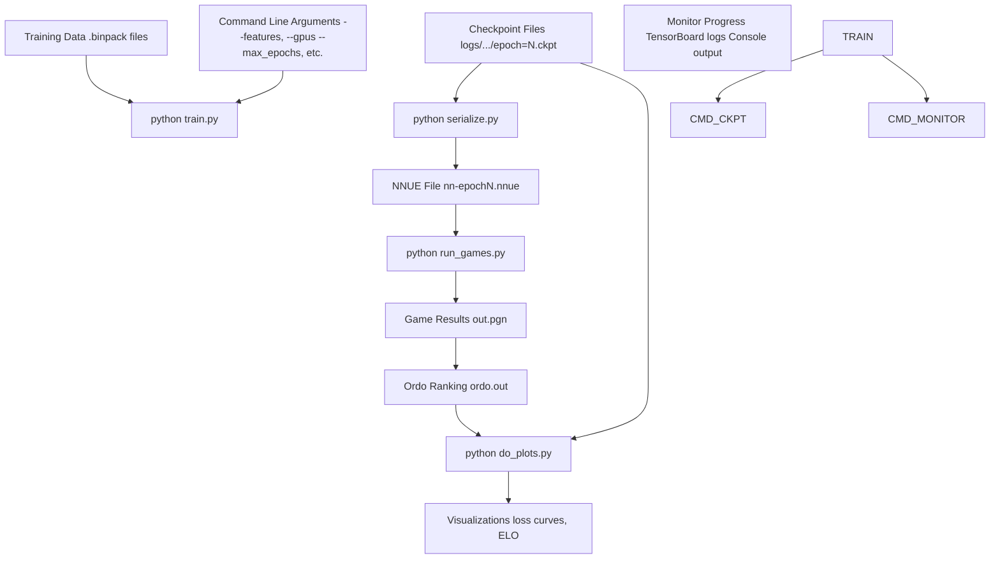
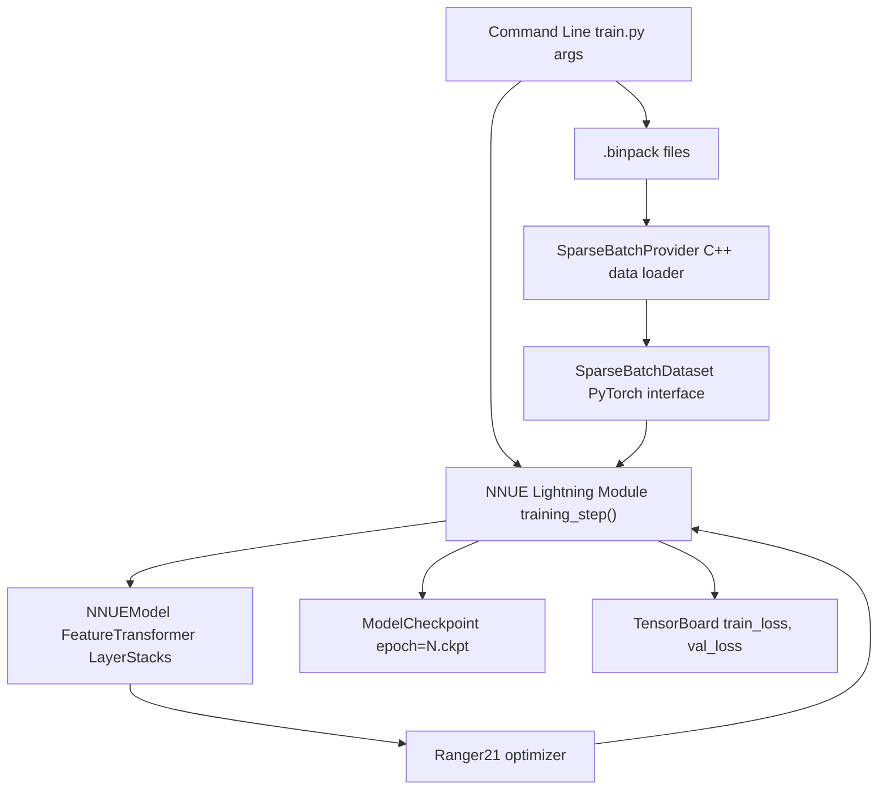
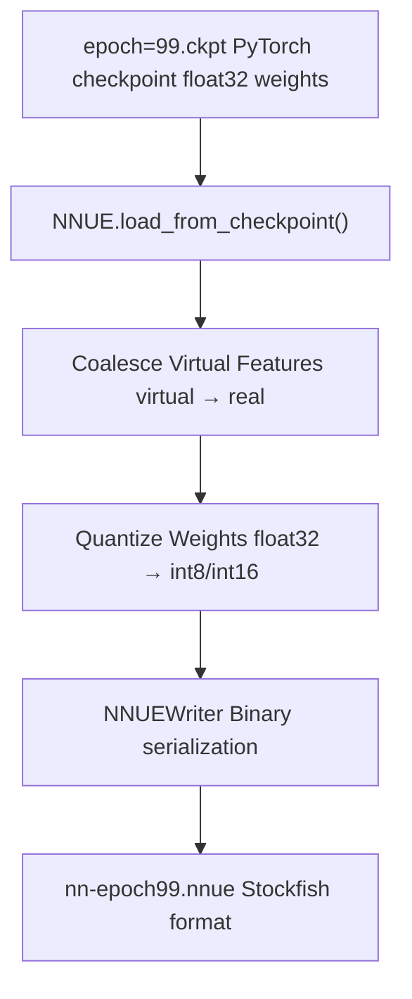
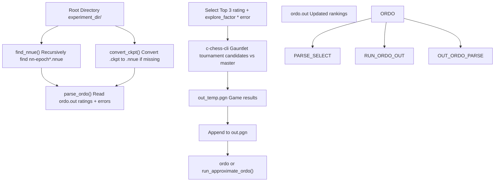
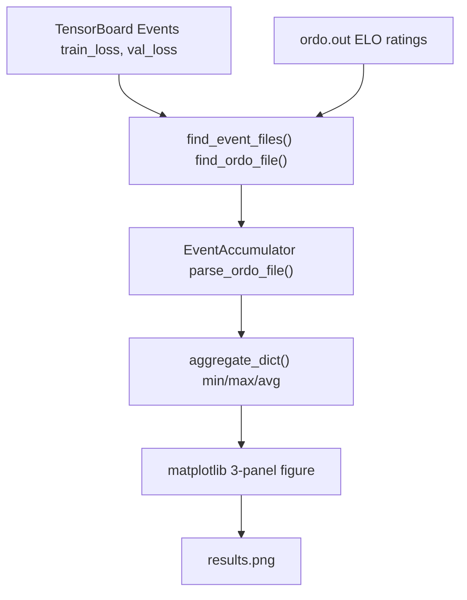

# Quick Start Tutorial

-   [delete\_bad\_nets.py](https://github.com/Chesszyh/nnue-pytorch/blob/024b2064/delete_bad_nets.py)
-   [do\_plots.py](https://github.com/Chesszyh/nnue-pytorch/blob/024b2064/do_plots.py)
-   [run\_games.py](https://github.com/Chesszyh/nnue-pytorch/blob/024b2064/run_games.py)
-   [scripts/easy\_train.py](https://github.com/Chesszyh/nnue-pytorch/blob/024b2064/scripts/easy_train.py)
-   [scripts/easy\_train\_example.bat](https://github.com/Chesszyh/nnue-pytorch/blob/024b2064/scripts/easy_train_example.bat)
-   [scripts/easy\_train\_example.sh](https://github.com/Chesszyh/nnue-pytorch/blob/024b2064/scripts/easy_train_example.sh)
-   [train.py](https://github.com/Chesszyh/nnue-pytorch/blob/024b2064/train.py)

This page provides a step-by-step guide for training your first NNUE chess evaluation network, from preparing training data to evaluating the trained model through chess games. By the end of this tutorial, you will have trained a basic network, converted it to Stockfish-compatible format, and evaluated its playing strength.

**Scope**: This tutorial covers the minimal workflow for a single training run. For environment setup, see [Environment Setup](#1.2). For advanced multi-GPU orchestration with automatic evaluation, see [Advanced Orchestration (easy\_train.py)](#2.2). For detailed training configuration options, see [Basic Training (train.py)](#2.1).

## Prerequisites

Before starting, ensure you have completed the environment setup from [page 1.2](#1.2):

-   Python 3.7+ with PyTorch, Lightning, and required dependencies installed
-   C++ toolchain (CMake 3.4+, GCC 9.2+, Make 3+) for building the data loader
-   Training data in `.bin` or `.binpack` format
-   (Optional) Stockfish, c-chess-cli, and ordo for evaluation

## Training Workflow Overview


**Quick Start Workflow**: Prepare training data → Run `train.py` → Monitor checkpoints → Serialize to `.nnue` → Evaluate with games → Visualize results.

Sources: [train.py1-550](https://github.com/Chesszyh/nnue-pytorch/blob/024b2064/train.py#L1-L550) [run\_games.py1-606](https://github.com/Chesszyh/nnue-pytorch/blob/024b2064/run_games.py#L1-L606) [do\_plots.py1-267](https://github.com/Chesszyh/nnue-pytorch/blob/024b2064/do_plots.py#L1-L267)

## Step 1: Prepare Training Data

Training data must be in `.bin` or `.binpack` format containing chess positions with evaluations and game outcomes. These files are typically generated by specialized data generation tools (not covered in this tutorial).

**Verify your data files exist:**

```
ls -lh /path/to/training_data.binpack
```
**Data format**: Each entry contains position features, evaluation scores, and game outcomes (win/draw/loss). The C++ data loader in [training\_data\_loader.cpp](https://github.com/Chesszyh/nnue-pytorch/blob/024b2064/training_data_loader.cpp) parses these formats efficiently.

Sources: [train.py386-392](https://github.com/Chesszyh/nnue-pytorch/blob/024b2064/train.py#L386-L392)

## Step 2: Start Basic Training

The simplest training command uses [train.py](https://github.com/Chesszyh/nnue-pytorch/blob/024b2064/train.py) with minimal arguments:

```
python train.py \    /path/to/training_data.binpack \    --features=HalfKAv2_hm^ \    --gpus=0 \    --max_epochs=100
```
### Essential Command-Line Arguments

| Argument | Purpose | Default | Example |
| --- | --- | --- | --- |
| `datasets` | Training data files (positional) | Required | `data.binpack` |
| `--features` | Feature set to use | Required | `HalfKAv2_hm^` |
| `--gpus` | GPU devices (comma-separated) | All available | `0,1` |
| `--max_epochs` | Number of training epochs | 800 | `100` |
| `--batch-size` | Positions per batch | 16384 (GPU) | `8192` |
| `--default_root_dir` | Output directory for logs/checkpoints | `logs/` | `./experiment_1` |

Sources: [train.py108-376](https://github.com/Chesszyh/nnue-pytorch/blob/024b2064/train.py#L108-L376)

### Training System Components


**Training Pipeline**: Command-line arguments configure the `NNUE` Lightning module, which orchestrates data loading via `SparseBatchDataset`, forward/backward passes through `NNUEModel`, and optimizer updates with `Ranger21`. Checkpoints are saved by `ModelCheckpoint` callback.

Sources: [train.py44-89](https://github.com/Chesszyh/nnue-pytorch/blob/024b2064/train.py#L44-L89) [train.py428-438](https://github.com/Chesszyh/nnue-pytorch/blob/024b2064/train.py#L428-L438) [train.py496-543](https://github.com/Chesszyh/nnue-pytorch/blob/024b2064/train.py#L496-L543)

### Feature Set Selection

The `--features` argument determines the input feature representation. Common choices:

| Feature Set | Description | Feature Count | Best For |
| --- | --- | --- | --- |
| `HalfKAv2_hm^` | King+pieces with history (factorized) | ~45K real | Default, balanced |
| `HalfKP` | King+piece (classic) | 41K | Simple, fast |
| `HalfKAv2^` | King+all pieces (factorized) | ~45K real | Good accuracy |

The `^` suffix indicates factorized features with virtual features that accelerate training.

Sources: [train.py409](https://github.com/Chesszyh/nnue-pytorch/blob/024b2064/train.py#L409-L409) [train.py457-460](https://github.com/Chesszyh/nnue-pytorch/blob/024b2064/train.py#L457-L460)

## Step 3: Monitor Training Progress

### Console Output

Training progress is displayed via TQDM progress bar:

```
Epoch 5:  45%|████▌     | 2250/5000 [02:15<02:45, 16.6it/s, loss=0.0234]
```
Key metrics:

-   **Epoch**: Current training epoch (0-indexed)
-   **Progress**: Steps completed / total steps in epoch
-   **it/s**: Iterations (batches) processed per second
-   **loss**: Current training loss value

Sources: [train.py506](https://github.com/Chesszyh/nnue-pytorch/blob/024b2064/train.py#L506-L506)

### TensorBoard Logs

View detailed metrics with TensorBoard:

```
tensorboard --logdir logs/
```
Navigate to `http://localhost:6006` to view:

-   `train_loss`: Training loss over steps
-   `val_loss`: Validation loss (if `--validation-size` > 0)
-   `lr`: Learning rate schedule

Sources: [train.py486-488](https://github.com/Chesszyh/nnue-pytorch/blob/024b2064/train.py#L486-L488)

### Checkpoint Files

Checkpoints are saved periodically to `logs/lightning_logs/version_N/checkpoints/`:

```
logs/
└── lightning_logs/
    └── version_0/
        └── checkpoints/
            ├── epoch=0.ckpt
            ├── epoch=20.ckpt
            ├── epoch=40.ckpt
            └── last.ckpt
```
Configuration for checkpoint saving:

| Argument | Purpose | Default |
| --- | --- | --- |
| `--network-save-period` | Save every N epochs | 20 |
| `--save-last-network` | Always save last checkpoint | True |

Sources: [train.py490-494](https://github.com/Chesszyh/nnue-pytorch/blob/024b2064/train.py#L490-L494) [train.py292-304](https://github.com/Chesszyh/nnue-pytorch/blob/024b2064/train.py#L292-L304)

## Step 4: Convert Checkpoint to NNUE Format

After training, convert PyTorch checkpoints to Stockfish-compatible `.nnue` format:

```
python serialize.py \    logs/lightning_logs/version_0/checkpoints/epoch=99.ckpt \    nn-epoch99.nnue \    --features=HalfKAv2_hm^
```
### Serialization Process


**Conversion Steps**: Load checkpoint → Coalesce factorized features → Quantize to integer precision → Write binary `.nnue` file.

The `--features` argument must match the one used during training.

Sources: [run\_games.py71-102](https://github.com/Chesszyh/nnue-pytorch/blob/024b2064/run_games.py#L71-L102)

## Step 5: Evaluate Networks with Games

Evaluate trained networks by playing games against a baseline Stockfish:

```
python run_games.py \    ./experiment_dir \    --c_chess_exe=./c-chess-cli \    --stockfish_base=./stockfish \    --book_file_name=./noob_3moves.epd \    --features=HalfKAv2_hm^ \    --games_per_round=200 \    --concurrency=8
```
### Evaluation Workflow


**Evaluation Loop**: Discovers networks → Selects top 3 by rating + uncertainty → Plays gauntlet games → Updates ELO rankings → Repeats. This implements exploration/exploitation tradeoff via `--explore_factor`.

Sources: [run\_games.py104-107](https://github.com/Chesszyh/nnue-pytorch/blob/024b2064/run_games.py#L104-L107) [run\_games.py109-130](https://github.com/Chesszyh/nnue-pytorch/blob/024b2064/run_games.py#L109-L130) [run\_games.py132-218](https://github.com/Chesszyh/nnue-pytorch/blob/024b2064/run_games.py#L132-L218) [run\_games.py280-347](https://github.com/Chesszyh/nnue-pytorch/blob/024b2064/run_games.py#L280-L347) [run\_games.py385-474](https://github.com/Chesszyh/nnue-pytorch/blob/024b2064/run_games.py#L385-L474)

### Game Parameters

| Argument | Purpose | Default |
| --- | --- | --- |
| `root_dir` | Directory containing networks | Required |
| `--c_chess_exe` | Path to c-chess-cli | `./c-chess-cli` |
| `--stockfish_base` | Reference Stockfish binary | `./stockfish` |
| `--book_file_name` | Opening book (.epd) | `./noob_3moves.epd` |
| `--games_per_round` | Games per evaluation round | 200 |
| `--concurrency` | Parallel game threads | 8 |
| `--time_per_game` | Time control (seconds) | 4.0 |
| `--time_increment_per_move` | Increment per move | 0.04 |
| `--explore_factor` | Exploration weight | 1.5 |

Sources: [run\_games.py494-558](https://github.com/Chesszyh/nnue-pytorch/blob/024b2064/run_games.py#L494-L558)

### Reading Ordo Output

After games complete, check `experiment_dir/ordo.out`:

```
    # PLAYER                     :  RATING  ERROR    POINTS  PLAYED  (%)
    1 master                     :    0.0  ----      100.0     200   50
    2 run_0/nn-epoch99.nnue      :   45.2   28.4      82.5     200   41
    3 run_0/nn-epoch79.nnue      :   12.8   29.1      77.0     200   39
```
-   **RATING**: ELO rating relative to master (0.0)
-   **ERROR**: 95% confidence interval
-   **POINTS**: Game points (win=1, draw=0.5, loss=0)

Sources: [run\_games.py280-347](https://github.com/Chesszyh/nnue-pytorch/blob/024b2064/run_games.py#L280-L347)

## Step 6: Visualize Training Results

Generate plots combining loss curves and ELO progression:

```
python do_plots.py \    ./experiment_dir \    --output=results.png
```
### Generated Visualizations

The script produces a three-panel plot:

1.  **Training Loss**: Loss over training steps
2.  **Validation Loss**: Validation metrics
3.  **ELO vs Epoch**: Network strength progression with error bars


**Visualization Pipeline**: Discovers TensorBoard event files and ordo output → Parses metrics → Aggregates multiple runs → Generates combined plot showing training dynamics and playing strength.

Sources: [do\_plots.py10-80](https://github.com/Chesszyh/nnue-pytorch/blob/024b2064/do_plots.py#L10-L80) [do\_plots.py86-214](https://github.com/Chesszyh/nnue-pytorch/blob/024b2064/do_plots.py#L86-L214)

### Plot Arguments

| Argument | Purpose | Default |
| --- | --- | --- |
| `root_dirs` | Directories to analyze (positional) | Required |
| `--output` | Output filename | `experiment_loss_Elo.png` |
| `--elo_range` | ELO window to display | 50.0 |
| `--loss_range` | Loss window to display | 0.004 |
| `--split` | Split subdirectories into separate plots | False |

Sources: [do\_plots.py217-262](https://github.com/Chesszyh/nnue-pytorch/blob/024b2064/do_plots.py#L217-L262)

## Complete Example: End-to-End Training

### Minimal Training Run

```
# 1. Train for 10 epochspython train.py \    data/training.binpack \    --features=HalfKAv2_hm^ \    --gpus=0 \    --max_epochs=10 \    --default_root_dir=./quick_start# 2. Convert latest checkpointpython serialize.py \    quick_start/lightning_logs/version_0/checkpoints/epoch=9.ckpt \    quick_start/nn-epoch9.nnue \    --features=HalfKAv2_hm^# 3. Evaluate (requires stockfish, c-chess-cli, opening book)python run_games.py \    ./quick_start \    --features=HalfKAv2_hm^ \    --games_per_round=100# 4. Visualize resultspython do_plots.py ./quick_start --output=quick_start_results.png
```
Sources: [train.py107-550](https://github.com/Chesszyh/nnue-pytorch/blob/024b2064/train.py#L107-L550) [run\_games.py494-602](https://github.com/Chesszyh/nnue-pytorch/blob/024b2064/run_games.py#L494-L602) [do\_plots.py217-262](https://github.com/Chesszyh/nnue-pytorch/blob/024b2064/do_plots.py#L217-L262)

### Expected Output Structure

After completing the tutorial, your directory structure should look like:

```
quick_start/
├── lightning_logs/
│   └── version_0/
│       ├── checkpoints/
│       │   ├── epoch=0.ckpt
│       │   ├── epoch=9.ckpt
│       │   └── last.ckpt
│       └── events.out.tfevents.*
├── nn-epoch9.nnue
├── out.pgn            (if run_games.py executed)
├── ordo.out           (if run_games.py executed)
└── c_chess.out        (if run_games.py executed)
```
## Advanced: Using easy\_train.py for Automation

For multi-GPU training with automatic evaluation and TUI monitoring, use [easy\_train.py](https://github.com/Chesszyh/nnue-pytorch/blob/024b2064/easy_train.py):

```
python scripts/easy_train.py \    --training-dataset=data/training.binpack \    --gpus="0,1" \    --runs-per-gpu=2 \    --batch-size=16384 \    --max_epoch=100 \    --do-network-training=True \    --do-network-testing=True \    --tui=True \    --workspace-path=./easy_train_workspace \    --experiment-name=experiment_1 \    --features="HalfKAv2_hm^"
```
This orchestrates:

-   Multiple parallel training runs across GPUs
-   Automatic checkpoint conversion
-   Continuous game-based evaluation
-   Real-time TUI dashboard with resource monitoring

For detailed documentation, see [Advanced Orchestration (easy\_train.py)](#2.2).

Sources: [scripts/easy\_train.py1-300](https://github.com/Chesszyh/nnue-pytorch/blob/024b2064/scripts/easy_train.py#L1-L300) [scripts/easy\_train\_example.sh1-36](https://github.com/Chesszyh/nnue-pytorch/blob/024b2064/scripts/easy_train_example.sh#L1-L36) [scripts/easy\_train\_example.bat1-38](https://github.com/Chesszyh/nnue-pytorch/blob/024b2064/scripts/easy_train_example.bat#L1-L38)

## Cleanup and Management

Remove underperforming networks to save disk space:

```
python delete_bad_nets.py ./quick_start 5
```
This keeps only the top 5 networks by ELO rating, deleting corresponding `.ckpt` and `.nnue` files for lower-ranked networks.

Sources: [delete\_bad\_nets.py78-120](https://github.com/Chesszyh/nnue-pytorch/blob/024b2064/delete_bad_nets.py#L78-L120) [delete\_bad\_nets.py122-153](https://github.com/Chesszyh/nnue-pytorch/blob/024b2064/delete_bad_nets.py#L122-L153)

## Troubleshooting Common Issues

### CUDA Out of Memory

Reduce batch size:

```
python train.py data.binpack --features=HalfKAv2_hm^ --batch-size=8192
```
### No Networks Found for Evaluation

Ensure checkpoints are being converted:

-   `run_games.py` automatically converts `.ckpt` to `.nnue` using the pattern `epoch=N.ckpt` → `nn-epochN.nnue`
-   Verify `--features` argument matches training configuration

Sources: [run\_games.py71-102](https://github.com/Chesszyh/nnue-pytorch/blob/024b2064/run_games.py#L71-L102)

### Training Hangs at Start

The C++ data loader may need compilation. Check that:

-   CMake build completed successfully (see [Environment Setup](#1.2))
-   Training data files exist and are readable

Sources: [train.py518](https://github.com/Chesszyh/nnue-pytorch/blob/024b2064/train.py#L518-L518)

## Next Steps

After completing this tutorial:

1.  **Understand training configuration**: See [Basic Training (train.py)](#2.1) for detailed argument reference
2.  **Optimize hyperparameters**: Explore loss functions, learning rates, and lambda scheduling in [Loss Functions and Training Configuration](#2.3)
3.  **Scale to multi-GPU**: Use [Advanced Orchestration (easy\_train.py)](#2.2) for production training
4.  **Customize features**: Learn about feature engineering in [Feature Sets](#4.2)
5.  **Understand the architecture**: Study the model internals in [NNUE Network Structure](#4.1)

Sources: [train.py1-550](https://github.com/Chesszyh/nnue-pytorch/blob/024b2064/train.py#L1-L550) [scripts/easy\_train.py1-2500](https://github.com/Chesszyh/nnue-pytorch/blob/024b2064/scripts/easy_train.py#L1-L2500)
