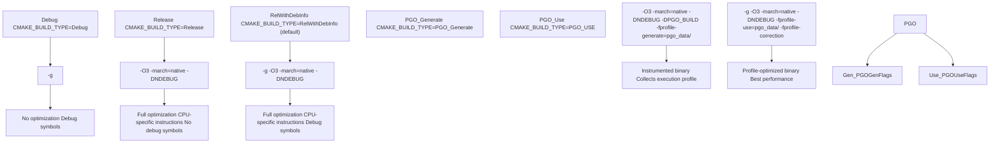
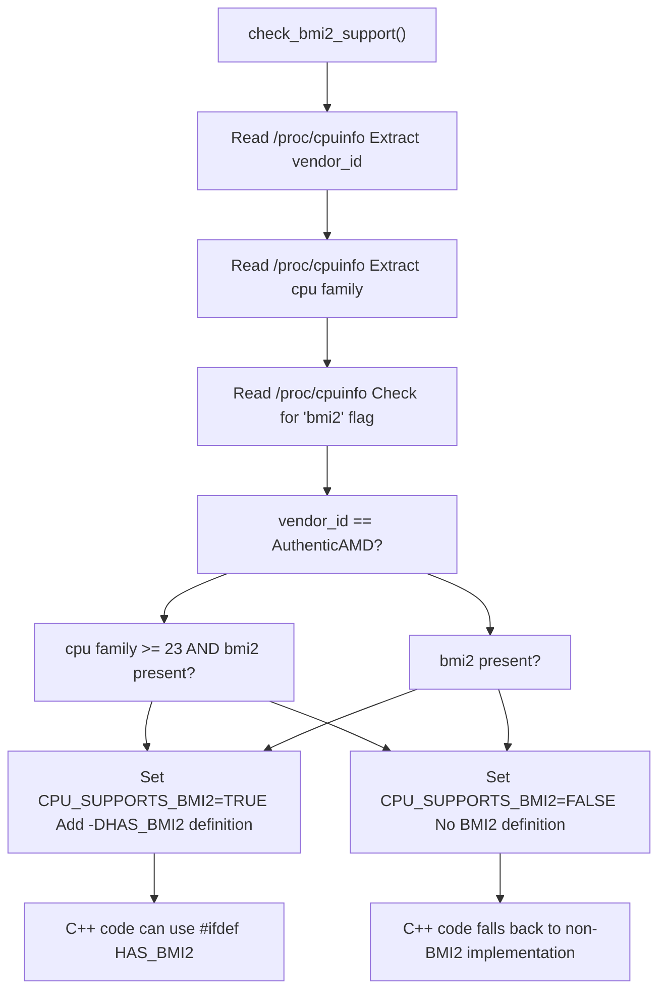
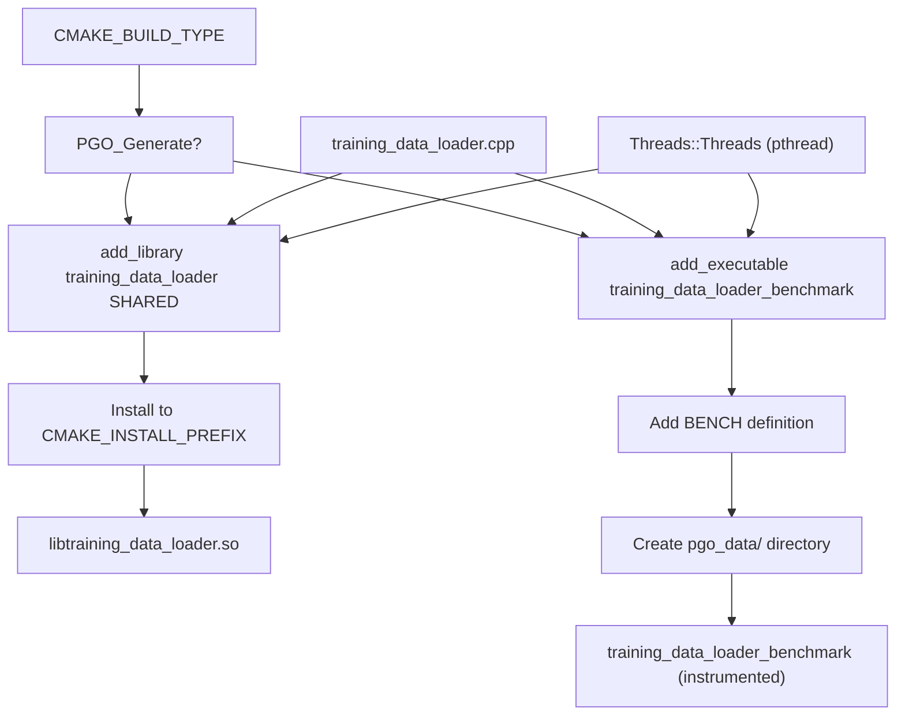

# Build System (CMake)

-   [.pgo/small.binpack](https://github.com/Chesszyh/nnue-pytorch/blob/024b2064/.pgo/small.binpack)
-   [CMakeLists.txt](https://github.com/Chesszyh/nnue-pytorch/blob/024b2064/CMakeLists.txt)
-   [compile\_data\_loader.bat](https://github.com/Chesszyh/nnue-pytorch/blob/024b2064/compile_data_loader.bat)

## Purpose and Scope

This document describes the CMake build system for the C++ data loader component of nnue-pytorch. The build system handles compilation of the native training data loader shared library, supports multiple build configurations including Profile-Guided Optimization (PGO), and automatically detects CPU features for optimization.

For details about PGO workflow and performance benefits, see [Profile-Guided Optimization (PGO)](#6.2). For the architecture of the C++ data loader itself, see [C++ Data Loader Architecture](#3.2). For overall dependency requirements, see [Dependencies and Requirements](#9.2).

## Project Configuration

The CMake project is defined in [CMakeLists.txt1-3](https://github.com/Chesszyh/nnue-pytorch/blob/024b2064/CMakeLists.txt#L1-L3) with the project name `training_data_loader` and C++ as the language. The build system requires CMake 3.10 or higher and enforces C++20 standard compliance [CMakeLists.txt19-20](https://github.com/Chesszyh/nnue-pytorch/blob/024b2064/CMakeLists.txt#L19-L20)

If no build type is explicitly specified, the system defaults to `RelWithDebInfo` [CMakeLists.txt5-7](https://github.com/Chesszyh/nnue-pytorch/blob/024b2064/CMakeLists.txt#L5-L7) which provides both optimization and debug symbols.

**Build Outputs:**

-   **Shared Library:** `libtraining_data_loader.so` (Linux) or `training_data_loader.dll` (Windows) - used by Python via ctypes
-   **Benchmark Executable:** `training_data_loader_benchmark` - used only during PGO profiling phase

Sources: [CMakeLists.txt1-20](https://github.com/Chesszyh/nnue-pytorch/blob/024b2064/CMakeLists.txt#L1-L20)

## Build Types and Compiler Flags

The build system supports five distinct build types, each with specific compiler flag configurations:


### Compiler Flags Reference

| Build Type | CXX Flags | Linker Flags | Purpose |
| --- | --- | --- | --- |
| **Debug** | `-g` | \- | Development debugging |
| **Release** | `-O3 -march=native -DNDEBUG` | \- | Production without debug symbols |
| **RelWithDebInfo** | `-g -O3 -march=native -DNDEBUG` | \- | Production with debug symbols (default) |
| **PGO\_Generate** | `-O3 -march=native -DNDEBUG -DPGO_BUILD -fprofile-generate=${PGO_PROFILE_DATA_DIR}` | `-fprofile-generate=${PGO_PROFILE_DATA_DIR}` | PGO profiling phase |
| **PGO\_Use** | `-g -O3 -march=native -DNDEBUG -fprofile-use=${PGO_PROFILE_DATA_DIR} -fprofile-correction` | \- | PGO optimized build |

**Key Flags:**

-   `-march=native`: Enables all CPU instruction sets supported by the build machine (AVX2, BMI2, etc.)
-   `-DNDEBUG`: Disables assertions in release builds
-   `-DPGO_BUILD`: Preprocessor flag indicating PGO instrumentation build
-   `-fprofile-generate`: Instruments code to collect execution profiles
-   `-fprofile-use`: Uses collected profiles to guide optimization decisions
-   `-fprofile-correction`: Adjusts for profile data inconsistencies

Sources: [CMakeLists.txt9-18](https://github.com/Chesszyh/nnue-pytorch/blob/024b2064/CMakeLists.txt#L9-L18)

## CPU Feature Detection

The build system automatically detects CPU capabilities to enable optimizations, specifically for the BMI2 (Bit Manipulation Instruction Set 2) instruction set, which is critical for efficient bitboard operations in chess.


### BMI2 Detection Logic

The `check_bmi2_support()` function [CMakeLists.txt24-51](https://github.com/Chesszyh/nnue-pytorch/blob/024b2064/CMakeLists.txt#L24-L51) implements special handling for AMD CPUs due to performance issues on older Zen architectures:

1.  **AMD CPUs:** BMI2 is only enabled if CPU family ≥ 23 (Zen 2+) AND the `bmi2` flag is present
2.  **Intel/Other CPUs:** BMI2 is enabled if the `bmi2` flag is present

This conservative approach prevents performance regressions on AMD Zen 1 CPUs, which technically support BMI2 but have slow microcode implementations.

**Detection Output:**

```
-- Adding BMI2 support    (if enabled)
-- No BMI2 support        (if disabled)
```
The result is exposed to C++ code via the `HAS_BMI2` preprocessor definition [CMakeLists.txt57](https://github.com/Chesszyh/nnue-pytorch/blob/024b2064/CMakeLists.txt#L57-L57) allowing the data loader to conditionally compile optimized bitboard manipulation routines.

Sources: [CMakeLists.txt24-60](https://github.com/Chesszyh/nnue-pytorch/blob/024b2064/CMakeLists.txt#L24-L60)

## Build Targets

The build system produces different outputs depending on the build type:


### Target: training\_data\_loader (Shared Library)

Built for all standard build types (Debug, Release, RelWithDebInfo, PGO\_Use):

-   **Source:** [training\_data\_loader.cpp](https://github.com/Chesszyh/nnue-pytorch/blob/024b2064/training_data_loader.cpp)
-   **Output:** Shared library installed to `CMAKE_INSTALL_PREFIX`
-   **Usage:** Loaded by Python via `ctypes.CDLL()` in [data\_loader/\_native.py](https://github.com/Chesszyh/nnue-pytorch/blob/024b2064/data_loader/_native.py)
-   **Linking:** Requires `Threads::Threads` (pthread)

Configuration: [CMakeLists.txt75-81](https://github.com/Chesszyh/nnue-pytorch/blob/024b2064/CMakeLists.txt#L75-L81)

### Target: training\_data\_loader\_benchmark (Executable)

Built only for `PGO_Generate` build type:

-   **Source:** [training\_data\_loader.cpp](https://github.com/Chesszyh/nnue-pytorch/blob/024b2064/training_data_loader.cpp)
-   **Output:** Standalone executable for profiling
-   **Preprocessor:** `BENCH` defined [CMakeLists.txt68](https://github.com/Chesszyh/nnue-pytorch/blob/024b2064/CMakeLists.txt#L68-L68) enables benchmark mode
-   **Linking:** Requires `Threads::Threads`
-   **Profile Data:** Writes to `${PGO_PROFILE_DATA_DIR}` during execution

Configuration: [CMakeLists.txt67-70](https://github.com/Chesszyh/nnue-pytorch/blob/024b2064/CMakeLists.txt#L67-L70)

Sources: [CMakeLists.txt62-81](https://github.com/Chesszyh/nnue-pytorch/blob/024b2064/CMakeLists.txt#L62-L81)

## Build Process

### Standard Build

For a typical development or production build:

```
# Configurecmake -S . -B build -DCMAKE_BUILD_TYPE=RelWithDebInfo# Buildcmake --build build# Install (copies shared library to current directory)cmake --build build --target install
```
After installation, Python can load the library via:

```
lib = ctypes.CDLL('./libtraining_data_loader.so')
```
### PGO Two-Phase Build

The Profile-Guided Optimization process requires two build passes, orchestrated by [compile\_data\_loader.bat1-12](https://github.com/Chesszyh/nnue-pytorch/blob/024b2064/compile_data_loader.bat#L1-L12):

> **[Mermaid sequence]**
> *(图表结构无法解析)*

**Phase 1 - Generate Profile [compile\_data\_loader.bat1-4](https://github.com/Chesszyh/nnue-pytorch/blob/024b2064/compile_data_loader.bat#L1-L4):**

1.  Configure with `CMAKE_BUILD_TYPE=PGO_Generate`
2.  Build instrumented benchmark executable
3.  Run benchmark with representative training data (e.g., `.pgo/small.binpack`)
4.  Compiler writes profile data to `build-pgo-generate/pgo_data/`

**Phase 2 - Use Profile [compile\_data\_loader.bat6-10](https://github.com/Chesszyh/nnue-pytorch/blob/024b2064/compile_data_loader.bat#L6-L10):**

1.  Configure with `CMAKE_BUILD_TYPE=PGO_Use`
2.  Pass profile data directory via `DPGO_PROFILE_DATA_DIR`
3.  Compiler optimizes hot code paths based on collected profiles
4.  Install optimized shared library to `CMAKE_INSTALL_PREFIX`

**Cleanup [compile\_data\_loader.bat12](https://github.com/Chesszyh/nnue-pytorch/blob/024b2064/compile_data_loader.bat#L12-L12):**

```
rm -rf build-pgo-generate
```
The PGO build typically yields 5-15% performance improvement for data loading. For detailed performance analysis and best practices, see [Profile-Guided Optimization (PGO)](#6.2).

Sources: [CMakeLists.txt13-18](https://github.com/Chesszyh/nnue-pytorch/blob/024b2064/CMakeLists.txt#L13-L18) [CMakeLists.txt64-74](https://github.com/Chesszyh/nnue-pytorch/blob/024b2064/CMakeLists.txt#L64-L74) [compile\_data\_loader.bat1-12](https://github.com/Chesszyh/nnue-pytorch/blob/024b2064/compile_data_loader.bat#L1-L12)

## CMake Variables Reference

Key CMake variables that control the build:

| Variable | Type | Default | Description |
| --- | --- | --- | --- |
| `CMAKE_BUILD_TYPE` | STRING | `RelWithDebInfo` | Build configuration (Debug, Release, RelWithDebInfo, PGO\_Generate, PGO\_Use) |
| `CMAKE_CXX_STANDARD` | STRING | `20` | C++ standard version required |
| `CMAKE_INSTALL_PREFIX` | PATH | Platform-dependent | Installation directory for shared library |
| `PGO_PROFILE_DATA_DIR` | PATH | `${CMAKE_BINARY_DIR}/pgo_data` | Directory for PGO profile data (.gcda files) |
| `CPU_SUPPORTS_BMI2` | BOOL | Auto-detected | Whether BMI2 instructions are enabled |

**Setting Variables:**

```
# Set build typecmake -S . -B build -DCMAKE_BUILD_TYPE=Release# Set install prefixcmake -S . -B build -DCMAKE_INSTALL_PREFIX=/usr/local# Set PGO profile directorycmake -S . -B build -DPGO_PROFILE_DATA_DIR=/path/to/profiles
```
Sources: [CMakeLists.txt5-7](https://github.com/Chesszyh/nnue-pytorch/blob/024b2064/CMakeLists.txt#L5-L7) [CMakeLists.txt14](https://github.com/Chesszyh/nnue-pytorch/blob/024b2064/CMakeLists.txt#L14-L14) [CMakeLists.txt19-20](https://github.com/Chesszyh/nnue-pytorch/blob/024b2064/CMakeLists.txt#L19-L20)

## Thread Library Dependency

The data loader requires POSIX threads (pthread) for its multi-threaded data loading architecture. The build system uses CMake's `find_package(Threads REQUIRED)` [CMakeLists.txt62](https://github.com/Chesszyh/nnue-pytorch/blob/024b2064/CMakeLists.txt#L62-L62) to locate the appropriate threading library and links it to both targets via `target_link_libraries(..., Threads::Threads)` [CMakeLists.txt69-76](https://github.com/Chesszyh/nnue-pytorch/blob/024b2064/CMakeLists.txt#L69-L76)

This dependency is critical for the C++ data loader's concurrent file reading and batch processing. For details on the threading model, see [C++ Data Loader Architecture](#3.2).

Sources: [CMakeLists.txt62](https://github.com/Chesszyh/nnue-pytorch/blob/024b2064/CMakeLists.txt#L62-L62) [CMakeLists.txt69](https://github.com/Chesszyh/nnue-pytorch/blob/024b2064/CMakeLists.txt#L69-L69) [CMakeLists.txt76](https://github.com/Chesszyh/nnue-pytorch/blob/024b2064/CMakeLists.txt#L76-L76)
