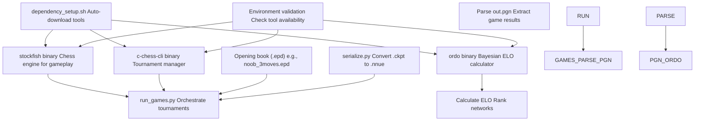

# Dependencies and Requirements

-   [.gitignore](https://github.com/Chesszyh/nnue-pytorch/blob/024b2064/.gitignore)
-   [Dockerfile.AMD](https://github.com/Chesszyh/nnue-pytorch/blob/024b2064/Dockerfile.AMD)
-   [Dockerfile.NVIDIA](https://github.com/Chesszyh/nnue-pytorch/blob/024b2064/Dockerfile.NVIDIA)
-   [README.md](https://github.com/Chesszyh/nnue-pytorch/blob/024b2064/README.md)
-   [requirements.txt](https://github.com/Chesszyh/nnue-pytorch/blob/024b2064/requirements.txt)
-   [run\_docker.sh](https://github.com/Chesszyh/nnue-pytorch/blob/024b2064/run_docker.sh)
-   [setup\_script.sh](https://github.com/Chesszyh/nnue-pytorch/blob/024b2064/setup_script.sh)

This page lists all dependencies required to run the nnue-pytorch training system, including Python packages, system-level requirements, GPU drivers, and external tools. It covers both Docker-based and local installation approaches.

For build system configuration details, see [Build System (CMake)](#9.1). For initial environment setup procedures, see [Environment Setup](#1.2).

## Python Package Dependencies

The core Python dependencies are specified in [requirements.txt1-10](https://github.com/Chesszyh/nnue-pytorch/blob/024b2064/requirements.txt#L1-L10) These packages provide the foundational infrastructure for training, data visualization, and system monitoring.

### Core Dependencies

| Package | Purpose | Version Constraint |
| --- | --- | --- |
| `lightning` | PyTorch Lightning framework for training orchestration | Latest |
| `pytorch` | Deep learning framework (installed via Docker or separately) | ≥2.0 |
| `tensorboard` | Training metrics logging and visualization | Latest |
| `numpy` | Numerical computing library | <2.0 |
| `python-chess` | Chess position manipulation and validation | \==0.31.4 |
| `matplotlib` | Plotting library for visualization scripts | Latest |
| `numba` | JIT compiler for performance-critical Python code | Latest |
| `psutil` | Process and system utilities monitoring | Latest |
| `GPUtil` | GPU monitoring and statistics | Latest |
| `asciimatics` | Terminal UI framework for `easy_train.py` dashboard | Latest |
| `requests` | HTTP library for downloading external tools | Latest |

**Note**: The constraint `numpy<2.0` is critical for compatibility with current `numba` versions, which do not yet fully support NumPy 2.x.

**Sources**: [requirements.txt1-10](https://github.com/Chesszyh/nnue-pytorch/blob/024b2064/requirements.txt#L1-L10)

### GPU-Specific Dependencies

```mermaid
flowchart TD
    NVIDIA_DOCKER["nvcr.io/nvidia/pytorch:25.03-py3 FROM Dockerfile.NVIDIA"]
    NVIDIA_TORCH["PyTorch with CUDA 12.x"]
    NVIDIA_CUPY["cupy (installed via pip)"]
    AMD_DOCKER["rocm/pytorch:rocm6.4.3_ubuntu24.04 FROM Dockerfile.AMD"]
    AMD_TORCH["PyTorch with ROCm 6.4.3"]
    AMD_CUPY["cupy with HIP backend CUPY_INSTALL_USE_HIP=1"]
    LIGHTNING["lightning module"]
    TORCH_OPS["torch.compile operations"]
    CUSTOM_CUDA["Custom CUDA kernels compile.py"]

    NVIDIA --> DOCKER_NVIDIA_TORCH
    NVIDIA --> TORCH_NVIDIA_CUPY
    AMD --> DOCKER_AMD_TORCH
    AMD --> TORCH_AMD_CUPY
    NVIDIA --> CUPY_CUSTOM_CUDA
    AMD --> CUPY_CUSTOM_CUDA
    CUSTOM --> CUDA_TORCH_OPS
    TORCH --> OPS_LIGHTNING
```


**NVIDIA Environment**:

-   Base image: `nvcr.io/nvidia/pytorch:25.03-py3` [Dockerfile.NVIDIA1](https://github.com/Chesszyh/nnue-pytorch/blob/024b2064/Dockerfile.NVIDIA#L1-L1)
-   Includes PyTorch with CUDA 12.x support
-   CuPy is automatically compatible with CUDA backend

**AMD Environment**:

-   Base image: `rocm/pytorch:rocm6.4.3_ubuntu24.04_py3.12_pytorch_release_2.6.0` [Dockerfile.AMD1](https://github.com/Chesszyh/nnue-pytorch/blob/024b2064/Dockerfile.AMD#L1-L1)
-   Includes PyTorch with ROCm 6.4.3 support
-   CuPy requires special installation: `ROCM_HOME=/opt/rocm CUPY_INSTALL_USE_HIP=1 pip install cupy` [Dockerfile.AMD14](https://github.com/Chesszyh/nnue-pytorch/blob/024b2064/Dockerfile.AMD#L14-L14)

**Sources**: [Dockerfile.NVIDIA1](https://github.com/Chesszyh/nnue-pytorch/blob/024b2064/Dockerfile.NVIDIA#L1-L1) [Dockerfile.AMD1](https://github.com/Chesszyh/nnue-pytorch/blob/024b2064/Dockerfile.AMD#L1-L1) [Dockerfile.AMD14](https://github.com/Chesszyh/nnue-pytorch/blob/024b2064/Dockerfile.AMD#L14-L14)

## System-Level Dependencies

The following system packages must be installed for C++ compilation and execution:

### Compiler and Build Tools

| Tool | Minimum Version | Purpose |
| --- | --- | --- |
| `g++` | GCC 9.0+ | C++ compiler for data loader compilation |
| `cmake` | 3.17+ | Build system configuration |
| `git` | Any | Version control and dependency cloning |
| `curl` | Any | Downloading external tools (ordo, c-chess-cli) |

These are installed in both Docker containers via [Dockerfile.NVIDIA3-7](https://github.com/Chesszyh/nnue-pytorch/blob/024b2064/Dockerfile.NVIDIA#L3-L7) and [Dockerfile.AMD3-7](https://github.com/Chesszyh/nnue-pytorch/blob/024b2064/Dockerfile.AMD#L3-L7):

```
RUN apt-get update && apt-get install -y \    g++ \    git \    curl \    && rm -rf /var/lib/apt/lists/*
```
**CPU Feature Requirements**: The C++ data loader benefits from modern CPU features:

-   **BMI2** (Bit Manipulation Instruction Set 2): Detected and enabled automatically via CMake for faster bitboard operations
-   **SIMD** (SSE4.2 / AVX2 / AVX512): Used for batch processing optimizations

**Sources**: [Dockerfile.NVIDIA3-7](https://github.com/Chesszyh/nnue-pytorch/blob/024b2064/Dockerfile.NVIDIA#L3-L7) [Dockerfile.AMD3-7](https://github.com/Chesszyh/nnue-pytorch/blob/024b2064/Dockerfile.AMD#L3-L7)

## GPU Driver Requirements

```mermaid
flowchart TD
    NVIDIA_HOST["NVIDIA Host Driver: 550+ Container Toolkit"]
    AMD_HOST["AMD Host Driver: ROCm 6.x+ Docker support"]
    NVIDIA_RUNTIME["--gpus all flag GPU device passthrough"]
    AMD_RUNTIME["--device /dev/kfd --device /dev/dri Device access"]
    CUDA_CONTAINER["CUDA 12.x toolkit Inside container"]
    ROCM_CONTAINER["ROCm 6.4.3 toolkit Inside container"]
    TRAINING["Training execution"]

    NVIDIA --> HOST_NVIDIA_RUNTIME
    AMD --> HOST_AMD_RUNTIME
    NVIDIA --> RUNTIME_CUDA_CONTAINER
    AMD --> RUNTIME_ROCM_CONTAINER
    CUDA --> CONTAINER_TRAINING
    ROCM --> CONTAINER_TRAINING
```


### NVIDIA Requirements

**Host System** [README.md15-18](https://github.com/Chesszyh/nnue-pytorch/blob/024b2064/README.md#L15-L18):

-   Docker
-   Up-to-date NVIDIA driver (≥550.x for CUDA 12.x support)
-   NVIDIA Container Toolkit

**Container Launch**: GPU access is enabled via `--gpus all` flag [run\_docker.sh18](https://github.com/Chesszyh/nnue-pytorch/blob/024b2064/run_docker.sh#L18-L18)

**Driver Documentation**: [PyTorch container release notes](https://docs.nvidia.com/deeplearning/frameworks/pytorch-release-notes/rel-25-04.html#rel-25-04)

### AMD Requirements

**Host System** [README.md11-13](https://github.com/Chesszyh/nnue-pytorch/blob/024b2064/README.md#L11-L13):

-   Docker
-   Up-to-date ROCm driver (≥6.0)

**Container Launch**: GPU access requires device passthrough [run\_docker.sh23](https://github.com/Chesszyh/nnue-pytorch/blob/024b2064/run_docker.sh#L23-L23):

```
--device /dev/kfd --device /dev/dri
```
**Driver Documentation**: [Running ROCm Docker containers](https://rocm.docs.amd.com/projects/install-on-linux/en/latest/how-to/docker.html)

**Important**: The host system's CUDA/ROCm toolkit version does not need to match the container version [README.md22](https://github.com/Chesszyh/nnue-pytorch/blob/024b2064/README.md#L22-L22) Only the driver version matters.

**Sources**: [README.md11-22](https://github.com/Chesszyh/nnue-pytorch/blob/024b2064/README.md#L11-L22) [run\_docker.sh18](https://github.com/Chesszyh/nnue-pytorch/blob/024b2064/run_docker.sh#L18-L18) [run\_docker.sh23](https://github.com/Chesszyh/nnue-pytorch/blob/024b2064/run_docker.sh#L23-L23)

## Docker Environment Setup

The Docker-based setup is the recommended approach as it eliminates local environment configuration complexity.

### Docker Build Process

```mermaid
flowchart TD
    SELECT_GPU["Select GPU vendor NVIDIA or AMD"]
    DATA_PATH["Provide data directory path"]
    DOCKERFILE["Select Dockerfile Dockerfile.NVIDIA or Dockerfile.AMD"]
    BASE_IMAGE["Pull base image PyTorch container"]
    INSTALL_DEPS["Install system packages g++, git, curl"]
    INSTALL_PY["pip install -r requirements.txt"]
    INSTALL_CUPY["Install CuPy (AMD: HIP backend)"]
    SETUP_SCRIPT["Copy setup_script.sh chmod +x"]
    MOUNT_CODE["Mount -v pwd:/workspace/nnue-pytorch"]
    MOUNT_DATA["Mount -v DATA_PATH:/data"]
    GPU_FLAGS["Apply GPU flags --gpus all OR --device /dev/kfd /dev/dri"]
    ENTRYPOINT["ENTRYPOINT setup_script.sh Compile data loader"]
    BASH["Start interactive bash"]

    SELECT --> GPU_DOCKERFILE
    DOCKERFILE --> BASE_IMAGE
    BASE --> IMAGE_INSTALL_DEPS
    INSTALL --> DEPS_INSTALL_PY
    INSTALL --> PY_INSTALL_CUPY
    INSTALL --> CUPY_SETUP_SCRIPT
    SETUP --> SCRIPT_MOUNT_CODE
    DATA --> PATH_MOUNT_DATA
    MOUNT --> CODE_GPU_FLAGS
    MOUNT --> DATA_GPU_FLAGS
    GPU --> FLAGS_ENTRYPOINT
    ENTRYPOINT --> BASH
```


### Container Launch Configuration

The [run\_docker.sh37-45](https://github.com/Chesszyh/nnue-pytorch/blob/024b2064/run_docker.sh#L37-L45) script configures the container with:

| Flag | Purpose |
| --- | --- |
| `-u $(id -u)` | Run as current user (avoid permission issues) |
| `-v $(pwd):/workspace/nnue-pytorch` | Mount source code directory |
| `-v $DATA_PATH:/data` | Mount training data directory |
| `--ipc=host` | Enable shared memory for data loaders |
| `--ulimit memlock=-1` | Unlimited locked memory for GPU operations |
| `--ulimit stack=67108864` | 64MB stack limit for deep recursion |

### Entrypoint Script

Upon container start, [setup\_script.sh3](https://github.com/Chesszyh/nnue-pytorch/blob/024b2064/setup_script.sh#L3-L3) executes:

```
sh compile_data_loader.bat
```
This compiles the C++ data loader library (`libtraining_data_loader.so` or `.dylib`) using CMake. The compiled library is placed in the repository root and loaded by Python via ctypes.

**Sources**: [run\_docker.sh1-46](https://github.com/Chesszyh/nnue-pytorch/blob/024b2064/run_docker.sh#L1-L46) [setup\_script.sh1-5](https://github.com/Chesszyh/nnue-pytorch/blob/024b2064/setup_script.sh#L1-L5) [Dockerfile.NVIDIA1-18](https://github.com/Chesszyh/nnue-pytorch/blob/024b2064/Dockerfile.NVIDIA#L1-L18) [Dockerfile.AMD1-19](https://github.com/Chesszyh/nnue-pytorch/blob/024b2064/Dockerfile.AMD#L1-L19)

## External Tool Dependencies

The evaluation pipeline requires several external tools that are automatically downloaded by `easy_train.py`:

### Chess Engine and Tournament Tools


| Tool | Purpose | Auto-Downloaded | Manual Usage |
| --- | --- | --- | --- |
| `stockfish` | Chess engine for evaluation | Yes (by `easy_train.py`) | Required for `run_games.py` |
| `c-chess-cli` | Parallel tournament manager | Yes (by `easy_train.py`) | Required for `run_games.py` |
| `ordo` | Bayesian ELO calculation | Yes (by `easy_train.py`) | Required for `run_games.py` |
| Opening book | Starting positions (.epd format) | No (user-provided) | Optional for `run_games.py` |

### Manual Tool Setup

When running `run_games.py` directly (without `easy_train.py`), tools must be specified via command-line arguments [README.md56](https://github.com/Chesszyh/nnue-pytorch/blob/024b2064/README.md#L56-L56):

```
python run_games.py \  --concurrency 16 \  --stockfish_exe ./stockfish.master \  --c_chess_exe ./c-chess-cli \  --ordo_exe ./ordo \  --book_file_name ./noob_3moves.epd \  run96
```
**Sources**: [README.md56-60](https://github.com/Chesszyh/nnue-pytorch/blob/024b2064/README.md#L56-L60)

## Version Compatibility Matrix

### Tested Configurations

| Component | NVIDIA Version | AMD Version |
| --- | --- | --- |
| Base Container | `nvcr.io/nvidia/pytorch:25.03-py3` | `rocm/pytorch:rocm6.4.3_ubuntu24.04` |
| PyTorch | ≥2.6.0 | ≥2.6.0 |
| CUDA / ROCm | CUDA 12.x | ROCm 6.4.3 |
| Python | 3.10-3.12 | 3.12 |
| GCC | 9.x - 13.x | 9.x - 13.x |
| CMake | ≥3.17 | ≥3.17 |

### Critical Version Constraints

**NumPy < 2.0**: Required for `numba` compatibility [requirements.txt8](https://github.com/Chesszyh/nnue-pytorch/blob/024b2064/requirements.txt#L8-L8)

**python-chess == 0.31.4**: Pinned version for stable PGN parsing and position validation [requirements.txt4](https://github.com/Chesszyh/nnue-pytorch/blob/024b2064/requirements.txt#L4-L4)

**PyTorch ≥ 2.0**: Required for `torch.compile` support used throughout the training code

**Lightning**: Uses latest version, which requires PyTorch 2.x

**Sources**: [requirements.txt4](https://github.com/Chesszyh/nnue-pytorch/blob/024b2064/requirements.txt#L4-L4) [requirements.txt8](https://github.com/Chesszyh/nnue-pytorch/blob/024b2064/requirements.txt#L8-L8) [Dockerfile.NVIDIA1](https://github.com/Chesszyh/nnue-pytorch/blob/024b2064/Dockerfile.NVIDIA#L1-L1) [Dockerfile.AMD1](https://github.com/Chesszyh/nnue-pytorch/blob/024b2064/Dockerfile.AMD#L1-L1)

## Disk Space Requirements

The Docker images and training artifacts require substantial disk space:

| Component | Approximate Size |
| --- | --- |
| Docker base image | 20-40 GB |
| Built Docker container | 30-60 GB |
| Training data (.bin/.binpack) | Varies (typically 100GB-1TB) |
| Checkpoints and logs | 1-10 GB per training run |
| Evaluation tools | <100 MB |

**Note**: The [README.md34](https://github.com/Chesszyh/nnue-pytorch/blob/024b2064/README.md#L34-L34) warns that building the container will take time and significant disk space (30-60GB).

**Sources**: [README.md34](https://github.com/Chesszyh/nnue-pytorch/blob/024b2064/README.md#L34-L34)

## Local Installation Alternative

While Docker is recommended, local installation is possible:

**Prerequisites**:

1.  Install Python 3.10+ with pip
2.  Install CUDA toolkit (NVIDIA) or ROCm (AMD)
3.  Install system packages: `g++`, `cmake`, `git`, `curl`
4.  Install PyTorch with GPU support from [pytorch.org](https://pytorch.org)
5.  Run: `pip install -r requirements.txt`
6.  Compile data loader: `sh compile_data_loader.bat` or `cmake` manually

**Advantages**: Smaller footprint, faster iteration for development

**Disadvantages**: Manual dependency management, potential version conflicts, platform-specific issues

For detailed build instructions, see [Build System (CMake)](#9.1).
