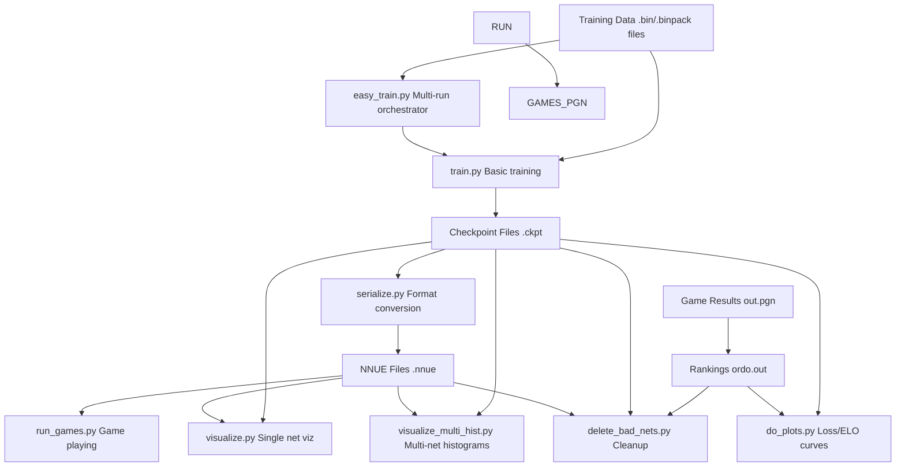
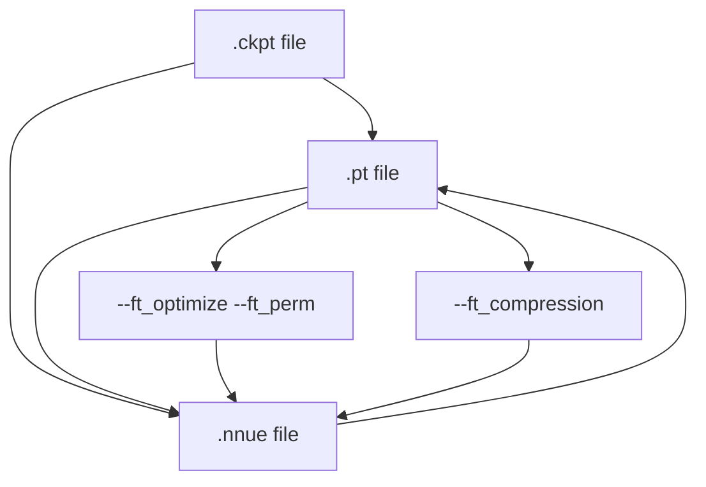
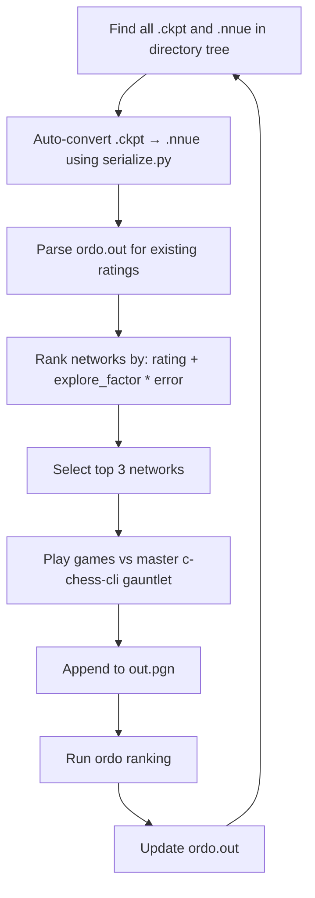
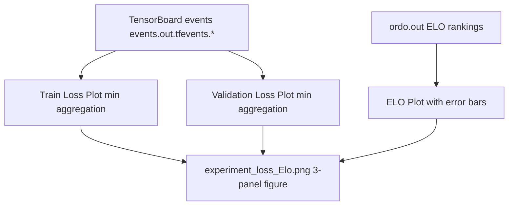
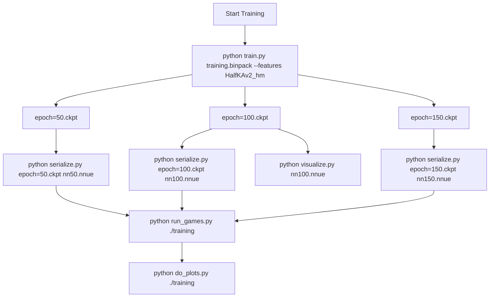

# Command-Line Reference

-   [delete\_bad\_nets.py](https://github.com/Chesszyh/nnue-pytorch/blob/024b2064/delete_bad_nets.py)
-   [do\_plots.py](https://github.com/Chesszyh/nnue-pytorch/blob/024b2064/do_plots.py)
-   [model/\_\_init\_\_.py](https://github.com/Chesszyh/nnue-pytorch/blob/024b2064/model/__init__.py)
-   [model/utils/\_\_init\_\_.py](https://github.com/Chesszyh/nnue-pytorch/blob/024b2064/model/utils/__init__.py)
-   [run\_games.py](https://github.com/Chesszyh/nnue-pytorch/blob/024b2064/run_games.py)
-   [serialize.py](https://github.com/Chesszyh/nnue-pytorch/blob/024b2064/serialize.py)
-   [train.py](https://github.com/Chesszyh/nnue-pytorch/blob/024b2064/train.py)
-   [visualize.py](https://github.com/Chesszyh/nnue-pytorch/blob/024b2064/visualize.py)
-   [visualize\_multi\_hist.py](https://github.com/Chesszyh/nnue-pytorch/blob/024b2064/visualize_multi_hist.py)

This page provides a comprehensive reference of command-line arguments for all executable scripts in the nnue-pytorch repository. For information about the training system architecture and workflow, see [Training System](#2). For details on model serialization formats, see [Model Serialization](#5).

The repository includes seven main command-line tools, organized by function:

-   **Training**: `train.py` for basic training, `easy_train.py` for orchestrated multi-run training
-   **Model Conversion**: `serialize.py` for converting between checkpoint and NNUE formats
-   **Evaluation**: `run_games.py` for automated game playing and ELO calculation
-   **Analysis**: `visualize.py`, `visualize_multi_hist.py`, `do_plots.py`, and `delete_bad_nets.py`

## Script Interaction Overview


**Sources**: [train.py1-553](https://github.com/Chesszyh/nnue-pytorch/blob/024b2064/train.py#L1-L553) [serialize.py1-186](https://github.com/Chesszyh/nnue-pytorch/blob/024b2064/serialize.py#L1-L186) [run\_games.py1-606](https://github.com/Chesszyh/nnue-pytorch/blob/024b2064/run_games.py#L1-L606) [visualize.py1-712](https://github.com/Chesszyh/nnue-pytorch/blob/024b2064/visualize.py#L1-L712) [visualize\_multi\_hist.py1-170](https://github.com/Chesszyh/nnue-pytorch/blob/024b2064/visualize_multi_hist.py#L1-L170) [do\_plots.py1-267](https://github.com/Chesszyh/nnue-pytorch/blob/024b2064/do_plots.py#L1-L267) [delete\_bad\_nets.py1-167](https://github.com/Chesszyh/nnue-pytorch/blob/024b2064/delete_bad_nets.py#L1-L167)

## train.py - Basic Training Script

The main training script for single training runs. Uses PyTorch Lightning for training orchestration.

### Usage

```
python train.py <datasets> [options]
```
### Positional Arguments

| Argument | Type | Description |
| --- | --- | --- |
| `datasets` | str (multiple) | Training datasets (.binpack or .bin files). Can specify multiple files which will be interleaved at chunk level. |

### Core Training Options

| Argument | Type | Default | Description |
| --- | --- | --- | --- |
| `--default_root_dir` | str | None | Root directory for logs and checkpoints. If None, uses current directory. |
| `--gpus` | str | None | Comma-separated list of GPU IDs (e.g., "0,1,2,3"). If None, uses all available GPUs. |
| `--max_epochs` | int | 800 | Maximum number of training epochs. |
| `--max_time` | str | "30:00:00:00" | Maximum training time in format DD:HH:MM:SS. Training stops after this duration once an epoch completes. |
| `--validation-data` | str (multiple) | None | Separate validation datasets. If not specified, training data is used for validation. |
| `--seed` | int | 42 | Random seed for PyTorch. |
| `--threads` | int | \-1 | Number of PyTorch threads. Default (-1) uses automatic detection. |

### Model Architecture Options

| Argument | Type | Default | Description |
| --- | --- | --- | --- |
| `--features` | str | (required) | Feature set name (e.g., "HalfKAv2\_hm", "HalfKAv2\_hm^"). See feature set documentation. |
| `--l1` | int | 1024 | Size of feature transformer output (L1 layer). Common values: 512, 1024, 2048. |

### Loss Function Parameters

| Argument | Type | Default | Description |
| --- | --- | --- | --- |
| `--lambda` | float | 1.0 | Interpolation between evaluations (1.0) and game outcomes (0.0). |
| `--start-lambda` | float | None | Lambda value at first epoch. Requires `--end-lambda` to be set. |
| `--end-lambda` | float | None | Lambda value at last epoch. Linear interpolation between start and end. |
| `--qp-asymmetry` | float | 0.0 | Loss adjustment when prediction > reference. |
| `--pow-exp` | float | 2.5 | Exponent for power law in mean error calculation. |
| `--in-offset` | float | 270 | Offset for converting input evaluations to win probabilities. |
| `--out-offset` | float | 270 | Offset for converting output evaluations to win probabilities. |
| `--in-scaling` | float | 340 | Scaling factor for input evaluation conversion. |
| `--out-scaling` | float | 380 | Scaling factor for output evaluation conversion. |

### Optimizer and Learning Rate

| Argument | Type | Default | Description |
| --- | --- | --- | --- |
| `--lr` | float | 8.75e-4 | Initial learning rate. |
| `--gamma` | float | 0.992 | Learning rate decay multiplier applied after each epoch. |

### Data Loading Options

| Argument | Type | Default | Description |
| --- | --- | --- | --- |
| `--num-workers` | int | 1 | Number of worker threads for data loading. Works best with binpack format. |
| `--batch-size` | int | \-1 | Positions per batch. Default is 16384. |
| `--epoch-size` | int | 100000000 | Number of positions per epoch. |
| `--validation-size` | int | 0 | Number of positions per validation step. 0 disables validation. |

### Data Filtering Options

| Argument | Type | Default | Description |
| --- | --- | --- | --- |
| `--no-smart-fen-skipping` | flag | False | Disable smart FEN skipping (skips positions that are poor training targets). |
| `--no-wld-fen-skipping` | flag | False | Disable WLD (Win/Loss/Draw) FEN skipping. |
| `--random-fen-skipping` | int | 3 | Skip positions randomly with average rate of N-1 before using one. |
| `--early-fen-skipping` | int | \-1 | Skip N plies from the start of each game. -1 disables. |
| `--simple-eval-skipping` | int | \-1 | Skip positions where abs(simple\_eval) < N. -1 disables. |

### Piece Count Distribution Parameters

| Argument | Type | Default | Description |
| --- | --- | --- | --- |
| `--pc-y1` | float | 1.0 | Piece count parameter y1 for distribution control. |
| `--pc-y2` | float | 2.0 | Piece count parameter y2 for distribution control. |
| `--pc-y3` | float | 1.0 | Piece count parameter y3 for distribution control. |

### Weighting Parameters

| Argument | Type | Default | Description |
| --- | --- | --- | --- |
| `--w1` | float | 0.0 | Weight boost parameter 1. |
| `--w2` | float | 0.5 | Weight boost parameter 2. |

### Checkpointing Options

| Argument | Type | Default | Description |
| --- | --- | --- | --- |
| `--network-save-period` | int | 20 | Save checkpoint every N epochs. |
| `--save-last-network` | bool | True | Always save the most recent checkpoint. |
| `--resume-from-model` | str | None | Initialize from .pt model file. |
| `--resume-from-checkpoint` | str | None | Resume training from .ckpt file. |

### Advanced Options

| Argument | Type | Default | Description |
| --- | --- | --- | --- |
| `--compile-backend` | str | "inductor" | PyTorch compile backend. Choices: "inductor", "cudagraphs". |
| `--param-index` | int | 0 | Index for parameter scans (hyperparameter search). |

### Example Commands

```
# Basic training with default settingspython train.py data/training_data.binpack --features HalfKAv2_hm# Multi-GPU training with custom architecturepython train.py data/*.binpack --features HalfKAv2_hm^ --l1 2048 --gpus 0,1,2,3# Training with lambda schedulingpython train.py data/train.binpack --features HalfKAv2_hm \  --start-lambda 1.0 --end-lambda 0.7 --max_epochs 400# Resume from checkpointpython train.py data/train.binpack --features HalfKAv2_hm \  --resume-from-checkpoint logs/version_0/checkpoints/epoch=100.ckpt
```
**Sources**: [train.py107-553](https://github.com/Chesszyh/nnue-pytorch/blob/024b2064/train.py#L107-L553)

## serialize.py - Model Format Conversion

Converts between PyTorch checkpoint (.ckpt), PyTorch model (.pt), and NNUE binary (.nnue) formats.

### Usage

```
python serialize.py <source> <target> [options]
```
### Positional Arguments

| Argument | Type | Description |
| --- | --- | --- |
| `source` | str | Source file (.ckpt, .pt, or .nnue). |
| `target` | str | Target file (.pt or .nnue). Cannot convert to .ckpt. |

### Output Options

| Argument | Type | Default | Description |
| --- | --- | --- | --- |
| `--out-sha` | flag | False | Save as nn-{sha12}.nnue instead of using target filename. |
| `--description` | str | None | Description string to embed in .nnue file header. |

### Compression Options

| Argument | Type | Default | Description |
| --- | --- | --- | --- |
| `--ft_compression` | str | "leb128" | Feature transformer compression. Choices: "none", "leb128". Only for .nnue output. |

### Feature Transformer Optimization

| Argument | Type | Default | Description |
| --- | --- | --- | --- |
| `--ft_perm` | str | None | Path to permutation file for FT weight reordering. |
| `--ft_optimize` | flag | False | Perform full FT optimization (very time consuming). |
| `--ft_optimize_data` | str | None | Dataset path for FT optimization. Required with `--ft_optimize`. |
| `--ft_optimize_count` | int | 10000 | Number of positions to use for FT optimization. |
| `--no-cupy` | flag | False | Disable cupy (use numpy instead). Use if GPU memory is insufficient. |
| `--device` | int | 0 | GPU device ID for cupy. |

### Model Configuration

| Argument | Type | Default | Description |
| --- | --- | --- | --- |
| `--features` | str | (required) | Feature set name matching the source model. |
| `--l1` | int | 1024 | L1 layer size matching the source model. |

### Conversion Flow Diagram


### Example Commands

```
# Basic checkpoint to NNUE conversionpython serialize.py epoch=100.ckpt output.nnue --features HalfKAv2_hm# Convert with SHA-256 namingpython serialize.py epoch=100.ckpt ./nets/ --out-sha --features HalfKAv2_hm# Convert with FT optimizationpython serialize.py epoch=100.ckpt optimized.nnue --features HalfKAv2_hm \  --ft_optimize --ft_optimize_data training_data.binpack --ft_optimize_count 50000# Convert NNUE to PyTorch modelpython serialize.py network.nnue model.pt --features HalfKAv2_hm# Convert with no compressionpython serialize.py epoch=100.ckpt output.nnue --features HalfKAv2_hm \  --ft_compression none
```
**Sources**: [serialize.py10-186](https://github.com/Chesszyh/nnue-pytorch/blob/024b2064/serialize.py#L10-L186)

## run\_games.py - Automated Game Playing and Evaluation

Continuously finds networks in a directory tree, converts them to NNUE format, plays games against a baseline, and calculates ELO ratings using ordo.

### Usage

```
python run_games.py <root_dir> [options]
```
### Positional Arguments

| Argument | Type | Description |
| --- | --- | --- |
| `root_dir` | str | Directory to recursively search for .nnue or .ckpt files. Also stores results (ordo.out, out.pgn, c\_chess.out). |

### Engine Configuration

| Argument | Type | Default | Description |
| --- | --- | --- | --- |
| `--stockfish_base` | str | "./stockfish" | Path to baseline Stockfish binary (master/reference version). |
| `--stockfish_test` | str | None | Path to test Stockfish binary. If not set, uses stockfish\_base. |
| `--c_chess_exe` | str | "./c-chess-cli" | Path to c-chess-cli tournament manager. |
| `--ordo_exe` | str | None | Path to ordo binary. If None, uses approximate calculation. |
| `--book_file_name` | str | "./noob\_3moves.epd" | Path to opening book file. |

### Game Control

| Argument | Type | Default | Description |
| --- | --- | --- | --- |
| `--time_per_game` | float | 4.0 | Base time per game in seconds. |
| `--time_increment_per_move` | float | 0.04 | Time increment per move in seconds. |
| `--nodes_per_move` | int | None | Nodes per move (overrides time control). |
| `--hash` | int | 8 | Hash table size in MB for each engine. |
| `--threads` | int | 1 | Number of threads per engine. |
| `--games_per_round` | int | 200 | Number of games to play per round. |

### Execution Control

| Argument | Type | Default | Description |
| --- | --- | --- | --- |
| `--concurrency` | int | 8 | Number of games to run concurrently. |
| `--explore_factor` | float | 1.5 | Exploration factor: expected\_improvement = rating + explore\_factor \* error. |

### Model Configuration

| Argument | Type | Default | Description |
| --- | --- | --- | --- |
| `--features` | str | (required) | Feature set for automatic .ckpt to .nnue conversion. |

### Network Selection Strategy


### Example Commands

```
# Basic usage with default settingspython run_games.py ./training_run --features HalfKAv2_hm# Custom time control and concurrencypython run_games.py ./experiments --features HalfKAv2_hm \  --time_per_game 10.0 --time_increment_per_move 0.1 --concurrency 16# Fixed nodes per move (for reproducibility)python run_games.py ./nets --features HalfKAv2_hm \  --nodes_per_move 10000 --games_per_round 400# With ordo for accurate ELOpython run_games.py ./training --features HalfKAv2_hm \  --ordo_exe ./ordo --concurrency 24
```
**Sources**: [run\_games.py26-606](https://github.com/Chesszyh/nnue-pytorch/blob/024b2064/run_games.py#L26-L606)

## visualize.py - Single Network Visualization

Generates visualizations of NNUE network weights and biases. Can compare two networks by visualizing their difference.

### Usage

```
python visualize.py <model> [options]
```
### Positional Arguments

| Argument | Type | Description |
| --- | --- | --- |
| `model` | str | Source model file (.ckpt, .pt, or .nnue). |

### Comparison Options

| Argument | Type | Default | Description |
| --- | --- | --- | --- |
| `--ref-model` | str | None | Reference model for difference visualization. |
| `--ref-features` | str | None | Feature set for reference model (default: same as source). |

### Input Weights Visualization

| Argument | Type | Default | Description |
| --- | --- | --- | --- |
| `--input-weights-vmin` | float | \-1 | Minimum color map value. If ≥ 0, plots absolute values. |
| `--input-weights-vmax` | float | 1 | Maximum color map value. |
| `--input-weights-auto-scale` | flag | False | Auto-scale color map (ignores vmin/vmax). |
| `--input-weights-order` | str | "piece-centric-flipped-king" | Weight ordering. Choices: "piece-centric-flipped-king", "king-centric". |
| `--sort-input-neurons` | flag | False | Sort neurons by L1-norm of weights. |
| `--no-input-weights` | flag | False | Skip input weights plots. |

### FC Weights Visualization

| Argument | Type | Default | Description |
| --- | --- | --- | --- |
| `--fc-weights-vmin` | float | \-2 | Minimum color map value for FC layers. |
| `--fc-weights-vmax` | float | 2 | Maximum color map value for FC layers. |
| `--fc-weights-auto-scale` | flag | False | Auto-scale FC layer color maps. |
| `--no-fc-weights` | flag | False | Skip FC weights plots. |

### General Options

| Argument | Type | Default | Description |
| --- | --- | --- | --- |
| `--no-hist` | flag | False | Don't generate histograms. |
| `--no-biases` | flag | False | Don't generate bias plots. |
| `--default-width` | int | 1600 | Default plot width in pixels. |
| `--default-height` | int | 900 | Default plot height in pixels. |
| `--save-dir` | str | None | Directory to save plots. If None, displays interactively. |
| `--dont-show` | flag | False | Don't display plots (use with --save-dir). |
| `--label` | str | None | Label for plot titles and filenames. Default: model basename. |

### Model Configuration

| Argument | Type | Default | Description |
| --- | --- | --- | --- |
| `--features` | str | (required) | Feature set name. Must be HalfKAv2\_hm or HalfKAv2\_hm^. |
| `--l1` | int | 1024 | L1 layer size. |

### Example Commands

```
# Basic visualizationpython visualize.py epoch=100.ckpt --features HalfKAv2_hm# Compare two networkspython visualize.py new.nnue --ref-model baseline.nnue --features HalfKAv2_hm# Save to directory with sorted neuronspython visualize.py model.nnue --features HalfKAv2_hm \  --sort-input-neurons --save-dir ./plots --dont-show# Custom color rangespython visualize.py model.nnue --features HalfKAv2_hm \  --input-weights-vmin -0.5 --input-weights-vmax 0.5 \  --fc-weights-auto-scale
```
**Sources**: [visualize.py551-712](https://github.com/Chesszyh/nnue-pytorch/blob/024b2064/visualize.py#L551-L712)

## visualize\_multi\_hist.py - Multi-Network Histogram Comparison

Generates histogram comparisons of weights across multiple networks. Useful for analyzing training progression.

### Usage

```
python visualize_multi_hist.py <models...> [options]
```
### Positional Arguments

| Argument | Type | Description |
| --- | --- | --- |
| `models` | str (multiple) | List of model files to compare (.ckpt, .pt, or .nnue). |

### Options

| Argument | Type | Default | Description |
| --- | --- | --- | --- |
| `--dont-show` | flag | False | Don't display plots interactively. |
| `--features` | str | (required) | Feature set name. |
| `--l1` | int | 1024 | L1 layer size. |

### Output Files

The script generates four histogram files:

-   `input_weights_hist.png` - Feature transformer weights distribution
-   `input_weights_psqt_hist.png` - PSQT weights distribution (in Stockfish units)
-   `l1_weights_hist.png` - L1 layer weights by bucket
-   `l2_weights_hist.png` - L2 layer weights by bucket
-   `output_weights_hist.png` - Output layer weights by bucket

### Example Commands

```
# Compare multiple epochspython visualize_multi_hist.py epoch=50.nnue epoch=100.nnue epoch=150.nnue \  --features HalfKAv2_hm# Compare without displayingpython visualize_multi_hist.py *.nnue --features HalfKAv2_hm --dont-show
```
**Sources**: [visualize\_multi\_hist.py57-170](https://github.com/Chesszyh/nnue-pytorch/blob/024b2064/visualize_multi_hist.py#L57-L170)

## do\_plots.py - Training Progress Visualization

Generates combined plots of training loss, validation loss, and ELO ratings from TensorBoard events and ordo output files.

### Usage

```
python do_plots.py <root_dirs...> [options]
```
### Positional Arguments

| Argument | Type | Description |
| --- | --- | --- |
| `root_dirs` | str (multiple) | Directories containing TensorBoard events and ordo.out files. |

### Options

| Argument | Type | Default | Description |
| --- | --- | --- | --- |
| `--output` | str | "experiment\_loss\_Elo.png" | Output filename for the combined plot. |
| `--elo_range` | float | 50.0 | Show ELO data within this range of the best result. |
| `--loss_range` | float | 0.004 | Show loss data within this range of the best result. |
| `--split` | flag | False | Split each root\_dir into subdirectories for separate plotting. |

### Plot Structure


### Example Commands

```
# Single experimentpython do_plots.py ./training_run# Compare multiple experimentspython do_plots.py ./experiment1 ./experiment2 ./experiment3# Custom output and rangespython do_plots.py ./training --output results.png \  --elo_range 100 --loss_range 0.01# Split subdirectoriespython do_plots.py ./multi_run_experiment --split
```
**Sources**: [do\_plots.py217-267](https://github.com/Chesszyh/nnue-pytorch/blob/024b2064/do_plots.py#L217-L267)

## delete\_bad\_nets.py - Network Cleanup Utility

Removes poorly performing networks based on ELO ratings from ordo.out, keeping only the best N networks.

### Usage

```
python delete_bad_nets.py <root_dir> [num_best_to_keep]
```
### Positional Arguments

| Argument | Type | Default | Description |
| --- | --- | --- | --- |
| `root_dir` | str | (required) | Directory to clean up (must contain ordo.out). |
| `num_best_to_keep` | int | 16 | Number of best networks to keep. |

### Behavior

1.  Parses `ordo.out` in the root directory
2.  Ranks networks by ELO rating
3.  Keeps the top N networks
4.  Deletes corresponding `.ckpt` and `.nnue` files for remaining networks
5.  Matches files by epoch number (e.g., `epoch=100.ckpt` ↔ `nn-epoch100.nnue`)

### Safety Features

-   Only deletes networks listed in `ordo.out`
-   Networks not in `ordo.out` are always preserved
-   Requires `ordo.out` to exist (exits safely if missing)
-   Handles subdirectory structures (e.g., `run_0/nn-epoch100.nnue`)

### Example Commands

```
# Keep top 16 networks (default)python delete_bad_nets.py ./training_run# Keep only top 5 networkspython delete_bad_nets.py ./training_run 5# Clean up multi-run experimentpython delete_bad_nets.py ./experiments 10
```
**Sources**: [delete\_bad\_nets.py1-167](https://github.com/Chesszyh/nnue-pytorch/blob/024b2064/delete_bad_nets.py#L1-L167)

## Common Feature Set Arguments

All training and model conversion scripts accept feature set arguments via `M.add_feature_args(parser)`. The primary argument is:

| Argument | Type | Default | Description |
| --- | --- | --- | --- |
| `--features` | str | "HalfKAv2\_hm^" | Feature set identifier. |

### Available Feature Sets

| Feature Set | Description | Real Features | Virtual Features |
| --- | --- | --- | --- |
| `HalfKP` | Half King-Piece | 40,960 | 0 |
| `HalfKA` | Half King-All pieces | 49,152 | 0 |
| `HalfKAv2` | Optimized HalfKA | 45,056 | 0 |
| `HalfKAv2_hm` | HalfKAv2 + historical moves | 22,528 | 0 |
| `HalfKAv2^` | HalfKAv2 factorized | 45,056 | ~22K |
| `HalfKAv2_hm^` | HalfKAv2\_hm factorized (default) | 22,528 | ~11K |

The `^` suffix indicates factorized feature sets with virtual features. Virtual features accelerate early training but are coalesced back to real features during serialization.

**Sources**: [model/features/\_\_init\_\_.py](https://github.com/Chesszyh/nnue-pytorch/blob/024b2064/model/features/__init__.py) [train.py376-378](https://github.com/Chesszyh/nnue-pytorch/blob/024b2064/train.py#L376-L378) [serialize.py72-76](https://github.com/Chesszyh/nnue-pytorch/blob/024b2064/serialize.py#L72-L76)

## Script Invocation Patterns

### Typical Training Workflow


### Advanced Multi-Run Workflow

For multi-run experiments with automatic evaluation, `easy_train.py` orchestrates multiple `train.py` instances and continuous `run_games.py` execution with a TUI dashboard. See [Advanced Orchestration](#2.2) for details.

**Sources**: [train.py1-553](https://github.com/Chesszyh/nnue-pytorch/blob/024b2064/train.py#L1-L553) [serialize.py1-186](https://github.com/Chesszyh/nnue-pytorch/blob/024b2064/serialize.py#L1-L186) [run\_games.py1-606](https://github.com/Chesszyh/nnue-pytorch/blob/024b2064/run_games.py#L1-L606) [do\_plots.py1-267](https://github.com/Chesszyh/nnue-pytorch/blob/024b2064/do_plots.py#L1-L267)

## Environment Variables and External Dependencies

While not command-line arguments, several scripts depend on external binaries and environment setup:

### Required Binaries for run\_games.py

| Binary | Default Path | Purpose |
| --- | --- | --- |
| c-chess-cli | `./c-chess-cli` | Tournament manager for game playing |
| stockfish | `./stockfish` | Chess engine (baseline and test versions) |
| ordo | None (optional) | Bayesian ELO calculator |

### Opening Books

Standard opening book format (EPD) is required for `run_games.py`. Default: `./noob_3moves.epd`

### PyTorch Compilation

The `--compile-backend` option in `train.py` requires PyTorch 2.0+ with appropriate backend support:

-   `inductor`: General purpose, works well with large networks
-   `cudagraphs`: Optimized for smaller networks, may reduce memory usage

**Sources**: [run\_games.py494-606](https://github.com/Chesszyh/nnue-pytorch/blob/024b2064/run_games.py#L494-L606) [train.py246-252](https://github.com/Chesszyh/nnue-pytorch/blob/024b2064/train.py#L246-L252)
