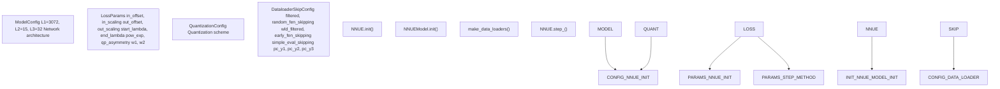
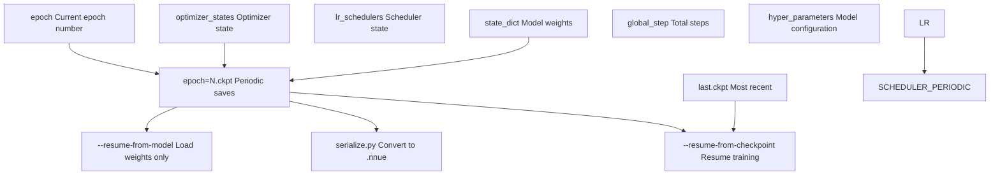
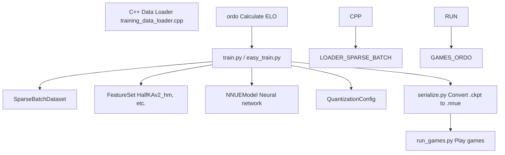

# Training System

-   [data\_loader/\_\_init\_\_.py](https://github.com/Chesszyh/nnue-pytorch/blob/024b2064/data_loader/__init__.py)
-   [data\_loader/\_native.py](https://github.com/Chesszyh/nnue-pytorch/blob/024b2064/data_loader/_native.py)
-   [data\_loader/config.py](https://github.com/Chesszyh/nnue-pytorch/blob/024b2064/data_loader/config.py)
-   [model/config.py](https://github.com/Chesszyh/nnue-pytorch/blob/024b2064/model/config.py)
-   [model/lightning\_module.py](https://github.com/Chesszyh/nnue-pytorch/blob/024b2064/model/lightning_module.py)
-   [scripts/easy\_train.py](https://github.com/Chesszyh/nnue-pytorch/blob/024b2064/scripts/easy_train.py)
-   [scripts/easy\_train\_example.bat](https://github.com/Chesszyh/nnue-pytorch/blob/024b2064/scripts/easy_train_example.bat)
-   [scripts/easy\_train\_example.sh](https://github.com/Chesszyh/nnue-pytorch/blob/024b2064/scripts/easy_train_example.sh)
-   [train.py](https://github.com/Chesszyh/nnue-pytorch/blob/024b2064/train.py)

## Purpose and Scope

The Training System provides the infrastructure for training NNUE neural networks, ranging from simple single-GPU training sessions to complex multi-GPU orchestration with automatic evaluation. This system integrates PyTorch Lightning for training management, custom data loaders for efficient position loading, and various monitoring and checkpointing capabilities.

This page provides a high-level overview of the training architecture and how components interact. For detailed information on specific subsystems:

-   Basic training script usage and configuration: see [Basic Training (train.py)](#2.1)
-   Multi-run orchestration and TUI dashboard: see [Advanced Orchestration (easy\_train.py)](#2.2)
-   Loss function implementation and parameters: see [Loss Functions and Training Configuration](#2.3)
-   Optimizer configuration and scheduling: see [Optimizer and Learning Rate Scheduling](#2.4)
-   Data loading pipeline: see [Data Pipeline](#3)
-   Model architecture details: see [Model Architecture](#4)

## Three-Tier Training Architecture

The training system is organized into three distinct tiers, each with specific responsibilities:

```mermaid
flowchart TD
    CLI["Command-Line Arguments --features, --lambda, --gpus, etc."]
    USER["User/Researcher"]
    EASY_TRAIN["easy_train.py Multi-run management"]
    ENV_CHECK["Environment Validation Python/CMake/GCC versions"]
    DEP_SETUP["Dependency Setup ordo, c-chess-cli, stockfish"]
    MULTI_RUN["TrainingRun threads GPU assignment Hyperparameter variations"]
    TUI["TUI Dashboard Real-time monitoring"]
    NET_TEST["NetworkTesting thread Automatic ELO evaluation"]
    TRAIN_PY["train.py Training configuration"]
    ARG_PARSE["Argument Parsing Feature set selection"]
    LOADER_SETUP["Data Loader Setup SparseBatchDataset FixedNumBatchesDataset"]
    MODEL_INIT["Model Initialization NNUE(feature_set, config)"]
    TRAINER_SETUP["Lightning Trainer Callbacks + Logger"]
    FIT["trainer.fit() Training execution"]
    LIGHTNING["NNUE Lightning Module model/lightning_module.py"]
    TRAIN_STEP["training_step() Forward + Loss"]
    VAL_STEP["validation_step() Validation metrics"]
    OPT_STEP["configure_optimizers() Ranger21 + StepLR"]
    CALLBACKS["Callbacks WeightClippingCallback ModelCheckpoint TimeLimitAfterCheckpoint"]

    USER --> CLI
    CLI --> EASY_TRAIN
    CLI --> TRAIN_PY
    EASY --> TRAIN_ENV_CHECK
    ENV --> CHECK_DEP_SETUP
    DEP --> SETUP_MULTI_RUN
    MULTI --> RUN_TUI
    MULTI --> RUN_NET_TEST
    MULTI --> RUN_TRAIN_PY
    TRAIN --> PY_ARG_PARSE
    ARG --> PARSE_LOADER_SETUP
    ARG --> PARSE_MODEL_INIT
    LOADER --> SETUP_TRAINER_SETUP
    MODEL --> INIT_TRAINER_SETUP
    TRAINER --> SETUP_FIT
    FIT --> LIGHTNING
    LIGHTNING --> TRAIN_STEP
    LIGHTNING --> VAL_STEP
    LIGHTNING --> OPT_STEP
    LIGHTNING --> CALLBACKS
```


**Sources:** [train.py1-550](https://github.com/Chesszyh/nnue-pytorch/blob/024b2064/train.py#L1-L550) [scripts/easy\_train.py709-967](https://github.com/Chesszyh/nnue-pytorch/blob/024b2064/scripts/easy_train.py#L709-L967) [model/lightning\_module.py16-162](https://github.com/Chesszyh/nnue-pytorch/blob/024b2064/model/lightning_module.py#L16-L162)

## Training Execution Flow

The following diagram shows the complete flow from training initiation to checkpoint creation:

```mermaid
flowchart TD
    ARGS["Command-line arguments"]
    DATASETS["Training datasets .binpack files"]
    VAL_DATASETS["Validation datasets (optional)"]
    PARSE["main() Argument parsing"]
    FEATURE_SET["get_feature_set_from_name() Feature selection"]
    LOSS_PARAMS["LossParams Loss configuration"]
    DATA_CONFIG["DataloaderSkipConfig Filtering rules"]
    MAKE_LOADERS["make_data_loaders()"]
    TRAIN_DS["SparseBatchDataset (training)"]
    VAL_DS["SparseBatchDataset (validation)"]
    FIXED_TRAIN["FixedNumBatchesDataset (epoch_size batches)"]
    FIXED_VAL["FixedNumBatchesDataset (validation_size batches)"]
    CREATE_NNUE["NNUE() Lightning module"]
    NNUE_MODEL["NNUEModel Neural network"]
    COMPILE["torch.compile() JIT optimization"]
    TRAINER["L.Trainer()"]
    TB_LOGGER["TensorBoardLogger"]
    CKPT_CB["ModelCheckpoint callback"]
    TIME_CB["TimeLimitAfterCheckpoint"]
    CLIP_CB["WeightClippingCallback"]
    TRAINER_FIT["trainer.fit(nnue, train, val)"]
    EPOCH_LOOP["For each epoch"]
    BATCH_LOOP["For each batch"]
    TRAIN_STEP_CALL["nnue.training_step()"]
    LOSS_CALC["Loss calculation"]
    BACKWARD["Backward pass"]
    OPT_UPDATE["Optimizer step"]
    CKPT_SAVE["Checkpoint save"]
    CKPT_FILES["Checkpoint files epoch=N.ckpt"]
    LOGS["TensorBoard logs"]
    FINISHED["training_finished marker"]

    ARGS --> PARSE
    DATASETS --> PARSE
    VAL --> DATASETS_PARSE
    PARSE --> FEATURE_SET
    PARSE --> LOSS_PARAMS
    PARSE --> DATA_CONFIG
    FEATURE --> SET_MAKE_LOADERS
    DATA --> CONFIG_MAKE_LOADERS
    MAKE --> LOADERS_TRAIN_DS
    MAKE --> LOADERS_VAL_DS
    TRAIN --> DS_FIXED_TRAIN
    VAL --> DS_FIXED_VAL
    FEATURE --> SET_CREATE_NNUE
    LOSS --> PARAMS_CREATE_NNUE
    CREATE --> NNUE_NNUE_MODEL
    CREATE --> NNUE_COMPILE
    COMPILE --> TRAINER
    TRAINER --> TB_LOGGER
    TRAINER --> CKPT_CB
    TRAINER --> TIME_CB
    TRAINER --> CLIP_CB
    TRAINER --> TRAINER_FIT
    FIXED --> TRAIN_TRAINER_FIT
    FIXED --> VAL_TRAINER_FIT
    TRAINER --> FIT_EPOCH_LOOP
    EPOCH --> LOOP_BATCH_LOOP
    BATCH --> LOOP_TRAIN_STEP_CALL
    TRAIN --> STEP_CALL_LOSS_CALC
    LOSS --> CALC_BACKWARD
    BACKWARD --> OPT_UPDATE
    OPT --> UPDATE_BATCH_LOOP
    EPOCH --> LOOP_CKPT_SAVE
    CKPT --> SAVE_CKPT_FILES
    TRAIN --> STEP_CALL_LOGS
    EPOCH --> LOOP_FINISHED
```


**Sources:** [train.py107-550](https://github.com/Chesszyh/nnue-pytorch/blob/024b2064/train.py#L107-L550) [train.py44-89](https://github.com/Chesszyh/nnue-pytorch/blob/024b2064/train.py#L44-L89) [model/lightning\_module.py29-162](https://github.com/Chesszyh/nnue-pytorch/blob/024b2064/model/lightning_module.py#L29-L162)

## Core Components

### train.py - Main Training Script

The `train.py` script serves as the primary entry point for training. Key responsibilities:

| Responsibility | Implementation | Line Reference |
| --- | --- | --- |
| Argument parsing | `argparse.ArgumentParser` with 30+ training parameters | [train.py108-378](https://github.com/Chesszyh/nnue-pytorch/blob/024b2064/train.py#L108-L378) |
| Data loader creation | `make_data_loaders()` function | [train.py44-89](https://github.com/Chesszyh/nnue-pytorch/blob/024b2064/train.py#L44-L89) |
| Model initialization | `NNUE()` Lightning module instantiation | [train.py428-438](https://github.com/Chesszyh/nnue-pytorch/blob/024b2064/train.py#L428-L438) |
| Training orchestration | `L.Trainer.fit()` | [train.py541-543](https://github.com/Chesszyh/nnue-pytorch/blob/024b2064/train.py#L541-L543) |
| Checkpoint management | `ModelCheckpoint` callback | [train.py490-494](https://github.com/Chesszyh/nnue-pytorch/blob/024b2064/train.py#L490-L494) |

**Critical Functions:**

-   `make_data_loaders(train_filenames, val_filenames, feature_set, num_workers, batch_size, config, epoch_size, val_size)`: Creates PyTorch DataLoaders wrapping the C++ data loader with `SparseBatchDataset` and `FixedNumBatchesDataset` [train.py44-89](https://github.com/Chesszyh/nnue-pytorch/blob/024b2064/train.py#L44-L89)
-   `main()`: Orchestrates the entire training setup and execution [train.py107-547](https://github.com/Chesszyh/nnue-pytorch/blob/024b2064/train.py#L107-L547)

**Sources:** [train.py1-553](https://github.com/Chesszyh/nnue-pytorch/blob/024b2064/train.py#L1-L553)

### NNUE Lightning Module

The `NNUE` class (in `model/lightning_module.py`) is a PyTorch Lightning module that encapsulates the neural network and training logic:

```mermaid
flowchart TD
    MODEL["self.model: NNUEModel The actual neural network"]
    LOSS_PARAMS["self.loss_params: LossParams Loss configuration"]
    LR_PARAMS["self.lr, self.gamma Learning rate parameters"]
    MAX_EPOCH["self.max_epoch Training duration"]
    FORWARD["forward(*args, **kwargs) Delegates to self.model"]
    TRAIN_STEP["training_step(batch, batch_idx) Compute training loss"]
    VAL_STEP["validation_step(batch, batch_idx) Compute validation loss"]
    STEP_["step_(batch, batch_idx, loss_type) Shared loss calculation"]
    CONFIG_OPT["configure_optimizers() Setup Ranger21 + StepLR"]
    UNPACK["Unpack batch tuple us, them, indices, values, etc."]
    MODEL_FWD["scorenet = self.model(...) Forward pass"]
    Q_CALC["q = (scorenet - offset) / scaling Network win probability"]
    P_CALC["p = (score - offset) / scaling Search win probability"]
    BLEND["pt = p * lambda + outcome * (1-lambda) Blend eval and result"]
    LOSS_CALC["loss = pow(abs(pt - q), pow_exp) Power loss function"]
    WEIGHTS["Apply position weights Based on p distance from 0.5"]

    MODEL --> FORWARD
    MODEL --> TRAIN_STEP
    MODEL --> VAL_STEP
    LOSS --> PARAMS_STEP_
    LR --> PARAMS_CONFIG_OPT
    TRAIN --> STEP_STEP_
    VAL --> STEP_STEP_
    STEP --> _UNPACK
    UNPACK --> MODEL_FWD
    MODEL --> FWD_Q_CALC
    MODEL --> FWD_P_CALC
    P --> CALC_BLEND
    Q --> CALC_BLEND
    BLEND --> LOSS_CALC
    LOSS --> CALC_WEIGHTS
```


**Sources:** [model/lightning\_module.py16-162](https://github.com/Chesszyh/nnue-pytorch/blob/024b2064/model/lightning_module.py#L16-L162)

The loss calculation in `step_()` implements a sophisticated Win-Draw-Loss (WDL) based training approach:

1.  **Network evaluation to win probability:** Converts the network's centipawn score to a win probability using sigmoid transformation [model/lightning\_module.py90-92](https://github.com/Chesszyh/nnue-pytorch/blob/024b2064/model/lightning_module.py#L90-L92)
2.  **Search evaluation to win probability:** Converts the search score (from training data) to win probability [model/lightning\_module.py94-96](https://github.com/Chesszyh/nnue-pytorch/blob/024b2064/model/lightning_module.py#L94-L96)
3.  **Lambda interpolation:** Blends the search-based probability with the actual game outcome based on `lambda` parameter that interpolates over epochs [model/lightning\_module.py98-103](https://github.com/Chesszyh/nnue-pytorch/blob/024b2064/model/lightning_module.py#L98-L103)
4.  **Power loss:** Applies a power-law loss function (default exponent 2.5) [model/lightning\_module.py106](https://github.com/Chesszyh/nnue-pytorch/blob/024b2064/model/lightning_module.py#L106-L106)
5.  **Position weighting:** Weights positions based on their search evaluation, emphasizing critical positions [model/lightning\_module.py110-111](https://github.com/Chesszyh/nnue-pytorch/blob/024b2064/model/lightning_module.py#L110-L111)

**Sources:** [model/lightning\_module.py57-115](https://github.com/Chesszyh/nnue-pytorch/blob/024b2064/model/lightning_module.py#L57-L115)

### Configuration Objects

The training system uses several configuration dataclasses:


**Sources:** [model/config.py1-25](https://github.com/Chesszyh/nnue-pytorch/blob/024b2064/model/config.py#L1-L25) [data\_loader/config.py1-43](https://github.com/Chesszyh/nnue-pytorch/blob/024b2064/data_loader/config.py#L1-L43)

| Configuration Class | Purpose | Key Parameters | File |
| --- | --- | --- | --- |
| `ModelConfig` | Network architecture dimensions | `L1` (feature transformer size), `L2`, `L3` (layer stack sizes) | [model/config.py5-10](https://github.com/Chesszyh/nnue-pytorch/blob/024b2064/model/config.py#L5-L10) |
| `LossParams` | Loss function behavior | `in_offset`, `in_scaling`, `out_offset`, `out_scaling`, `start_lambda`, `end_lambda`, `pow_exp` | [model/config.py13-25](https://github.com/Chesszyh/nnue-pytorch/blob/024b2064/model/config.py#L13-L25) |
| `QuantizationConfig` | Quantization settings | Weight and bias quantization schemes | Referenced in imports |
| `DataloaderSkipConfig` | Data filtering | `filtered`, `random_fen_skipping`, `wld_filtered`, `early_fen_skipping`, `pc_y1/y2/y3` | [data\_loader/config.py5-43](https://github.com/Chesszyh/nnue-pytorch/blob/024b2064/data_loader/config.py#L5-L43) |

**Sources:** [model/config.py1-25](https://github.com/Chesszyh/nnue-pytorch/blob/024b2064/model/config.py#L1-L25) [data\_loader/config.py1-43](https://github.com/Chesszyh/nnue-pytorch/blob/024b2064/data_loader/config.py#L1-L43)

### Training Callbacks

PyTorch Lightning callbacks provide extensibility points in the training loop:

```mermaid
flowchart TD
    WEIGHT_CLIP["WeightClippingCallback Clips weights to quantization bounds"]
    MODEL_CKPT["ModelCheckpoint Saves checkpoints periodically"]
    TIME_LIMIT["TimeLimitAfterCheckpoint Stops training after time limit"]
    TQDM["TQDMProgressBar Progress visualization"]
    ON_FIT_START["on_fit_start() Initialize timing"]
    ON_TRAIN_EPOCH_END["on_train_epoch_end() Check time limit"]
    ON_AFTER_BACKWARD["on_after_backward() Clip gradients"]
    ON_SAVE_CKPT["on_save_checkpoint() Save model state"]
    START["Training start"]
    EPOCH["Epoch end"]
    BACKWARD["After backward pass"]
    CHECKPOINT["Checkpoint save"]

    TIME --> LIMIT_ON_FIT_START
    TIME --> LIMIT_ON_TRAIN_EPOCH_END
    WEIGHT --> CLIP_ON_AFTER_BACKWARD
    MODEL --> CKPT_ON_SAVE_CKPT
    START --> ON_FIT_START
    EPOCH --> ON_TRAIN_EPOCH_END
    BACKWARD --> ON_AFTER_BACKWARD
    CHECKPOINT --> ON_SAVE_CKPT
```


**Sources:** [train.py21-42](https://github.com/Chesszyh/nnue-pytorch/blob/024b2064/train.py#L21-L42) [train.py504-509](https://github.com/Chesszyh/nnue-pytorch/blob/024b2064/train.py#L504-L509)

The `TimeLimitAfterCheckpoint` callback is particularly important for long-running training:

-   Accepts a time limit in format `DD:HH:MM:SS` [train.py23-29](https://github.com/Chesszyh/nnue-pytorch/blob/024b2064/train.py#L23-L29)
-   Records start time at training beginning [train.py32-33](https://github.com/Chesszyh/nnue-pytorch/blob/024b2064/train.py#L32-L33)
-   Checks elapsed time after each epoch and stops training gracefully [train.py35-41](https://github.com/Chesszyh/nnue-pytorch/blob/024b2064/train.py#L35-L41)

**Sources:** [train.py21-42](https://github.com/Chesszyh/nnue-pytorch/blob/024b2064/train.py#L21-L42)

## Multi-GPU Orchestration with easy\_train.py

The `easy_train.py` script provides high-level orchestration for complex training scenarios:

```mermaid
flowchart TD
    MAIN["main() function Parse arguments Setup workspace"]
    ENV_VAL["validate_environment_requirements() Check Python, CMake, GCC Check packages"]
    DEP_SETUP["Setup dependencies ordo, c-chess-cli Build or download"]
    TRAINING_RUN["TrainingRun class Thread per training run"]
    RUN_THREAD["run() method Spawn train.py subprocess"]
    STATUS_PARSE["Parse training output Extract epoch, loss, speed"]
    ITERATION_PATTERN["ITERATION_PATTERN regex Extract progress"]
    TUI_DASHBOARD["TUI Dashboard asciimatics framework"]
    RESOURCE_MON["SystemResourcesMonitor GPU/CPU/RAM usage"]
    NET_TESTING["NetworkTesting thread Play games with c-chess-cli Calculate ELO with ordo"]
    GPU_ASSIGN["GPU assignment runs-per-gpu parameter"]
    HYPERPARAMS["Hyperparameter variations Different seeds, lambda values"]
    CONCURRENT["Concurrent execution Multiple TrainingRun threads"]

    MAIN --> ENV_VAL
    ENV --> VAL_DEP_SETUP
    DEP --> SETUP_TRAINING_RUN
    TRAINING --> RUN_RUN_THREAD
    RUN --> THREAD_STATUS_PARSE
    STATUS --> PARSE_ITERATION_PATTERN
    TRAINING --> RUN_TUI_DASHBOARD
    TUI --> DASHBOARD_RESOURCE_MON
    TUI --> DASHBOARD_NET_TESTING
    TRAINING --> RUN_GPU_ASSIGN
    GPU --> ASSIGN_HYPERPARAMS
    HYPERPARAMS --> CONCURRENT
```


**Sources:** [scripts/easy\_train.py1-2300](https://github.com/Chesszyh/nnue-pytorch/blob/024b2064/scripts/easy_train.py#L1-L2300)

### TrainingRun Class

The `TrainingRun` class manages individual training processes:

| Method/Attribute | Purpose | Line Reference |
| --- | --- | --- |
| `__init__()` | Initialize training parameters, GPU assignment | [scripts/easy\_train.py722-802](https://github.com/Chesszyh/nnue-pytorch/blob/024b2064/scripts/easy_train.py#L722-L802) |
| `run()` | Execute train.py as subprocess, parse output | [scripts/easy\_train.py859-967](https://github.com/Chesszyh/nnue-pytorch/blob/024b2064/scripts/easy_train.py#L859-L967) |
| `_get_stringified_args()` | Convert parameters to command-line arguments | [scripts/easy\_train.py803-857](https://github.com/Chesszyh/nnue-pytorch/blob/024b2064/scripts/easy_train.py#L803-L857) |
| `ITERATION_PATTERN` | Regex for parsing PyTorch Lightning output | [scripts/easy\_train.py718-720](https://github.com/Chesszyh/nnue-pytorch/blob/024b2064/scripts/easy_train.py#L718-L720) |
| `current_epoch`, `current_loss` | Training progress tracking | [scripts/easy\_train.py788-789](https://github.com/Chesszyh/nnue-pytorch/blob/024b2064/scripts/easy_train.py#L788-L789) |
| `smooth_iterations_per_second` | Decaying average of training speed | [scripts/easy\_train.py791](https://github.com/Chesszyh/nnue-pytorch/blob/024b2064/scripts/easy_train.py#L791-L791) |

**Sources:** [scripts/easy\_train.py709-1034](https://github.com/Chesszyh/nnue-pytorch/blob/024b2064/scripts/easy_train.py#L709-L1034)

### Key Features of easy\_train.py

1.  **Environment Validation:** Checks for required versions of Python (≥3.7), CMake (≥3.4), GCC (≥9.2), and packages (torch, lightning, cupy, GPUtil) [scripts/easy\_train.py26-261](https://github.com/Chesszyh/nnue-pytorch/blob/024b2064/scripts/easy_train.py#L26-L261)

2.  **Dependency Management:** Automatically downloads and builds ordo and c-chess-cli if not present [scripts/easy\_train.py296-301](https://github.com/Chesszyh/nnue-pytorch/blob/024b2064/scripts/easy_train.py#L296-L301)

3.  **Multi-Run Execution:** Spawns multiple training runs with different GPU assignments and hyperparameters [scripts/easy\_train.py709-1034](https://github.com/Chesszyh/nnue-pytorch/blob/024b2064/scripts/easy_train.py#L709-L1034)

4.  **Real-Time TUI Dashboard:** Displays training progress, resource usage, and network rankings using asciimatics [scripts/easy\_train.py268-284](https://github.com/Chesszyh/nnue-pytorch/blob/024b2064/scripts/easy_train.py#L268-L284)

5.  **Automatic Network Testing:** Periodically evaluates trained networks by playing games and calculating ELO ratings [Referenced in architecture](https://github.com/Chesszyh/nnue-pytorch/blob/024b2064/Referenced in architecture)

6.  **Resume Training:** Can automatically resume from the latest checkpoint [scripts/easy\_train.py839-843](https://github.com/Chesszyh/nnue-pytorch/blob/024b2064/scripts/easy_train.py#L839-L843)


**Sources:** [scripts/easy\_train.py1-2300](https://github.com/Chesszyh/nnue-pytorch/blob/024b2064/scripts/easy_train.py#L1-L2300)

## Training Parameters

### Essential Command-Line Arguments for train.py

| Argument | Type | Default | Description |
| --- | --- | --- | --- |
| `datasets` | list\[str\] | required | Training dataset files (.binpack) |
| `--validation-data` | list\[str\] | None | Separate validation datasets |
| `--features` | str | required | Feature set name (e.g., "HalfKAv2\_hm^") |
| `--gpus` | str | None | GPU IDs to use (e.g., "0,1,2") |
| `--batch-size` | int | 16384 | Positions per batch |
| `--max-epochs` | int | 800 | Maximum training epochs |
| `--lr` | float | 8.75e-4 | Initial learning rate |
| `--gamma` | float | 0.992 | LR decay per epoch |
| `--lambda` | float | 1.0 | Eval vs. result weight (1.0 = pure eval) |
| `--start-lambda` | float | None | Lambda at first epoch |
| `--end-lambda` | float | None | Lambda at last epoch |
| `--l1` | int | 3072 | Feature transformer output size |
| `--epoch-size` | int | 100M | Positions per epoch |
| `--validation-size` | int | 0 | Positions per validation |
| `--num-workers` | int | 1 | Data loader threads |
| `--threads` | int | auto | PyTorch threads |
| `--random-fen-skipping` | int | 3 | Skip N positions randomly |
| `--no-smart-fen-skipping` | flag | False | Disable smart position filtering |
| `--no-wld-fen-skipping` | flag | False | Disable WLD filtering |
| `--network-save-period` | int | 20 | Epochs between checkpoints |
| `--resume-from-checkpoint` | str | None | Resume from .ckpt file |

**Sources:** [train.py108-375](https://github.com/Chesszyh/nnue-pytorch/blob/024b2064/train.py#L108-L375)

### Data Filtering Parameters

The `DataloaderSkipConfig` controls which positions are used for training:

| Parameter | Type | Default | Purpose |
| --- | --- | --- | --- |
| `filtered` | bool | True | Enable smart FEN filtering |
| `random_fen_skipping` | int | 3 | Skip N positions randomly before using one |
| `wld_filtered` | bool | True | Filter based on Win/Draw/Loss distribution |
| `early_fen_skipping` | int | \-1 | Skip first N plies of games |
| `simple_eval_skipping` | int | \-1 | Skip positions with abs(eval) < N |
| `param_index` | int | 0 | Parameter scan index |
| `pc_y1`, `pc_y2`, `pc_y3` | float | 1.0, 2.0, 1.0 | Piece count distribution control |

**Sources:** [data\_loader/config.py5-15](https://github.com/Chesszyh/nnue-pytorch/blob/024b2064/data_loader/config.py#L5-L15) [train.py257-280](https://github.com/Chesszyh/nnue-pytorch/blob/024b2064/train.py#L257-L280) [train.py327-376](https://github.com/Chesszyh/nnue-pytorch/blob/024b2064/train.py#L327-L376)

## Training Workflow

### Basic Training Session

A typical training session proceeds as follows:

> **[Mermaid sequence]**
> *(图表结构无法解析)*

**Sources:** [train.py107-547](https://github.com/Chesszyh/nnue-pytorch/blob/024b2064/train.py#L107-L547) [model/lightning\_module.py57-161](https://github.com/Chesszyh/nnue-pytorch/blob/024b2064/model/lightning_module.py#L57-L161)

### Multi-Run Training with easy\_train.py

For advanced training scenarios with multiple concurrent runs:

> **[Mermaid sequence]**
> *(图表结构无法解析)*

**Sources:** [scripts/easy\_train.py709-967](https://github.com/Chesszyh/nnue-pytorch/blob/024b2064/scripts/easy_train.py#L709-L967)

## Checkpoint Management

### Checkpoint Files

PyTorch Lightning automatically saves checkpoints with the following structure:


**Sources:** [train.py490-494](https://github.com/Chesszyh/nnue-pytorch/blob/024b2064/train.py#L490-L494) [train.py282-290](https://github.com/Chesszyh/nnue-pytorch/blob/024b2064/train.py#L282-L290) [scripts/easy\_train.py596-698](https://github.com/Chesszyh/nnue-pytorch/blob/024b2064/scripts/easy_train.py#L596-L698)

The `ModelCheckpoint` callback configuration:

-   `save_last=True`: Always saves the most recent checkpoint as `last.ckpt` [train.py491](https://github.com/Chesszyh/nnue-pytorch/blob/024b2064/train.py#L491-L491)
-   `every_n_epochs=network_save_period`: Saves periodic checkpoints (default: every 20 epochs) [train.py492](https://github.com/Chesszyh/nnue-pytorch/blob/024b2064/train.py#L492-L492)
-   `save_top_k=-1`: Saves all periodic checkpoints (no deletion) [train.py493](https://github.com/Chesszyh/nnue-pytorch/blob/024b2064/train.py#L493-L493)

**Sources:** [train.py490-494](https://github.com/Chesszyh/nnue-pytorch/blob/024b2064/train.py#L490-L494)

### Checkpoint Utilities

Two utility functions assist with checkpoint management in `easy_train.py`:

```
# Find the most recent checkpoint by creation timedef find_latest_checkpoint(root_dir):    """Returns path to .ckpt with latest creation date"""    # Implementation: <FileRef file-url="https://github.com/Chesszyh/nnue-pytorch/blob/024b2064/scripts/easy_train.py#L596-L605" min=596 max=605 file-path="scripts/easy_train.py">Hii</FileRef>    # Find the best checkpoint based on ELO ratingsdef find_best_checkpoint(root_dir):    """Returns path to .ckpt with highest ELO from ordo.out"""    # Implementation: <FileRef file-url="https://github.com/Chesszyh/nnue-pytorch/blob/024b2064/scripts/easy_train.py#L661-L698" min=661 max=698 file-path="scripts/easy_train.py">Hii</FileRef>
```
**Sources:** [scripts/easy\_train.py596-698](https://github.com/Chesszyh/nnue-pytorch/blob/024b2064/scripts/easy_train.py#L596-L698)

## Training Performance Considerations

### Batch Size Selection

Batch size significantly impacts training performance and memory usage:

| Batch Size | GPU Memory | Training Speed | Gradient Noise |
| --- | --- | --- | --- |
| 1024-2048 | Low (~2GB) | Slower per epoch | Higher noise |
| 8192 | Medium (~4GB) | Balanced | Medium noise |
| 16384 | High (~8GB) | Faster per epoch | Lower noise |
| 32768+ | Very high | Fastest per epoch | Lowest noise |

Default: 16384 for GPU training [train.py404-407](https://github.com/Chesszyh/nnue-pytorch/blob/024b2064/train.py#L404-L407)

**Sources:** [train.py232-237](https://github.com/Chesszyh/nnue-pytorch/blob/024b2064/train.py#L232-L237)

### Threading Configuration

The system uses multiple threading parameters:

| Parameter | Purpose | Default | Configuration |
| --- | --- | --- | --- |
| `--num-workers` | C++ data loader threads | 1 | [train.py225-230](https://github.com/Chesszyh/nnue-pytorch/blob/024b2064/train.py#L225-L230) |
| `--threads` | PyTorch threads | auto (CPU cores) | [train.py239-244](https://github.com/Chesszyh/nnue-pytorch/blob/024b2064/train.py#L239-L244) |
| GPU streams | CUDA kernel parallelism | auto | Managed by PyTorch |

**Sources:** [train.py225-244](https://github.com/Chesszyh/nnue-pytorch/blob/024b2064/train.py#L225-L244) [train.py480-482](https://github.com/Chesszyh/nnue-pytorch/blob/024b2064/train.py#L480-L482)

### Epoch Size

The `--epoch-size` parameter controls positions per epoch (default: 100M):

-   Larger epoch size: More positions between checkpoints, slower feedback
-   Smaller epoch size: More frequent checkpoints, faster feedback
-   Typical range: 1M to 100M positions [train.py306-311](https://github.com/Chesszyh/nnue-pytorch/blob/024b2064/train.py#L306-L311)

The actual number of batches per epoch is computed as: `(epoch_size + batch_size - 1) // batch_size` [train.py73](https://github.com/Chesszyh/nnue-pytorch/blob/024b2064/train.py#L73-L73)

**Sources:** [train.py306-311](https://github.com/Chesszyh/nnue-pytorch/blob/024b2064/train.py#L306-L311) [train.py72-74](https://github.com/Chesszyh/nnue-pytorch/blob/024b2064/train.py#L72-L74)

## Integration with Other Systems

The Training System integrates with several other subsystems:


For detailed information on connected systems:

-   **Data loading from .binpack files:** [Data Pipeline](#3)
-   **Feature extraction and network architecture:** [Model Architecture](#4)
-   **Converting checkpoints to deployable format:** [Model Serialization](#5)
-   **Playing games and calculating ELO:** [Evaluation and Testing](#7)

**Sources:** [train.py1-553](https://github.com/Chesszyh/nnue-pytorch/blob/024b2064/train.py#L1-L553) [scripts/easy\_train.py1-2300](https://github.com/Chesszyh/nnue-pytorch/blob/024b2064/scripts/easy_train.py#L1-L2300)
