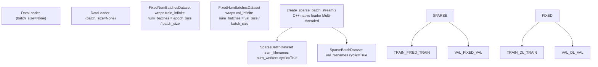
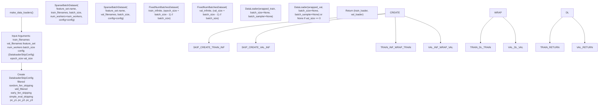
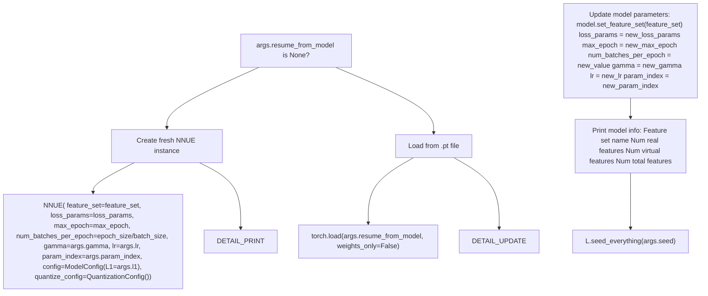
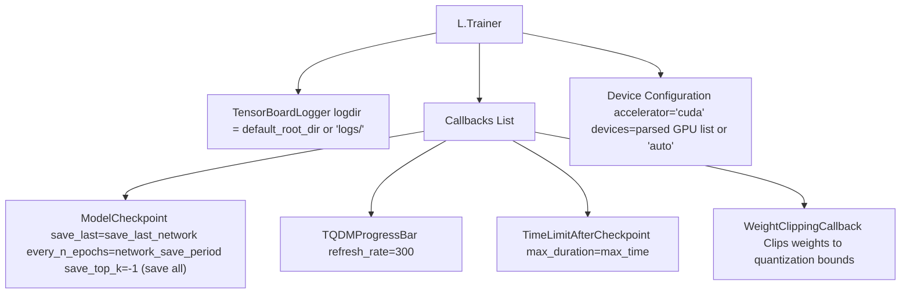
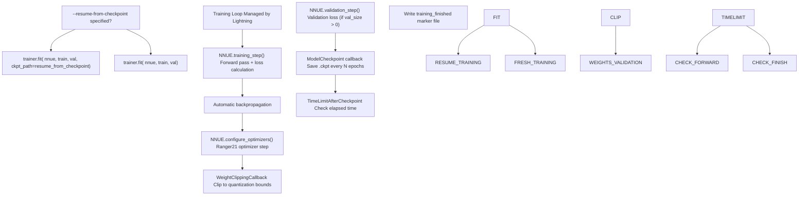

# Basic Training (train.py)

-   [data\_loader/\_\_init\_\_.py](https://github.com/Chesszyh/nnue-pytorch/blob/024b2064/data_loader/__init__.py)
-   [data\_loader/\_native.py](https://github.com/Chesszyh/nnue-pytorch/blob/024b2064/data_loader/_native.py)
-   [data\_loader/config.py](https://github.com/Chesszyh/nnue-pytorch/blob/024b2064/data_loader/config.py)
-   [model/config.py](https://github.com/Chesszyh/nnue-pytorch/blob/024b2064/model/config.py)
-   [model/lightning\_module.py](https://github.com/Chesszyh/nnue-pytorch/blob/024b2064/model/lightning_module.py)
-   [train.py](https://github.com/Chesszyh/nnue-pytorch/blob/024b2064/train.py)

## Purpose and Scope

This document describes `train.py`, the primary script for training NNUE neural networks. This script provides a command-line interface for configuring and executing single training runs using PyTorch Lightning. It handles data loading, model initialization, training loop orchestration, and checkpoint management.

For multi-GPU orchestration with automatic evaluation, see [Advanced Orchestration (easy\_train.py)](#2.2). For details about loss calculation and hyperparameters, see [Loss Functions and Training Configuration](#2.3). For optimizer details, see [Optimizer and Learning Rate Scheduling](#2.4).

**Sources:** [train.py1-553](https://github.com/Chesszyh/nnue-pytorch/blob/024b2064/train.py#L1-L553)

## Overview

The `train.py` script orchestrates the complete training process by:

1.  Parsing command-line arguments to configure the training run
2.  Creating data loaders for training and validation data
3.  Initializing or resuming the NNUE model
4.  Configuring the PyTorch Lightning Trainer with callbacks and loggers
5.  Executing the training loop via `trainer.fit()`

```mermaid
flowchart TD
    START["main() entry point"]
    PARSE["Parse command-line arguments argparse (lines 108-378)"]
    VALIDATE["Validate datasets exist Check file paths"]
    CREATE_FEATURE["Create FeatureSet get_feature_set_from_name()"]
    CREATE_LOSS["Create LossParams From CLI arguments"]
    INIT_DECISION["Resume from checkpoint?"]
    INIT_FRESH["Initialize fresh NNUE NNUE(feature_set, loss_params, ...)"]
    INIT_RESUME["Load from .pt file torch.load(resume_from_model)"]
    SEED["Set random seed L.seed_everything(args.seed)"]
    CREATE_LOADERS["Create data loaders make_data_loaders()"]
    SETUP_TRAINER["Configure Lightning Trainer callbacks, logger, devices"]
    COMPILE["Compile model torch.compile(nnue, backend)"]
    FIT_DECISION["Resume from .ckpt?"]
    FIT_RESUME["trainer.fit(nnue, train, val, ckpt_path=resume_from_checkpoint)"]
    FIT_FRESH["trainer.fit(nnue, train, val)"]
    FINISH["Write training_finished marker"]

    START --> PARSE
    PARSE --> VALIDATE
    VALIDATE --> CREATE_FEATURE
    CREATE --> FEATURE_CREATE_LOSS
    CREATE --> LOSS_INIT_DECISION
    INIT --> DECISION_INIT_RESUME
    INIT --> DECISION_INIT_FRESH
    INIT --> RESUME_SEED
    INIT --> FRESH_SEED
    SEED --> CREATE_LOADERS
    CREATE --> LOADERS_SETUP_TRAINER
    SETUP --> TRAINER_COMPILE
    COMPILE --> FIT_DECISION
    FIT --> DECISION_FIT_RESUME
    FIT --> DECISION_FIT_FRESH
    FIT --> RESUME_FINISH
    FIT --> FRESH_FINISH
```


**Execution Flow of train.py**

**Sources:** [train.py107-550](https://github.com/Chesszyh/nnue-pytorch/blob/024b2064/train.py#L107-L550)

## Command-Line Interface

The script accepts a comprehensive set of command-line arguments organized into several categories:

### Data Arguments

| Argument | Type | Default | Description |
| --- | --- | --- | --- |
| `datasets` | paths | *required* | Training datasets (.bin/.binpack). Multiple files are interleaved at chunk level |
| `--validation-data` | paths | None | Separate validation datasets. If not specified, training data is reused |
| `--num-workers` | int | 1 | Worker threads for data loading (C++ loader) |
| `--batch-size` | int | 16384 | Positions per batch. Auto-set to 16384 if not specified |

### Training Control Arguments

| Argument | Type | Default | Description |
| --- | --- | --- | --- |
| `--max-epochs` | int | 800 | Maximum number of training epochs |
| `--max-time` | str | "30:00:00:00" | Time limit in DD:HH:MM:SS format |
| `--epoch-size` | int | 100000000 | Number of positions per epoch |
| `--validation-size` | int | 0 | Number of positions per validation step (0 = no validation) |
| `--seed` | int | 42 | Random seed for reproducibility |

### Model Architecture Arguments

| Argument | Type | Default | Description |
| --- | --- | --- | --- |
| `--features` | str | varies | Feature set name (e.g., "HalfKAv2\_hm^") |
| `--l1` | int | 3072 | Feature transformer output size (L1 layer size) |

### Loss Function Arguments

| Argument | Type | Default | Description |
| --- | --- | --- | --- |
| `--lambda` | float | 1.0 | Blend between eval (1.0) and game outcome (0.0) |
| `--start-lambda` | float | None | Initial lambda value (enables lambda scheduling) |
| `--end-lambda` | float | None | Final lambda value (enables lambda scheduling) |
| `--pow-exp` | float | 2.5 | Exponent for power law in loss calculation |
| `--qp-asymmetry` | float | 0.0 | Asymmetric loss adjustment when q > p |
| `--in-offset` | float | 270 | Input score-to-WDL conversion offset |
| `--out-offset` | float | 270 | Output score-to-WDL conversion offset |
| `--in-scaling` | float | 340 | Input score-to-WDL conversion scaling |
| `--out-scaling` | float | 380 | Output score-to-WDL conversion scaling |
| `--w1` | float | 0.0 | Weight boost parameter 1 |
| `--w2` | float | 0.5 | Weight boost parameter 2 |

### Optimizer Arguments

| Argument | Type | Default | Description |
| --- | --- | --- | --- |
| `--lr` | float | 8.75e-4 | Initial learning rate |
| `--gamma` | float | 0.992 | LR decay factor per epoch |

### Data Filtering Arguments

| Argument | Type | Default | Description |
| --- | --- | --- | --- |
| `--no-smart-fen-skipping` | flag | False | Disable smart FEN filtering |
| `--no-wld-fen-skipping` | flag | False | Disable WLD-based filtering |
| `--random-fen-skipping` | int | 3 | Skip N positions randomly on average |
| `--early-fen-skipping` | int | \-1 | Skip first N plies of games (-1 = disabled) |
| `--simple-eval-skipping` | int | \-1 | Skip positions with |eval| < N (-1 = disabled) |
| `--pc-y1`, `--pc-y2`, `--pc-y3` | float | 1.0, 2.0, 1.0 | Piece count distribution parameters |

### Checkpoint and Logging Arguments

| Argument | Type | Default | Description |
| --- | --- | --- | --- |
| `--default-root-dir` | path | "logs/" | Root directory for logs and checkpoints |
| `--gpus` | str | "auto" | GPU device IDs (e.g., "0,1,2") |
| `--resume-from-model` | path | None | Initialize from .pt model file |
| `--resume-from-checkpoint` | path | None | Resume training from .ckpt file |
| `--network-save-period` | int | 20 | Save checkpoint every N epochs |
| `--save-last-network` | bool | True | Always save the most recent checkpoint |

### Performance Arguments

| Argument | Type | Default | Description |
| --- | --- | --- | --- |
| `--threads` | int | \-1 | Number of PyTorch CPU threads (-1 = auto) |
| `--compile-backend` | str | "inductor" | torch.compile backend ("inductor" or "cudagraphs") |

**Sources:** [train.py108-378](https://github.com/Chesszyh/nnue-pytorch/blob/024b2064/train.py#L108-L378)

## Data Loader Creation

The `make_data_loaders()` function creates PyTorch DataLoader instances for training and validation. The data loading architecture uses a two-layer wrapper system:


**Data Loader Architecture**

The function implements this structure:

1.  **SparseBatchDataset**: Infinite iterator over the C++ data loader stream
2.  **FixedNumBatchesDataset**: Limits the infinite stream to a fixed number of batches per epoch
3.  **DataLoader**: PyTorch wrapper (with `batch_size=None` since batching is done in C++)

**Sources:** [train.py44-89](https://github.com/Chesszyh/nnue-pytorch/blob/024b2064/train.py#L44-L89)

### Data Loader Configuration


**make\_data\_loaders() Function Flow**

**Important Note:** The DataLoader uses `batch_size=None` because batching is performed entirely by the C++ data loader. The Python DataLoader simply iterates over pre-formed batches.

**Sources:** [train.py44-89](https://github.com/Chesszyh/nnue-pytorch/blob/024b2064/train.py#L44-L89) [data\_loader/\_\_init\_\_.py1-19](https://github.com/Chesszyh/nnue-pytorch/blob/024b2064/data_loader/__init__.py#L1-L19)

## Model Initialization

The script supports two initialization modes: creating a fresh model or resuming from a saved model file.


**Model Initialization Paths**

### Fresh Model Initialization

When starting a new training run (no `--resume-from-model`), the script creates a fresh `NNUE` Lightning module:

-   **feature\_set**: Created from `--features` argument via `get_feature_set_from_name()`
-   **loss\_params**: Constructed from loss-related CLI arguments (lambda, offsets, scaling, etc.)
-   **config**: `ModelConfig` with L1 size from `--l1`
-   **quantize\_config**: Default `QuantizationConfig` instance
-   **Training hyperparameters**: lr, gamma, max\_epoch, num\_batches\_per\_epoch

**Sources:** [train.py427-438](https://github.com/Chesszyh/nnue-pytorch/blob/024b2064/train.py#L427-L438)

### Resuming from Model

When `--resume-from-model` is specified, the script loads a saved `.pt` file and updates specific parameters:

-   **Preserved**: Model architecture and learned weights
-   **Updated**: Feature set, loss parameters, training hyperparameters (lr, gamma, max\_epoch)
-   **Optimizer**: Re-created from scratch when training starts

This allows fine-tuning with different hyperparameters or loss configurations.

**Sources:** [train.py440-455](https://github.com/Chesszyh/nnue-pytorch/blob/024b2064/train.py#L440-L455)

## Trainer Configuration

The PyTorch Lightning `Trainer` is configured with specific callbacks, loggers, and device settings:


**Trainer Configuration Components**

### Callbacks

The trainer uses four callbacks:

1.  **ModelCheckpoint** [train.py490-494](https://github.com/Chesszyh/nnue-pytorch/blob/024b2064/train.py#L490-L494)

    -   Saves checkpoints every `--network-save-period` epochs
    -   Always saves the last checkpoint if `--save-last-network=True`
    -   `save_top_k=-1` ensures all checkpoints are retained
2.  **TQDMProgressBar** [train.py506](https://github.com/Chesszyh/nnue-pytorch/blob/024b2064/train.py#L506-L506)

    -   Displays training progress with 300ms refresh rate
    -   Shows loss and other metrics
3.  **TimeLimitAfterCheckpoint** [train.py21-41](https://github.com/Chesszyh/nnue-pytorch/blob/024b2064/train.py#L21-L41) [train.py507](https://github.com/Chesszyh/nnue-pytorch/blob/024b2064/train.py#L507-L507)

    -   Monitors elapsed training time
    -   Stops training gracefully after completing a checkpoint if time limit exceeded
    -   Prevents incomplete epochs at the end of training
4.  **WeightClippingCallback** [train.py508](https://github.com/Chesszyh/nnue-pytorch/blob/024b2064/train.py#L508-L508)

    -   Clips model weights to valid quantization ranges
    -   Ensures compatibility with quantized inference
    -   See [Quantization System](#4.5) for details

**Sources:** [train.py490-514](https://github.com/Chesszyh/nnue-pytorch/blob/024b2064/train.py#L490-L514) [train.py21-41](https://github.com/Chesszyh/nnue-pytorch/blob/024b2064/train.py#L21-L41)

### TensorBoard Logger

Training metrics are logged to TensorBoard:

-   **Log directory**: `<default_root_dir>/lightning_logs/version_N/`
-   **Metrics**: train\_loss, val\_loss, learning rate
-   **Access**: `tensorboard --logdir=logs/` to view training curves

**Sources:** [train.py486-488](https://github.com/Chesszyh/nnue-pytorch/blob/024b2064/train.py#L486-L488)

### Device Configuration

GPU device selection:

-   **\--gpus argument**: Comma-separated device IDs (e.g., "0,1,2")
-   **Default**: "auto" (use all available GPUs)
-   **Single GPU**: "0"
-   **CPU only**: Not explicitly supported (requires code modification)

**Sources:** [train.py499-502](https://github.com/Chesszyh/nnue-pytorch/blob/024b2064/train.py#L499-L502)

## Model Compilation

Before training begins, the model is compiled using PyTorch 2.0's `torch.compile()`:

```
nnue = torch.compile(nnue, backend=args.compile_backend)
```
-   **Backend options**: "inductor" (default) or "cudagraphs"
-   **inductor**: Better for larger networks, more flexible
-   **cudagraphs**: Better for smaller networks, lower overhead
-   **Effect**: Optimizes the model's forward pass for faster execution

**Sources:** [train.py516](https://github.com/Chesszyh/nnue-pytorch/blob/024b2064/train.py#L516-L516)

## Training Execution

The actual training is executed via the Lightning Trainer's `fit()` method:


**Training Execution Flow**

### Resume from Checkpoint

When `--resume-from-checkpoint` is provided:

-   Loads the complete training state from a `.ckpt` file
-   Restores model weights, optimizer state, and epoch counter
-   Continues training from the saved epoch
-   Useful for recovering from interruptions

**Sources:** [train.py540-543](https://github.com/Chesszyh/nnue-pytorch/blob/024b2064/train.py#L540-L543)

### Training Loop Details

The Lightning Trainer manages the training loop, which includes:

1.  **Training Step** (each batch):

    -   Call `NNUE.training_step()` [model/lightning\_module.py117-118](https://github.com/Chesszyh/nnue-pytorch/blob/024b2064/model/lightning_module.py#L117-L118)
    -   Compute forward pass through the model
    -   Calculate loss using WDL-interpolated loss function
    -   Automatic backpropagation by Lightning
2.  **Optimizer Step**:

    -   Ranger21 optimizer updates parameters
    -   Learning rate scheduling via StepLR
    -   See [Optimizer and Learning Rate Scheduling](#2.4)
3.  **Weight Clipping**:

    -   `WeightClippingCallback` clips weights after each optimizer step
    -   Maintains quantization bounds
4.  **Validation** (if validation data provided):

    -   Call `NNUE.validation_step()` [model/lightning\_module.py120-121](https://github.com/Chesszyh/nnue-pytorch/blob/024b2064/model/lightning_module.py#L120-L121)
    -   Compute validation loss without gradient updates
5.  **Checkpointing**:

    -   Save checkpoint every `--network-save-period` epochs
    -   Always save last checkpoint if enabled
6.  **Time Limit Check**:

    -   After each checkpoint, check if `--max-time` exceeded
    -   Gracefully stop training if limit reached

**Sources:** [train.py496-543](https://github.com/Chesszyh/nnue-pytorch/blob/024b2064/train.py#L496-L543) [model/lightning\_module.py16-162](https://github.com/Chesszyh/nnue-pytorch/blob/024b2064/model/lightning_module.py#L16-L162)

## Output Files

Training produces several output files:

### Checkpoint Files

Location: `<default_root_dir>/lightning_logs/version_N/checkpoints/`

| File Pattern | Description |
| --- | --- |
| `epoch=N.ckpt` | Checkpoint saved every `--network-save-period` epochs |
| `last.ckpt` | Most recent checkpoint (if `--save-last-network=True`) |

Checkpoint contents:

-   Model weights and biases
-   Optimizer state (momentum, variance estimates)
-   Learning rate scheduler state
-   Current epoch number
-   Random state

### TensorBoard Logs

Location: `<default_root_dir>/lightning_logs/version_N/`

| File | Description |
| --- | --- |
| `events.out.tfevents.*` | TensorBoard event files with metrics |
| `hparams.yaml` | Hyperparameter configuration |

### Training Completion Marker

Location: `<default_root_dir>/training_finished`

Empty file created when training completes successfully. Used by automation scripts to detect completion.

**Sources:** [train.py484-546](https://github.com/Chesszyh/nnue-pytorch/blob/024b2064/train.py#L484-L546)

## Example Usage

### Basic Training

```
python train.py \  train_data.binpack \  --gpus 0 \  --default_root_dir my_training \  --features HalfKAv2_hm^ \  --lambda 1.0 \  --max-epochs 400
```
### Training with Validation Data

```
python train.py \  train1.binpack train2.binpack \  --validation-data val.binpack \  --gpus 0,1 \  --batch-size 16384 \  --epoch-size 100000000 \  --validation-size 10000000
```
### Resuming from Checkpoint

```
python train.py \  train_data.binpack \  --resume-from-checkpoint logs/lightning_logs/version_0/checkpoints/epoch=100.ckpt \  --gpus 0 \  --max-epochs 800
```
### Fine-tuning with Different Loss Parameters

```
python train.py \  train_data.binpack \  --resume-from-model logs/lightning_logs/version_0/checkpoints/last.ckpt \  --start-lambda 1.0 \  --end-lambda 0.0 \  --lr 1e-4 \  --max-epochs 100
```
### Training with Data Filtering

```
python train.py \  train_data.binpack \  --random-fen-skipping 5 \  --early-fen-skipping 16 \  --simple-eval-skipping 10 \  --gpus 0
```
**Sources:** [train.py1-553](https://github.com/Chesszyh/nnue-pytorch/blob/024b2064/train.py#L1-L553)

## Integration with Other Components

The `train.py` script integrates with several other system components:

-   **Feature Sets**: Selected via `--features`, loaded from [model/features/](https://github.com/Chesszyh/nnue-pytorch/blob/024b2064/model/features/)
-   **Data Loading**: Uses C++ data loader via [data\_loader/](https://github.com/Chesszyh/nnue-pytorch/blob/024b2064/data_loader/) package
-   **Model Architecture**: Constructs `NNUEModel` from [model/model.py](https://github.com/Chesszyh/nnue-pytorch/blob/024b2064/model/model.py)
-   **Lightning Module**: Training logic in [model/lightning\_module.py](https://github.com/Chesszyh/nnue-pytorch/blob/024b2064/model/lightning_module.py)
-   **Optimizer**: Ranger21 from [ranger21.py](https://github.com/Chesszyh/nnue-pytorch/blob/024b2064/ranger21.py)
-   **Callbacks**: Weight clipping from [model/model.py](https://github.com/Chesszyh/nnue-pytorch/blob/024b2064/model/model.py)
-   **Serialization**: Checkpoints can be converted using [serialize.py](https://github.com/Chesszyh/nnue-pytorch/blob/024b2064/serialize.py)
-   **Evaluation**: Checkpoints can be evaluated using [run\_games.py](https://github.com/Chesszyh/nnue-pytorch/blob/024b2064/run_games.py)

**Sources:** [train.py1-553](https://github.com/Chesszyh/nnue-pytorch/blob/024b2064/train.py#L1-L553)
