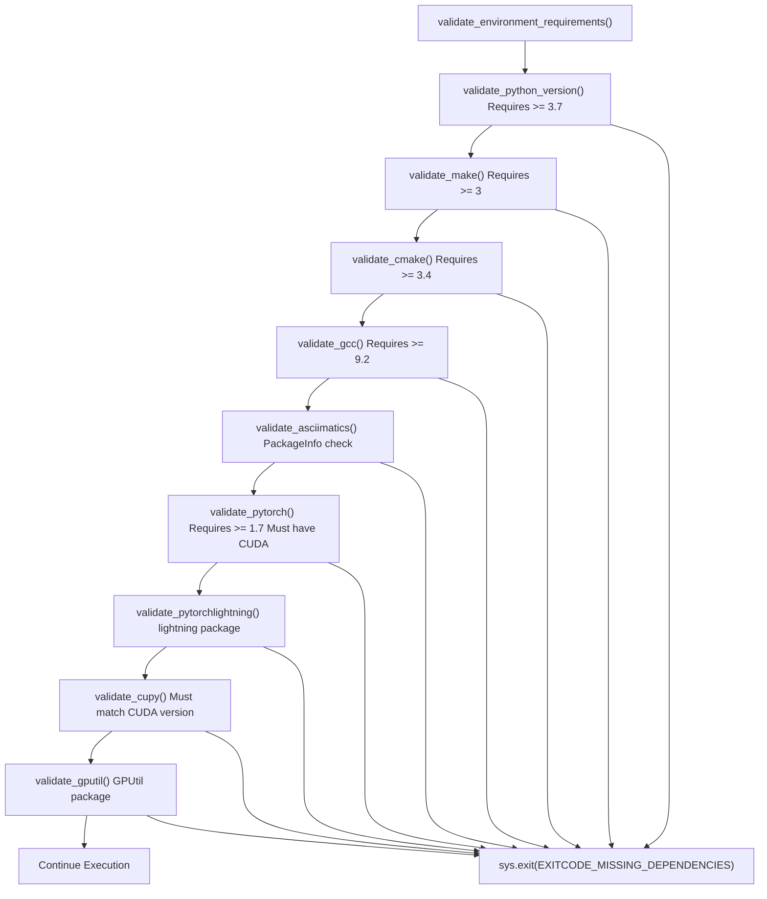
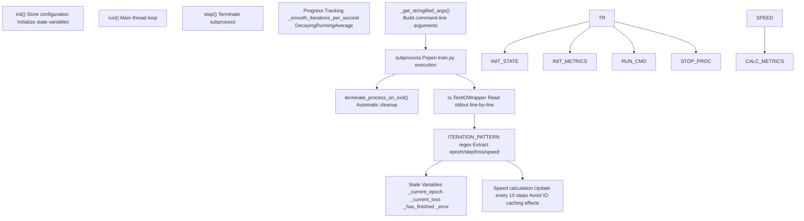
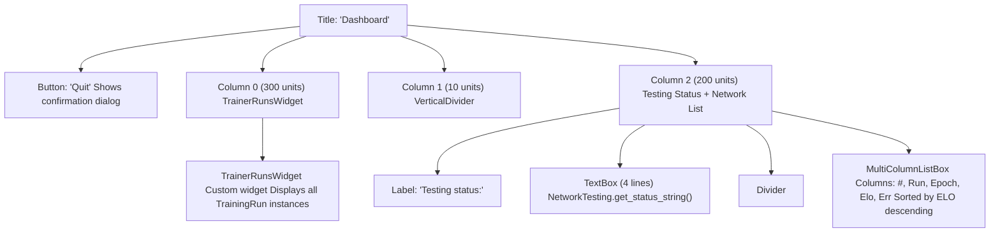
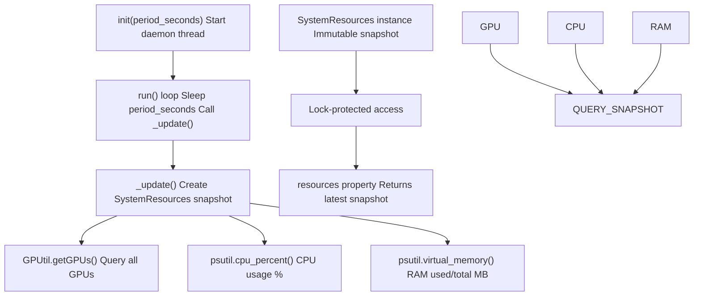
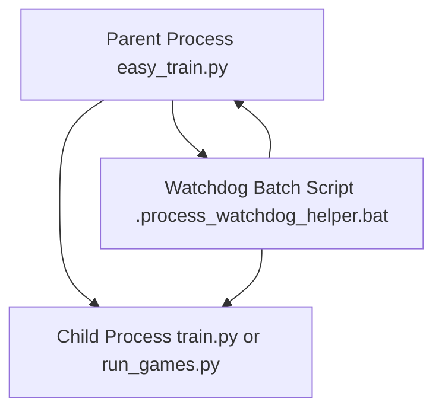

# Advanced Orchestration (easy\_train.py)

-   [scripts/easy\_train.py](https://github.com/Chesszyh/nnue-pytorch/blob/024b2064/scripts/easy_train.py)
-   [scripts/easy\_train\_example.bat](https://github.com/Chesszyh/nnue-pytorch/blob/024b2064/scripts/easy_train_example.bat)
-   [scripts/easy\_train\_example.sh](https://github.com/Chesszyh/nnue-pytorch/blob/024b2064/scripts/easy_train_example.sh)

## Purpose and Scope

This page documents `easy_train.py`, the high-level training orchestrator that provides an automated, production-grade system for training and evaluating NNUE networks. It manages multiple concurrent training runs across GPUs, automatically evaluates generated networks through chess games, and provides real-time monitoring via a terminal user interface (TUI).

For basic single-training execution, see [Basic Training (train.py)](#2.1). For the underlying evaluation system that `easy_train.py` uses, see [Running Games (run\_games.py)](#7.1) and [ELO Calculation with Ordo](#7.2).

**Sources:** [scripts/easy\_train.py1-30](https://github.com/Chesszyh/nnue-pytorch/blob/024b2064/scripts/easy_train.py#L1-L30)

## Overview

The `easy_train.py` script serves as a complete training orchestration framework that automates the entire NNUE development workflow:

1.  **Environment validation** - Verifies all required dependencies (Python packages, system tools)
2.  **Automatic dependency setup** - Downloads and builds external tools (ordo, c-chess-cli, stockfish)
3.  **Multi-GPU training orchestration** - Spawns multiple `train.py` processes with different configurations
4.  **Automated network evaluation** - Continuously tests networks through chess games
5.  **Real-time monitoring** - Provides a TUI dashboard displaying training progress, GPU usage, and ELO rankings

The script is designed for researchers running extensive hyperparameter searches or long training experiments where automated evaluation and monitoring are essential.

**Sources:** [scripts/easy\_train.py1-2952](https://github.com/Chesszyh/nnue-pytorch/blob/024b2064/scripts/easy_train.py#L1-L2952)

## System Architecture

The following diagram shows the major components of `easy_train.py` and their relationships:

```mermaid
flowchart TD
    MAIN["main() Argument parsing Orchestration setup"]
    ENV_VAL["validate_environment_requirements() Checks Python/GCC/CMake"]
    DEP_SETUP["Dependency Setup Functions setup_ordo() setup_c_chess_cli() setup_stockfish() setup_nnue_pytorch()"]
    RES_MON["SystemResourcesMonitor Daemon thread Periodic polling"]
    RES["SystemResources GPU/CPU/RAM snapshot"]
    TR_THREAD1["TrainingRun Thread 1 GPU 0, Run ID 0"]
    TR_THREAD2["TrainingRun Thread 2 GPU 0, Run ID 1"]
    TR_THREADN["TrainingRun Thread N GPU 1, Run ID 2"]
    TR_PROC1["train.py subprocess PyTorch Lightning"]
    TR_PROC2["train.py subprocess PyTorch Lightning"]
    TR_PROCN["train.py subprocess PyTorch Lightning"]
    NT_THREAD["NetworkTesting Thread Continuous evaluation"]
    NT_PROC["run_games.py subprocess c-chess-cli integration"]
    ORDO_FILE["ordo.out ELO rankings"]
    TUI_MAIN["MainView (asciimatics) TUI Dashboard"]
    TR_WIDGET["TrainerRunsWidget Training progress display"]
    NET_WIDGET["Network List Widget ELO rankings display"]

    MAIN --> ENV_VAL
    ENV --> VAL_DEP_SETUP
    DEP --> SETUP_RES_MON
    RES --> MON_RES
    MAIN --> TR_THREAD1
    MAIN --> TR_THREAD2
    MAIN --> TR_THREADN
    TR --> THREAD1_TR_PROC1
    TR --> THREAD2_TR_PROC2
    TR --> THREADN_TR_PROCN
    TR --> PROC1_NT_THREAD
    TR --> PROC2_NT_THREAD
    TR --> PROCN_NT_THREAD
    MAIN --> NT_THREAD
    NT --> THREAD_NT_PROC
    NT --> PROC_ORDO_FILE
    MAIN --> TUI_MAIN
    TUI --> MAIN_TR_WIDGET
    TUI --> MAIN_NET_WIDGET
    TR --> WIDGET_TR_THREAD1
    TR --> WIDGET_TR_THREAD2
    TR --> WIDGET_TR_THREADN
    TR --> WIDGET_RES_MON
    NET --> WIDGET_NT_THREAD
    NET --> WIDGET_ORDO_FILE
```


**Sources:** [scripts/easy\_train.py1890-1905](https://github.com/Chesszyh/nnue-pytorch/blob/024b2064/scripts/easy_train.py#L1890-L1905) [scripts/easy\_train.py709-1035](https://github.com/Chesszyh/nnue-pytorch/blob/024b2064/scripts/easy_train.py#L709-L1035) [scripts/easy\_train.py1315-1566](https://github.com/Chesszyh/nnue-pytorch/blob/024b2064/scripts/easy_train.py#L1315-L1566) [scripts/easy\_train.py1790-1888](https://github.com/Chesszyh/nnue-pytorch/blob/024b2064/scripts/easy_train.py#L1790-L1888)

## Environment Validation System

Before any training begins, `easy_train.py` performs comprehensive environment validation to ensure all dependencies are available and meet minimum version requirements.

### Validation Flow


### PackageInfo Class

The `PackageInfo` class provides a unified interface for checking Python package availability and versions:

| Method | Purpose |
| --- | --- |
| `exists` | Returns `True` if package is installed |
| `is_version_at_least(desired)` | Checks if version >= desired tuple |
| `version` | Returns version string |

Example usage in validation:

```
pkg = PackageInfo("torch")if pkg.exists and pkg.is_version_at_least((1, 7)):    # Check CUDA availability    from torch import cuda    if cuda.is_available():        return True
```
**Sources:** [scripts/easy\_train.py26-261](https://github.com/Chesszyh/nnue-pytorch/blob/024b2064/scripts/easy_train.py#L26-L261) [scripts/easy\_train.py132-160](https://github.com/Chesszyh/nnue-pytorch/blob/024b2064/scripts/easy_train.py#L132-L160) [scripts/easy\_train.py165-246](https://github.com/Chesszyh/nnue-pytorch/blob/024b2064/scripts/easy_train.py#L165-L246)

## Dependency Management

The orchestrator automatically downloads, compiles, and configures external dependencies required for network evaluation. This eliminates manual setup and ensures version consistency.

### Managed Dependencies

| Dependency | Purpose | Repository | Commit |
| --- | --- | --- | --- |
| **ordo** | Bayesian ELO calculation | michiguel/Ordo | 17eec774f2e4b9fdd2b1b38739f55ea221fb851a |
| **c-chess-cli** | Tournament manager for parallel games | lucasart/c-chess-cli | 6d08fee2e95b259c486b21a886f6911b61f676af |
| **stockfish** | Chess engine (base and test) | User-configurable | User-configurable |
| **nnue-pytorch** | Training framework | User-configurable | User-configurable |

### Dependency Setup Flow

```mermaid
flowchart TD
    GIT_DL["git_download_branch_or_commit() Downloads ZIP from GitHub API"]
    EXTRACT["zipfile extraction Strips common prefix"]
    ORDO_PATCH["Patch Makefile Add -DMINGW on Windows"]
    ORDO_MAKE["make in ordo directory"]
    ORDO_TEST["is_ordo_setup() Test --help execution"]
    CCC_PATCH["Patch make.py Set custom version string"]
    CCC_BUILD["python make.py -c gcc"]
    CCC_TEST["is_c_chess_cli_setup() Test -version execution"]
    SF_MAKE["make build ARCH=... -j..."]
    SF_TEST["is_stockfish_setup() Test compiler command"]
    NNUE_COMPILE["compile_data_loader.bat CMake + Make"]
    NNUE_TEST["is_nnue_pytorch_setup() Test data_loader/init.py"]

    GIT --> DL_EXTRACT
    EXTRACT --> ORDO_PATCH
    ORDO --> PATCH_ORDO_MAKE
    ORDO --> MAKE_ORDO_TEST
    EXTRACT --> CCC_PATCH
    CCC --> PATCH_CCC_BUILD
    CCC --> BUILD_CCC_TEST
    EXTRACT --> SF_MAKE
    SF --> MAKE_SF_TEST
    EXTRACT --> NNUE_COMPILE
    NNUE --> COMPILE_NNUE_TEST
```


### Setup Functions

Each dependency has a corresponding setup function that handles the complete build process:

-   **`setup_ordo(directory)`** - [scripts/easy\_train.py1098-1124](https://github.com/Chesszyh/nnue-pytorch/blob/024b2064/scripts/easy_train.py#L1098-L1124)

    -   Downloads from GitHub
    -   Patches Makefile for Windows compatibility (adds `-DMINGW`)
    -   Compiles with `make`
    -   Validates executable with `--help` test
-   **`setup_c_chess_cli(directory)`** - [scripts/easy\_train.py1144-1169](https://github.com/Chesszyh/nnue-pytorch/blob/024b2064/scripts/easy_train.py#L1144-L1169)

    -   Downloads from GitHub
    -   Modifies version string in `make.py` to identify custom build
    -   Compiles with Python build script
    -   Validates executable with `-version` test
-   **`setup_stockfish(directory, repo, branch_or_commit, arch, threads)`** - [scripts/easy\_train.py1189-1210](https://github.com/Chesszyh/nnue-pytorch/blob/024b2064/scripts/easy_train.py#L1189-L1210)

    -   Downloads specified branch/commit
    -   Compiles with `make build ARCH=... -j...`
    -   Supports architecture specification (e.g., `x86-64-modern`)
    -   Sets `MSYSTEM=MINGW64` environment variable on Windows
-   **`setup_nnue_pytorch(directory, repo, branch_or_commit)`** - [scripts/easy\_train.py1224-1246](https://github.com/Chesszyh/nnue-pytorch/blob/024b2064/scripts/easy_train.py#L1224-L1246)

    -   Downloads specified branch/commit
    -   Runs `compile_data_loader.bat` (works on Linux with `sh` prefix)
    -   Validates by importing data\_loader module

**Sources:** [scripts/easy\_train.py296-301](https://github.com/Chesszyh/nnue-pytorch/blob/024b2064/scripts/easy_train.py#L296-L301) [scripts/easy\_train.py1062-1246](https://github.com/Chesszyh/nnue-pytorch/blob/024b2064/scripts/easy_train.py#L1062-L1246)

## Training Run Management

The `TrainingRun` class manages individual training processes as separate threads, each running a `train.py` subprocess with specific configuration.

### TrainingRun Class Architecture


### Configuration Parameters

The `TrainingRun.__init__()` accepts extensive configuration (see [scripts/easy\_train.py722-783](https://github.com/Chesszyh/nnue-pytorch/blob/024b2064/scripts/easy_train.py#L722-L783)):

| Parameter Group | Key Parameters |
| --- | --- |
| **GPU Assignment** | `gpu_id`, `run_id` |
| **Data** | `training_datasets`, `validation_datasets` |
| **Performance** | `num_data_loader_threads`, `num_pytorch_threads`, `batch_size` |
| **Training** | `num_epochs`, `lr`, `gamma`, `lambda_`, `features` |
| **Data Filtering** | `random_fen_skipping`, `smart_fen_skipping`, `wld_fen_skipping`, `early_fen_skipping` |
| **Checkpointing** | `network_save_period`, `save_last_network`, `resume_training`, `start_from_model` |
| **Lambda Scheduling** | `start_lambda`, `end_lambda` |

### Progress Tracking

The regex pattern `ITERATION_PATTERN` extracts training progress from PyTorch Lightning's tqdm output:

```
Pattern: Epoch (\d+).*?(\d+)/(\d+).*?([0-9.eE+-]+)it/s, loss=([0-9.eE+-]+)
Example: Epoch 5: 100%|██| 1000/1000 [01:23<00:00, 12.0it/s, loss=0.234]
```
Extracted fields:

1.  Current epoch
2.  Current step in epoch
3.  Total steps in epoch
4.  Iterations per second (raw, from Lightning)
5.  Current loss value

The class computes its own speed metric to avoid PyTorch Lightning bugs with negative speeds when resuming from checkpoints [scripts/easy\_train.py900-924](https://github.com/Chesszyh/nnue-pytorch/blob/024b2064/scripts/easy_train.py#L900-L924):

```
if curr_step % 10 == 0:    self._momentary_iterations_per_second = (        curr_step - self._last_step    ) / ((curr_time - self._last_time) / 1e9)    self._smooth_iterations_per_second.update(        self._momentary_iterations_per_second    )
```
### Checkpoint Resume Logic

The resume mechanism automatically finds the latest checkpoint if `resume_training=True` [scripts/easy\_train.py838-846](https://github.com/Chesszyh/nnue-pytorch/blob/024b2064/scripts/easy_train.py#L838-L846):

```
resumed = Falseif self._resume_training:    ckpt_path = find_latest_checkpoint(self._root_dir)    if ckpt_path:        args.append(f"--resume_from_checkpoint={ckpt_path}")        resumed = Trueif self._start_from_model and not resumed:    args.append(f"--resume-from-model={self._start_from_model}")
```
The `find_latest_checkpoint()` function recursively searches for `.ckpt` files by creation time [scripts/easy\_train.py596-606](https://github.com/Chesszyh/nnue-pytorch/blob/024b2064/scripts/easy_train.py#L596-L606)

**Sources:** [scripts/easy\_train.py709-1035](https://github.com/Chesszyh/nnue-pytorch/blob/024b2064/scripts/easy_train.py#L709-L1035) [scripts/easy\_train.py718-721](https://github.com/Chesszyh/nnue-pytorch/blob/024b2064/scripts/easy_train.py#L718-L721) [scripts/easy\_train.py803-857](https://github.com/Chesszyh/nnue-pytorch/blob/024b2064/scripts/easy_train.py#L803-L857) [scripts/easy\_train.py859-967](https://github.com/Chesszyh/nnue-pytorch/blob/024b2064/scripts/easy_train.py#L859-L967)

## Network Testing System

The `NetworkTesting` class manages automated network evaluation through a separate thread that continuously converts checkpoints to `.nnue` format and plays games against a baseline.

### NetworkTesting Architecture


### Testing Parameters

| Parameter | Purpose | Default / Notes |
| --- | --- | --- |
| `num_parallel_games` | Concurrent game threads | Typically 4-24 |
| `explore_factor` | Network selection strategy | 1.5 (UCB-like exploration) |
| `book_file_path` | Opening book URL/path | UHO\_Lichess\_4852\_v1.epd.zip |
| `nodes_per_move` | Fixed-node search | 1000-20000 typical |
| `time_per_game` | Time control (seconds) | Alternative to nodes |
| `hash` | Hash table size (MB) | 8 MB typical |
| `games_per_round` | Games before ordo recalc | 200 |
| `ordo_exe` | Path to ordo executable | Auto-setup |
| `c_chess_cli_exe` | Path to c-chess-cli | Auto-setup |
| `stockfish_base_exe` | Baseline engine | Built from source |
| `stockfish_test_exe` | Test engine (loads .nnue) | Built from source |

### Running Test Entry Parsing

The `CChessCliRunningTestEntry` class parses live game results from c-chess-cli output [scripts/easy\_train.py1248-1313](https://github.com/Chesszyh/nnue-pytorch/blob/024b2064/scripts/easy_train.py#L1248-L1313):

```
Pattern: Score.*?run_(\d+).*?nn-epoch(\d+)\.nnue:\s*(\d+)\s*-\s*(\d+)\s*-\s*(\d+)
Example: Score of run_0/nn-epoch5.nnue: 45 - 30 - 125 [0.475] 200
```
The entry calculates:

-   **Performance**: `(wins + draws * 0.5) / total_games`
-   **ELO estimate**: `-400 * log10(1 / performance - 1)`
-   **95% confidence error**: `400 / sqrt(total_games)`

### Ordo Results Management

When the testing subprocess completes an ordo calculation, the thread updates its results by parsing `ordo.out` [scripts/easy\_train.py1530-1551](https://github.com/Chesszyh/nnue-pytorch/blob/024b2064/scripts/easy_train.py#L1530-L1551):

```
def _update_results_from_ordo_file(self, ordo_file_path):    new_results = []    with open(ordo_file_path, "r") as ordo_file:        lines = ordo_file.readlines()        for line in lines:            if "nn-epoch" in line:                try:                    entries.append(OrdoEntry(line=line))                except:                    pass    self._results = new_results
```
The `OrdoEntry` class extracts [scripts/easy\_train.py608-659](https://github.com/Chesszyh/nnue-pytorch/blob/024b2064/scripts/easy_train.py#L608-L659):

-   Network path
-   Run ID (from filename pattern)
-   Epoch number (from filename pattern)
-   ELO rating
-   ELO error bar

**Sources:** [scripts/easy\_train.py1315-1566](https://github.com/Chesszyh/nnue-pytorch/blob/024b2064/scripts/easy_train.py#L1315-L1566) [scripts/easy\_train.py1325-1363](https://github.com/Chesszyh/nnue-pytorch/blob/024b2064/scripts/easy_train.py#L1325-L1363) [scripts/easy\_train.py1377-1406](https://github.com/Chesszyh/nnue-pytorch/blob/024b2064/scripts/easy_train.py#L1377-L1406) [scripts/easy\_train.py1444-1523](https://github.com/Chesszyh/nnue-pytorch/blob/024b2064/scripts/easy_train.py#L1444-L1523)

## TUI Dashboard

When `--tui=True`, the orchestrator launches an asciimatics-based terminal user interface providing real-time monitoring of all training runs and network testing.

### MainView Layout


### TrainerRunsWidget Display

The `TrainerRunsWidget` custom widget renders training progress grouped by GPU [scripts/easy\_train.py1587-1788](https://github.com/Chesszyh/nnue-pytorch/blob/024b2064/scripts/easy_train.py#L1587-L1788):

**Display Format:**

```
GPU 0 - Usage: 95% 8450MB/11019MB
  Run 0 - 45.23% [ETA ~2h]
    Speed: 12.3it/s; 12582kpos/s
    Epoch: 5/9; Step: 450/1000
    Loss: 0.234567
  Run 1 - 23.45% [ETA ~5h]
    Speed: 11.8it/s; 12058kpos/s
    Epoch: 2/9; Step: 234/1000
    Loss: 0.345678

GPU 1 - Usage: 92% 7890MB/11019MB
  Run 2 - 78.90% [ETA ~30m]
    Speed: 13.1it/s; 13414kpos/s
    Epoch: 7/9; Step: 890/1000
    Loss: 0.123456
```
**ETA Calculation** [scripts/easy\_train.py1669-1673](https://github.com/Chesszyh/nnue-pytorch/blob/024b2064/scripts/easy_train.py#L1669-L1673):

```
total_steps = run.num_epochs * run.num_steps_in_epochstep = epoch * run.num_steps_in_epoch + step_in_epochcomplete_pct = step / total_steps * 100eta_seconds = (total_steps - step) / speed
```
### GPU Usage Monitoring

The widget queries the global `RESOURCE_MONITOR` (a `SystemResourcesMonitor` daemon thread) for current GPU statistics [scripts/easy\_train.py1626-1637](https://github.com/Chesszyh/nnue-pytorch/blob/024b2064/scripts/easy_train.py#L1626-L1637):

| Metric | Source |
| --- | --- |
| Compute % | `gpu.load * 100` |
| Memory Used | `gpu.memoryUsed` (MB) |
| Memory Total | `gpu.memoryTotal` (MB) |

The `SystemResourcesMonitor` polls every 2 seconds via GPUtil [scripts/easy\_train.py549-594](https://github.com/Chesszyh/nnue-pytorch/blob/024b2064/scripts/easy_train.py#L549-L594) [scripts/easy\_train.py703](https://github.com/Chesszyh/nnue-pytorch/blob/024b2064/scripts/easy_train.py#L703-L703)

### Network List Updates

The network list displays ordo rankings, updated on each frame [scripts/easy\_train.py1842-1857](https://github.com/Chesszyh/nnue-pytorch/blob/024b2064/scripts/easy_train.py#L1842-L1857):

```
def _update_network_list(self):    self._networks_view.options.clear()    for i, entry in enumerate(self._network_testing.get_ordered_results()):        self._networks_view.options.append((            [                str(i + 1),           # Rank                str(entry.run_id),    # Run ID                str(entry.epoch),     # Epoch                "",                   # Spacer                f"{entry.elo:0.1f}",  # ELO rating                f"±{entry.elo_error:0.1f}",  # Error bar            ],            i,        ))
```
**Sources:** [scripts/easy\_train.py1790-1888](https://github.com/Chesszyh/nnue-pytorch/blob/024b2064/scripts/easy_train.py#L1790-L1888) [scripts/easy\_train.py1587-1788](https://github.com/Chesszyh/nnue-pytorch/blob/024b2064/scripts/easy_train.py#L1587-L1788) [scripts/easy\_train.py549-594](https://github.com/Chesszyh/nnue-pytorch/blob/024b2064/scripts/easy_train.py#L549-L594)

## System Resource Monitoring

The `SystemResourcesMonitor` daemon thread continuously polls system resources to provide real-time metrics for the TUI dashboard and logging.

### Monitoring Architecture


### SystemResources Class

The `SystemResources` class captures a point-in-time snapshot [scripts/easy\_train.py517-547](https://github.com/Chesszyh/nnue-pytorch/blob/024b2064/scripts/easy_train.py#L517-L547):

| Property | Source | Format |
| --- | --- | --- |
| `gpus` | `GPUtil.getGPUs()` | Dict\[gpu\_id → gpu\_object\] |
| `cpu_usage` | `psutil.cpu_percent() / 100.0` | Float 0.0-1.0 |
| `ram_usage_mb` | `psutil.virtual_memory()[3] // (1024*1024)` | Integer (MB) |
| `ram_max_mb` | `psutil.virtual_memory()[0] // (1024*1024)` | Integer (MB) |

Each GPU object (from GPUtil) provides:

-   `gpu.id` - GPU index
-   `gpu.load` - Compute utilization (0.0-1.0)
-   `gpu.memoryUsed` - VRAM used (MB)
-   `gpu.memoryTotal` - Total VRAM (MB)

### Thread Safety

Access to the latest snapshot is protected by a mutex [scripts/easy\_train.py580-589](https://github.com/Chesszyh/nnue-pytorch/blob/024b2064/scripts/easy_train.py#L580-L589):

```
@propertydef resources(self):    """    Returns the most recent system resources measurement.    """    self._mutex.acquire()    try:        return self._resources    finally:        self._mutex.release()
```
The global instance is created at module level:

```
RESOURCE_MONITOR = SystemResourcesMonitor(2)  # Poll every 2 seconds
```
**Sources:** [scripts/easy\_train.py549-594](https://github.com/Chesszyh/nnue-pytorch/blob/024b2064/scripts/easy_train.py#L549-L594) [scripts/easy\_train.py517-547](https://github.com/Chesszyh/nnue-pytorch/blob/024b2064/scripts/easy_train.py#L517-L547) [scripts/easy\_train.py703](https://github.com/Chesszyh/nnue-pytorch/blob/024b2064/scripts/easy_train.py#L703-L703)

## Cross-Platform Process Management

The orchestrator includes utilities for cross-platform subprocess management and synchronization.

### Process Watchdog (Windows)

On Windows, the `terminate_process_on_exit()` function creates a watchdog that automatically terminates child processes if the parent dies unexpectedly [scripts/easy\_train.py304-342](https://github.com/Chesszyh/nnue-pytorch/blob/024b2064/scripts/easy_train.py#L304-L342):


The watchdog uses a batch script loop:

```
:waitforpidtasklist /nh /fi "pid eq %1" 2>nul | find "%1" >nulif %ERRORLEVEL%==0 (    timeout /t 5 /nobreak >nul    goto :waitforpid) else (    wmic process where processid="%2" call terminate >nul)
```
**Note:** This uses deprecated `wmic` on Windows 10 and may not work on Windows 11.

### System-Wide Mutex

The `SystemWideMutex` class provides file-based locking across processes [scripts/easy\_train.py398-483](https://github.com/Chesszyh/nnue-pytorch/blob/024b2064/scripts/easy_train.py#L398-L483):

| Platform | Implementation |
| --- | --- |
| **Windows** | Win32 Mutex API via ctypes |
| **Linux/Unix** | `fcntl.lockf()` file locking |

Windows implementation uses:

-   `CreateMutexA` - Create named mutex
-   `WaitForSingleObject` - Acquire lock (blocking)
-   `ReleaseMutex` - Release lock
-   `CloseHandle` - Cleanup

Linux implementation uses:

-   `fcntl.lockf(file, fcntl.LOCK_EX)` - Exclusive lock
-   `fcntl.lockf(file, fcntl.LOCK_UN)` - Unlock

Usage pattern:

```
with SystemWideMutex(mutex_name):    # Critical section - only one process can execute    pass
```
**Sources:** [scripts/easy\_train.py304-342](https://github.com/Chesszyh/nnue-pytorch/blob/024b2064/scripts/easy_train.py#L304-L342) [scripts/easy\_train.py372-483](https://github.com/Chesszyh/nnue-pytorch/blob/024b2064/scripts/easy_train.py#L372-L483)

## Utility Classes and Functions

### DecayingRunningAverage

Used to smooth noisy metrics like training speed [scripts/easy\_train.py485-515](https://github.com/Chesszyh/nnue-pytorch/blob/024b2064/scripts/easy_train.py#L485-L515):

```
avg = DecayingRunningAverage(decay=0.995)avg.update(12.3)  # Add new valueavg.update(11.8)print(avg.value)  # Get smoothed average
```
Formula:

```
total = total * decay + value
count = count * decay + 1.0
average = total / count
```
### Checkpoint Finding

**`find_latest_checkpoint(root_dir)`** [scripts/easy\_train.py596-606](https://github.com/Chesszyh/nnue-pytorch/blob/024b2064/scripts/easy_train.py#L596-L606)

-   Recursively searches for `*.ckpt` files
-   Returns path with latest `st_ctime_ns` (creation time)
-   Returns `None` if no checkpoints found

**`find_best_checkpoint(root_dir)`** [scripts/easy\_train.py661-699](https://github.com/Chesszyh/nnue-pytorch/blob/024b2064/scripts/easy_train.py#L661-L699)

-   Reads `ordo.out` to find highest-ELO network
-   Matches checkpoint file by run\_id and epoch
-   Falls back to `.nnue` file if `.ckpt` not found
-   Returns `None` if ordo file missing or no match

### Duration Formatting

**`duration_string_from_seconds(seconds)`** [scripts/easy\_train.py1568-1572](https://github.com/Chesszyh/nnue-pytorch/blob/024b2064/scripts/easy_train.py#L1568-L1572)

-   Format: `"H:MM:SS"`
-   Example: `"2:34:56"`

**`duration_string_from_seconds_compact(seconds)`** [scripts/easy\_train.py1575-1585](https://github.com/Chesszyh/nnue-pytorch/blob/024b2064/scripts/easy_train.py#L1575-L1585)

-   Format: `"~Xh"`, `"~Xm"`, or `"~Xs"`
-   Example: `"~2h"`, `"~34m"`, `"~12s"`

**Sources:** [scripts/easy\_train.py485-515](https://github.com/Chesszyh/nnue-pytorch/blob/024b2064/scripts/easy_train.py#L485-L515) [scripts/easy\_train.py596-699](https://github.com/Chesszyh/nnue-pytorch/blob/024b2064/scripts/easy_train.py#L596-L699) [scripts/easy\_train.py1568-1585](https://github.com/Chesszyh/nnue-pytorch/blob/024b2064/scripts/easy_train.py#L1568-L1585)

## Command-Line Interface

The orchestrator accepts extensive command-line arguments for complete control over training and testing. See [scripts/easy\_train\_example.bat](https://github.com/Chesszyh/nnue-pytorch/blob/024b2064/scripts/easy_train_example.bat) and [scripts/easy\_train\_example.sh](https://github.com/Chesszyh/nnue-pytorch/blob/024b2064/scripts/easy_train_example.sh) for full examples.

### Key Argument Groups

**Training Configuration:**

```
--training-dataset=path/to/data.binpack       # Can be repeated--validation-dataset=path/to/data.binpack     # Can be repeated--features="HalfKAv2_hm^"                     # Feature set--batch-size=16384--max_epoch=10--epoch-size=1638400                          # Positions per epoch--validation-size=16384--lr=0.001--gamma=0.995--start-lambda=1.0--end-lambda=0.75
```
**GPU/Threading:**

```
--gpus="0,"                                   # GPU IDs (trailing comma important)--runs-per-gpu=2                              # Training runs per GPU--num-workers=4                               # Data loader threads per run--threads=2                                   # PyTorch threads per run
```
**Data Filtering:**

```
--random-fen-skipping=3                       # Skip 1 in N positions--smart-fen-skipping                          # Skip duplicate positions--wld-fen-skipping                            # Skip biased W/D/L distribution--early-fen-skipping=16                       # Skip first N plies
```
**Network Testing:**

```
--do-network-testing=True--network-testing-threads=24                  # c-chess-cli concurrency--network-testing-nodes-per-move=20000        # Fixed-node search--network-testing-hash-mb=8                   # Hash table size--network-testing-games-per-round=200         # Games before ordo update--network-testing-explore-factor=1.5          # Selection strategy--network-testing-book="https://..."          # Opening book URL
```
**Dependency Configuration:**

```
--engine-base-branch=official-stockfish/Stockfish/master--engine-test-branch=official-stockfish/Stockfish/master--nnue-pytorch-branch=Sopel97/nnue-pytorch/easy_train--build-engine-arch=x86-64-modern             # Stockfish ARCH parameter--build-threads=2                             # Parallel compilation
```
**Workspace:**

```
--workspace-path=./easy_train_data            # Working directory--experiment-name=test                        # Experiment subdirectory--fail-on-experiment-exists=False             # Allow resume--resume-training=True                        # Resume from latest checkpoint
```
**UI:**

```
--tui=True                                    # Launch TUI dashboard--do-network-training=True                    # Enable training
```
**Additional Arguments:**

```
--additional-training-arg="--auto_lr_find=False"--additional-training-arg="--detect_anomaly=False"
```
### Workspace Directory Structure

```
workspace-path/
├── experiment-name/
│   ├── run_0/
│   │   ├── checkpoints/
│   │   │   ├── epoch=0.ckpt
│   │   │   ├── epoch=1.ckpt
│   │   │   └── ...
│   │   ├── nn-epoch0.nnue
│   │   ├── nn-epoch1.nnue
│   │   └── ...
│   ├── run_1/
│   │   └── ...
│   ├── ordo.out                   # ELO rankings
│   ├── out.pgn                    # Game results
│   └── training_finished          # Marker file
├── ordo/                          # ordo executable
├── c-chess-cli/                   # c-chess-cli executable
├── stockfish_base/                # Baseline engine
├── stockfish_test/                # Test engine
└── nnue-pytorch/                  # Training framework
```
**Sources:** [scripts/easy\_train\_example.bat1-38](https://github.com/Chesszyh/nnue-pytorch/blob/024b2064/scripts/easy_train_example.bat#L1-L38) [scripts/easy\_train\_example.sh1-36](https://github.com/Chesszyh/nnue-pytorch/blob/024b2064/scripts/easy_train_example.sh#L1-L36)

## Example Workflows

### Basic Multi-GPU Training

```
python easy_train.py \    --training-dataset=/data/training.binpack \    --validation-dataset=/data/validation.binpack \    --gpus="0,1," \    --runs-per-gpu=1 \    --batch-size=16384 \    --max_epoch=100 \    --features="HalfKAv2_hm^" \    --workspace-path=./experiments \    --experiment-name=baseline \    --tui=True
```
This configuration:

-   Trains 2 runs total (1 per GPU)
-   Uses interactive TUI
-   Automatically sets up all dependencies
-   Saves checkpoints to `./experiments/baseline/run_0/` and `run_1/`

### Hyperparameter Search with Automated Evaluation

```
python easy_train.py \    --training-dataset=/data/large.binpack \    --gpus="0," \    --runs-per-gpu=3 \    --batch-size=8192 \    --max_epoch=50 \    --do-network-testing=True \    --network-testing-nodes-per-move=5000 \    --network-testing-games-per-round=100 \    --additional-training-arg="--lr=0.001" \    --additional-training-arg="--lr=0.002" \    --additional-training-arg="--lr=0.003"
```
**Note:** The `--additional-training-arg` mechanism doesn't automatically vary parameters across runs. For true hyperparameter sweeps, you would need to:

1.  Run `easy_train.py` multiple times with different `--experiment-name` values
2.  Modify the script to generate different args per run\_id
3.  Use external orchestration (shell scripts, grid search tools)

### Resume Training After Interruption

```
python easy_train.py \    --training-dataset=/data/training.binpack \    --workspace-path=./experiments \    --experiment-name=baseline \    --resume-training=True \    --fail-on-experiment-exists=False \    --gpus="0," \    --runs-per-gpu=1 \    --max_epoch=100
```
The orchestrator will:

1.  Find the latest checkpoint in each `run_N/` directory
2.  Resume training from that checkpoint
3.  Continue until `max_epoch` is reached

### Network Testing Only (No Training)

```
python easy_train.py \    --workspace-path=./experiments \    --experiment-name=completed_run \    --do-network-training=False \    --do-network-testing=True \    --network-testing-games-per-round=500 \    --tui=True
```
This mode:

-   Skips training run spawning
-   Only runs the `NetworkTesting` thread
-   Tests any `.ckpt` files found in workspace
-   Useful for evaluating already-trained networks

**Sources:** [scripts/easy\_train\_example.bat1-38](https://github.com/Chesszyh/nnue-pytorch/blob/024b2064/scripts/easy_train_example.bat#L1-L38) [scripts/easy\_train\_example.sh1-36](https://github.com/Chesszyh/nnue-pytorch/blob/024b2064/scripts/easy_train_example.sh#L1-L36)

## Error Handling and Exit Codes

The script uses specific exit codes to communicate failure reasons [scripts/easy\_train.py14-17](https://github.com/Chesszyh/nnue-pytorch/blob/024b2064/scripts/easy_train.py#L14-L17):

| Exit Code | Constant | Meaning |
| --- | --- | --- |
| 0 | `EXITCODE_OK` | Success |
| 2 | `EXITCODE_MISSING_DEPENDENCIES` | Environment validation failed |
| 3 | `EXITCODE_TRAINING_LIKELY_NOT_FINISHED` | Training exited early (heuristic) |
| 4 | `EXITCODE_TRAINING_NOT_FINISHED` | Training definitively incomplete |

### Training Completion Detection

Since PyTorch Lightning exits silently after completing training, the orchestrator uses a heuristic to detect completion [scripts/easy\_train.py944-956](https://github.com/Chesszyh/nnue-pytorch/blob/024b2064/scripts/easy_train.py#L944-L956):

```
# Training is considered finished if:# - Has started (received at least one progress update)# - Current epoch equals max_epoch - 1# - Current step >= 90% of expected stepsif (    self._has_started    and self._current_epoch == self._num_epochs - 1    and self._current_step_in_epoch >= self._num_steps_in_epoch * 0.9):    self._has_finished = True
```
The 90% threshold accounts for:

-   Validation steps not captured in the progress regex
-   Slight variations in epoch size
-   Final checkpoint saving time

### Scheduled Exit

The `schedule_exit(timeout_seconds, errcode)` function forces termination after a timeout [scripts/easy\_train.py348-370](https://github.com/Chesszyh/nnue-pytorch/blob/024b2064/scripts/easy_train.py#L348-L370):

```
def schedule_exit(timeout_seconds, errcode):    def f():        time.sleep(timeout_seconds)        LOGGER.info("Performing a scheduled exit.")        if TUI_SCREEN:            # Properly close TUI            TUI_SCREEN.close(restore=True)  # Windows            # Or manual cleanup for Linux        os._exit(errcode)        thread = Thread(target=f)    thread.daemon = True    thread.start()
```
This ensures the script doesn't hang indefinitely if a subprocess becomes unresponsive.

**Sources:** [scripts/easy\_train.py14-17](https://github.com/Chesszyh/nnue-pytorch/blob/024b2064/scripts/easy_train.py#L14-L17) [scripts/easy\_train.py944-967](https://github.com/Chesszyh/nnue-pytorch/blob/024b2064/scripts/easy_train.py#L944-L967) [scripts/easy\_train.py348-370](https://github.com/Chesszyh/nnue-pytorch/blob/024b2064/scripts/easy_train.py#L348-L370)

## Logging and Debugging

All components use the Python `logging` module with a consistent logger [scripts/easy\_train.py19-23](https://github.com/Chesszyh/nnue-pytorch/blob/024b2064/scripts/easy_train.py#L19-L23):

```
logging.basicConfig()LOGGER = logging.getLogger(__name__)LOGGER.setLevel(logging.DEBUG)LOGGER.addHandler(logging.StreamHandler(stream=sys.stdout))LOGGER.propagate = False
```
### Key Logging Points

**Dependency Validation:**

```
LOGGER.info(f"Found python version {sys.version}. OK.")LOGGER.info(f"Found torch version {pkg.version}. OK.")LOGGER.error("No cmake executable found. Exiting.")
```
**Training Run:**

```
LOGGER.info(f"Running training with command: {cmd}")LOGGER.info(f"Running in working directory: {self._nnue_pytorch_directory}")LOGGER.info(line)  # Forward stdout from train.pyLOGGER.warning(f"Training run {self._run_id} exited unexpectedly.")
```
**Network Testing:**

```
LOGGER.info(f"Running network testing with command: {cmd}")LOGGER.info(f"Converting network epoch {epoch}, run id {run_id}")LOGGER.info(self._current_test.line)  # Game results every 100 gamesLOGGER.info(line.strip())  # First 7 lines of ordo output
```
When running with TUI, logs are written to stdout but not visible on screen. Run without `--tui` to see all output in real-time.

**Sources:** [scripts/easy\_train.py19-23](https://github.com/Chesszyh/nnue-pytorch/blob/024b2064/scripts/easy_train.py#L19-L23) [scripts/easy\_train.py871-937](https://github.com/Chesszyh/nnue-pytorch/blob/024b2064/scripts/easy_train.py#L871-L937) [scripts/easy\_train.py1452-1522](https://github.com/Chesszyh/nnue-pytorch/blob/024b2064/scripts/easy_train.py#L1452-L1522)
