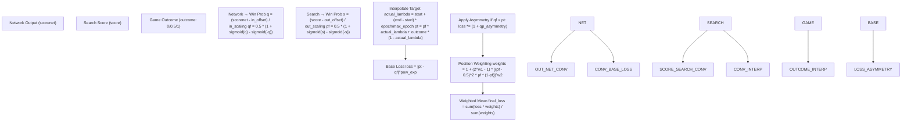
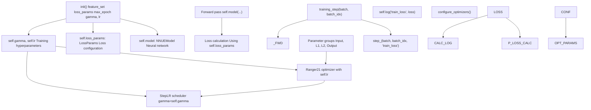
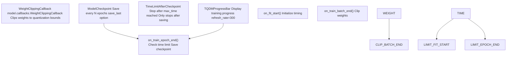

# Loss Functions and Training Configuration

-   [data\_loader/\_\_init\_\_.py](https://github.com/Chesszyh/nnue-pytorch/blob/024b2064/data_loader/__init__.py)
-   [data\_loader/\_native.py](https://github.com/Chesszyh/nnue-pytorch/blob/024b2064/data_loader/_native.py)
-   [data\_loader/config.py](https://github.com/Chesszyh/nnue-pytorch/blob/024b2064/data_loader/config.py)
-   [model/config.py](https://github.com/Chesszyh/nnue-pytorch/blob/024b2064/model/config.py)
-   [model/lightning\_module.py](https://github.com/Chesszyh/nnue-pytorch/blob/024b2064/model/lightning_module.py)
-   [train.py](https://github.com/Chesszyh/nnue-pytorch/blob/024b2064/train.py)

## Purpose and Scope

This document explains the loss function used for training NNUE networks and the associated training configuration parameters. The system uses a sophisticated WDL (Win-Draw-Loss) probability-based loss that interpolates between search evaluation scores and actual game outcomes.

For information about the optimizer configuration, see [Optimizer and Learning Rate Scheduling](#2.4). For data filtering and position selection, see [Data Filtering and Skip Configuration](#3.4).

---

## Overview

The NNUE training system employs a custom loss function that converts both network outputs and search scores into win probabilities, then measures their difference. This approach allows the network to learn from both:

-   **Search scores** (λ = 1.0): Positions evaluated by a chess engine
-   **Game outcomes** (λ = 0.0): The actual win/draw/loss results
-   **Interpolation** (0.0 < λ < 1.0): A blend of both signals

The loss calculation is implemented in the `step_` method and controlled by the `LossParams` configuration object.

**Sources:** [model/lightning\_module.py57-115](https://github.com/Chesszyh/nnue-pytorch/blob/024b2064/model/lightning_module.py#L57-L115) [model/config.py12-24](https://github.com/Chesszyh/nnue-pytorch/blob/024b2064/model/config.py#L12-L24)

---

## Loss Calculation Pipeline

The loss computation follows this flow:


**Diagram: Loss Calculation Data Flow**

**Sources:** [model/lightning\_module.py87-111](https://github.com/Chesszyh/nnue-pytorch/blob/024b2064/model/lightning_module.py#L87-L111)

---

## Win Probability Conversion

The system converts both network outputs and search scores to win probabilities using a sigmoid-based formula that accounts for both perspectives (from white's and black's viewpoint):

### Network Output Conversion

```
q = (scorenet - in_offset) / in_scalingqm = (-scorenet - in_offset) / in_scalingqf = 0.5 * (1.0 + q.sigmoid() - qm.sigmoid())
```
### Search Score Conversion

```
s = (score - out_offset) / out_scalingsm = (-score - out_offset) / out_scalingpf = 0.5 * (1.0 + s.sigmoid() - sm.sigmoid())
```
This bidirectional sigmoid approach ensures that the win probability is properly symmetric and handles both positive and negative evaluations correctly. The offset parameters center the sigmoid curve, while the scaling parameters control its steepness.

**Sources:** [model/lightning\_module.py88-96](https://github.com/Chesszyh/nnue-pytorch/blob/024b2064/model/lightning_module.py#L88-L96)

---

## LossParams Configuration

The `LossParams` dataclass defines all parameters controlling the loss function behavior:

| Parameter | Default | Description |
| --- | --- | --- |
| `in_offset` | 270.0 | Offset for network output conversion (centers sigmoid) |
| `in_scaling` | 340.0 | Scaling for network output conversion (controls sigmoid steepness) |
| `out_offset` | 270.0 | Offset for search score conversion |
| `out_scaling` | 380.0 | Scaling for search score conversion |
| `start_lambda` | 1.0 | Lambda value at first epoch |
| `end_lambda` | 1.0 | Lambda value at final epoch |
| `pow_exp` | 2.5 | Exponent for power law in loss calculation |
| `qp_asymmetry` | 0.0 | Asymmetry factor when network overestimates (qf > pt) |
| `w1` | 0.0 | Position weight boost parameter 1 |
| `w2` | 0.5 | Position weight boost parameter 2 |

**Table: LossParams Configuration Fields**

### Parameter Roles

**Offset and Scaling Parameters:**

-   These parameters map evaluation scores (in centipawns) to win probabilities
-   `in_offset` and `in_scaling` apply to the network's output
-   `out_offset` and `out_scaling` apply to the reference search scores
-   Different values allow the network to learn a different evaluation scale than the search engine

**Lambda Scheduling:**

-   Controls interpolation between search scores (λ=1) and game outcomes (λ=0)
-   Can schedule a gradual shift from search-based to outcome-based training
-   `actual_lambda = start_lambda + (end_lambda - start_lambda) * (epoch / max_epoch)`
-   Common pattern: Start with λ=1.0 (pure search), end with λ=1.0 (pure search), or interpolate

**Power Exponent:**

-   `pow_exp` controls the loss function's sensitivity to errors
-   Default 2.5 creates a loss somewhere between squared error (2.0) and cubic error (3.0)
-   Higher values penalize large errors more heavily

**Asymmetry:**

-   `qp_asymmetry` adds penalty when network overestimates position value
-   If `qf > pt`, loss is multiplied by `(1 + qp_asymmetry)`
-   Useful for encouraging conservative evaluations

**Sources:** [model/config.py12-24](https://github.com/Chesszyh/nnue-pytorch/blob/024b2064/model/config.py#L12-L24) [model/lightning\_module.py87-108](https://github.com/Chesszyh/nnue-pytorch/blob/024b2064/model/lightning_module.py#L87-L108)

---

## Position Weighting

The loss function includes a sophisticated position weighting mechanism controlled by `w1` and `w2`:

```
weights = 1 + (2.0**w1 - 1) * torch.pow((pf - 0.5) ** 2 * pf * (1 - pf), w2)loss = (loss * weights).sum() / weights.sum()
```
This weighting formula:

1.  Computes `(pf - 0.5)^2 * pf * (1 - pf)` which peaks for positions near 50% win probability
2.  Raises this to power `w2` to control sharpness
3.  Scales by `(2^w1 - 1)` to control boost magnitude
4.  Adds 1 as the baseline weight

**Effect of Parameters:**

-   `w1 = 0`: No weighting (all positions weighted equally)
-   `w1 > 0`: Boost positions near decisive outcomes
-   `w2 < 1`: Broader boost across win probabilities
-   `w2 > 1`: Sharper focus on specific win probability ranges

**Sources:** [model/lightning\_module.py110-111](https://github.com/Chesszyh/nnue-pytorch/blob/024b2064/model/lightning_module.py#L110-L111) [train.py362-374](https://github.com/Chesszyh/nnue-pytorch/blob/024b2064/train.py#L362-L374)

---

## Training Configuration

```mermaid
flowchart TD
    CLI_LOSS["Loss Parameters --lambda, --start-lambda, --end-lambda --in-offset, --in-scaling --out-offset, --out-scaling --pow-exp, --qp-asymmetry --w1, --w2"]
    CLI_TRAIN["Training Parameters --lr, --gamma --batch-size --epoch-size --validation-size --max-epochs"]
    LOSS_PARAMS["LossParams model/config.py:LossParams"]
    MODEL_CONFIG["ModelConfig L1, L2, L3 sizes"]
    QUANT_CONFIG["QuantizationConfig int8/int16 settings"]
    NNUE_MODULE["NNUE model/lightning_module.py:NNUE"]
    TRAIN_STEP["training_step() Calls step_() with loss calculation"]
    CONFIG_OPT["configure_optimizers() Setup Ranger21 + scheduler"]

    CLI --> LOSS_LOSS_PARAMS
    CLI --> TRAIN_NNUE_MODULE
    LOSS --> PARAMS_NNUE_MODULE
    MODEL --> CONFIG_NNUE_MODULE
    QUANT --> CONFIG_NNUE_MODULE
    NNUE --> MODULE_TRAIN_STEP
    NNUE --> MODULE_CONFIG_OPT
```


**Diagram: Training Configuration Flow from CLI to Training Loop**

**Sources:** [train.py107-543](https://github.com/Chesszyh/nnue-pytorch/blob/024b2064/train.py#L107-L543) [model/lightning\_module.py16-161](https://github.com/Chesszyh/nnue-pytorch/blob/024b2064/model/lightning_module.py#L16-L161)

---

## Command-Line Configuration

### Loss Function Parameters

```
# Lambda interpolationpython train.py data.binpack --lambda 1.0              # Pure search-basedpython train.py data.binpack --lambda 0.5              # 50/50 search/outcomepython train.py data.binpack --start-lambda 1.0 \                             --end-lambda 0.0          # Schedule from search to outcome# Sigmoid conversion parameterspython train.py data.binpack --in-offset 270 \                             --in-scaling 340 \                             --out-offset 270 \                             --out-scaling 380# Loss shape parameterspython train.py data.binpack --pow-exp 2.5             # Loss exponentpython train.py data.binpack --qp-asymmetry 0.5        # Penalize overestimation# Position weightingpython train.py data.binpack --w1 0.0 --w2 0.5         # Default weighting
```
### Training Configuration Parameters

```
# Learning rate and schedulepython train.py data.binpack --lr 8.75e-4              # Initial learning ratepython train.py data.binpack --gamma 0.992             # LR decay per epoch# Batch and epoch configurationpython train.py data.binpack --batch-size 16384        # Positions per batchpython train.py data.binpack --epoch-size 100000000    # Positions per epochpython train.py data.binpack --validation-size 0       # Validation positions# Training durationpython train.py data.binpack --max-epochs 800          # Maximum epochspython train.py data.binpack --max-time 30:00:00:00    # Maximum time (DD:HH:MM:SS)
```
**Sources:** [train.py152-224](https://github.com/Chesszyh/nnue-pytorch/blob/024b2064/train.py#L152-L224) [train.py306-318](https://github.com/Chesszyh/nnue-pytorch/blob/024b2064/train.py#L306-L318)

---

## Integration with Lightning Module

The `NNUE` Lightning module integrates all configuration:


**Diagram: NNUE Lightning Module Structure**

### Key Methods

**`__init__()`** [model/lightning\_module.py29-52](https://github.com/Chesszyh/nnue-pytorch/blob/024b2064/model/lightning_module.py#L29-L52)

-   Initializes the `NNUEModel` with feature set and configuration
-   Stores `loss_params`, `max_epoch`, `gamma`, `lr`, and other hyperparameters
-   These parameters persist through training and checkpointing

**`step_()`** [model/lightning\_module.py57-115](https://github.com/Chesszyh/nnue-pytorch/blob/024b2064/model/lightning_module.py#L57-L115)

-   Core loss calculation for training, validation, and testing
-   Unpacks batch data (positions, outcomes, scores)
-   Performs forward pass through `self.model`
-   Computes loss using `self.loss_params`
-   Logs the loss value

**`configure_optimizers()`** [model/lightning\_module.py126-161](https://github.com/Chesszyh/nnue-pytorch/blob/024b2064/model/lightning_module.py#L126-L161)

-   Creates parameter groups with different learning rates
-   Initializes Ranger21 optimizer with stored hyperparameters
-   Sets up StepLR scheduler with `gamma` for learning rate decay
-   Returns optimizer and scheduler to Lightning trainer

**Sources:** [model/lightning\_module.py16-161](https://github.com/Chesszyh/nnue-pytorch/blob/024b2064/model/lightning_module.py#L16-L161)

---

## Lambda Scheduling

Lambda scheduling allows gradual transition between training signals:

### Implementation

```
actual_lambda = p.start_lambda + (p.end_lambda - p.start_lambda) * (    self.current_epoch / self.max_epoch)pt = pf * actual_lambda + t * (1.0 - actual_lambda)
```
### Common Strategies

| Strategy | `start_lambda` | `end_lambda` | Purpose |
| --- | --- | --- | --- |
| Pure Search | 1.0 | 1.0 | Learn only from search scores |
| Pure Outcome | 0.0 | 0.0 | Learn only from game results |
| Search to Outcome | 1.0 | 0.0 | Start with search, transition to outcomes |
| Outcome to Search | 0.0 | 1.0 | Start with outcomes, refine with search |
| Blended | 0.5 | 0.5 | Always use 50/50 mix |

The linear interpolation across epochs provides smooth scheduling without requiring complex learning rate warmup/warmdown coordination.

**Sources:** [model/lightning\_module.py100-103](https://github.com/Chesszyh/nnue-pytorch/blob/024b2064/model/lightning_module.py#L100-L103) [train.py152-170](https://github.com/Chesszyh/nnue-pytorch/blob/024b2064/train.py#L152-L170) [train.py399-402](https://github.com/Chesszyh/nnue-pytorch/blob/024b2064/train.py#L399-L402)

---

## Callbacks and Training Control

The training loop uses several callbacks to control training behavior:


**Diagram: Training Callbacks and Their Lifecycle Hooks**

### Callback Details

**WeightClippingCallback:**

-   Ensures weights stay within quantization-compatible ranges
-   Clips after each training batch
-   Critical for maintaining int8/int16 compatibility

**ModelCheckpoint:**

-   Configured via `--network-save-period` (default: 20 epochs)
-   `--save-last-network` controls whether final checkpoint is always saved
-   Checkpoints include full model state, optimizer state, and hyperparameters

**TimeLimitAfterCheckpoint:**

-   Parses `--max-time` in format `DD:HH:MM:SS`
-   Only stops training after a checkpoint is saved
-   Prevents loss of training progress from early termination

**Sources:** [train.py21-41](https://github.com/Chesszyh/nnue-pytorch/blob/024b2064/train.py#L21-L41) [train.py490-514](https://github.com/Chesszyh/nnue-pytorch/blob/024b2064/train.py#L490-L514)

---

## Example Configurations

### Standard Training (Default)

```
python train.py data.binpack \    --lambda 1.0 \    --in-offset 270 --in-scaling 340 \    --out-offset 270 --out-scaling 380 \    --pow-exp 2.5 \    --lr 8.75e-4 --gamma 0.992 \    --batch-size 16384 \    --epoch-size 100000000 \    --max-epochs 800
```
### Lambda Scheduling

```
# Transition from search-based to outcome-basedpython train.py data.binpack \    --start-lambda 1.0 \    --end-lambda 0.0 \    --max-epochs 800
```
### Custom Loss Shaping

```
# Conservative network (penalize overestimation)python train.py data.binpack \    --qp-asymmetry 0.3 \    --pow-exp 3.0
```
### Position Weighting

```
# Emphasize decisive positionspython train.py data.binpack \    --w1 1.0 \    --w2 0.5
```
**Sources:** [train.py411-422](https://github.com/Chesszyh/nnue-pytorch/blob/024b2064/train.py#L411-L422) [train.py428-455](https://github.com/Chesszyh/nnue-pytorch/blob/024b2064/train.py#L428-L455)

---

## Summary

The loss function configuration system provides fine-grained control over:

-   **Target interpolation** via lambda scheduling
-   **Win probability conversion** via offset/scaling parameters
-   **Loss shape** via power exponent and asymmetry
-   **Position weighting** via w1/w2 parameters

These parameters are specified via command-line arguments, packaged into `LossParams`, and used throughout training in the `NNUE` Lightning module. The modular design allows experimentation with different training objectives while maintaining compatibility with the quantized inference format.

**Sources:** [train.py107-543](https://github.com/Chesszyh/nnue-pytorch/blob/024b2064/train.py#L107-L543) [model/lightning\_module.py16-161](https://github.com/Chesszyh/nnue-pytorch/blob/024b2064/model/lightning_module.py#L16-L161) [model/config.py12-24](https://github.com/Chesszyh/nnue-pytorch/blob/024b2064/model/config.py#L12-L24)
