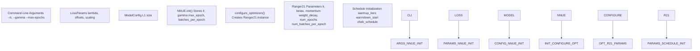
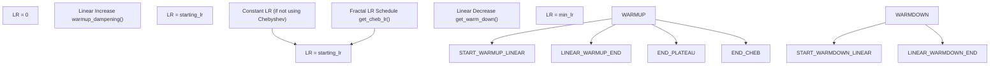
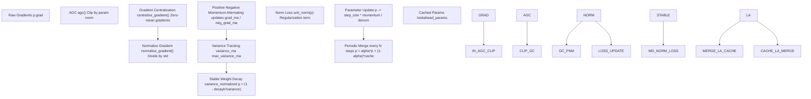
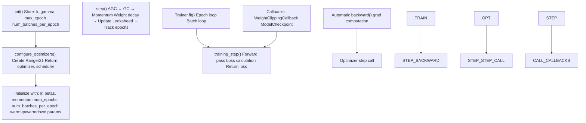

# Optimizer and Learning Rate Scheduling

-   [ranger21.py](https://github.com/Chesszyh/nnue-pytorch/blob/024b2064/ranger21.py)
-   [ruff.toml](https://github.com/Chesszyh/nnue-pytorch/blob/024b2064/ruff.toml)
-   [train.py](https://github.com/Chesszyh/nnue-pytorch/blob/024b2064/train.py)

## Purpose and Scope

This page documents the optimization strategy used in NNUE training, focusing on the Ranger21 optimizer and its comprehensive learning rate scheduling system. The content covers optimizer configuration, warmup/warmdown strategies, Chebyshev fractal scheduling, adaptive gradient clipping, and advanced features like lookahead and gradient centralization.

For information about loss calculation and training configuration, see [Loss Functions and Training Configuration](#2.3). For the overall training workflow, see [Basic Training (train.py)](#2.1).

## Ranger21 Optimizer Overview

The training system uses **Ranger21**, a sophisticated optimizer that combines multiple state-of-the-art optimization techniques into a unified framework. Ranger21 extends the AdamW optimizer with numerous enhancements designed to improve training stability, convergence speed, and final model quality.

**Core Components:**

| Component | Purpose | Key Papers |
| --- | --- | --- |
| Base Engine | AdamW or MadGrad gradient descent | \- |
| Warmup | Gradual learning rate increase at start | Ma/Yarats 2019 |
| Warmdown | Linear LR decay toward end | \- |
| Chebyshev Steps | Fractal LR schedule for improved convergence | \- |
| Lookahead | Slow and fast weight exploration | Zhang et al. 2019 |
| AGC | Adaptive Gradient Clipping for stability | Brock et al. 2021 |
| Gradient Centralization | Zero-mean gradients for faster convergence | Yong et al. 2020 |
| Positive-Negative Momentum | Enhanced momentum computation | Gitman et al. 2021 |
| Stable Weight Decay | Variance-normalized regularization | Loshchilov/Hutter 2017 |
| Norm Loss | Auxiliary loss for weight regularization | Georgiou et al. 2021 |

The optimizer is implemented in [ranger21.py107-953](https://github.com/Chesszyh/nnue-pytorch/blob/024b2064/ranger21.py#L107-L953) with the main optimization step in [ranger21.py574-927](https://github.com/Chesszyh/nnue-pytorch/blob/024b2064/ranger21.py#L574-L927)

**Sources:** [ranger21.py1-36](https://github.com/Chesszyh/nnue-pytorch/blob/024b2064/ranger21.py#L1-L36) [ranger21.py107-152](https://github.com/Chesszyh/nnue-pytorch/blob/024b2064/ranger21.py#L107-L152)

## Optimizer Initialization in Training


**Diagram: Optimizer Initialization Flow**

The training script [train.py428-438](https://github.com/Chesszyh/nnue-pytorch/blob/024b2064/train.py#L428-L438) creates an `NNUE` Lightning module with basic optimizer parameters (`lr`, `gamma`, `max_epoch`, `num_batches_per_epoch`). The module's `configure_optimizers()` method then instantiates Ranger21 with full configuration.

**Sources:** [train.py218-223](https://github.com/Chesszyh/nnue-pytorch/blob/024b2064/train.py#L218-L223) [train.py428-438](https://github.com/Chesszyh/nnue-pytorch/blob/024b2064/train.py#L428-L438) [ranger21.py107-152](https://github.com/Chesszyh/nnue-pytorch/blob/024b2064/ranger21.py#L107-L152)

## Basic Optimizer Parameters

### Learning Rate and Gamma

The initial learning rate and decay factor are specified via command-line arguments:

```
--lr 8.75e-4        # Initial learning rate (default)
--gamma 0.992       # LR multiplicative decay per epoch (default)
```
These parameters are passed to the NNUE module at [train.py433-434](https://github.com/Chesszyh/nnue-pytorch/blob/024b2064/train.py#L433-L434):

-   **`lr`**: Starting learning rate before any warmup or scheduling
-   **`gamma`**: Multiplicative factor applied after each epoch (when not using Chebyshev scheduling)
-   **`num_batches_per_epoch`**: Derived from `epoch_size / batch_size` at [train.py432](https://github.com/Chesszyh/nnue-pytorch/blob/024b2064/train.py#L432-L432) used to track epochs within the optimizer

**Sources:** [train.py218-223](https://github.com/Chesszyh/nnue-pytorch/blob/024b2064/train.py#L218-L223) [train.py433-434](https://github.com/Chesszyh/nnue-pytorch/blob/024b2064/train.py#L433-L434)

### Betas, Momentum, and Weight Decay

Ranger21 uses the following default hyperparameters (hardcoded in [ranger21.py128-150](https://github.com/Chesszyh/nnue-pytorch/blob/024b2064/ranger21.py#L128-L150)):

| Parameter | Default | Description |
| --- | --- | --- |
| `betas` | `(0.9, 0.999)` | Exponential decay rates for momentum and variance |
| `momentum` | `0.9` | Momentum factor for MadGrad engine |
| `eps` | `1e-8` | Numerical stability constant |
| `weight_decay` | `1e-4` | Stable weight decay coefficient |
| `decay_type` | `"stable"` | Variance-normalized weight decay |

The beta values control exponential moving averages:

-   **beta1 = 0.9**: First moment (gradient) moving average decay
-   **beta2 = 0.999**: Second moment (variance) moving average decay

**Sources:** [ranger21.py128-142](https://github.com/Chesszyh/nnue-pytorch/blob/024b2064/ranger21.py#L128-L142) [ranger21.py149-151](https://github.com/Chesszyh/nnue-pytorch/blob/024b2064/ranger21.py#L149-L151)

## Learning Rate Scheduling

Ranger21 implements a sophisticated three-phase learning rate schedule: warmup → plateau/Chebyshev → warmdown.


**Diagram: Learning Rate Schedule Phases**

**Sources:** [ranger21.py215-264](https://github.com/Chesszyh/nnue-pytorch/blob/024b2064/ranger21.py#L215-L264) [ranger21.py435-521](https://github.com/Chesszyh/nnue-pytorch/blob/024b2064/ranger21.py#L435-L521) [ranger21.py539-561](https://github.com/Chesszyh/nnue-pytorch/blob/024b2064/ranger21.py#L539-L561)

### Warmup Phase

Warmup gradually increases the learning rate from zero to the target value over a specified number of iterations. This prevents training instability from large initial gradient updates.

**Configuration Parameters:**

| Parameter | Default Calculation | Description |
| --- | --- | --- |
| `use_warmup` | `True` | Enable warmup phase |
| `warmup_type` | `"linear"` | Linear or exponential warmup |
| `num_warmup_iterations` | Auto-computed | Iterations for warmup |
| `warmup_pct_default` | `0.22` | Fallback: 22% of total iterations |

**Warmup Duration Calculation** [ranger21.py222-238](https://github.com/Chesszyh/nnue-pytorch/blob/024b2064/ranger21.py#L222-L238):

```
if num_warmup_iterations is None:    beta_warmup_iters = math.ceil(2 / (1 - betas[1]))  # ~2000 iterations for beta2=0.999    beta_pct = beta_warmup_iters / total_iterations        if beta_pct > 0.45:        # Use percentage-based warmup for short training runs        num_warmup_iters = int(warmup_pct_default * total_iterations)    else:        # Use beta-based warmup for longer runs        num_warmup_iters = beta_warmup_iters
```
The formula `2 / (1 - beta2)` derives from the Ma/Yarats (2019) paper on Adam warmup, ensuring the exponential moving average stabilizes before full learning rate is applied.

**Linear Warmup Implementation** [ranger21.py435-465](https://github.com/Chesszyh/nnue-pytorch/blob/024b2064/ranger21.py#L435-L465):

At each step during warmup:

```
warmup_pct = min(1.0, step / num_warmup_iters)
new_lr = starting_lr * warmup_pct
```
Once `step > num_warmup_iters`, warmup is marked complete and the full learning rate is used.

**Sources:** [ranger21.py217-238](https://github.com/Chesszyh/nnue-pytorch/blob/024b2064/ranger21.py#L217-L238) [ranger21.py435-465](https://github.com/Chesszyh/nnue-pytorch/blob/024b2064/ranger21.py#L435-L465)

### Warmdown Phase

Warmdown linearly decreases the learning rate from the current value to a minimum value over the final portion of training. This helps models converge to sharper minima.

**Configuration Parameters:**

| Parameter | Default | Description |
| --- | --- | --- |
| `warmdown_active` | `True` | Enable warmdown phase |
| `warmdown_start_pct` | `0.72` | Start warmdown at 72% of training |
| `warmdown_min_lr` | `3e-5` | Minimum learning rate at end |

**Warmdown Calculation** [ranger21.py240-264](https://github.com/Chesszyh/nnue-pytorch/blob/024b2064/ranger21.py#L240-L264) [ranger21.py467-521](https://github.com/Chesszyh/nnue-pytorch/blob/024b2064/ranger21.py#L467-L521):

```
# During initialization:start_warm_down = int(warmdown_start_pct * num_epochs * num_batches_per_epoch)warmdown_total_iterations = total_iterations - start_warm_downwarmdown_lr_delta = starting_lr - min_lr# During training step:if iteration >= start_warm_down:    warmdown_iteration = (iteration + 1) - start_warm_down    warmdown_pct = warmdown_iteration / (warmdown_total_iterations + 1)    reduction = warmdown_lr_delta * warmdown_pct    new_lr = starting_lr - reduction
```
The linear decay ensures smooth transition to the minimum learning rate. The `+1` offsets handle 1-indexed iteration counting.

**Sources:** [ranger21.py240-264](https://github.com/Chesszyh/nnue-pytorch/blob/024b2064/ranger21.py#L240-L264) [ranger21.py467-521](https://github.com/Chesszyh/nnue-pytorch/blob/024b2064/ranger21.py#L467-L521)

### Chebyshev Fractal Steps

Chebyshev scheduling applies a fractal learning rate pattern that varies LR multiplicatively according to Chebyshev polynomial nodes. This creates a schedule with periodic increases and decreases that can help escape local minima.

**Configuration:**

```
use_cheb=True          # Enable Chebyshev schedulingnum_epochs=800         # Required for schedule generation
```
**Chebyshev Schedule Generation** [ranger21.py54-73](https://github.com/Chesszyh/nnue-pytorch/blob/024b2064/ranger21.py#L54-L73):

```
def cheb_steps(m, M, T):    # m=0.1 (min), M=1.0 (max), T=num_epochs-2    C, R = (M + m) / 2.0, (M - m) / 2.0    thetas = (np.arange(T) + 0.5) / T * np.pi    return 1.0 / (C - R * np.cos(thetas))def cheb_perm(T):    # Fractal permutation pattern    perm = np.array([0])    while len(perm) < T:        perm = np.vstack([perm, 2 * len(perm) - 1 - perm]).T.flatten()    return permdef get_chebs(num_epochs):    steps = cheb_steps(0.1, 1, num_epochs - 2)    perm = cheb_perm(num_epochs - 2)    return steps[perm]
```
The schedule is applied after warmup completes [ranger21.py748-751](https://github.com/Chesszyh/nnue-pytorch/blob/024b2064/ranger21.py#L748-L751):

```
if self.use_cheb and self.warmup_complete:    lr = self.get_cheb_lr(lr, step)
```
The `get_cheb_lr()` method [ranger21.py539-561](https://github.com/Chesszyh/nnue-pytorch/blob/024b2064/ranger21.py#L539-L561) looks up the current epoch's multiplier and applies it: `new_lr = base_lr * cheb_value`.

**Sources:** [ranger21.py54-73](https://github.com/Chesszyh/nnue-pytorch/blob/024b2064/ranger21.py#L54-L73) [ranger21.py195-203](https://github.com/Chesszyh/nnue-pytorch/blob/024b2064/ranger21.py#L195-L203) [ranger21.py539-561](https://github.com/Chesszyh/nnue-pytorch/blob/024b2064/ranger21.py#L539-L561) [ranger21.py748-751](https://github.com/Chesszyh/nnue-pytorch/blob/024b2064/ranger21.py#L748-L751)

## Adaptive Gradient Clipping (AGC)

Adaptive Gradient Clipping normalizes gradient updates relative to parameter magnitudes, preventing exploding gradients while allowing different layers to update at appropriate scales.

**Configuration:**

| Parameter | Default | Description |
| --- | --- | --- |
| `use_adaptive_gradient_clipping` | `True` | Enable AGC |
| `agc_clipping_value` | `1e-2` | Clipping threshold (relative to param norm) |
| `agc_eps` | `1e-3` | Minimum parameter norm |

**AGC Algorithm** [ranger21.py415-433](https://github.com/Chesszyh/nnue-pytorch/blob/024b2064/ranger21.py#L415-L433):

```
def agc(self, p):    # Compute parameter unitwise norm    p_norm = self.unit_norm(p).clamp_(self.agc_eps)        # Compute gradient unitwise norm    g_norm = self.unit_norm(p.grad)        # Maximum allowed gradient norm    max_norm = p_norm * self.agc_clip_val        # Clip gradient if exceeds max_norm    clipped_grad = p.grad * (max_norm / g_norm.clamp(min=1e-6))    new_grads = torch.where(g_norm > max_norm, clipped_grad, p.grad)    p.grad.detach().copy_(new_grads)
```
**Unitwise Norm Computation** [ranger21.py393-413](https://github.com/Chesszyh/nnue-pytorch/blob/024b2064/ranger21.py#L393-L413):

The `unit_norm()` method computes norms along appropriate dimensions:

-   1D parameters: global norm
-   2D/3D (linear layers): norm along dimension 1
-   4D (conv kernels): norm along dimensions (1,2,3)

AGC is applied early in the optimization step [ranger21.py595-597](https://github.com/Chesszyh/nnue-pytorch/blob/024b2064/ranger21.py#L595-L597) before any other gradient transformations.

**Sources:** [ranger21.py125-127](https://github.com/Chesszyh/nnue-pytorch/blob/024b2064/ranger21.py#L125-L127) [ranger21.py190-193](https://github.com/Chesszyh/nnue-pytorch/blob/024b2064/ranger21.py#L190-L193) [ranger21.py393-433](https://github.com/Chesszyh/nnue-pytorch/blob/024b2064/ranger21.py#L393-L433) [ranger21.py595-597](https://github.com/Chesszyh/nnue-pytorch/blob/024b2064/ranger21.py#L595-L597)

## Advanced Optimization Features


**Diagram: Ranger21 Optimization Step Pipeline**

**Sources:** [ranger21.py574-953](https://github.com/Chesszyh/nnue-pytorch/blob/024b2064/ranger21.py#L574-L953)

### Lookahead

Lookahead maintains two sets of weights: "fast" weights updated every step, and "slow" weights updated periodically by interpolating with fast weights. This explores the loss landscape more thoroughly.

**Configuration:**

| Parameter | Default | Description |
| --- | --- | --- |
| `lookahead_active` | `True` | Enable lookahead |
| `lookahead_mergetime` | `5` | Steps between slow weight updates |
| `lookahead_blending_alpha` | `0.5` | Fast weight interpolation factor |
| `lookahead_load_at_validation` | `False` | Use slow weights for validation |

**Lookahead Process** [ranger21.py930-953](https://github.com/Chesszyh/nnue-pytorch/blob/024b2064/ranger21.py#L930-L953):

Every `lookahead_mergetime` steps:

```
p.data = alpha * p.data + (1 - alpha) * lookahead_paramslookahead_params = p.data  # Save for next merge
```
The slow weights (`lookahead_params`) are initialized to match the current weights [ranger21.py620-622](https://github.com/Chesszyh/nnue-pytorch/blob/024b2064/ranger21.py#L620-L622) and cached in the optimizer state.

**Sources:** [ranger21.py112-115](https://github.com/Chesszyh/nnue-pytorch/blob/024b2064/ranger21.py#L112-L115) [ranger21.py182-188](https://github.com/Chesszyh/nnue-pytorch/blob/024b2064/ranger21.py#L182-L188) [ranger21.py620-622](https://github.com/Chesszyh/nnue-pytorch/blob/024b2064/ranger21.py#L620-L622) [ranger21.py930-953](https://github.com/Chesszyh/nnue-pytorch/blob/024b2064/ranger21.py#L930-L953)

### Gradient Centralization

Gradient Centralization zeros the mean of gradients, which has been shown to accelerate convergence and improve generalization.

**Configuration:**

| Parameter | Default | Description |
| --- | --- | --- |
| `using_gc` | `True` | Enable gradient centralization |
| `using_normgc` | `True` | Normalize gradients by std |
| `gc_conv_only` | `False` | Apply only to convolution layers |

**Implementation** [ranger21.py92-104](https://github.com/Chesszyh/nnue-pytorch/blob/024b2064/ranger21.py#L92-L104):

```
def centralize_gradient(x, gc_conv_only=False):    size = x.dim()    if gc_conv_only:        if size > 3:  # Convolution layers            x.add_(-x.mean(dim=tuple(range(1, size)), keepdim=True))    else:        if size > 1:  # All multi-dimensional parameters            x.add_(-x.mean(dim=tuple(range(1, size)), keepdim=True))    return x
```
**Gradient Normalization** [ranger21.py76-89](https://github.com/Chesszyh/nnue-pytorch/blob/024b2064/ranger21.py#L76-L89):

```
def normalize_gradient(x, use_channels=False, epsilon=1e-8):    size = x.dim()    if (size > 1) and use_channels:        s = x.std(dim=tuple(range(1, size)), keepdim=True) + epsilon        x.div_(s)    elif torch.numel(x) > 2:        s = x.std() + epsilon        x.div_(s)    return x
```
Both transformations are applied to gradients at [ranger21.py643-650](https://github.com/Chesszyh/nnue-pytorch/blob/024b2064/ranger21.py#L643-L650) and [ranger21.py883-889](https://github.com/Chesszyh/nnue-pytorch/blob/024b2064/ranger21.py#L883-L889) before momentum computation.

**Sources:** [ranger21.py76-104](https://github.com/Chesszyh/nnue-pytorch/blob/024b2064/ranger21.py#L76-L104) [ranger21.py268-270](https://github.com/Chesszyh/nnue-pytorch/blob/024b2064/ranger21.py#L268-L270) [ranger21.py643-650](https://github.com/Chesszyh/nnue-pytorch/blob/024b2064/ranger21.py#L643-L650) [ranger21.py883-889](https://github.com/Chesszyh/nnue-pytorch/blob/024b2064/ranger21.py#L883-L889)

### Positive-Negative Momentum (PNM)

PNM alternates between positive and negative momentum accumulators on odd/even steps, which provides better exploration of the loss landscape.

**Configuration:**

| Parameter | Default | Description |
| --- | --- | --- |
| `momentum_type` | `"pnm"` | Use positive-negative momentum |
| `pnm_momentum_factor` | `1.0` | PNM scaling factor |

**PNM Update Logic** [ranger21.py856-909](https://github.com/Chesszyh/nnue-pytorch/blob/024b2064/ranger21.py#L856-L909):

```
if state["step"] % 2 == 1:    grad_ma, neg_grad_ma = state["grad_ma"], state["neg_grad_ma"]else:    grad_ma, neg_grad_ma = state["neg_grad_ma"], state["grad_ma"]# Compute momentum with PNMnoise_norm = math.sqrt((1 + beta2) ** 2 + beta2 ** 2)pnmomentum = (grad_ma * (1 + pnm_factor) - neg_grad_ma * pnm_factor) / noise_norm
```
The alternating assignment ensures one accumulator gets the current gradient while the other acts as a negative momentum term.

**Sources:** [ranger21.py129-130](https://github.com/Chesszyh/nnue-pytorch/blob/024b2064/ranger21.py#L129-L130) [ranger21.py276-278](https://github.com/Chesszyh/nnue-pytorch/blob/024b2064/ranger21.py#L276-L278) [ranger21.py628-631](https://github.com/Chesszyh/nnue-pytorch/blob/024b2064/ranger21.py#L628-L631) [ranger21.py856-909](https://github.com/Chesszyh/nnue-pytorch/blob/024b2064/ranger21.py#L856-L909)

### Stable Weight Decay

Stable weight decay normalizes the decay term by the variance of all parameters, making regularization scale-invariant.

**Variance Computation** [ranger21.py582-720](https://github.com/Chesszyh/nnue-pytorch/blob/024b2064/ranger21.py#L582-L720):

```
# Phase 1: Accumulate variance across all parametersvariance_ma_sum = 0.0for group in param_groups:    for p in group["params"]:        variance_ma = state["variance_ma"]        variance_ma.mul_(beta2).addcmul_(grad, grad, value=1 - beta2)        variance_ma_debiased = variance_ma / (1 - beta2 ** step)        variance_ma_sum += variance_ma_debiased.sum()# Normalizevariance_normalized = math.sqrt(variance_ma_sum / param_size)
```
**Decay Application** [ranger21.py767-772](https://github.com/Chesszyh/nnue-pytorch/blob/024b2064/ranger21.py#L767-L772):

```
if decay:    if not use_madgrad:        p.data *= (1 - decay * lr / variance_normalized)    else:        p.data *= (1 - decay * lamb / variance_normalized)
```
The variance normalization ensures weight decay strength adapts to gradient magnitudes throughout training.

**Sources:** [ranger21.py141-142](https://github.com/Chesszyh/nnue-pytorch/blob/024b2064/ranger21.py#L141-L142) [ranger21.py281-282](https://github.com/Chesszyh/nnue-pytorch/blob/024b2064/ranger21.py#L281-L282) [ranger21.py582-720](https://github.com/Chesszyh/nnue-pytorch/blob/024b2064/ranger21.py#L582-L720) [ranger21.py767-772](https://github.com/Chesszyh/nnue-pytorch/blob/024b2064/ranger21.py#L767-L772)

### Norm Loss

Norm Loss adds an auxiliary regularization term that penalizes parameters with norms far from 1, encouraging balanced weight magnitudes across layers.

**Configuration:**

| Parameter | Default | Description |
| --- | --- | --- |
| `normloss_active` | `True` | Enable norm loss regularization |
| `normloss_factor` | `1e-4` | Norm loss coefficient |

**Implementation** [ranger21.py774-780](https://github.com/Chesszyh/nnue-pytorch/blob/024b2064/ranger21.py#L774-L780):

```
if self.normloss_active:    unorm = self.unit_norm(p.data)    correction = 2 * normloss_factor * (1 - torch.div(1, unorm + eps))    p.mul_(1 - lr * correction)
```
The correction term pushes parameter norms toward 1 by scaling them inversely proportional to their current norm.

**Sources:** [ranger21.py123-124](https://github.com/Chesszyh/nnue-pytorch/blob/024b2064/ranger21.py#L123-L124) [ranger21.py178-180](https://github.com/Chesszyh/nnue-pytorch/blob/024b2064/ranger21.py#L178-L180) [ranger21.py774-780](https://github.com/Chesszyh/nnue-pytorch/blob/024b2064/ranger21.py#L774-L780)

### Core Engine Selection

Ranger21 supports two base optimization algorithms:

**AdamW (Default)** [ranger21.py844-916](https://github.com/Chesszyh/nnue-pytorch/blob/024b2064/ranger21.py#L844-L916):

-   Adaptive learning rates with momentum
-   Separate variance tracking (`variance_ma`)
-   Bias correction for moving averages
-   Optional AdaBelief variance computation

**MadGrad** [ranger21.py790-842](https://github.com/Chesszyh/nnue-pytorch/blob/024b2064/ranger21.py#L790-L842):

-   Momentum-based gradient descent
-   Cube root of variance for learning rate adaptation
-   No bias correction needed
-   Alternative to Adam family

The engine is selected at initialization [ranger21.py158-166](https://github.com/Chesszyh/nnue-pytorch/blob/024b2064/ranger21.py#L158-L166):

```
use_madgrad=False  # Use AdamW by default
```
Both engines use the same warmup/warmdown/AGC infrastructure, but differ in how they compute parameter updates.

**Sources:** [ranger21.py116-117](https://github.com/Chesszyh/nnue-pytorch/blob/024b2064/ranger21.py#L116-L117) [ranger21.py158-166](https://github.com/Chesszyh/nnue-pytorch/blob/024b2064/ranger21.py#L158-L166) [ranger21.py790-916](https://github.com/Chesszyh/nnue-pytorch/blob/024b2064/ranger21.py#L790-L916)

## Integration with NNUE Training


**Diagram: Optimizer Integration in Training Loop**

The NNUE Lightning module's `configure_optimizers()` method creates the Ranger21 instance with all necessary parameters. Lightning's `Trainer` automatically calls the optimizer's `step()` method after each backward pass, handling the complete optimization pipeline including gradient clipping, momentum updates, weight decay, and lookahead.

The optimizer tracks epochs internally [ranger21.py527-538](https://github.com/Chesszyh/nnue-pytorch/blob/024b2064/ranger21.py#L527-L538) by counting steps and using `num_batches_per_epoch` to determine when a new epoch begins. This enables epoch-dependent features like learning rate logging and optional lookahead cache loading for validation.

**Sources:** [train.py428-438](https://github.com/Chesszyh/nnue-pytorch/blob/024b2064/train.py#L428-L438) [train.py496-514](https://github.com/Chesszyh/nnue-pytorch/blob/024b2064/train.py#L496-L514) [ranger21.py107-152](https://github.com/Chesszyh/nnue-pytorch/blob/024b2064/ranger21.py#L107-L152) [ranger21.py527-538](https://github.com/Chesszyh/nnue-pytorch/blob/024b2064/ranger21.py#L527-L538) [ranger21.py574-927](https://github.com/Chesszyh/nnue-pytorch/blob/024b2064/ranger21.py#L574-L927)

## Configuration Summary

### Recommended Default Settings

The NNUE training system uses these Ranger21 defaults:

```
# Basic parameters (from train.py)lr = 8.75e-4gamma = 0.992max_epochs = 800batch_size = 16384# Ranger21 hardcoded defaults (ranger21.py)betas = (0.9, 0.999)momentum = 0.9weight_decay = 1e-4eps = 1e-8# Warmup/Warmdownuse_warmup = Truewarmup_type = "linear"warmup_pct_default = 0.22warmdown_active = Truewarmdown_start_pct = 0.72warmdown_min_lr = 3e-5# Advanced featuresuse_adaptive_gradient_clipping = Trueagc_clipping_value = 1e-2lookahead_active = Truelookahead_mergetime = 5lookahead_blending_alpha = 0.5using_gc = Trueusing_normgc = Truenormloss_active = Truenormloss_factor = 1e-4momentum_type = "pnm"use_cheb = False  # Can be enabled for fractal LR schedule
```
These settings have been tuned for training large NNUE networks efficiently while maintaining stability throughout the 800-epoch default training run.

**Sources:** [train.py218-223](https://github.com/Chesszyh/nnue-pytorch/blob/024b2064/train.py#L218-L223) [ranger21.py108-146](https://github.com/Chesszyh/nnue-pytorch/blob/024b2064/ranger21.py#L108-L146)
