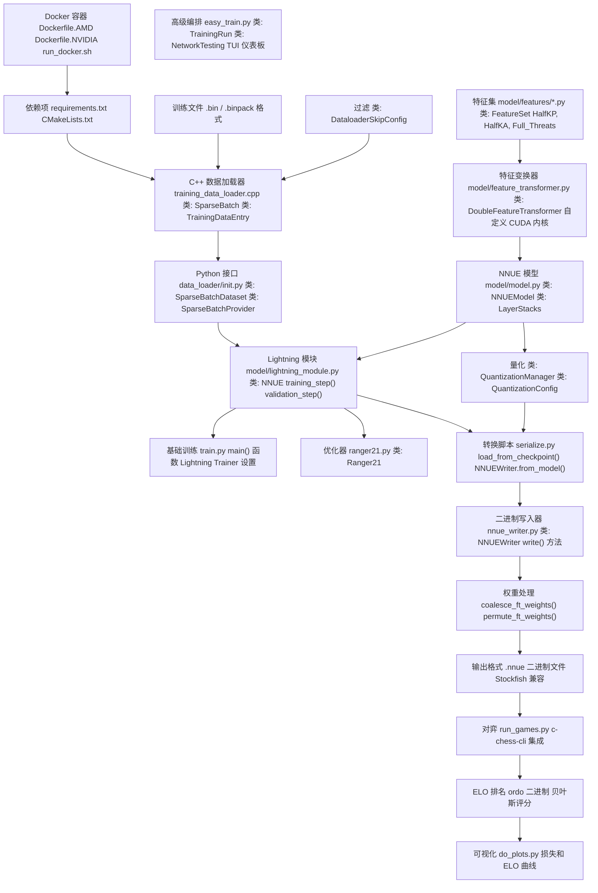

# 概览

-   [Dockerfile.AMD](https://github.com/Chesszyh/nnue-pytorch/blob/024b2064/Dockerfile.AMD)
-   [Dockerfile.NVIDIA](https://github.com/Chesszyh/nnue-pytorch/blob/024b2064/Dockerfile.NVIDIA)
-   [README.md](https://github.com/Chesszyh/nnue-pytorch/blob/024b2064/README.md)
-   [docs/img/SFNNv4_architecture.drawio](https://github.com/Chesszyh/nnue-pytorch/blob/024b2064/docs/img/SFNNv4_architecture.drawio)
-   [docs/nnue.md](https://github.com/Chesszyh/nnue-pytorch/blob/024b2064/docs/nnue.md)
-   [run_docker.sh](https://github.com/Chesszyh/nnue-pytorch/blob/024b2064/run_docker.sh)
-   [train.py](https://github.com/Chesszyh/nnue-pytorch/blob/024b2064/train.py)

## 目的与范围

本文档提供了 **nnue-pytorch** 仓库的高层介绍，这是一个用于训练 NNUE（Efficiently Updatable Neural Networks，高效可更新神经网络）国际象棋评估网络的框架。本概览解释了该仓库的架构、主要组件，以及它们如何集成以形成完整的“训练到部署”流水线。

有关特定主题的详细信息：

-   NNUE 架构和原理：请参阅 [什么是 NNUE](#1.1)
-   设置开发环境：请参阅 [环境设置](#1.2)
-   运行第一次训练：请参阅 [快速入门教程](#1.3)
-   训练系统详情：请参阅 [训练系统](#2)
-   数据流水线实现：请参阅 [数据流水线](#3)
-   模型架构细节：请参阅 [模型架构](#4)

**来源：** [README.md1-71](https://github.com/Chesszyh/nnue-pytorch/blob/024b2064/README.md#L1-L71) [docs/nnue.md1-143](https://github.com/Chesszyh/nnue-pytorch/blob/024b2064/docs/nnue.md#L1-L143)

## 什么是 nnue-pytorch？

**nnue-pytorch** 仓库是一个生产级的训练框架，用于训练国际象棋引擎（主要是 Stockfish）中使用的 NNUE 评估网络。它提供：

1.  **高性能数据加载**：通过具有 SIMD 优化的 C++ 原生加载器实现
2.  **灵活的模型架构**：支持多种特征集（HalfKP, HalfKA 变体, Full_Threats）
3.  **训练编排**：从简单的单 GPU 脚本到多 GPU 自动化流水线
4.  **模型序列化**：支持 Stockfish 兼容的 `.nnue` 二进制格式
5.  **自动化评估**：通过对弈和 ELO 排名进行评估

NNUE (ƎUИИ - Efficiently Updatable Neural Networks) 是一种专为国际象棋引擎中快速、低延迟 CPU 推理而设计的神经网络架构。它通过稀疏输入、增量评估更新和整数及量化实现这一目标。有关 NNUE 原理的全面解释，请参阅 [什么是 NNUE](#1.1)。

**来源：** [README.md1-71](https://github.com/Chesszyh/nnue-pytorch/blob/024b2064/README.md#L1-L71) [docs/nnue.md144-164](https://github.com/Chesszyh/nnue-pytorch/blob/024b2064/docs/nnue.md#L144-L164)

## 仓库架构

该仓库包含六个主要子系统，构成了一个完整的“训练到部署”流水线：

### 包含代码映射的系统组件


**来源：** [train.py1-553](https://github.com/Chesszyh/nnue-pytorch/blob/024b2064/train.py#L1-L553) [data_loader/__init__.py](https://github.com/Chesszyh/nnue-pytorch/blob/024b2064/data_loader/__init__.py) [model/model.py](https://github.com/Chesszyh/nnue-pytorch/blob/024b2064/model/model.py) [serialize.py](https://github.com/Chesszyh/nnue-pytorch/blob/024b2064/serialize.py) [run_games.py](https://github.com/Chesszyh/nnue-pytorch/blob/024b2064/run_games.py)

### 数据流：训练数据到已部署网络

```mermaid
flowchart TD
    BINPACK[".binpack 文件 TrainingDataEntry 局面 + 评估 + 结果"]
    STREAM["BinpackSfenInputStream 解析二进制格式"]
    FILTER["apply_skip() DataloaderSkipConfig 智能/胜平负/随机 过滤"]
    SPARSE["SparseBatch 特征索引 白方值, 黑方值"]
    DATASET["SparseBatchDataset iter() 生成批次"]
    LIGHTNING["NNUE.training_step() 前向传播 损失计算 反向传播"]
    CHECKPOINT[”.ckpt 文件 PyTorch Lightning float32 权重"]
    LOAD["NNUE.load_from_checkpoint()"]
    COAL["coalesce_ft_weights() 虚拟 → 真实特征"]
    QUANT["quantize 权重 int8/int16/int32"]
    WRITE["NNUEWriter.write() .nnue 二进制格式"]
    NNUE[".nnue 文件 Stockfish 兼容的量化权重"]
    SF["Stockfish 引擎 SIMD 推理"]

    BINPACK --> STREAM
    STREAM --> FILTER
    FILTER --> SPARSE
    SPARSE --> DATASET
    DATASET --> LIGHTNING
    LIGHTNING --> CHECKPOINT
    CHECKPOINT --> LOAD
    LOAD --> COAL
    COAL --> QUANT
    QUANT --> WRITE
    WRITE --> NNUE
    NNUE --> SF
```
**来源：** [training_data_loader.cpp](https://github.com/Chesszyh/nnue-pytorch/blob/024b2064/training_data_loader.cpp) [data_loader/__init__.py](https://github.com/Chesszyh/nnue-pytorch/blob/024b2064/data_loader/__init__.py) [model/lightning_module.py](https://github.com/Chesszyh/nnue-pytorch/blob/024b2064/model/lightning_module.py) [serialize.py](https://github.com/Chesszyh/nnue-pytorch/blob/024b2064/serialize.py) [nnue_writer.py](https://github.com/Chesszyh/nnue-pytorch/blob/024b2064/nnue_writer.py)

## 组件概览

### 1. 开发环境

该仓库提供了适用于 AMD 和 NVIDIA GPU 的 Docker 容器，消除了本地 Python 环境设置的复杂性。容器包含 PyTorch、CUDA/ROCm 和所有必需的依赖项。

-   **Dockerfiles**: [Dockerfile.NVIDIA1-18](https://github.com/Chesszyh/nnue-pytorch/blob/024b2064/Dockerfile.NVIDIA#L1-L18) [Dockerfile.AMD1-20](https://github.com/Chesszyh/nnue-pytorch/blob/024b2064/Dockerfile.AMD#L1-L20)
-   **启动脚本**: [run_docker.sh1-46](https://github.com/Chesszyh/nnue-pytorch/blob/024b2064/run_docker.sh#L1-L46)
-   **依赖项**: [requirements.txt](https://github.com/Chesszyh/nnue-pytorch/blob/024b2064/requirements.txt)

有关详细的设置说明，请参阅 [环境设置](#1.2)。

**来源：** [Dockerfile.NVIDIA1-18](https://github.com/Chesszyh/nnue-pytorch/blob/024b2064/Dockerfile.NVIDIA#L1-L18) [Dockerfile.AMD1-20](https://github.com/Chesszyh/nnue-pytorch/blob/024b2064/Dockerfile.AMD#L1-L20) [run_docker.sh1-46](https://github.com/Chesszyh/nnue-pytorch/blob/024b2064/run_docker.sh#L1-L46) [README.md5-34](https://github.com/Chesszyh/nnue-pytorch/blob/024b2064/README.md#L5-L34)

### 2. 训练数据流水线

数据流水线对性能至关重要，采用 C++ 实现并进行了 SIMD 优化。它读取二进制训练文件（`.bin` 或 `.binpack` 格式），应用可配置的过滤，提取稀疏特征，并通过 ctypes 提供给 Python。

**关键类：**

-   `SparseBatch`：保存稀疏特征索引和标签的 C++ 结构体
-   `SparseBatchDataset`：包装 C++ 加载器的 Python 迭代器
-   `DataloaderSkipConfig`：局面过滤配置（智能 FEN 跳过、胜平负过滤、开局跳过）

来自 `train.py` 的配置示例：

```python
DataloaderSkipConfig(
    filtered=not args.no_smart_fen_skipping,
    random_fen_skipping=args.random_fen_skipping,
    wld_filtered=not args.no_wld_fen_skipping,
    early_fen_skipping=args.early_fen_skipping,
    simple_eval_skipping=args.simple_eval_skipping,
    ...
)
```
有关完整的数据流水线文档，请参阅 [数据流水线](#3)。

**来源：** [train.py44-89](https://github.com/Chesszyh/nnue-pytorch/blob/024b2064/train.py#L44-L89) [train.py519-538](https://github.com/Chesszyh/nnue-pytorch/blob/024b2064/train.py#L519-L538) [docs/nnue.md62-63](https://github.com/Chesszyh/nnue-pytorch/blob/024b2064/docs/nnue.md#L62-L63)

### 3. 模型架构

`NNUEModel` 类实现了具有以下结构的完整神经网络：

1.  **特征集 (Feature Set)**：决定输入表示（例如，`HalfKAv2_hm` - 每个王的位置 45K 特征）
2.  **特征变换器 (Feature Transformer)**：大型稀疏第一层，可在搜索期间增量更新
3.  **层堆栈 (Layer Stacks)**：具有 ClippedReLU 激活函数的密集全连接层
4.  **PSQT**：与网络输出结合的兵子价值表（Piece-Square Table）值

**关键类：**

-   `FeatureSet`：特征定义的基类
-   `DoubleFeatureTransformer`：带有自定义 CUDA 内核的稀疏线性层
-   `NNUEModel`：完整网络 (`features → FT → LayerStacks → output`)
-   `QuantizationManager`：处理 int8/int16/int32 转换

`train.py` 中的特征集选择：

```python
feature_set = M.get_feature_set_from_name(args.features)
```
网络初始化：

```python
nnue = M.NNUE(    feature_set=feature_set,
    config=M.ModelConfig(L1=args.l1),  # L1 = 特征变换器大小
    quantize_config=M.QuantizationConfig(),
    ...)
```
有关详细的架构文档，请参阅 [模型架构](#4)。

**来源：** [train.py409-438](https://github.com/Chesszyh/nnue-pytorch/blob/024b2064/train.py#L409-L438) [train.py376-377](https://github.com/Chesszyh/nnue-pytorch/blob/024b2064/train.py#L376-L377) [model/model.py](https://github.com/Chesszyh/nnue-pytorch/blob/024b2064/model/model.py) [docs/nnue.md354-383](https://github.com/Chesszyh/nnue-pytorch/blob/024b2064/docs/nnue.md#L354-L383)

### 4. 训练编排

该仓库提供了两种训练接口：

#### 基础训练：train.py

使用 PyTorch Lightning 的单脚本训练。配置数据加载器、模型、优化器 (Ranger21) 和回调。支持通过 Lightning 的分布式训练进行多 GPU 训练。

**主函数流程：**

1.  解析命令行参数 [train.py107-378](https://github.com/Chesszyh/nnue-pytorch/blob/024b2064/train.py#L107-L378)
2.  创建数据加载器 [train.py519-538](https://github.com/Chesszyh/nnue-pytorch/blob/024b2064/train.py#L519-L538)
3.  初始化或加载 `NNUE` 模型 [train.py427-456](https://github.com/Chesszyh/nnue-pytorch/blob/024b2064/train.py#L427-L456)
4.  配置 Lightning `Trainer` [train.py496-514](https://github.com/Chesszyh/nnue-pytorch/blob/024b2064/train.py#L496-L514)
5.  运行训练：`trainer.fit(nnue, train, val)` [train.py540-543](https://github.com/Chesszyh/nnue-pytorch/blob/024b2064/train.py#L540-L543)

**关键回调：**

-   `ModelCheckpoint`：定期保存网络 [train.py490-494](https://github.com/Chesszyh/nnue-pytorch/blob/024b2064/train.py#L490-L494)
-   `WeightClippingCallback`：将权重限制在量化边界内 [train.py508](https://github.com/Chesszyh/nnue-pytorch/blob/024b2064/train.py#L508-L508)
-   `TimeLimitAfterCheckpoint`：在时间限制后停止 [train.py21-41](https://github.com/Chesszyh/nnue-pytorch/blob/024b2064/train.py#L21-L41)

#### 高级编排：easy_train.py

带有 TUI 仪表板和自动评估的多运行编排。管理不同 GPU 上具有不同超参数的多个训练运行，自动将检查点转换为 `.nnue`，运行对弈，并按 ELO 对网络进行排名。

**主要特性：**

-   环境验证（Python, CMake, 依赖项）
-   多 GPU 并发训练
-   自动网络测试线程
-   带有 GPU/CPU 监控的实时 TUI 仪表板

有关训练系统的文档，请参阅 [训练系统](#2)。

**来源：** [train.py107-543](https://github.com/Chesszyh/nnue-pytorch/blob/024b2064/train.py#L107-L543) [README.md36-41](https://github.com/Chesszyh/nnue-pytorch/blob/024b2064/README.md#L36-L41)

### 5. 模型序列化

`serialize.py` 脚本将训练好的检查点转换为 Stockfish 兼容的 `.nnue` 文件：

**转换步骤：**

1.  加载检查点：`NNUE.load_from_checkpoint()` [serialize.py](https://github.com/Chesszyh/nnue-pytorch/blob/024b2064/serialize.py)
2.  合并虚拟特征：`coalesce_ft_weights()` - 将虚拟特征权重求和到真实特征中
3.  量化权重：转换 float32 → int8/int16/int32
4.  可选：为 SIMD 效率排列 FT 权重 (`ftperm.py`)
5.  写入二进制：`NNUEWriter.write()` 创建 `.nnue` 文件

**二进制格式部分：**

-   头部 (Header)：版本、哈希、描述
-   特征变换器 (Feature Transformer)：int16 权重 + int32 偏置
-   全连接层 (Fully-connected layers)：int8 权重 + int32 偏置

`.nnue` 格式在 [NNUE 二进制格式](#5.2) 中有详细文档。

**来源：** [serialize.py](https://github.com/Chesszyh/nnue-pytorch/blob/024b2064/serialize.py) [nnue_writer.py](https://github.com/Chesszyh/nnue-pytorch/blob/024b2064/nnue_writer.py) [docs/nnue.md80-142](https://github.com/Chesszyh/nnue-pytorch/blob/024b2064/docs/nnue.md#L80-L142)

### 6. 评估和测试

`run_games.py` 脚本自动化网络评估：

1.  监控目录中的新 `.ckpt` 文件
2.  转换为 `.nnue` 格式
3.  使用 `c-chess-cli` 运行挑战赛 (gauntlet tournaments)
4.  使用 `ordo` 计算贝叶斯 ELO 评分
5.  生成带有误差线的排名

**典型工作流：**

```bash
python run_games.py \
    --concurrency 16 \
    --stockfish_exe ./stockfish.master \
    --c_chess_exe ./c-chess-cli \
    --ordo_exe ./ordo \
    --book_file_name ./noob_3moves.epd \
    run96
```
这可以与训练并行运行，以提供关于网络质量的持续反馈。

有关评估系统的文档，请参阅 [评估和测试](#7)。

**来源：** [run_games.py](https://github.com/Chesszyh/nnue-pytorch/blob/024b2064/run_games.py) [README.md51-60](https://github.com/Chesszyh/nnue-pytorch/blob/024b2064/README.md#L51-L60)

## 训练配置

### 模型架构参数

网络架构由几个关键参数控制：

| 参数 | 描述 | 示例值 | 位置 |
| --- | --- | --- | --- |
| `--features` | 特征集名称 | `HalfKAv2_hm` (默认), `HalfKP`, `Full_Threats` | [train.py377](https://github.com/Chesszyh/nnue-pytorch/blob/024b2064/train.py#L377-L377) |
| `--l1` | 特征变换器大小 | 1024, 2048 | [train.py376](https://github.com/Chesszyh/nnue-pytorch/blob/024b2064/train.py#L376-L376) |
| L2, L3 | 层堆栈大小 | 8, 32 (典型) | `ModelConfig` |

### 损失函数参数

损失函数在评估误差和对弈结果预测之间进行插值：

| 参数 | 描述 | 默认值 | 位置 |
| --- | --- | --- | --- |
| `--lambda` | 评估 vs 结果 (1.0=评估, 0.0=结果) | 1.0 | [train.py152-157](https://github.com/Chesszyh/nnue-pytorch/blob/024b2064/train.py#L152-L157) |
| `--start-lambda` | 第一个 epoch 的 Lambda | None | [train.py159-164](https://github.com/Chesszyh/nnue-pytorch/blob/024b2064/train.py#L159-L164) |
| `--end-lambda` | 最后一个 epoch 的 Lambda | None | [train.py166-171](https://github.com/Chesszyh/nnue-pytorch/blob/024b2064/train.py#L166-L171) |
| `--in-offset` | 输入 WDL 偏移量 | 270.0 | [train.py187-192](https://github.com/Chesszyh/nnue-pytorch/blob/024b2064/train.py#L187-L192) |
| `--in-scaling` | 输入 WDL 缩放 | 340.0 | [train.py201-206](https://github.com/Chesszyh/nnue-pytorch/blob/024b2064/train.py#L201-L206) |
| `--out-offset` | 输出 WDL 偏移量 | 270.0 | [train.py194-199](https://github.com/Chesszyh/nnue-pytorch/blob/024b2064/train.py#L194-L199) |
| `--out-scaling` | 输出 WDL 缩放 | 380.0 | [train.py208-213](https://github.com/Chesszyh/nnue-pytorch/blob/024b2064/train.py#L208-L213) |

损失计算在 `NNUE.training_step()` 中实现，并使用 WDL (胜/平/负) 概率插值。

**来源：** [train.py152-213](https://github.com/Chesszyh/nnue-pytorch/blob/024b2064/train.py#L152-L213) [train.py411-424](https://github.com/Chesszyh/nnue-pytorch/blob/024b2064/train.py#L411-L424)

### 数据过滤参数

局面过滤通过跳过低质量局面来提高训练效率：

| 参数 | 描述 | 默认值 | 位置 |
| --- | --- | --- | --- |
| `--no-smart-fen-skipping` | 禁用智能局面过滤 | False (启用) | [train.py263-267](https://github.com/Chesszyh/nnue-pytorch/blob/024b2064/train.py#L263-L267) |
| `--no-wld-fen-skipping` | 禁用基于 WDL 的过滤 | False (启用) | [train.py269-273](https://github.com/Chesszyh/nnue-pytorch/blob/024b2064/train.py#L269-L273) |
| `--random-fen-skipping` | 随机跳过因子 | 3 | [train.py275-280](https://github.com/Chesszyh/nnue-pytorch/blob/024b2064/train.py#L275-L280) |
| `--early-fen-skipping` | 跳过 N 个开局步数 | -1 (禁用) | [train.py327-332](https://github.com/Chesszyh/nnue-pytorch/blob/024b2064/train.py#L327-L332) |

**来源：** [train.py257-339](https://github.com/Chesszyh/nnue-pytorch/blob/024b2064/train.py#L257-L339) [train.py525-535](https://github.com/Chesszyh/nnue-pytorch/blob/024b2064/train.py#L525-L535)

## 典型工作流

### 训练工作流

1.  **准备训练数据**：从对弈数据库获取 `.binpack` 文件
2.  **选择特征集**：选择架构（例如 `HalfKAv2_hm`）
3.  **配置超参数**：设置学习率、lambda、层大小
4.  **开始训练**：运行 `train.py` 或 `easy_train.py`
5.  **监控进度**：使用 TensorBoard 查看损失曲线
6.  **转换检查点**：运行 `serialize.py` 创建 `.nnue` 文件
7.  **评估网络**：使用 `run_games.py` 进行 ELO 排名
8.  **部署最佳网络**：将 `.nnue` 复制到 Stockfish

### 快速入门示例

```python
# 基础训练
python train.py \
    --features HalfKAv2_hm \
    --l1 2048 \
    --lambda 1.0 \
    --lr 8.75e-4 \
    --max_epochs 800 \
    --gpus 0 \
    training_data.binpack

# 转换为 .nnue
python serialize.py \
    logs/lightning_logs/version_0/checkpoints/epoch=200.ckpt \
    epoch200.nnue

# 评估
python run_games.py \
    --concurrency 16 \
    --stockfish_exe ./stockfish \
    --c_chess_exe ./c-chess-cli \
    --ordo_exe ./ordo \
    logs/lightning_logs/version_0
```
有关详细教程，请参阅 [快速入门教程](#1.3)。

**来源：** [README.md36-60](https://github.com/Chesszyh/nnue-pytorch/blob/024b2064/README.md#L36-L60) [train.py107-543](https://github.com/Chesszyh/nnue-pytorch/blob/024b2064/train.py#L107-L543)

## 系统要求

### 硬件要求

-   **GPU**: NVIDIA (CUDA 12.x) 或 AMD (ROCm 6.x)，显存 8GB+
-   **CPU**: 多核处理器，用于数据加载
-   **内存**: 推荐 32GB+
-   **存储**: 100GB+，用于训练数据和检查点

### 软件依赖

Docker 容器提供了所有必需的依赖项：

-   PyTorch 2.6.0+ (带 CUDA/ROCm)
-   用于训练编排的 Lightning
-   自定义 CUDA 内核（运行时编译）
-   用于数据加载器编译的 C++ 编译器 (g++)
-   用于构建系统的 CMake

有关手动安装要求，请参阅 [依赖项和要求](#9.2)。

**来源：** [Dockerfile.NVIDIA1-18](https://github.com/Chesszyh/nnue-pytorch/blob/024b2064/Dockerfile.NVIDIA#L1-L18) [Dockerfile.AMD1-20](https://github.com/Chesszyh/nnue-pytorch/blob/024b2064/Dockerfile.AMD#L1-L20) [requirements.txt](https://github.com/Chesszyh/nnue-pytorch/blob/024b2064/requirements.txt)

## 性能特征

### 训练速度

现代硬件上的典型训练速度：

-   **数据加载**：C++ 加载器处理 100万+ 局面/秒
-   **特征提取**：SIMD 优化的稀疏操作
-   **前向传播**：用于稀疏特征变换器的自定义 CUDA 内核
-   **批次吞吐量**：在 RTX 3090 上 10K-50K 局面/秒（取决于架构）

### 模型大小

网络大小因架构而异：

| 特征集 | L1 大小 | 参数量 | 磁盘大小 (.nnue) |
| --- | --- | --- | --- |
| HalfKP | 256 | ~10M | ~20MB |
| HalfKP | 512 | ~20M | ~40MB |
| HalfKAv2_hm | 2048 | ~90M | ~180MB |

与 float32 检查点相比，量化将磁盘大小减少了 4 倍。

**来源：** [docs/nnue.md270-286](https://github.com/Chesszyh/nnue-pytorch/blob/024b2064/docs/nnue.md#L270-L286)

## 关键设计决策

### 稀疏特征表示

NNUE 使用表示棋盘状态的稀疏二进制特征（0 或 1）。在 HalfKP 中，40K+ 可能的特征中只有约 30 个是激活的。这种稀疏性使得：

-   大型第一层无性能惩罚
-   搜索期间的增量评估更新
-   高效的 SIMD 实现

**来源：** [docs/nnue.md186-250](https://github.com/Chesszyh/nnue-pytorch/blob/024b2064/docs/nnue.md#L186-L250)

### 整数量化

所有部署的网络都使用 int8/int16/int32 算术：

-   **特征变换器 (Feature Transformer)**：int16 权重，int32 累加器
-   **全连接层 (FC layers)**：int8 权重，int32 累加器
-   训练保持量化感知权重截断

这实现了最大的 CPU 性能（比 float32 快 2-4 倍），且精度损失可忽略不计。

**来源：** [docs/nnue.md162-164](https://github.com/Chesszyh/nnue-pytorch/blob/024b2064/docs/nnue.md#L162-L164)

### C++ 数据加载

数据加载器为了性能采用 C++ 实现：

-   原生二进制格式解析
-   SIMD 优化的特征提取
-   多线程分块读取
-   通过 ctypes 零拷贝传输到 Python

这一点至关重要，因为数据加载否则会成为瓶颈。

**来源：** [docs/nnue.md119-122](https://github.com/Chesszyh/nnue-pytorch/blob/024b2064/docs/nnue.md#L119-L122)

### PyTorch Lightning 集成

Lightning 提供了生产级训练基础设施：

-   自动检查点保存和恢复
-   多 GPU 分布式训练
-   TensorBoard 日志记录
-   权重截断和时间限制的回调系统

这减少了样板代码并提高了可靠性。

**来源：** [train.py8-14](https://github.com/Chesszyh/nnue-pytorch/blob/024b2064/train.py#L8-L14) [train.py496-514](https://github.com/Chesszyh/nnue-pytorch/blob/024b2064/train.py#L496-L514)

## 下一步

开始使用 nnue-pytorch：

1.  **设置**：遵循 [环境设置](#1.2) 配置 Docker 或本地环境
2.  **教程**：完成 [快速入门教程](#1.3) 以训练您的第一个网络
3.  **深入研究**：阅读 [训练系统](#2) 了解训练配置选项
4.  **架构**：学习 [模型架构](#4) 以了解网络设计
5.  **优化**：探索 [优化技术](#6) 了解高级方法

如有问题和讨论，请访问仓库 issue 和 wiki。

**来源：** [README.md1-71](https://github.com/Chesszyh/nnue-pytorch/blob/024b2064/README.md#L1-L71)
